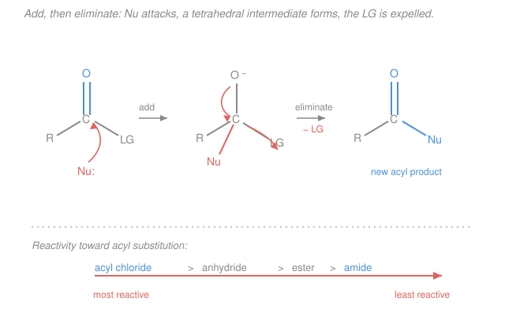

# Organic Chemistry · Lesson 3.4: Carboxylic acids & derivatives — nucleophilic acyl substitution

> ⏱ ~15 min · Module 3: Reactions II (Aromatics, Carbonyls & Functional Groups) · Builds on: [3.3 Aldehydes & ketones: nucleophilic addition](03-03-aldehydes-ketones-nucleophilic-addition.md), [1.3 Acids & bases in organic chemistry](01-03-acids-bases-organic.md) · Unlocks: [3.5 Enols & enolates: the α-carbon](03-05-enols-enolates-alpha-carbon.md)

## Why this matters

Every amide bond in every protein, every ester in every fat and every fragrance, every drug your liver hydrolyzes — all of them are made and unmade by *one* reaction family. In [3.3](03-03-aldehydes-ketones-nucleophilic-addition.md) a nucleophile hit a carbonyl and *stayed*, because the carbonyl carbon had nothing to give up. Give that carbon a **leaving group** and the story changes: the nucleophile adds, then something *leaves*, and you've swapped one group for another. That's **nucleophilic acyl substitution**, and once you see the single mechanism plus the one reactivity ranking, the entire zoo of acyl chlorides, esters, and amides collapses into a single predictable pattern.

## The idea

An **acyl group** is the fragment $\ce{R-C(=O)-}$ — a carbonyl carbon with a chain attached. A **carboxylic acid derivative** is that acyl group carrying a heteroatom leaving group: $\ce{-Cl}$ (acyl chloride), $\ce{-OCOR}$ (anhydride), $\ce{-OR}$ (ester), $\ce{-NR2}$ (amide). The carboxylic acid $\ce{-OH}$ itself sits in this family too.

Here's the whole difference from an aldehyde or ketone. When a nucleophile attacks a ketone, it forms a tetrahedral alkoxide and *stops* — there's no good group to kick out (kicking out $\ce{H-}$ or $\ce{R-}$ would be disastrous). But a derivative's carbonyl carbon is holding a group that *is* happy to leave. So the tetrahedral intermediate doesn't sit there: it collapses back to a C=O double bond by **expelling the leaving group**. Net effect — the nucleophile has *replaced* the leaving group. Add, then eliminate.

Two steps, and you already know both. Step one is exactly the nucleophilic addition from [3.3](03-03-aldehydes-ketones-nucleophilic-addition.md) — nucleophile in, C=O becomes C–O⁻, carbon goes tetrahedral. Step two is the new part — the tetrahedral intermediate reforms the C=O by pushing out the leaving group. This is why it's called **addition–elimination**.

The other half of the lesson is a single ranking: **which derivatives react, and which are sluggish**. Two forces set it. (1) **Leaving-group ability** — $\ce{Cl-}$ is a weak base and leaves easily; $\ce{-NR2}$ would have to leave as an amide ion, a terrible leaving group. (2) **Resonance donation** — the attached heteroatom donates a lone pair *into* the carbonyl, and the more it donates, the less electrophilic (and more stabilized) the carbon is. Nitrogen donates hard; chlorine barely donates. Both forces point the same way, giving one clean ladder.

## The formal version

**The mechanism (addition–elimination).** For a generic derivative $\ce{R-C(=O)-LG}$ and nucleophile $\ce{Nu-}$:

$$\ce{R-C(=O)-LG + Nu^- -> [R-C(O^-)(Nu)-LG] -> R-C(=O)-Nu + LG^-}$$

*In words: the nucleophile adds to the carbonyl carbon to make a tetrahedral intermediate (the bracketed species), which then collapses by ejecting the leaving group, regenerating the C=O — one group is swapped for another.* Contrast [3.3](03-03-aldehydes-ketones-nucleophilic-addition.md): there the tetrahedral species *is* the product; here it is a fleeting **intermediate**.

**The reactivity order.** From most to least reactive toward acyl substitution:

$$\text{acyl chloride} \;>\; \text{anhydride} \;>\; \text{ester} \approx \text{carboxylic acid} \;>\; \text{amide}.$$

*In words: acid chlorides react fastest and most violently; amides barely react at all.* The ranking is fixed by two cooperating effects on the atom attached to the carbonyl:

- **Leaving-group ability.** A group leaves well if its anion is a *weak* base (stable on its own — the pK$_a$ logic from [1.3](01-03-acids-bases-organic.md)). $\ce{Cl-}$ (conjugate base of strong $\ce{HCl}$) is excellent; carboxylate $\ce{RCOO-}$ is good; alkoxide $\ce{RO-}$ is mediocre; amide ion $\ce{R2N-}$ is awful.
- **Resonance donation.** The heteroatom's lone pair delocalizes into the carbonyl ($\ce{-\overset{..}{N}R2}$ pushing electron density onto the carbonyl oxygen — a resonance idea from [1.2 resonance & delocalization](01-02-resonance-formal-charge-delocalization.md)). Nitrogen is a strong donor → the amide carbonyl is heavily stabilized and un-electrophilic. Chlorine is electronegative and its 3p lone pair overlaps the carbon 2p poorly → weak donation → the acyl chloride carbon stays hungry.

Both effects rank the derivatives the same way, so the ladder is unambiguous.

**The master rule.** You can convert a **more-reactive** derivative into a **less-reactive** one, but not (easily) the reverse — because the reaction expels a *better* leaving group than the nucleophile you brought. Downhill on the ladder is easy; uphill needs force or a special trick.

**Carboxylic acid acidity (recap from [1.3](01-03-acids-bases-organic.md)).** A carboxylic acid $\ce{RCOOH}$ has $\mathrm{p}K_a \approx 4\text{–}5$ — millions of times more acidic than an alcohol ($\mathrm{p}K_a \approx 16$). *In words: it gives up its $\ce{-OH}$ proton readily.* The reason is resonance: the carboxylate $\ce{RCOO-}$ spreads the negative charge equally over **two** oxygens, so the conjugate base is unusually stable, which (by the equilibrium/pK$_a$ reasoning from gen-chem [acids, bases, pH & strength](../../general-chemistry/lessons/04-01-acids-bases-ph-strength.md)) is exactly what makes the acid strong.

## Picture

## Worked examples

**Example 1 (mechanical — acyl chloride to ester).** Acetyl chloride, $\ce{CH3COCl}$, plus methanol, $\ce{CH3OH}$. Methanol's oxygen lone pair attacks the carbonyl carbon → tetrahedral intermediate → chloride leaves (it's the best leaving group on the ladder) → then a proton is lost from the newly attached oxygen:

$$\ce{CH3COCl + CH3OH -> CH3COOCH3 + HCl}$$

The product is **methyl acetate**, an ester. Note the direction: acyl chloride (high on the ladder) → ester (lower). Downhill, so it's fast and essentially irreversible — chloride, once gone, is far too weak a nucleophile to climb back up.

**Example 2 (why you'd care — making the amide bond).** Swap in methylamine, $\ce{CH3NH2}$, as nucleophile: the nitrogen attacks, chloride leaves, a proton is lost, giving the amide $\ce{CH3CONHCH3}$ (*N*-methylacetamide) plus $\ce{HCl}$. This is the lab version of the reaction that builds *every peptide bond* in a protein — acyl group in, amine attacks, leaving group out. Because the amide sits at the *bottom* of the ladder, once you've made it, no ordinary nucleophile can undo it. That stability is precisely why nature stores its polymers (proteins) as amides and its energy-cheap linkers (fats) as esters.

## Watch out

- **You might think acyl substitution is just the [3.3](03-03-aldehydes-ketones-nucleophilic-addition.md) addition again.** The *first* step is identical, but a ketone has no leaving group, so it stops at the tetrahedral alcohol. A derivative's tetrahedral species is an *intermediate*, not the product — the leaving group makes it collapse. Same opening move, different ending.
- **You might try to run the ladder uphill.** Treating an amide with an alcohol will *not* give you an ester under normal conditions, and you cannot make an acyl chloride from an ester by adding chloride — you'd be expelling a *worse* leaving group ($\ce{RO-}$ or nothing) to install a better one. Uphill needs special reagents (e.g. $\ce{SOCl2}$), never a plain nucleophile.
- **You might expect Fischer esterification to go to completion.** It doesn't. Acid + alcohol is a *lateral* move (acid ≈ ester on the ladder), so it's a reversible **equilibrium** ($\ce{<=>}$) — you push it with excess alcohol or by removing water (Le Chatelier, straight from gen-chem [equilibrium & Le Chatelier](../../general-chemistry/lessons/03-04-chemical-equilibrium-k-le-chatelier.md)). Saponification, by contrast, is *irreversible* because it ends in the resonance-stabilized carboxylate.

## One-liner

> A carbonyl with a leaving group swaps that group for a nucleophile by adding then eliminating — and the ladder acyl chloride > anhydride > ester > amide only runs downhill.

## Problems

**P1 (🟢)** Rank the four neutral derivatives — ester, amide, acyl chloride, anhydride — from most to least reactive toward nucleophilic acyl substitution. Then give the product of acetyl chloride ($\ce{CH3COCl}$) with (a) methanol and (b) methylamine.

**P2 (🟡)** Write the saponification of ethyl acetate, $\ce{CH3COOCH2CH3}$, with $\ce{NaOH}$ (name and give the two products). Explain in one or two sentences why saponification runs to completion while the acid-catalyzed Fischer esterification of a carboxylic acid with an alcohol is only an equilibrium.

**P3 (🔴)** Explain *why* the amide is the least reactive derivative — cite both the resonance and the leaving-group effect — and use the reactivity ladder to explain why you cannot make an acyl chloride directly from an amide.

Solutions

**P1** Reactivity order (most → least):

$$\text{acyl chloride} \;>\; \text{anhydride} \;>\; \text{ester} \;>\; \text{amide}.$$

Governed by leaving-group ability and resonance donation, which agree: $\ce{Cl-}$ leaves best and donates least (most reactive); $\ce{-NR2}$ leaves worst and donates most (least reactive).

Products of acetyl chloride:
- (a) with methanol → the **ester methyl acetate**, $\ce{CH3COOCH3}$, plus $\ce{HCl}$:
$$\ce{CH3COCl + CH3OH -> CH3COOCH3 + HCl}$$
- (b) with methylamine → the **amide *N*-methylacetamide**, $\ce{CH3CONHCH3}$, plus $\ce{HCl}$ (in practice a second equivalent of amine mops up the $\ce{HCl}$):
$$\ce{CH3COCl + CH3NH2 -> CH3CONHCH3 + HCl}$$
Both are downhill moves (acyl chloride is highest on the ladder), so both are fast and effectively irreversible.

**P2** Saponification of ethyl acetate:

$$\ce{CH3COOCH2CH3 + NaOH -> CH3COO^- Na^+ + CH3CH2OH}$$

Products: **sodium acetate** (the carboxylate salt) and **ethanol**. Hydroxide adds to the carbonyl, ethoxide is expelled (addition–elimination), and ethoxide immediately deprotonates the acetic acid — locking the product in as the very stable carboxylate anion.

Why it goes to completion: the final carboxylate is resonance-stabilized (charge over two oxygens, from [1.3](01-03-acids-bases-organic.md)) and *not* nucleophilic enough to be attacked by ethanol, so there is no back-reaction — the last deprotonation step is a thermodynamic sink. Fischer esterification (acid + alcohol, acid-catalyzed) is a *neutral* lateral swap on the ladder with no such trap: water is produced and can attack the ester to reverse it, so the system settles at an **equilibrium** ($\ce{<=>}$) rather than running to completion. You drive it forward only by Le Chatelier — excess alcohol or removing water.

**P3** *Why amides are least reactive.* Two cooperating effects:
1. **Resonance donation.** Nitrogen is a strong π-donor: its lone pair delocalizes into the carbonyl ($\ce{-\overset{..}{N}R2 -> -\overset{+}{N}R2=C-O-}$), giving the C–N bond partial double-bond character. This drains electrophilicity from the carbonyl carbon (a nucleophile is less attracted) and stabilizes the ground state, so there is little thermodynamic push to react.
2. **Leaving-group ability.** To complete substitution, nitrogen would have to depart as an amide ion $\ce{R2N-}$ — the conjugate base of an amine ($\mathrm{p}K_a$ of the N–H around 35–40), hence an extremely strong base and a terrible leaving group. The tetrahedral intermediate has nothing good to expel, so it just reverts.

*Why you can't make an acyl chloride from an amide directly.* An acyl chloride sits at the **top** of the ladder and an amide at the **bottom**. Substitution only runs downhill — it expels a *better* (weaker-base) leaving group than the incoming nucleophile. Making an acyl chloride from an amide would mean expelling the awful leaving group $\ce{R2N-}$ to install $\ce{Cl-}$, i.e. climbing from the least-reactive to the most-reactive derivative. No ordinary chloride nucleophile can do that; it's thermodynamically and kinetically uphill.

## Flashback

**From Lesson 3.3 (Aldehydes & ketones: nucleophilic addition):** Cyanide, $\ce{CN-}$, adds to acetaldehyde, $\ce{CH3CHO}$. Draw the tetrahedral species that forms, and explain why the reaction *stops* there rather than expelling a group the way an ester would.

Solution

Cyanide's carbon attacks the carbonyl carbon; the C=O π electrons shift onto oxygen. The tetrahedral species is the alkoxide

$$\ce{CH3-CH(O^-)-CN}$$

(a cyanohydrin alkoxide; protonation of the $\ce{O-}$ on workup gives the cyanohydrin $\ce{CH3CH(OH)CN}$).

It stops here because acetaldehyde has **no leaving group**. The only groups on the former carbonyl carbon are $\ce{H-}$, $\ce{CH3-}$ (both would have to leave as hydride or a carbanion — impossibly strong bases), $\ce{-O-}$, and the newly added $\ce{-CN}$. None can be expelled to reform the C=O, so the tetrahedral intermediate *is* the product — pure nucleophilic **addition**. In an ester, the extra $\ce{-OR}$ group *is* a viable leaving group, so the analogous tetrahedral species collapses by elimination — that is the whole difference between [3.3](03-03-aldehydes-ketones-nucleophilic-addition.md)'s addition and this lesson's addition–elimination.

## Connections

- **Backward:** the first step reuses [3.3](03-03-aldehydes-ketones-nucleophilic-addition.md)'s nucleophilic addition and its tetrahedral intermediate; the reactivity ladder rests on leaving-group/pK$_a$ reasoning from [1.3](01-03-acids-bases-organic.md) and resonance donation from [1.2](01-02-resonance-formal-charge-delocalization.md); carboxylate stability is the same delocalization argument, and Fischer vs. saponification is the equilibrium/Le Chatelier logic from gen-chem [equilibrium & Le Chatelier](../../general-chemistry/lessons/03-04-chemical-equilibrium-k-le-chatelier.md).
- **Forward:** [3.5 Enols & enolates](03-05-enols-enolates-alpha-carbon.md) turns to the *other* reactive site of a carbonyl — the α-carbon — and esters' α-positions drive the Claisen condensation, an acyl substitution *and* an enolate reaction fused together.
- **Sideways (biochemistry):** the amide bond is the peptide bond of proteins and the ester is the linkage in fats and nucleic-acid backbones — see the [biochemistry syllabus](../../biochemistry/syllabus.md); enzymes are catalysts that make these normally-sluggish hydrolyses happen at body temperature by stabilizing exactly the tetrahedral intermediate drawn above.
