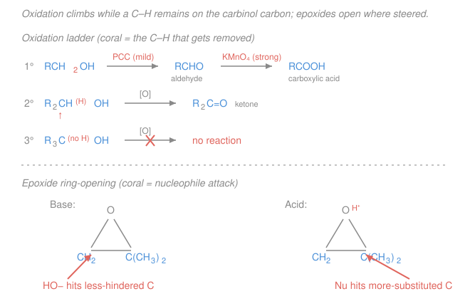

# Organic Chemistry · Lesson 3.6: Alcohols, ethers & amines

> ⏱ ~15 min · Module 3: Reactions II (Aromatics, Carbonyls & Functional Groups) · Builds on: [2.2 SN2](02-02-nucleophilic-substitution-sn2.md), [2.3 SN1](02-03-sn1-carbocation-rearrangements.md), [3.3 carbonyl addition](03-03-aldehydes-ketones-nucleophilic-addition.md), [1.3 organic acids & bases](01-03-acids-bases-organic.md) · Unlocks: [4.1 IR & mass spectrometry](04-01-ir-mass-spectrometry.md)

## Why this matters

Carbon frameworks are inert; the interesting chemistry lives on the heteroatoms hanging off them. Three families dominate: **alcohols** ($\ce{-OH}$), **ethers** ($\ce{-O-}$), and **amines** ($\ce{-N}$). Between them they are the hinge of most synthesis — an alcohol is where a Grignard or a carbonyl reduction *lands* ([3.3](03-03-aldehydes-ketones-nucleophilic-addition.md)), and it's the launchpad *from* which you reach alkyl halides, alkenes, ethers, aldehydes, ketones, and acids. Amines are the nitrogen half of every peptide bond, every alkaloid drug, and half of biochemistry. This lesson is the junction box of the whole course: master how these three behave and you can steer molecules almost anywhere.

## The idea

The trick to all three families is a single question you already know from [1.3](01-03-acids-bases-organic.md): **where do the lone pairs and the polar bonds want to go?**

An **alcohol** is a chemical chameleon. Its O–H can give up a proton (weakly acidic), its lone pairs can grab a proton (weakly basic), and those same lone pairs can attack an electrophile (nucleophilic). Which face it shows depends entirely on what you put it next to. The one move that unlocks most alcohol chemistry is a cheat: $\ce{OH}$ is a *terrible* leaving group (you'd expel hydroxide), but **protonate it** and it leaves as water — a great leaving group. That one trick powers substitution and dehydration.

An **ether** is what you get when you cap both ends: R–O–R has no O–H to lose and no easy leaving group. So ethers mostly *do nothing* — which is exactly why they make superb solvents. The exception is the **epoxide**: bend that same C–O–C into a strained three-membered ring and it becomes a coiled spring, desperate to be opened by any nucleophile.

An **amine** is nitrogen's lone pair looking for a proton or a positive carbon. It's the best everyday **base** in organic chemistry (conjugate acid $\mathrm{p}K_a \approx 10$–$11$) and a strong **nucleophile** — the same lone pair does both jobs.

## The formal version

### Alcohols

**Acidity.** An alcohol's O–H has $\mathrm{p}K_a \approx 16$–$18$, comparable to water ($15.7$). Remove the proton with a strong base (e.g. $\ce{NaH}$ or $\ce{Na}$ metal) to get an **alkoxide** $\ce{RO-}$:

$$\ce{ROH + NaH -> RO^- Na+ + H2}$$

*In words: alcohols are weak acids; their conjugate base, alkoxide, is a strong base and a strong nucleophile* — the reagent we'll use for ether synthesis below. (This is the same equilibrium/$\mathrm{p}K_a$ reasoning from general chemistry [acids & bases](../../general-chemistry/lessons/04-01-acids-bases-ph-strength.md), applied to O–H.)

**Basicity / activation.** Protonate the oxygen and $\ce{-OH}$ becomes $\ce{-OH2+}$, whose leaving group is neutral water. This is the enabling step for:

**(1) Conversion to alkyl halides.** With $\ce{HX}$, or better with $\ce{SOCl2}$ (→ R–Cl) and $\ce{PBr3}$ (→ R–Br):

$$\ce{ROH ->[\text{SOCl2}] RCl} \qquad \ce{ROH ->[\text{PBr3}] RBr}$$

*In words: $\ce{SOCl2}$ and $\ce{PBr3}$ turn the bad $\ce{OH}$ leaving group into a good halide-displaceable one under mild conditions* — the standard way to make a halide when you'll need a leaving group later.

**(2) Dehydration to alkenes.** Hot acid ($\ce{H2SO4}$, $\Delta$) protonates the OH, water leaves to give a carbocation, and loss of a neighboring proton gives an alkene — this is **E1**, and it follows **Zaitsev** (the more-substituted, more-stable alkene dominates), exactly as in [2.4](02-04-elimination-e1-e2-choosing.md):

$$\ce{RCH2CH(OH)R' ->[\text{H2SO4}][\Delta] RCH=CHR' + H2O}$$

**(3) Oxidation.** The signature reaction, summarized by the ladder in the Picture. Oxidation removes an **H from the carbinol carbon** (the C bearing OH) and forms a C=O. So it can only climb as long as that carbon still has an H:

- **Primary** ($\ce{RCH2OH}$): a mild oxidant — **PCC** (pyridinium chlorochromate) — stops at the **aldehyde** $\ce{RCHO}$; a strong oxidant — **$\ce{KMnO4}$** or **Jones** ($\ce{CrO3/H2SO4}$) — pushes all the way to the **carboxylic acid** $\ce{RCOOH}$.
- **Secondary** ($\ce{R2CHOH}$): any oxidant gives the **ketone** $\ce{R2C=O}$ and stops (no more H to lose, and C–C bonds don't break here).
- **Tertiary** ($\ce{R3COH}$): **no reaction** — no C–H on the carbinol carbon.

*In words: primary can go two rungs (aldehyde, then acid), secondary one rung (ketone), tertiary none.* PCC is the "stop at aldehyde" tool; $\ce{KMnO4}$/Jones is the "go all the way" tool.

### Ethers

**Inertness & synthesis.** R–O–R has no acidic H and no good leaving group, so it is unreactive toward base, oxidant, and nucleophile — why diethyl ether and THF are ubiquitous solvents. You *make* ethers by the **Williamson ether synthesis**: an alkoxide displaces a halide by **SN2** ([2.2](02-02-nucleophilic-substitution-sn2.md)):

$$\ce{RO^- + R'CH2X -> RO-CH2R' + X^-}$$

*In words: alkoxide + a primary (unhindered) alkyl halide gives the ether by backside attack.* Because it's SN2, the halide partner must be **methyl or primary** — a tertiary halide would just eliminate (E2). To make an unsymmetrical ether, always pair the alkoxide of the bulky group with the **least-hindered** halide.

**Epoxides.** A three-membered cyclic ether. Its ~$60^\circ$ bond angles hold huge ring strain, so nucleophiles pry it open, relieving the strain. The **regiochemistry flips with conditions**:

- **Basic / neutral** ($\ce{OH-}$, $\ce{RO-}$, Grignard): the nucleophile attacks the **less-hindered** carbon — a clean **SN2**, steered by sterics.
- **Acidic** ($\ce{H3O+}$, then Nu): the ring oxygen protonates first; the C–O bond to the **more-substituted** carbon stretches because that carbon best stabilizes the developing positive charge, so the nucleophile attacks **there** — SN1-like, steered by carbocation stability ([2.3](02-03-sn1-carbocation-rearrangements.md)).

*In words: base → less-substituted carbon (sterics win); acid → more-substituted carbon (charge stability wins).*

### Amines

**Basicity.** Nitrogen's lone pair grabs protons; the conjugate acid (an **ammonium ion** $\ce{R3NH+}$) has $\mathrm{p}K_a \approx 10$–$11$. Compare that to an alcohol's protonated oxygen ($\mathrm{p}K_a \approx -2$): nitrogen is far more willing to hold the lone pair up for a proton, because N is less electronegative than O.

$$\ce{RNH2 + H+ <=> RNH3+}$$

*In words: amines are the strongest common organic bases; treating one with acid makes a water-soluble ammonium salt* — the basis of drug formulation and of separating amines from neutral compounds.

**Aliphatic vs aromatic.** An **aliphatic** amine (lone pair localized on N) is markedly more basic than an **aromatic** amine like **aniline** ($\ce{C6H5NH2}$), whose lone pair is **delocalized into the ring** by resonance ([1.2](01-02-resonance-formal-charge-delocalization.md)). A lone pair spread across the ring is less available to bond a proton, so aniline's conjugate acid has $\mathrm{p}K_a \approx 4.6$ — about a million times less basic than a typical alkylamine.

**Nucleophilicity.** The same lone pair attacks electrophilic carbons. With aldehydes/ketones ([3.3](03-03-aldehydes-ketones-nucleophilic-addition.md)) a primary amine gives an **imine** ($\ce{C=N}$) and a secondary amine gives an **enamine**; with acyl derivatives ([3.4](03-04-carboxylic-acids-derivatives-acyl-substitution.md)) an amine gives an **amide**.

## Picture

## Worked examples

**Example 1 (mechanical — pick the oxidation product).** Oxidize 1-butanol ($\ce{CH3CH2CH2CH2OH}$, primary).
- With **PCC**: stops at the aldehyde, **butanal** $\ce{CH3CH2CH2CHO}$.
- With **$\ce{KMnO4}$** (or Jones): climbs to **butanoic acid** $\ce{CH3CH2CH2COOH}$.

Now 2-butanol ($\ce{CH3CH(OH)CH2CH3}$, secondary) with any oxidant gives **butan-2-one** $\ce{CH3COCH2CH3}$ and stops. And 2-methyl-2-propanol ($\ce{(CH3)3COH}$, tertiary) gives **nothing** — no carbinol C–H.

**Example 2 (why you'd care — build a target).** You want the ether **tert-butyl methyl ether**, $\ce{(CH3)3C-O-CH3}$ (an antiknock fuel additive). Two Williamson routes are conceivable:

1. tert-butoxide $\ce{(CH3)3CO-}$ + $\ce{CH3I}$ (methyl halide) → **works**: SN2 on an unhindered methyl carbon.
2. methoxide $\ce{CH3O-}$ + $\ce{(CH3)3CBr}$ (tertiary halide) → **fails**: SN2 can't attack a crowded tertiary carbon, and a strong base + tertiary halide just does **E2** to give isobutylene.

So route 1 is correct: **put the bulk on the alkoxide, the simplicity on the halide.** This is the whole planning rule for unsymmetrical ethers, and it's a direct consequence of the SN2 steric sensitivity from [2.2](02-02-nucleophilic-substitution-sn2.md).

## Watch out

- **You might think a stronger oxidant makes a "better" aldehyde.** Backwards — a *strong* oxidant ($\ce{KMnO4}$/Jones) blows past the aldehyde to the carboxylic acid. To *stop* at the aldehyde you need the *mild* reagent, **PCC** (anhydrous). Strength here means "goes further," not "cleaner."
- **You might expect base-catalyzed epoxide opening to hit the more-substituted carbon** (as if it were a carbocation). It doesn't. Under basic conditions there is no cation — it's a plain SN2, so sterics rule and the nucleophile takes the **less**-hindered carbon. The more-substituted carbon is favored only under **acid**, where positive charge is developing.
- **You might rank aniline as a normal amine.** Its lone pair is tied up in ring resonance, so it's a *much* weaker base (and nucleophile) than an alkylamine. Delocalization = unavailability.
- **You might try to make an ether from a tertiary halide.** Williamson is SN2-only; a 3° (or even hindered 2°) halide eliminates instead. Keep the halide primary.

## One-liner

> Protonate an alcohol and $\ce{OH}$ leaves as water; oxidation climbs the ladder only while a carbinol C–H remains; alkoxides build ethers by SN2 and epoxides open where the conditions steer (base → less-hindered, acid → more-substituted); amines are the lone-pair base, weakened when that pair delocalizes into a ring.

## Problems

**P1 (🟢)** Give the organic oxidation product of each, or state "no reaction":
(a) 1-propanol $\ce{CH3CH2CH2OH}$ with **PCC**;
(b) the same 1-propanol with **$\ce{KMnO4}$**;
(c) cyclohexanol (a secondary alcohol) with Jones reagent;
(d) 2-methyl-2-butanol $\ce{CH3CH2C(CH3)2OH}$ (tertiary) with $\ce{KMnO4}$.

**P2 (🟡)** You need to synthesize **benzyl ethyl ether**, $\ce{C6H5CH2-O-CH2CH3}$, by a Williamson ether synthesis. Give the alkoxide and the alkyl halide you'd combine, name the mechanism, and explain in one line why the other pairing would be worse. (Both fragments here are primary — say what still guides the choice.)

**P3 (🔴)** 2,2-dimethyloxirane (an epoxide: a three-membered ring of O, a $\ce{CH2}$, and a $\ce{C(CH3)2}$) is opened by methanol.
(a) Under **basic** conditions ($\ce{NaOCH3}$), which carbon does methoxide attack, and what's the product's substitution pattern at that carbon?
(b) Under **acidic** conditions ($\ce{CH3OH, H2SO4}$), which carbon is attacked instead? Explain both in one sentence each.

Solutions

**P1**
(a) PCC is mild and stops at the aldehyde: **propanal**, $\ce{CH3CH2CHO}$.
(b) $\ce{KMnO4}$ is a strong oxidant, so a primary alcohol climbs both rungs to the acid: **propanoic acid**, $\ce{CH3CH2COOH}$.
(c) A secondary alcohol gives the ketone and stops: **cyclohexanone**. (Jones/$\ce{KMnO4}$ makes no difference for a 2° alcohol — there's only one rung.)
(d) Tertiary alcohol, no carbinol C–H: **no reaction**.

**P2** Combine **sodium ethoxide** $\ce{CH3CH2O-}$ with **benzyl bromide** $\ce{C6H5CH2Br}$ (or benzyl chloride), by **SN2** (Williamson).

$$\ce{CH3CH2O^- + C6H5CH2Br -> C6H5CH2-O-CH2CH3 + Br^-}$$

Both candidate halides here (benzyl and ethyl) are primary, so either pairing "works," but **benzylic halides are especially reactive in SN2** (the adjacent ring stabilizes the transition state), so alkoxide + benzyl halide is the faster, higher-yielding choice. The general rule still holds: never make the *halide* the more-hindered partner. (The truly bad pairing would use a tertiary halide, which would eliminate — not an option here, but the principle to state.)

**P3** The epoxide carbons are $\ce{CH2}$ (less substituted) and $\ce{C(CH3)2}$ (more substituted, tertiary).

(a) **Basic:** methoxide attacks the **less-hindered $\ce{CH2}$** carbon in a clean SN2 — there's no positive charge, so sterics decide, and the small $\ce{CH2}$ is easiest to reach. The $\ce{OCH3}$ ends up on the primary carbon; the O (now $\ce{OH}$) sits on the tertiary carbon.

(b) **Acidic:** the ring O is protonated first, and the C–O bond to the **more-substituted $\ce{C(CH3)2}$** stretches because that carbon best supports the developing positive charge (like a 3° carbocation, [2.3](02-03-sn1-carbocation-rearrangements.md)). Methanol therefore attacks the **tertiary** carbon. So the two conditions install the incoming nucleophile on **opposite** carbons of the same epoxide — the classic regiochemistry switch.

## Flashback

**From Lesson 2.2 (Nucleophilic substitution, SN2):** Rank these three substrates by their rate in an SN2 reaction with $\ce{CN-}$, fastest to slowest, and say in one phrase why: bromomethane $\ce{CH3Br}$, 1-bromopropane $\ce{CH3CH2CH2Br}$, and 2-bromo-2-methylpropane $\ce{(CH3)3CBr}$.

Solution

**Fastest → slowest:** $\ce{CH3Br}$ > $\ce{CH3CH2CH2Br}$ > $\ce{(CH3)3CBr}$.

SN2 goes by **backside attack**, so the reaction slows as the carbon gets more crowded: methyl (no substituents blocking) is fastest, primary next, and the tertiary halide is effectively unreactive toward SN2 — its three methyls wall off the backside (and it would prefer SN1/E1 instead). This is exactly the steric rule that forces the Williamson ether synthesis to use a primary halide.

## Connections

- **Backward:** alkoxide formation is the acid/base $\mathrm{p}K_a$ reasoning of [1.3](01-03-acids-bases-organic.md); dehydration reuses E1 + Zaitsev from [2.4](02-04-elimination-e1-e2-choosing.md); Williamson and base-catalyzed epoxide opening are SN2 ([2.2](02-02-nucleophilic-substitution-sn2.md)) while acid-catalyzed opening is the carbocation logic of SN1 ([2.3](02-03-sn1-carbocation-rearrangements.md)); aniline's weak basicity is resonance delocalization from [1.2](01-02-resonance-formal-charge-delocalization.md).
- **Forward:** the O–H and N–H bonds and the C=O of your oxidation products are exactly the groups you'll fingerprint in [4.1 IR & mass spectrometry](04-01-ir-mass-spectrometry.md) (broad O–H stretch ~$3300\ \mathrm{cm^{-1}}$, C=O ~$1700\ \mathrm{cm^{-1}}$), and the interconversions here are the toolkit for [4.4 retrosynthesis](04-04-retrosynthetic-analysis-multistep-synthesis.md).
- **Sideways:** amine → carbonyl condensations (imines, enamines, amides) are the nitrogen chemistry that builds proteins — the amide bond reappears in [biochemistry](../../biochemistry/syllabus.md); alcohol oxidation levels ($\text{alcohol} \to \text{aldehyde} \to \text{acid}$) are the same oxidation-state bookkeeping used for metabolic pathways there.
