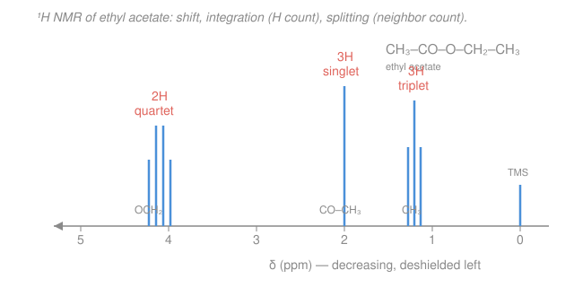

# Organic Chemistry · Lesson 4.2: ¹H NMR spectroscopy

> ⏱ ~15 min · Module 4: Structure Determination & Synthesis · Builds on: [4.1 IR & mass spectrometry](04-01-ir-mass-spectrometry.md) · Unlocks: [4.3 ¹³C NMR & the structure workflow](04-03-c13-nmr-structure-workflow.md)

## Why this matters

Mass spec gave you the molecular formula and IR flagged the functional groups ([4.1](04-01-ir-mass-spectrometry.md)). But neither tells you how the atoms are *wired together*. Proton NMR does — it is the single most information-dense tool in the organic chemist's kit, and it reads out the **hydrogen framework** of a molecule: how many kinds of H there are, how many of each, and who sits next to whom. Learn to read the four signals a spectrum hands you and you can reconstruct a structure from a formula and a squiggle. This is the heart of Boss Problem 4, and the skill every synthesis paper assumes you have.

## The idea

A hydrogen nucleus (a proton) is a tiny magnet. Drop a molecule into a strong magnetic field and every proton lines up with or against the field; nudge it with a radio pulse and it flips, absorbing energy at a frequency that depends on the *exact magnetic field that proton actually feels*. Here is the crucial part: the field a proton feels is **not** the field you applied. The electrons swirling around it set up their own tiny opposing field, **shielding** it. Pull electron density away — hang an electronegative atom nearby — and the proton is **deshielded**, feels more of the applied field, and resonates at a different frequency.

So the spectrum is a map of proton *environments*. Four readings come off it, and each answers a different question:

1. **Chemical shift** — *what kind of neighborhood* is this proton in? (electron-rich or electron-poor)
2. **Integration** — *how many* protons of that kind are there?
3. **Multiplicity (splitting)** — *how many* protons sit on the *adjacent* carbon?
4. **Number of signals** — *how many distinct kinds* of proton the molecule has (set by symmetry).

Chain those four together and each signal names a fragment. Assemble the fragments and you have the molecule.

## The formal version

**1. Chemical shift ($\delta$, ppm).** The horizontal position of a signal, reported as $\delta$ in parts per million (ppm) relative to the reference **tetramethylsilane** (TMS, $\ce{(CH3)4Si}$), defined as $\delta = 0$. Using ppm — a ratio — makes the number independent of the spectrometer's field strength. *In words: $\delta$ tells you how deshielded a proton is; bigger $\delta$ (farther left) means more electron-poor.* A working table to memorize:

| Proton type | $\delta$ (ppm) |
|---|---|
| TMS reference | $0$ |
| alkyl $\ce{C-H}$ (e.g. $\ce{CH3}$, $\ce{CH2}$) | $0.9\text{–}1.5$ |
| allylic / $\alpha$-to-carbonyl ($\ce{C-H}$ next to $\ce{C=C}$ or $\ce{C=O}$) | $2.0\text{–}2.5$ |
| $\ce{C-H}$ next to O or N (e.g. $\ce{OCH2}$, $\ce{OCH3}$) | $3.3\text{–}4.1$ |
| vinyl ($\ce{C=C-H}$) | $5\text{–}6.5$ |
| aromatic ($\ce{Ar-H}$) | $6.5\text{–}8$ |
| aldehyde ($\ce{CHO}$) | $9.5\text{–}10$ |
| carboxylic acid ($\ce{COOH}$) | $10\text{–}12$ |

Two things push $\delta$ up: an **electronegative neighbor** (O, N, halogen — it drains electron density inductively) and **anisotropy** — the circulating $\pi$ electrons of an aromatic ring or carbonyl generate a local field that strongly deshields protons in their plane. That anisotropy is why aromatic and aldehyde H's sit so far downfield.

**2. Integration.** The **area** under a signal is proportional to the number of protons producing it. *In words: a peak twice as big means twice as many equivalent H's.* Integration gives **ratios**, not absolute counts — a $3:2:3$ integration in a molecule with 8 hydrogens means 3, 2, and 3 protons; the same ratio in a 16-H molecule would mean 6, 4, 6. Reconcile the ratio against the molecular formula.

**3. Multiplicity — the $n+1$ rule.** A signal is split into a cluster of peaks by the protons on *neighboring* carbons. The rule:

$$\text{number of peaks} = n + 1,$$

where $n$ is the number of equivalent protons on the **adjacent** carbon(s). *In words: count the H's on the next carbon over, add one — that's how many lines your signal splits into.* The names: 1 peak = **singlet** ($n=0$, no neighbors), 2 = **doublet**, 3 = **triplet**, 4 = **quartet**, and so on. The spacing between the split lines is the **coupling constant** $J$ (in Hz) — two protons that split each other share the *same* $J$, which is how you pair them up. The peak intensities within a multiplet follow Pascal's triangle ($1{:}1$ doublet, $1{:}2{:}1$ triplet, $1{:}3{:}3{:}1$ quartet).

Two signature patterns to recognize instantly:

- **Ethyl group** ($\ce{-CH2-CH3}$): the $\ce{CH3}$ (3H) sees 2 neighbors → **triplet**; the $\ce{CH2}$ (2H) sees 3 neighbors → **quartet**. A **triplet + quartet in a 3:2 integration ratio** *is* an ethyl group. Memorize this shape.
- **Isopropyl group** ($\ce{-CH(CH3)2}$): the two equivalent $\ce{CH3}$'s (6H) see 1 neighbor → **doublet**; the lone $\ce{CH}$ sees 6 neighbors → **septet** (7 lines).

(Two caveats baked into the rule: protons only split *inequivalent* neighbors — equivalent protons don't split each other — and O–H / N–H protons usually exchange too fast to show coupling, appearing as broad singlets.)

**4. Equivalent protons.** Protons related by molecular **symmetry** are chemically equivalent and give a **single** signal. *In words: if you could swap two H's by a rotation or mirror and get the identical molecule, they resonate at the same place.* The three H's of a $\ce{CH3}$ are equivalent (free rotation); the six H's of benzene are equivalent (ring symmetry). So the **number of signals = number of distinct proton environments**. Counting environments is the first thing you do with any structure.

## Picture

## Worked examples

**Example 1 (mechanical — count environments and split).** Predict the ¹H NMR of **1,1-dichloroethane**, $\ce{CH3-CHCl2}$.

Two distinct environments: the $\ce{CH3}$ (3 equivalent H's) and the lone $\ce{CHCl2}$ proton. So **two signals**.

- $\ce{CH3}$: its neighbor carbon bears 1 H → $n=1$ → **doublet**, integrating 3H. It's a plain alkyl group, $\delta \approx 2.0$.
- $\ce{CHCl2}$: its neighbor carbon bears 3 H's → $n=3$ → **quartet**, integrating 1H. Flanked by two electronegative chlorines, it's strongly deshielded, $\delta \approx 5.9$.

Result: a doublet (3H) far upfield and a quartet (1H) far downfield — the same triplet/quartet *logic* as an ethyl group, but with a $3\ :\ 1$ integration and one partner dragged downfield by the chlorines.

**Example 2 (the full reasoning chain — formula to structure).** You have $\ce{C4H8O2}$ and a spectrum with three signals:

| $\delta$ (ppm) | integration | multiplicity |
|---|---|---|
| $4.1$ | 2H | quartet |
| $2.0$ | 3H | singlet |
| $1.2$ | 3H | triplet |

Read it piece by piece:

- The **triplet (3H) at 1.2** and the **quartet (2H) at 4.1** are a triplet + quartet pair in a $3:2$ ratio — an **ethyl group** $\ce{-CH2CH3}$. The $\ce{CH2}$ sits at 4.1, deep in the "next to O" window, so this is an **$\ce{-O-CH2CH3}$** (ethoxy) unit.
- The **singlet (3H) at 2.0** is 3 protons with *no* neighbors (a singlet means $n=0$), and $\delta \approx 2.0$ is the $\alpha$-to-carbonyl window. That's a $\ce{CH3}$ attached to something with no H's on it — a $\ce{CH3-C=O}$ **acetyl** group. It's a singlet precisely because the carbonyl carbon carries no protons to split it.
- Assemble: acetyl + O-ethyl = $\ce{CH3-CO-O-CH2CH3}$, **ethyl acetate**. Check the formula: $\ce{C4H8O2}$ ✓, and two oxygens fit the ester ($\ce{C=O}$ plus $\ce{C-O}$). IR would confirm with a strong band near $1740\ \mathrm{cm^{-1}}$ ([4.1](04-01-ir-mass-spectrometry.md)).

That chain — **shift + integration + splitting → fragment**, then assemble — is the whole method.

## Watch out

- **You might think splitting counts the protons *in* the signal.** It doesn't — the $n+1$ rule counts the H's on the **neighboring** carbon, not the ones producing the signal. A $\ce{CH2}$ appearing as a quartet has *2* protons but *3* neighbors.
- **You might expect an $\ce{OH}$ or $\ce{NH}$ to split its neighbors like any C–H.** Usually it doesn't — these protons exchange rapidly (especially with traces of water/acid) and typically show up as a **broad singlet** that neither splits nor is split. Don't hunt for coupling that isn't there.
- **You might read integration as an absolute head-count.** It's a **ratio**. A $2:2$ integration and a $1:1$ integration look identical on paper; only the molecular formula tells you which. Always divide the integrals down and reconcile with the formula.
- **You might forget symmetry collapses signals.** The six aromatic H's of benzene, or the two $\ce{CH3}$'s of isopropyl, are *one* environment each. Count environments, not atoms.

## One-liner

> A ¹H NMR spectrum reports, for each kind of proton, *where* it sits (shift → electronic neighborhood), *how many* there are (integration → ratio), and *how many* sit next door ($n+1$ splitting) — chain those and every signal names a fragment.

## Problems

**P1 (🟢)** For **1,1,2-trichloroethane**, $\ce{CHCl2-CH2Cl}$, predict the number of ¹H NMR signals and the multiplicity and integration of each. (Don't worry about exact $\delta$ values, just relative position.)

**P2 (🟡)** A compound gives two signals: a **triplet (3H) at $\delta\,1.3$** and a **quartet (2H) at $\delta\,3.4$**. The molecular formula is $\ce{C2H5Br}$. Identify the compound, assign each signal, and explain why the quartet sits downfield of the triplet.

**P3 (🔴 — Boss-4 rehearsal)** An unknown with formula $\ce{C4H8O2}$ gives exactly three signals: a **triplet ($\delta\,1.2$, 3H)**, a **singlet ($\delta\,2.0$, 3H)**, and a **quartet ($\delta\,4.1$, 2H)**. Deduce the full structure and assign *every* signal — state which proton each signal is, why it has that shift, and why it shows that multiplicity.

Solutions

**P1** Two distinct environments: the $\ce{CHCl2}$ proton and the $\ce{CH2Cl}$ protons → **two signals**.

- $\ce{CHCl2}$ (1H): its neighbor is the $\ce{CH2Cl}$ carbon, bearing 2 H's → $n=2$ → **triplet**, integration **1H**. Two chlorines on its own carbon make it the more deshielded (downfield) signal.
- $\ce{CH2Cl}$ (2H): its neighbor is the $\ce{CHCl2}$ carbon, bearing 1 H → $n=1$ → **doublet**, integration **2H**. One chlorine, so less deshielded (upfield of the other).

Answer: a **triplet (1H)** downfield and a **doublet (2H)** upfield. (Note the integration ratio is $1:2$, and the two protons split each other with a shared coupling constant $J$.)

**P2** The formula $\ce{C2H5Br}$ with a triplet/quartet pair in a $3:2$ ratio is the ethyl signature → the compound is **bromoethane (ethyl bromide)**, $\ce{CH3CH2Br}$.

- **Triplet, 3H, $\delta\,1.3$** = the $\ce{CH3}$. It has 2 neighboring H's (on the $\ce{CH2}$) → $n=2$ → triplet. Plain alkyl, so upfield near 1.3.
- **Quartet, 2H, $\delta\,3.4$** = the $\ce{CH2}$. It has 3 neighboring H's (on the $\ce{CH3}$) → $n=3$ → quartet.

The quartet is downfield because the $\ce{CH2}$ is bonded directly to **bromine**, an electronegative atom that pulls electron density away and **deshields** those protons (the $\ce{CH3}$ is one carbon further from Br, so it feels the pull much less). Same reasoning as an $\ce{OCH2}$ landing near 3.3–4.1 — the electronegative neighbor sets the shift.

**P3** This is Example 2 worked as a fresh deduction — the target is **ethyl acetate**, $\ce{CH3-CO-O-CH2-CH3}$.

Reasoning:
- *Degrees of unsaturation* from $\ce{C4H8O2}$: $\mathrm{DoU} = (2\cdot4 + 2 - 8)/2 = 1$ — one ring or double bond. Combined with two oxygens, an **ester carbonyl** ($\ce{C=O}$) is the natural fit.
- The **triplet (3H, 1.2) + quartet (2H, 4.1)** pair, $3:2$, is an **ethyl group**. The $\ce{CH2}$ at $\delta\,4.1$ is in the "next to oxygen" window → it's an **$\ce{-OCH2CH3}$** (ethoxy) attached to the ester oxygen.
- The **singlet (3H, 2.0)**: three protons with no neighboring H's ($n=0$ → singlet), at the $\alpha$-to-carbonyl shift → a $\ce{CH3}$ bonded to the carbonyl carbon, i.e. an **acetyl** $\ce{CH3C(=O)-}$. It is a singlet because the carbonyl carbon bears no hydrogens to couple to.

Assembling acetyl + ethoxy across the carbonyl: $\ce{CH3-CO-O-CH2-CH3}$ (formula $\ce{C4H8O2}$ ✓, DoU 1 ✓).

Full assignment:
- $\delta\,1.2$, **triplet, 3H** = the terminal $\ce{CH3}$ of the ethyl. Upfield (plain alkyl); split into a triplet by the 2 H's of the adjacent $\ce{CH2}$.
- $\delta\,2.0$, **singlet, 3H** = the acetyl $\ce{CH3-C=O}$. $\alpha$-to-carbonyl shift; a singlet because its neighbor carbon (the carbonyl) has no H's.
- $\delta\,4.1$, **quartet, 2H** = the $\ce{OCH2}$. Deshielded to ~4.1 by the attached ester oxygen; split into a quartet by the 3 H's of the adjacent $\ce{CH3}$.

The key coupling relationship: the **$\ce{OCH2}$ quartet and the $\ce{CH3}$ triplet are coupled to each other** (they share a coupling constant $J$ and split each other, being on adjacent carbons), while the **acetyl singlet is isolated** — separated from every other proton by the carbonyl carbon, so it couples to nothing.

## Flashback

**From Lesson 4.1 (IR & mass spectrometry):** A compound has molecular formula $\ce{C4H4O}$. (a) Compute its degrees of unsaturation. (b) Its IR shows a strong absorption at $1715\ \mathrm{cm^{-1}}$ and a sharp band near $2200\ \mathrm{cm^{-1}}$. Identify the two functional groups, and check they're consistent with your degree-of-unsaturation count.

Solution

(a) Degrees of unsaturation is $\mathrm{DoU} = (2c + 2 + n - h - x)/2$, where $c,h,n,x$ count C, H, N, and halogen atoms (oxygen doesn't enter). With $c=4$, $h=4$, $n=x=0$:

$$\mathrm{DoU} = \frac{2(4) + 2 - 4}{2} = \frac{6}{2} = 3.$$

Three degrees of unsaturation — some mix of rings and $\pi$ bonds totaling 3.

(b) The strong band at $1715\ \mathrm{cm^{-1}}$ is a **carbonyl** ($\ce{C=O}$) stretch (aldehyde/ketone region). The sharp band near $2200\ \mathrm{cm^{-1}}$ is a **$\ce{C#C}$ alkyne** stretch (the nitrile region overlaps here, but there's no nitrogen in the formula, so it's an alkyne).

Consistency check: $\ce{C=O}$ is 1 degree of unsaturation and $\ce{C#C}$ is 2 — total **3**, exactly matching the DoU. ✓ A structure that fits is **but-3-ynal**, $\ce{HC#C-CH2-CHO}$ ($\ce{C4H4O}$): the terminal alkyne gives the $2200\ \mathrm{cm^{-1}}$ band and the aldehyde gives the $1715\ \mathrm{cm^{-1}}$ band. The lesson: **IR bands and the DoU count must reconcile** — here they lock together perfectly.

## Connections

- **Backward:** shift is driven by the same electronegativity/electron-density reasoning behind inductive effects and acidity in [1.3](01-03-acids-bases-organic.md), and by the ring-current anisotropy of the aromatic systems in [3.1](03-01-aromaticity-huckel.md). Integration and formula-reconciliation lean on the degrees-of-unsaturation bookkeeping from [4.1](04-01-ir-mass-spectrometry.md).
- **Forward:** [4.3](04-03-c13-nmr-structure-workflow.md) adds ¹³C NMR — a complementary readout of the *carbon* skeleton — and combines IR + MS + ¹H + ¹³C into a single structure-elucidation workflow that Boss Problem 4 runs end to end.
- **Sideways:** NMR is nuclear-spin physics — protons are two-level quantum systems in a magnetic field, the same Zeeman splitting and resonance you meet in [`quantum-mechanics`](../../quantum-mechanics/syllabus.md). The medical imaging cousin (MRI) is this exact effect mapped over space.
