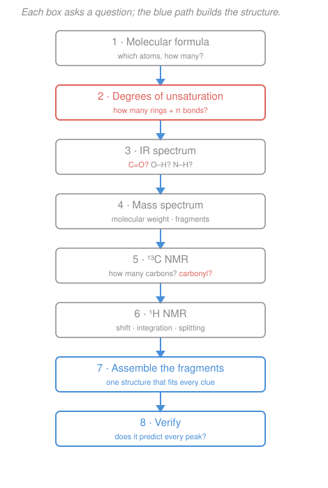

# Organic Chemistry · Lesson 4.3: ¹³C NMR & the structure-determination workflow

> ⏱ ~15 min · Module 4: Structure Determination & Synthesis · Builds on: [4.2 ¹H NMR spectroscopy](04-02-h-nmr-spectroscopy.md), [4.1 IR & mass spectrometry](04-01-ir-mass-spectrometry.md) · Unlocks: [4.4 Retrosynthetic analysis & multistep synthesis](04-04-retrosynthetic-analysis-multistep-synthesis.md)

## Why this matters

You now own four instruments: degrees of unsaturation (4.1), IR, MS, and ¹H NMR (4.2). Alone each gives a partial view — a functional group, a molecular weight, a proton count. The payoff of this module is learning to **stack them into a single verdict**: hand me four spectra of an unknown liquid and I hand you back its structure. This lesson adds the last instrument, **¹³C NMR** (which counts *carbon* skeletons the way ¹H NMR counts protons), and then gives you the **repeatable recipe** that ties all five together. This recipe *is* Boss Problem 4, and it is exactly how a working chemist confirms that the thing in the flask is the thing they meant to make — the natural handoff into synthesis in 4.4.

## The idea

¹H NMR looks at hydrogen; ¹³C NMR looks at the **carbon backbone directly**. Same physics as [4.2](04-02-h-nmr-spectroscopy.md) — nuclei in a magnetic field resonate at a frequency set by their electronic neighborhood — but tuned to the ¹³C nucleus (the ~1% of carbon that is magnetic). The single most useful fact: **the number of signals equals the number of chemically distinct carbons.** Carbons that symmetry makes identical give *one* shared peak; every inequivalent carbon gets its own. So a ¹³C spectrum is, first and foremost, a headcount of carbon *environments*.

Two things make ¹³C easier to read than ¹H. First, the shift window is huge — about $0$ to $220\ \mathrm{ppm}$ versus ¹H's cramped $0$–$12$ — so peaks rarely overlap and each shift range points cleanly at a carbon *type*. Second, spectra are almost always run **proton-decoupled**: the machine electronically erases carbon–hydrogen coupling, so every carbon collapses to a clean **singlet**. You lose the splitting information, but you gain a spectrum that's just a comb of single lines — you read it by *position* (what type of carbon) and *count* (how many types), nothing else.

The recipe at the end is the real lesson: a fixed order of questions that squeezes every drop of information from each spectrum before moving on, so the structure assembles itself.

## The formal version

**Number of signals = number of inequivalent carbons.** Two carbons are equivalent (share a peak) when a symmetry operation of the molecule maps one onto the other — the same equivalence idea you used for protons in [4.2](04-02-h-nmr-spectroscopy.md). *In words: count the distinct carbon "neighborhoods"; that's your peak count.*

**Chemical-shift ranges (memorize these bands).** Position tells you the carbon type:

| Carbon type | ¹³C shift (ppm) |
|---|---|
| $sp^3$ C bonded only to C/H (alkyl) | $\sim 10\text{–}40$ |
| $sp^3$ C bonded to O or N ($\ce{C-O}$, $\ce{C-N}$) | $\sim 40\text{–}70$ |
| alkyne ($sp$ C) | $\sim 65\text{–}90$ |
| alkene / aromatic ($sp^2$ C) | $\sim 110\text{–}150$ |
| carbonyl $\ce{C=O}$ | $\sim 160\text{–}220$ |

*In words: the more the carbon's electrons are pulled away — by electronegative atoms or by a double bond — the further downfield (higher ppm) it sits.* Within the carbonyl band, the split matters: **ketones and aldehydes sit very downfield, $\sim 190\text{–}210$**, while **esters, carboxylic acids, and amides sit lower, $\sim 165\text{–}180$** (the neighboring O or N donates electron density back onto the carbonyl carbon, shielding it). A peak past $\sim 160$ is a near-certain flag for a $\ce{C=O}$ — often the decisive clue in the whole problem.

**Proton decoupling.** Standard ¹³C spectra remove all $\ce{^{13}C-^{1}H}$ coupling, so every peak is a singlet. *In words: don't look for splitting — read shift and count only.* (Peak *heights* are also unreliable in ¹³C, so unlike ¹H you do **not** integrate for carbon count.)

**DEPT (one line).** A DEPT experiment sorts the carbons by how many hydrogens each carries — it labels every peak as $\ce{CH3}$, $\ce{CH2}$, $\ce{CH}$, or **quaternary** (no attached H, which vanishes from DEPT). *In words: DEPT hands you the H-count of each carbon for free, which pins down branch points and carbonyls (both quaternary/no-H).*

**The workflow — the recipe.** Attack any unknown in this fixed order:

1. **Molecular formula → degrees of unsaturation** (DoU, from [4.1](04-01-ir-mass-spectrometry.md)): $\text{DoU} = \dfrac{2C + 2 + N - H - X}{2}$. Each unit is one ring *or* one $\pi$ bond. This is your budget for double bonds and rings.
2. **IR → functional groups.** Strong band near $1700\ \mathrm{cm^{-1}}$? A $\ce{C=O}$ (spends one DoU). Broad $\ce{O-H}$ near $3300$? $\ce{N-H}$? No such bands? Rule those groups *out*.
3. **MS → molecular weight & fragments.** The $M^+$ peak confirms the formula's mass; big losses (e.g. $-15$ for $\ce{CH3}$, $-29$ for $\ce{CHO}$ or $\ce{C2H5}$, $-45$ for $\ce{OC2H5}$/$\ce{COOH}$) name pieces.
4. **¹³C → carbon environments.** Count signals (how many distinct carbons) and read the bands: any carbonyl (and ketone vs. ester/acid)? any aromatic/alkene carbons?
5. **¹H → fragments & connectivity.** Shift (what neighborhood), integration (how many H), splitting ($n+1$ rule: $n$ neighbors → $n+1$ lines). A triplet+quartet pair screams **ethyl** ($\ce{-CH2CH3}$); a lone singlet is a group with no H neighbors.
6. **Assemble.** Lay the fragments out and connect them into one structure that spends exactly the DoU budget and uses every atom in the formula.
7. **Verify.** Predict the spectra *from your structure* — does it give the right number of ¹³C signals, the right ¹H multiplicities, the observed IR bands? If any peak is unexplained, the structure is wrong.

## Picture

## Worked examples

**Example 1 (mechanical — count the environments).** Compare two isomers of $\ce{C3H7Br}$.

- **1-bromopropane, $\ce{CH3CH2CH2Br}$:** three different carbons ($\ce{CH2Br}$, middle $\ce{CH2}$, $\ce{CH3}$) → **3 signals**. Rough shifts: $\ce{C-Br}$ ~$36$, middle ~$26$, $\ce{CH3}$ ~$13$. DEPT: $\ce{CH2}$, $\ce{CH2}$, $\ce{CH3}$.
- **2-bromopropane, $\ce{(CH3)2CHBr}$:** the two methyls are related by symmetry (mirror plane through the $\ce{C-Br}$), so they *coincide* → **2 signals**: the $\ce{CHBr}$ carbon ~$45$ and the equivalent methyls ~$28$. DEPT: one $\ce{CH}$, one $\ce{CH3}$.

Same formula, different symmetry, different peak count — the ¹³C headcount alone distinguishes the isomers.

**Example 2 (the full recipe on an unknown).** A volatile liquid, formula $\ce{C4H8O}$. Run the workflow.

1. **DoU** $= \dfrac{2(4)+2-8}{2} = \dfrac{2}{2} = 1$. One ring *or* one $\pi$ bond — the whole unsaturation budget is a single unit.
2. **IR:** strong sharp band at $1715\ \mathrm{cm^{-1}}$ → a $\ce{C=O}$ (that's the one DoU spent). **No** broad $\ce{O-H}$ near $3300$ → not a carboxylic acid or alcohol. So an aldehyde or ketone.
3. **MS:** $M^+ = 72$ (matches $\ce{C4H8O}$). A fragment at $57$ ($M-15$, loss of $\ce{CH3}$) and a base peak at $43$ ($\ce{CH3CO+}$, an acylium) point to a $\ce{CH3-C(=O)-}$ acetyl piece.
4. **¹³C:** **4 signals** — so all four carbons are distinct (no symmetry). One at ~$209$: that's deep in the ketone/aldehyde band ($190$–$210$), and being that high says **ketone**, not ester. The other three are $sp^3$ alkyl (~$8$, ~$29$, ~$36$).
5. **¹H:** a $3\text{H}$ singlet at ~$2.1$ (a $\ce{CH3}$ with no H neighbors — the acetyl methyl), a $2\text{H}$ quartet at ~$2.4$, and a $3\text{H}$ triplet at ~$1.0$. The quartet+triplet pair is an **ethyl group** ($\ce{-CH2CH3}$), and the quartet's downfield shift places the $\ce{CH2}$ next to the carbonyl.
6. **Assemble:** pieces are $\ce{CH3-C(=O)-}$ (acetyl) and $\ce{-CH2CH3}$ (ethyl). Join them: $\ce{CH3-C(=O)-CH2CH3}$ — **2-butanone** (methyl ethyl ketone). Atom count $\ce{C4H8O}$ ✓, one $\ce{C=O}$ = one DoU ✓.
7. **Verify:** structure predicts 4 inequivalent carbons (4 ¹³C signals ✓), a ketone carbonyl ~$209$ ✓, an isolated $\ce{CH3}$ singlet + an ethyl triplet/quartet in ¹H ✓, and a ketone $\ce{C=O}$ stretch ~$1715\ \mathrm{cm^{-1}}$ ✓. Every peak is accounted for — done.

Note the carbonyl shift did double duty: $1715\ \mathrm{cm^{-1}}$ in IR *and* $209\ \mathrm{ppm}$ in ¹³C both said "$\ce{C=O}$," and the ¹³C value said specifically "ketone."

## Watch out

- **You might integrate a ¹³C spectrum like a ¹H spectrum.** Don't — ¹³C peak heights are *not* reliable counts (the relaxation and the decoupling distort them). ¹³C gives you the number of *environments*, not the number of carbons of each type. For "how many H," that's ¹H integration; for "how many carbons total," use the formula.
- **You might read a $\sim 130\ \mathrm{ppm}$ peak as "definitely aromatic."** Alkene and aromatic $sp^2$ carbons share the $110$–$150$ band. To tell them apart, check the DoU and IR: a benzene ring costs **4** DoU (3 $\pi$ + 1 ring) and shows aromatic C–H bands, whereas a lone $\ce{C=C}$ costs 1.
- **You might stop at the first plausible structure.** The recipe isn't done until step 7. A guess that explains the carbonyl but leaves an unexplained ¹H singlet is *wrong* — every peak must be predicted by your structure, or the structure is.

## One-liner

> ¹³C counts carbon environments and (via the $160$–$220$ band) flags the carbonyl; the workflow — formula → DoU → IR → MS → ¹³C → ¹H → assemble → verify — turns five partial views into one structure.

## Problems

**P1 (🟢)** Predict the number of ¹³C signals for each, and give the approximate shift of any carbonyl carbon: **(a)** acetone, $\ce{(CH3)2CO}$; **(b)** *para*-xylene (1,4-dimethylbenzene).

**P2 (🟡)** An unknown of formula $\ce{C3H6O2}$ shows a broad IR band at $3000$–$2500\ \mathrm{cm^{-1}}$ plus a strong band at $1710\ \mathrm{cm^{-1}}$, and a ¹³C spectrum with three signals at ~$180$, ~$27$, and ~$9\ \mathrm{ppm}$. Identify the functional group and the full structure.

**P3 (🔴 — Boss-4 rehearsal)** Run the complete workflow on an unknown, formula $\ce{C4H8O2}$: IR shows a strong band at $1740\ \mathrm{cm^{-1}}$ and **no** broad $\ce{O-H}$; ¹H NMR shows a $3\text{H}$ triplet (~$1.3$), a $2\text{H}$ quartet (~$4.1$), and a $3\text{H}$ singlet (~$2.0$); ¹³C shows peaks at ~$171$, ~$60$, ~$21$, and ~$14\ \mathrm{ppm}$. Deduce the structure, showing each step of the recipe.

Solutions

**P1**
**(a) Acetone, $\ce{(CH3)2CO}$.** The two methyls are equivalent by symmetry (mirror plane through the $\ce{C=O}$), so they share one peak; the carbonyl is its own. → **2 signals**. The carbonyl carbon is a ketone, so ~$206\ \mathrm{ppm}$ (the two $\ce{CH3}$ carbons sit ~$30$). DEPT would show one $\ce{CH3}$ peak and one quaternary (the $\ce{C=O}$, invisible in DEPT).

**(b) *para*-xylene.** Number the ring: the two $\ce{CH3}$ groups are equivalent; the two ring carbons bearing methyls (ipso) are equivalent; the four remaining aromatic C–H carbons are all equivalent by the molecule's symmetry. So the distinct environments are: $\ce{CH3}$, ipso aromatic C, and C–H aromatic C → **3 signals** (~$21$ for $\ce{CH3}$, and two aromatic peaks ~$134$ and ~$129$). No carbonyl.

**P2** Work the clues. DoU $= \dfrac{2(3)+2-6}{2} = 1$ — one $\pi$ bond or ring. The **broad** IR absorption at $3000$–$2500$ (superimposed on the C–H stretches) is the signature of a **carboxylic acid O–H**, and $1710\ \mathrm{cm^{-1}}$ is its $\ce{C=O}$ — together, a $\ce{-COOH}$ group (which spends the one DoU). The ¹³C peak at ~$180$ is a carboxylic-acid carbonyl (the acid/ester band $165$–$180$), confirming it. That leaves two aliphatic carbons at ~$27$ and ~$9$ — an ethyl group ($\ce{CH3CH2-}$; the $\sim 9$ is a terminal $\ce{CH3}$). Assemble: $\ce{CH3CH2-COOH}$ = **propanoic acid**. Check: $\ce{C3H6O2}$ ✓, three distinct carbons → 3 signals ✓, DoU 1 = the $\ce{C=O}$ ✓.

**P3** The full recipe:
1. **DoU** $= \dfrac{2(4)+2-8}{2} = \dfrac{2}{2} = 1$. One $\pi$ bond or ring — budget of one.
2. **IR:** $1740\ \mathrm{cm^{-1}}$ = a $\ce{C=O}$ (spends the DoU); the fairly high wavenumber leans **ester**. **No** broad $\ce{O-H}$ → not a carboxylic acid. With two oxygens in the formula and no O–H, an **ester** ($\ce{-C(=O)-O-}$) uses both oxygens.
3. **MS (implied):** $M^+ = 88$ for $\ce{C4H8O2}$; a $-43$ loss ($\ce{CH3CO+}$) and $-45$ loss ($\ce{OC2H5}$) would both point to an acetate ester of ethanol — consistent with what follows.
4. **¹³C:** four signals → four distinct carbons. The ~$171$ peak is squarely in the **ester/acid** carbonyl band ($165$–$180$) — confirms ester, *not* ketone (a ketone would be ~$200$+). The ~$60$ peak is an $sp^3$ carbon **bonded to O** ($40$–$70$ band) — an $\ce{O-CH2}$. The ~$21$ and ~$14$ are plain alkyl carbons.
5. **¹H:** the $3\text{H}$ triplet (~$1.3$) + $2\text{H}$ quartet (~$4.1$) is an **ethyl group**, and the quartet's large downfield shift ($4.1$) puts that $\ce{CH2}$ on **oxygen**: an $\ce{-O-CH2CH3}$ (ethoxy) unit — matching the ¹³C carbon at $60$. The separate $3\text{H}$ **singlet** at ~$2.0$ is a $\ce{CH3}$ with no H neighbors, at the shift of a methyl on a carbonyl: an **acetyl** $\ce{CH3-C(=O)-}$.
6. **Assemble:** join acetyl $\ce{CH3C(=O)-}$ to ethoxy $\ce{-OCH2CH3}$: $\ce{CH3-C(=O)-O-CH2CH3}$ = **ethyl acetate**. Atoms: $\ce{C4H8O2}$ ✓; one $\ce{C=O}$ = one DoU ✓.
7. **Verify:** predicts 4 inequivalent carbons → 4 ¹³C signals ✓ (carbonyl $171$, $\ce{OCH2}$ $60$, $\ce{CH3CO}$ $21$, $\ce{CH3}$ of ethyl $14$); ¹H = ethyl triplet/quartet with the $\ce{CH2}$ downfield on O + an isolated acetyl singlet ✓; IR ester $\ce{C=O}$ ~$1740$, no O–H ✓. Every peak explained → **ethyl acetate**.

## Flashback

**From Lesson 4.2 (¹H NMR spectroscopy):** A compound's ¹H NMR shows just two signals: a $3\text{H}$ triplet at $1.2\ \mathrm{ppm}$ and a $2\text{H}$ quartet at $3.5\ \mathrm{ppm}$, in a $3\!:\!2$ integration ratio. Using the $n+1$ splitting rule, identify the fragment and say what the quartet's shift tells you about its neighbor. (Fresh variant.)

Solution

The $n+1$ rule: a signal split into $k$ lines has $k-1$ equivalent neighboring H. The $3\text{H}$ **triplet** (3 lines) has $3-1 = 2$ neighbors → a $\ce{CH3}$ next to a $\ce{CH2}$. The $2\text{H}$ **quartet** (4 lines) has $4-1 = 3$ neighbors → a $\ce{CH2}$ next to a $\ce{CH3}$. The two couple to each other: this is an **ethyl group**, $\ce{-CH2CH3}$, with the $3\!:\!2$ integration matching its $3\text{H}\!:\!2\text{H}$. The quartet's fairly downfield shift ($3.5$, versus ~$1$ for a plain alkyl $\ce{CH2}$) means the $\ce{CH2}$ is deshielded by an **electronegative neighbor** — it's attached to an O (or halogen), e.g. an $\ce{-O-CH2CH3}$ ethoxy group. (This is exactly the ethyl-on-oxygen fragment that clinches ethyl acetate in P3.)

## Connections

- **Backward:** ¹³C is the same resonance physics as ¹H NMR ([4.2](04-02-h-nmr-spectroscopy.md)) with the equivalence-by-symmetry counting reused for carbon; the workflow's step 1 is the degrees-of-unsaturation bookkeeping from [4.1](04-01-ir-mass-spectrometry.md), and its carbonyl clues rest on the functional-group vocabulary from [3.3](03-03-aldehydes-ketones-nucleophilic-addition.md) and [3.4](03-04-carboxylic-acids-derivatives-acyl-substitution.md) — which is *why* ketones ($\sim 205$) and esters ($\sim 170$) sit in different ¹³C bands.
- **Forward:** this verify-every-peak discipline is how you confirm a synthetic product in [4.4 Retrosynthetic analysis & multistep synthesis](04-04-retrosynthetic-analysis-multistep-synthesis.md) — retrosynthesis plans the route, spectroscopy proves you arrived. It is also the core skill rehearsed in Boss Problem 4.
- **Sideways:** the NMR signal itself is nuclear spin precessing in a magnetic field — the same two-level magnetic-resonance physics developed in the [quantum-mechanics syllabus](../../quantum-mechanics/syllabus.md); here you use its *chemistry* (shifts and counts) rather than its quantum mechanics.
