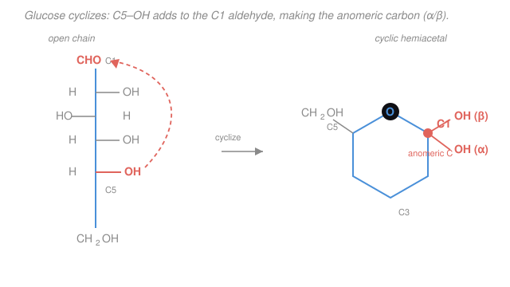

# Organic Chemistry II · Lesson 4.5: A taste of biomolecules

> ⏱ ~15 min · Module 4: Structure Determination & Synthesis · Builds on: [3.3 Aldehydes & ketones: nucleophilic addition](03-03-aldehydes-ketones-nucleophilic-addition.md), [3.4 Carboxylic acids & derivatives: acyl substitution](03-04-carboxylic-acids-derivatives-acyl-substitution.md), [1.5 Chirality & the R/S system](01-05-chirality-r-s-system.md), [1.2 Resonance & delocalization](01-02-resonance-formal-charge-delocalization.md) · Unlocks: [biochemistry](../../biochemistry/syllabus.md), [polymer chemistry](../../polymer-chemistry/syllabus.md)

## Why this matters

Here is the secret this whole course has been building toward: **life runs on the reactions you already know.** A sugar is an aldehyde with a lot of alcohols. A protein is a chain of amides. A fat is a triester. DNA is held together by hydrogen bonds and strung on a backbone of the same acyl-transfer chemistry as an aspirin synthesis. Nothing new is added when carbon chemistry moves into a cell — the rules of Module 1 (electrons and shape) through Module 3 (nucleophile meets electrophile) simply keep applying, now on molecules big enough to be *alive*. This last lesson is the payoff: you will look at the four great families of biomolecules and see, in each, a functional group you can already name and a mechanism you have already drawn.

## The idea

There are only four biomolecule classes worth memorizing, and each is a familiar functional group wearing a biological name:

- **Carbohydrates** (sugars) are **polyhydroxy aldehydes or ketones** — carbonyls surrounded by $\ce{-OH}$ groups. Because a carbonyl and an alcohol *react* (that's [3.3](03-03-aldehydes-ketones-nucleophilic-addition.md)), a sugar folds up and reacts with *itself*.
- **Proteins** are chains of **amino acids** linked by **amides** — the amide being the calm end-product of acyl substitution from [3.4](03-04-carboxylic-acids-derivatives-acyl-substitution.md).
- **Lipids** (fats) are **esters** of glycerol with long fatty acids — again pure [3.4](03-04-carboxylic-acids-derivatives-acyl-substitution.md).
- **Nucleic acids** (DNA/RNA) are built from **nucleotides**, each a sugar + a nitrogen base + a phosphate, zipped by hydrogen bonds and strung on a phosphate-ester backbone.

If you can spot a carbonyl, an alcohol, an amine, a carboxylic acid, and a double bond, you can read every molecule in a cell. Let's take them one at a time.

## The formal version

**Carbohydrates — a carbonyl that eats its own tail.** Glucose is $\ce{C6H12O6}$: an aldehyde at C1 and an $\ce{-OH}$ on nearly every other carbon (a **polyhydroxy aldehyde**). Its C5 hydroxyl is dangling four carbons away from the C1 carbonyl — close enough to attack it. That intramolecular nucleophilic addition of an $\ce{-OH}$ to a $\ce{C=O}$ is exactly the **hemiacetal** formation from [3.3](03-03-aldehydes-ketones-nucleophilic-addition.md), just happening *within one molecule*:

$$\ce{R-CHO + R'-OH <=> R-CH(OH)-OR'}$$

*In words: the alcohol oxygen adds across the carbonyl; the carbonyl carbon becomes an $sp^3$ carbon bearing both an $\ce{-OH}$ and an $\ce{-OR}$ — a hemiacetal.* The old flat, $sp^2$ aldehyde carbon (C1) becomes a tetrahedral $sp^3$ carbon with four different groups: it is now a **stereocenter** ([1.5](01-05-chirality-r-s-system.md)). We call it the **anomeric carbon**. The new $\ce{-OH}$ can point *down* (**α**) or *up* (**β**), giving two diastereomers called **anomers**. In water they slowly interconvert through the open-chain aldehyde — **mutarotation** — until an equilibrium mix of α and β is reached.

Link two sugars by converting that hemiacetal into a full **acetal** (again [3.3](03-03-aldehydes-ketones-nucleophilic-addition.md): a second alcohol displaces the anomeric $\ce{-OH}$) and you get a **glycosidic bond** — the C–O–C bridge that builds starch, cellulose, and table sugar. Sugars are chiral; the **D/L** label (from [1.6](01-06-diastereomers-meso-optical-activity.md)'s Fischer/optical-activity ideas) reports the configuration at the highest-numbered stereocenter, and natural sugars are almost all **D**.

**Amino acids & proteins — a molecule that is its own acid and base.** An α-amino acid carries *both* a basic amine $\ce{-NH2}$ and an acidic carboxyl $\ce{-COOH}$ on the same carbon. Applying [1.3](01-03-acids-bases-organic.md)'s acid/base logic, the proton simply hops from the acid to the base, so the neutral form is really a **zwitterion** — positive and negative at once:

$$\ce{H2N-CHR-COOH <=> ^{+}H3N-CHR-COO^{-}}$$

*In words: the carboxyl gives up its proton to the amine, leaving one $+$ and one $-$ on the same molecule.* The pH at which the molecule is net-neutral (equal $+$ and $-$) is the **isoelectric point, pI** — the pH-and-$\mathrm{p}K_a$ balance from [general chemistry acids/bases](../../general-chemistry/lessons/04-01-acids-bases-ph-strength.md). The α-carbon bears four different groups ($\ce{-NH2}$, $\ce{-COOH}$, $\ce{-H}$, side chain $\ce{-R}$), so it is a **stereocenter** — and nature builds proteins from **L**-amino acids only. (The lone exception is **glycine**, whose side chain is just $\ce{-H}$: two identical H's, not a stereocenter, achiral.)

Join two amino acids and the carboxyl of one attacks... no — the amine of one attacks the carbonyl of the other's carboxyl. That is **nucleophilic acyl substitution** ([3.4](03-04-carboxylic-acids-derivatives-acyl-substitution.md)): amine in, $\ce{-OH}$ (as water) out, leaving an **amide**. The amide linking two amino acids is called the **peptide bond**:

$$\ce{-COOH + H2N- -> -CO-NH- + H2O}$$

Because it is an amide, the peptide bond inherits the **resonance** of [1.2](01-02-resonance-formal-charge-delocalization.md): the nitrogen lone pair delocalizes onto the carbonyl oxygen, giving the $\ce{C-N}$ bond partial double-bond character. *In words: the peptide $\ce{C-N}$ is stiffer than a normal single bond, so the six atoms of each peptide unit lie in one rigid plane and cannot freely rotate* — the structural fact that makes proteins fold into repeatable shapes.

**Lipids — glycerol wearing three grease coats.** A triglyceride (fat) is glycerol (a three-$\ce{-OH}$ alcohol) esterified at all three hydroxyls with long-chain carboxylic acids (**fatty acids**). Three esters, one molecule — pure [3.4](03-04-carboxylic-acids-derivatives-acyl-substitution.md). Run the ester hydrolysis backward with base ($\ce{NaOH}$) and you cleave all three esters into glycerol plus three fatty-acid **carboxylate salts** — that is **saponification**, and those salts *are* **soap**:

$$\ce{fat + 3\,NaOH -> glycerol + 3\,RCOO^{-}Na^{+}}$$

Whether a fat is a solid or an oil comes from [1.1](01-01-bonding-hybridization-molecular-shape.md)/[2.5](02-05-alkenes-electrophilic-addition.md) shape. **Saturated** chains (no $\ce{C=C}$) are straight, stack tightly, and melt high (butter, lard). **Unsaturated** chains carry **cis** double bonds that put a permanent kink in the chain; kinked chains can't pack, so they melt low and stay liquid (olive oil). *One cis alkene is the entire difference between a stick of butter and a bottle of oil.*

**Nucleotides — base + sugar + phosphate.** Each DNA/RNA building block has three pieces: a nitrogen **base** (adenine, thymine/uracil, guanine, cytosine), a **sugar** (deoxyribose/ribose — a carbohydrate, joined to the base by a glycosidic/acetal bond), and a **phosphate** group. Nucleotides link through **phosphodiester** bonds — the phosphate esterified to the sugar of the next unit on each side — giving the sugar–phosphate **backbone**. The two strands are held together by **hydrogen bonds** between bases, in a strict pairing: **A–T** (two H-bonds) and **G–C** (three H-bonds). *In words: the backbone is ester chemistry; the code is hydrogen bonding.*

## Picture

## Worked examples

**Example 1 (name the parts).** Point to the chemistry in three biomolecules.

- *Aspartame's core (an amino-acid dipeptide):* find a $\ce{-COOH}$, an $\ce{-NH2}$, and — between the two residues — a $\ce{-CO-NH-}$ **amide** (peptide bond). The amide is an acyl-substitution product; the free acid and amine ends make it a zwitterion at physiological pH.
- *A triglyceride:* one central glycerol backbone (three carbons, originally three $\ce{-OH}$) tied by three $\ce{-CO-O-}$ **ester** groups to three long fatty-acid tails. Count the $\ce{C=O}$–$\ce{O}$ units: three esters.
- *Glucose (cyclic):* a six-membered ring with one ring **oxygen**; the ring carbon flanked by that oxygen *and* an external $\ce{-OH}$ is the **hemiacetal / anomeric carbon**. Every other ring carbon carries an $\ce{-OH}$.

**Example 2 (why the peptide bond is flat — and why it matters).** Draw the two resonance forms of an amide (from [1.2](01-02-resonance-formal-charge-delocalization.md)): (a) neutral $\ce{O=C-N}$ with the N lone pair localized, and (b) $\ce{^{-}O-C=N^{+}}$ with that lone pair pushed into the $\ce{C-N}$ bond. The true structure is the average, so the $\ce{C-N}$ bond has real double-bond character. A double bond can't rotate without breaking its π overlap, so the peptide $\ce{O=C-N-H}$ unit is **locked planar**. Consequence: a protein backbone is a chain of rigid, flat plates connected by rotatable single bonds — the reason proteins fold into a small set of reproducible shapes (helices, sheets) instead of a floppy tangle. Structure follows straight from resonance.

## Watch out

- **You might think cyclic glucose has no aldehyde, so it's not a reducing sugar.** But the hemiacetal is in equilibrium with the open chain ([3.3](03-03-aldehydes-ketones-nucleophilic-addition.md) is reversible), so a real aldehyde flickers back into existence — that open form is what lets glucose reduce test reagents and undergo mutarotation. A *full acetal* (a glycoside, both O's now C–O–C) is locked shut and cannot reopen — non-reducing.
- **You might call every amino-acid form neutral "$\ce{H2N-CHR-COOH}$."** In water that species barely exists; the real neutral molecule is the **zwitterion** $\ce{^{+}H3N-CHR-COO^{-}}$. Net charge zero, but not because the groups are uncharged — because the charges cancel.
- **You might think a saturated and an unsaturated fat differ in their functional group.** They don't — both are triesters. The difference is *shape*: a **cis** $\ce{C=C}$ ([2.5](02-05-alkenes-electrophilic-addition.md)) kinks the chain and drops the melting point. Same reaction chemistry, different geometry.
- **You might expect the peptide $\ce{C-N}$ to rotate like any single bond.** Resonance gives it partial double-bond character, so it's stiff and planar — that restriction *is* protein architecture.

## One-liner

> Life's four molecule families are old friends in costume: sugars are self-reacting polyhydroxy aldehydes (hemiacetals), proteins are amide chains (acyl substitution), fats are triesters, and nucleic acids are phosphate esters zipped by hydrogen bonds.

## Problems

**P1 (🟢)** For each molecule, name every functional group present using this course's vocabulary: (a) open-chain **glucose**, (b) the amino acid **alanine** $\ce{CH3-CH(NH2)-COOH}$, (c) a **triglyceride**.

**P2 (🟡)** Explain the **peptide bond** as the product of a nucleophilic acyl substitution, identifying the nucleophile, the electrophile, and the leaving group. Then explain why the resulting bond is planar and cannot freely rotate.

**P3 (🔴)** Glucose in water is an equilibrium of α- and β-**anomers** with only a trace of open chain. (a) Show how the open-chain aldehyde cyclizes to the ring, naming the mechanism and the bond formed. (b) Explain why two different anomers arise, and what makes the anomeric carbon special. (c) Explain **mutarotation**: why a pure sample of α-glucose slowly becomes a mix of α and β.

Solutions

**P1**
- **(a) Glucose (open chain):** one **aldehyde** ($\ce{-CHO}$, at C1) and five **alcohols** ($\ce{-OH}$, hydroxyl groups) — i.e. a *polyhydroxy aldehyde*. (In the cyclic form, C1 becomes a **hemiacetal** instead of a free aldehyde.)
- **(b) Alanine:** a **carboxylic acid** ($\ce{-COOH}$) and a primary **amine** ($\ce{-NH2}$) on the α-carbon, plus a methyl side chain. Because it has both an acid and a base, in water it exists as a **zwitterion** $\ce{^{+}H3N-CH(CH3)-COO^{-}}$. The α-carbon is a **stereocenter** (four different groups), so alanine is chiral (nature uses L).
- **(c) Triglyceride:** three **ester** groups ($\ce{-CO-O-}$) joining one glycerol to three fatty-acid chains. If any chain is unsaturated, add **cis alkene(s)** ($\ce{C=C}$).

**P2** In forming a peptide bond, the amine nitrogen of one amino acid is the **nucleophile** (its lone pair attacks); the **carbonyl carbon** of the other amino acid's carboxyl is the **electrophile**; and the **$\ce{-OH}$** of that carboxyl leaves (as water). This is the [3.4](03-04-carboxylic-acids-derivatives-acyl-substitution.md) pattern — nucleophile adds to the acyl carbon forming a tetrahedral intermediate, then the leaving group departs, regenerating the $\ce{C=O}$ — with an amine nucleophile, so the product is an **amide**: $\ce{-CO-NH-}$.

It is planar because the amide is a **resonance hybrid** ([1.2](01-02-resonance-formal-charge-delocalization.md)): the nitrogen lone pair delocalizes into the $\ce{C=O}$, giving the second form $\ce{^{-}O-C=N^{+}}$. The real bond is the average, so the $\ce{C-N}$ has partial double-bond character. Rotating a (partial) double bond would break the π overlap between N and C — energetically costly — so rotation is frozen and the $\ce{O=C-N-H}$ unit stays in one plane.

**P3**
**(a)** The C5 hydroxyl oxygen (nucleophile) performs an **intramolecular nucleophilic addition** to the C1 aldehyde carbon (electrophile) — the *same* addition of an alcohol to a carbonyl as in [3.3](03-03-aldehydes-ketones-nucleophilic-addition.md), only within one molecule. The O adds across the $\ce{C=O}$; the carbonyl oxygen picks up an H to become an $\ce{-OH}$. The product is a six-membered ring in which C1 now bears both an $\ce{-OR}$ (the ring oxygen) and an $\ce{-OH}$: a **cyclic hemiacetal**, and a new C–O bond closes the ring.

**(b)** In the open aldehyde, C1 is flat ($sp^2$), so the incoming C5–O can add to **either face** of the planar carbonyl. On cyclizing, C1 becomes tetrahedral ($sp^3$) with four different groups — a **stereocenter**, the **anomeric carbon**. Its new $\ce{-OH}$ can end up **down (α)** or **up (β)**; these two diastereomers are the **anomers**. What makes C1 special is that it is the only ring carbon bonded to *two* oxygens (ring O + hydroxyl), i.e. the hemiacetal carbon.

**(c)** Because the hemiacetal is **reversible** ([3.3](03-03-aldehydes-ketones-nucleophilic-addition.md)), a ring can reopen to the flat open-chain aldehyde and re-close onto the other face. Starting from pure α, some molecules reopen and re-close as β; over time the system reaches the α/β equilibrium mixture. Since specific rotation (optical activity, [1.6](01-06-diastereomers-meso-optical-activity.md)) differs between the anomers, the measured rotation drifts to a steady intermediate value — this change is **mutarotation**.

## Flashback

**From Lesson 3.4 (Carboxylic acids & derivatives — acyl substitution):** Ethyl acetate $\ce{CH3COOCH2CH3}$ is heated with aqueous $\ce{NaOH}$ (basic hydrolysis, i.e. saponification). Draw/name the two organic products, and identify the nucleophile and the leaving group in the mechanism.

Solution

Basic ester hydrolysis is nucleophilic acyl substitution with hydroxide as the nucleophile. $\ce{OH-}$ attacks the carbonyl carbon (the electrophile) to form a tetrahedral intermediate; the **ethoxide** group $\ce{CH3CH2O^{-}}$ is the **leaving group** that departs, regenerating the $\ce{C=O}$. This gives acetic acid, which is immediately deprotonated by the base to the carboxylate:

$$\ce{CH3COOCH2CH3 + NaOH -> CH3COO^{-}Na^{+} + CH3CH2OH}$$

The two organic products are **sodium acetate** ($\ce{CH3COO^{-}Na^{+}}$) and **ethanol** ($\ce{CH3CH2OH}$). Basic hydrolysis is irreversible because the carboxylate product is deprotonated and unreactive toward the alcohol — the same reason saponification of a triglyceride runs to completion and gives soap. (Nucleophile = $\ce{OH-}$; leaving group = ethoxide.)

## Connections

- **Backward:** this lesson is a recombination of the whole course. The hemiacetal/acetal of sugars is [3.3](03-03-aldehydes-ketones-nucleophilic-addition.md); the amide of proteins and the ester of fats are [3.4](03-04-carboxylic-acids-derivatives-acyl-substitution.md); the peptide bond's planarity is [1.2](01-02-resonance-formal-charge-delocalization.md) resonance; the D/L, L-amino-acid, and anomer stereochemistry is [1.5](01-05-chirality-r-s-system.md)/[1.6](01-06-diastereomers-meso-optical-activity.md); the zwitterion and pI are [1.3](01-03-acids-bases-organic.md) acid/base; the cis-kink of unsaturated fats is [2.5](02-05-alkenes-electrophilic-addition.md).
- **Forward:** [biochemistry](../../biochemistry/syllabus.md) picks up exactly here — enzyme catalysis, metabolism, and DNA replication are these same functional groups made and broken by protein machines. [polymer chemistry](../../polymer-chemistry/syllabus.md) generalizes the peptide (an amide polymer, like nylon) and the polysaccharide (an acetal polymer) into synthetic macromolecules built by chaining one reaction thousands of times.
- **Sideways:** the same rigid-planar-amide idea explains why **nylon and Kevlar** are strong (amide chains) and why **cis vs trans fats** matter in nutrition — geometry, not new chemistry.

---

### The whole arc, in one breath

You started with **electrons and shape** (Module 1): where electrons sit, how they delocalize, and how that geometry fixes acidity and chirality. From that came **the one idea the entire course turns on** — an electron-rich site (nucleophile) seeks an electron-poor site (electrophile) — which powered substitution, elimination, and addition (Module 2) and then aromatics and carbonyls (Module 3). Finally you learned to **read and build** molecules: infer a structure from its spectra, and assemble a target by running that one idea backward as retrosynthesis (Module 4). And here, at the end, the same handful of moves — a nucleophile adding to a carbonyl, an acyl substitution, a resonance-stiffened bond, a cis double bond — turn out to be exactly how nature builds sugars, proteins, fats, and DNA. Organic chemistry was never a list of reactions. It was one idea, applied until it became alive. That idea is the foundation everything downstream — biochemistry, polymer chemistry, medicine — is built on. Course complete.
