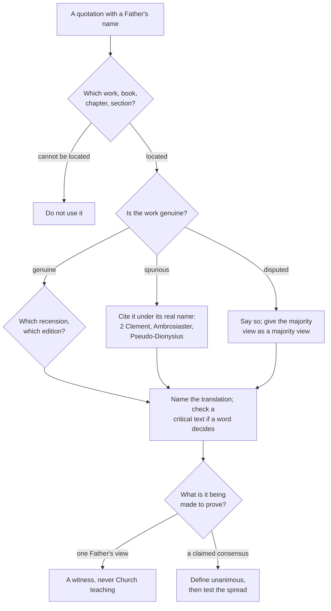

# The Church Fathers · Lesson 1.1: How to read a Church Father

> ⏱ ~15 min · Module 1: Reading the Fathers, and the first witnesses · Builds on: [`fundamental-theology` 4.4](../../fundamental-theology/lessons/04-04-the-ladder-of-doctrinal-authority.md), [5.1](../../fundamental-theology/lessons/05-01-vincent-of-lerins.md) · Unlocks: [1.2](01-02-first-clement-and-the-didache.md)

## Why this matters

You will meet the Fathers mostly as quotations: a line in a parish bulletin, a footnote, a screenshot with a name under it. Nearly every one is doing a job — proving the early Church believed something, or that it did not. To judge the job you must answer three questions the quotation never answers. **Is this writer a Father at all? Is this text really his? And what does one Father's sentence weigh — alone, and inside a claimed consensus?** That is this lesson, and every later one leans on it. It is also what stops you doing to the Fathers what the internet does to them.

## The idea

### Who counts as a Father

The manual tradition gives [four marks](../reference.md#the-four-marks-of-a-father): **antiquity**, **orthodoxy of doctrine**, **holiness of life**, **approval of the Church**. A writer with all four is a Father, and his witness to what the churches believed carries the weight of a teacher the Church recognizes as her own.

Notice what this list is not. No council ever promulgated it and there is no official roll; Joseph Fessler, stating the marks in the nineteenth century, shrugged at the last and noted that antiquity is required "at the present day" — by convention, not definition. What functions in practice is a set of working questions: has a general council cited him? Does the Roman Martyrology praise his holiness and learning? Was he read publicly in churches? Do later Fathers quote him as an authority on the faith? The category is a settled judgement of the tradition, not a juridical status: treat borderline cases as borderline and say so.

### Father, Doctor, ecclesiastical writer

Three [titles answering three questions](../reference.md#father-doctor-and-ecclesiastical-writer).

- A **Father** is an ancient witness with the four marks.
- A **Doctor of the Church** is a later, narrower honour: eminent learning, holiness of life, and a formal declaration, in practice always papal. Antiquity is *not* required, which is why most Doctors are not Fathers (Teresa of Ávila, Thérèse of Lisieux) and most Fathers are not Doctors. Boniface VIII raised the feasts of the four Latin Doctors in 1298, Pius V's Breviary of 1568 those of the four Greek; the list stands at thirty-seven, most recently Irenaeus in 2022 — whose millenarianism the Church still did not receive ([2.2](02-02-irenaeus-recapitulation.md)).
- An **ecclesiastical writer** is read, quoted and often indispensable, but missing a mark. Tertullian ended outside the Great Church ([2.3](02-03-tertullian.md)); Origen's name was anathematized in the sixth century ([2.5](02-05-clement-of-alexandria-and-origen.md)). Their testimony is not worthless: a writer later found wanting can still be an excellent witness to what the churches were doing in his lifetime, sometimes a better one for having no stake in the later question. It is simply not a Father's witness, and an argument that needs it to be will fail.

### How the corpus reaches you

Almost everything these writers left reaches you through two nineteenth-century printing projects and the manuscripts behind them ([Migne and Schaff](../reference.md#migne-and-schaff)). **Migne's** *Patrologia Latina* runs to 217 volumes (1844–55), covering Latin writers down to Innocent III; his *Patrologia Graeca*, Greek with facing Latin, to 166 (1857–66). He was fast and cheap, reprinting whatever earlier edition came to hand, misattributions included. **Schaff's** English sets are what you will actually read, and this course's default: the *Ante-Nicene Fathers* (ten volumes) and the *Nicene and Post-Nicene Fathers* (two series of fourteen), all public domain. Since then the critical series (CSEL, GCS, CCSL, *Sources Chrétiennes*) have re-edited most of the corpus from the manuscripts, often differing from what Migne printed.

Two consequences. First, when a single word decides your reading, name the edition and check whether a critical text has moved it. Second, **Migne prints spurious works beside genuine ones under the same name** — how a fourth-century commentary on Paul spent a thousand years being read as Ambrose.

## Source

Council of Trent, Session IV (8 April 1546), decree concerning the edition and use of the sacred books, Waterworth translation (1848, public domain):

> Furthermore, in order to restrain petulant spirits, It decrees, that no one, relying on his own skill, shall, — in matters of faith, and of morals pertaining to the edification of Christian doctrine, — wresting the sacred Scripture to his own senses, presume to interpret the said sacred Scripture contrary to that sense which holy mother Church … hath held and doth hold; or even contrary to the unanimous consent of the Fathers.

This is the sentence the whole argument about "the unanimous consent of the Fathers" descends from. Read what it says before reading what it is made to say.

## The argument

The [consent clause](../reference.md#unanimous-consent-of-the-fathers), taken apart:

1. **It is a restraint, not a method.** The decree announces its purpose: to restrain petulant spirits. It sits in a session about the Vulgate and who may publish interpretations, not in one setting out how theology is done. *In words: it tells you what you may not do with a text, not how to build a doctrine out of the Fathers.*
2. **Its scope is fixed and narrow.** "In matters of faith, and of morals pertaining to the edification of Christian doctrine." *In words: it binds where doctrine or morals ride on the interpretation, and is silent on astronomy, chronology or philology.*
3. **It forbids contradiction; it does not require assembly.** The prohibited act is interpreting *contrary to* a consent that exists. *In words: nobody must produce a patristic consensus before reading a verse — but where one exists on a matter of faith, you may not read against it.*
4. **Vatican I renews it in the same words.** *Dei Filius* (1870), ch. 2, notes that Trent has been wrongly understood, restates the decree, and repeats the prohibition against interpreting Scripture contrary to the Church's sense or the unanimous consent of the Fathers. *In words: two councils now teach the clause, and it still says only what it says.*
5. **"Unanimous" needs a sense before the clause can be worked.** Numerical unanimity among everyone who ever wrote? Moral unanimity, allowing outliers? Agreement on the doctrine drawn from a verse, or on its literal sense? These give different verdicts on the same evidence, and the clause does not choose. *In words: anyone who invokes the criterion owes you the reading of "unanimous" he is using, before he counts.*

**A note on Vincent, for his setting only.** The classic attempt to say what agreement among the Fathers amounts to is the *Commonitorium* of Vincent of Lérins, written about 434 in the island monastery off southern Gaul. The setting matters: Lérins was the centre of the reaction against Augustine's late teaching on grace and predestination — later and unhappily labelled Semipelagian — and its spokesmen defended themselves by appeal to antiquity, which Augustine's partisan Prosper of Aquitaine threw back as obstinacy dressed up as age. The rule was forged inside a live quarrel over whether a living bishop had outrun the Fathers. What it *says* and what it weighs belong to [`fundamental-theology` 5.1](../../fundamental-theology/lessons/05-01-vincent-of-lerins.md); do not import it here as a magisterial criterion. It is not.

## The check

That is the [five-step check](../reference.md#how-to-check-a-patristic-quotation) for the rest of the course. Step two fails more often than beginners expect, because the tradition carries a standing body of [works under the wrong name](../reference.md#spurious-and-misattributed-works):

| Text | Long read as | Actually |
|---|---|---|
| 2 Clement | a second letter of Clement of Rome | an anonymous sermon, roughly 120–160, carried beside 1 Clement |
| *Epistle of Barnabas* | the Barnabas of Acts | anonymous, roughly 70–135; copied into Codex Sinaiticus after the New Testament |
| the Athanasian Creed (*Quicumque*) | Athanasius | a Latin creed; most place it in southern Gaul around 500 |
| the long recension of Ignatius | Ignatius | a later expansion: genuine letters interpolated plus six forged ones ([1.3](01-03-ignatius-of-antioch.md)) |
| the Dionysian corpus | Dionysius the Areopagite of Acts 17 | an anonymous Greek writer around 500, drawing on the Neoplatonist Proclus ([5.4](05-04-maximus-and-john-of-damascus.md)) |
| Ambrosiaster | Ambrose | an unidentified late-fourth-century commentator on Paul; Erasmus raised the first doubts |
| the Greek Ephrem | Ephrem the Syrian | a large Greek corpus under his name, most of it not his ([3.4](03-04-ephrem-and-syriac-christianity.md)) |

## Worked examples

**Example 1 (clean: a quotation you may use).** Someone sends you: *"Now twenty-four hours fill up the space of one day."* — Basil.

Run the check. **Locate:** Basil, *Hexaemeron*, Homily 2.8, from a Lenten series on the six days. **Genuine?** Yes; the nine homilies are undisputed. **Edition:** Greek in Migne's *Patrologia Graeca* 29, English in Blomfield Jackson's *Nicene and Post-Nicene Fathers*, second series, volume 8. **Standing:** all four marks, and one of the four Greek Doctors ([3.2](03-02-basil-the-great.md)). **Weight:** here beginners stop too early. The sentence is a great bishop's exegesis, preached to a congregation — a witness of the highest quality to what a Father taught, at no level on the ladder of doctrinal authority, because no magisterial act proposes it ([`fundamental-theology` 4.4](../../fundamental-theology/lessons/04-04-the-ladder-of-doctrinal-authority.md)). Quotable, attributable, binding on nobody.

**Example 2 (where it strains: a claimed consensus).** Now someone stacks Basil with other literal readers and concludes, citing Trent, that the Fathers' unanimous consent binds Catholics to twenty-four-hour days in Genesis 1.

Take the premises in order. By step 2: is the *length of the days* a matter of faith and morals, or is the doctrine of Genesis 1 something else — that God made all things, freely, from nothing, and good? By step 5: which "unanimous"? Then test the spread, the part nobody does. Augustine, *City of God* XI.7, says of the first light that "what kind of light that was, and by what periodic movement it made evening and morning, is beyond the reach of our senses" (Marcus Dods, *Nicene and Post-Nicene Fathers*, first series, volume 2), reading "evening and morning" of the angelic creature's knowledge turning to its Creator. Origen, *On First Principles* IV.3.1, makes days with an evening and a morning but no sun his leading example of a passage whose impossibility as history signals an inner meaning ([3.5](03-05-allegory-and-history-alexandria-and-antioch.md)).

So the claimed consensus fails on its own terms, and instructively: the Fathers diverge on the *literal sense* of the days while converging on the *doctrine* the chapter teaches. Divergence on the letter, convergence on the thing believed, is the normal state of the patristic record, and any usable account of "unanimous consent" must handle it. What the Church teaches about creation belongs to `creation-grace-last-things`.

## Watch out

- **You might think the titles are rules you can apply.** The four marks describe a judgement the tradition has already made: there is no marking scheme for "approval of the Church," only whether councils, martyrologies and later Fathers treated him as an authority. And "Doctor" honours the man, not his opinions one at a time: Irenaeus's millenarianism and Basil's twenty-four hours are as binding after the declaration as before: not at all.
- **You might think Trent obliges you to find a patristic consensus.** It forbids reading against one. Promoting that restraint into a method is the commonest misuse of the clause, and an overstatement of level in the strict sense of [`fundamental-theology` 4.4](../../fundamental-theology/lessons/04-04-the-ladder-of-doctrinal-authority.md).
- **You might think a spurious work is worthless.** 2 Clement is not by Clement and is still first-rate evidence for mid-second-century preaching. The error is not reading it but citing it under a name that buys authority it never earned.
- **You might think "the Fathers say" is ever a citation.** It is not. Work, book, chapter, section, recension, translation — or the sentence does no work.

## One-liner

> A patristic quotation is worth exactly what survives three questions: is he a Father, is the text his, and is the thing it is being made to prove the thing it actually says.

## Problems

**P1 (🟢) *(Exegetical.)*** For each text below, say in **one sentence** what it actually is, and in **one clause** what a writer must do before citing it.

(a) 2 Clement (b) the *Epistle of Barnabas* (c) Ambrosiaster (d) the long recension of the letters of Ignatius (e) the Dionysian corpus

**P2 (🟡) *(Exegetical.)*** An invented note from a parish bulletin:

> "Some people will tell you the days of Genesis are a poetic device. But St Basil the Great preached that 'now twenty-four hours fill up the space of one day,' and the Fathers of the Church say the same. The Council of Trent binds Catholics to interpret Scripture according to the unanimous consent of the Fathers. So a Catholic is not free to hold anything else."

The Basil quotation is genuine and correctly given. (a) Name **two** distinct things the Trent clause, as worded in the Source, does not do that this argument needs it to do. (b) Give **one** patristic reading from this lesson that breaks the claimed unanimity, with the work and the words that carry it. **120 words or fewer in total.**

**P3 (🔴, optional) *(Exegetical (a) · Evaluative (b).)*** From the Athanasian Creed (*Quicumque vult*), in the Marquess of Bute's translation, public domain:

> The Father is made of none, neither created, nor begotten. The Son is of the Father alone; not made, nor created, but begotten. The Holy Ghost is of the Father, and of the Son neither made, nor created, nor begotten, but proceeding. … For the right Faith is, that we believe and confess, that our Lord Jesus Christ, the Son of God, is God and Man. God, of the substance of the Father, begotten before the worlds; and Man, of the substance of His mother, born into the world. Perfect God and Perfect Man, of a reasonable Soul and human Flesh subsisting. … Who, although He be God and Man, yet He is not two, but One Christ. One, not by conversion of the Godhead into Flesh, but by taking of the Manhood into God. One altogether, not by confusion of substance, but by Unity of Person.

Athanasius was a Greek-writing bishop of Alexandria who died in 373.

(a) Point to **two** features of this text that tell against his authorship, quoting the words that carry each, and say why each is decisive.
(b) The text is not Athanasius's, yet it was received into the Western Office and recited for centuries. In **150 words or fewer**, any verdict: say what the misattribution costs and what it does not cost. Distinguish the uses of the text that the correction destroys from the uses that survive it.

Solutions

**P1** *(Exegetical — strict.)*

**Must hit, strict:**
- (a) **2 Clement** — an anonymous sermon of roughly 120–160, not a letter and not by Clement of Rome, transmitted in the manuscripts beside 1 Clement. Cite it as an anonymous second-century homily, never as Clement.
- (b) ***Epistle of Barnabas*** — an anonymous Christian writing of roughly 70–135, copied into Codex Sinaiticus after the New Testament; the attribution to the Barnabas of Acts is not accepted. Cite it as anonymous and early, not as the companion of Paul.
- (c) **Ambrosiaster** — a late-fourth-century Roman commentary on the Pauline epistles printed among Ambrose's works; Erasmus raised the first doubts and the author has never been identified. Cite it as Ambrosiaster and never as Ambrose, and note the volume of Migne it is hiding in.
- (d) **the long recension of Ignatius** — a later expansion of the Ignatian corpus, interpolating the genuine letters and adding six forged ones. State which recension you are quoting before drawing any conclusion from the wording, since the interpolations touch exactly the topics people cite Ignatius for ([1.3](01-03-ignatius-of-antioch.md)).
- (e) **the Dionysian corpus** — writings of an anonymous Greek author of around 500 who drew on the Neoplatonist Proclus, circulated under the name of Paul's Athenian convert in Acts 17. Cite it as Pseudo-Dionysius, and never treat it as first-century evidence.

**Wrong turns:** calling any of these "fakes" and stopping — each is a real and valuable text, and (d) contains genuine Ignatius inside the interpolations; treating the Barnabas and Dionysius attributions as settled frauds by their authors rather than as attributions the tradition made and later scholarship undid; saying only "check whether it is genuine" without naming what the citation must then say.

**Model answer:** as the five entries above, each in a sentence plus the clause.

---

**P2** *(Exegetical — strict.)*

**Must hit, strict (a):** two of the following three, stated as things the clause does not do.
1. **It does not command you to assemble a consensus.** What it forbids is interpreting *contrary to* a unanimous consent. The note uses it as a positive rule generating an obligation, which is the reverse of its grammar.
2. **It does not reach this question.** The clause is scoped to "matters of faith, and of morals pertaining to the edification of Christian doctrine." The note has to show that the *duration* of the days, as distinct from what Genesis 1 teaches about God and creation, falls inside that scope, and it never tries.
3. **It does not define "unanimous."** Numerical or moral, on the literal sense or on the doctrine — the note needs the strictest reading and simply assumes it. Also acceptable as part of this point: the note asserts the consent rather than exhibiting it ("the Fathers of the Church say the same" is not a citation).

**Must hit, strict (b):** one genuine counter-reading with its text. Either **Augustine**, *City of God* XI.7, on the first light — "by what periodic movement it made evening and morning, is beyond the reach of our senses" — which denies precisely the solar day the note needs; or **Origen**, *On First Principles* IV.3.1, who takes days with an evening and a morning but no sun as the mark of a passage demanding a spiritual sense.

**Wrong turns:** attacking the Basil quotation — it is genuine, correctly translated and correctly located, and the argument fails downstream of it; answering that Trent is "not infallible" or "only disciplinary," which is both an error about the act and not the flaw here; producing a modern scientific objection, which is not what an exegetical part asks for.

**Model answer:** (a) The clause forbids interpreting against an existing consent; it does not oblige anyone to construct one, so it cannot generate the note's obligation. And it is scoped to faith and morals, so the note would first have to show that the length of the days, rather than the doctrine of creation, falls inside that scope. (b) Augustine breaks the unanimity: in *City of God* XI.7 he says that what kind of light the first light was, and by what periodic movement it made evening and morning, is beyond the reach of our senses — which is a denial of the solar day the note requires.

---

**P3** *(a) exegetical — strict; (b) evaluative — any verdict.*

**Must hit, strict (a):** two of the following, each anchored in quoted words.
1. **The double procession.** "The Holy Ghost is of the Father, **and of the Son** … proceeding." This is the Latin *filioque*, a Western formula; Athanasius wrote in Greek at Alexandria and never states the Spirit's procession this way. Decisive because the phrase belongs to a later and specifically Western development.
2. **Post-Chalcedonian Christology.** "not two, but **One Christ** … not by confusion of substance, but by **Unity of Person**," with "Perfect God and Perfect Man." This is the one-person, two-realities idiom that Latin theology works out in the fifth century and that Chalcedon fixes in 451 — nearly eighty years after Athanasius died in 373. Decisive because a writer cannot use the settled vocabulary of a controversy that had not yet happened.
3. Also creditable, and the argument that actually broke the attribution in 1644: the text's **language and structure are Latin**, not a translation from Greek, and **no early writer cites it as Athanasius's** — the silence of the tradition for centuries after his death.

**Wrong turns:** arguing from the damnatory clauses ("without doubt he shall perish everlastingly") — severe, but not anachronistic; arguing that the doctrine is un-Athanasian, which it is not, since the Trinitarian content is thoroughly Nicene and that is exactly why the name stuck; concluding that the creed is therefore heretical or doubtful, which does not follow from a false attribution.

**Must hit, any verdict (b):** separate the text's **evidential** use from its **doctrinal and liturgical** standing, and say what the correction does to each. The destroyed use: it can no longer be offered as fourth-century Alexandrian evidence for anything, and in particular cannot be cited against the Greek East on the procession of the Spirit, which is the use the name was doing most work for. The surviving use: it remains a witness to Latin faith around 500, it says what the Church received it as saying, and its standing in the Office never rested on the authorship. A good answer names the general principle it is applying — that authenticity governs evidential value, not truth — and states its verdict on whether anything real is lost. Either verdict passes.

**Model answer (b), one of several:** The cost is precise and it is not small. As a document of the 360s the creed would be an early Greek witness; as a Latin text of around 500 it witnesses only to the West, and roughly a century and a half after the man whose name it carries. Every argument that leaned on the name — above all the appeal to it on the procession of the Spirit — has to be withdrawn. What survives is everything else. Its content is the Nicene and Chalcedonian faith stated with unusual precision, it was received and recited by the Western Church on its own merits, and none of that was ever held on Athanasius's authority. So the loss is evidential, not doctrinal: we lose a witness and keep a creed.

## Connections

- **Backward:** this lesson is the patristic half of the toolkit begun in [`fundamental-theology`](../../fundamental-theology/syllabus.md): 4.4 supplies the ladder used to say that a Father's opinion is at no level, and [5.1](../../fundamental-theology/lessons/05-01-vincent-of-lerins.md) supplies Vincent's rule, whose setting is sketched above. Argument reconstruction, used throughout this course, is [`philosophical-method` 1.3](../../philosophical-method/lessons/01-03-reconstruction-and-charity.md).
- **Forward:** every remaining lesson runs the check. It bites hardest in [1.3](01-03-ignatius-of-antioch.md) (which recension of Ignatius), [2.5](02-05-clement-of-alexandria-and-origen.md) (Rufinus's admittedly adjusted Latin Origen), [3.2](03-02-basil-the-great.md) (the authorship of Letter 38), [5.1](05-01-cyril-of-alexandria.md) (Cyril's key formula came to him under a false name) and [5.3](05-03-gregory-the-great.md) (the disputed *Dialogues*). The consensus question returns as the course's last boss problem.
- **Sideways:** [`church-history` 1.2](../../church-history/lessons/01-02-bishops-canon-and-the-parting-of-the-ways.md) reads the same early sources as events rather than as theology, and shows how thin the record is; the habit of asking what a source can bear is the same one. What the contested patristic texts *prove* in argument with other Christians is `apologetics-catholic-claims`, not this course.
