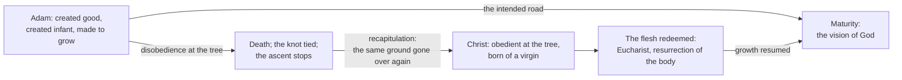

# The Church Fathers · Lesson 2.2: Irenaeus: recapitulation

> ⏱ ~15 min · Module 2: The rule of faith, Africa and Alexandria · Builds on: [2.1 Irenaeus against the Gnostics](02-01-irenaeus-against-the-gnostics.md) · Unlocks: [2.3 Tertullian](02-03-tertullian.md)

## Why this matters

[2.1](02-01-irenaeus-against-the-gnostics.md) gave Irenaeus's criteria: the rule of faith, the public succession of bishops, the fourfold gospel. Criteria tell you which story to trust. They do not tell you the story. This lesson is the story, and Irenaeus needed one, because the Valentinians had a very good one: the world is a mistake, and salvation is the escape of a spark of spirit from matter that never should have existed. To answer it he had to say what the flesh is *for*. His answer is the most fertile single idea in second-century theology — [recapitulation](../reference.md#recapitulation) — and it is still load-bearing: under Athanasius's formula that God became man so that man might be made God ([3.1](03-01-athanasius.md)), under the Eve–Mary parallel that runs through Catholic Mariology, under every later claim that grace perfects nature instead of replacing it. It is also where the course's authority discipline first bites: the same man expected a literal earthly kingdom with vines bearing ten thousand branches, and the Church did not receive it.

## The idea

Take the Valentinian story first, as Irenaeus reports it ([2.1](02-01-irenaeus-against-the-gnostics.md)): a high God who makes nothing material, a botched lower craftsman who does, and a rescue in which the spiritual few learn what they are and leave. On that account the body is not damaged goods; it is the damage. Salvation is information, and it is an exit.

Irenaeus refuses the premise. The God who made the flesh is the God who saves it — one God, one plan, one story. If that is so, salvation cannot be an exit, because there is nowhere to exit to that is not also God's. It has to be repair, and repair of the same material that was spoiled.

So how do you repair a story that went wrong? You go over the ground again and get it right. Same actors, same props, opposite outcome. Paul's word for this in Ephesians 1:10 — God's purpose "in the dispensation of the fulness of times, to re-establish all things in Christ" (Douay–Rheims; Latin *instaurare omnia in Christo*) — is *anakephalaiosasthai*. The root is *kephalaion*, the sum a scribe writes at the head of a column of figures: to sum up. Irenaeus hears the neighbouring *kephale*, head, as well, and uses both senses: Christ is the total of the human story and its head.

One consequence is most often missed. Irenaeus's Adam is not a finished sage who fell from a great height: Adam was an **infant** — created good, created immature, made to grow (*Against Heresies* 4.38). The fall interrupts an ascent that had barely started. So recapitulation is not a return ticket to Eden; it puts the race back on a road it had never got far along.

## Source

*Against Heresies* 4.20.7, in the *Ante-Nicene Fathers* vol. 1 (Roberts–Rambaut translation, public domain). The Word, Irenaeus has just said, reveals the Father in measured stages:

> revealing God indeed to men, but presenting man to God, and preserving at the same time the invisibility of the Father, lest man should at any time become a despiser of God, and that he should always possess something towards which he might advance … For the glory of God is a living man; and the life of man consists in beholding God.

Two things decide how this famous sentence is read. First, **it has two halves**, and the second defines the first: the life that glorifies God is the life of seeing God, not vitality in general. Second, the sentence sits inside an argument about **advance** — man must always have something further to move towards. Read it as a slogan about self-realization and you have taken a sentence about [growth toward the vision of God](../reference.md#growth-and-maturation-in-irenaeus) and made it a sentence about being interesting.

## The argument

Reconstructed mainly from *Against Heresies* 3.16–23, 4.38, 5.1–2 and 5.16–21.

1. **One God is both creator and redeemer.** *In words: the hand that made the flesh is the hand that saves it, so there is no second God to be rescued from the first.*
2. **Therefore salvation is not escape from the flesh but the repair of the flesh.** If the Word only seemed to be flesh, Irenaeus argues, then what he did was not done to us and death is not beaten (3.18.7). *In words: a pretended humanity saves a pretended humanity.*
3. **Repair takes the form of summing the whole story up again in one man.** Of Christ he writes that he "came by means of the whole dispensational arrangements … and gathered together all things in Himself" (3.16.6, citing Ephesians 1:10). *In words: Christ does not start a new race; he retakes the whole of this one, from Adam forward.*
4. **The retaking is point for point.** Irenaeus works it out as a set of matched moves, not as a general atmosphere.

| Adam's move | Christ's countermove | Where |
|---|---|---|
| formed by God from untilled, virgin soil | born of a virgin, formed by God without human seed | 3.21.10 |
| disobedient at a tree | obedient upon a tree; the debt contracted at a tree remitted by a tree | 5.16.3, 5.17.3 |
| the knot tied by Eve's unbelief | "the knot of Eve's disobedience was loosed by the obedience of Mary" | 3.22.4 |
| a man defeated by the adversary | a man defeating him, and defeating him out of the law | 5.21.1–2 |
| an infancy that could not hold the gift | an infancy passed through, so that the Word could be taken as milk | 4.38.1–2 |

5. **Because it is the flesh that is being repaired, the repair reaches us by fleshly means** — bread, a cup, a body that rises. *In words: if the medicine were spiritual only, it would be treating the wrong patient.*
6. **And the goal is not a lost perfection recovered but a maturity never yet reached.** Man was made able to grow and unable, as yet, to receive what growth would bring (4.38.1). *In words: history is an education, and the fall is an interruption in it, not the whole of its plot.*

**Conclusion.** Christ sums up the human story so that the race may resume its growth and arrive where it was always going: "the glory of God is a living man; and the life of man consists in beholding God."

## The arc

The arrow that carries the lesson is the last one: growth resumed, not the garden regained.

## Worked examples

**Example 1 (the argument on a clean case): why Irenaeus argues about the Eucharist from a doctrine of the flesh.**

His opponents deny that flesh can inherit incorruption. Irenaeus answers from worship rather than from a text, and premise 5 is the whole of the move. In 4.18.5 he says the bread, when it receives the invocation of God, "is no longer common bread, but the Eucharist, consisting of two realities, earthly and heavenly" — and then turns it on his opponents: our bodies, nourished by it, are no longer corruptible. In 5.2.3 the same inference runs the other way:

> having received the Word of God, becomes the Eucharist, which is the body and blood of Christ; so also our bodies, being nourished by it, and deposited in the earth, and suffering decomposition there, shall rise at their appointed time

The logic is a loop, and he says so himself: "Our opinion is in accordance with the Eucharist, and the Eucharist in turn establishes our opinion" (4.18.5).

Every tradition reads these passages, and this course states the readings rather than adjudicating them. Catholic and Orthodox readers find an early witness to a real change in the elements and to the Eucharist as offering, leaning on "no longer common bread". Many Protestant readers grant a strong realism of presence but deny that "two realities, earthly and heavenly" settles anything about substance or sacrifice, and note that Irenaeus's interest is the destiny of the body, not a theory of the elements. What the passages *prove* is argued in [`apologetics-catholic-claims`](../../apologetics-catholic-claims/syllabus.md); the doctrine belongs to `sacraments-and-liturgy`.

**Example 2 (where it strains): the thousand years.**

In *Against Heresies* 5.32–36 Irenaeus expects a real, earthly kingdom of the risen righteous before the last judgment. His argument is a strict application of premise 1: it is just that in the very creation in which they suffered, the righteous should receive their reward, and that the creation itself be restored to the dominion of the just (5.32.1). To fill in the picture he passes on a saying from the elders via Papias — vines with ten thousand branches, each branch ten thousand twigs, down to clusters that call out to be picked (5.33.3–4). He names Papias as his written source: exactly the kind of attribution note this course trains you to notice.

The Church did not receive this. In the West Augustine closed the question, reading the thousand years of Revelation 20 figuratively of the present age of the Church — and saying, in the same chapter, that he had once held the literal view himself (*City of God* 20.7). So, flatly: Irenaeus is a saint; since 21 January 2022 he is also a [Doctor of the Church](../reference.md#doctor-of-the-church), declared so by Francis as *Doctor unitatis*, Doctor of unity, for bridging East and West. **Neither title endorses any particular opinion of his.** A Father's view is not Church teaching, and the ladder in [`fundamental-theology` 4.4](../../fundamental-theology/lessons/04-04-the-ladder-of-doctrinal-authority.md) has no rung for it: rungs 1–3 record what the Magisterium did, and it has done nothing here; rungs 4–5 grade theological inferences, and this one the tradition did not carry forward. Placing "Irenaeus taught it" anywhere on that ladder is an exegetical error, graded as one.

What you cannot do is treat [his millenarianism](../reference.md#millenarianism-in-the-fathers) as a detachable oddity without argument. It grows from the same root as everything else in the lesson: this creation, this flesh, really redeemed. Whether the root requires the branch is a live question, and it is P3.

## Watch out

- **You might think recapitulation means Christ repeats Adam's life.** It means he *sums it up* — the total written at the head of the column — and inverts the outcome at each matched point. Repetition would change nothing.
- **You might think "man was not made perfect" means Adam was made defective.** Irenaeus's point is the opposite: a creature is by definition later than its creator, so it starts small and grows. Infancy is not a flaw, and 4.38 is an argument against blaming God for our creatureliness.
- **You might think the [Eve–Mary parallel](../reference.md#eve-and-mary) is Irenaeus's invention.** Justin has it first ([1.4](01-04-justin-martyr.md), *Dialogue* 100); Irenaeus makes it structural by fitting it into the scheme of matched moves. And read it as he wrote it — obedience undoing disobedience — rather than back-reading later Marian doctrine into it. That doctrine is `ecclesiology-and-mariology`'s.
- **You might think "the glory of God is a living man" is about human flourishing.** The circulating modern form, "the glory of God is man fully alive", drops the second half of the sentence, which is where Irenaeus says what the life consists in. See the Source, and P2.
- **You might think being a Doctor of the Church settles what a Father held.** It settles that the Church commends his teaching as eminent; it decides nothing about any single opinion, including the one in Example 2.

## One-liner

> Christ takes the human story from the top and gets it right at every point Adam got it wrong — so that the flesh God made can go on growing, all the way to seeing him.

## Problems

**P1 (🟢) *(Exegetical.)*** *Against Heresies* 4.38.1 (ANF vol. 1, Roberts–Rambaut):

> If, however, any one say, What then? Could not God have exhibited man as perfect from beginning? let him know that, inasmuch as God is indeed always the same and unbegotten as respects Himself, all things are possible to Him. But created things must be inferior to Him who created them, from the very fact of their later origin … Because, as these things are of later date, so are they infantile; so are they unaccustomed to, and unexercised in, perfect discipline. For as it certainly is in the power of a mother to give strong food to her infant, as the child is not yet able to receive more substantial nourishment; so also it was possible for God Himself to have made man perfect from the first, but man could not receive this perfection, being as yet an infant.

(a) On this text's own account, why was man not made perfect at the start: a limit in God, a limit in the creature, or a punishment? Name the words that decide it.
(b) A reader says the passage shows that for Irenaeus "the fall was a stumble on the way up, not a fall from a height." Say how much of that the passage actually supports and how much it does not. **Two sentences per part.**

**P2 (🟡) *(Exegetical.)*** An invented parish bulletin note (nobody wrote this; it is built for the problem):

> Our parish mission this Lent takes its motto from St Irenaeus: "The glory of God is man fully alive." The Fathers knew what we have forgotten — God is not honoured by our shrinking. Whatever makes you most yourself, most alive, most fully the person you were made to be, is what gives God glory. Come and discover your gifts.

(a) Set the motto beside the sentence as the Source gives it and name **two** things the bulletin's version changes or drops.
(b) Using the Source's surrounding clause, say what Irenaeus means by the "life" in question, and name the idea from this lesson that the bulletin's reading loses. **150 words or fewer in total.**

**P3 (🔴, optional) *(Exegetical (a) · Evaluative (b).)*** Irenaeus expected a literal earthly kingdom of the risen righteous (5.32–36). He is a saint and, since 2022, a Doctor of the Church.

(a) State precisely what those facts together do and do not establish about the standing of that expectation, and say where it sits on the ladder of [`fundamental-theology` 4.4](../../fundamental-theology/lessons/04-04-the-ladder-of-doctrinal-authority.md). **Three sentences.**
(b) Some readers treat his millenarianism as a detachable period piece; others hold that it follows from the same premise as his theology of the flesh. Name the premise of the lesson's reconstruction that is at stake, argue for one reading, and say what your reading costs you. **150 words or fewer, any verdict.**

Solutions

**P1** *(Exegetical — strict.)*

**Must hit, strict (a):** a limit **in the creature**, not in God and not a punishment. The text says all things are possible to God and that he could have made man perfect from the first; what blocks it is that created things are "inferior … from the very fact of their later origin" and are therefore "infantile", so that "man could not receive this perfection, being as yet an infant". The deciding words are *could not receive* and *being as yet an infant* — inability to receive, not unwillingness to give.

**Must hit, strict (b):** the passage supports the second half of the reader's claim and not the first. It establishes that the starting point was immaturity rather than a height, so there was no finished perfection to fall from; it says nothing at all here about the fall, its gravity, or whether it was a stumble, since the chapter is answering why man was not created perfect. Credit for noticing that elsewhere Irenaeus treats the disobedience as real and deadly — the knot that had to be untied (3.22.4) — so "stumble" cannot be imported from this passage.

**Wrong turns:** reading "could not receive" as a limit on God's power, when the text opens by denying exactly that; taking the mother-and-milk image as a claim that God withholds, when the image is about what an infant can digest; sliding from "Adam was immature" to "the fall was harmless or necessary", which this passage does not say.

**Model answer:** (a) A limit in the creature: God could have done it, but a thing "of later date" is "infantile" and "could not receive this perfection, being as yet an infant." The words that decide it are the double claim that all things are possible to God and that man could not *receive*. (b) It supports "not a fall from a height", since the starting state was infancy and not finished perfection. It does not support "a stumble on the way up": the chapter never discusses the fall, and Irenaeus elsewhere calls it a knot needing to be untied.

---

**P2** *(Exegetical — strict.)*

**Must hit, strict (a):** two of the following. (i) **The second half is gone.** ANF reads "For the glory of God is a living man; and the life of man consists in beholding God." The bulletin quotes only the first clause, which is the clause that does not define itself. (ii) **"A living man" has become "man fully alive."** The ANF wording says that the living human being — the creature of flesh his opponents despised — is God's glory; the circulating modern form shifts the weight onto an intensity of living. (iii) **The context of advance is gone.** The sentence stands in a paragraph about God preserving his own invisibility so that man "should always possess something towards which he might advance"; the bulletin's man has arrived at himself instead of being under way.

**Must hit, strict (b):** the "life" is the vision of God — the sentence's own second clause — which is a gift received from outside, not a capacity unfolded from within; the idea lost is the arc of [growth toward maturity and the vision of God](../reference.md#growth-and-maturation-in-irenaeus), of which the flesh's redemption is the middle term. Credit for adding that the polemical point is against those who held flesh incapable of glory, which the bulletin's reading has no use for.

**Wrong turns:** calling "man fully alive" a fabricated quotation — it is a loose rendering in wide circulation, and the error the problem is after is the missing half and the missing context, not forgery; answering that the bulletin is wrong because self-fulfilment is bad, which is a verdict on the mission, not a reading of the text.

**Model answer:** The bulletin quotes half a sentence. ANF has "the glory of God is a living man; and the life of man consists in beholding God", and the second clause is what tells you which life is meant. It also turns "a living man" into "man fully alive", moving the weight from the fleshly creature his opponents despised to an intensity of self-expression, and it drops the clause about man always having something towards which he might advance. For Irenaeus the life in question is the beholding of God, received, not achieved; what the bulletin loses is the whole arc of growth toward the vision of God, in which the redemption of the flesh is the middle step.

---

**P3** *(a) exegetical — strict; (b) evaluative — any verdict.*

**Must hit, strict (a):** they establish that a very early and highly commended witness held it — evidence about what was thinkable in the Church around 180, and nothing more. They do not establish that the Church teaches it or ever taught it; sanctity and the title of Doctor commend a body of teaching as eminent and endorse no particular opinion of the holder's. On the ladder it has **no rung**: rungs 1–3 record what the Magisterium has done and it has done nothing here, while rungs 4–5 grade theological inferences that the tradition carried forward, and this one it did not — Augustine's figurative reading of Revelation 20 became the Western standard (*City of God* 20.7). Full credit requires naming "no rung" rather than putting it on rung 5.

**Must hit, any verdict (b):** name **premise 1** (one God creates and redeems, so the same creation is what gets repaired) — equivalently premise 2 as Irenaeus applies it in 5.32.1, that the righteous should be rewarded in the very creation in which they suffered. Then take a side and defend it: either that the premise entails the redemption of *this* creation without entailing an interim reign of a set length, in which case you must say what extra material the millennium rests on (Papias and the elders, Revelation 20 read literally, the prophetic harvest texts); or that the argument of 5.32.1 simply *is* the millenarian argument, in which case you must say where a non-millenarian is entitled to stop the inference. **State the cost** of the reading you chose. Either verdict passes.

**Wrong turns:** saying the Church "condemned" Irenaeus's millenarianism — non-reception is not condemnation, and the distinction is the point; treating the chiliasm as proof that Irenaeus is unreliable generally, which is the fallacy the course's attribution discipline exists to prevent; defending it as still open teaching.

**Model answer (b), one of several:** The premise at stake is the first: one God makes and redeems, so it is *this* creation that gets repaired. Irenaeus draws the millennium straight out of it in 5.32.1 — the righteous must be rewarded in the very creation in which they were afflicted — so the chiliasm is not a stray period piece but an application. I still read it as separable. The premise fixes that creation is redeemed, not the timetable; the reign of a definite span comes from Papias and the elders and from a literal Revelation 20, which are additions to the premise, and the promise can be met in the resurrection and the renewed earth without an interval. The cost is real: once I allow that a premise can be granted while a Father's own application of it is refused, I owe an account of when that move is legitimate, and I have not given one here.

## Flashback

**From Lesson [1.4](01-04-justin-martyr.md) (Justin Martyr):** *(Exegetical.)* Two readers explain the same fact — that Greek philosophers sometimes said true things about God — and each claims Justin.

- **Reader A (borrowing).** Whatever the Greeks got right they took from Moses, who is older: Plato found the cross in the *Timaeus* by misunderstanding Moses' bronze serpent (*First Apology* 60).
- **Reader B (participation).** Reason itself is a share in the Word, so a Greek could reach truth without Moses: "Those who lived reasonably are Christians … as, among the Greeks, Socrates and Heraclitus" (*First Apology* 46), and "each man spoke well in proportion to the share he had of the spermatic word" (*Second Apology* 13, ANF, Dods and Reith).

(a) For each reader, name the single claim in Justin's own text he has to explain away, and point to the words that stand in his way. **One sentence each.**
(b) Justin asserts both. Say in two sentences what that obliges an honest reporter of his position to say, and name one qualifier Justin himself puts on Reader B's claim.

Solution

**Must hit, strict (a):** *Against Reader A,* the **participation claim**: right speech is made proportional to a share in the Word, not to reading anyone — "in proportion to the share he had of the spermatic word" — and Socrates, the leading case, is nowhere said to have had Moses, so borrowing cannot be the whole story. *Against Reader B,* the **priority-and-dependence claim**: ch. 60 does not say Plato participated, it says he *took* the figure from Moses and misunderstood it, with Moses' antiquity doing the work, so at least some resemblances are explained by literary dependence and not by the seeds.

**Must hit, strict (b):** that Justin runs two accounts of the same data and never reconciles them, so neither reader can say the text settles it; the honest report gives both with their chapters and stops there. A qualifier, any one: the philosophers "did not know the whole of the Word, which is Christ, they often contradicted themselves"; "no one trusted in Socrates so as to die for this doctrine" (*Second Apology* 10); the seed-and-harvest, part-and-whole distinction that bounds the claim. Credit for adding the level: this is one second-century writer's construction, never defined, so "the virtuous pagan is a Christian" is not Church teaching.

**Wrong turns:** picking a winner, when the point of the exercise is that Justin supplies the evidence for both and leaves them side by side; treating the seeds claim as putting philosophy on a level with revelation, which his own qualifiers forbid — he is annexing Greek philosophy, not endorsing it; reading ch. 60 as a *general* theory of borrowing, when it is offered for particular resemblances.

**Model answer:** (a) Reader A must get round the spermatic-word sentence, which grades a man's truth by his share in the Word rather than by what he had read, and round Socrates, who is never given Moses. Reader B must get round *First Apology* 60, where Plato does not participate but takes and misunderstands, with Moses' priority as the reason. (b) Both accounts are in Justin, unreconciled, so a reporter states each with its chapter and does not present either as his settled view. And Reader B's claim comes bounded: the philosophers did not know the whole Word and often contradicted themselves, and nobody died for Socrates.

## Connections

- **Backward:** [2.1](02-01-irenaeus-against-the-gnostics.md) supplied the Valentinian system this lesson answers and the rule of faith that governs the answer; the same *Against Heresies* is the source for both. [1.4](01-04-justin-martyr.md) has the Eve–Mary parallel in its first form, and Justin's new Eve is what Irenaeus fits into a system.
- **Forward:** [2.3](02-03-tertullian.md) fights the same battle for the flesh in Latin, and gives the West the vocabulary Irenaeus never had. [3.1](03-01-athanasius.md) runs an argument with the same shape — from what salvation must be to what Christ must be — and the deification formula there is the Greek heir of this one. [5.1](05-01-cyril-of-alexandria.md) inherits the "one and the same" instinct that makes recapitulation work at all.
- **Sideways:** the levels used on his millenarianism are [`fundamental-theology` 4.4](../../fundamental-theology/lessons/04-04-the-ladder-of-doctrinal-authority.md), and the question of whether the Church may hold in 1854 what a second-century Father did not is [`fundamental-theology` 5.1](../../fundamental-theology/lessons/05-01-vincent-of-lerins.md)'s. `christology` takes up the second Adam as doctrine, `creation-grace-last-things` the theology of the fall and of the last things, `sacraments-and-liturgy` the Eucharistic passages, and `ecclesiology-and-mariology` the Eve–Mary parallel; [`apologetics-catholic-claims`](../../apologetics-catholic-claims/syllabus.md) argues over what 4.18.5 and 5.2.3 prove, which this lesson deliberately does not.
