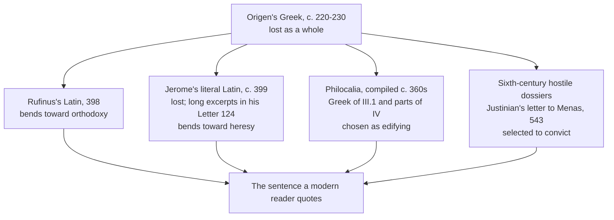

# The Church Fathers · Lesson 2.5: Clement of Alexandria and Origen

> ⏱ ~15 min · Module 2: The rule of faith, Africa and Alexandria · Builds on: [2.3 Tertullian](02-03-tertullian.md), [1.1 How to read a Church Father](01-01-how-to-read-a-church-father.md) · Unlocks: [3.1 Athanasius](03-01-athanasius.md), [3.5 Allegory and history: Alexandria and Antioch](03-05-allegory-and-history-alexandria-and-antioch.md)

## Why this matters

Tertullian asked what Athens has to do with Jerusalem and meant it as a rebuke ([2.3](02-03-tertullian.md)). Alexandria answered: everything, if you know what philosophy is for. Out of that answer came the first Christian theology that looks like a system, and the sentence the fourth century could not have done without — that the Son was never not there.

It also came with the hardest textual problem in this course: for Origen's masterwork you do not have his words. You have a Latin translator who says in his preface that he corrected the doctrine as he went, a rival translator who made a literal version in order to convict him, and a handful of Greek scraps. So this lesson does two jobs at once: what the Alexandrians argued, and how to state what a text will bear when the text itself is a reconstruction.

## The idea

**Clement** (c. 150 to c. 215) was a convert who settled in Alexandria and taught there until persecution struck the city around 202 — the supposed edict of Septimius Severus rests on a weak source ([`church-history` 1.3](../../church-history/lessons/01-03-persecution-and-martyrdom.md)) — after which he left and died in Asia Minor.

His programme is three books in sequence, and the sequence is the argument. The *Protrepticus* (*Exhortation to the Greeks*) turns a pagan around. The *Paedagogus* (*The Instructor*) puts Christ over the convert's manners, meals and dress: the Word trains character before he teaches doctrine. The *Stromata* (*Miscellanies*, literally patchwork) is deliberately unsystematic teaching for the mature; whether Clement ever wrote the promised third stage, a *Teacher*, is disputed.

Two moves make him matter. First, **philosophy is a covenant.** Greek philosophy was given to the Greeks "as a covenant peculiar to them", a stepping-stone to the philosophy that is according to Christ (*Stromata* VI.8). It is preparatory, not revelatory: in *Stromata* I.5 philosophy is the handmaid Hagar, wisdom the wife Sarah. Second, the **[true gnostic](../reference.md#the-true-gnostic)**. Rather than concede the word to the heretics of [2.1](02-01-irenaeus-against-the-gnostics.md), Clement takes it: the real *gnostikos* is the mature Christian whose knowledge is inseparable from charity.

**Origen** (c. 185 to c. 253) was Alexandrian by birth, and his father Leonides was martyred in the same trouble that drove Clement out. Eusebius, our main and admiring source, has him teaching converts in his teens; the story of his self-castration (*Ecclesiastical History* VI.8) is widely doubted today, as is the tidy picture of a "catechetical school" with an official succession of heads — many now read these circles as private philosophical schools. Ordained in Palestine around 231 without his own bishop's consent, he lost Alexandria and settled at Caesarea. He was tortured under Decius in 250 and died of it a few years later, in the Church's communion.

The [*Hexapla*](../reference.md#the-hexapla) set the Old Testament out in six parallel columns — the Hebrew, the Hebrew transliterated into Greek, and the versions of Aquila, Symmachus, the Septuagint and Theodotion — so a disputed reading could be checked by eye; it is the first work of biblical textual criticism, and survives only in fragments. *On First Principles* is the first connected account of God, rational creatures, the world and Scripture. Its preface states the method: the apostles delivered certain points plainly and left the grounds and the open questions for later inquiry, so the work marks what the Church has settled and then thinks aloud about the rest. That distinction is the key to reading him, and exactly what a hostile excerptor can drop. His theory of the senses of Scripture is the other great contribution, and it belongs to [3.5](03-05-allegory-and-history-alexandria-and-antioch.md).

## Source

Clement, *Stromata* I.5, in the *Ante-Nicene Fathers* (William Wilson's translation, public domain):

> Perchance, too, philosophy was given to the Greeks directly and primarily, till the Lord should call the Greeks. For this was a schoolmaster to bring the Hellenic mind, as the law, the Hebrews, to Christ.

Origen, *On First Principles* I.2.2, in the *Ante-Nicene Fathers* (Frederick Crombie's translation of Rufinus's Latin):

> And who that is capable of entertaining reverential thoughts or feelings regarding God, can suppose or believe that God the Father ever existed, even for a moment of time, without having generated this Wisdom? … Wherefore we have always held that God is the Father of His only-begotten Son, who was born indeed of Him, and derives from Him what He is, but without any beginning, not only such as may be measured by any divisions of time, but even that which the mind alone can contemplate within itself.

## The argument - the Son has no beginning

Origen's case for [eternal generation](../reference.md#eternal-generation) is short and turns entirely on what God is like.

1. **The Son is the Wisdom of God, and Wisdom subsists.** Not an attribute of God, not a disposition he has, but "hypostatically existing" — someone, not something. *In words: Wisdom is a who.*
2. **God does not acquire perfections.** He cannot move from being unable to being able, or from a lower state to a higher. *In words: whatever God is, he always was.*
3. **Suppose there was a moment when the Father had not generated Wisdom.** Then either he could not, or he could and chose not to. *In words: the only two options, and both are about God's power or will.*
4. **"Could not" makes God improve.** He would have advanced from inability to ability, which premise 2 forbids. *In words: God does not get better at being God.*
5. **"Would not" makes God withhold.** He would have concealed a power it was good to use, which cannot be said of him without impiety. *In words: God does not sit on his own goodness.*

∴ **The Father has always generated the Son, without any beginning — none measured by time, and none the mind can posit by thinking the Father alone first.** The generation is not an event but a permanent relation; Origen's image is the brightness streaming from the sun, which the sun never began to emit.

Keep the honest other half in view. Origen also calls the Son a "second God" (*Against Celsus* V.39) and gives the Son and the Spirit a lesser scope of operation than the Father. Both halves are his. Pre-Nicene Greek had no settled way to say *distinct in person, equal in nature*; that vocabulary is the Cappadocians' work ([3.2](03-02-basil-the-great.md)), and Origen supplied the premise Nicaea needed generations before anyone had the words to guard it. He is, by the marks of [1.1](01-01-how-to-read-a-church-father.md), an [ecclesiastical writer](../reference.md#father-doctor-and-ecclesiastical-writer) rather than a Father — and one without whom the Fathers are unintelligible.

## The transmission stack

Every quotation of *On First Principles* comes down one of four pipes, and each pipe bends in a known direction.

Rufinus tells you what he did. From the prologue to his translation (*Ante-Nicene Fathers*, volume 4):

> If, therefore, we have found anywhere in his writings, any statement opposed to that view, which elsewhere in his works he had himself piously laid down regarding the Trinity, we have either omitted it, as being corrupt, and not the composition of Origen

He is not confessing a fraud. He believed, and argued in a separate tract, that heretics had corrupted Origen's books, so removing a heterodox sentence was restoring the text; and he notes that Jerome had already "smoothed and corrected" Origen's homilies so a Latin reader would meet nothing discordant with the faith. Jerome then spent years attacking him for doing it. The *Philocalia*, an anthology of Origen traditionally compiled by Basil and Gregory of Nazianzus ([3.2](03-02-basil-the-great.md)), is the one pipe that delivers real Greek — but only of the pieces two admirers thought worth keeping.

**The rule this course takes from it:** before you quote Origen, [name the pipe](../reference.md#the-transmission-stack). "Origen says" is a claim about a manuscript tradition, not just about a man — the discipline of [checking a quotation](../reference.md#how-to-check-a-patristic-quotation) from [1.1](01-01-how-to-read-a-church-father.md), at its hardest.

## Worked examples

**Example 1 — one book, two translators.** Take Book I on the Son. In Rufinus you get the Source passage above: no beginning, in time or in thought. In Jerome's Letter 124 to Avitus, reporting his own literal version, the same book says Christ was *made* God's son and not born, that the Father is invisible even to the Son, and that the Son is inferior as second to first.

Run the stack. Rufinus's bend is toward orthodoxy and this is precisely a Trinitarian passage — the case his prologue warns you about. Jerome's bend is toward heresy, and he is summarizing rather than transcribing. So the honest statement is layered: *that* Origen taught eternal generation is not in doubt, since defenders and accusers agree he did; but no particular Latin sentence of Book I can be quoted as his wording. Say "Origen, as Rufinus gives him" or "as Jerome reports him", and name which way that witness leans. Notice this costs you almost nothing doctrinally and everything rhetorically: the argument survives, the proof-text does not.

**Example 2 — where it strains: the restoration of all things.** Origen is associated with two teachings the Church did not receive: the pre-existence of souls, and [universal restoration](../reference.md#universal-restoration) (*apokatastasis*), in which every rational creature, perhaps including the devil, is finally healed. Jerome's letter quotes Book I and Book III to exactly this effect: rational creatures falling by negligence, demons returning to their first estate.

Now the strain. Those are the pipes that bend toward heresy, and *On First Principles* explicitly speculates where the Church has not defined. Did Origen hold these as doctrine or propose them as inquiry? In 543 the emperor Justinian issued an edict against Origenism with anathemas, endorsed by a synod at Constantinople; a set of fifteen anathemas against Origenism is attached to the Second Council of Constantinople in 553, and scholars dispute whether the council itself passed them or a synod immediately before it did, as they dispute whether Origen's name in the council's eleventh canon is original or a later insertion. The target of those anathemas was in any case the living Origenism of sixth-century Palestinian monks, which had developed far beyond its source. **State the dispute; do not settle it.** What is not disputed: the condemned propositions are condemned, and neither pre-existence nor universal restoration is Catholic teaching — a writer's [opinion is never Church teaching](../reference.md#opinions-the-church-did-not-receive); for the levels involved see [`fundamental-theology` 4.4](../../fundamental-theology/lessons/04-04-the-ladder-of-doctrinal-authority.md).

## Watch out

- **You might think Origen was condemned in his lifetime.** He was not: he was tortured as a confessor under Decius and died in communion. The anathemas are three centuries later and their conciliar standing is itself contested.
- **You might think Rufinus was a forger and the Latin worthless.** He states his method in the preface, by his own lights he was removing heretical interpolations, and his version is most of what we have. It is not a fraud and it is not a transcript; it is a witness with a known bias.
- **You might think Clement is on the Roman calendar.** He was venerated as a saint into the sixteenth century; his name was dropped from the Roman Martyrology in the Baronian revisions of the late 1500s, and Benedict XIV upheld the omission in 1748 — Clement's life was little known, he had no public cult, and some doctrines were at least suspect. Photius had already censured errors in his lost *Hypotyposes*.
- **You might think "philosophy is a covenant" makes philosophy revelation.** For Clement it is preparatory and subordinate, and what sorts its results is the Church's rule of faith ([2.1](02-01-irenaeus-against-the-gnostics.md)).

## One-liner

> Alexandria baptized Greek learning and handed the fourth century a Son with no beginning — through translators who were either saving Origen or convicting him, which is why you name the pipe before you quote the man.

## Problems

**P1 (🟢) *(Exegetical.)*** Jerome, *Letter* 124 to Avitus, reporting his own literal Latin version of *On First Principles* Book I (*Nicene and Post-Nicene Fathers*, second series, translated by Fremantle, Lewis and Martley):

> It begins by saying that Christ was made God's son not born; that God the Father, as He is by nature invisible, is invisible even to the Son; that the Son, who is the likeness of the invisible Father, compared with the Father is not the truth but compared with us who cannot receive the truth of the almighty Father seems a figure of the truth … The Holy Spirit he places after the Father and the Son as third in dignity and honour. And while he declares that he does not know whether the Holy Spirit is created or uncreated, he has later on given his own opinion that except God the Father alone there is nothing uncreated.

(a) List what this passage reports Book I as holding about the Son and about the Spirit. **Two sentences.**
(b) The Source passage above is the same book in Rufinus. Name the features of the transmission that produce the difference, and say which way each witness leans. **Two sentences.**
(c) A writer cites this passage as "Origen's own words". What is wrong with that description, and what is the most a careful writer may claim from it? **Two sentences.**

**P2 (🟡) *(Exegetical (a) · Evaluative (b).)*** Origen and the anathemas.

(a) State precisely what happened in 543 and in 553, what is disputed among scholars about the 553 material, and what a Catholic must hold about the condemned propositions regardless of how that dispute goes. Be exact about which body did what. **100 words or fewer.**
(b) A historian claims that *Origen himself* taught universal restoration as doctrine, not as inquiry. Say what evidence would have to be produced to make that claim stick, what the standing obstacles are, and give your verdict on whether the claim can be established on the evidence we have. **150 words or fewer.**

**P3 (🔴, optional) *(Exegetical.)*** An invented paragraph from a parish study-group handout:

> "As St Clement of Alexandria, Doctor of the Church, teaches, philosophy was 'a schoolmaster to bring the Hellenic mind to Christ' — which is why the Church has always held Greek philosophy to be a third testament alongside the Old and the New. His pupil Origen, condemned as a heretic at the Council of Nicaea, tells us in his own words in *On First Principles* that souls existed before their bodies."

Name the errors and correct each in one sentence. For each, say whether the claim is **false**, **overstated as to level or status**, or **a misuse of a source**. **150 words or fewer.**

Solutions

**P1** *(Exegetical — strict.)*

**Must hit, strict:**
- (a) **The Son:** made rather than born; unable to see the invisible Father; not the truth in comparison with the Father but a figure of it for us; that is, subordinate in knowledge and in being. **The Spirit:** third in dignity and honour after Father and Son, with Origen professing not to know whether the Spirit is created or uncreated, and elsewhere holding that nothing but the Father alone is uncreated — which puts the Spirit on the created side.
- (b) The two witnesses are **translations with opposite biases**: Rufinus states in his prologue that he omitted or adjusted statements clashing with what Origen says piously elsewhere about the Trinity, so he bends toward orthodoxy; Jerome made his version to expose Rufinus and is here **summarizing polemically rather than transcribing**, so he bends toward heresy. The Greek that would settle it is lost for Book I, since the *Philocalia* preserves III.1 and parts of IV.
- (c) It is not a quotation of Origen but a hostile Latin report of a lost Latin translation of a lost Greek original — three removes. The most a careful writer may claim is that Jerome, who had the Greek in front of him and every motive to find subordinationism, reports Book I as teaching it; corroboration is needed before it is attributed as Origen's wording.

**Wrong turns:** treating Jerome as neutral because he is a Father and a scholar — the letter's own occasion is the quarrel with Rufinus; concluding that because both witnesses are biased, nothing can be said, when the *convergent* report of subordinationist language is in fact well supported by the Greek of *Against Celsus* V.39.

**Model answer:** (a) The Son is made not born, cannot see the Father, and is a figure of the truth rather than the truth; the Spirit ranks third, is possibly created, and on Origen's stated view of the uncreated falls on the creature's side. (b) Rufinus smooths toward orthodoxy by his own declared rule; Jerome sharpens toward heresy and is summarizing to win an argument. (c) These are Jerome's words about a lost text at three removes; the most one may say is that a hostile witness with access to the Greek read Book I this way.

---

**P2** *(a) exegetical — strict; (b) evaluative — any verdict.*

**Must hit, strict (a):** in **543** the emperor **Justinian** issued an edict against Origenism carrying anathemas, which a **synod at Constantinople** endorsed; it was an imperial act ratified by a local synod, not an ecumenical definition. In **553** the **Second Council of Constantinople** met, and a set of **fifteen anathemas against Origenism** is associated with it; scholars dispute whether the ecumenical council itself issued them or a synod sitting immediately before it did, and whether Origen's name in the council's eleventh canon is original or a later insertion. Regardless: the **propositions** — the pre-existence of souls and a universal final restoration — are condemned and are not Catholic teaching, and no Catholic may hold them on Origen's authority; the historical question of authorship of the anathemas does not reopen the doctrinal one.

**Model answer (a):** In 543 Justinian issued an imperial edict against Origenism with anathemas, which a synod at Constantinople endorsed — a local act, not an ecumenical definition. In 553 the Second Council of Constantinople met; fifteen anathemas against Origenism are associated with it, and scholars dispute whether the council itself or a synod just before it issued them, and whether Origen's name in canon 11 is original. Either way the propositions stand condemned: pre-existence of souls and universal restoration are not Catholic teaching, and Origen's authority cannot be used to hold them.

**Must hit, any verdict (b):** name what would count as evidence — Greek text of Origen, securely attributed and in context, asserting the claim rather than canvassing it; corroboration from an independent pipe, ideally the *Philocalia* or a Greek-surviving work; and evidence that the sentence is put as teaching rather than inside the inquiry his own preface licenses. Name the obstacles — the Greek of the relevant books is lost, the surviving witnesses are the two biased Latin translations and the sixth-century dossiers assembled to convict, and the condemned Origenism had three centuries of development behind it. Then give a verdict. Either verdict passes if the moves are made.

**Wrong turns:** answering (a) with "an ecumenical council condemned Origen in 553" flat, which is the point in dispute; or with "so the condemnation does not count", which confuses the authorship of the anathemas with the status of the propositions. In (b), arguing from Origen's holiness or his later reputation instead of from the texts.

**Model answer (b), one of several:** It cannot be established on present evidence. The claim needs Greek, in context, in the voice of teaching; what we have for the relevant books is Rufinus, who removed what he judged corrupt, Jerome, who was writing to convict, and Justinian's excerptors, who were building a case. The *Philocalia*'s Greek covers III.1 and parts of IV and does not carry the weight. Add that *On First Principles* announces itself as inquiry beyond what the apostles delivered plainly, and the genre question is unresolved even where the wording is not. I would say the texts show Origen entertaining and probably favouring a final restoration, and that the stronger claim — held as doctrine — outruns the evidence. A Greek manuscript of Book III would change my answer.

---

**P3** *(Exegetical — strict.)*

**Must hit, strict:**
1. "Doctor of the Church" — **overstated as to status**: Clement holds no such title; his name was in fact dropped from the Roman Martyrology in the Baronian revisions of the late sixteenth century, and Benedict XIV upheld the omission in 1748.
2. "A third testament alongside the Old and the New" — **a misuse of a source**, and false. Clement's own images make philosophy preparatory and subordinate: a schoolmaster, a handmaid to the wife, a stepping-stone to the philosophy according to Christ.
3. "The Church has always held" — **overstated as to level**: this is one theologian's position, argued and contested (Tertullian took the opposite line), not Church teaching.
4. "Condemned as a heretic at the Council of Nicaea" — **false**: Nicaea (325) said nothing about Origen; the anathemas come in 543 and 553, and their conciliar standing is disputed.
5. "In his own words in *On First Principles*" — **a misuse of a source**: the Greek is lost and we read it through Rufinus, who declares he adjusted it, and Jerome, who set out to convict it.

**Wrong turns:** correcting 4 by saying Origen was never condemned at all, which overcorrects — propositions associated with him were anathematized, and that much is not in doubt; conceding 2 on the ground that Clement did value philosophy highly, which is true and beside the point, since the error is the word *testament*.

**Two things that are not errors, and are credit as caveats only:** "his pupil" — Eusebius says Origen studied under Clement and some scholars doubt it, so it is a caveat, not a sixth error; and the handout's compression of the Clement line, which drops the parallel clause about the law and the Hebrews without changing the sense.

**Model answer:** Clement is not a Doctor and is not on the Roman calendar; his name was removed in the Baronian revisions and Benedict XIV upheld it (overstated status). Philosophy as schoolmaster and handmaid is preparatory, not a testament (misuse of source), and it is Clement's position, not the Church's (overstated level). Nicaea never touched Origen; the anathemas are sixth-century and their conciliar standing is disputed (false). And nothing in *On First Principles* is quotable as Origen's own words, since the Greek is lost and both Latin witnesses declare an agenda (misuse of source).

## Flashback

**From Lesson [2.3](02-03-tertullian.md) (Tertullian):** *(Exegetical.)* A church history carries this footnote: "As Tertullian wrote, 'The blood of the martyrs is the seed of the Church' (*Apology* 50)." The sentence at *Apology* 50 reads, in the *Ante-Nicene Fathers* (Thelwall's translation): "The oftener we are mown down by you, the more in number we grow; the blood of Christians is seed." (a) Name the two things the familiar form alters or adds, and say what each does to the claim. (b) The footnote offers the familiar form as a quotation. Say what a careful writer should call it instead, and whether the chapter reference is sound. **Two sentences per part.**

Solution

**Must hit, strict (a):** (i) **"Christians" becomes "the martyrs."** Tertullian's subject is the whole body being cut down by the magistrates — the clause before it is "the oftener we are mown down by you, the more in number we grow" — and the familiar form narrows that to a class and dresses it in a term of honour he did not use here. (ii) **"seed" acquires "of the Church."** The Latin, *semen est sanguis Christianorum*, names no Church at all; what the seed yields in Tertullian's own sentence is more Christians, so the added genitive swaps a boast about numbers under persecution for a claim about an institution's growth.

**Must hit, strict (b):** it is a **paraphrase**, and should be introduced as one ("in Tertullian's phrase", "Tertullian's boast that …") rather than set in quotation marks. The chapter reference is sound: the sentence is in *Apology* 50.

**Wrong turns:** filing this with "credo quia absurdum" — that tag is in no surviving work of Tertullian, whereas this sentence is really there and the paraphrase keeps its drift, which is exactly why it circulates unchallenged; calling the citation wrong; treating the change as harmless because the sense is close, when the quoted form is routinely produced as evidence for a claim about the Church that the Latin does not make.

**Model answer:** (a) "Martyrs" replaces "Christians", narrowing a claim about the whole body under judicial killing to the killed alone; and "of the Church" is added to "seed", which the Latin lacks, so the harvest becomes an institution rather than the "more in number we grow" of the preceding clause. (b) It is a paraphrase and should be labelled one, not quoted; *Apology* 50 is the right place, and the Latin is *semen est sanguis Christianorum*.

## Connections

- **Backward:** [2.1](02-01-irenaeus-against-the-gnostics.md) gave the rule of faith as the criterion that sorts what philosophy hands over, and the Gnostics whose name Clement takes back. [2.3](02-03-tertullian.md) is the opposite answer on Athens and Jerusalem, and the same problem of a writer whose standing complicates his testimony. [1.1](01-01-how-to-read-a-church-father.md) supplies the marks by which Origen is an ecclesiastical writer, and the checking discipline this lesson pushes to its limit.
- **Forward:** [3.1](03-01-athanasius.md) takes the premise of eternal generation into the Arian crisis; [3.2](03-02-basil-the-great.md) supplies the *ousia* and *hypostasis* vocabulary Origen lacked, and Basil is also the compiler of the *Philocalia* that preserves what Greek we have. [3.3](03-03-the-two-gregories.md) meets universal restoration again in Gregory of Nyssa, where the same "disputed reading" problem returns. [3.5](03-05-allegory-and-history-alexandria-and-antioch.md) takes up Origen's theory of the senses of Scripture and the Antiochene reply.
- **Sideways:** the Middle and Neo-Platonism these men breathed is [`ancient-medieval-philosophy` 4.4](../../ancient-medieval-philosophy/lessons/04-04-plotinus-the-one-intellect-and-soul.md) — Porphyry reports that Origen studied under Ammonius Saccas, Plotinus's teacher, though whether he means this Origen is disputed. The events around the Alexandrian church and the Decian persecution are [`church-history` 1.3](../../church-history/lessons/01-03-persecution-and-martyrdom.md). What the condemned propositions mean for the doctrine of the last things belongs to `creation-grace-last-things`.
