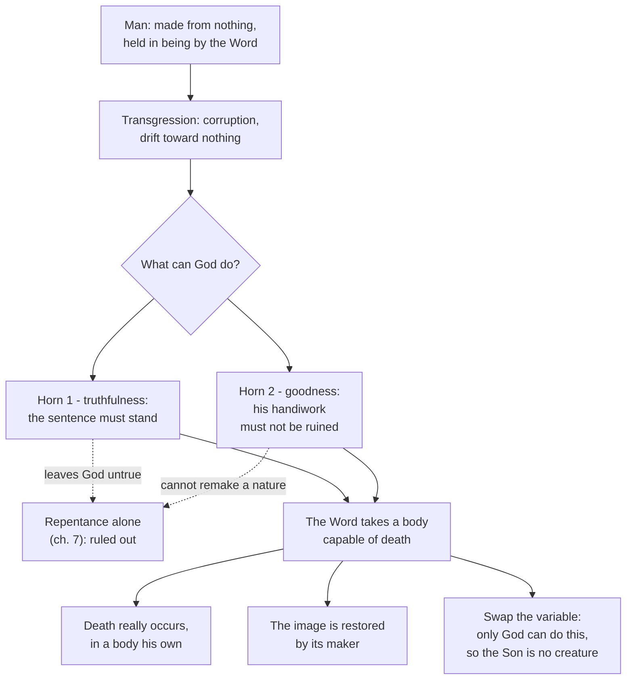

# The Church Fathers · Lesson 3.1: Athanasius

> ⏱ ~15 min · Module 3: The fourth-century East · Builds on: [2.5 Clement of Alexandria and Origen](02-05-clement-of-alexandria-and-origen.md), [2.2 Irenaeus: recapitulation](02-02-irenaeus-recapitulation.md) · Unlocks: [3.2 Basil the Great](03-02-basil-the-great.md), [3.3 Gregory of Nazianzus and Gregory of Nyssa](03-03-the-two-gregories.md)

## Why this matters

For fifty-six years after 325 the bishops of the empire argued over one word, and for most of them the word was losing. What kept it alive was not conciliar authority — the councils kept voting the other way — but an argument, and it belongs to one man more than anyone else. Athanasius's claim: everything Christians said was happening to them depended on the Son being God in the same sense the Father is, so conceding one step meant conceding salvation itself. Learn the shape of that argument and you have the engine of the next hundred and fifty years — the Cappadocians and Cyril run the same machine with a different part swapped in.

## The idea

Athanasius (c. 296–373) attended Nicaea in 325 as deacon and secretary to Bishop Alexander of Alexandria, succeeded him in 328, and was driven from his see five times under four emperors — some seventeen of his forty-five years as bishop in exile. The exiles, councils and politics belong to [`church-history` 2.1](../../church-history/lessons/02-01-nicaea-and-the-imperial-church.md); his *Life of Antony*, which launched monastic literature in the Latin West, to [`church-history` 2.3](../../church-history/lessons/02-03-the-desert-and-the-monastery.md). Here he is read as a theologian, and as a theologian he has one move.

Most arguments about Christ run forwards: settle who he is, then work out what he did. Athanasius runs the argument **backwards**. He starts from what Christians claim has happened to them — pulled back from disintegration, given a share in God's own life — and asks what the rescuer must be for that to be true. If an act can only be done by God, a creature cannot do it; so if the Son is a creature, the act did not happen and nobody has been saved. Call this the [soteriological argument pattern](../reference.md#the-soteriological-argument-pattern): *reason from the effect claimed to the nature required to produce it.*

The pattern appears first in a work with no heretics in view. *[On the Incarnation](../reference.md#on-the-incarnation)* — the second half of a treatise addressed to one Macarius, whose first half, *Against the Nations*, attacks idolatry — answers a question of taste rather than doctrine: why would God stoop to a body, and to that death? He answers with a [dilemma inside God's own character](../reference.md#the-divine-dilemma). Later, against those who called the Son a creature, he swaps the variable and the machine yields a conclusion about the Son's essence.

## Source

*On the Incarnation* 6, in Archibald Robertson's translation (*Nicene and Post-Nicene Fathers*, 2nd series, vol. 4, public domain). Athanasius has just described the race of men wasting away under the sentence pronounced in Genesis:

> For it were monstrous, firstly, that God, having spoken, should prove false — that, when once He had ordained that man, if he transgressed the commandment, should die the death, after the transgression man should not die, but God's word should be broken. For God would not be true, if, when He had said we should die, man died not. … So, as the rational creatures were wasting and such works in course of ruin, what was God in His goodness to do? … For neglect reveals weakness, and not goodness on God's part. … It was, then, out of the question to leave men to the current of corruption; because this would be unseemly, and unworthy of God's goodness.

Two words carry the chapter: *true* and *goodness*. Everything after tries to satisfy both at once.

## The argument

### The divine dilemma

1. **Man was made out of nothing, and holds together only by a gift.** Being "after the image" means sharing in the Word; withdraw the share and what was made from nothing drifts back toward nothing. *In words: creaturely existence is borrowed, and sin cancels the loan.*
2. **The sentence of death was pronounced by God and therefore stands.** *In words: a threat God declines to execute makes God a liar.*
3. **So God's truthfulness requires that death actually take place** — *horn one: the sentence must be carried out.*
4. **But God's goodness forbids his handiwork, made rational and in his image, to be left to ruin.** Athanasius twists the knife: abandoning it would show weakness, not goodness, and make the creating worse than not creating. *Horn two: the image must be restored.*
5. **Repentance satisfies neither horn** (ch. 7; close-read in P1). *In words: the obvious human remedy is ruled out twice over.*
6. **Only the one who made the image can remake it, and only one above all can die on behalf of all.** *In words: the job description names exactly one candidate.*
7. **Therefore the Word takes a body of our kind, gives it over to death in the stead of all, and raises it.** Death happens, so truth is kept; the image is restored by its Artificer, so goodness is kept. *In words: the Incarnation is the only move that pays both debts at once.*

The famous summary sits at ch. 54: "For He was made man that we might be made God." That sentence is reserved for the module's boss problem; what matters now is the machinery behind it.

### The same machine, against the Arians

The slogan Athanasius spends four discourses attacking is one the Nicene party quoted back at its opponents: in Robertson's revision of Newman, *["There was once when He was not"](../reference.md#there-was-when-he-was-not)* (*Orations against the Arians* I.11), with its twin, "He was not before His generation." Both say one thing — the Son had a beginning, and so falls on the creature side of the line.

Athanasius rarely answers by exegesis alone. He plugs the new variable into the old pattern:

> if the Son were a creature, man had remained mortal as before, not being joined to God; for a creature had not joined creatures to God (*Orations against the Arians* II.69)

and, in the next section, that man had not been deified if joined to a creature, or unless the Son were very God. *In words: you cannot be bridged to God by something on your own side of the gap.* The conclusion is not "the Son is divine because a text says so" but "the Son must be God, or what you say happened to you at baptism did not happen."

### Why a word that is not in the Bible

Athanasius knew *[homoousios](../reference.md#homoousios)* — "of one essence" — is not scriptural, and in *On the Decrees of the Nicene Synod* he explains why the council used it anyway. The bishops first tried to say only what Scripture says: the Son is "from God," not a creature. The Arian party agreed cheerfully — "from God" is said of everything (1 Corinthians 8:6) — so they wrote "from the essence of God." On the next round they accepted "like," "always," "power" and "in Him" while, Athanasius says, whispering and winking to each other, since all those words are used of us too. Hence the last step:

> the Bishops … were again compelled on their part to collect the sense of the Scriptures, and to re-say and re-write what they had said before, more distinctly still, namely, that the Son is 'one in essence' with the Father (*On the Decrees* 20)

*In words: the new word was not an addition to Scripture but a fence around its sense, forced by opponents who could sign every scriptural formula and mean the opposite.* This is the classic patristic defence of non-scriptural vocabulary; *ousia*, and how it differs from *hypostasis*, is worked out in [3.2](03-02-basil-the-great.md).

## Argument map

## Worked examples

**Example 1 (clean: why the obvious fix fails).** Suppose a reader grants premises 1–4 and proposes the humane fix: let God accept repentance. Athanasius's reply in ch. 7 is not that repentance is worthless — he says one might pronounce it worthy of God — but that it is the wrong *kind* of thing twice over. Against horn one, forgiving the penalty leaves the sentence unexecuted, so God is "none the more true." Against horn two, repentance changes what a person does, not what he is; it "merely stays them from acts of sin" and cannot reach a nature coming apart. So the dilemma is not about God's feelings but about two constraints nothing short of death-and-remaking satisfies together. Notice the picture of sin it runs on: **corruption of nature**, not guilt in a courtroom; import the later Latin debt-and-satisfaction frame and you will hear what Athanasius does not say. (The Latin vocabulary starts with Tertullian, [2.3](02-03-tertullian.md); original sin as defined is `creation-grace-last-things`'s.)

**Example 2 (where it strains: the word had a bad record).** Anyone attacking Nicaea in the 350s had a strong card. A synod at Antioch — conventionally dated 268 — deposed Paul of Samosata and refused the term *homoousios*: Nicaea had adopted a word its own predecessors rejected in a heresy trial. Athanasius meets this in *On the Synods* 43–45 with a distinction, not a denial. The seventy bishops met *his* sophistry, he says: Paul argued that if the Son is "of one essence" with the Father there must be three essences, one prior and two derived — a material, quantitative picture of God. They rejected it in that sense; Nicaea used it in another, to deny the Son is from nothing. Hence each council "has a sufficient reason for its own language," and the two differ in words while agreeing in faith.

Two things are worth noticing. First, the reply concedes the fact and disputes the inference — the honest shape [1.1](01-01-how-to-read-a-church-father.md) asks for when evidence cuts the other way. Second, it commits Athanasius to the claim that terms carry the sense their users give them, so a word can be condemned in one synod and defined in another without contradiction — which is what makes doctrinal development describable at all, and is taken up under Vincent's rule in [`fundamental-theology` 5.1](../../fundamental-theology/lessons/05-01-vincent-of-lerins.md).

## Watch out

- **"Made God" is not pantheism, and Athanasius says so in the same breath.** [Deification](../reference.md#deification) means creatures are adopted as sharers in what the Word is, receiving by grace what the Son is by nature (*Orations* I.39). The asymmetry is the point: the Son is not deified, he deifies. Make human beings divine in the Son's own sense and you destroy the argument, which needs the creature–God gap to be real.
- **Watch whose slogan it is.** "There was once when He was not" reaches us through the pen of the man attacking it. He also supplies the narrative of one continuous "Arian party" descending from Arius, which recent scholarship — Lewis Ayres, R. P. C. Hanson — argues he largely constructed. That dispute is [`church-history` 2.1](../../church-history/lessons/02-01-nicaea-and-the-imperial-church.md)'s; take only the rule: a polemicist's summary of his opponents is evidence about the polemicist first.
- **The date of *On the Incarnation* is disputed; nothing here should rest on it.** The treatise names neither Arius nor any Nicene term, which the older and commonest dating reads as proof of composition around 318, before the controversy; Charles Kannengiesser and others argue for the 330s. Report it as disputed and give the traditional date as the traditional date.
- **Athanasius did not write the Athanasian Creed.** The *Quicumque vult* is a fifth- or sixth-century Latin text, on [1.1](01-01-how-to-read-a-church-father.md)'s list of works that travelled under a great name. Nor is his *theology* Church teaching: what the Church defines about the Son is Nicaea's, defined dogma ([`fundamental-theology` 4.4](../../fundamental-theology/lessons/04-04-the-ladder-of-doctrinal-authority.md)), and belongs to `trinity-and-god`. His arguments *for* it are one Doctor's private theology, however influential; the title endorses no particular argument of his.

## One-liner

> Athanasius argues backwards from rescue to rescuer: if what happened to us is that we were joined to God, then whatever joined us cannot have been on our side of the gap.

## Problems

**P1 (🟢) *(Exegetical.)*** *On the Incarnation* 7, immediately after the Source passage (Robertson, NPNF 2nd series, vol. 4):

> But just as this consequence must needs hold, so, too, on the other side the just claims of God lie against it: that God should appear true to the law He had laid down concerning death. … So here, once more, what possible course was God to take? To demand repentance of men for their transgression? For this one might pronounce worthy of God; as though, just as from transgression men have become set towards corruption, so from repentance they may once more be set in the way of incorruption. But repentance would, firstly, fail to guard the just claim of God. For He would still be none the more true, if men did not remain in the grasp of death; nor, secondly, does repentance call men back from what is their nature — it merely stays them from acts of sin.

(a) Athanasius gives two distinct reasons repentance will not serve. State each in your own words and quote the words that carry it. (b) Say which horn of the dilemma — truthfulness or goodness — each reason is protecting. Two sentences per part.

**P2 (🟡) *(Exegetical.)*** An invented parish-bulletin note (not a quotation from any real writer; the Athanasius material in it is accurately reported):

> "Athanasius gives the game away himself. He admits the council wanted to use only the acknowledged words of Scripture, and that when the other side kept agreeing to those words, the bishops were *compelled* to write something else — a term the apostles never used. He also has to admit that an earlier synod at Antioch had already refused the very same term. A word the Bible does not contain, rejected once and imposed later: that is not the faith handed down, that is the faith upgraded."

(a) Two distinct claims are being run together here. Name them, and say which one Athanasius concedes outright. (b) Give his answer to the Antioch point and the single distinction it turns on. 150 words or fewer in total.

**P3 (🔴, optional) *(Exegetical (a) · Evaluative (b).)*** *On the Incarnation* never names Arius and never uses Nicaea's vocabulary.

(a) That silence is read as evidence of an early date. Give the reason someone holding a late date can offer for the same silence, drawn from the treatise's own stated purpose and addressee. One or two sentences.
(b) A writer wants to cite *On the Incarnation* to show that Athanasius already held the Son's full divinity **before** Nicaea. In 150 words, any verdict: say what the disputed date does to that argument, and what would have to be shown for it to go through.

Solutions

**P1** *(Exegetical.)*

**Must hit, strict (a):** two reasons, kept apart. (i) Repentance leaves God's sentence unexecuted, so it does not vindicate his truthfulness: it would "fail to guard the just claim of God," and "He would still be none the more true, if men did not remain in the grasp of death." (ii) Repentance reaches acts, not nature: it "does not call men back from what is their nature — it merely stays them from acts of sin." Athanasius's own "firstly … nor, secondly" marks the division.

**Must hit, strict (b):** reason (i) protects **truthfulness** (premise 3 — the sentence of death must actually stand). Reason (ii) protects **goodness** (premise 4 — the image, a nature in dissolution, has to be restored, and stopping the sinning does not restore it).

**Wrong turns:** collapsing the two into one reason ("repentance just isn't enough"); reading (ii) as a claim that repentance is useless or unworthy — Athanasius explicitly grants that one might pronounce it "worthy of God"; answering that repentance fails because sin had grown too great, which is a different argument from a different chapter.

**Model answer:** (a) First, repentance would leave God's own sentence unexecuted, so his truthfulness would go unvindicated — it would "fail to guard the just claim of God," and he "would still be none the more true, if men did not remain in the grasp of death." Second, repentance operates on behaviour, not on a corrupted nature: it "does not call men back from what is their nature — it merely stays them from acts of sin." (b) The first reason protects the truthfulness horn, since the threatened death must really occur. The second protects the goodness horn, since the ruined image has to be remade and mere restraint from sinning leaves it ruined.

---

**P2** *(Exegetical.)*

**Must hit, strict (a):** the two claims are (i) the **word** is unscriptural and was newly required — which Athanasius concedes outright in *On the Decrees* 19–20, since his whole account is of bishops who wanted the acknowledged words of Scripture and were compelled to write more distinctly; and (ii) the **sense** taught is therefore a novelty, the faith "upgraded" — which he denies. The note slides from vocabulary to doctrine. Credit for naming the reason he gives for the slide being illegitimate: the term was adopted to "collect the sense of the Scriptures" against opponents who could sign "from God," "like," "always," "power" and "in Him" and mean something else.

**Must hit, strict (b):** *On the Synods* 43–45. The synod that deposed Paul of Samosata rejected *homoousios* in the sense Paul's own argument forced on it — a material, quantitative sense that would make three essences, one prior and two derived. Nicaea used the word in a different sense, to exclude the Son's being from nothing. The distinction is between the **word** and the **sense a user gives it**; hence, in Athanasius's phrase, each council has a sufficient reason for its own language.

**Wrong turns:** arguing whether Nicaea was in fact right, which is `trinity-and-god`'s question and `apologetics-catholic-claims`'s dispute, not this one; denying that *homoousios* is unscriptural, which Athanasius does not deny; saying the Antioch synod never happened or never touched the term; treating "the bishops were compelled" as an admission of bad faith rather than as his description of the opponents' evasions.

**Model answer:** The note runs together a claim about vocabulary — that "one in essence" is not a biblical word and was newly forced on the council — and a claim about doctrine, that the teaching is therefore new. Athanasius concedes the first without embarrassment: the bishops wanted Scripture's own words and were driven past them only because the other side could sign every scriptural phrase in its own sense, so the new term fences the sense of Scripture rather than adding to it. On Antioch, his answer in *On the Synods* 43–45 is a distinction between the term and the sense given it: Paul of Samosata's use made the word imply three essences, and the synod rejected it in that sense; Nicaea used it to deny that the Son is from nothing. Same word, different sense — so the two councils differ in language, not in faith.

---

**P3** *(Exegetical (a) · Evaluative (b).)*

**Must hit, strict (a):** the treatise is an apologetic addressed to an outsider — Macarius — and aimed at what, in its own opening, Jews traduce and Greeks laugh to scorn, with chs. 33 onwards answering each in turn. An author writing for that audience and that purpose has no occasion to name a presbyter of Alexandria or to deploy a conciliar term, so the silence is what genre and addressee predict and does not by itself date the work. Credit also for: the work's argument runs on the Word as creator and deifier, which needs no Nicene vocabulary to make.

**Must hit, any verdict (b):** distinguish the two things the citation asserts — that Athanasius held the doctrine, and that he held it before 325 — and note that only the second depends on the date. Say that a disputed date cannot be used as an undisputed premise, and that the treatise's silence is the very thing in dispute, so it cannot be the evidence for it. Then name what would have to be shown: dating evidence independent of the silence (external attestation, relation to datable works or events, the relation to *Against the Nations*), or a version of the argument that does not need the early date at all. Either verdict passes.

**Wrong turns:** arguing the development-of-doctrine question itself, which is [`fundamental-theology` 5.1](../../fundamental-theology/lessons/05-01-vincent-of-lerins.md)'s and `apologetics-catholic-claims`'s; treating Kannengiesser's late date as settled, or the traditional date as settled; concluding that on a late date the treatise is worthless evidence about Athanasius's theology — it is excellent evidence about his theology, just not about its chronology; reading "no Nicene vocabulary" as "no high Christology," which the text refutes on every page.

**Model answer (b), one of several:** The citation makes two claims, and only one of them needs the date. That Athanasius argues for the Word's full divinity in *On the Incarnation* is plain from the text and survives any dating. That he did so before 325 is a chronological claim resting on a date that is disputed, and disputed precisely over the silence being used as evidence — so the argument as stated is circular at its weakest joint. I would keep the citation and drop the "before Nicaea." To restore it you would need dating evidence that does not run through the silence: external attestation, a demonstrable relation to datable events or to *Against the Nations*, or manuscript grounds. Failing that, cite the work for what Athanasius held and get the chronology from the letters of Alexander and the council record instead.

## Flashback

**From Lesson [2.4](02-04-cyprian-of-carthage.md) (Cyprian of Carthage):** *(Exegetical.)* *On the Unity of the Catholic Church* moves from a claim about the Church's oneness to a ruling about people baptized outside it. (a) Reconstruct that move in four numbered premises and a conclusion, in Cyprian's own terms — use the one episcopate held whole by each bishop (*in solidum*) and the Church as the only mother. **One clause per premise.** (b) Name the premise the Church did not receive, and the distinction with which Augustine kept the rest. **Two sentences for (b).**

Solution

**Must hit, strict (a):** any equivalent wording of these steps, in this order —
- **P1.** The Church is one because its origin is one — many rays, one light; many streams, one spring — so multiplicity is fine and a second source is not.
- **P2.** The episcopate is one and each bishop holds the whole of it *in solidum*, not a slice.
- **P3.** So a rival altar in a city that already has its bishop is not a second church but a departure from the one.
- **P4.** The Church is the only mother and baptism is birth from her womb, so there is exactly one place where Christians are made.
- **∴ C.** The schismatic or heretic has nothing to give — water poured outside is not baptism — so a convert baptized outside must be baptized on entering.

**Must hit, strict (b):** the last premise, that rites given outside are **empty rather than merely irregular**, with its rebaptism conclusion. The Church did not receive it: within some sixty years Western councils were admitting such converts by the laying on of hands alone, and Augustine supplied the theology against the Donatists — Christ, not the minister, baptizes, so a baptism given outside is **valid but not fruitful**. Credit for noting that Augustine grants the earlier premises in full and praises Cyprian while denying the last, and that Cyprian's own standing — saint, martyr, named in the Roman Canon — is untouched by the non-reception.

**Wrong turns:** naming "there is no salvation outside the Church" as the rejected premise, when the formula was kept and what was dropped is the inference that a baptism given outside is no baptism; reading *in solidum* as each bishop being sovereign, which is the opposite of joint liability for one undivided thing; treating the non-reception as a verdict on Cyprian's holiness or on his standing as a Father; collapsing P2 and P3, which loses the step where the argument actually turns on the city having one chair.

**Model answer:** (a) P1 one source, therefore one Church; P2 one episcopate, held whole by each bishop; P3 therefore no second church where a bishop already sits; P4 the one Church is the only mother, and baptism is birth from her. ∴ What is done outside her is not done at all, so converts baptized outside must be baptized in the Church. (b) The last premise, that the outsider's rite is empty. The Church settled the other way, and Augustine kept the first four by distinguishing a sacrament's validity from its fruit: Christ baptizes, so the baptism given outside is real but unfruitful until the man comes in.

## Connections

- **Backward:** [2.2](02-02-irenaeus-recapitulation.md) gave the older version of the same instinct — Irenaeus's recapitulation, where salvation is Christ doing over what Adam did — and Athanasius sharpens it into a premise about who the Saviour must be. [2.5](02-05-clement-of-alexandria-and-origen.md) supplied the Alexandrian habit of reading Scripture for the Word present throughout it, which this argument assumes. [1.1](01-01-how-to-read-a-church-father.md) supplied the rule applied in Example 2 and in P3: cite a work at the level of certainty its attestation supports, and say when a date or an attribution is disputed.
- **Forward:** [3.2](03-02-basil-the-great.md) runs the argument on the Holy Spirit and settles the vocabulary (*ousia* against *hypostasis*) that Athanasius uses loosely. [3.3](03-03-the-two-gregories.md) runs it on Christ's humanity — "what is not assumed is not healed" is premise 6 with the variable changed again — and [5.1](05-01-cyril-of-alexandria.md) runs it on the unity of Christ's person. Nicene doctrine as the Church defines it is `trinity-and-god`; deification as the Church teaches it is `creation-grace-last-things`.
- **Sideways:** the move in Example 2, that the same word can be refused in one synod and defined in another because users fix its sense, is the patristic seed of the development question handled in [`fundamental-theology` 5.1](../../fundamental-theology/lessons/05-01-vincent-of-lerins.md). Athanasius's Festal Letter 39 of 367, with its list of the twenty-seven New Testament books, is named here only; the canon belongs to [`new-testament`](../../new-testament/syllabus.md) and [`fundamental-theology` 3.3](../../fundamental-theology/syllabus.md).
