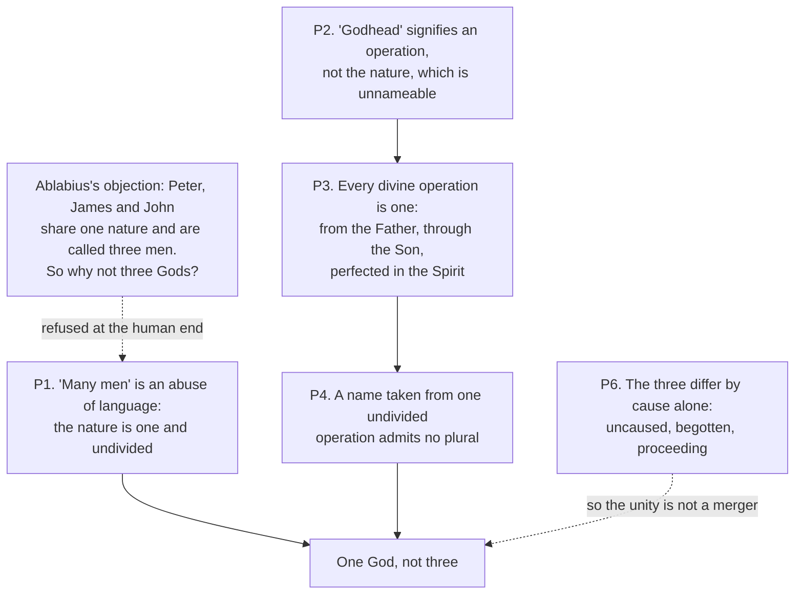

# The Church Fathers · Lesson 3.3: Gregory of Nazianzus and Gregory of Nyssa

> ⏱ ~15 min · Module 3: The fourth-century East · Builds on: [3.1 Athanasius](03-01-athanasius.md), [3.2 Basil the Great](03-02-basil-the-great.md) · Unlocks: [3.4 Ephrem and Syriac Christianity](03-04-ephrem-and-syriac-christianity.md), [5.1 Cyril of Alexandria](05-01-cyril-of-alexandria.md)

## Why this matters

Basil left two problems on the table. In *On the Holy Spirit* he argued the Spirit's divine honour from worship and tradition and never quite wrote "the Spirit is God" ([3.2](03-02-basil-the-great.md)) — somebody had to say it, and say why the Bible does not. And once you grant that Father, Son and Spirit are each God and each a distinct *hypostasis*, any Greek with an abacus can ask why that is not three gods. Two Cappadocians named Gregory answered in the years around the Council of Constantinople (381; the council as an event is [`church-history` 2.1](../../church-history/lessons/02-01-nicaea-and-the-imperial-church.md)). Their answers are why "three persons, one God" is a sentence and not a contradiction.

## The idea

**Gregory of Nazianzus** (c. 329–390), a reluctant bishop and a trained rhetorician, spent 380 preaching in a house chapel in Constantinople to a Nicene minority in a largely Homoian city. Five of those sermons, Orations 27–31, became [the Theological Orations](../reference.md#the-theological-orations) and won him the title *the Theologian*. Their opponents are the Eunomians, who held God's essence known and expressible in one word, and the Pneumatomachi or "Spirit-fighters", who accepted the Son's divinity and refused the Spirit's. Oration 27 opens by denying that theology is for everyone, anytime, before any audience. The heart of Oration 31 is an argument about **words and silence**: the Bible does not call the Spirit God in so many words, and Gregory has to say why that silence is not evidence.

**Gregory of Nyssa** (c. 335–after 394), Basil's younger brother, was a bishop by his brother's arrangement and a more original speculative mind. He answers the counting problem. His friend Ablabius sends the objection in its sharpest form: Peter, James and John share one human nature and we cheerfully say "three men" — why not three Gods? Nyssa's reply refuses the analogy where everyone expects him to accept it.

## Source

Gregory of Nazianzus, Oration 31.26 (the Fifth Theological Oration, *On the Holy Spirit*); NPNF second series, vol. 7 (Browne and Swallow):

> The Old Testament proclaimed the Father openly, and the Son more obscurely. The New manifested the Son, and suggested the Deity of the Spirit. Now the Spirit Himself dwells among us, and supplies us with a clearer demonstration of Himself. For it was not safe, when the Godhead of the Father was not yet acknowledged, plainly to proclaim the Son; nor when that of the Son was not yet received to burden us further … with the Holy Ghost; lest perhaps people might, like men loaded with food beyond their strength, and presenting eyes as yet too weak to bear it to the sun's light, risk the loss even of that which was within the reach of their powers.

Watch what the passage does. It does not produce a proof-text; it turns the *absence* of one into a pedagogy — revelation is staged because hearers have a capacity, and the Spirit's turn comes last. Call it [gradual revelation](../reference.md#gradual-revelation).

## The argument

### Nazianzen on the Spirit

Oration 31, reconstructed:

1. **The objection is scriptural silence.** The opponents say we bring in "a strange or interpolated God", and they "fight so very hard for the letter" (31.3, 31.21). *In words:* their whole case is that the word is not there.
2. **Their own load-bearing words are not there either.** Where in Scripture, Gregory asks, do you find *Unbegotten* and *Unoriginate*, "those two citadels of your position" (31.23)? *In words:* apply your rule to yourself and your theology dies first.
3. **Things and names come apart.** Scripture speaks of things it never names and names things that do not exist (31.22). *In words:* silence about a word is not silence about a thing.
4. **So the silence is pedagogical, not evidential** (31.26, the Source). *In words:* the Spirit was held back until the Son was received.
5. **Worship decides what the argument cannot.** If the Spirit is not to be worshipped, how can he deify me in baptism? And if he is worshipped, he is adored; if adored, he is God (31.28). *In words:* the Church already treats him as God whenever it baptizes, and no creature can make you divine — the engine Athanasius ran on the Son ([3.1](03-01-athanasius.md)).
6. **And the silence is not total.** Gregory lets loose "the swarm of testimonies": the titles Scripture does give the Spirit (31.29).

∴ The Spirit is God, and consubstantial. At 31.10 it is a flat exchange — is the Spirit God? most certainly; consubstantial? yes, if he is God — exactly the sentence Basil would not write.

### What is not assumed is not healed

One more text belongs to Nazianzen, from another fight. Writing to the priest Cledonius against Apollinarius (Letter 101, usually dated 382), who held that in Christ the Word took the place of the human mind, Gregory states the rule: "For that which He has not assumed He has not healed; but that which is united to His Godhead is also saved." *In words:* Christ saves what he takes on, so whatever he left out of his humanity is unsaved — and the mind is the part most needing healing. The same engine as premise 5, pointed at Christology; Module 5 watches [it](../reference.md#what-is-not-assumed-is-not-healed) work at Chalcedon.

### To Ablabius on Not Three Gods

Nyssa's reply, reconstructed ([*To Ablabius*](../reference.md#to-ablabius-on-not-three-gods), NPNF second series, vol. 5, H. A. Wilson):

1. **"Three men" is loose talk.** Calling those who are not divided in nature by the plural of their common nature is a customary abuse of language; the nature *man* is one, indivisible, and not increased by adding people. *In words:* the analogy is broken on the human side, not the divine side.
2. **The habit is harmless below and dangerous above.** We cannot unteach ordinary speech, and nothing is lost by it in speaking of men; everything is lost when we carry it into God.
3. **"Godhead" names an operation, not the nature.** The divine nature is unnameable; our words reach its surroundings. *In words:* "God" tells you what God does toward us, not what God is.
4. **The divine operation is single and undivided:** every act issues from the Father, is brought into operation through the Son, and is perfected in the Spirit; no act is one of them working alone.
5. **A name taken from one undivided operation cannot be pluralized.** Scripture says one Saviour, not three, though salvation comes from all three. *In words:* count actions, not actors — and there is one action.
6. **The three are still really distinct**, by cause alone: one uncaused, one begotten, one proceeding. *In words:* the distinction is in manner of existing, not in nature or in work.

∴ One God, not three.

### Beyond the controversy

Nyssa is also the Cappadocian who writes mysticism. In the *Life of Moses* the soul's approach to God ends not in vision but in the darkness of Sinai — God known as unknowable — and since God is infinite the soul never arrives but stretches forward forever: [endless ascent](../reference.md#endless-ascent), *epektasis*, making desire a permanent feature of blessedness, not a defect. In *On the Soul and the Resurrection* his teacher is his dying sister **Macrina**, who argues him out of his grief after Basil's death in 379; reading 1 Corinthians 15:28 he concludes that when God is all in all, evil is wholly annihilated. How far he extends that — to every soul? to the devil? — is [disputed among scholars](../reference.md#universal-restoration); the doctrinal discipline is separate and firm: **the Church did not receive universal salvation as doctrine**, so this is one Father's opinion, weighed by [1.1](01-01-how-to-read-a-church-father.md)'s criteria, not by his standing. Gregory was never condemned; the sixth-century anathemas were aimed at Origenism ([2.5](02-05-clement-of-alexandria-and-origen.md)). For the levels such a claim must clear see [`fundamental-theology` 4.4](../../fundamental-theology/lessons/04-04-the-ladder-of-doctrinal-authority.md); the last things belong to `creation-grace-last-things`.

## Argument map: why not three gods

The dashed edges carry what readers most often drop: the objection is defeated on the *human* side, and the conclusion is not bought by collapsing the three.

## Worked examples

**Example 1 (clean: run Oration 31's method on a different word).** An opponent objects that *homoousios*, the Nicene word from [3.1](03-01-athanasius.md), is not in the Bible. Take Gregory's tools in order. Premise 3: the demand is about a *name*, and Scripture names things it does not define and teaches things it does not name, so the objection has not touched the doctrine. Premise 2, decisive in practice: the objector's own vocabulary — *Unbegotten*, *Unoriginate* — is equally absent, so his rule erases his own creed. Premise 4 explains why the absence is unsurprising. Then premise 5 does the work: what matters is what the Church's worship and baptism already commit it to, and a term is admissible if it protects that commitment. Notice the limits: it defeats the rule "no term unless it is in Scripture in so many words", but licenses no term whatever — the term must still say what Scripture's *things* say.

**Example 2 (where it strains: Nyssa's premise 1).** Everything in *To Ablabius* rests on the claim that "three men" is sloppy — a large commitment, requiring the nature *man* to be genuinely one and undivided across Peter, James and John: a strong realism about the universal, the question [`ancient-medieval-philosophy` 8.1](../../ancient-medieval-philosophy/lessons/08-01-porphyrys-questions-universals-to-aquinas.md) spends a thousand years on. A nominalist can decline premise 1, and the analogy comes back.

Gregory concedes the cost in the open: correcting the habit is impracticable, so he leaves ordinary speech alone for creatures and tightens it only for God — an admission that his key premise cuts against how everyone talks. A second strain sits in premise 3. If "Godhead" names operation rather than nature, "God" has moved a step away from what God is — and why should the *structure* of the operation (from the Father, through the Son, in the Spirit) not restore a plurality of agents? Gregory's answer is premise 4 read strictly: one act, not three contributions, and the three differ in how each exists, not in what each does.

What he is entitled to is narrower and stronger than a knock-down analogy: the plural "gods" is *barred* by the grammar of a single undivided operation. Whether the human case really is loose talk stays open.

## Watch out

- **"What is not assumed is not healed" is not a Trinitarian slogan.** It belongs to Letter 101 against Apollinarius, about whether Christ had a human mind. Using it to argue about the Spirit misplaces it by one controversy.
- **Titles are not rankings, and none of them endorses an opinion.** "The Theologian" marks, in the Greek tradition, a writer who speaks of God's own being; Gregory earned it for these five orations, not as a verdict that he outranks Athanasius or Basil. Nazianzen is also one of the four great Greek Doctors, whose feasts Pius V raised in 1568, while Nyssa is venerated as a saint and has never been declared a Doctor — an asymmetry that grades nobody's theology, since no title makes an opinion Church teaching.
- **Oration 31.26 is not a theory of doctrinal development.** Gregory stages the *deposit* up to the apostolic age, not later growth in the Church's understanding. For that, see [`fundamental-theology` 5.1](../../fundamental-theology/lessons/05-01-vincent-of-lerins.md).
- **Nyssa's single operation is an argument, not yet the defined axiom.** The later principle that the Trinity's works toward creation are undivided, with its apparatus of appropriations, is defined doctrine and belongs to `trinity-and-god`. Read *To Ablabius* as a Father arguing toward it.

## One-liner

> Nazianzen met "where is it written?" by staging revelation and pointing at the font; Nyssa met "why not three gods?" by showing that the one thing they do is one thing.

## Problems

**P1 (🟢) *(Exegetical.)*** Gregory of Nyssa, *To Ablabius (On Not Three Gods)*, NPNF second series, vol. 5 (H. A. Wilson), abridged:

> We say, then, to begin with, that the practice of calling those who are not divided in nature by the very name of their common nature in the plural, and saying they are many men, is a customary abuse of language … Thus it would be much better to correct our erroneous habit, so as no longer to extend to a plurality the name of the nature, than by our bondage to habit to transfer to our statements concerning God the error which exists in the above case. But since the correction of the habit is impracticable … we are not so far wrong in not going contrary to the prevailing habit in the case of the lower nature, since no harm results from the mistaken use of the name: but in the case of the statement concerning the Divine nature the various use of terms is no longer so free from danger.

(a) Which phrase in the passage states the premise the whole anti-tritheist argument rests on? Quote it.
(b) Gregory treats the same usage as safe in one case and dangerous in the other. Name the two cases, and give the reason he supplies for the asymmetry.
(c) What does he concede about ever fixing ordinary speech, and what does that concession cost him?
Two sentences or fewer per part.

**P2 (🟡) *(Exegetical (a) · Evaluative (b).)*** Oration 31.

(a) Reconstruct in numbered premises Gregory of Nazianzus's reply to "the Spirit is nowhere called God in Scripture." Use at least three distinct moves and cite the section of Oration 31 for each.
(b) An objector says the staged-revelation argument proves too much: a rule that explains away scriptural silence will explain away any silence, so any later teaching can claim to be the next instalment. State that objection precisely, name what in Gregory's own text limits it, and say what would settle whether the limit holds. **150 words or fewer** for (b); any verdict.

**P3 (🔴, optional) *(Exegetical.)*** An invented parish-bulletin note, written for this problem:

> **Adult faith formation.** Our small group is reading the Cappadocians. St Gregory of Nyssa, a Doctor of the Church, teaches in *On Not Three Gods* that the Trinity is a community of three divine persons whose loving cooperation is the model for our parish life. As he also taught, every soul without exception will be restored in the end — which is what the Church has always believed.

Name three errors, one of each kind below, and correct each in one sentence: **(i)** a false claim about a title, **(ii)** a claim overstated as to authority level, **(iii)** a misreading of what *To Ablabius* argues. **150 words or fewer.**

Solutions

**P1** *(Exegetical — strict.)*

**Must hit, strict (a):** "a customary abuse of language" — the claim that the plural "many men" is itself an error of speech, so the analogy fails on the human side before it ever reaches God. Credit for quoting the fuller clause about calling those not divided in nature by the plural of their common nature.

**Must hit, strict (b):** the two cases are speech about creatures ("the lower nature") and speech about God ("the Divine nature"). The reason for the asymmetry is in the text: with creatures "no harm results from the mistaken use of the name", whereas in statements about God the loose use is "no longer so free from danger" — because the error there is not small.

**Must hit, strict (c):** he concedes that correcting the habit is impracticable, since no one can be persuaded to stop saying "many men". The cost: his load-bearing premise runs against universal usage, so he cannot appeal to how people actually speak and must argue that everyone speaks wrongly — which is exactly the premise an objector will decline.

**Wrong turns:** naming (a) as the claim that the divine nature is one, which is the conclusion, not the premise in this passage; reading the asymmetry as a claim that God is more mysterious, when Gregory's stated reason is the *stakes* of the error; treating the concession in (c) as a rhetorical aside rather than a limit on the argument.

**Model answer:** (a) "a customary abuse of language." (b) Creatures and God: loose plural speech about men does no harm, while the same looseness about the divine nature is dangerous, because a small imprecision is not small here. (c) He grants that the habit cannot be corrected, which concedes that his premise contradicts ordinary usage and leaves him arguing that everyone talks wrongly.

---

**P2** *(a) exegetical — strict; (b) evaluative — any verdict.*

**Must hit, strict (a):** at least three of the following, in premise form and with sections:
- P1. The objection is that the word is absent and that the doctrine is therefore a strange, interpolated God (31.3, 31.21).
- P2. *Tu quoque*: the objector's own terms, Unbegotten and Unoriginate, are equally absent from Scripture (31.23) — so the rule destroys his position first.
- P3. Things and names come apart: Scripture speaks of things it does not name (31.22), so silence about a word is not silence about a thing.
- P4. The silence is pedagogical: Father openly, Son more obscurely, then the Son manifested and the Spirit suggested, then the Spirit dwelling among us (31.26).
- P5. Worship: if the Spirit is not to be worshipped, he cannot deify us in baptism; if he is worshipped, he is adored, and if adored, God (31.28).
- P6. The silence is not total: the swarm of scriptural titles given the Spirit (31.29).
∴ The Spirit is God and consubstantial (compare 31.10).
Three moves with sections earns full credit; an answer that gives only P4 has given the lesson's Source back and not the argument.

**Must hit, any verdict (b):** state the objection as a claim about the *form* of the argument — an explanation of silence that is not constrained explains any silence, so it cannot discriminate between a true development and an invention. Then name at least one limit actually in Gregory's text: the stages he lists terminate ("now the Spirit Himself dwells among us"), so he is not projecting further instalments; the argument never stands alone but is joined to the scriptural titles of 31.29 and to a worship the Church already practises (31.28), so what is claimed is not new content but the reception of content already given. Then say what would settle it: whether the proposed teaching can be shown in the Church's existing practice and in what Scripture says of the thing rather than the name. Either verdict passes.

**Wrong turns:** answering (b) by arguing that the Spirit is or is not God — not what is asked; treating 31.26 as a theory of post-apostolic development, which is the lesson's own watch-out; claiming Gregory offers no limit at all without checking 31.28–29.

**Model answer (b), one of several:** The objection is formal: if scriptural silence can always be redescribed as pedagogy, the argument cannot fail, and any novelty can call itself the next stage. Gregory does supply a limit, though he does not label it. His stages close — the Old Testament, then the New, then "now the Spirit Himself dwells among us" — so the sequence ends in the apostolic gift and does not open a queue. And 31.26 never carries the weight alone: 31.28 appeals to a worship the Church is already performing, and 31.29 produces the scriptural titles, so the claim is that something given is being received in order, not that something new is arriving. What would settle it is whether a candidate teaching can be shown in the Church's existing worship and in what Scripture attributes to the thing. On that test the Spirit's divinity passes and a free-floating novelty does not.

---

**P3** *(Exegetical — strict.)*

**Must hit, strict:**
1. **(i) False title.** Gregory of Nyssa has never been declared a Doctor of the Church; he is venerated as a saint and a Father. The four great Greek Doctors are Athanasius, Basil, Gregory of Nazianzus and John Chrysostom, whose feasts Pius V raised in 1568.
2. **(ii) Overstated level.** "Which is what the Church has always believed" turns one Father's opinion into Church teaching. Universal salvation was not received as doctrine; Gregory's restoration texts (*On the Soul and the Resurrection*, and his reading of 1 Corinthians 15:28) are his, their extent is debated among scholars, and a Father's opinion never carries magisterial weight by itself — levels in [`fundamental-theology` 4.4](../../fundamental-theology/lessons/04-04-the-ladder-of-doctrinal-authority.md), the doctrine in `creation-grace-last-things`.
3. **(iii) Misreading.** *To Ablabius* argues from the *indivisibility* of the divine operation — one act from the Father, through the Son, perfected in the Spirit, never the work of one alone — precisely in order to bar counting. Reading it as three cooperating persons makes them three agents with distinguishable contributions, which is what Gregory denies; and his premise that "three men" is an abuse of language blocks the move from human community to God rather than licensing it.

**Wrong turns:** saying Gregory of Nyssa was condemned — he was not, and the sixth-century anathemas were aimed at Origenism; treating "not a Doctor" as a verdict on his orthodoxy or as denying that he is a Father; denying that he wrote anything about universal restoration, which overcorrects (the texts exist; their extent is what is disputed).

**Model answer:** Three errors. First, false: Nyssa is not a Doctor of the Church — the Greek Doctors are Athanasius, Basil, Nazianzen and Chrysostom (1568). Second, overstated as to level: universal restoration is Gregory's own opinion, its extent disputed, and it was never received as the Church's teaching, so "always believed" is simply wrong about authority. Third, a misreading: *To Ablabius* denies that the persons act separately at all — one undivided operation from the Father through the Son perfected in the Spirit — so it cannot be read as three cooperating agents, and its premise that "three men" is loose speech cuts against arguing from human community to God rather than for it.

## Flashback

**From Lesson [3.1](03-01-athanasius.md) (Athanasius):** *(Exegetical.)* An invented note in a parish music leaflet, written for this problem:

> "This Sunday we recite the Athanasian Creed, written by St Athanasius himself in the heat of the Arian crisis. And since Athanasius is a Doctor of the Church, his teaching that Christians are made divine is the Church's own: the baptized are God in the very sense the Son is."

(a) Name the attribution error, and say what the *Quicumque vult* actually is. (b) Name the error about authority and the error about deification, correcting each in one sentence. **120 words or fewer in total.**

Solution

**Must hit, strict (a):** Athanasius did not write it. The *Quicumque vult* is a **Latin text of the fifth or sixth century** that travelled under his name — one of the standing cases the course's checking discipline exists for, beside the long recension of Ignatius and the Dionysian corpus.

**Must hit, strict (b):** **Authority.** A Doctor's title endorses no particular opinion or argument of his; what the Church defines about the Son is Nicaea's and is defined dogma, while Athanasius's arguments for it are one Doctor's own theology ([`fundamental-theology` 4.4](../../fundamental-theology/lessons/04-04-the-ladder-of-doctrinal-authority.md)). **Deification.** Athanasius insists on the asymmetry: creatures receive by grace what the Son is by nature (*Orations* I.39), and the Son is not deified, he deifies — so "divine in the very sense the Son is" destroys the argument being invoked, which needs the gap between creature and God to be real.

**Wrong turns:** treating "not by Athanasius" as a verdict on what the creed says, when the fault is the attribution; denying that Athanasius speaks of Christians being made divine — he does, which is why the asymmetry has to be stated rather than the language disowned; answering the authority point by arguing about Nicaea, which is not what is asked.

**Model answer:** The creed is not his: the *Quicumque vult* is a fifth- or sixth-century Latin text circulating under a great name. The Doctor's title honours the man and makes no opinion of his Church teaching; what the Church defines about the Son is Nicaea's. And Athanasius's own account runs the other way from the leaflet's: we receive by grace what the Son is by nature, the Son deifying and never being deified, so making the baptized divine in his sense wrecks the argument it claims.

## Connections

- **Backward:** [3.1](03-01-athanasius.md) supplied the soteriological engine — a creature cannot deify — that Oration 31.28 turns on the Spirit. [3.2](03-02-basil-the-great.md) left the Spirit's divinity argued from worship and unwritten tradition without the word; this lesson supplies the word and the account of why the Bible withholds it. [1.1](01-01-how-to-read-a-church-father.md) is the discipline used on Nyssa's restoration texts.
- **Forward:** [3.4](03-04-ephrem-and-syriac-christianity.md) shows another refusal to pry into the Son's generation, this time in verse. [5.1](05-01-cyril-of-alexandria.md) and [5.2](05-02-leo-the-great.md) put Letter 101's rule to work on the Incarnation, and [5.4](05-04-maximus-and-john-of-damascus.md) inherits both Gregories through Maximus. The events around 381 are [`church-history` 2.1](../../church-history/lessons/02-01-nicaea-and-the-imperial-church.md); Trinitarian doctrine as defined is `trinity-and-god`.
- **Sideways:** Nyssa's premise that a shared nature is genuinely one is the problem of universals ([`ancient-medieval-philosophy` 8.1](../../ancient-medieval-philosophy/lessons/08-01-porphyrys-questions-universals-to-aquinas.md)), and his claim that our words reach God's surroundings rather than his essence is the ancestor of the negative theology worked out in [`ancient-medieval-philosophy` 6.3](../../ancient-medieval-philosophy/lessons/06-03-averroes-and-maimonides.md). See the course [syllabus](../syllabus.md) for where the contested passages are gathered.
