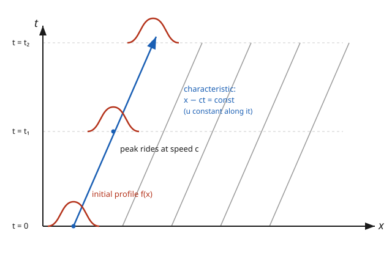

# Partial Differential Equations · Lesson 1.1: What is a PDE? Transport and the geometry of solutions

> ⏱ ~15 min · Module 1: First-order PDEs and classification · Builds on: [syllabus](../syllabus.md) · Unlocks: [1.2 The method of characteristics](01-02-method-of-characteristics-first-order.md)

## Why this matters

Almost every field equation in physics is a PDE: heat spreads, waves propagate, fields curve, prices diffuse — each is a rule tying together how an unknown function changes in *space* and in *time* at once. Before any of that machinery, one equation carries the whole geometric idea in the cleanest possible form: the **transport equation**, which says "a pattern moves." Get its picture — that a PDE is solved not by a curve but by *watching a profile slide along a family of lines* — and the rest of the course is variations on that theme. This is also your first encounter with the fact that PDE solutions are pinned down by *functions of data*, not a handful of constants.

## The idea

An **ODE** relates a function of one variable to its derivatives; its solutions form a small family you tune with a few constants (one per order). A **PDE** relates a function of *several* variables to its **partial derivatives** — and its solution set is vastly bigger: you don't tune constants, you're free to choose whole *functions*. That single jump is why PDEs need data spread along a *curve* (say, an entire initial profile at $t=0$) rather than at a single point.

The prototype: picture the temperature of water in a long pipe, or a dye pattern painted on a river's surface. The water flows steadily to the right at speed $c$. Nothing diffuses, nothing decays — the current just *carries the pattern along*. Whatever shape the dye had at $t=0$, at time $t$ that exact shape reappears, shifted right by $ct$. The individual water molecules aren't the point; the *pattern* travels. That rigid sliding is the entire content of the transport equation, and the diagonal tracks the pattern rides on are its **characteristics**.

## The formal version

A **partial differential equation** is a relation among an unknown function $u(x,t,\dots)$ and its partial derivatives. Its **order** is the highest derivative appearing; it is **linear** if $u$ and its derivatives appear only to the first power and are never multiplied together. A **solution** is a function whose partials satisfy the relation identically — geometrically, a *surface* $u = u(x,t)$ over the plane.

The **transport (advection) equation** is the first-order linear PDE

$$u_t + c\,u_x = 0,$$

where $u(x,t)$ is the unknown, $u_t = \partial u/\partial t$ and $u_x = \partial u/\partial x$ are its partials, and $c$ is a constant speed. *In words:* the rate of change in time is set entirely by the slope in space, tuned by $c$.

**Claim.** For any differentiable $f$, the function $u(x,t) = f(x - ct)$ solves it, and every solution has this form.

*In words:* the solution is the initial shape $f$ translated rigidly to the right at speed $c$. If we're given the **initial condition** $u(x,0) = f(x)$ (the profile at time zero), then $u(x,t) = f(x - ct)$ is *the* answer — the whole function $f$ is the data, confirming a PDE is pinned down by a function, not constants.

**The geometric reading.** Rewrite the equation as a dot product:

$$(1,\,c)\cdot(u_t,\,u_x) = 0.$$

*In words:* the directional derivative of $u$ along the vector $(1,c)$ in the $(t,x)$ plane is zero — so $u$ **does not change** as you move in that direction. The lines pointing along $(1,c)$, namely

$$x - ct = \text{const},$$

are the **characteristics**, and $u$ is constant on each one. Solving the PDE collapses to: *carry the initial value along its characteristic.*

## Picture

The $(x,t)$ plane, with $t$ pointing up. Each thin diagonal is a characteristic $x - ct = \text{const}$; along any one of them the solution never changes. The bump is the profile $f$, drawn at three times — it slides right at speed $c$ while keeping its shape, its peak riding the highlighted characteristic.

## Worked examples

**Example 1 (mechanical — translate a profile).** Solve $u_t + 2u_x = 0$ with $u(x,0) = e^{-x^2}$.

Here $c = 2$, so the answer is the initial Gaussian shifted right at speed $2$:

$$u(x,t) = e^{-(x-2t)^2}.$$

Verify by plugging in. With $w = x - 2t$: since $\partial w/\partial t = -2$ and $\partial w/\partial x = 1$,

$$u_t = e^{-w^2}\cdot(-2w)\cdot(-2) = 4w\,e^{-w^2}, \qquad u_x = e^{-w^2}\cdot(-2w) = -2w\,e^{-w^2},$$

so $u_t + 2u_x = 4w\,e^{-w^2} - 4w\,e^{-w^2} = 0.$ ✓ And at $t=0$, $u = e^{-x^2}$. ✓

**Example 2 (a peek ahead — variable speed).** Solve $u_t + x\,u_x = 0$ with $u(x,0) = g(x)$. Now the "speed" is $x$ itself — the coefficient depends on position, so the characteristics bend.

Find the curves along which $u$ stays constant: they satisfy $\dfrac{dx}{dt} = x$ (the coefficient of $u_x$), giving $x = x_0\,e^{t}$, i.e. $x_0 = x\,e^{-t}$ is constant along each curve. So $u$ carries its starting value $g(x_0)$:

$$u(x,t) = g\!\left(x\,e^{-t}\right).$$

Verify: with $w = x e^{-t}$, $\;w_t = -x e^{-t} = -w$ and $w_x = e^{-t}$, so

$$u_t + x\,u_x = g'(w)(-w) + x\,g'(w)e^{-t} = g'(w)\big(-x e^{-t} + x e^{-t}\big) = 0. ✓$$

This "follow the characteristic curve" move is exactly what [1.2 The method of characteristics](01-02-method-of-characteristics-first-order.md) systematizes — here the tracks are the curves $x = x_0 e^t$ instead of straight lines, but the logic is identical.

## Watch out

- **You might think** a PDE has one solution like an ODE does — **but actually** its raw solution set is enormous: *any* differentiable $f$ gives a transport solution. You pin down a single answer by prescribing data along a whole *curve* (the profile at $t=0$), not at one point. A point is enough for an ODE; a PDE needs a function's worth of data.
- **You might think** $u(x,t) = f(x - ct)$ means "the material moves" — **but actually** nothing material need move at all; the *pattern* translates while points stay put (think of a ripple crossing a pond, or a wave in a stadium crowd). The value at $(x,t)$ is just the value the profile had at the foot of the characteristic through that point.
- **You might think** the sign of $c$ is a detail — **but actually** it sets the *direction* of travel: $c>0$ carries the profile toward larger $x$ (right), $c<0$ toward smaller $x$ (left). Get the sign of the shift $x - ct$ backwards and your wave runs the wrong way.

## One-liner

> A first-order PDE says "$u$ is constant along a family of curves" — solve it by riding the initial data down each characteristic, and for transport those curves are straight lines and the profile just slides rigidly at speed $c$.

## Problems

**P1 (🟢)** Solve $u_t - 4u_x = 0$ with $u(x,0) = e^{-x^2}$. Which direction does the profile travel, and how fast?

**P2 (🟡)** A solution of $u_t + c\,u_x = 0$ satisfies $u(x,0) = \cos x$ and also $u(0,t) = \cos(2t)$. Find $c$.

**P3 (🔴, optional)** *Inhomogeneous transport.* Solve $u_t + c\,u_x = 1$ with $u(x,0) = g(x)$ by asking how $u$ changes *along* a characteristic. Then write the answer for $c = 2$, $g(x) = e^{-x^2}$, and verify it.

Solutions

**P1** Match to $u_t + c\,u_x = 0$: here $c = -4$. The solution is $f(x - ct) = f(x + 4t)$ with $f(x)=e^{-x^2}$:

$$u(x,t) = e^{-(x+4t)^2}.$$

Since $c = -4 < 0$, the profile travels to the **left** (toward smaller $x$) at **speed $4$**. Check: with $w = x+4t$, $u_t = -2w e^{-w^2}\cdot 4 = -8w e^{-w^2}$ and $u_x = -2w e^{-w^2}$, so $u_t - 4u_x = -8w e^{-w^2} + 8w e^{-w^2} = 0.$ ✓

**P2** Every solution is $u(x,t) = f(x - ct)$ for some $f$. The first condition gives $f = \cos$: $u(x,0) = f(x) = \cos x$. Feed the second condition through it:

$$u(0,t) = f(0 - ct) = \cos(-ct) = \cos(ct).$$

We need this to equal $\cos(2t)$ for all $t$, so $\cos(ct) = \cos(2t) \Rightarrow c = 2$. (Because $\cos$ is even, $c=-2$ also reproduces $u(0,t)$; but only $c=2$ carries the profile the same way at every point — take the value consistent with the sign convention, $c=2$.)

**P3** Move along a characteristic $x(t) = x_0 + ct$. The value of $u$ seen by a traveler riding that line is $U(t) = u(x_0 + ct,\,t)$, and by the chain rule

$$\frac{dU}{dt} = u_t + c\,u_x = 1$$

(the right-hand side of the PDE). So $U$ increases at unit rate: $U(t) = U(0) + t = g(x_0) + t$. Convert back with $x_0 = x - ct$:

$$u(x,t) = g(x - ct) + t.$$

*In words:* the profile still slides at speed $c$, but every point also rises linearly in time because of the constant source $1$. For $c=2$, $g(x)=e^{-x^2}$:

$$u(x,t) = e^{-(x-2t)^2} + t.$$

Verify: with $w = x-2t$, $u_t = 4w\,e^{-w^2} + 1$ and $u_x = -2w\,e^{-w^2}$, so $u_t + 2u_x = 4w e^{-w^2} + 1 - 4w e^{-w^2} = 1.$ ✓ And $u(x,0) = e^{-x^2}.$ ✓ (This "integrate the source along characteristics" idea grows into [5.4 Duhamel's principle](05-04-duhamels-principle.md).)

## Connections

- **Forward:** [1.2 The method of characteristics](01-02-method-of-characteristics-first-order.md) turns "ride the characteristic" into a general algorithm (and Example 2's bending curves are its first real workout); [1.4 Classifying second-order PDEs](01-04-classifying-second-order-pdes.md) shows this rigid, finite-speed propagation is the signature of **hyperbolic** equations — the wave equation is transport's second-order cousin.
- **Sideways (relativity):** in the [relativity](../../relativity/syllabus.md) course, the wave equation's characteristics *are light rays* — the null lines of spacetime. "Information travels along characteristics at a fixed speed" is, physically, the light cone; transport is the one-way baby version.
- **Sideways (fluid dynamics):** transport is literally **advection** — a quantity (dye, temperature, vorticity) carried by a flow — the linear skeleton underneath the equations you meet in [fluid-dynamics](../../fluid-dynamics/syllabus.md). When the carried quantity feeds back on the speed, you get the nonlinear shocks of [6.1 Burgers' equation](06-01-nonlinear-shocks-burgers.md).
