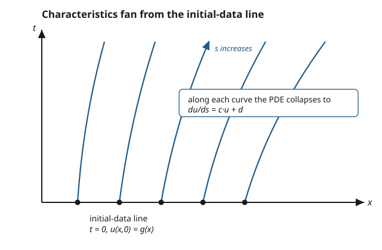

# Partial Differential Equations · Lesson 1.2: The method of characteristics for first-order linear PDEs

> ⏱ ~15 min · Module 1: First-order PDEs and classification · Builds on: [1.1 What is a PDE? Transport](01-01-what-is-a-pde-transport.md) · Unlocks: [1.3 Quasilinear first-order equations](01-03-quasilinear-first-order.md)

## Why this matters

In [1.1](01-01-what-is-a-pde-transport.md) you solved the transport equation $u_t + c\,u_x = 0$ by noticing that the solution is just constant along the lines $x - ct = \text{const}$: the wave slides rightward without changing shape. That trick — *find the curves along which the PDE becomes trivial* — is not a one-off. It is the entire method for **every** first-order linear PDE, even when the speed varies with position, the solution decays, or a source pumps energy in. The payoff is that a PDE (hard: a whole surface's worth of unknowns) collapses into an ODE (easy: one unknown along a curve) that you already know how to solve. Every scalar carried by a flow — heat riding a wind, a dye in a river, probability in phase space — is this equation.

## The idea

A first-order linear PDE ties together the value of $u$ and the *direction* it changes fastest. The coefficients $a$ and $b$ in front of $u_x$ and $u_t$ are secretly telling you a **direction to walk** in the $(x,t)$ plane. If you walk that special direction — the **characteristic** direction — the two partial derivatives fuse into a single ordinary derivative, and the PDE becomes an ODE for $u$ as you move.

So the whole plane's worth of unknown $u(x,t)$ is built from a **bundle of curves**. Each curve starts at one point of the initial-data line (say $t=0$, where you know $u$), and along it $u$ evolves by an ODE you can integrate. To find $u$ at some target point $(x,t)$: ride the characteristic through that point *backward* to where it hits $t=0$, read off the starting value, then carry it *forward* along the curve using the ODE. That's it — solve for the curves, carry the data along them, invert.

In the transport case the ODE was the simplest possible, $du/ds = 0$ (u never changes), so $u$ was just constant along each line. The general method only changes the ODE — the geometry is identical.

## The formal version

Take the general first-order linear PDE

$$a(x,t)\,u_x + b(x,t)\,u_t = c(x,t)\,u + d(x,t),$$

where $u=u(x,t)$ is the unknown, subscripts are partial derivatives, and $a,b,c,d$ are known functions. Introduce a parameter $s$ and look for **characteristic curves** $\big(x(s),t(s)\big)$ defined by

$$\frac{dx}{ds} = a(x,t), \qquad \frac{dt}{ds} = b(x,t).$$

**In words:** at every point, step in the direction $(a,b)$ — the direction the PDE's left side points. The parameter $s$ measures how far you've walked *along* one such curve.

Now watch $u$ as you move along a characteristic. By the chain rule,

$$\frac{du}{ds} = u_x\frac{dx}{ds} + u_t\frac{dt}{ds} = a\,u_x + b\,u_t = c\,u + d.$$

**In words:** the left side of the PDE *is* the rate of change of $u$ along the characteristic. So the PDE becomes the ODE

$$\frac{du}{ds} = c\big(x(s),t(s)\big)\,u + d\big(x(s),t(s)\big),$$

a plain linear first-order ODE in $s$. Solve the two curve-ODEs and this $u$-ODE together, using the prescribed **Cauchy data** (the value of $u$ on a chosen initial curve) as the starting condition for each characteristic.

**The one requirement — non-characteristic data.** The Cauchy data must be given on a curve that is *nowhere tangent to a characteristic* (usually $t=0$, which the characteristics cross because $dt/ds=b\neq 0$). **In words:** each characteristic must pierce the data curve exactly once, so it picks up exactly one starting value. Data laid *along* a characteristic tells the ODE nothing about how to move off that curve — the problem is then over- or under-determined.

The set of target points $(x,t)$ reachable by characteristics emanating from a segment of data is that segment's **domain of determinacy**: the region where the given data alone fixes the solution.

## Picture

Each dot on $t=0$ carries one Cauchy value $g(x)$; the curve rising from it is that value's trajectory, governed by $du/ds = c\,u + d$. Where coefficients vary, the curves bend and fan — but the recipe never changes.

## Worked examples

**Example 1 (variable speed, no source).** Solve $u_t + x\,u_x = 0$ with $u(x,0)=g(x)$.

Match the template: coefficient of $u_t$ is $b=1$, of $u_x$ is $a=x$, and $c=d=0$. The characteristic ODEs are

$$\frac{dt}{ds}=1,\qquad \frac{dx}{ds}=x,\qquad \frac{du}{ds}=0.$$

The first gives $t=s$ (start the clock at $s=0$ on $t=0$), so we may replace $s$ by $t$ throughout. The second becomes $dx/dt = x$, an exponential: $x = x_0\,e^{t}$, where $x_0$ labels which characteristic (its foot on $t=0$). The third says $u$ is **constant** along each curve, equal to its starting value $g(x_0)$.

Now invert to get $x_0$ in terms of the target point: $x_0 = x\,e^{-t}$. Therefore

$$\boxed{u(x,t) = g\!\left(x\,e^{-t}\right).}$$

*Verify* (always): $u_t = g'(xe^{-t})\cdot(-x e^{-t})$ and $u_x = g'(xe^{-t})\cdot e^{-t}$, so $u_t + x\,u_x = -x e^{-t}g' + x\,e^{-t}g' = 0$. ✓ And $u(x,0)=g(x)$. ✓ The characteristics are the curves $x e^{-t}=\text{const}$ — they spread apart as $t$ grows, exactly the fan in the picture.

**Example 2 (a source that grows the solution).** Solve $u_t + u_x = u$ with $u(x,0)=g(x)$.

Here $b=1,\ a=1,\ c=1,\ d=0$. Characteristic ODEs:

$$\frac{dt}{ds}=1,\qquad \frac{dx}{ds}=1,\qquad \frac{du}{ds}=u.$$

Again $t=s$. From $dx/dt=1$ the curves are the straight lines $x-t = x_0=\text{const}$ (constant speed 1). But now $u$ is *not* constant along them: $du/dt = u$ gives $u = u_0\,e^{t}$, and $u_0 = g(x_0)=g(x-t)$. Hence

$$\boxed{u(x,t) = g(x-t)\,e^{t}.}$$

**In words:** the profile still rides right at speed 1, but its amplitude is amplified by $e^t$ as it goes — the shape travels along characteristics, the *source term* $c\,u$ rescales it. *Verify*: with $u=g(x-t)e^t$, $u_t = -g'e^t + g e^t$ and $u_x = g'e^t$, so $u_t+u_x = -g'e^t + ge^t + g'e^t = g e^t = u$. ✓

## Watch out

- **You might think** the parameter $s$ and the label $x_0$ are the same kind of variable. **Actually** $s$ runs *along* a single characteristic (it's the ODE's time), while $x_0$ (the foot on $t=0$) *picks which* characteristic you're on. Two coordinates, two jobs: $s$ moves you up a curve, $x_0$ slides you between curves. The final step — inverting to write $x_0$ and $s$ in terms of $(x,t)$ — is where the actual solution appears.
- **You might think** Cauchy data can be prescribed on any curve. **Actually** it must sit on a *non-characteristic* curve. If you prescribe $u$ along a characteristic, the data either contradicts the ODE (no solution) or fails to determine $u$ off that curve (infinitely many) — the method quietly breaks. This is why $t=0$ is the safe default: characteristics cross it transversally.
- **You might think** characteristics are always straight lines like in transport. **Actually** they're straight only when $a/b$ is constant. When $a$ or $b$ depends on $x$ or $t$ (Example 1), the curves bend — and in [1.3](01-03-quasilinear-first-order.md), when the speed depends on $u$ itself, they can even *cross*, which is where smooth solutions die.

## One-liner

> Every first-order linear PDE is an ODE in disguise: walk along the curves $(\dot x,\dot t)=(a,b)$, and $a\,u_x+b\,u_t$ becomes $\tfrac{du}{ds}=cu+d$ — solve the curves, carry the data, invert.

## Problems

**P1 (🟢)** Solve $u_t + 3\,u_x = 0$ with $u(x,0)=\sin x$. Write $u(x,t)$ explicitly and state the characteristic lines.

**P2 (🟡)** Solve $u_t + u_x = x$ with $u(x,0)=0$. (A source $d(x,t)=x$ that depends on position — carry it along the characteristic and integrate.) Verify your answer by substitution.

**P3 (🔴, optional)** Solve $u_t + t\,u_x = 0$ with $u(x,0)=g(x)$ — here the speed grows with time. Find the characteristic curves (they are not lines), give $u(x,t)$, and verify. Then name the physical reading: what velocity field is transporting the profile $g$?

Solutions

**P1** Constant coefficients $a=3,\ b=1,\ c=d=0$. Characteristics: $dt/ds=1\Rightarrow t=s$, and $dx/dt=3\Rightarrow x-3t=x_0=\text{const}$ — the **lines $x-3t=\text{const}$**. Since $du/ds=0$, $u$ is constant along each, equal to $g(x_0)=\sin(x_0)$. Invert $x_0 = x-3t$:

$$u(x,t) = \sin(x-3t).$$

The initial sine wave slides right at speed 3, unchanged. *Check*: $u_t=-3\cos(x-3t)$, $u_x=\cos(x-3t)$, so $u_t+3u_x=-3\cos+3\cos=0$ ✓, and $u(x,0)=\sin x$ ✓.

**P2** Here $a=1,\ b=1,\ c=0,\ d=x$. Characteristics: $t=s$, and $dx/dt=1\Rightarrow x = x_0 + t$, i.e. $x_0 = x-t$. Along a characteristic, $x = x_0 + t$, so the source is $d = x = x_0 + t$, and

$$\frac{du}{dt} = x_0 + t \;\Longrightarrow\; u = x_0\,t + \tfrac12 t^2 + C.$$

The initial condition $u=0$ at $t=0$ forces $C=0$. Substitute $x_0 = x-t$:

$$u = (x-t)\,t + \tfrac12 t^2 = xt - t^2 + \tfrac12 t^2 = xt - \tfrac12 t^2.$$

*Verify*: $u_t = x - t$, $u_x = t$, so $u_t + u_x = (x-t)+t = x$ ✓, and $u(x,0)=0$ ✓.

**P3** Coefficients $a=t,\ b=1,\ c=d=0$. Characteristics: $dt/ds=1\Rightarrow t=s$, and

$$\frac{dx}{dt} = t \;\Longrightarrow\; x = x_0 + \tfrac12 t^2,$$

so the characteristics are the **parabolas** $x - \tfrac12 t^2 = x_0 = \text{const}$ (they curve, matching the fanning picture). Since $du/ds=0$, $u$ is constant along each, equal to $g(x_0)$. Invert:

$$u(x,t) = g\!\left(x - \tfrac12 t^2\right).$$

*Verify*: $u_t = g'\cdot(-t)$, $u_x = g'$, so $u_t + t\,u_x = -t g' + t g' = 0$ ✓, and $u(x,0)=g(x)$ ✓. **Physical reading:** this is a scalar $u$ passively carried by a flow whose velocity is $v(t)=t$ — the fluid accelerates uniformly, so each fluid parcel's position obeys $\dot x = t$, i.e. $x = x_0 + \tfrac12 t^2$. The profile is just the initial pattern painted on the moving fluid.

## Connections

- **Backward:** the transport equation of [1.1](01-01-what-is-a-pde-transport.md) is the flat case $a=c$onst, $b=1$, $c=d=0$ — characteristics are straight, $du/ds=0$, so $u$ is merely constant along them. This lesson is that same picture with the ODE turned back on.
- **Forward:** [1.3](01-03-quasilinear-first-order.md) makes the coefficients depend on $u$ itself (quasilinear), so characteristics can collide and a smooth solution can develop a shock — the failure mode this linear theory rules out. The idea of information traveling along characteristics returns for the wave equation in [2.2](02-02-wave-equation-dalembert.md) and underpins well-posedness in [1.5](01-05-characteristics-well-posedness.md).
- **Sideways (fluids):** an equation $u_t + \mathbf{v}\cdot\nabla u = 0$ is the **advection** of a scalar (temperature, dye concentration) by a velocity field $\mathbf v$; characteristics are the paths fluid parcels follow, and $u$ is constant along them. This is the linear heart of [`fluid-dynamics`](../../fluid-dynamics/syllabus.md), where the velocity itself starts obeying a PDE. In [`relativity`](../../relativity/syllabus.md), the characteristics of the wave equation are light rays — the same geometry, drawn as light cones.
