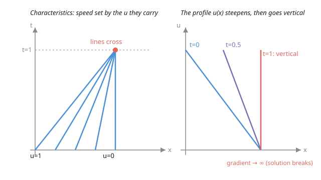

# Partial Differential Equations · Lesson 1.3: Quasilinear first-order equations

> ⏱ ~15 min · Module 1: First-order PDEs and classification · Builds on: [1.2 The method of characteristics](01-02-method-of-characteristics-first-order.md) · Unlocks: [1.4 Classifying second-order linear PDEs](01-04-classifying-second-order-pdes.md)

## Why this matters

In [1.2](01-02-method-of-characteristics-first-order.md) the characteristic speeds were fixed by the equation — the solution just rode along, unchanged, forever. That rigidity is a luxury of *linear* transport. The moment the wave speed depends on the wave's own height — traffic that bunches because dense traffic crawls, a gas pulse that steepens because compressed gas moves faster, a flood wave whose crest outruns its base — the characteristics stop being parallel. They fan, they converge, and eventually they **cross**. At the crossing the smooth solution simply ceases to exist: the profile tries to become vertical, the gradient blows up, and a **shock** is born. This lesson is where PDEs first stop being tame, and it is the doorway to [6.1](06-01-nonlinear-shocks-burgers.md).

## The idea

Picture a line of runners on a track, each told: "run at a speed equal to the number painted on your shirt." A runner painted `5` moves faster than one painted `2`. If the fast runners start *behind* the slow ones, the pack compresses — eventually a `5` catches a `2`, and now two different speeds want to occupy the same spot. That collision is a shock.

That is exactly a quasilinear equation. Each point of the initial profile is a runner; the value $u$ it carries is the number on its shirt; and the rule is "travel at speed $u$." Where the profile is *decreasing* (tall values behind, short values ahead), the tall-and-fast part overtakes the short-and-slow part, the graph leans forward, and at some finite time it goes vertical. Before that time everything is smooth and computable. The whole game is finding *when* the crossing happens — the **breaking time**.

## The formal version

A first-order PDE is **quasilinear** when it is linear in the derivatives of $u$ but its coefficients may depend on $u$ itself:

$$a(x,t,u)\,u_x + b(x,t,u)\,u_t = c(x,t,u).$$

In words: $u_x$ and $u_t$ appear only to the first power and never multiplied together, but the multipliers $a,b,c$ are allowed to read off the current value of $u$ — that single feedback is what makes it nonlinear.

The method of characteristics still applies, but the characteristic system now **couples** the carried value into the path. Parametrize a characteristic curve by $s$:

$$\frac{dx}{ds} = a,\qquad \frac{dt}{ds} = b,\qquad \frac{du}{ds} = c.$$

In words: the first two equations say how the curve moves through the $(x,t)$ plane; the third says how $u$ changes as you ride it. In 1.2 the first two were self-contained; now $a$ and $b$ can depend on $u$, so the path and the value it carries are solved *together*.

**The canonical model — inviscid Burgers' equation:**

$$u_t + u\,u_x = 0.$$

Here $a=u$, $b=1$, $c=0$. So $\frac{du}{ds}=0$: **$u$ is constant along each characteristic**, and $\frac{dx}{dt}=u$ is therefore constant too — every characteristic is a **straight line whose slope is the value it carries**. In words: each height of the profile glides along at a speed equal to that height, unchanging, until it runs into another.

Because $u$ is constant along $x = x_0 + u(x_0,0)\,t$, we can write the solution **implicitly**:

$$u = f(x - u\,t),\qquad f(x)=u(x,0).$$

In words: the value at $(x,t)$ is whatever value started at the foot of the characteristic through that point. This formula is exact — right up until two characteristics collide, at which point it tries to hand you two values at once and quits. For decreasing initial data the first collision is the **breaking time**

$$t^* = \frac{-1}{\min_{x_0} f'(x_0)},$$

the reciprocal of the steepest downhill slope of the initial profile.

## Picture

## Worked examples

**Example 1 (breaking time, computed from scratch).** Solve $u_t + u\,u_x = 0$ with
$$u(x,0) = \begin{cases} 1 & x \le 0\\ 1-x & 0 \le x \le 1\\ 0 & x \ge 1.\end{cases}$$
The interesting part is the ramp, where the profile decreases. A characteristic leaving $x_0\in[0,1]$ carries the value $1-x_0$, so it is the straight line
$$x = x_0 + (1-x_0)\,t.$$
Take two of them, from $x_0$ and $x_1$ with $x_0 \ne x_1$, and ask when they meet:
$$x_0 + (1-x_0)t = x_1 + (1-x_1)t \;\Longrightarrow\; x_0 - x_1 = (x_0 - x_1)\,t \;\Longrightarrow\; t = 1.$$
Every pair meets at the *same* time, $t^*=1$, and plugging back in, at the *same* place: $x = x_0 + (1-x_0)(1) = 1$. So the entire ramp collapses into the single point $(x,t)=(1,1)$ — the profile has gone vertical there. Cross-check with the formula: $f'(x_0) = -1$ on the ramp, so $t^* = -1/(-1) = 1$. ✓ Before $t=1$ the solution is smooth; at $t=1$ a shock forms.

**Example 2 (implicit solve made explicit — the spreading case).** Solve $u_t + u\,u_x = 0$ with $u(x,0) = x$. The implicit solution is $u = f(x-ut) = x - u\,t$. This one we can unravel:
$$u = x - ut \;\Longrightarrow\; u(1+t) = x \;\Longrightarrow\; u(x,t) = \frac{x}{1+t}.$$
Check it: $u_t = -\dfrac{x}{(1+t)^2}$, $u_x = \dfrac{1}{1+t}$, so $u\,u_x = \dfrac{x}{1+t}\cdot\dfrac{1}{1+t} = \dfrac{x}{(1+t)^2}$, and $u_t + u\,u_x = 0$. ✓ Here the initial profile is *increasing* ($f'=+1$), so the fast values are already ahead of the slow ones — the characteristics *spread apart* rather than converge. The breaking formula gives $t^* = -1/(+1) < 0$: no positive breaking time, the solution stays single-valued and smooth for all $t \ge 0$. This is a **rarefaction**, the benign opposite of a shock.

## Watch out

- **You might think the implicit formula $u=f(x-ut)$ is valid for all time, but it is only valid before characteristics cross.** Past the breaking time it assigns two or more values to the same $(x,t)$ — the profile becomes multivalued (an "overhang"). Physics forbids that, so you must replace the overhang with a jump: a **weak solution** with a shock, the subject of [6.1](06-01-nonlinear-shocks-burgers.md).
- **You might think decreasing vs. increasing initial data is a cosmetic detail, but it decides shock vs. rarefaction.** Downhill initial slope ($f'<0$) → converging characteristics → finite $t^*$ → shock. Uphill slope ($f'>0$) → spreading → smooth forever. Same equation, opposite fates.
- **You might think "first order and linear-looking" means linear, but the coupling `speed = u` is genuinely nonlinear.** Burgers has no cross term $u\,u_x$ that is quadratic in *derivatives*, yet $u$ multiplying $u_x$ makes superposition fail — add two solutions and you do **not** get a solution. That is why crossing can happen at all.

## One-liner

> When the wave speed is the wave height, tall values overtake short ones, characteristics cross at $t^* = -1/\min f'$, and the smooth solution dies into a shock.

## Problems

**P1 (🟢)** For $u_t + u\,u_x = 0$ with $u(x,0) = 1 - 2x$ on the ramp $0\le x\le \tfrac12$, find the breaking time $t^*$ — both from the slope formula and by showing two characteristics cross there.

**P2 (🟡)** Show, by implicit differentiation, that $u = f(x-ut)$ solves $u_t + u\,u_x = 0$ for any differentiable $f$. Then read off the exact time the formula breaks along the characteristic through $x_0$.

**P3 (🔴, optional)** A crude traffic model emits a "fast" state $u=2$ from $x_0=0$ and a "slow" state $u=1$ from $x_1=1$, each carried at speed equal to its value (Burgers). (a) When and where do the two characteristics collide? (b) Now suppose the *slow* state is behind and the *fast* state ahead — $u=1$ from $x_0=0$ and $u=2$ from $x_1=1$. Do they ever collide for $t>0$? What is happening to the flow in each case?

Solutions

**P1** On the ramp $f(x)=1-2x$, so $f'(x_0) = -2$ everywhere and $t^* = -1/\min f' = -1/(-2) = \tfrac12$. Directly: the characteristic from $x_0$ carries $1-2x_0$, so it is $x = x_0 + (1-2x_0)t$. Setting the paths from $x_0\ne x_1$ equal,
$$x_0 + (1-2x_0)t = x_1 + (1-2x_1)t \;\Longrightarrow\; x_0 - x_1 = 2(x_0-x_1)\,t \;\Longrightarrow\; t = \tfrac12.$$
They cross at $t^*=\tfrac12$. ✓

**P2** Let $F = x - u\,t$ and $u = f(F)$. Differentiate in $x$ (remember $u$ depends on $x$):
$$u_x = f'(F)\,\big(1 - u_x\,t\big) \;\Longrightarrow\; u_x\big(1 + t\,f'(F)\big) = f'(F) \;\Longrightarrow\; u_x = \frac{f'(F)}{1 + t\,f'(F)}.$$
Differentiate in $t$:
$$u_t = f'(F)\,\big(-u - u_t\,t\big) \;\Longrightarrow\; u_t\big(1 + t\,f'(F)\big) = -u\,f'(F) \;\Longrightarrow\; u_t = \frac{-u\,f'(F)}{1 + t\,f'(F)}.$$
Then
$$u_t + u\,u_x = \frac{-u\,f'(F)}{1+t\,f'(F)} + u\cdot\frac{f'(F)}{1+t\,f'(F)} = 0. \;\checkmark$$
Both derivatives share the denominator $1 + t\,f'(F)$, which vanishes at $t = -1/f'(F)$. Along the characteristic through $x_0$ (where $F=x_0$), the formula breaks at $t = -1/f'(x_0)$ — infinite when $f'(x_0)\ge 0$ (that characteristic never gets caught), finite and positive only where the profile descends. The earliest such time over all $x_0$ is exactly $t^* = -1/\min f'$.

**P3** (a) Characteristic from $0$ carrying $2$: $x = 0 + 2t = 2t$. Characteristic from $1$ carrying $1$: $x = 1 + t$. Collision: $2t = 1 + t \Rightarrow t = 1$, at $x = 2$. So they meet at $(x,t) = (2,1)$ — the fast state behind overtakes the slow state ahead, a **compression forming a shock**.
(b) Now $x = 0 + t = t$ (slow, behind) and $x = 1 + 2t$ (fast, ahead). Collision would need $t = 1 + 2t \Rightarrow t = -1 < 0$: never, for $t>0$. The fast state pulls away from the slow one, opening a widening gap — a **rarefaction** (the fan spreads, and the region between them fills with intermediate speeds). Same two speeds, but which one is behind decides everything.

## Flashback

**From Lesson 1.1 (What is a PDE? Transport):** Solve the constant-coefficient transport problem $u_t + 3\,u_x = 0$ with $u(x,0) = e^{-x^2}$. Where is the peak of the bump at $t=2$, and how (if at all) has its shape changed?

Solution

Constant speed $c=3$: the solution is the initial profile rigidly translated, $u(x,t) = f(x - 3t) = e^{-(x-3t)^2}$. Check: $u_t = 6(x-3t)e^{-(x-3t)^2}$ and $u_x = -2(x-3t)e^{-(x-3t)^2}$, so $u_t + 3u_x = 6(x-3t)e^{(\cdots)} - 6(x-3t)e^{(\cdots)} = 0$. ✓ The peak sits where the exponent is zero, $x - 3t = 0 \Rightarrow x = 3t$, so at $t=2$ the bump is centered at $x = 6$. Its shape is **unchanged** — same Gaussian, just shifted. That permanence is precisely the linear rigidity Burgers destroys: replace the fixed $3$ with the solution's own value and this same bump would steepen and eventually break.

## Connections

- **Backward:** this is [1.2](01-02-method-of-characteristics-first-order.md)'s characteristic system with the value fed back into the speed — the $\frac{du}{ds}=c$ equation, which was passive there, now reshapes the paths themselves. The contrast is with [1.1](01-01-what-is-a-pde-transport.md): constant speed means parallel characteristics that never meet (the Flashback), the exact rigidity that nonlinearity breaks.
- **Forward:** the crossing you found here is a catastrophe for classical solutions — [6.1](06-01-nonlinear-shocks-burgers.md) rescues it with weak solutions, shock curves, and the Rankine–Hugoniot jump condition that picks the shock's speed. [1.4](01-04-classifying-second-order-pdes.md) next sorts *second-order* equations by their characteristics, the same organizing idea one order up.
- **Sideways (fluid dynamics):** Burgers is the barebones model of compressible gas dynamics and of the Lighthill–Whitham–Richards **traffic-flow** equation — density-dependent speed, compression waves steepening into jams and sonic shocks. The runners-with-numbers picture is literally how a traffic jam forms; see [fluid-dynamics](../../fluid-dynamics/syllabus.md).
