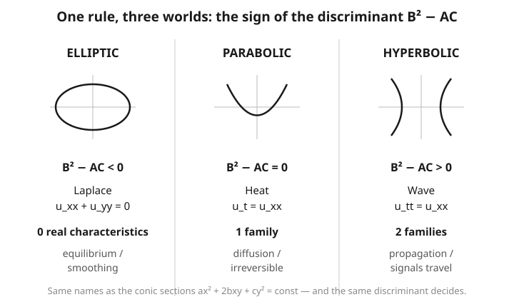

# Partial Differential Equations · Lesson 1.4: Classifying second-order linear PDEs

> ⏱ ~15 min · Module 1: First-order PDEs and classification · Builds on: [1.3 Quasilinear first-order equations](01-03-quasilinear-first-order.md) · Unlocks: [1.5 Characteristics and well-posedness](01-05-characteristics-well-posedness.md)

## Why this matters

Almost every PDE you will ever meet in physics is one of exactly three animals: the **heat** equation (temperature spreading out), the **wave** equation (a signal traveling), or **Laplace's** equation (a field in equilibrium). They behave completely differently — heat smooths kinks instantly and forgets the past, waves carry sharp features forever, Laplace has no time at all — and *which* behavior you get is decided by a single number computed from the top-order coefficients. Learn to read that number and you know, before solving anything, what kind of data makes the problem well-posed, whether information travels, and which solution method has a chance. It is the map you consult before every trip in Modules 2–6.

## The idea

Back in high school you sorted the curves $ax^2 + 2bxy + cy^2 = \text{const}$ into ellipses, parabolas, and hyperbolas by looking at one quantity, $b^2 - ac$: negative gave an ellipse, zero a parabola, positive a hyperbola. Second-order PDEs carry over the *exact same* algebra. Replace $x^2 \to u_{xx}$, $xy \to u_{xy}$, $y^2 \to u_{yy}$ and the leading coefficients tell the same story — **that is why the three PDE types are named after the three conics.**

The one number does more than name-call. It counts the **real characteristic directions** — the special curves along which information can travel (the same characteristics you rode in Lessons 1.1–1.3). Elliptic equations have *none*: no direction is special, so a disturbance anywhere is instantly felt everywhere and smoothed out — think of a stretched drumhead at rest. Parabolic equations have *one* family: heat flows forward in time along it, blurring as it goes. Hyperbolic equations have *two*: signals ride along both, which is how a wave keeps its shape and how "cause here, effect there, later" is even possible. The discriminant's sign literally counts these directions: none, one, or two.

## The formal version

The general second-order linear PDE in two variables $x, y$ (where $y$ is often time) is

$$A\,u_{xx} + 2B\,u_{xy} + C\,u_{yy} + D\,u_x + E\,u_y + F\,u = G,$$

with coefficients $A,B,C,\dots$ possibly functions of $x,y$. **In words:** everything second-order sits in the first three terms; $D, E, F, G$ are "lower-order" baggage. Note the deliberate factor of $2$ on the mixed term — so $B$ is *half* the coefficient you read off $u_{xy}$.

Only the **principal part** $A u_{xx} + 2B u_{xy} + C u_{yy}$ decides the type, via the **discriminant**

$$\Delta = B^2 - AC,$$

$$\boxed{\;\Delta < 0 \Rightarrow \textbf{elliptic},\qquad \Delta = 0 \Rightarrow \textbf{parabolic},\qquad \Delta > 0 \Rightarrow \textbf{hyperbolic}.\;}$$

**In words:** compute $B^2 - AC$ from the top-order coefficients only; its sign is the whole verdict. Lower-order terms never change the type.

**Characteristics.** The characteristic curves $y = y(x)$ solve the quadratic

$$A\left(\frac{dy}{dx}\right)^2 - 2B\,\frac{dy}{dx} + C = 0 \quad\Longrightarrow\quad \frac{dy}{dx} = \frac{B \pm \sqrt{B^2 - AC}}{A}.$$

**In words:** the number of real slopes coming out of this equation *is* the sign story again — two real slopes when $\Delta>0$ (hyperbolic), one when $\Delta=0$ (parabolic), none (complex) when $\Delta<0$ (elliptic). The discriminant under the square root is the same $\Delta$.

**Canonical form.** Changing to coordinates $\xi, \eta$ that are constant along the characteristics strips the equation down to its simplest skeleton — for a hyperbolic equation, to $u_{\xi\eta} = \text{lower order}$. **In words:** ride the natural coordinates and the messy principal part collapses to a single clean term (Example 2 does this end-to-end).

## Picture

## Worked examples

**Example 1 (mechanical — classify a batch).** Read off $A, B, C$ (remember $B$ is *half* the $u_{xy}$ coefficient), then compute $\Delta = B^2 - AC$.

- **Heat**, $u_t - u_{xx} = 0$. Here $x$ and $t$ play the roles of the two variables; the only second-order term is $u_{xx}$, so $A = -1$, $B = 0$, $C = 0$ (no $u_{tt}$). $\Delta = 0^2 - (-1)(0) = 0$ → **parabolic**. ✓
- **Wave**, $u_{tt} - u_{xx} = 0$. Now $A = -1$ (from $u_{xx}$), $C = 1$ (from $u_{tt}$), $B = 0$. $\Delta = 0 - (-1)(1) = 1 > 0$ → **hyperbolic**. ✓
- **Laplace**, $u_{xx} + u_{yy} = 0$. $A = 1$, $B = 0$, $C = 1$. $\Delta = 0 - (1)(1) = -1 < 0$ → **elliptic**. ✓
- **Tricomi**, $y\,u_{xx} + u_{yy} = 0$. $A = y$, $B = 0$, $C = 1$, so $\Delta = -y$. This flips sign with position: **elliptic where $y > 0$**, **hyperbolic where $y < 0$**, parabolic on the line $y = 0$. One equation, three types — this really happens (it models transonic flow, elliptic in subsonic regions, hyperbolic in supersonic ones).

**Example 2 (why you'd care — reduce a hyperbolic equation to canonical form).** Take $u_{xx} - u_{yy} = 0$: $A = 1, B = 0, C = -1$, so $\Delta = 0 - (1)(-1) = 1 > 0$, hyperbolic. The characteristic slopes are

$$\frac{dy}{dx} = \frac{0 \pm \sqrt{1}}{1} = \pm 1 \;\Rightarrow\; y - x = \text{const} \ \text{ and } \ y + x = \text{const}.$$

So the natural coordinates are $\xi = x - y$ and $\eta = x + y$. Chain-rule the derivatives ($\xi_x = 1, \eta_x = 1, \xi_y = -1, \eta_y = 1$):

$$u_x = u_\xi + u_\eta,\qquad u_y = -u_\xi + u_\eta,$$
$$u_{xx} = u_{\xi\xi} + 2u_{\xi\eta} + u_{\eta\eta},\qquad u_{yy} = u_{\xi\xi} - 2u_{\xi\eta} + u_{\eta\eta}.$$

Subtract:

$$u_{xx} - u_{yy} = 4\,u_{\xi\eta} = 0 \quad\Longrightarrow\quad u_{\xi\eta} = 0.$$

That canonical form integrates by inspection: $u_\xi$ is independent of $\eta$, so $u = F(\xi) + G(\eta) = F(x - y) + G(x + y)$ for arbitrary functions $F, G$. Two independent traveling shapes — the fingerprint of a wave, and a preview of d'Alembert's formula in [2.2](02-02-wave-equation-dalembert.md).

## Watch out

- **Only the principal part counts.** You might think a big $u_x$ or a forcing term $G$ shifts the type, but $D, E, F, G$ are irrelevant to classification: $2u_{xx} + u_{yy} + 100\,u_x - 7u = \sin y$ is elliptic ($\Delta = -2 < 0$), full stop. Lower-order terms tune the physics *within* a type; they never change which type.
- **The factor-of-2 trap.** Because the convention writes $2B\,u_{xy}$, $B$ is **half** the number multiplying $u_{xy}$. For $u_{xx} + 4u_{xy} + u_{yy}$ you have $B = 2$ (not $4$), so $\Delta = 4 - 1 = 3 > 0$, hyperbolic. Forgetting the halving is the single most common classification error.
- **Type can be local, not global.** You might expect one label per equation, but with variable coefficients (Tricomi) the sign of $\Delta$ depends on *where* you are, so the equation is elliptic in one region and hyperbolic in another. Always check whether $A, B, C$ are constants before declaring a single type.
- **Hyperbolic means real characteristics — the curves from 1.1–1.3.** The two real slopes $dy/dx$ here are exactly the characteristic curves you propagated data along for first-order equations. Elliptic equations have complex slopes, i.e. no real characteristics, which is precisely why nothing "travels" in Laplace's world.

## One-liner

> Compute $B^2 - AC$ from the top-order terms alone: negative is elliptic (equilibrium, no characteristics), zero is parabolic (diffusion, one), positive is hyperbolic (waves, two).

## Problems

**P1 (🟢)** Classify each as elliptic, parabolic, or hyperbolic:
(a) $u_{xx} - 6u_{xy} + 9u_{yy} + u_x = 0$;
(b) $3u_{xx} + u_{yy} - 5u = 0$;
(c) $u_{xx} + 3u_{xy} + u_{yy} = 0$.

**P2 (🟡)** The equation $u_{xx} - 5u_{xy} + 6u_{yy} = 0$ has constant coefficients. Classify it, then find the two families of characteristic curves.

**P3 (🔴, optional)** For which real constants $a$ is $a\,u_{xx} + 2u_{xy} + a\,u_{yy} = 0$ hyperbolic, parabolic, elliptic? Give the ranges/values of $a$ for each.

Solutions

**P1** Ignore all lower-order terms; use $B = \tfrac{1}{2}(\text{coeff of } u_{xy})$.
(a) $A = 1,\ B = -3,\ C = 9$: $\Delta = 9 - 9 = 0$ → **parabolic**. (The $u_x$ term is irrelevant.)
(b) $A = 3,\ B = 0,\ C = 1$: $\Delta = 0 - 3 = -3 < 0$ → **elliptic**. (The $-5u$ term is irrelevant.)
(c) $A = 1,\ B = \tfrac{3}{2},\ C = 1$: $\Delta = \tfrac{9}{4} - 1 = \tfrac{5}{4} > 0$ → **hyperbolic**.

**P2** $A = 1,\ B = -\tfrac{5}{2},\ C = 6$, so $\Delta = \tfrac{25}{4} - 6 = \tfrac{1}{4} > 0$ → **hyperbolic**. The characteristic slopes:

$$\frac{dy}{dx} = \frac{B \pm \sqrt{\Delta}}{A} = \frac{-\tfrac{5}{2} \pm \tfrac{1}{2}}{1} = -2 \ \text{ or } \ -3.$$

Integrating each constant slope: $dy/dx = -2 \Rightarrow y + 2x = \text{const}$, and $dy/dx = -3 \Rightarrow y + 3x = \text{const}$. Those two families are the characteristic curves (and $\xi = y + 2x,\ \eta = y + 3x$ would reduce it to $u_{\xi\eta} = 0$).

**P3** $A = a,\ B = 1,\ C = a$, so $\Delta = B^2 - AC = 1 - a^2$.
- **Hyperbolic** ($\Delta > 0$): $1 - a^2 > 0 \iff |a| < 1$, i.e. $-1 < a < 1$.
- **Parabolic** ($\Delta = 0$): $a = \pm 1$.
- **Elliptic** ($\Delta < 0$): $|a| > 1$, i.e. $a < -1$ or $a > 1$.

(Sanity check: $a = 0$ gives $2u_{xy} = 0$, i.e. $u_{xy}=0$, whose solution $u = F(x) + G(y)$ has two characteristic families $x=\text{const}$, $y=\text{const}$ — hyperbolic, consistent with $|0| < 1$.)

## Flashback

**From Lesson 1.2 (Method of characteristics, first-order):** Solve the transport problem $3u_x + 2u_y = 0$ with side condition $u(x, 0) = \cos x$.

Solution

For $a\,u_x + b\,u_y = 0$, $u$ is constant along characteristics with slope $dy/dx = b/a = 2/3$, i.e. along lines where $2x - 3y = \text{const}$. So $u = f(2x - 3y)$ for some single-variable $f$. Impose the data at $y = 0$:

$$u(x, 0) = f(2x) = \cos x \;\Rightarrow\; f(s) = \cos\!\left(\tfrac{s}{2}\right).$$

Therefore

$$u(x, y) = \cos\!\left(\frac{2x - 3y}{2}\right) = \cos\!\left(x - \tfrac{3}{2}y\right).$$

Check: $u_x = -\sin(\cdot)$, $u_y = \tfrac{3}{2}\sin(\cdot)$, so $3u_x + 2u_y = -3\sin(\cdot) + 3\sin(\cdot) = 0$ ✓, and $u(x,0) = \cos x$ ✓.

## Connections

- **Backward:** the "real characteristics" that define hyperbolic type are exactly the characteristic curves you learned to build and propagate along in [1.1](01-01-what-is-a-pde-transport.md)–[1.3](01-03-quasilinear-first-order.md). Classification is second-order equations asking the same question — *does information travel, and along what?*
- **Forward:** [1.5](01-05-characteristics-well-posedness.md) shows the type dictates which boundary/initial data makes a problem well-posed (Cauchy data for hyperbolic, boundary values for elliptic — mismatch them and the problem blows up). All of Module 2 is the three prototypes worked in full: [heat](02-01-heat-diffusion-equations.md), [wave](02-02-wave-equation-dalembert.md), [Laplace/Poisson](02-03-laplace-poisson-equations.md).
- **Sideways (relativity):** the wave equation is hyperbolic, and its two characteristic families are the light cones of special relativity — the boundary between "can be influenced" and "cannot." When you meet the wave operator in [relativity](../../relativity/syllabus.md), this discriminant is why causality has a shape.
- **Sideways (physics):** Laplace's elliptic equation is the electrostatic potential in charge-free space ([em-refresher](../../em-refresher/syllabus.md)) and the equilibrium temperature; the heat equation's parabolic diffusion is the same math as the approach to thermal equilibrium in [stat-mech](../../stat-mech/syllabus.md). See the [syllabus](../syllabus.md) for how these thread through the rest of the course.
