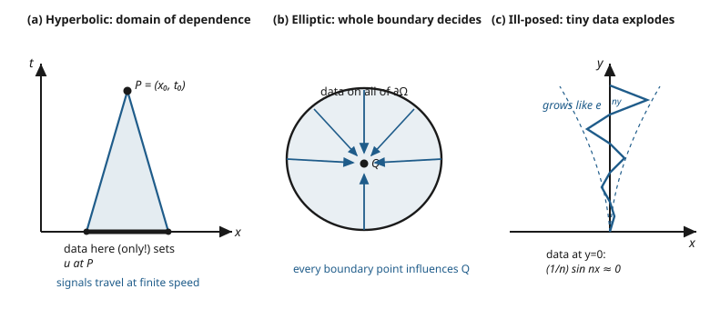

# Partial Differential Equations · Lesson 1.5: Characteristics and well-posedness

> ⏱ ~15 min · Module 1: First-order PDEs and classification · Builds on: [1.4 Classifying second-order linear PDEs](01-04-classifying-second-order-pdes.md) · Unlocks: [2.1 Deriving the heat and diffusion equations](02-01-heat-diffusion-equations.md)

## Why this matters

A PDE by itself doesn't have a solution — a PDE *plus the right data* does. Give the wave equation a starting position and velocity and it predicts the future; give the same data to Laplace's equation and the "prediction" is garbage that explodes. The deep lesson of Module 1 is that the **type** of the equation — hyperbolic, parabolic, elliptic, the classification you just learned in 1.4 — is not a taxonomist's hobby. It dictates *what data the equation is allowed to eat*, and feeding it the wrong data produces a problem with no honest answer. This is also where physics enters: the characteristics of a hyperbolic PDE are exactly the paths signals travel, and their finite speed is causality itself.

## The idea

Before trusting any model you should ask three questions, and Hadamard packaged them as **well-posedness**:

1. **Existence** — is there a solution at all?
2. **Uniqueness** — is there exactly one, or could two different worlds satisfy the same data?
3. **Stability** — if I nudge the data a little, does the solution move a little? (Continuous dependence.)

The third is the sneaky one and the one this lesson is really about. Measured data always has error. If a tiny error in the data can produce a huge change in the answer, the model is worthless *even if a unique solution exists* — you can never supply data clean enough to pin it down. A well-posed problem is one where all three hold, so the answer is real, singular, and robust.

Which data makes a problem well-posed is decided by type. The mental picture: a **hyperbolic** equation (the wave equation) is a movie — you specify frame zero (position and velocity) and it plays forward, with information crawling outward at finite speed. A **parabolic** equation (heat) also plays forward in time, but it needs the walls of the room specified too (boundary conditions), and it can only run *forward* — it smooths, and smoothing can't be undone. An **elliptic** equation (Laplace) isn't a movie at all; it's an equilibrium, a soap film stretched across a wire loop. You specify the entire wire (the whole closed boundary) and the film's shape is then forced everywhere inside. Ask an elliptic equation to play forward from a starting frame and it panics.

**Characteristics** are the curves along which a hyperbolic equation carries information — the tracks the signals run on. They are why "frame zero" only needs to be known on a limited stretch to determine a given later point: that point's fate depends only on the slice of initial data its two characteristics reach back to. That slice is the point's **domain of dependence**.

## The formal version

**Well-posedness (Hadamard).** A boundary/initial-value problem for a PDE is *well-posed* if:
(i) a solution **exists**, (ii) it is **unique**, and (iii) it **depends continuously** on the data — small changes in the data (initial values, boundary values, coefficients) produce small changes in the solution, in an appropriate norm.

In words: a trustworthy model has an answer, only one answer, and an answer that doesn't lurch when you jiggle the inputs. Fail any one and the problem is *ill-posed*.

**Type dictates the data.** Let $u$ solve a second-order linear PDE classified as in 1.4. The well-posed data assignments are:

- **Hyperbolic** (e.g. $u_{tt} = c^2 u_{xx}$): **Cauchy / initial data** on a non-characteristic surface — both $u$ and its normal derivative, i.e. *position and velocity* $u(x,0)=f(x),\ u_t(x,0)=g(x)$ (plus boundary conditions on a finite spatial domain).
- **Parabolic** (e.g. $u_t = k u_{xx}$): **initial data** $u(x,0)=f(x)$ (one condition — only one time derivative appears) **plus boundary conditions** for all later time, and the problem runs **forward** in $t$ only.
- **Elliptic** (e.g. $u_{xx}+u_{yy}=0$): **boundary data on the entire closed boundary** $\partial\Omega$ — either $u$ prescribed (Dirichlet) or its normal derivative (Neumann). No initial-value/time direction exists.

In words: count the time derivatives to count the initial conditions (wave needs two, heat needs one); an elliptic equation has no time, so it wants its whole rim specified, not a starting line.

**Domain of dependence (hyperbolic causality).** For $u_{tt}=c^2u_{xx}$, the value $u(x_0,t_0)$ depends only on the initial data on the interval $[\,x_0 - c\,t_0,\ x_0 + c\,t_0\,]$ — the base cut out by the two characteristics $x \pm c\,t = \text{const}$ through $(x_0,t_0)$.

In words: nothing outside a finite window of the past can reach you, because signals move at speed $c$, not infinitely fast. Change the data far away and $u(x_0,t_0)$ doesn't feel it until light — or sound, or the wave — has had time to arrive.

## Picture

## Worked examples

**Example 1 (Hadamard's ill-posed problem — the classic).** Consider Laplace's equation with Cauchy (initial-value) data, treating $y$ as a "time":

$$u_{xx} + u_{yy} = 0, \qquad u(x,0) = 0, \qquad u_y(x,0) = \tfrac{1}{n}\sin(nx).$$

The data is *tiny*: as $n\to\infty$, $u_y(x,0) = \tfrac1n\sin(nx)$ has amplitude $\tfrac1n \to 0$ everywhere. A stable problem should give a solution that also shrinks to $0$. Solve it and watch what actually happens. Try $u(x,y) = \tfrac{1}{n^2}\sin(nx)\sinh(ny)$. Check it:

$$u_{xx} = -\sin(nx)\sinh(ny), \qquad u_{yy} = +\sin(nx)\sinh(ny) \ \Rightarrow\ u_{xx}+u_{yy}=0.\ \checkmark$$

$$u(x,0) = \tfrac{1}{n^2}\sin(nx)\underbrace{\sinh 0}_{=0} = 0,\qquad u_y(x,0) = \tfrac{1}{n^2}\sin(nx)\cdot n\underbrace{\cosh 0}_{=1} = \tfrac1n\sin(nx).\ \checkmark$$

So this is *the* solution. But at any fixed height $y>0$,

$$|u(x,y)| = \frac{|\sin(nx)|\,\sinh(ny)}{n^2} \sim \frac{e^{ny}}{2n^2} \xrightarrow[n\to\infty]{} \infty.$$

The data goes to zero while the solution blows up: **continuous dependence fails outright**. A vanishing input produces an unbounded output — no amount of care in measuring the data could ever control the answer. Laplace's equation with Cauchy data is the textbook ill-posed problem, and this is *why* elliptic equations demand full-boundary data instead.

**Example 2 (matching type to data on a domain).** Take the strip $0 < x < L$ and say what data makes each canonical equation well-posed, and why.

| Equation | Type (1.4) | Well-posed data | Reason |
|---|---|---|---|
| Wave $u_{tt}=c^2u_{xx}$ | hyperbolic | $u(x,0)=f,\ u_t(x,0)=g$, plus $u$ at $x=0,L$ for $t>0$ | two time-derivatives → two initial conditions (position + velocity); finite-speed signals need the ends specified |
| Heat $u_t=k u_{xx}$ | parabolic | $u(x,0)=f$, plus $u$ at $x=0,L$ for $t>0$; forward $t$ only | one time-derivative → one initial condition; diffusion smooths, so it runs forward, not back |
| Laplace $u_{xx}+u_{yy}=0$ | elliptic | $u$ (or $u_n$) on the *entire* closed boundary of the region | no time direction — equilibrium is pinned by the whole rim, like a soap film on a wire |

The rule of thumb you can carry out of Module 1: **count time derivatives for how many initial conditions; check for a time direction to decide initial-value vs. full-boundary.** Type is the switch.

## Watch out

- **You might think "a solution exists, so I'm done."** But well-posedness needs all *three* legs. A problem can have a perfectly good unique solution that is still useless because it's unstable — Example 1 has an exact, unique solution and is worthless. Existence is the easiest bar; stability is the one that bites.
- **You might think initial (Cauchy) data works for any equation.** It's the natural data for hyperbolic and parabolic equations, but poison for elliptic ones. Cauchy data on Laplace's equation is exactly Hadamard's blow-up. Elliptic equations want the *whole closed boundary*, not a starting line.
- **You might think you can run the heat equation backward to recover the past.** You can't — the *backward* heat equation is ill-posed. Diffusion smooths high-frequency wiggles away ($e^{-kn^2t}$ damps mode $n$); running time backward *amplifies* them ($e^{+kn^2t}$), so the tiniest noise explodes. This is why you can't un-stir cream from coffee, and why deblurring is hard.
- **You might think effects can arrive instantly.** For a hyperbolic PDE they can't: the domain of dependence is a *finite* interval $[x_0-ct_0,\ x_0+ct_0]$. Data outside it cannot affect $u(x_0,t_0)$. That finite reach is causality wearing a math coat.

## One-liner

> A model is only trustworthy if it's well-posed — existence *and* uniqueness *and* stability — and the equation's type is what decides which data it will accept without exploding.

## Problems

**P1 (🟢)** State, with one sentence of justification each, the well-posed data for: (a) the wave equation $u_{tt}=c^2u_{xx}$ on $0<x<\pi$; (b) Laplace's equation on the unit disk; (c) the heat equation $u_t = k u_{xx}$ on $0<x<1$.

**P2 (🟡)** For the wave equation with speed $c=2$, the value $u(5,3)$ is determined by the initial data on which interval of the $x$-axis? If you changed the initial data only near $x = 12$, would $u(5,3)$ change? Explain in one line.

**P3 (🔴, optional)** Show the *backward* heat equation is unstable. The forward problem $u_t = u_{xx}$ has mode solutions $u_n(x,t) = \tfrac1n e^{-n^2 t}\sin(nx)$. (a) Verify $u_n$ solves the equation and that its data $u_n(x,0)$ has amplitude $\to 0$ as $n\to\infty$. (b) Now solve *backward*: take data $u_n(x,T)=\tfrac1n\sin(nx)$ at a final time $T$ and evolve to $t<T$. Show the amplitude at $t=0$ is $\tfrac1n e^{+n^2 T}$, and conclude continuous dependence fails.

Solutions

**P1**
(a) **Hyperbolic** → Cauchy data $u(x,0)=f(x),\ u_t(x,0)=g(x)$ on $0<x<\pi$, plus boundary conditions at $x=0,\pi$ for $t>0$. Two time-derivatives demand two initial conditions (position and velocity), and the finite interval needs its ends pinned.
(b) **Elliptic** → boundary data on the *entire* circle $\partial\{x^2+y^2=1\}$: either $u$ prescribed (Dirichlet) or the normal derivative $u_n$ (Neumann). There is no time direction, so the whole closed boundary fixes the interior.
(c) **Parabolic** → initial data $u(x,0)=f(x)$ plus boundary conditions at $x=0,1$ for all $t>0$, evolving forward in $t$ only. One time-derivative → one initial condition; diffusion is irreversible so it runs forward.

**P2** The characteristics through $(x_0,t_0)=(5,3)$ are $x \pm c\,t = \text{const}$ with $c=2$, hitting $t=0$ at $x_0 \pm c\,t_0 = 5 \pm 6$. So $u(5,3)$ depends only on the initial data on $[\,-1,\ 11\,]$.

Changing the data near $x=12$ has **no effect** on $u(5,3)$: $x=12$ lies outside the domain of dependence $[-1,11]$, and signals travel at speed $c=2$, so at $t=3$ a disturbance from $x=12$ has reached only as far in as $12 - 2\cdot 3 = 6 > 5$ — it hasn't arrived.

**P3**
(a) $\partial_t u_n = \tfrac1n(-n^2)e^{-n^2t}\sin(nx) = -n\,e^{-n^2t}\sin(nx)$ and $\partial_{xx}u_n = \tfrac1n e^{-n^2t}(-n^2)\sin(nx) = -n\,e^{-n^2t}\sin(nx)$, so $u_t=u_{xx}$. ✓ At $t=0$, $u_n(x,0)=\tfrac1n\sin(nx)$ has amplitude $\tfrac1n \to 0$, so the initial data is uniformly small.

(b) A mode of the heat equation with spatial shape $\sin(nx)$ must be $u(x,t)=A\,e^{-n^2 t}\sin(nx)$ for a constant $A$. Imposing $u(x,T)=\tfrac1n\sin(nx)$ gives $A\,e^{-n^2 T}=\tfrac1n$, so $A = \tfrac1n e^{+n^2 T}$ and

$$u(x,t) = \tfrac1n\,e^{\,n^2 (T-t)}\sin(nx).$$

At $t=0$ the amplitude is $\tfrac1n e^{+n^2 T} \to \infty$ as $n\to\infty$. So final-time data of amplitude $\tfrac1n \to 0$ produces an initial state of amplitude $\to\infty$: the solution does **not** depend continuously on the data. The backward heat equation is ill-posed — high-frequency modes, which the forward equation damps, are exponentially amplified when you run time backward. (This is the mathematics behind why deblurring and un-mixing are so hard.)

## Flashback

**From Lesson 1.4 (Classifying second-order linear PDEs):** Classify the **Tricomi equation** $y\,u_{xx} + u_{yy} = 0$ — its type is not the same everywhere. Give the type in each region of the plane.

Solution

Match to $A\,u_{xx} + B\,u_{xy} + C\,u_{yy} + \dots = 0$: here $A=y$, $B=0$, $C=1$. The discriminant is

$$B^2 - 4AC = 0 - 4\,y\,(1) = -4y.$$

- $y < 0$: discriminant $-4y > 0$ → **hyperbolic**.
- $y = 0$: discriminant $=0$ → **parabolic** (the borderline line $y=0$).
- $y > 0$: discriminant $-4y < 0$ → **elliptic**.

The type *changes with position* — the equation is hyperbolic in the lower half-plane, elliptic in the upper, parabolic on the $x$-axis. (This mixed-type behavior is exactly what models transonic flow, where the governing equation switches type as the flow crosses the speed of sound — and by this lesson, the appropriate data switches with it.)

## Connections

- **Backward:** this closes Module 1. The classification of [1.4](01-04-classifying-second-order-pdes.md) is what selects the data here, and the *characteristics* along which hyperbolic information travels are the curves from [1.1](01-01-what-is-a-pde-transport.md)–[1.3](01-03-quasilinear-first-order.md), now reread as the skeleton of causality. Together with 1.4 this completes **Boss Problem 1**.
- **Forward:** every equation in Module 2 is a well-posedness case study — the [heat equation](02-01-heat-diffusion-equations.md) (parabolic, forward-only), [d'Alembert's wave solution](02-02-wave-equation-dalembert.md) (hyperbolic, with its explicit domain of dependence), and [Laplace/Poisson](02-03-laplace-poisson-equations.md) (elliptic, full-boundary). The [maximum principle](02-04-maximum-principles.md) is one concrete stability estimate. Numerically, [6.2](06-02-finite-differences-well-posedness.md) revisits all of this as the CFL condition — a discretization that violates the domain of dependence is unstable for the same reason.
- **Sideways (relativity):** the hyperbolic domain of dependence *is* the past light cone. Finite propagation speed along characteristics is exactly the causal structure of spacetime — no signal outreaches light. See `relativity` ([syllabus](../../relativity/syllabus.md)).
- **Sideways (quantum mechanics):** the Schrödinger equation is its own well-posedness story — first-order in time (one initial condition, the wavefunction $\psi(x,0)$) yet dispersive and reversible, unlike the heat equation it superficially resembles. See `quantum-mechanics` ([syllabus](../../quantum-mechanics/syllabus.md)).
- **Sideways (functional analysis):** "continuous dependence in an appropriate norm" is a hand-wave until you have the right spaces and operator theory to make it a theorem. The rigorous machinery — semigroups, energy estimates, the choice of norm that makes a problem well-posed — lives in `functional-analysis` ([syllabus](../../functional-analysis/syllabus.md)).
