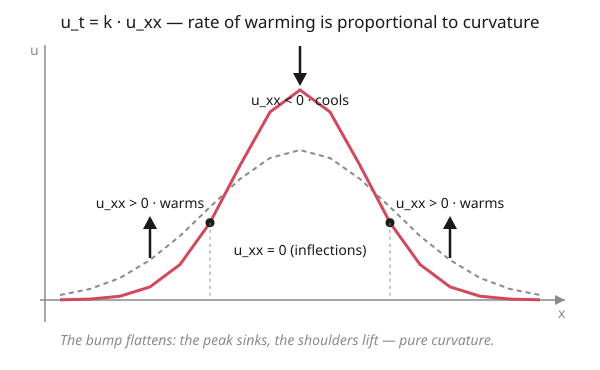

# Partial Differential Equations · Lesson 2.1: Deriving the heat and diffusion equations

> ⏱ ~15 min · Module 2: The three classical equations · Builds on: [1.5 Characteristics and well-posedness](01-05-characteristics-well-posedness.md) · Unlocks: [2.2 The wave equation and d'Alembert's solution](02-02-wave-equation-dalembert.md)

## Why this matters

Heat spreading through a rod, dye bleeding into still water, a stock's volatility smearing a price distribution, neutrons wandering through a reactor — all obey the *same* equation, and it's the simplest PDE that actually captures how nature erases differences. Everything downstream in this course leans on it: separation of variables (Module 3) solves it on a box, the Fourier transform (Module 4) solves it on the line, and the maximum principle (2.4) reads its temperament. It's also the entry point where PDEs meet probability and statistical mechanics: the heat equation is the continuum limit of a random walk, and its solution is the Gaussian you already know. Deriving it once, honestly, from bookkeeping on energy is what makes all of that feel inevitable instead of magical.

## The idea

Two everyday facts, combined, force the whole equation.

**Fact 1 — heat flows downhill.** If one spot is hotter than its neighbor, energy leaks from hot to cold, and the steeper the temperature drop, the faster it leaks. That's it: flux is proportional to the *slope* of temperature, pointing from high to low.

**Fact 2 — energy is conserved.** Nothing is created or destroyed inside a little segment of rod. So the temperature in that segment can only change because more heat flows *in* one end than leaks *out* the other. Track that imbalance and you've tracked the temperature.

Now put them together and ask: *which* points heat up? Not the hot ones or the cold ones — the **curved** ones. Picture a temperature bump. At the peak, both neighbors are cooler, so heat drains away in both directions: the peak cools. In a valley, both neighbors are warmer, so heat pours in from both sides: the valley warms. The peak is concave-down, the valley concave-up — so the sign of the *curvature* decides the direction of change. Straight-line temperature profiles (zero curvature) don't change at all: whatever flows in the left end flows straight out the right. That single sentence — *change is proportional to curvature* — is the heat equation.

## The formal version

Let $u(x,t)$ be the temperature at position $x$ and time $t$ (for diffusion, read $u$ as concentration instead). Two ingredients:

**Fourier's law (Fick's law for diffusion).**

$$q(x,t) = -k\,u_x,$$

where $q$ is the heat **flux** — energy crossing a point per unit time, positive meaning rightward — and $u_x = \partial u/\partial x$ is the temperature gradient. *In words:* heat flows down the temperature gradient, and the minus sign is what makes "down" down — where temperature rises to the right ($u_x>0$), heat moves left ($q<0$). The constant $k>0$ is the **diffusivity**, with units of $\text{length}^2/\text{time}$.

**Conservation on a slice $[x,\,x+\Delta x]$.** The heat stored in the slice changes at a rate equal to (flux in at the left) minus (flux out at the right):

$$\frac{\partial}{\partial t}\!\int_x^{x+\Delta x}\! u\,dx' \;=\; q(x,t) - q(x+\Delta x,\,t).$$

*In words:* the segment's total heat rises only when more comes in the left face than leaves the right face. Divide by $\Delta x$ and let $\Delta x\to 0$: the left side becomes $u_t$, and the right side becomes $-q_x$ (a negative difference quotient of $q$). So $u_t = -q_x$. Substitute Fourier's law $q=-k\,u_x$:

$$\boxed{\,u_t = k\,u_{xx}\,}$$

*In words:* the rate of warming at each point equals the diffusivity times the curvature of the temperature profile. Concave-up points ($u_{xx}>0$) warm; concave-down points ($u_{xx}<0$) cool; the steady state ($u_t=0$) forces $u_{xx}=0$, a straight-line profile between the endpoints.

This is a **parabolic** second-order PDE in the classification from [1.4](01-04-classifying-second-order-pdes.md) — exactly one characteristic direction — and (with $k>0$) it is **well-posed** forward in time from initial data, per [1.5](01-05-characteristics-well-posedness.md).

## Picture

## Worked examples

**Example 1 (mechanical — the derivation, one slice at a time).** Fix the picture as a control volume $[x, x+\Delta x]$. Its stored heat (up to a constant we can absorb into $k$) is $\int_x^{x+\Delta x} u\,dx'$, whose time-derivative is, by the mean-value idea, approximately $u_t(x,t)\,\Delta x$. The net inflow is

$$q(x,t)-q(x+\Delta x,t) = -\big[q(x+\Delta x,t)-q(x,t)\big] \approx -q_x(x,t)\,\Delta x.$$

Set the two equal and cancel the common $\Delta x$:

$$u_t \approx -q_x, \qquad\text{exact as }\Delta x\to 0.$$

Now insert $q=-k\,u_x$, so $q_x = -k\,u_{xx}$, giving $u_t = k\,u_{xx}$. Notice what happened to the two minus signs: one from Fourier's law, one from "net inflow is *minus* the change in flux," and they multiply to a plus. Lose either and you'd get $u_t=-k\,u_{xx}$ — the **backward** heat equation, which (spoiler, and Watch Out) is a disaster.

**Example 2 (reading the sign of curvature).** A rod on $[0,1]$ starts with the tent profile

$$u_0(x)=\begin{cases}2x, & 0\le x\le \tfrac12,\\[2pt] 2(1-x), & \tfrac12\le x\le 1,\end{cases}$$

held at $u=0$ at both ends. Where does heat flow at $t=0^+$?

- On each *straight* arm, $u_{xx}=0$, so those interior points don't change — yet.
- At the **peak** $x=\tfrac12$ the profile is concave-down (a downward kink: slope jumps from $+2$ to $-2$), so $u_{xx}<0$ there and the tip immediately **cools**. This is the whole action: the sharp corner is instantly rounded off.

The **steady state** is set by $u_{xx}=0$ with the boundary values $u(0)=u(1)=0$ — the only straight line through both is $u\equiv 0$. So the tent melts down to the flat zero profile. (Had the ends been held at $u(0)=10,\ u(1)=30$, the steady state would be the straight interpolation $u(x)=10+20x$ — steady heat conduction is just linear interpolation of the boundary temperatures.)

## Watch out

- **You might think the flux formula's minus sign is optional bookkeeping, but actually it encodes the second law.** $q=-k\,u_x$ says heat runs *down* the gradient, hot to cold. Drop the sign and heat would flow uphill, spontaneously un-mixing — and, as Example 1 showed, the equation would flip to the ill-posed backward form.
- **You might think diffusion propagates at a finite speed, but actually it's infinite.** Because the equation is parabolic, a disturbance concentrated at one point is felt *everywhere* the instant after, $t=0^+$ (the heat kernel of [4.2](04-02-heat-equation-line-heat-kernel.md) is a Gaussian, nonzero for all $x$). This is physically unrealistic — nothing beats light speed — but it's the standard, hugely useful idealization. Contrast the wave equation ([2.2](02-02-wave-equation-dalembert.md)), which has a sharp finite propagation speed.
- **You might think forward and backward heat are equally solvable, but actually only $k>0$ is well-posed.** Running heat *backward* ($k<0$, i.e. reconstructing the past) amplifies the tiniest high-frequency noise without bound — the same non-existence/instability pathology flagged for the wrong data in [1.5](01-05-characteristics-well-posedness.md). Diffusion smooths going forward; it cannot be un-smoothed stably.
- **You might think a hot point cools and a cold point warms, but actually the driver is curvature, not value.** A point can be blazing hot and still get *hotter* if it sits in a local dip of the profile ($u_{xx}>0$). It's the shape around a point, not its temperature, that sets $u_t$.

## One-liner

> Conservation plus "heat flows downhill" gives $u_t = k\,u_{xx}$: every point's temperature chases its own curvature, so bumps flatten, corners round, and profiles relax toward a straight line.

## Problems

**P1 (🟢)** A metal bar has temperature profile $u(x,t)=e^{-4t}\sin(2x)$. Verify it satisfies the heat equation $u_t=k\,u_{xx}$ and find the diffusivity $k$.

**P2 (🟡)** At a fixed instant the temperature along a rod is $u(x)=x^3-3x$ on $-2\le x\le 2$. Using only the sign of $u_{xx}$, state which points are warming and which are cooling right now, and find the one point where the local temperature is momentarily stationary in time.

**P3 (🔴, optional)** A rod on $[0,L]$ is insulated on the sides, held at temperature $A$ at $x=0$ and $B$ at $x=L$, with a *uniform* internal heating $s$ per unit length (so conservation reads $u_t=k\,u_{xx}+s$ with constant $s>0$). Find the steady-state profile $u(x)$, and say — in one sentence — how the internal source bends it away from the source-free straight line.

Solutions

**P1** Differentiate. Time: $u_t=-4e^{-4t}\sin(2x)$. Space: $u_x=2e^{-4t}\cos(2x)$, then $u_{xx}=-4e^{-4t}\sin(2x)$. So $u_t=k\,u_{xx}$ becomes $-4e^{-4t}\sin(2x)=k\cdot(-4)e^{-4t}\sin(2x)$, giving $k=1$. (Note the whole profile decays in time by the factor $e^{-4t}$ — diffusion damps the $\sin(2x)$ mode; higher spatial frequencies would decay even faster, the seed of Module 3's separation of variables.)

**P2** Curvature: $u_{xx}=\dfrac{d^2}{dx^2}(x^3-3x)=6x$. Its sign:
- For $x>0$: $u_{xx}=6x>0$ (concave up) → those points are **warming** ($u_t=k\cdot 6x>0$).
- For $x<0$: $u_{xx}<0$ (concave down) → those points are **cooling**.
- At $x=0$: $u_{xx}=0$, so $u_t=0$ — the temperature there is **momentarily stationary** (an inflection point of the profile). The rule is curvature, not value: at $x=0$ the temperature is $u=0$, neither hottest nor coldest, yet it's the one frozen point.

**P3** Steady state means $u_t=0$, so $0=k\,u_{xx}+s$, i.e. $u_{xx}=-s/k$, a negative constant. Integrate twice:

$$u(x)=-\frac{s}{2k}x^2 + C_1 x + C_2.$$

Apply $u(0)=A\Rightarrow C_2=A$; then $u(L)=B$ gives $-\frac{s}{2k}L^2+C_1L+A=B$, so $C_1=\dfrac{B-A}{L}+\dfrac{sL}{2k}$. Thus

$$u(x)=\underbrace{A+\frac{B-A}{L}\,x}_{\text{straight interpolation}}\;+\;\underbrace{\frac{s}{2k}\,x(L-x)}_{\text{source bulge}}.$$

The source adds a **downward-opening parabola** $\frac{s}{2k}x(L-x)$ that bows the profile *upward* between the ends (it's positive inside $(0,L)$, zero at both ends): steady internal heating makes the middle hotter than simple end-to-end conduction would, because the extra energy has to be carried out through the boundaries. With $s=0$ the bulge vanishes and you recover the linear interpolation of Example 2.

## Flashback

**From Lesson 1.4 (Classifying second-order PDEs):** Classify the PDE $u_{tt} - 6\,u_{tx} + 9\,u_{xx} = 0$ as elliptic, parabolic, or hyperbolic, and name which classical equation it most resembles in character.

Solution

Write the principal part $A\,u_{tt}+2B\,u_{tx}+C\,u_{xx}$ with $A=1$, $2B=-6\Rightarrow B=-3$, $C=9$. The discriminant is

$$B^2-AC = (-3)^2-(1)(9)=9-9=0.$$

Discriminant $=0$ ⇒ **parabolic** — exactly one (repeated) characteristic direction, the same type as the heat equation of this lesson. (Indeed it factors as $(\partial_t-3\partial_x)^2 u=0$, a single repeated characteristic slope $dx/dt=-3$, the hallmark of the parabolic case.)

## Connections

- **Backward:** the classification ([1.4](01-04-classifying-second-order-pdes.md)) named this the parabolic type; well-posedness ([1.5](01-05-characteristics-well-posedness.md)) is why $k>0$ (forward) is fine and $k<0$ (backward) is not — the derivation here is where those labels get their physics.
- **Forward:** the **maximum principle** ([2.4](02-04-maximum-principles.md)) turns "curvature drives change" into "extremes can't grow in the interior"; **separation of variables** ([3.1](03-01-separation-of-variables.md)) solves $u_t=k\,u_{xx}$ on a finite rod (P1's decaying sine is one mode); the **heat kernel** ([4.2](04-02-heat-equation-line-heat-kernel.md)) solves it on the whole line and exhibits the infinite propagation speed as a Gaussian.
- **Sideways (probability & stat mech):** diffusion is the continuum limit of a **random walk** — a particle taking tiny random steps has a position density that satisfies exactly $u_t=k\,u_{xx}$, and its solution is the **Gaussian** you met as the normal distribution in [probability-theory](../../probability-theory/syllabus.md) and as Brownian motion / the fluctuation–dissipation story in [stat-mech](../../stat-mech/syllabus.md). Same equation, same bell curve, three vocabularies.
- **Sideways (physics):** set $u_t=0$ and the heat equation becomes $u_{xx}=0$ — Laplace's equation ([2.3](02-03-laplace-poisson-equations.md)). In higher dimensions steady heat obeys $\nabla^2 u=0$, the very same equation governing electrostatic potential in charge-free regions from [em-refresher](../../em-refresher/syllabus.md): equilibrium temperature and electrostatic potential are mathematically identical.

See the [syllabus](../syllabus.md) for where this sits in the arc.
