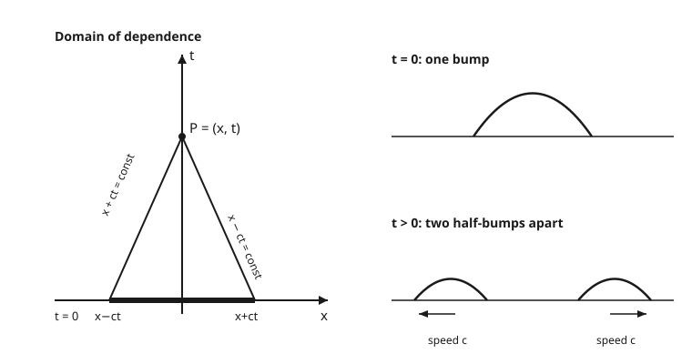

# Partial Differential Equations · Lesson 2.2: The wave equation and d'Alembert's solution

> ⏱ ~15 min · Module 2: The three classical equations · Builds on: [2.1 Deriving the heat and diffusion equations](02-01-heat-diffusion-equations.md) · Unlocks: [2.3 Laplace's and Poisson's equations](02-03-laplace-poisson-equations.md)

## Why this matters

The heat equation from [2.1](02-01-heat-diffusion-equations.md) describes things that spread and settle. But the universe also *vibrates* — plucked strings, sound in air, ripples, light itself. All of these obey one equation, and it behaves almost oppositely to heat: instead of smearing sharp features out, it carries them forward at a fixed speed, undistorted. Even better, in one dimension we can solve it *completely and exactly* with a formula you could scribble on a napkin. That formula — d'Alembert's — is the cleanest closed-form solution in all of PDE, and it makes the physics (signals travel, at a finite speed, along definite paths) visible at a glance.

## The idea

Picture a taut guitar string. Pull one point up and let go. Each little segment feels a restoring pull from tension whenever the string is *curved* there — a segment sitting at the top of a bump gets yanked back down, one in a valley gets pushed up. Newton's law "force = mass × acceleration" applied to that segment says: **acceleration is proportional to curvature**. Curvature is $u_{xx}$; vertical acceleration is $u_{tt}$; the proportionality constant turns out to be a speed squared. That's the whole equation.

Now the magic. The solution is *nothing but shapes sliding along the string* — one moving right, one moving left, both at the same speed $c$, neither one changing form as it travels. Whatever you start with splits into a right-going copy and a left-going copy. Pluck the middle and you don't get one wave; you get two, each half as tall, marching apart forever. That is the entire behavior, and d'Alembert's formula is just bookkeeping for those two moving shapes.

## The formal version

**The one-dimensional wave equation.**

$$u_{tt} = c^2\,u_{xx},$$

where $u(x,t)$ is the displacement of the string at position $x$ and time $t$, and $c > 0$ is the wave speed (for a string, $c = \sqrt{T/\rho}$ with tension $T$ and mass per length $\rho$).

*In words:* the up-and-down acceleration of each point equals $c^2$ times the local curvature — curved sharply, accelerated hard.

**Factor the operator.** Write $\partial_t$ for $\partial/\partial t$ and $\partial_x$ for $\partial/\partial x$. Then

$$\partial_{tt} - c^2\,\partial_{xx} = \big(\partial_t - c\,\partial_x\big)\big(\partial_t + c\,\partial_x\big).$$

*In words:* the wave operator is a product of two *transport* operators — exactly the first-order left/right movers from [1.1](01-01-what-is-a-pde-transport.md). A right-moving shape $F(x-ct)$ is killed by the first factor; a left-moving shape $G(x+ct)$ is killed by the second. So the general solution is their sum:

$$u(x,t) = F(x - ct) + G(x + ct),$$

any two (twice-differentiable) shapes $F$ and $G$.

**d'Alembert's formula.** Match this to initial data — an initial displacement $u(x,0) = \varphi(x)$ and an initial velocity $u_t(x,0) = \psi(x)$. Solving for $F$ and $G$ gives

$$\boxed{\,u(x,t) = \tfrac{1}{2}\big[\varphi(x - ct) + \varphi(x + ct)\big] + \frac{1}{2c}\int_{x-ct}^{\,x+ct} \psi(s)\,ds\,}.$$

*In words:* the displacement at $(x,t)$ is the **average of the initial shape** at the two points a distance $ct$ away, plus $\tfrac{1}{2c}$ times the **total initial velocity stored on the interval between them**.

**Domain of dependence.** The value $u(x,t)$ depends on the initial data *only* through the interval $[x-ct,\ x+ct]$ on the line $t=0$. Nothing outside it can affect the point.

*In words:* to know the wave here-and-now, you only need to have known a finite stretch of the starting line — the two ends of that stretch are exactly where the two characteristics through $(x,t)$ land. The signal from any starting point travels at speed $c$, no faster: **finite propagation speed**.

## Picture

The two straight characteristics through $P=(x,t)$ have slopes $\pm 1/c$ in the $(x,t)$ plane; they fence off the bold interval $[x-ct, x+ct]$ — all the past that $P$ can feel. On the right, a single bump becomes two half-bumps sliding apart: d'Alembert in one frame.

## Worked examples

**Example 1 (mechanical — a bump with no initial velocity).** Take $\varphi(x) = 1$ on $[-1,1]$ and $0$ elsewhere, with $\psi = 0$. d'Alembert collapses to

$$u(x,t) = \tfrac{1}{2}\big[\varphi(x-ct) + \varphi(x+ct)\big].$$

The term $\tfrac12\varphi(x-ct)$ is a half-height box centered at $x=ct$ (moving right); $\tfrac12\varphi(x+ct)$ is a half-height box centered at $x=-ct$ (moving left). At $t=0$ they overlap and add back to the original height-1 box. For any $t > 1/c$ they've fully separated: two height-$\tfrac12$ boxes, one near $+ct$, one near $-ct$, gliding apart forever. Notice the sharp corners *never soften* — a kink in the data rides along a characteristic unchanged. Heat would have blurred that box instantly; the wave equation refuses to.

**Example 2 (initial velocity — a spreading plateau).** Now the opposite data: $\varphi = 0$, and $\psi(x) = 1$ on $[-1,1]$, $0$ elsewhere (give the middle of the string a sideways whack). Take $c=1$. The displacement is pure integral:

$$u(x,t) = \frac{1}{2}\int_{x-t}^{\,x+t} \psi(s)\,ds = \frac{1}{2}\,\Big(\text{length of } [x-t,\,x+t]\cap[-1,1]\Big).$$

Let $\Psi$ be an antiderivative of $\psi$: the ramp $\Psi(s) = -1$ for $s\le -1$, $\Psi(s)=s$ for $-1\le s\le 1$, $\Psi(s)=1$ for $s\ge 1$. Then $u(x,t)=\tfrac12[\Psi(x+t)-\Psi(x-t)]$. Track the center $x=0$:

- For $0 < t < 1$: $u(0,t) = \tfrac12[\Psi(t) - \Psi(-t)] = \tfrac12[t-(-t)] = t$ — rising.
- For $t \ge 1$: $u(0,t) = \tfrac12[1 - (-1)] = 1$ — and it *stays* at 1.

Unlike the displacement bump, this data doesn't come back down: an initial velocity leaves a permanent offset. The profile at a fixed later time is a flat-topped **plateau** of height 1, widening at speed $c$ on both sides — the region the "whack" has had time to reach. (This is the first half of Boss Problem 2.)

## Watch out

- **You might think one initial condition is enough** (as with heat, where you only specify $u(x,0)$). But the wave equation is *second* order in $t$, so it needs *two*: displacement $\varphi$ **and** velocity $\psi$. A string can start from the same shape moving up or moving down — different futures, so you must say which.
- **You might think a disturbance is felt everywhere instantly.** Heat does that (infinite propagation speed — see [2.1](02-01-heat-diffusion-equations.md)), but waves do not. Outside the forward wedge $|x - x_0| \le c\,t$ of a source at $x_0$, $u$ is *exactly* zero: the signal simply hasn't arrived. Finite speed $c$ is the defining contrast with diffusion.
- **You might expect the equation to smooth kinks like heat does.** It never does. A corner in $\varphi$ persists forever, riding along a characteristic. The wave equation *transports* irregularity; the heat equation *erases* it.
- **You might read the domain of dependence as all of the initial line.** It's the bounded interval $[x-ct,\,x+ct]$ only — finite length $2ct$. Everything else is invisible to $(x,t)$.

## One-liner

> The wave equation is two transport equations in a trench coat: every solution is a right-mover plus a left-mover, and d'Alembert's formula reads off both from the initial displacement (averaged) and velocity (integrated) over the finite interval $[x-ct, x+ct]$.

## Problems

**P1 (🟢)** Solve $u_{tt} = u_{xx}$ (so $c=1$) with $\varphi(x) = \sin x$ and $\psi(x) = 0$. Simplify to a single product, and identify the type of motion.

**P2 (🟡)** Solve $u_{tt} = u_{xx}$ with $\varphi(x) = 0$ and $\psi(x) = \cos x$. Simplify to a single product, and check both initial conditions hold.

**P3 (🔴, optional)** Take $\varphi$ supported on $[-1,1]$ (i.e. $\varphi = 0$ outside it), $\psi = 0$, and $c = 3$. An observer sits at $x = 10$.
(a) At what time $t$ does the observer *first* feel any disturbance?
(b) At what time does the observer return to complete rest, and stay there? Explain using the domain of dependence.

Solutions

**P1** With $\psi=0$, d'Alembert gives $u = \tfrac12[\sin(x-t) + \sin(x+t)]$. The product-to-sum identity $\sin A + \sin B = 2\sin\!\big(\tfrac{A+B}{2}\big)\cos\!\big(\tfrac{A-B}{2}\big)$ with $A=x-t$, $B=x+t$ gives $\tfrac{A+B}{2}=x$, $\tfrac{A-B}{2}=-t$:

$$u(x,t) = \tfrac12\cdot 2\sin x\cos(-t) = \sin x\,\cos t.$$

This is a **standing wave**: a fixed spatial shape $\sin x$ whose amplitude oscillates in time as $\cos t$ — no net travel, the classic string mode. (Check: $u_{tt} = -\sin x\cos t$, $u_{xx} = -\sin x\cos t$, equal ✓; $u(x,0)=\sin x$ ✓; $u_t = -\sin x\sin t$, so $u_t(x,0)=0$ ✓.)

**P2** With $\varphi=0$ and $c=1$, d'Alembert is the pure integral:

$$u(x,t) = \frac{1}{2}\int_{x-t}^{\,x+t}\cos s\,ds = \frac{1}{2}\big[\sin(x+t) - \sin(x-t)\big].$$

Product-to-sum $\sin A - \sin B = 2\cos\!\big(\tfrac{A+B}{2}\big)\sin\!\big(\tfrac{A-B}{2}\big)$ with $A=x+t$, $B=x-t$ gives $\tfrac{A+B}{2}=x$, $\tfrac{A-B}{2}=t$:

$$u(x,t) = \cos x\,\sin t.$$

Check the data: $u(x,0)=\cos x\cdot 0 = 0 = \varphi$ ✓. And $u_t = \cos x\cos t$, so $u_t(x,0) = \cos x = \psi$ ✓. Again a standing wave, now built from an initial velocity instead of an initial displacement.

**P3** With $\psi=0$, $u(x,t) = \tfrac12[\varphi(x-ct)+\varphi(x+ct)] = \tfrac12[\varphi(10-3t)+\varphi(10+3t)]$. The argument $10+3t \ge 10$ always lies outside $[-1,1]$, so $\varphi(10+3t)=0$ for all $t$; only the right-moving piece $\varphi(10-3t)$ can be nonzero.

(a) The observer feels something once $10-3t$ enters the support, i.e. once $10-3t \le 1$, giving $t \ge 3$. So the disturbance **first arrives at $t = 3$**. (Sanity check: the nearest edge of the data is at $s=1$, distance $10-1=9$ away, traveling at speed $3$, so $9/3 = 3$. ✓)

(b) The observer feels the wave only while $10-3t \in [-1,1]$, i.e. $-1 \le 10-3t \le 1$, i.e. $3 \le t \le \tfrac{11}{3}$. Once $10-3t < -1$ — that is, for $t > \tfrac{11}{3}$ — the argument has passed *below* the support, $\varphi(10-3t)=0$ again, and $u$ is exactly $0$ from then on. The observer feels the pulse pass during $[3,\ \tfrac{11}{3}]$ and returns to permanent rest at $t = \tfrac{11}{3}$. This is finite propagation speed made concrete: the pulse arrives, sweeps by, and leaves silence — nothing lingers, and the domain of dependence $[10-3t,\ 10+3t]$ only ever brushes the support for that finite window.

## Flashback

**From Lesson 2.1 (Deriving the heat equation):** A rod obeys $u_t = u_{xx}$.
(a) At the current instant its temperature profile near a point is $u(x) = 100 - x^2$. Is that point heating up or cooling down, and why?
(b) With no heat source and fixed ends $u(0) = 10$, $u(4) = 30$, what is the eventual steady-state temperature profile?

Solution

(a) The heat equation says the rate of change equals the curvature: $u_t = u_{xx}$. Here $u_{xx} = -2 < 0$ (the profile is concave down, an arch). So $u_t = -2 < 0$: the point is **cooling**. Intuitively it sits above its neighbors on both sides, so heat flows away from it — hot spots relax downward, exactly the smoothing behavior that the wave equation lacks.

(b) Steady state means $u_t = 0$, so $u_{xx} = 0$, so $u$ is **linear**: $u(x) = a + bx$. Fit the ends: $u(0) = a = 10$, and $u(4) = 10 + 4b = 30 \Rightarrow b = 5$. Thus $u(x) = 10 + 5x$. A rod with fixed-temperature ends and no source always settles to the straight line between them.

## Connections

- **Backward:** the factoring $\partial_{tt}-c^2\partial_{xx} = (\partial_t - c\partial_x)(\partial_t + c\partial_x)$ turns the wave equation into two of the transport equations from [1.1](01-01-what-is-a-pde-transport.md), and the characteristics $x\pm ct = \text{const}$ are exactly the curves from [1.2](01-02-method-of-characteristics-first-order.md). The wave equation is the model *hyperbolic* PDE classified in [1.4](01-04-classifying-second-order-pdes.md), and its two-real-characteristic structure is why the initial-value problem is well-posed ([1.5](01-05-characteristics-well-posedness.md)).
- **Forward:** [2.4](02-04-maximum-principles.md) shows waves have *no* maximum principle (a bump can grow taller than its data), so we control them with an *energy* method instead. On the whole line the transform approach and dispersion appear in [4.3](04-03-wave-equation-line-dispersion.md).
- **Sideways (contrast with heat):** everything here is the mirror image of [2.1](02-01-heat-diffusion-equations.md) — finite vs. infinite propagation speed, sharp-features-preserved vs. instantly-smoothed, two initial conditions vs. one. Same lesson, opposite equation.
- **Sideways (relativity):** the characteristics $x = \pm ct$ *are light rays* when $c$ is the speed of light — the wave equation is the equation of light and gravity fields. The domain of dependence $[x-ct, x+ct]$ is precisely the **past light cone** of the event $(x,t)$, and "finite propagation speed" is the statement that nothing outruns $c$. See the light-cone geometry in [relativity](../../relativity/syllabus.md).
- **Sideways (electromagnetism):** Maxwell's equations in a vacuum force each field component to satisfy $u_{tt} = c^2 u_{xx}$ (in 3D, with the Laplacian) — that is *why* light is a wave and travels at $c$. The [em-refresher](../../em-refresher/syllabus.md) derives this directly. See the [syllabus](../syllabus.md) for where the course heads next.
