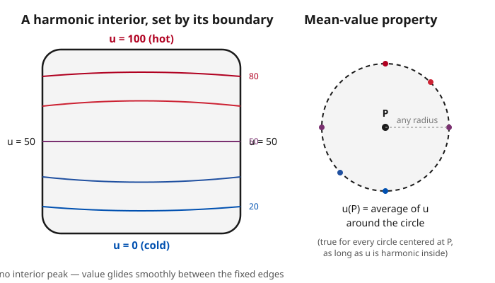

# Partial Differential Equations · Lesson 2.3: Laplace's and Poisson's equations

> ⏱ ~15 min · Module 2: The three classical equations · Builds on: [2.2 The wave equation and d'Alembert's solution](02-02-wave-equation-dalembert.md) · Unlocks: [2.4 Maximum principles and their consequences](02-04-maximum-principles.md)

## Why this matters

The heat equation tells you how temperature *changes*; the wave equation tells you how a string *moves*. But often the interesting question is what happens after everything settles: the steady temperature in a metal plate whose edges are held fixed, the electric potential around a charge, the gravitational potential of a planet, the shape of a soap film stretched on a wire loop. Every one of these is governed by the same equation — Laplace's — and its cousin with a source term, Poisson's. These are the **equilibrium** equations of physics, and their solutions (harmonic functions) are so rigid and well-behaved that they anchor half of applied mathematics.

## The idea

Take the heat equation $u_t = k\,\nabla^2 u$ and wait forever. Temperature stops changing, so $u_t = 0$, and what's left is $\nabla^2 u = 0$. That's Laplace's equation: **the steady state is where the Laplacian vanishes.**

What does $\nabla^2 u = 0$ *mean*, physically? The Laplacian at a point measures how much $u$ there differs from the average of its neighbors. If $u$ at a point sits *below* the surrounding average, the Laplacian is positive and heat flows in to warm it up; if *above*, negative, and heat flows out. Equilibrium — nothing flowing — is exactly the state where every point already equals its neighborhood average. No point is a local hot spot or cold spot; each is perfectly splitting the difference with everything around it. That "equals the average of its surroundings" property is the whole personality of a harmonic function, and it forbids interior bumps: a harmonic function can't have a peak or a valley in the interior, because a peak would sit *above* its neighbors' average. The extremes always live on the boundary.

Poisson's equation is the same story with a source added: $\nabla^2 u = -f$, where $f$ is a distribution of "stuff" being pumped in (charge, mass, a heat source). Where you inject source, the function is allowed to bulge away from the plain average.

## The formal version

**Laplace's equation.** A function $u$ on a region $\Omega \subseteq \mathbb{R}^n$ is **harmonic** if

$$\nabla^2 u = \sum_{i=1}^n \frac{\partial^2 u}{\partial x_i^2} = 0 \quad \text{in } \Omega.$$

In words: the sum of the pure second derivatives is zero — the function has no net concavity, curving up in one direction exactly as much as it curves down in another. ($\nabla^2$, the **Laplacian**, is also written $\Delta$.)

**Poisson's equation.** With a source term $f$,

$$\nabla^2 u = -f \quad \text{in } \Omega.$$

In words: same operator, but now a prescribed source $f(x)$ drives the function away from harmonic. (Sign convention: we use $\nabla^2 u = -f$, so that a *positive* source $f$ produces a local hump — matching electrostatics below. Some texts write $+f$; always check.)

**Boundary conditions.** Laplace/Poisson are **elliptic** — they have no real characteristics, so no direction is special and no "information travels" through the domain. Consequently they need data on the *entire closed boundary* $\partial\Omega$, not initial data on a slice (contrast the wave equation of 2.2, where data lived on a line and propagated). Two standard choices:

- **Dirichlet:** prescribe the value $u = g$ on $\partial\Omega$ (the plate's edge temperatures).
- **Neumann:** prescribe the normal derivative $\partial u/\partial n = h$ on $\partial\Omega$ (the heat flux through the edge).

In words: pin down either the value or the outward slope all the way around, and the harmonic interior is then determined uniquely (Dirichlet) or up to a constant (Neumann).

**Mean-value property.** If $u$ is harmonic in $\Omega$, then for any ball $B_R(x)$ contained in $\Omega$,

$$u(x) = \frac{1}{|\partial B_R|}\int_{\partial B_R(x)} u \, dS.$$

In words: a harmonic function's value at a point equals its average over any sphere (in 2D, circle) centered there. This is the rigorous form of "equals the average of its surroundings," and it immediately implies harmonic functions have **no interior maxima or minima** — the seed of the maximum principle in 2.4.

**Fundamental solutions.** Away from the origin, the radially symmetric harmonic functions are

$$u = \ln r \ \ (n=2), \qquad u = \frac{1}{r} \ \ (n=3), \qquad r = |x|.$$

In words: these are the "unit response" of the Laplacian to a point source — the potential of a single charge — and they'll return as Green's functions in 5.2. Note 2D and 3D genuinely differ: a logarithm in the plane, a reciprocal in space.

## Picture

## Worked examples

**Example 1 (mechanical — spotting harmonic functions).** Compute $\nabla^2 u$ for each.

*(a)* $u = x^2 - y^2$: $\ u_{xx} = 2$, $\ u_{yy} = -2$, so $\nabla^2 u = 2 - 2 = 0$. **Harmonic.** The upward curve in $x$ is exactly cancelled by the downward curve in $y$ — a saddle, no bump.

*(b)* $u = xy$: $\ u_{xx} = 0$, $\ u_{yy} = 0$, so $\nabla^2 u = 0$. **Harmonic.** (Both $x^2-y^2$ and $xy$ are real/imaginary parts of $z^2$ — no accident; see Connections.)

*(c)* $u = \ln r$ in 2D, $r=\sqrt{x^2+y^2}$. Use the polar Laplacian $\nabla^2 u = u_{rr} + \tfrac{1}{r}u_r + \tfrac{1}{r^2}u_{\theta\theta}$. Here $u_r = \tfrac{1}{r}$, $u_{rr} = -\tfrac{1}{r^2}$, $u_{\theta\theta}=0$:

$$\nabla^2 u = -\frac{1}{r^2} + \frac{1}{r}\cdot\frac{1}{r} = 0 \quad (r \neq 0).$$

**Harmonic away from the origin** — at $r=0$ it blows up, which is exactly where the point source sits.

*(d)* $u = 1/r$ in 3D. Use the radial part of the 3D Laplacian, $\nabla^2 u = \tfrac{1}{r^2}\big(r^2 u_r\big)_r$. Here $u_r = -r^{-2}$, so $r^2 u_r = -1$, whose $r$-derivative is $0$:

$$\nabla^2 u = \frac{1}{r^2}\cdot 0 = 0 \quad (r \neq 0).$$

**Harmonic away from the origin** — the electrostatic potential of a point charge.

**Example 2 (a Laplace boundary-value problem by inspection).** Solve $\nabla^2 u = 0$ on the rectangle $0 \le x \le \pi$, $0 \le y \le 1$, with $u = 0$ on the left, right, and bottom edges, and $u(x,1) = \sin x$ on top.

Guess a product $u(x,y) = X(x)Y(y)$ matching the boundary's single sine mode: try $X(x) = \sin x$ (it already vanishes at $x=0$ and $x=\pi$, killing the two side edges). Plugging $u = \sin(x)\,Y(y)$ into Laplace:

$$\nabla^2 u = -\sin(x)\,Y(y) + \sin(x)\,Y''(y) = 0 \ \Rightarrow\ Y'' = Y.$$

So $Y(y) = A\sinh y + B\cosh y$. The bottom edge $u(x,0)=0$ forces $Y(0)=0$, i.e. $B=0$. The top edge $u(x,1)=\sin x$ forces $Y(1)=1$, i.e. $A\sinh 1 = 1$. Hence

$$\boxed{\,u(x,y) = \sin(x)\,\frac{\sinh y}{\sinh 1}\,}.$$

Check: $u_{xx} = -\sin(x)\tfrac{\sinh y}{\sinh 1}$ and $u_{yy} = +\sin(x)\tfrac{\sinh y}{\sinh 1}$ sum to $0$ ✓; all four boundary conditions hold ✓. The temperature is a sine ripple across, growing from $0$ at the bottom to full strength at the top via a $\sinh$ profile — this is separation of variables (3.1) in embryo, and the $\sinh$ is the elliptic sibling of the wave's oscillating $\cos$.

## Watch out

- **You might think a harmonic function can have an interior bump**, but actually the mean-value property forbids it: any interior point equals the average around it, so it can't strictly exceed all its neighbors. Max and min live on the boundary — always (that's the maximum principle, 2.4). If your computed "solution" has an interior peak, it isn't harmonic.
- **You might think the source sign in Poisson doesn't matter**, but actually it flips the physics. We wrote $\nabla^2 u = -f$: a positive source *raises* $u$ locally. Electrostatics uses $\nabla^2 \varphi = -\rho/\varepsilon_0$ with this same convention; a text that writes $\nabla^2 u = +f$ has flipped the meaning of $f$. State your convention and stick to it.
- **You might think 2D and 3D point-source potentials look alike**, but actually they're structurally different: $\ln r$ in the plane (which *grows* without bound as $r\to\infty$) versus $1/r$ in space (which decays). Using the wrong one is a classic dimensional error in Green's-function work (5.2).
- **You might think you can pose Laplace with initial data on one slice** like the wave equation, but actually elliptic problems are not evolution problems — there's no time direction. You must specify data on the *entire* closed boundary, or the problem is ill-posed (recall the well-posedness discussion of 1.5).

## One-liner

> Harmonic means "equal to your own neighborhood average" — no interior peaks, extremes forced to the boundary, and the whole interior pinned down by data on the closed edge.

## Problems

**P1 (🟢)** Is $u(x,y) = x^3 - 3xy^2$ harmonic on $\mathbb{R}^2$? Compute $\nabla^2 u$ to decide.

**P2 (🟡)** On the same rectangle as Example 2 ($0\le x\le\pi$, $0\le y\le 1$), solve $\nabla^2 u = 0$ with $u=0$ on left, right, and *top*, and $u(x,0) = \sin(2x)$ on the bottom. (Hint: which $X(x)$ vanishes at both $x=0,\pi$ and matches $\sin 2x$? Then which combination of $\sinh,\cosh$ dies at $y=1$?)

**P3 (🔴, optional)** Verify the mean-value property by hand for the harmonic $u = x^2 - y^2$ on the circle of radius $R$ centered at the origin. Parametrize the circle as $(R\cos\theta, R\sin\theta)$, average $u$ over $\theta \in [0,2\pi)$, and confirm you get $u(0,0)$.

Solutions

**P1** $u_x = 3x^2 - 3y^2$, $u_{xx} = 6x$; $\ u_y = -6xy$, $u_{yy} = -6x$. So

$$\nabla^2 u = 6x + (-6x) = 0.$$

**Yes, harmonic.** (It's $\operatorname{Re}(z^3)$ — the real part of a holomorphic function again, as Connections notes.)

**P2** Need $X(x)$ zero at both $x=0$ and $x=\pi$ and matching $\sin 2x$: take $X(x) = \sin 2x$. Then $u = \sin(2x)\,Y(y)$ in Laplace gives

$$-4\sin(2x)Y + \sin(2x)Y'' = 0 \ \Rightarrow\ Y'' = 4Y \ \Rightarrow\ Y(y) = A\sinh(2y) + B\cosh(2y).$$

Now the nonzero data is on the *bottom* and we need $u=0$ on *top*, so it's cleanest to build $Y$ to vanish at $y=1$: use $Y(y) = C\sinh\!\big(2(1-y)\big)$, which is a valid solution of $Y''=4Y$ and satisfies $Y(1)=0$ automatically. The bottom condition $u(x,0)=\sin 2x$ forces $Y(0)=1$, i.e. $C\sinh 2 = 1$. Hence

$$u(x,y) = \sin(2x)\,\frac{\sinh\!\big(2(1-y)\big)}{\sinh 2}.$$

Check: $u_{xx} = -4\sin(2x)\tfrac{\sinh(2(1-y))}{\sinh 2}$, and $Y'' = 4Y$ gives $u_{yy} = +4\sin(2x)\tfrac{\sinh(2(1-y))}{\sinh 2}$; they cancel ✓. Boundaries: $u(0,y)=u(\pi,y)=0$ ✓ (since $\sin 0=\sin 2\pi=0$), $u(x,1)=0$ ✓, $u(x,0)=\sin 2x$ ✓. The profile now *decays* from the hot bottom up to the cold top.

**P3** On the circle, $u = (R\cos\theta)^2 - (R\sin\theta)^2 = R^2(\cos^2\theta - \sin^2\theta) = R^2\cos 2\theta$. Average over the circle:

$$\frac{1}{2\pi}\int_0^{2\pi} R^2 \cos 2\theta \, d\theta = \frac{R^2}{2\pi}\left[\frac{\sin 2\theta}{2}\right]_0^{2\pi} = 0.$$

And $u(0,0) = 0^2 - 0^2 = 0$. The average equals the center value ✓ — the mean-value property confirmed for a specific harmonic function and *every* radius $R$ (the answer $0$ didn't depend on $R$).

## Flashback

**From Lesson 2.2 (The wave equation and d'Alembert's solution):** A string obeys $u_{tt} = 4\,u_{xx}$ (so $c=2$) with initial shape $u(x,0) = \sin x$ and initial velocity $u_t(x,0) = 0$. Use d'Alembert's formula to find $u(x,t)$, and identify the motion.

Solution

d'Alembert's formula for $u_{tt} = c^2 u_{xx}$ with $u(x,0)=\varphi(x)$, $u_t(x,0)=\psi(x)$ is

$$u(x,t) = \tfrac{1}{2}\big[\varphi(x-ct) + \varphi(x+ct)\big] + \frac{1}{2c}\int_{x-ct}^{x+ct}\psi(s)\,ds.$$

Here $\varphi(x)=\sin x$, $\psi \equiv 0$, $c=2$, so the integral vanishes and

$$u(x,t) = \tfrac{1}{2}\big[\sin(x-2t) + \sin(x+2t)\big] = \sin x \cos 2t,$$

using $\sin(A\mp B)$ summed. This is a **standing wave**: the fixed spatial shape $\sin x$ oscillating in place at frequency $2$, with nodes where $\sin x = 0$. Check: $u_{tt} = -4\sin x\cos 2t$ and $4u_{xx} = 4(-\sin x\cos 2t) = -4\sin x\cos 2t$ ✓. (Notice the analogy with Example 2: same $\sin x$ spatial mode, but the wave equation gives an oscillating $\cos 2t$ where Laplace gave a growing $\sinh y$ — hyperbolic versus elliptic.)

## Connections

- **Backward:** setting $u_t=0$ in the heat/diffusion equation of [2.1](02-01-heat-diffusion-equations.md) *is* Laplace's equation — harmonic functions are literally steady states. The elliptic classification and its "data on the whole boundary" demand come from [1.4](01-04-classifying-second-order-pdes.md) and the well-posedness of [1.5](01-05-characteristics-well-posedness.md).
- **Forward:** the mean-value property's ban on interior extrema becomes the **maximum principle** in [2.4](02-04-maximum-principles.md). The fundamental solutions $\ln r$, $1/r$ grow up into the **Green's function** for Poisson in [5.2](05-02-greens-functions-poisson.md), and Example 2's product guess is **separation of variables**, developed fully in [3.1](03-01-separation-of-variables.md); the same trick in polar coordinates solves Laplace on a disk in [6.3](06-03-separation-polar-spherical.md).
- **Sideways (electromagnetism):** Poisson's equation *is* Gauss's law written for the potential — $\nabla^2 \varphi = -\rho/\varepsilon_0$ — so the electrostatic potential of any charge distribution is a Poisson problem, and in charge-free regions it's harmonic. See [em-refresher](../../em-refresher/syllabus.md).
- **Sideways (mechanics):** the Newtonian gravitational potential obeys the same $\nabla^2 \Phi = 4\pi G\rho$ (Poisson with mass density as source), harmonic in empty space — the backbone of potential theory in [analytical-mechanics](../../analytical-mechanics/syllabus.md).
- **Sideways (complex analysis):** in 2D, every harmonic function is the real part of a holomorphic function ($x^2-y^2$ and $xy$ from $z^2$; $x^3-3xy^2$ from $z^3$), and the mean-value property is Cauchy's integral formula in disguise — the bridge developed in [complex-analysis](../../complex-analysis/syllabus.md).
- [syllabus](../syllabus.md)
