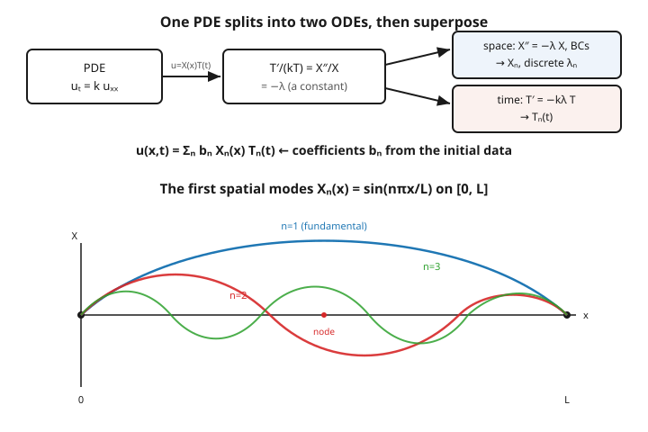

# Partial Differential Equations · Lesson 3.1: Separation of variables on a bounded interval

> ⏱ ~15 min · Module 3: Separation of variables and Fourier series · Builds on: [2.4 Maximum principles and their consequences](02-04-maximum-principles.md) · Unlocks: [3.2 Fourier series: sine, cosine, and full](03-02-fourier-series.md)

## Why this matters

A guitar string clamped at both ends can vibrate in infinitely many shapes, but it prefers a special few: a single hump, a hump-and-a-dip, and so on — the fundamental and its overtones. A heated rod cooling with its ends held at ice temperature relaxes through the same special shapes, each fading at its own rate. These preferred shapes aren't a coincidence of music or thermodynamics; they fall out of one method that turns a partial differential equation into ordinary ones you already know how to solve. That method — **separation of variables** — is the workhorse of the whole subject, and it is where PDEs quietly become a problem in linear algebra: finding the natural modes of a system and adding them up.

## The idea

The heat equation $u_t = k\,u_{xx}$ couples change in time to curvature in space, and that coupling is what makes it hard. Separation makes a bold guess to break the coupling: **look for solutions that are a product of a pure-space part and a pure-time part**,

$$u(x,t) = X(x)\,T(t).$$

Why would that help? Substitute it in. The time derivative only touches $T$, the space derivative only touches $X$:

$$X(x)\,T'(t) = k\,X''(x)\,T(t).$$

Now divide both sides by $k\,X\,T$ to sort each variable onto its own side:

$$\frac{T'(t)}{k\,T(t)} = \frac{X''(x)}{X(x)}.$$

Stare at this. The left side depends **only on $t$**; the right side depends **only on $x$**. If I freeze $x$ and wiggle $t$, the right side can't move — so the left side can't either. The only way a function of $t$ alone can equal a function of $x$ alone for all $x$ and $t$ is if **both equal the same constant**. Call it $-\lambda$ (the minus sign is bookkeeping we'll justify). One PDE has become two independent ODEs, glued together only by the shared number $\lambda$.

The boundary conditions then do something magical: they refuse to let $\lambda$ be anything it likes. Only a discrete list $\lambda_1, \lambda_2, \dots$ survives, each with its own spatial shape $X_n(x)$. Those shapes are the string's harmonics, the rod's cooling modes — and adding them up with the right weights reconstructs any solution.

## The formal version

Separating $u_t = k\,u_{xx}$ with the constant $-\lambda$ gives two ordinary problems:

$$X''(x) = -\lambda\,X(x), \qquad\qquad T'(t) = -k\lambda\,T(t).$$

**In words:** the space part must be a function whose second derivative is a negative multiple of itself (a sine or cosine, if $\lambda>0$); the time part decays or grows exponentially at a rate set by that same $\lambda$.

The spatial equation plus **homogeneous boundary conditions** forms an **eigenvalue problem**. Take a rod on $[0,L]$ with both ends held at zero, $u(0,t)=u(L,t)=0$, forcing $X(0)=X(L)=0$:

$$X'' = -\lambda X, \qquad X(0)=X(L)=0.$$

**In words:** find the numbers $\lambda$ (the **eigenvalues**) for which a nonzero shape $X$ (the **eigenfunction**) both solves the equation and vanishes at both ends. The trivial $X\equiv 0$ always "works" but describes nothing, so we hunt for the rest.

Check the sign of $\lambda$ by trying each case:

- **$\lambda < 0$:** solutions are real exponentials $e^{\pm\sqrt{-\lambda}\,x}$; no nonzero combination can hit zero at *both* ends. Dead.
- **$\lambda = 0$:** $X''=0$ gives a straight line $X=ax+b$; the two conditions force $a=b=0$. Dead.
- **$\lambda > 0$:** $X = A\cos(\sqrt\lambda\,x) + B\sin(\sqrt\lambda\,x)$. Here $X(0)=0$ kills the cosine ($A=0$), and $X(L)=0$ demands $\sin(\sqrt\lambda\,L)=0$, i.e. $\sqrt\lambda\,L = n\pi$. Alive.

So the sign is **forced**, not chosen, and the spectrum is discrete:

$$\lambda_n = \left(\frac{n\pi}{L}\right)^2, \qquad X_n(x) = \sin\!\left(\frac{n\pi x}{L}\right), \qquad n = 1, 2, 3, \dots$$

**In words:** only these specific "curvatures" $\lambda_n$ admit a shape that is pinned at both ends, and each shape is a sine fitting a whole number of half-waves into the rod.

Each eigenvalue drives its own time factor, $T_n(t) = e^{-k\lambda_n t}$. Because the PDE is **linear and homogeneous**, any sum of solutions is again a solution (**superposition**), so the general solution is

$$u(x,t) = \sum_{n=1}^{\infty} b_n\,\sin\!\left(\frac{n\pi x}{L}\right)e^{-k(n\pi/L)^2 t}.$$

**In words:** the full solution is a weighted stack of independent modes; the weights $b_n$ are the one thing separation *doesn't* pin down — they're set by matching the initial shape $u(x,0)$, which is exactly the Fourier-series problem of [3.2](03-02-fourier-series.md).

## Picture

## Worked examples

**Example 1 (heat on a rod — the full assembly).** Solve $u_t = k\,u_{xx}$ on $0 \le x \le L$ with $u(0,t)=u(L,t)=0$.

Guess $u=X(x)T(t)$, substitute, and divide by $kXT$:

$$\frac{T'}{kT} = \frac{X''}{X} = -\lambda.$$

The spatial problem $X''=-\lambda X$, $X(0)=X(L)=0$ is exactly the eigenvalue problem above, giving

$$\lambda_n = \left(\frac{n\pi}{L}\right)^2, \qquad X_n(x)=\sin\!\left(\frac{n\pi x}{L}\right).$$

The temporal problem $T' = -k\lambda_n T$ is first-order linear with constant coefficient — its solution is a pure exponential:

$$T_n(t) = e^{-k(n\pi/L)^2\, t}.$$

Superposing the product modes:

$$\boxed{\;u(x,t) = \sum_{n=1}^\infty b_n\,\sin\!\left(\frac{n\pi x}{L}\right)e^{-k(n\pi/L)^2 t}.\;}$$

Two things to read off. First, the coefficients $b_n$ are fixed by the initial temperature: at $t=0$ the exponentials are all $1$, so $u(x,0)=\sum b_n \sin(n\pi x/L)$ — we must expand the starting profile in sines (Lesson [3.2](03-02-fourier-series.md)). Second, the decay rate is $k(n\pi/L)^2$, which **grows like $n^2$**: mode $2$ dies four times faster than mode $1$, mode $3$ nine times faster. High-frequency wrinkles (sharp bumps, corners) are precisely the large-$n$ modes, so they smooth out almost instantly, and after a moment the rod's profile is dominated by the gentle $n=1$ hump. That instantaneous smoothing is the analytic face of the maximum principle from [2.4](02-04-maximum-principles.md): heat never sharpens, only spreads.

**Example 2 (a vibrating string — same shapes, different time).** The wave equation on a clamped string is $u_{tt} = c^2 u_{xx}$, $u(0,t)=u(L,t)=0$, where $c$ is the wave speed. Separate the same way, $u=X(x)T(t)$:

$$X T'' = c^2 X'' T \;\Longrightarrow\; \frac{T''}{c^2 T} = \frac{X''}{X} = -\lambda.$$

The **spatial** problem is identical to Example 1 — same clamped ends, same answer:

$$\lambda_n = \left(\frac{n\pi}{L}\right)^2, \qquad X_n = \sin\!\left(\frac{n\pi x}{L}\right).$$

The **temporal** problem is different: now it's second order, $T'' = -c^2\lambda_n\,T$, whose solutions **oscillate** instead of decaying:

$$T_n(t) = a_n\cos\!\left(\frac{cn\pi}{L}t\right) + b_n\sin\!\left(\frac{cn\pi}{L}t\right).$$

Each mode is a **standing wave**: a fixed sine shape $\sin(n\pi x/L)$ breathing in and out at frequency $\omega_n = cn\pi/L$. The $n=1$ mode is the **fundamental** (lowest pitch, $\omega_1 = c\pi/L$); the higher $n$ are the **overtones**, at integer multiples $\omega_n = n\,\omega_1$. That the overtones are exact integer multiples is why a plucked string sounds musical — and why halving the length ($L\to L/2$) doubles every frequency, raising the pitch an octave. Heat and wave share the same spatial skeleton; their temporal ODEs (first vs. second order) decide whether the modes fade or sing.

## Watch out

- **You might think** you can separate any PDE on any region. **Actually** the method needs *homogeneous, separable* boundary conditions and a *separable geometry*. Ends held at zero (homogeneous) work; ends held at $10^\circ$ don't until you subtract off a steady state to make them zero. A rectangle or interval works; an arbitrary blob doesn't, because you can't describe its boundary by "$x = $ const" and "$y=$ const." (Circles and spheres do separate — in polar coordinates, Lesson [6.3](06-03-separation-polar-spherical.md).)
- **You might think** the sign of the separation constant is a free choice. **Actually** the boundary conditions force it: with Dirichlet ends, only $\lambda>0$ yields a nonzero shape vanishing at both ends, so the spectrum is a discrete list of positive numbers. Choosing the wrong sign gives only the trivial $X\equiv 0$ — the equations tell you when you've guessed wrong.
- **You might think** the modes interact as the system evolves. **Actually** each mode marches independently — its own eigenvalue, its own time factor — and superposition just adds them. Heat: every mode decays, faster for higher $n$. Wave: every mode oscillates, at its own frequency. The coupling you saw in the original PDE was an illusion of the wrong coordinates; in the mode basis the system is diagonal.

## One-liner

> Guess $u=X(x)T(t)$, and the PDE splits into a spatial eigenvalue problem whose boundary conditions quantize $\lambda$ into discrete modes, plus a time ODE that decays (heat) or oscillates (wave) — superpose the modes and match the initial data.

## Problems

**P1 (🟢)** For the eigenvalue problem $X'' = -\lambda X$ on $[0,\pi]$ with $X(0)=X(\pi)=0$, write down the eigenvalues $\lambda_n$ and eigenfunctions $X_n$. Then, for the heat equation $u_t = u_{xx}$ (so $k=1$) on this interval, state the time factor $T_n(t)$ for each mode and say which mode governs the long-time behavior.

**P2 (🟡)** Redo the separation for **insulated** (Neumann) ends: $u_x(0,t) = u_x(L,t) = 0$, i.e. $X'(0)=X'(L)=0$. Find all eigenvalues and eigenfunctions. (Hint: this time check $\lambda = 0$ carefully — it survives. And $X(0)=0$ is *not* the condition anymore.)

**P3 (🔴, optional)** A string of length $L$ with wave speed $c$ is released from rest with initial shape $u(x,0) = 3\sin(\pi x/L) - \sin(3\pi x/L)$ and zero initial velocity $u_t(x,0)=0$. Using the standing-wave solution of Example 2, find $u(x,t)$ explicitly. (No integrals needed — the initial shape is *already* a sum of eigenfunctions.)

Solutions

**P1** With $L=\pi$, the condition $\sqrt\lambda\,\pi = n\pi$ gives $\sqrt\lambda = n$, so

$$\lambda_n = n^2, \qquad X_n(x) = \sin(nx), \qquad n=1,2,3,\dots$$

The time factor solves $T'=-\lambda_n T$ with $k=1$: $T_n(t) = e^{-n^2 t}$. Each mode decays at rate $n^2$, so higher modes vanish fastest. As $t\to\infty$ the slowest-decaying survivor, $n=1$ ($e^{-t}\sin x$), dominates — the temperature relaxes to the shape of the fundamental before collapsing to zero.

**P2** Solve $X''=-\lambda X$ with $X'(0)=X'(L)=0$. Case-check the sign as before:

- $\lambda<0$: exponentials, whose derivative can't vanish at both ends nontrivially. Dead.
- $\lambda=0$: $X''=0 \Rightarrow X = ax+b$, so $X' = a$. Both conditions say $a=0$; $b$ is free. **A nonzero constant $X_0 = 1$ survives** — this is the $\lambda_0=0$ mode, absent in the Dirichlet case.
- $\lambda>0$: $X = A\cos(\sqrt\lambda x) + B\sin(\sqrt\lambda x)$, so $X' = -A\sqrt\lambda\sin(\sqrt\lambda x) + B\sqrt\lambda\cos(\sqrt\lambda x)$. Then $X'(0)=0$ gives $B\sqrt\lambda = 0 \Rightarrow B=0$. And $X'(L)=0$ gives $-A\sqrt\lambda\sin(\sqrt\lambda L)=0 \Rightarrow \sin(\sqrt\lambda L)=0 \Rightarrow \sqrt\lambda L = n\pi$.

So

$$\lambda_n = \left(\frac{n\pi}{L}\right)^2, \qquad X_n(x) = \cos\!\left(\frac{n\pi x}{L}\right), \qquad n = 0, 1, 2, \dots$$

Insulated ends give **cosines** (including the constant $n=0$ mode) instead of sines. Physically the $n=0$ mode is the average temperature: with no heat escaping the ends, the rod equilibrates to its mean rather than to zero. (This is the cosine series of [3.2](03-02-fourier-series.md).)

**P3** The general standing-wave solution is $u=\sum_n \sin(n\pi x/L)\big[a_n\cos(cn\pi t/L) + b_n\sin(cn\pi t/L)\big]$. Two conditions fix the coefficients.

*Zero initial velocity:* $u_t(x,0)=\sum_n \sin(n\pi x/L)\,\big[b_n \cdot cn\pi/L\big] = 0$ for all $x$, which forces every $b_n=0$. So only cosines-in-time remain: $u=\sum_n a_n\sin(n\pi x/L)\cos(cn\pi t/L)$.

*Initial shape:* at $t=0$, $u(x,0)=\sum_n a_n\sin(n\pi x/L) = 3\sin(\pi x/L) - \sin(3\pi x/L)$. Matching mode by mode: $a_1 = 3$, $a_3 = -1$, all others zero. Therefore

$$u(x,t) = 3\sin\!\left(\frac{\pi x}{L}\right)\cos\!\left(\frac{c\pi t}{L}\right) - \sin\!\left(\frac{3\pi x}{L}\right)\cos\!\left(\frac{3c\pi t}{L}\right).$$

Two harmonics, each frozen in its spatial shape and oscillating at its own frequency ($\omega_1 = c\pi/L$ and $\omega_3 = 3\omega_1$) — the fundamental and its second overtone, ringing together.

## Flashback

**From Lesson 2.2 (The wave equation and d'Alembert):** A wave on the infinite line obeys $u_{tt} = c^2 u_{xx}$ with initial shape $u(x,0)=f(x)$ and zero initial velocity $u_t(x,0)=0$. State d'Alembert's solution for this case, and describe in one sentence what happens to the initial bump as time runs forward.

Solution

d'Alembert's formula is $u(x,t) = \tfrac12\big[f(x-ct) + f(x+ct)\big] + \tfrac{1}{2c}\int_{x-ct}^{x+ct} g(s)\,ds$, with $g = u_t(\cdot,0)$. Here $g\equiv 0$, so the integral drops and

$$u(x,t) = \tfrac12\,f(x-ct) + \tfrac12\,f(x+ct).$$

The initial bump splits into two half-height copies of itself, one traveling right at speed $c$ and one traveling left at speed $c$. (On the *bounded* interval of this lesson, those traveling copies reflect off the clamped ends and interfere — and their steady interference pattern is exactly the standing-wave modes we just built. Same equation, two complementary pictures: traveling waves on the line, standing waves in a box.)

## Connections

- **Backward:** the equations being separated are the heat equation from [2.1](02-01-heat-diffusion-equations.md) and the wave equation from [2.2](02-02-wave-equation-dalembert.md); the $n^2$ decay ordering is the maximum-principle smoothing of [2.4](02-04-maximum-principles.md) made quantitative.
- **Forward:** separation stops at "the $b_n$ come from the initial data" — [3.2](03-02-fourier-series.md) computes those coefficients (Fourier series), [3.3](03-03-convergence-fourier-series.md) asks whether the sum converges, and [3.4](03-04-sturm-liouville-theory.md) explains *why* eigenfunctions always form a usable basis (Sturm–Liouville theory), generalizing today's sines and cosines.
- **Sideways (quantum mechanics):** separating the time-dependent Schrödinger equation $i\hbar\,\psi_t = \hat H\psi$ into $\psi = \phi(x)\,T(t)$ produces the *stationary states* $\hat H\phi = E\phi$ — the identical move, with the separation constant now the **energy $E$**. A particle in a box on $[0,L]$ gives exactly today's $\sin(n\pi x/L)$, and the quantized energies are the eigenvalues. See [quantum-mechanics](../../quantum-mechanics/syllabus.md).
- **Sideways (linear algebra):** $X''=-\lambda X$ with boundary conditions is an eigenvalue problem $\mathcal L X = \lambda X$ for the operator $\mathcal L = -\,d^2/dx^2$; the eigenfunctions play the role of an orthogonal basis, and "match the initial data" means "expand a vector in that basis." Revisit the eigenvalue/eigenvector machinery in [linalg-refresher](../../linalg-refresher/syllabus.md).
- **Sideways (music):** the overtones of Example 2 at integer multiples $\omega_n = n\omega_1$ are why a bowed or plucked string has a definite, musical pitch — the eigenvalues of a clamped interval *are* the harmonic series.
- Full course map: [syllabus](../syllabus.md).
