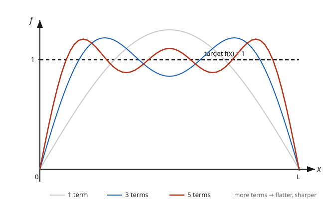

# Partial Differential Equations · Lesson 3.2: Fourier series — sine, cosine, and full

> ⏱ ~15 min · Module 3: Separation of variables and Fourier series · Builds on: [3.1 Separation of variables on a bounded interval](03-01-separation-of-variables.md) · Unlocks: [3.3 Convergence and the behavior of Fourier series](03-03-convergence-fourier-series.md)

## Why this matters

Separation of variables in [3.1](03-01-separation-of-variables.md) handed you an infinite menu of standing-wave solutions — one for each mode $\sin(n\pi x/L)$ — and then stalled. The heat equation is linear, so any sum of these modes is still a solution; the physics is decided the moment you ask *which* combination matches the initial temperature you actually poured in. That question is: **can I write my starting function as a sum of sines?** Fourier's astonishing answer is yes — essentially any function on an interval is a superposition of the very eigenfunctions separation produced. This lesson is the machine that reads off *how much* of each mode is present. Get it and the separated solution snaps shut into a finished formula.

## The idea

Think of the sine modes $\sin(\pi x/L), \sin(2\pi x/L), \sin(3\pi x/L), \dots$ as **directions in an infinite-dimensional space of functions**, and a target function $f$ as a vector in that space. You already know how to find how much of a vector points along a direction: you project. In ordinary $\mathbb{R}^3$, the amount of $\mathbf{v}$ along a unit axis $\mathbf{e}$ is the dot product $\mathbf{v}\cdot\mathbf{e}$. For functions, the "dot product" is an integral, $\langle f,g\rangle = \int f(x)g(x)\,dx$, and the miracle that makes the whole scheme work is that **the sine modes are mutually perpendicular under it**: the integral of any two *different* sines over the interval is exactly zero.

That orthogonality is the entire engine. It means the modes don't interfere when you measure them: to extract the coefficient of the $n$-th sine, you take the inner product of $f$ against $\sin(n\pi x/L)$, and every *other* mode contributes nothing. So each coefficient is computed independently — one clean integral, no solving of a giant coupled system. It's the same reason you can read off a vector's $z$-component without worrying about $x$ and $y$: perpendicular directions don't leak into each other.

## The formal version

Work on $[0,L]$ with the sine modes $\varphi_n(x) = \sin\!\big(\tfrac{n\pi x}{L}\big)$. The key orthogonality relation is

$$\int_0^L \sin\!\Big(\tfrac{n\pi x}{L}\Big)\sin\!\Big(\tfrac{m\pi x}{L}\Big)\,dx = \begin{cases} 0, & n \neq m,\\[2pt] \tfrac{L}{2}, & n = m. \end{cases}$$

**In words:** distinct sine modes are perpendicular; each has "squared length" $L/2$. Here $n,m$ are positive integers labelling the modes and $L$ is the interval length.

**Fourier sine series.** If $f(x) = \sum_{n=1}^\infty b_n \sin\!\big(\tfrac{n\pi x}{L}\big)$, multiply both sides by $\sin(m\pi x/L)$, integrate over $[0,L]$, and kill every term but $n=m$:

$$b_n = \frac{\langle f,\varphi_n\rangle}{\langle \varphi_n,\varphi_n\rangle} = \frac{2}{L}\int_0^L f(x)\,\sin\!\Big(\tfrac{n\pi x}{L}\Big)\,dx.$$

**In words:** the coefficient $b_n$ is the projection of $f$ onto mode $n$, normalized by that mode's squared length — a component, exactly like a coordinate. The factor $2/L$ is just $1/(L/2)$.

**Fourier cosine series.** With the cosine modes $\cos(n\pi x/L)$ (which satisfy the same orthogonality, plus a constant mode $n=0$):

$$f(x) = \frac{a_0}{2} + \sum_{n=1}^\infty a_n \cos\!\Big(\tfrac{n\pi x}{L}\Big), \qquad a_n = \frac{2}{L}\int_0^L f(x)\cos\!\Big(\tfrac{n\pi x}{L}\Big)\,dx.$$

**In words:** same projection idea with cosines; the standalone $a_0/2$ is the average value of $f$ (the "DC level"), the amount of the flat mode.

**Full Fourier series.** On $[-L,L]$, using *both* families,

$$f(x) = \frac{a_0}{2} + \sum_{n=1}^\infty\!\Big[a_n\cos\!\Big(\tfrac{n\pi x}{L}\Big) + b_n\sin\!\Big(\tfrac{n\pi x}{L}\Big)\Big], \qquad a_n,b_n = \frac{1}{L}\int_{-L}^{L} f(x)\,\{\cos,\sin\}\Big(\tfrac{n\pi x}{L}\Big)\,dx.$$

**In words:** the general expansion for a periodic function uses sines and cosines together; sine-only and cosine-only are the special cases forced by the boundary conditions, as the next section explains.

**Which series?** It is *not* a free choice — the boundary conditions from [3.1](03-01-separation-of-variables.md) select the eigenfunctions:

- Dirichlet ($u=0$ at both ends) → sine modes → **sine series** (equivalent to extending $f$ *oddly* past $0$).
- Neumann ($u_x=0$ at both ends) → cosine modes → **cosine series** (equivalent to extending $f$ *evenly*).
- Periodic → both → **full series**.

## Picture

The sine series of the constant $f(x)=1$ on $[0,L]$, drawn with its first 1, 3, and 5 nonzero terms. Each partial sum is a superposition of sines fighting to reproduce a flat line: more terms means flatter in the middle and steeper at the ends, homing in on the target.

## Worked examples

**Example 1 (mechanical — the sine series of $f(x)=1$).** Project the constant onto each sine mode:

$$b_n = \frac{2}{L}\int_0^L 1\cdot\sin\!\Big(\tfrac{n\pi x}{L}\Big)\,dx = \frac{2}{L}\left[-\frac{L}{n\pi}\cos\!\Big(\tfrac{n\pi x}{L}\Big)\right]_0^L = \frac{2}{n\pi}\big(1 - \cos n\pi\big).$$

Since $\cos n\pi = (-1)^n$, the bracket is $0$ for even $n$ and $2$ for odd $n$. So

$$b_n = \begin{cases} \dfrac{4}{n\pi}, & n\text{ odd},\\[4pt] 0, & n\text{ even},\end{cases} \qquad 1 = \frac{4}{\pi}\left[\sin\tfrac{\pi x}{L} + \tfrac{1}{3}\sin\tfrac{3\pi x}{L} + \tfrac{1}{5}\sin\tfrac{5\pi x}{L} + \cdots\right] \ \ (0<x<L).$$

Only odd modes survive — the odd periodic extension of a constant is a square wave, and a square wave is built from odd harmonics. Notice the series equals $1$ *inside* the interval but $0$ at $x=0$ and $x=L$ (every sine vanishes there): it converges to the *average* of the two sides of the jump. That's a preview of [3.3](03-03-convergence-fourier-series.md).

**Example 2 (why you'd care — finishing a heat problem from 3.1).** A rod of length $L$ with ends held at $0$ obeys $u_t = \kappa u_{xx}$, and [3.1](03-01-separation-of-variables.md) gave the separated solution

$$u(x,t) = \sum_{n=1}^\infty b_n \sin\!\Big(\tfrac{n\pi x}{L}\Big)\,e^{-\kappa (n\pi/L)^2 t},$$

with the $b_n$ still undetermined. Suppose the initial temperature is uniform, $u(x,0)=1$ (say the rod starts at one degree throughout, then its ends are clamped to zero). Setting $t=0$ demands $\sum b_n\sin(n\pi x/L) = 1$ — precisely the expansion from Example 1. So $b_n = 4/(n\pi)$ for odd $n$, zero otherwise, and the *complete* solution is

$$u(x,t) = \frac{4}{\pi}\sum_{k=0}^\infty \frac{1}{2k+1}\,\sin\!\Big(\tfrac{(2k+1)\pi x}{L}\Big)\,e^{-\kappa\left(\frac{(2k+1)\pi}{L}\right)^2 t}.$$

Read it physically: each mode decays at its own rate, and high modes ($n$ large) die fastest because the exponent scales like $n^2$. Within moments only the $n=1$ term survives and the rod relaxes to a smooth half-sine bump sliding down to zero. Fourier's coefficients were the missing bridge between "a family of solutions" and "*the* solution to *this* initial condition."

## Watch out

- **You might think you get to pick sine vs. cosine vs. full.** Actually the boundary conditions pick for you: they decide which eigenfunctions separation of variables produced, and *those* are the only ones your series may use. Dirichlet ⇒ sines, Neumann ⇒ cosines, periodic ⇒ both. Using the wrong family builds a solution that can't satisfy the BCs.
- **You might think the coefficient formula is a magic recipe to memorize.** It's just a projection: $b_n = \langle f,\varphi_n\rangle/\langle\varphi_n,\varphi_n\rangle$. Orthogonality is what decouples the modes so each coefficient is an independent integral — no orthogonality, no clean formula. Remember the mechanism, not the constants.
- **You might think the series equals $f$ everywhere, exactly.** A sine series silently builds the *odd* periodic extension of $f$; a cosine series builds the *even* one. Watch the endpoints: at a jump (like the ends of Example 1) the series converges to the midpoint of the jump, not to $f$ itself. How badly it misbehaves near jumps — the Gibbs overshoot — is [3.3](03-03-convergence-fourier-series.md)'s whole subject.

## One-liner

> A Fourier series is orthogonal projection of a function onto the eigenmodes: each coefficient is one inner-product integral, and the boundary conditions — not you — decide whether those modes are sines, cosines, or both.

## Problems

**P1 (🟢)** Find the Fourier sine series of $f(x)=x$ on $[0,L]$. (You'll need integration by parts; watch the $\cos n\pi$ term.)

**P2 (🟡)** Find the Fourier cosine series of $f(x)=x$ on $[0,L]$ — including the constant term $a_0/2$. Explain in one sentence why the constant term equals $L/2$ without computing an integral.

**P3 (🔴, optional)** A rod of length $L$ has insulated ends ($u_x(0,t)=u_x(L,t)=0$) and initial temperature $u(x,0)=x$. Separation of variables gives $u(x,t)=\tfrac{a_0}{2}+\sum_{n\ge1} a_n\cos(n\pi x/L)\,e^{-\kappa(n\pi/L)^2 t}$. Use P2 to write the full solution, and state the temperature as $t\to\infty$ — then explain physically why that limit is what it is.

Solutions

**P1** Project onto $\sin(n\pi x/L)$, by parts with $u=x,\ dv=\sin(n\pi x/L)\,dx$ (so $v=-\tfrac{L}{n\pi}\cos(n\pi x/L)$):

$$b_n = \frac{2}{L}\int_0^L x\sin\!\Big(\tfrac{n\pi x}{L}\Big)dx = \frac{2}{L}\left(\left[-\frac{Lx}{n\pi}\cos\tfrac{n\pi x}{L}\right]_0^L + \frac{L}{n\pi}\int_0^L\cos\tfrac{n\pi x}{L}\,dx\right).$$

The boundary term is $-\tfrac{L^2}{n\pi}\cos n\pi = -\tfrac{L^2}{n\pi}(-1)^n$; the remaining integral $\int_0^L\cos(n\pi x/L)\,dx = \tfrac{L}{n\pi}[\sin]_0^L = 0$. So

$$b_n = \frac{2}{L}\cdot\left(-\frac{L^2}{n\pi}(-1)^n\right) = -\frac{2L}{n\pi}(-1)^n = \frac{2L}{n\pi}(-1)^{n+1}, \qquad x = \frac{2L}{\pi}\sum_{n=1}^\infty \frac{(-1)^{n+1}}{n}\sin\tfrac{n\pi x}{L}.$$

(Signs alternate, magnitudes decay like $1/n$ — the slow decay typical of a function whose odd extension jumps at $x=L$.)

**P2** The constant term is the average of $f$ over $[0,L]$: $\tfrac{a_0}{2} = \tfrac{1}{L}\int_0^L x\,dx = \tfrac{1}{L}\cdot\tfrac{L^2}{2} = \tfrac{L}{2}$ — the mean value of a straight ramp from $0$ to $L$ is its midpoint $L/2$, no integral needed to *believe* it. For $n\ge1$, by parts with $u=x,\ dv=\cos(n\pi x/L)\,dx$ (so $v=\tfrac{L}{n\pi}\sin(n\pi x/L)$):

$$a_n = \frac{2}{L}\int_0^L x\cos\tfrac{n\pi x}{L}\,dx = \frac{2}{L}\left(\left[\frac{Lx}{n\pi}\sin\tfrac{n\pi x}{L}\right]_0^L - \frac{L}{n\pi}\int_0^L \sin\tfrac{n\pi x}{L}\,dx\right).$$

The boundary term vanishes ($\sin n\pi=0$). The integral: $\int_0^L\sin(n\pi x/L)\,dx = \tfrac{L}{n\pi}(1-\cos n\pi) = \tfrac{L}{n\pi}(1-(-1)^n)$. Hence

$$a_n = \frac{2}{L}\cdot\left(-\frac{L}{n\pi}\cdot\frac{L}{n\pi}(1-(-1)^n)\right) = -\frac{2L}{n^2\pi^2}\big(1-(-1)^n\big) = \begin{cases}-\dfrac{4L}{n^2\pi^2}, & n\text{ odd},\\[3pt]0,&n\text{ even}.\end{cases}$$

So $\displaystyle x = \frac{L}{2} - \frac{4L}{\pi^2}\sum_{k=0}^\infty \frac{1}{(2k+1)^2}\cos\tfrac{(2k+1)\pi x}{L}$. (Coefficients decay like $1/n^2$ — faster than P1, because the *even* extension of $x$ is continuous, only its slope jumps.)

**P3** The insulated (Neumann) BCs select cosine modes, so the initial condition $u(x,0)=x$ must be its cosine series — exactly P2. Matching coefficients gives $\tfrac{a_0}{2}=\tfrac{L}{2}$ and $a_n = -\tfrac{4L}{n^2\pi^2}$ for odd $n$, zero for even. Thus

$$u(x,t) = \frac{L}{2} - \frac{4L}{\pi^2}\sum_{k=0}^\infty \frac{1}{(2k+1)^2}\cos\!\Big(\tfrac{(2k+1)\pi x}{L}\Big)\,e^{-\kappa\left(\frac{(2k+1)\pi}{L}\right)^2 t}.$$

As $t\to\infty$ every exponential kills its mode ($n\ge1$), leaving $u\to L/2$: the rod settles to the *uniform* temperature $L/2$. Physically, insulated ends trap all the heat, so total energy is conserved; with nowhere to escape, the heat merely redistributes until the temperature is flat, and it flattens to the average of the initial profile — the average of $x$ on $[0,L]$ is $L/2$. (Contrast Example 2's clamped ends, which bleed heat out and relax to $0$.)

## Flashback

**From Lesson 3.1 (Separation of variables):** Solve $u_t = \kappa u_{xx}$ on $0\le x\le L$ with **mixed** boundary conditions $u(0,t)=0$ and $u_x(L,t)=0$ (left end clamped cold, right end insulated). Separate variables and find the allowed eigenvalues and eigenfunctions — do the BCs give the plain $\sin(n\pi x/L)$, or something shifted?

Solution

Write $u(x,t)=X(x)T(t)$. Substituting and dividing by $\kappa XT$ gives $\tfrac{T'}{\kappa T} = \tfrac{X''}{X} = -\lambda$ (constant, since the two sides depend on different variables). The space problem is $X'' + \lambda X = 0$ with $X(0)=0$ (from $u(0,t)=0$) and $X'(L)=0$ (from $u_x(L,t)=0$).

For $\lambda=\mu^2>0$: $X=A\cos\mu x + B\sin\mu x$. The condition $X(0)=0$ forces $A=0$, so $X=B\sin\mu x$. Then $X'(L)=B\mu\cos\mu L = 0$ requires $\cos\mu L = 0$, i.e. $\mu L = \tfrac{(2n-1)\pi}{2}$ for $n=1,2,\dots$. So

$$\mu_n = \frac{(2n-1)\pi}{2L}, \qquad X_n(x) = \sin\!\Big(\frac{(2n-1)\pi x}{2L}\Big), \qquad \lambda_n = \left(\frac{(2n-1)\pi}{2L}\right)^2.$$

These are **quarter-wave** sines, not the half-wave $\sin(n\pi x/L)$ — each fits a zero at the cold left end and a flat crest at the insulated right end. (The check $\lambda\le0$ yields only the trivial solution, as in 3.1.) The time factor is $T_n(t)=e^{-\kappa\lambda_n t}$, and the general solution is $u(x,t)=\sum_{n\ge1} b_n \sin\!\big(\tfrac{(2n-1)\pi x}{2L}\big)e^{-\kappa\lambda_n t}$ — whose $b_n$ you'd now find by projecting the initial data onto these (still orthogonal) modes, exactly the machine of this lesson.

## Connections

- **Backward:** the modes you expand in are precisely the eigenfunctions [3.1](03-01-separation-of-variables.md) manufactured; the coefficient integral is what turns that infinite family into the unique solution for a given initial condition. Orthogonality is the same "perpendicular directions don't interfere" fact that makes an orthonormal basis and projection work in [linalg-refresher](../../linalg-refresher/syllabus.md) — a Fourier series *is* a coordinate expansion in an infinite-dimensional inner-product space.
- **Forward:** [3.3](03-03-convergence-fourier-series.md) asks when these series actually converge and how they behave at jumps (Gibbs); [3.4](03-04-sturm-liouville-theory.md) shows the orthogonality here is a special case of Sturm–Liouville theory, which guarantees an orthogonal eigenbasis for a whole class of boundary-value problems; [4.1](04-01-fourier-transform.md) is the $L\to\infty$ limit, where the discrete modes merge into a continuum and the sum becomes the Fourier transform.
- **Sideways (quantum mechanics):** expanding a quantum state in energy eigenfunctions, $\psi = \sum_n c_n\phi_n$ with $c_n = \langle\phi_n,\psi\rangle$, is this exact projection — the $|c_n|^2$ are measurement probabilities. See [quantum-mechanics](../../quantum-mechanics/syllabus.md): a particle in a box has literally the sine modes of this lesson as its energy states.
