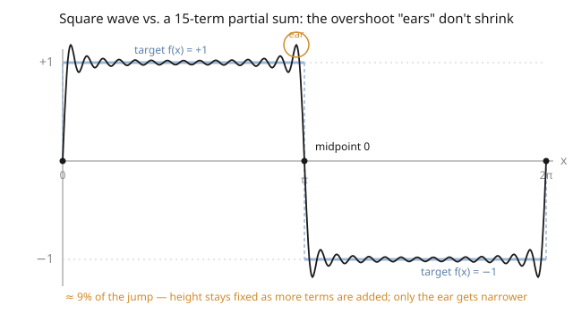

# Partial Differential Equations · Lesson 3.3: Convergence and the behavior of Fourier series

> ⏱ ~15 min · Module 3: Separation of variables and Fourier series · Builds on: [3.2 Fourier series: sine, cosine, and full](03-02-fourier-series.md) · Unlocks: [3.4 Sturm–Liouville theory](03-04-sturm-liouville-theory.md)

## Why this matters

Separation of variables turned a PDE into an infinite sum of modes, and [3.2](03-02-fourier-series.md) handed you formulas for the coefficients. But writing "$=$" between a function and an infinite series is a promise, and promises can be broken. Does the sum actually *equal* the function? At a corner? At a jump? Can you differentiate it term by term to check it solves the equation? The honest answer is: **it depends on what you mean by "equal"** — and there are three useful meanings, each with its own theorem. Getting these straight is the difference between a formula that works and one that quietly lies to you at exactly the point you care about (the boundary, the shock, the switch-on).

## The idea

Think of the partial sum $S_N$ — the first $N$ terms — as an approximation you improve by adding terms. There are three ways to ask "is it getting close to $f$?"

- **Pointwise:** pick a single point $x$; does $S_N(x)$ approach $f(x)$ as $N\to\infty$? This can succeed at most points but do something strange at special ones.
- **Uniform:** does $S_N$ approach $f$ *everywhere at once*, with the worst-case error shrinking to zero? This is the strong, well-behaved kind — the graph of $S_N$ hugs the graph of $f$ with no stray spikes.
- **Mean-square (L²):** does the *total squared error*, integrated over the interval, shrink to zero? This ignores what happens at any single point and asks only about the bulk. It is the most forgiving, and it *always* works for reasonable $f$.

The governing intuition: **smoothness of $f$ buys you stronger convergence, and it shows up in how fast the coefficients decay.** A smooth $f$ has coefficients that die like $1/n^p$ for large $p$; a function with a jump has coefficients that crawl down like $1/n$, and near that jump the partial sums misbehave in a famous way — the **Gibbs phenomenon** — overshooting the jump by about 9% no matter how many terms you take.

## The formal version

Throughout, $f$ has period $2L$ and Fourier series $f(x)\sim \frac{a_0}{2}+\sum_{n\ge 1}\big(a_n\cos\frac{n\pi x}{L}+b_n\sin\frac{n\pi x}{L}\big)$, with partial sum $S_N$ (the terms up to $n=N$). Call $f$ **piecewise smooth** if it and its derivative are continuous except at finitely many jumps, and $f(x^+),f(x^-)$ (the one-sided limits) exist everywhere.

**1. Pointwise — Dirichlet's theorem.** If $f$ is piecewise smooth, then for every $x$,
$$S_N(x)\;\longrightarrow\;\tfrac{1}{2}\big[f(x^+)+f(x^-)\big].$$
*In words:* at a point of continuity the series converges to $f(x)$ (the two one-sided values agree); at a jump it converges to the **midpoint** of the jump — splitting the difference, regardless of the actual value $f$ takes there.

**2. Uniform convergence.** If $f$ is continuous, piecewise-$C^1$, *and* satisfies the matching endpoint condition $f(-L)=f(L)$, then $S_N\to f$ uniformly: $\max_x|f(x)-S_N(x)|\to 0$.
*In words:* no jumps and no endpoint mismatch means the whole graph is squeezed to $f$ with a uniformly small error — and only then are you licensed to differentiate or integrate term by term freely.

**3. Mean-square — Parseval's identity.** If $f$ is square-integrable ($\int_{-L}^{L} f^2\,dx<\infty$), then $S_N\to f$ *in the mean* ($\int_{-L}^{L}|f-S_N|^2\,dx\to 0$) and
$$\frac{1}{L}\int_{-L}^{L} f(x)^2\,dx \;=\; \frac{a_0^2}{2}+\sum_{n=1}^{\infty}\big(a_n^2+b_n^2\big).$$
*In words:* the total "energy" of $f$ equals the sum of the energies of its modes — nothing is lost in the decomposition. This holds for *any* reasonable $f$, jumps and all, and it is the identity that powers exact numerical sums.

**Decay ↔ smoothness.** If $f$ has $p-1$ continuous derivatives and a piecewise-continuous $p$-th derivative, its coefficients decay like $|a_n|,|b_n|=O(1/n^{p})$. A jump ($p$ effectively $1$) gives $1/n$; a continuous function with a corner gives $1/n^2$; infinitely smooth gives faster-than-any-power decay.

## Picture

The gray step is the target square wave; the dark curve is a 15-term partial sum. Away from the jumps it tracks $\pm1$ well. At each jump it passes cleanly through the **midpoint** ($0$, the black dots) — Dirichlet in action — but just before and after, it flings up "ears" that overshoot by about 9% of the jump. Add more terms and the ears slide *closer* to the jump and get *narrower*, but their height does not shrink. That stubborn overshoot is the Gibbs phenomenon.

## Worked examples

**Example 1 (the square wave — midpoint and Gibbs).** Let $f$ have period $2\pi$ with $f(x)=+1$ on $(0,\pi)$ and $f(x)=-1$ on $(-\pi,0)$. It is odd, so it is a pure sine series with
$$b_n=\frac{2}{\pi}\int_0^{\pi}\sin(nx)\,dx=\frac{2}{\pi}\cdot\frac{1-\cos n\pi}{n}=\frac{2}{n\pi}\big(1-(-1)^n\big).$$
For even $n$ this is $0$; for odd $n$ it is $4/(n\pi)$. Hence
$$f(x)=\frac{4}{\pi}\left(\sin x+\frac{\sin 3x}{3}+\frac{\sin 5x}{5}+\cdots\right)=\frac{4}{\pi}\sum_{k=1}^{\infty}\frac{\sin\big((2k-1)x\big)}{2k-1}.$$
The coefficients decay like $1/n$ — the signature of a jump. **Evaluate at the jump $x=0$:** every $\sin(n\cdot 0)=0$, so the series gives $0$. That is exactly $\tfrac12[f(0^+)+f(0^-)]=\tfrac12[(+1)+(-1)]=0$, the **midpoint**, not either one-sided value $\pm1$. Near $x=0$ the partial sums overshoot to about $1.18$ (a $\sim9\%$ overshoot of the jump of height $2$) — the ears in the picture — and that height persists for every $N$.

**Example 2 (Parseval sums a series).** Feed the square wave into Parseval. Here $L=\pi$, all $a_n=0$, and $f(x)^2=1$ everywhere, so the left side is
$$\frac{1}{\pi}\int_{-\pi}^{\pi} 1\,dx=\frac{1}{\pi}\cdot 2\pi=2.$$
The right side is $\sum b_n^2=\sum_{n\text{ odd}}\big(\tfrac{4}{n\pi}\big)^2=\dfrac{16}{\pi^2}\displaystyle\sum_{k=1}^{\infty}\frac{1}{(2k-1)^2}.$ Setting them equal:
$$2=\frac{16}{\pi^2}\sum_{k=1}^{\infty}\frac{1}{(2k-1)^2}\quad\Longrightarrow\quad \sum_{k=1}^{\infty}\frac{1}{(2k-1)^2}=\frac{2\pi^2}{16}=\frac{\pi^2}{8}.$$
That is the sum over *odd* squares. To get the full $\sum 1/n^2$, split into odd and even: $\sum_{n\ge1}\frac1{n^2}=\sum_{\text{odd}}\frac1{n^2}+\sum_{\text{even}}\frac1{n^2}=\frac{\pi^2}{8}+\frac14\sum_{n\ge1}\frac1{n^2}$, since $\sum_{\text{even}}\frac1{(2m)^2}=\frac14\sum\frac1{m^2}$. Solving, $\tfrac34\sum\frac1{n^2}=\frac{\pi^2}{8}$, so
$$\sum_{n=1}^{\infty}\frac{1}{n^2}=\frac{\pi^2}{6}.$$
A convergence theorem about heat and waves just evaluated a pure number-theory sum — that is the reach of Parseval.

## Watch out

- **The jump gives the midpoint, not "the value there."** You might think $S_N(x)$ chases whatever $f$ was defined to be at the jump. It doesn't — it converges to $\tfrac12[f(x^+)+f(x^-)]$, insensitive to $f$'s actual value at that isolated point. Defining $f(0)=1$ changes nothing.
- **Gibbs never goes away.** You might think enough terms will iron out the overshoot. The $\sim9\%$ *height* is a fixed constant of the jump; adding terms only shrinks the *width* of the ears and moves them toward the jump. This is why sharp edges "ring" in audio and image compression.
- **You cannot always differentiate term by term.** Integrating a Fourier series is safe (integration smooths, coefficients gain a factor $1/n$). But differentiating multiplies each coefficient by $n$ — for the square wave, differentiating $\sum \frac{\sin(2k-1)x}{2k-1}$ term by term gives $\sum\cos(2k-1)x$, whose terms don't even go to zero: it **diverges**. Term-by-term differentiation is licensed only when the *differentiated* series converges (uniformly) — i.e. when $f$ is smooth enough.
- **L² convergence is weaker than pointwise.** Mean-square convergence controls the *integrated* error, so it can hold while the series misbehaves at individual points. "Converges in the mean" does not promise "converges at $x$."

## One-liner

> A Fourier series lands on $f$ at smooth points and on the *midpoint* at a jump; it always converges in energy (Parseval), it converges uniformly only when $f$ is continuous with matching ends, and near a jump it forever overshoots by 9% — coefficient decay $\sim 1/n^p$ just reads off how smooth $f$ is.

## Problems

**P1 (🟢)** The function $f$ has period $2\pi$ with $f(x)=x$ on $(-\pi,\pi)$ (the sawtooth). Its Fourier series is $\displaystyle f(x)=2\sum_{n=1}^{\infty}\frac{(-1)^{n+1}}{n}\sin(nx)$. (a) What value does the series converge to at $x=\pi$? (b) What does it converge to at $x=\pi/2$?

**P2 (🟡)** Apply Parseval's identity to the sawtooth of P1 to evaluate $\displaystyle\sum_{n=1}^{\infty}\frac{1}{n^2}$, and confirm you get $\pi^2/6$.

**P3 (🔴, optional)** A function $g$ on $(-\pi,\pi)$ is continuous with a corner (a jump in $g'$) but no jump in $g$ itself, and $g(-\pi)=g(\pi)$. (a) Which of the three convergence modes are guaranteed? (b) What decay rate $1/n^p$ do you expect for its coefficients, and why? (c) Is term-by-term differentiation guaranteed to give a convergent series?

Solutions

**P1** (a) At $x=\pi$ the sawtooth has a jump: $f(\pi^-)=\pi$ and, by periodicity, $f(\pi^+)=f(-\pi^+)=-\pi$. Dirichlet gives the midpoint $\tfrac12[\pi+(-\pi)]=\mathbf{0}$. (Check the series: $\sin(n\pi)=0$ for all $n$, so the sum is indeed $0$.) (b) At $x=\pi/2$, $f$ is continuous, so the series converges to $f(\pi/2)=\boldsymbol{\pi/2}$.

**P2** With $L=\pi$, $a_n=0$ and $b_n=\dfrac{2(-1)^{n+1}}{n}$, so $b_n^2=\dfrac{4}{n^2}$. Left side of Parseval:
$$\frac{1}{\pi}\int_{-\pi}^{\pi}x^2\,dx=\frac{1}{\pi}\cdot\frac{2\pi^3}{3}=\frac{2\pi^2}{3}.$$
Right side: $\sum b_n^2=4\sum_{n=1}^\infty\frac1{n^2}$. Equate:
$$\frac{2\pi^2}{3}=4\sum_{n=1}^{\infty}\frac{1}{n^2}\quad\Longrightarrow\quad \sum_{n=1}^{\infty}\frac{1}{n^2}=\frac{\pi^2}{6}.\ \checkmark$$
Two different functions (square wave, sawtooth) both deliver $\pi^2/6$ — a good consistency check.

**P3** (a) All three. Continuity plus $g(-\pi)=g(\pi)$ gives **uniform** convergence (the strongest), which forces pointwise and L² as well. (b) $g$ is continuous but $g'$ jumps, so $g$ is $C^0$ with a piecewise-continuous first derivative — one order of smoothness beyond the square wave. Expect $|a_n|,|b_n|=O(1/n^2)$: the corner costs you one power, but not two. (c) No. Differentiating multiplies coefficients by $n$, turning $1/n^2$ decay into $1/n$ — the differentiated series may fail to converge (its terms need not even shrink fast enough). You would need $g$ smoother still (a genuine jump in the *second* derivative only, i.e. $1/n^3$ coefficients) to safely differentiate once.

## Flashback

**From Lesson 3.2 (Fourier series):** Compute the Fourier **cosine** series of $f(x)=x$ on $[0,\pi]$ (i.e. the even, period-$2\pi$ extension). Then use it at $x=0$ to re-derive $\sum_{k\ge1}1/(2k-1)^2=\pi^2/8$.

Solution

Cosine series means the even extension, so all $b_n=0$ and we use $a_0=\frac{2}{\pi}\int_0^\pi x\,dx$, $a_n=\frac{2}{\pi}\int_0^\pi x\cos(nx)\,dx$, with constant term $a_0/2$.

Constant: $a_0=\dfrac{2}{\pi}\cdot\dfrac{\pi^2}{2}=\pi$, so $a_0/2=\pi/2$.

For $n\ge1$, integrate by parts ($u=x,\ dv=\cos nx\,dx$):
$$\int_0^\pi x\cos(nx)\,dx=\Big[\frac{x\sin nx}{n}\Big]_0^\pi-\frac1n\int_0^\pi\sin nx\,dx=0+\frac{1}{n^2}\big[\cos nx\big]_0^\pi=\frac{(-1)^n-1}{n^2}.$$
So $a_n=\dfrac{2}{\pi}\cdot\dfrac{(-1)^n-1}{n^2}$: zero for even $n$, and $-\dfrac{4}{\pi n^2}$ for odd $n$. Therefore
$$x=\frac{\pi}{2}-\frac{4}{\pi}\left(\cos x+\frac{\cos 3x}{9}+\frac{\cos 5x}{25}+\cdots\right)=\frac{\pi}{2}-\frac{4}{\pi}\sum_{k=1}^{\infty}\frac{\cos\big((2k-1)x\big)}{(2k-1)^2}\quad(0\le x\le\pi).$$
The $1/n^2$ decay is the signature of a continuous function with a corner (the even extension has a corner at $0$). Evaluate at $x=0$, where $f$ is continuous so the series equals $f(0)=0$ and all cosines are $1$:
$$0=\frac{\pi}{2}-\frac{4}{\pi}\sum_{k=1}^{\infty}\frac{1}{(2k-1)^2}\quad\Longrightarrow\quad \sum_{k=1}^{\infty}\frac{1}{(2k-1)^2}=\frac{\pi}{2}\cdot\frac{\pi}{4}=\frac{\pi^2}{8}.\ \checkmark$$
Same constant as Example 2, reached from a completely different function — the coefficients had to conspire, and Parseval/Dirichlet guarantee they do.

## Connections

- **Backward:** this lesson certifies the series machinery of [3.2](03-02-fourier-series.md) — the coefficient formulas there produce a series, and Dirichlet/uniform/Parseval say precisely in what sense it reconstructs $f$. It also discretizes the improper-integral $p$-test from [calc-refresher](../../calc-refresher/syllabus.md): $\sum 1/n^p$ converges for $p>1$, the same law that governs coefficient decay here.
- **Forward:** [3.4 Sturm–Liouville theory](03-04-sturm-liouville-theory.md) generalizes all of this — sines and cosines are one special eigenfunction family, and Sturm–Liouville gives the *completeness* theorem (Parseval for general eigenfunctions) that lets separation of variables solve PDEs on any domain. [3.5](03-05-eigenfunction-expansions-inhomogeneous.md) then expands sources in these bases.
- **Sideways (real analysis):** the pointwise-vs-uniform distinction here is exactly the [real-analysis](../../real-analysis/syllabus.md) hierarchy of convergence for sequences of functions — uniform convergence is what lets you swap limits with derivatives and integrals.
- **Sideways (functional analysis):** mean-square convergence is convergence in the Hilbert space $L^2$, and Parseval is the statement that the Fourier modes form a complete orthonormal basis — the central theorem of [functional-analysis](../../functional-analysis/syllabus.md).
- **Sideways (quantum mechanics):** Parseval is normalization. In [quantum-mechanics](../../quantum-mechanics/syllabus.md) the squared coefficients $|c_n|^2$ are the probabilities of measuring each energy eigenstate, and $\sum|c_n|^2=1$ (total probability conserved) is Parseval wearing a physicist's hat.
- **Sideways (signal processing):** the Gibbs overshoot is the "ringing" you see near sharp edges after low-pass filtering or JPEG compression — a hard cutoff in frequency always pays for itself with a fixed-height ripple in space.
