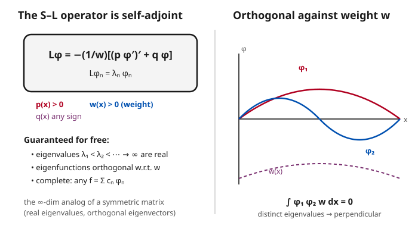

# Partial Differential Equations · Lesson 3.4: Sturm–Liouville theory

> ⏱ ~15 min · Module 3: Separation of variables and Fourier series · Builds on: [3.3 Convergence and the behavior of Fourier series](03-03-convergence-fourier-series.md) · Unlocks: [3.5 Eigenfunction expansions and inhomogeneous problems](03-05-eigenfunction-expansions-inhomogeneous.md)

## Why this matters

Separation of variables keeps working, and it keeps handing you the same miracle: the spatial factor solves an eigenvalue problem, and *any* initial condition can be written as a sum of those eigenfunctions. For the heat equation on an interval that sum was a Fourier sine series — and you probably filed the orthogonality $\int_0^L \sin\frac{n\pi x}{L}\sin\frac{m\pi x}{L}\,dx = 0$ under "lucky trig identity." It is not luck. **Sturm–Liouville theory is the structural reason the method *always* succeeds**: the spatial operator is self-adjoint, and self-adjoint operators come with real eigenvalues, orthogonal eigenfunctions, and completeness *for free* — whatever the geometry. This is also the exact algebra underneath quantum mechanics, where the same theorem says energies are real and states are orthogonal.

## The idea

Think of a symmetric matrix $A$ (meaning $A = A^\top$). Linear algebra promises three gifts: its eigenvalues are real, eigenvectors for different eigenvalues are perpendicular, and those eigenvectors form a basis, so any vector expands as $\mathbf{v} = \sum c_n \mathbf{q}_n$ with $c_n = \mathbf{q}_n \cdot \mathbf{v}$. None of that is coincidence — it all flows from the single symmetry $\langle A\mathbf{x}, \mathbf{y}\rangle = \langle \mathbf{x}, A\mathbf{y}\rangle$.

Now replace the vector with a function and the matrix with a differential operator. The claim of this lesson is that the operators separation of variables produces are the infinite-dimensional version of *symmetric matrices* — provided you measure "perpendicular" with the right ruler. That ruler is a **weighted inner product**: instead of $\int f g\,dx$, you use $\int f g\, w\,dx$ for a positive weight $w(x)$ that the problem itself dictates. Against that ruler the operator is symmetric ("self-adjoint"), and the three gifts reappear: real eigenvalues, weight-orthogonal eigenfunctions, and a complete basis. Fourier sine series is just the simplest case, where $w = 1$ and the ruler is the plain integral.

## The formal version

**Regular Sturm–Liouville problem.** On a finite interval $[a,b]$, find nonzero $u(x)$ and numbers $\lambda$ solving

$$\big(p(x)\,u'\big)' + q(x)\,u + \lambda\, w(x)\, u = 0,$$

with **separated boundary conditions** $\alpha_1 u(a) + \alpha_2 u'(a) = 0$ and $\beta_1 u(b) + \beta_2 u'(b) = 0$, where $p, p', q, w$ are continuous and $p(x) > 0$, $w(x) > 0$ on $[a,b]$.

In words: it is a second-order linear ODE written in a special "divergence" form — the highest term bundled as $(p u')'$ — plus a boundary condition at each end that mixes value and slope but couples nothing across the interval. The number $\lambda$ is the eigenvalue; $w$ is the weight; $p$ and $q$ are given coefficients.

**The S–L operator.** Define

$$L u = -\frac{1}{w}\Big[(p\,u')' + q\,u\Big], \qquad \text{so the problem is } \; L u = \lambda u.$$

In words: package the ODE as "operator acting on $u$ equals $\lambda$ times $u$" — a bona fide eigenvalue problem, with the $1/w$ pulled out so $\lambda$ sits clean on the right.

**Weighted inner product.** For functions on $[a,b]$,

$$\langle f, g\rangle_w = \int_a^b f(x)\,g(x)\,w(x)\,dx.$$

In words: multiply, weight by $w$, integrate. Two functions are *orthogonal* when this is zero; $w$ tilts the scale so regions where $w$ is large count more.

**The Sturm–Liouville theorem.** For a regular S–L problem, $L$ is **self-adjoint**, $\langle Lf, g\rangle_w = \langle f, Lg\rangle_w$ for all $f,g$ meeting the boundary conditions, and consequently:

1. The eigenvalues are **real** and form an increasing sequence $\lambda_1 < \lambda_2 < \lambda_3 < \cdots \to \infty$.
2. Eigenfunctions for distinct eigenvalues are **orthogonal with respect to $w$**: $\langle \varphi_n, \varphi_m\rangle_w = 0$ when $n \neq m$.
3. The eigenfunctions are **complete**: every reasonable $f$ (piecewise smooth, say) expands as $f = \sum_{n=1}^\infty c_n \varphi_n$ with $c_n = \dfrac{\langle f, \varphi_n\rangle_w}{\langle \varphi_n, \varphi_n\rangle_w}$, converging in the $L^2_w$ (weighted mean-square) sense.

In words: the whole machinery of Fourier series — a discrete ladder of frequencies, orthogonality you can integrate against to extract coefficients, and enough eigenfunctions to build any function — holds for *any* separable geometry, not just the plain interval. Bessel and Legendre functions (Lesson 6.3) are S–L eigenfunctions with nonconstant $p, w$; they get an expansion theorem for exactly this reason.

## Picture

## Worked examples

**Example 1 (cast into S–L form, then prove orthogonality).** Take the eigenvalue problem behind the heat equation on $[0,L]$:

$$u'' + \lambda u = 0, \qquad u(0) = 0,\ u(L) = 0.$$

*Identify the pieces.* Match against $(p u')' + q u + \lambda w u = 0$. Here $(p u')' = u''$ forces $p \equiv 1$; there is no undifferentiated coefficient, so $q \equiv 0$; and $\lambda u$ matches $\lambda w u$ with $w \equiv 1$. The BCs $u(0)=u(L)=0$ are separated (each end, value only). All conditions hold ($p = w = 1 > 0$), so it is a regular S–L problem — and the theorem's orthogonality is *predicted* before we compute a single integral.

*Prove orthogonality from self-adjointness.* Let $\varphi_n, \varphi_m$ be eigenfunctions, $L\varphi_n = \lambda_n \varphi_n$ and $L\varphi_m = \lambda_m \varphi_m$ with $\lambda_n \neq \lambda_m$. With $p=1,q=0,w=1$, $L\varphi = -\varphi''$. Consider

$$\int_0^L \big(\varphi_m \varphi_n'' - \varphi_n \varphi_m''\big)\,dx.$$

The integrand is a perfect derivative — Lagrange's identity — since $\frac{d}{dx}\big(\varphi_m \varphi_n' - \varphi_n \varphi_m'\big) = \varphi_m \varphi_n'' - \varphi_n \varphi_m''$ (the cross terms $\varphi_m'\varphi_n'$ cancel). So

$$\int_0^L \big(\varphi_m \varphi_n'' - \varphi_n \varphi_m''\big)\,dx = \Big[\varphi_m \varphi_n' - \varphi_n \varphi_m'\Big]_0^L.$$

Now the boundary conditions earn their keep: $\varphi_n(0)=\varphi_m(0)=0$ and $\varphi_n(L)=\varphi_m(L)=0$, so **every term in the bracket vanishes**. Meanwhile, using the ODE $\varphi_n'' = -\lambda_n \varphi_n$, the left side is

$$\int_0^L \big(\varphi_m(-\lambda_n\varphi_n) - \varphi_n(-\lambda_m\varphi_m)\big)\,dx = (\lambda_m - \lambda_n)\int_0^L \varphi_n \varphi_m\,dx.$$

Setting the two sides equal: $(\lambda_m - \lambda_n)\int_0^L \varphi_n\varphi_m\,dx = 0$. Since $\lambda_m \neq \lambda_n$, the integral is zero. That is orthogonality — and nowhere did we use the explicit form $\varphi_n = \sin\frac{n\pi x}{L}$. The eigenfunctions here *are* those sines (with $\lambda_n = (n\pi/L)^2$), so we have re-derived $\int_0^L \sin\frac{n\pi x}{L}\sin\frac{m\pi x}{L}\,dx = 0$ from structure alone.

**Example 2 (eigenvalues are real).** Same self-adjointness, one line longer, proves reality. Suppose $L\varphi = \lambda\varphi$ for a possibly complex $\lambda$ and complex-valued $\varphi \not\equiv 0$. Take the weighted inner product with $\overline{\varphi}$ (complex conjugate) and use self-adjointness $\langle L\varphi, \varphi\rangle_w = \langle \varphi, L\varphi\rangle_w$:

$$\lambda \langle \varphi,\varphi\rangle_w = \langle L\varphi, \varphi\rangle_w = \langle \varphi, L\varphi\rangle_w = \overline{\lambda}\,\langle\varphi,\varphi\rangle_w.$$

(The last step: pulling $\lambda$ out of the *second* slot conjugates it, and $\langle Lf,g\rangle_w$ is real-symmetric so it equals $\langle f, Lg\rangle_w$.) Thus $(\lambda - \overline{\lambda})\langle\varphi,\varphi\rangle_w = 0$. But $\langle\varphi,\varphi\rangle_w = \int_a^b |\varphi|^2 w\,dx > 0$ because $w > 0$ and $\varphi \not\equiv 0$. So $\lambda = \overline{\lambda}$: **$\lambda$ is real.** This is the exact argument that a Hermitian matrix has real eigenvalues — and, in quantum mechanics, that measured energies are real numbers.

## Watch out

- **You might think** orthogonality means $\int \varphi_n \varphi_m\,dx = 0$. **Actually** it is the *weighted* integral $\int \varphi_n \varphi_m\, w\,dx = 0$. When $w \neq 1$ (Bessel, Legendre, any non-uniform density), the plain integral is generally *not* zero — you must carry the weight into every coefficient formula too, or the expansion is wrong.
- **You might think** self-adjointness is automatic from the operator. **Actually** it needs the **boundary conditions** to kill the boundary term $\big[p(\varphi_m\varphi_n' - \varphi_n\varphi_m')\big]_a^b$ in the integration by parts. "Separated" BCs are exactly the condition that makes that bracket vanish; bad boundary conditions (e.g. mixing the two endpoints unsymmetrically) break self-adjointness, and then eigenvalues can be complex and orthogonality can fail.
- **You might think** the "divergence form" $(p u')'$ is a cosmetic rewrite. **Actually** it is what makes the Lagrange-identity cancellation happen. Any second-order linear ODE can be *put* into S–L form by multiplying through by an integrating factor — do that first, or the weight $w$ you read off will be wrong.
- **You might think** completeness is just orthogonality restated. **Actually** it is the deep, separate claim that you have *enough* eigenfunctions to represent every function — proved with real functional analysis, not by the integration-by-parts trick. We state it; we do not prove it here.

## One-liner

> A regular Sturm–Liouville operator is a symmetric matrix in disguise — self-adjoint against the weight $w$ — so its eigenvalues are real, its eigenfunctions are $w$-orthogonal, and they form a complete basis; Fourier series is just the case $w=1$.

## Problems

**P1 (🟢)** For $u'' + \lambda u = 0$ on $[0,\pi]$ with $u'(0)=0,\ u'(\pi)=0$ (insulated ends), the eigenfunctions are $\varphi_n(x) = \cos(nx)$, $n = 0,1,2,\dots$. Identify $p, q, w$, and verify orthogonality directly by computing $\int_0^\pi \cos(nx)\cos(mx)\,dx$ for $n \neq m$.

**P2 (🟡)** Put the ODE $x^2 y'' + x y' + \lambda y = 0$ on $[1,2]$ into Sturm–Liouville form $(p y')' + q y + \lambda w y = 0$ by finding the integrating factor. Read off $p(x)$, $q(x)$, and the weight $w(x)$. (Hint: divide by $x^2$ first, then look for a factor $\mu(x)$ making the top term a perfect $(\mu\, y')'$.)

**P3 (🔴, optional)** Show that a real eigenvalue of a regular S–L problem cannot have two linearly independent eigenfunctions (each eigenvalue is *simple*), using the separated boundary condition at $x=a$. (Hint: two eigenfunctions $\varphi, \psi$ for the same $\lambda$ both satisfy the same second-order ODE; consider their Wronskian $W = \varphi\psi' - \psi\varphi'$ and what the BC at $a$ says about it there.)

Solutions

**P1** Matching $u'' + \lambda u = 0$ against $(p u')' + q u + \lambda w u = 0$ gives $p \equiv 1$, $q \equiv 0$, $w \equiv 1$ (same operator as Example 1; only the BCs changed to Neumann). Orthogonality: use $\cos A\cos B = \tfrac12[\cos(A-B) + \cos(A+B)]$,

$$\int_0^\pi \cos(nx)\cos(mx)\,dx = \frac12\int_0^\pi \big[\cos((n-m)x) + \cos((n+m)x)\big]\,dx.$$

For $n \neq m$, both $n-m$ and $n+m$ are nonzero integers, and $\int_0^\pi \cos(kx)\,dx = \big[\tfrac{1}{k}\sin(kx)\big]_0^\pi = \tfrac{1}{k}(\sin k\pi - 0) = 0$ for any nonzero integer $k$. So the whole integral is $0$. ✓ (Note $n=0$ is a genuine eigenfunction here, $\varphi_0 = \cos 0 = 1$, with $\lambda_0 = 0$ — the constant mode that Neumann conditions allow.)

**P2** Divide by $x^2$: $\;y'' + \tfrac{1}{x} y' + \tfrac{\lambda}{x^2} y = 0.$ Seek $\mu(x)$ so that $\mu y'' + \mu\tfrac{1}{x}y' = (\mu y')' = \mu y'' + \mu' y'$. This requires $\mu' = \mu/x$, i.e. $\frac{\mu'}{\mu} = \frac1x$, so $\ln\mu = \ln x$ and $\mu = x$. Multiply the divided equation by $\mu = x$:

$$x y'' + y' + \frac{\lambda}{x} y = 0 \quad\Longrightarrow\quad (x\,y')' + \lambda\,\frac{1}{x}\,y = 0.$$

So $p(x) = x$, $q(x) = 0$, and the weight is $w(x) = \dfrac{1}{x}$. (On $[1,2]$ both $p = x > 0$ and $w = 1/x > 0$, so it is a regular problem — its eigenfunctions are orthogonal against $\int_1^2 \varphi_n\varphi_m \tfrac{1}{x}\,dx$, *not* the plain integral. This is the archetype of a nonconstant weight.)

**P3** Both $\varphi$ and $\psi$ satisfy $(p y')' + q y + \lambda w y = 0$ for the same $\lambda$. Form the Wronskian $W(x) = \varphi(x)\psi'(x) - \psi(x)\varphi'(x)$. The separated BC at $a$ reads $\alpha_1 y(a) + \alpha_2 y'(a) = 0$ with $(\alpha_1,\alpha_2)\neq(0,0)$; both eigenfunctions obey it:

$$\alpha_1 \varphi(a) + \alpha_2 \varphi'(a) = 0, \qquad \alpha_1 \psi(a) + \alpha_2 \psi'(a) = 0.$$

This is a homogeneous $2\times 2$ linear system in $(\alpha_1,\alpha_2)$ with a nonzero solution, so its coefficient determinant vanishes:

$$\det\begin{pmatrix} \varphi(a) & \varphi'(a) \\ \psi(a) & \psi'(a)\end{pmatrix} = \varphi(a)\psi'(a) - \psi(a)\varphi'(a) = W(a) = 0.$$

But $\varphi$ and $\psi$ solve the same second-order linear ODE, so their Wronskian is either everywhere zero or nowhere zero (Abel's theorem: $W' = -\tfrac{p'}{p}W$, so $W(x) = W(a)\exp(-\int \tfrac{p'}{p})$). Since $W(a)=0$, $W \equiv 0$, which means $\varphi$ and $\psi$ are linearly dependent — the same eigenfunction up to a constant. Hence the eigenvalue is simple. ✓

## Flashback

**From Lesson 3.3 (Convergence and the behavior of Fourier series):** The square wave $f(x) = 1$ on $(0,\pi)$, extended as an odd $2\pi$-periodic function, has Fourier sine series $f(x) = \sum_{n\ \text{odd}} \frac{4}{n\pi}\sin(nx)$. Use **Parseval's identity** to evaluate $\displaystyle\sum_{k=0}^\infty \frac{1}{(2k+1)^2}$.

Solution

Parseval for a sine series on $[0,\pi]$: for $f = \sum_n b_n \sin(nx)$,

$$\frac{2}{\pi}\int_0^\pi f(x)^2\,dx = \sum_{n=1}^\infty b_n^2.$$

Here $f^2 = 1$ on $(0,\pi)$, so the left side is $\frac{2}{\pi}\int_0^\pi 1\,dx = \frac{2}{\pi}\cdot\pi = 2$. The coefficients are $b_n = \frac{4}{n\pi}$ for odd $n$ and $0$ for even $n$, so

$$\sum_n b_n^2 = \sum_{n\ \text{odd}} \left(\frac{4}{n\pi}\right)^2 = \frac{16}{\pi^2}\sum_{k=0}^\infty \frac{1}{(2k+1)^2}.$$

Set equal to $2$: $\;\frac{16}{\pi^2}\sum \frac{1}{(2k+1)^2} = 2$, hence

$$\sum_{k=0}^\infty \frac{1}{(2k+1)^2} = \frac{2\pi^2}{16} = \frac{\pi^2}{8}.$$

(Sanity check: this is consistent with $\sum_{n\ge1} \frac1{n^2} = \frac{\pi^2}{6}$, since the odd terms are $\frac{\pi^2}{6}\cdot\frac34 \cdot$... indeed $\frac{\pi^2}{6} - \frac14\cdot\frac{\pi^2}{6} = \frac34\cdot\frac{\pi^2}{6} = \frac{\pi^2}{8}$. ✓)

## Connections

- **Backward:** Fourier sine/cosine series ([3.2](03-02-fourier-series.md)) is the constant-coefficient S–L case $p = w = 1$, $q = 0$ — this lesson explains *why* its orthogonality was never a coincidence. The completeness that lets those series represent any function is the $L^2$ convergence you met in [3.3](03-03-convergence-fourier-series.md), now named as the third pillar of the theorem.
- **Forward:** [3.5](03-05-eigenfunction-expansions-inhomogeneous.md) uses $w$-orthogonality to extract coefficients and solve *driven* (inhomogeneous) problems by expanding the forcing in eigenfunctions. In [6.3](06-03-separation-polar-spherical.md), separating Laplace's equation in polar/spherical coordinates produces Bessel's and Legendre's equations — S–L problems with nonconstant $p, w$ — so their eigenfunctions inherit the expansion theorem automatically.
- **Sideways (the central bridge — quantum mechanics):** a Hermitian Hamiltonian *is* a self-adjoint operator. This theorem is why measured energies are real (Example 2), why distinct energy eigenstates are orthogonal, and why any wavefunction expands in energy eigenstates — the entire spectral logic of [quantum mechanics](../../quantum-mechanics/syllabus.md) is Sturm–Liouville theory. The weight $w$ generalizes the integration measure of the inner product $\langle\psi|\phi\rangle$.
- **Sideways (linear algebra & functional analysis):** it is the infinite-dimensional spectral theorem. Symmetric matrices give real eigenvalues and orthogonal eigenvectors in [linalg-refresher](../../linalg-refresher/syllabus.md); [functional analysis](../../functional-analysis/syllabus.md) makes the leap to operators rigorous, where "self-adjoint operator has a complete orthonormal set of eigenfunctions" is the spectral theorem for compact/regular operators — the theorem this lesson states without proof.
