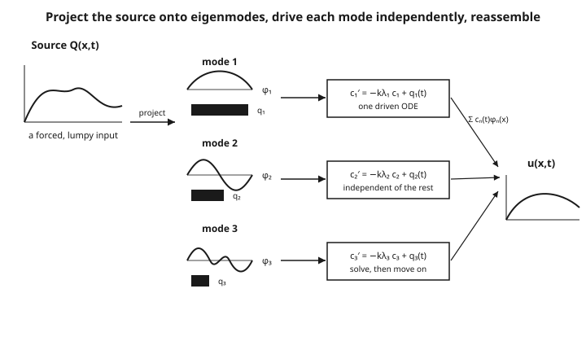

# Partial Differential Equations · Lesson 3.5: Eigenfunction expansions and inhomogeneous problems

> ⏱ ~15 min · Module 3: Separation of variables and Fourier series · Builds on: [3.4 Sturm–Liouville theory](03-04-sturm-liouville-theory.md) · Unlocks: [4.1 The Fourier transform](04-01-fourier-transform.md)

## Why this matters

Separation of variables (3.1) handles the *homogeneous* heat and wave equations beautifully — but real bars have heaters, real strings get pushed, real membranes are forced. The moment a source term $Q(x,t)$ appears on the right-hand side, the clean product-solution trick stalls: you can't separate a forced equation. This lesson is the fix, and it's the payoff of all of Module 3. The eigenfunctions that Sturm–Liouville theory (3.4) handed you form a coordinate system in which a forced PDE — a coupled, infinite-dimensional object — falls apart into a stack of ordinary, one-variable driven ODEs you already know how to solve. It is also where **resonance** enters physics: push a system at one of its own natural frequencies and watch the response blow up.

## The idea

You have a forced PDE. The unknown $u(x,t)$ and the source $Q(x,t)$ are both functions of $x$ at each instant — and the boundary conditions pick out a special family of shapes, the eigenfunctions $\phi_n(x)$, that are mutually orthogonal (3.4). Orthogonality means these shapes are like perpendicular axes: any function of $x$ can be written as a combination of them, and no axis leaks into another.

So do everything in that coordinate system. Write the solution as $u(x,t)=\sum_n c_n(t)\,\phi_n(x)$ — the spatial shape is frozen as $\phi_n$, and all the time-dependence is loaded into the coefficients $c_n(t)$. Expand the source the same way, $Q(x,t)=\sum_n q_n(t)\,\phi_n(x)$. Now plug both into the PDE. Because each $\phi_n$ satisfies its own eigenvalue equation, the spatial derivatives just multiply $\phi_n$ by its eigenvalue $\lambda_n$ — and because the $\phi_n$ are orthogonal, the equation must hold *mode by mode*. The single tangled PDE splits into one independent ODE for each $c_n(t)$, driven by that mode's slice of the source $q_n(t)$. Solve each little ODE, sum the results back up, done.

The picture to carry: **decompose the forcing into modes, let each mode ring on its own, then add the rings back together.**

## The formal version

Take the forced heat equation on $[0,L]$ with homogeneous Dirichlet ends:

$$u_t = k\,u_{xx} + Q(x,t), \qquad u(0,t)=u(L,t)=0.$$

Here $u(x,t)$ is temperature, $k>0$ the diffusivity, and $Q$ a heat source. The Dirichlet ends select the sine eigenfunctions $\phi_n(x)=\sin\!\frac{n\pi x}{L}$ with eigenvalues $\lambda_n=\left(\frac{n\pi}{L}\right)^2$, satisfying $-\phi_n''=\lambda_n\phi_n$.

**Expand both unknown and source in the eigenfunctions:**

$$u(x,t)=\sum_{n=1}^{\infty} c_n(t)\,\phi_n(x), \qquad Q(x,t)=\sum_{n=1}^{\infty} q_n(t)\,\phi_n(x),$$

$$q_n(t)=\frac{\langle Q(\cdot,t),\phi_n\rangle}{\langle \phi_n,\phi_n\rangle}=\frac{\int_0^L Q(x,t)\,\phi_n(x)\,dx}{\int_0^L \phi_n(x)^2\,dx}.$$

In words: $q_n(t)$ is the amount of the source pointing along the $\phi_n$ axis at time $t$ — the source's shadow on that mode, computed by the same inner-product projection that gives Fourier coefficients.

**Substitute and use orthogonality.** Plugging in, $u_t=\sum c_n'(t)\phi_n$ and $k\,u_{xx}=\sum c_n(t)\,k\phi_n''=-\sum k\lambda_n c_n(t)\phi_n$. Matching the $\phi_n$ components (legal precisely because distinct $\phi_n$ are orthogonal):

$$\boxed{\,c_n'(t) = -\,k\lambda_n\,c_n(t) + q_n(t)\,}$$

In words: each coefficient obeys a first-order **driven, decaying** ODE — natural decay rate $k\lambda_n$ (high modes die fastest), pushed by that mode's share of the source. The PDE is gone; a decoupled family of ODEs stands in its place.

**Solve each with the integrating factor** $e^{k\lambda_n t}$:

$$c_n(t)=c_n(0)\,e^{-k\lambda_n t}+\int_0^{t} e^{-k\lambda_n(t-s)}\,q_n(s)\,ds,$$

where $c_n(0)$ comes from expanding the initial data $u(x,0)$ in the same eigenfunctions. Reassemble $u=\sum_n c_n(t)\phi_n(x)$.

**Inhomogeneous boundary conditions** (a quick but essential preliminary): if the ends are held at nonzero values, e.g. $u(0,t)=A$, $u(L,t)=B$, the eigenfunctions won't satisfy the BCs and the expansion fails. Fix it first by subtracting a simple particular function that *does* meet the BCs — for steady endpoints the straight line $w(x)=A+\frac{B-A}{L}x$ works. Set $v=u-w$; then $v$ has homogeneous BCs, and $w$'s leftover terms just fold into the source. Homogenize, then expand.

## Picture

## Worked examples

**Example 1 (mechanical — a source that hits a single mode).** Solve $u_t=k\,u_{xx}+Q(x,t)$ on $[0,L]$ with $u(0,t)=u(L,t)=0$, zero initial temperature $u(x,0)=0$, and source

$$Q(x,t)=g(t)\,\sin\!\frac{\pi x}{L},\qquad g(t)=e^{-\alpha t}.$$

The source is *already* a pure first eigenfunction, so its projection is trivial: $q_1(t)=g(t)=e^{-\alpha t}$ and $q_n(t)=0$ for all $n\geq 2$. Every mode but the first is unforced and starts at zero, so $c_n(t)\equiv 0$ for $n\geq 2$. Only $c_1$ lives, obeying

$$c_1'(t)=-k\lambda_1 c_1(t)+e^{-\alpha t},\qquad \lambda_1=\left(\tfrac{\pi}{L}\right)^2,\quad c_1(0)=0.$$

Write $\beta=k\lambda_1$. The integrating-factor solution (assuming $\beta\neq\alpha$):

$$c_1(t)=\int_0^t e^{-\beta(t-s)}e^{-\alpha s}\,ds=e^{-\beta t}\int_0^t e^{(\beta-\alpha)s}\,ds=\frac{e^{-\alpha t}-e^{-\beta t}}{\beta-\alpha}.$$

So the whole solution is one term:

$$u(x,t)=\frac{e^{-\alpha t}-e^{-k(\pi/L)^2 t}}{\,k(\pi/L)^2-\alpha\,}\,\sin\!\frac{\pi x}{L}.$$

Sanity checks: $u(x,0)=0$ ✓, the ends vanish ✓, and as $t\to\infty$ both exponentials die so $u\to 0$ — the source fades and the bar cools back to zero. A source aligned with one eigenmode excites exactly that mode and no other: the cleanest possible demonstration that orthogonality decouples.

**Example 2 (why you'd care — resonance in a forced string).** The wave equation shows what happens when you drive a system *at its own frequency*. Consider

$$u_{tt}=c^2 u_{xx}+F(x,t),\qquad u(0,t)=u(L,t)=0,$$

with $u$ and $u_t$ zero at $t=0$. Expanding as before with $\phi_n=\sin\frac{n\pi x}{L}$, $\lambda_n=(n\pi/L)^2$, each coefficient now obeys a **second-order driven oscillator**:

$$c_n''(t)=-c^2\lambda_n\,c_n(t)+F_n(t),\qquad \text{natural frequency }\omega_n=c\sqrt{\lambda_n}=\frac{n\pi c}{L}.$$

Notice the S–L eigenvalue *is* the natural frequency squared: $\omega_n^2=c^2\lambda_n$. Now drive the first mode exactly at its own frequency, $F(x,t)=\sin\omega_1 t\,\sin\frac{\pi x}{L}$, so $F_1(t)=\sin\omega_1 t$ and all higher $F_n=0$. The live equation is

$$c_1''+\omega_1^2 c_1=\sin\omega_1 t,\qquad c_1(0)=c_1'(0)=0.$$

This is the textbook resonance ODE. Because the forcing frequency equals the natural frequency, the standard particular guess collides with the homogeneous solution, and the resonant solution carries a factor of $t$:

$$c_1(t)=\frac{1}{2\omega_1^2}\big(\sin\omega_1 t-\omega_1 t\cos\omega_1 t\big).$$

The $-\frac{t}{2\omega_1}\cos\omega_1 t$ term means the amplitude **grows linearly in time** — the string swings wider and wider. That unbounded growth is resonance: forcing at an eigenfrequency pumps energy into that mode with nothing to cancel it. (Away from resonance, $F_1(t)=\sin\Omega t$ with $\Omega\neq\omega_1$, the response stays bounded at amplitude $1/|\omega_1^2-\Omega^2|$ — large near resonance, finite.)

Verifying the resonant solution

With $c_1=\frac{1}{2\omega_1^2}(\sin\omega_1 t-\omega_1 t\cos\omega_1 t)$: differentiate once, $c_1'=\frac{1}{2\omega_1^2}(\omega_1\cos\omega_1 t-\omega_1\cos\omega_1 t+\omega_1^2 t\sin\omega_1 t)=\frac{t}{2}\sin\omega_1 t$. Differentiate again, $c_1''=\frac{1}{2}\sin\omega_1 t+\frac{\omega_1 t}{2}\cos\omega_1 t$. Then $c_1''+\omega_1^2 c_1=\frac{1}{2}\sin\omega_1 t+\frac{\omega_1 t}{2}\cos\omega_1 t+\frac{1}{2}\sin\omega_1 t-\frac{\omega_1 t}{2}\cos\omega_1 t=\sin\omega_1 t$ ✓. Initial data: $c_1(0)=0$, $c_1'(0)=0$ ✓.

## Watch out

- **You might think** you can expand in whatever nice basis you like — **but** you must use the eigenfunctions the *boundary conditions* select. Dirichlet ends give sines; Neumann ends give cosines (plus a constant); mixed or Robin ends give the S–L eigenfunctions of *that* problem. Use the wrong family and the boundary terms won't vanish, and orthogonality won't hold.
- **You might think** the modes are coupled because they all live in one PDE — **but** orthogonality is exactly what severs them. $\langle\phi_m,\phi_n\rangle=0$ for $m\neq n$ is the reason substituting and matching components yields *independent* ODEs. No orthogonality, no decoupling. (This is why Module 3 spent a whole lesson on S–L self-adjointness: self-adjointness is what *guarantees* the orthogonality.)
- **You might think** you can expand straight away when the ends are held at nonzero temperatures — **but** the eigenfunction expansion needs homogeneous BCs. Subtract a particular function meeting the given BCs first (the steady line for constant ends); only then expand the homogenized remainder.
- **You might think** resonance is a special coincidence — **but** it is structural: it happens precisely when the drive frequency matches $\sqrt{\lambda_n}$ times the wave speed, i.e. when you force a mode at its own $\omega_n$. The S–L eigenvalue tells you *where* the resonances are before you drive anything.

## One-liner

> Expand the solution and the source in the boundary conditions' own eigenfunctions; orthogonality turns the forced PDE into one independent driven ODE per mode — and driving a mode at its own eigenfrequency is resonance.

## Problems

**P1 (🟢)** A rod on $[0,\pi]$ with $u(0,t)=u(\pi,t)=0$ obeys $u_t=u_{xx}+Q(x,t)$ (so $k=1$), starts cold ($u(x,0)=0$), and is heated by the *constant-in-time* source $Q(x,t)=2\sin 3x$. Here $\phi_n=\sin nx$, $\lambda_n=n^2$. Find $u(x,t)$ and its steady state as $t\to\infty$.

**P2 (🟡)** Same rod and equation as P1, but now the source hits two modes: $Q(x,t)=\sin x+4\sin 2x$, constant in time, with $u(x,0)=0$. Write the coefficient ODE for a general mode $n$, identify which modes are driven, and give $u(x,t)$.

**P3 (🔴, optional)** A rod on $[0,1]$ has its ends held at fixed unequal temperatures: $u(0,t)=0$, $u(1,t)=10$, with $u_t=u_{xx}$ (no interior source) and initial profile $u(x,0)=0$. Homogenize the boundary conditions, then set up (you need not fully sum) the eigenfunction expansion for the transient. What is the $t\to\infty$ limit of $u$?

Solutions

**P1** The source is a pure third eigenfunction, so $q_3(t)=2$ (constant) and all other $q_n=0$. Only $c_3$ is driven; the rest stay zero. With $\lambda_3=9$:

$$c_3'(t)=-9c_3(t)+2,\qquad c_3(0)=0.$$

This is a constant-driven linear ODE. Its steady value is $c_3^\ast=2/9$, and the transient decays at rate $9$:

$$c_3(t)=\frac{2}{9}\left(1-e^{-9t}\right).$$

So

$$u(x,t)=\frac{2}{9}\left(1-e^{-9t}\right)\sin 3x,\qquad u(x,\infty)=\frac{2}{9}\sin 3x.$$

Check the steady state directly: at equilibrium $0=u_{xx}+2\sin 3x$, i.e. $u_{xx}=-2\sin 3x$, whose solution vanishing at $0,\pi$ is $\frac{2}{9}\sin 3x$ ✓.

**P2** For a source constant in time, projecting gives $q_1=1$, $q_2=4$, and $q_n=0$ otherwise. The general coefficient ODE is

$$c_n'(t)=-n^2 c_n(t)+q_n,\qquad c_n(0)=0.$$

Only $n=1$ and $n=2$ are driven. Each is constant-driven, so $c_n(t)=\frac{q_n}{n^2}\left(1-e^{-n^2 t}\right)$:

$$c_1(t)=1\cdot\left(1-e^{-t}\right),\qquad c_2(t)=\frac{4}{4}\left(1-e^{-4t}\right)=\left(1-e^{-4t}\right).$$

Therefore

$$u(x,t)=\left(1-e^{-t}\right)\sin x+\left(1-e^{-4t}\right)\sin 2x,$$

with steady state $u(x,\infty)=\sin x+\sin 2x$. Two modes, two independent driven ODEs — no cross-talk, exactly because $\sin x\perp\sin 2x$.

**P3** Homogenize with the steady line meeting the BCs: $w(x)=10x$ (since $w(0)=0$, $w(1)=10$, and $w''=0$). Set $v=u-w$. Then $v(0,t)=v(1,t)=0$, $v_t=u_t=u_{xx}=v_{xx}+w''=v_{xx}$ (as $w''=0$), and $v(x,0)=u(x,0)-w(x)=-10x$. So $v$ solves the *homogeneous* Dirichlet heat equation with initial data $-10x$, expand in $\phi_n=\sin n\pi x$, $\lambda_n=(n\pi)^2$:

$$v(x,t)=\sum_{n=1}^{\infty} b_n\,e^{-(n\pi)^2 t}\sin n\pi x,\quad b_n=2\int_0^1(-10x)\sin n\pi x\,dx=\frac{20(-1)^n}{n\pi},$$

using $\int_0^1 x\sin n\pi x\,dx=\frac{(-1)^{n+1}}{n\pi}$. Then $u=w+v=10x+\sum_n b_n e^{-(n\pi)^2 t}\sin n\pi x$. As $t\to\infty$ every transient term decays and

$$u(x,\infty)=w(x)=10x,$$

the steady linear temperature profile — the expected answer for a rod with ends held at $0$ and $10$.

## Flashback

**From Lesson 3.4 (Sturm–Liouville theory):** Consider the regular S–L operator $L[\phi]=-(p\phi')'+q\phi$ on $[a,b]$ with $p,q$ real and separated homogeneous boundary conditions (e.g. $\phi(a)=\phi(b)=0$). Show from Lagrange's identity that eigenfunctions $\phi_m,\phi_n$ belonging to *distinct* eigenvalues $\lambda_m\neq\lambda_n$ are orthogonal with weight $w=1$: $\int_a^b \phi_m\phi_n\,dx=0$. (This orthogonality is the exact fact this lesson leaned on to decouple the modes.)

Solution

Self-adjointness gives, for any two functions meeting the BCs, $\langle L\phi_m,\phi_n\rangle=\langle\phi_m,L\phi_n\rangle$. Concretely, Lagrange's identity integrates the boundary term away:

$$\int_a^b\big(\phi_n L[\phi_m]-\phi_m L[\phi_n]\big)\,dx=\Big[-p\big(\phi_n\phi_m'-\phi_m\phi_n'\big)\Big]_a^b.$$

The separated homogeneous BCs kill the bracket at both ends (each of $\phi_m,\phi_n$ vanishes there, so $\phi_n\phi_m'-\phi_m\phi_n'=0$ at $a$ and $b$). Hence the left side is zero. But $L[\phi_m]=\lambda_m\phi_m$ and $L[\phi_n]=\lambda_n\phi_n$, so the left side equals

$$\int_a^b(\lambda_m-\lambda_n)\phi_m\phi_n\,dx=(\lambda_m-\lambda_n)\int_a^b\phi_m\phi_n\,dx=0.$$

Since $\lambda_m\neq\lambda_n$, the factor $(\lambda_m-\lambda_n)\neq 0$, forcing $\int_a^b\phi_m\phi_n\,dx=0$. The eigenfunctions are orthogonal. (With this and 3.4 you have now assembled Boss Problem 3 — the full mixed-BC rod: eigenfunctions from self-adjointness, orthogonality from here, and forced-mode decoupling from this lesson.)

## Connections

- **Backward:** the eigenfunctions and their orthogonality are exactly what [3.4](03-04-sturm-liouville-theory.md) built, and the expansion machinery is [3.1](03-01-separation-of-variables.md)'s separation extended from the homogeneous case to forced problems — separation gives you the basis; projection lets you use it when a source is present.
- **Forward:** [5.4 Duhamel's principle](05-04-duhamels-principle.md) is the continuous-in-time cousin of the mode-by-mode integrating-factor solution here — treat the source at each instant as a fresh initial condition and superpose, the same "drive, then reassemble" logic without committing to a discrete basis.
- **Sideways (quantum mechanics):** a driven or perturbed quantum system is expanded in the energy eigenstates of its Hamiltonian, and forcing near an energy gap drives transitions — resonant absorption is this lesson's resonance in the language of [quantum mechanics](../../quantum-mechanics/syllabus.md).
- **Sideways (ODEs):** every decoupled mode is a driven linear ODE from the [ODE refresher](../../ode-refresher/syllabus.md) — first-order for heat, second-order oscillator for waves — and the $t$-growing resonant solution is precisely the repeated-root/forcing-matches-frequency case from that course.
- **Sideways (engineering):** forced vibration and resonance — bridges, buildings, and machine parts driven at a natural frequency — are Example 2 in the wild; the design goal is to keep every drive frequency away from the structure's $\omega_n$.
