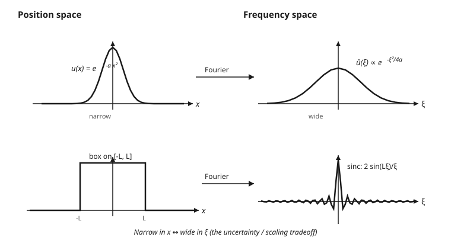

# Partial Differential Equations · Lesson 4.1: The Fourier transform

> ⏱ ~15 min · Module 4: Transforms on unbounded domains · Builds on: [3.5 Eigenfunction expansions and inhomogeneous problems](03-05-eigenfunction-expansions-inhomogeneous.md) · Unlocks: [4.2 Solving the heat equation on the line: the heat kernel](04-02-heat-equation-line-heat-kernel.md)

## Why this matters

On a finite rod, separation of variables handed us a *discrete* menu of modes — $\sin(n\pi x/L)$, indexed by an integer $n$ — because the boundary conditions quantize which wavelengths are allowed. But heat spreads on an infinite bar, waves travel down an unbounded string, and a quantum particle roams all of $\mathbb{R}$. There are **no boundaries to quantize anything**, so the discrete menu blurs into a *continuum* of frequencies. The tool that replaces the Fourier series in that limit is the **Fourier transform**, and it does something magical for PDEs: it turns differentiation into multiplication, converting a differential equation in $x$ into a plain algebra problem in frequency.

## The idea

Take a Fourier series on an interval of length $L$ and let $L \to \infty$. The allowed frequencies are spaced $\Delta\xi = 2\pi/L$ apart; as $L$ grows they crowd together until, in the limit, *every* real frequency $\xi$ is allowed. The sum $\sum_n$ over a discrete grid of modes becomes an integral $\int d\xi$ over a continuum. The list of Fourier coefficients $c_n$ — one number per allowed mode — becomes a *function* $\hat{u}(\xi)$: the amount of frequency $\xi$ present in your signal.

So the Fourier transform is a change of description. It takes a function of position $u(x)$ and rewrites it as a recipe in frequency: "to build $u$, superpose pure waves $e^{i\xi x}$, using $\hat u(\xi)$ of each." Nothing is lost — the inverse transform reassembles $u$ exactly. Why bother? Because a pure wave $e^{i\xi x}$ is an *eigenfunction of the derivative*: $\frac{d}{dx}e^{i\xi x} = i\xi\, e^{i\xi x}$. Rewriting a signal as a blend of these waves diagonalizes $\partial_x$ — and a diagonalized derivative is just multiplication by a number.

## The formal version

**Definition (our convention — fix it and never drift).** For a decaying function $u$,

$$\hat u(\xi) = \int_{-\infty}^{\infty} u(x)\, e^{-i\xi x}\,dx, \qquad u(x) = \frac{1}{2\pi}\int_{-\infty}^{\infty} \hat u(\xi)\, e^{i\xi x}\,d\xi.$$

In words: $\hat u(\xi)$ measures how much of the pure frequency $\xi$ lives in $u$ (multiply by $e^{-i\xi x}$ and average over all $x$); the inverse rebuilds $u$ by superposing those frequencies back. The $\tfrac{1}{2\pi}$ sits on the inverse; the sign in the exponent is $-i$ going forward, $+i$ coming back. Here $\xi\in\mathbb{R}$ is angular frequency and $i^2=-1$.

**The derivative rule (the whole point).** If $u\to 0$ at $\pm\infty$, then

$$\widehat{u'}(\xi) = i\xi\, \hat u(\xi).$$

In words: differentiating in $x$ becomes multiplying by $i\xi$ in frequency space. It follows from one integration by parts — the boundary term dies because $u$ decays. Iterate: $\widehat{u''} = (i\xi)^2\hat u = -\xi^2\hat u$. A differential operator turns into a *polynomial* in $\xi$.

**The convolution theorem.** With $(f * g)(x) = \int_{-\infty}^{\infty} f(x-y)\,g(y)\,dy$,

$$\widehat{f * g}(\xi) = \hat f(\xi)\,\hat g(\xi).$$

In words: the messy smearing operation of convolution becomes ordinary multiplication after transforming. (This is why the heat equation's solution in 4.2 will be a convolution against a kernel.)

**Plancherel / Parseval (energy is conserved).**

$$\int_{-\infty}^{\infty} |u(x)|^2\,dx = \frac{1}{2\pi}\int_{-\infty}^{\infty} |\hat u(\xi)|^2\,d\xi.$$

In words: the total energy of a signal equals the total energy of its frequency content (up to the $2\pi$ our convention parks here). The transform is a unitary change of basis — it rotates, it doesn't distort.

## Picture

## Worked examples

**Example 1 (mechanical — the Gaussian is its own kind of fixed point).** Transform $u(x) = e^{-ax^2}$, $a>0$. By definition,

$$\hat u(\xi) = \int_{-\infty}^{\infty} e^{-ax^2}\, e^{-i\xi x}\,dx = \int_{-\infty}^{\infty} e^{-a\left(x^2 + \frac{i\xi}{a}x\right)}\,dx.$$

Complete the square in the exponent: $x^2 + \frac{i\xi}{a}x = \left(x + \frac{i\xi}{2a}\right)^2 + \frac{\xi^2}{4a^2}$, so

$$\hat u(\xi) = e^{-a\cdot \frac{\xi^2}{4a^2}}\int_{-\infty}^{\infty} e^{-a\left(x + \frac{i\xi}{2a}\right)^2}\,dx = e^{-\xi^2/4a}\sqrt{\frac{\pi}{a}}.$$

(The shifted Gaussian integral still equals $\sqrt{\pi/a}$ — a contour argument justifies sliding the path back to the real axis; you'll meet that machinery in [complex-analysis](../../complex-analysis/syllabus.md).) So

$$\boxed{\;\widehat{e^{-ax^2}}(\xi) = \sqrt{\tfrac{\pi}{a}}\; e^{-\xi^2/4a}.\;}$$

A Gaussian transforms to a Gaussian — and look at the widths. In $x$ the spread scales like $1/\sqrt{a}$; in $\xi$ it scales like $\sqrt{a}$. **Make $u$ narrow (large $a$) and $\hat u$ gets wide.** Squeeze in position, spread in frequency.

**Example 2 (the box, then a PDE dissolved into algebra).** First the box $u(x) = 1$ on $[-L,L]$ and $0$ outside:

$$\hat u(\xi) = \int_{-L}^{L} e^{-i\xi x}\,dx = \left[\frac{e^{-i\xi x}}{-i\xi}\right]_{-L}^{L} = \frac{e^{-i\xi L}-e^{i\xi L}}{-i\xi} = \frac{2\sin(L\xi)}{\xi}.$$

That's a **sinc**: a sharp-edged box in $x$ produces a slowly-decaying, oscillating transform in $\xi$. Again the tradeoff — a wider box (larger $L$) makes the central sinc lobe *narrower*.

Now watch the derivative rule solve an equation. Take the ODE on the whole line

$$-u'' + u = f(x), \qquad u\to 0 \text{ at }\pm\infty.$$

Transform both sides. Using $\widehat{u''} = -\xi^2\hat u$:

$$-(-\xi^2\hat u) + \hat u = \hat f \;\;\Longrightarrow\;\; (\xi^2+1)\,\hat u(\xi) = \hat f(\xi) \;\;\Longrightarrow\;\; \hat u(\xi) = \frac{\hat f(\xi)}{\xi^2+1}.$$

The differential equation became *dividing by a polynomial*. To recover $u$, invert — and by the convolution theorem, multiplying $\hat f$ by $\frac{1}{\xi^2+1}$ in frequency means convolving $f$ with whatever has that transform. (It's $\frac{1}{2}e^{-|x|}$; you'll build such Green's functions in [5.2](05-02-greens-functions-poisson.md).) The point stands: **transform, do algebra, invert.**

## Watch out

- **Conventions are a minefield.** Where the $2\pi$ sits (all on the inverse, split as $\frac{1}{\sqrt{2\pi}}$ on each, or absorbed by using ordinary frequency $\nu$ with $e^{-2\pi i\nu x}$) and which exponent carries the minus sign both vary by textbook. Every formula above — the derivative rule's factor, Plancherel's constant — shifts with the choice. Pick one convention (ours: $\tfrac{1}{2\pi}$ on the inverse, $e^{-i\xi x}$ forward) and hold it for the whole course.
- **The integral has to converge.** The transform as written needs $u$ to decay (integrable, or square-integrable). A constant, a pure $\sin$, or the delta spike have no ordinary Fourier integral — you extend the theory to *distributions* in [5.1](05-01-dirac-delta-distributions.md), where the delta's transform turns out to be the constant $1$.
- **Differentiation $\to$ multiplication is not a side fact — it is the entire reason transforms solve PDEs.** Every time you see $\partial_x$, mentally replace it with $i\xi$; the PDE's difficulty collapses accordingly.
- **Narrow in $x$ means wide in $\xi$, always.** Scaling $u(x)\mapsto u(x/s)$ stretches $\hat u$ by $1/s$ — you cannot make a function sharply localized in both position and frequency. This is a theorem about widths, not a quirk of the Gaussian.

## One-liner

> The Fourier transform re-expresses a function as a continuum of pure waves $e^{i\xi x}$, and in that basis $\partial_x$ is just multiplication by $i\xi$ — so a PDE in $x$ becomes algebra in $\xi$.

## Problems

**P1 (🟢)** Using the derivative rule, transform the ODE $u'' - 4u = f(x)$ (with $u\to 0$ at $\pm\infty$) into an algebraic equation for $\hat u(\xi)$, and solve it for $\hat u$.

**P2 (🟡)** Let $u(x) = e^{-a x^2}$ with $a = 1$, so $\hat u(\xi) = \sqrt{\pi}\,e^{-\xi^2/4}$. Now let $v(x) = u(2x)$ (a *narrower* Gaussian). Compute $\hat v(\xi)$ directly from the definition and confirm it is *wider* than $\hat u$. (Hint: substitute $y = 2x$.)

**P3 (🔴, optional)** Verify Plancherel for the box: with $u = 1$ on $[-1,1]$ and $\hat u(\xi) = \frac{2\sin\xi}{\xi}$, compute the left side $\int_{-\infty}^\infty |u|^2\,dx$, and use the identity to evaluate the otherwise-awkward integral $\int_{-\infty}^{\infty}\frac{\sin^2\xi}{\xi^2}\,d\xi$.

Solutions

**P1** Transform both sides. Using $\widehat{u''} = (i\xi)^2\hat u = -\xi^2\hat u$:

$$-\xi^2\hat u - 4\hat u = \hat f \;\;\Longrightarrow\;\; -(\xi^2+4)\,\hat u = \hat f \;\;\Longrightarrow\;\; \hat u(\xi) = -\frac{\hat f(\xi)}{\xi^2+4}.$$

The second-order ODE became division by the polynomial $\xi^2+4$.

**P2** By definition, with the substitution $y = 2x$ (so $dy = 2\,dx$, $x = y/2$):

$$\hat v(\xi) = \int_{-\infty}^{\infty} e^{-(2x)^2}\,e^{-i\xi x}\,dx = \int_{-\infty}^{\infty} e^{-y^2}\,e^{-i\xi y/2}\,\frac{dy}{2} = \frac{1}{2}\,\hat u\!\left(\frac{\xi}{2}\right).$$

Since $\hat u(\xi) = \sqrt{\pi}\,e^{-\xi^2/4}$, we get

$$\hat v(\xi) = \frac{1}{2}\sqrt{\pi}\,e^{-(\xi/2)^2/4} = \frac{\sqrt{\pi}}{2}\,e^{-\xi^2/16}.$$

Compare the exponents: $\hat u$ decays like $e^{-\xi^2/4}$, $\hat v$ like $e^{-\xi^2/16}$ — the latter is spread *four times wider* in the $\xi^2$ scale. Squeezing $u$ by a factor of $2$ in position stretched its transform by $2$ in frequency, exactly the scaling law. (This is the general fact $\widehat{u(sx)}(\xi) = \frac{1}{|s|}\hat u(\xi/s)$ with $s=2$.)

**P3** Plancherel with our convention says $\int |u|^2\,dx = \frac{1}{2\pi}\int|\hat u|^2\,d\xi$. Left side: $u^2 = 1$ on $[-1,1]$, so $\int_{-\infty}^\infty |u|^2\,dx = 2$. Right side: $|\hat u(\xi)|^2 = \frac{4\sin^2\xi}{\xi^2}$, so

$$2 = \frac{1}{2\pi}\int_{-\infty}^{\infty}\frac{4\sin^2\xi}{\xi^2}\,d\xi = \frac{2}{\pi}\int_{-\infty}^{\infty}\frac{\sin^2\xi}{\xi^2}\,d\xi.$$

Solving, $\int_{-\infty}^{\infty}\frac{\sin^2\xi}{\xi^2}\,d\xi = 2\cdot\frac{\pi}{2} = \pi$. ✓ Plancherel evaluated a nontrivial real integral for free — no antiderivative required, just conservation of energy between the two descriptions.

## Flashback

**From Lesson [3.2 Fourier series](03-02-fourier-series.md):** Compute the Fourier sine-series coefficients $b_n$ of $f(x) = x$ on $[0,\pi]$, i.e. the coefficients in $x = \sum_{n\ge 1} b_n \sin(nx)$, where $b_n = \frac{2}{\pi}\int_0^\pi x\sin(nx)\,dx$.

Solution

Integrate by parts with $u = x$, $dv = \sin(nx)\,dx$ (so $du = dx$, $v = -\frac{1}{n}\cos(nx)$):

$$\int_0^\pi x\sin(nx)\,dx = \left[-\frac{x}{n}\cos(nx)\right]_0^\pi + \frac{1}{n}\int_0^\pi \cos(nx)\,dx = -\frac{\pi}{n}\cos(n\pi) + \frac{1}{n^2}\big[\sin(nx)\big]_0^\pi.$$

The last bracket is $0$ (since $\sin(n\pi)=0$), and $\cos(n\pi) = (-1)^n$, so the integral is $-\frac{\pi}{n}(-1)^n = \frac{\pi(-1)^{n+1}}{n}$. Therefore

$$b_n = \frac{2}{\pi}\cdot\frac{\pi(-1)^{n+1}}{n} = \frac{2(-1)^{n+1}}{n}.$$

So $x = 2\sum_{n\ge 1}\frac{(-1)^{n+1}}{n}\sin(nx)$ on $[0,\pi]$ — a *discrete* list of coefficients, one per integer mode. On the whole line those coefficients would fill in to a continuous $\hat u(\xi)$: same idea, discrete menu replaced by a continuum.

## Connections

- **Backward:** this is the $L\to\infty$ limit of [3.2 Fourier series](03-02-fourier-series.md) — the discrete modes $\sin(n\pi x/L)$ and coefficients $c_n$ blur into a continuum of frequencies $\xi$ and a coefficient *function* $\hat u(\xi)$. The eigenfunction viewpoint of [3.4 Sturm–Liouville theory](03-04-sturm-liouville-theory.md) still applies: $e^{i\xi x}$ are the eigenfunctions of $\partial_x$ on the line.
- **Forward:** [4.2 the heat kernel](04-02-heat-equation-line-heat-kernel.md) transforms the heat equation in $x$ into a first-order ODE in $t$ per frequency, then inverts a Gaussian (Example 1 is the whole trick); [4.3](04-03-wave-equation-line-dispersion.md) does the same for waves and dispersion; [5.1](05-01-dirac-delta-distributions.md) extends the transform to distributions (the delta's transform is $1$); [5.2](05-02-greens-functions-poisson.md) turns the convolution theorem into Green's functions.
- **Sideways (quantum mechanics):** the map between position space $\psi(x)$ and momentum space $\hat\psi(p)$ *is* the Fourier transform, and the width tradeoff of Example 1 is literally the **Heisenberg uncertainty principle** — you cannot localize a state in both position and momentum. See [quantum-mechanics](../../quantum-mechanics/syllabus.md).
- **Sideways (probability):** the **characteristic function** of a random variable, $\varphi(\xi) = \mathbb{E}[e^{i\xi X}]$, is the Fourier transform of its density; convolution of densities (sums of independent variables) becoming multiplication is the convolution theorem at work. See [prob-stat-refresher](../../prob-stat-refresher/syllabus.md).
- **Sideways (complex analysis):** the shifted-Gaussian step in Example 1, and inverting transforms in general, are contour-integral arguments — [complex-analysis](../../complex-analysis/syllabus.md) supplies the residue and contour-shifting machinery.
