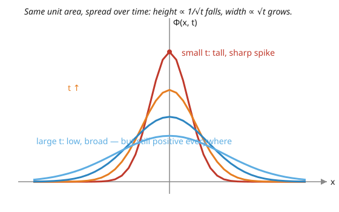

# Partial Differential Equations · Lesson 4.2: Solving the heat equation on the line — the heat kernel

> ⏱ ~15 min · Module 4: Transforms on unbounded domains · Builds on: [4.1 The Fourier transform](04-01-fourier-transform.md) · Unlocks: [4.3 The wave equation on the line and dispersion](04-03-wave-equation-line-dispersion.md)

## Why this matters

On a finite rod you expand the temperature in a Fourier *series* — discrete modes, each decaying at its own rate. But an infinite rod has no privileged length, so there are no discrete modes to sum. The Fourier *transform* replaces the series, and when you run it through the heat equation something beautiful drops out: a single universal Gaussian, the **heat kernel**, that tells you how a lump of heat spreads no matter what the initial profile was. It is the fundamental solution — solve for a point of heat once, and every other initial condition is just a superposition of point sources. The very same Gaussian governs Brownian motion and the free quantum particle, so this one calculation echoes through half of physics.

## The idea

Drop a hot pinprick of heat at one spot on a cold infinite wire and watch. Instantly it starts spreading into a bell-shaped bump. As time goes on the bump gets **wider and shorter** — but the total heat never changes, so the area under the bump stays fixed at whatever you deposited. That widening, flattening, area-preserving bell *is* the heat kernel.

Now the punchline: any initial temperature profile is just a dense row of pinpricks, each of different strength. Because the heat equation is linear, the answer is the sum of what every pinprick does on its own — each blossoming into its own bell. "Adding up a bell centered at every source point, weighted by the source strength" is exactly what a **convolution** is. So solving the heat equation on the line is nothing more than smearing the initial data against the spreading bell. No modes to track, no coefficients to compute — one integral.

## The formal version

We solve the initial-value problem on the whole line,

$$u_t = k\,u_{xx}, \qquad x \in \mathbb{R},\ t > 0, \qquad u(x,0) = u_0(x),$$

where $u(x,t)$ is the temperature at position $x$ and time $t$, and $k > 0$ is the **diffusivity** (how fast heat conducts).

**Step 1 — transform in $x$.** Write $\hat u(\xi,t) = \int_{-\infty}^{\infty} u(x,t)\,e^{-i\xi x}\,dx$ for the Fourier transform in the space variable, where $\xi$ is the frequency (wavenumber). From [4.1](04-01-fourier-transform.md), differentiating in $x$ becomes multiplying by $i\xi$, so $\widehat{u_{xx}} = -\xi^2 \hat u$, while the $t$-derivative just passes through the integral. The PDE becomes

$$\hat u_t = -k\,\xi^2\,\hat u.$$

In words: the transform turns the partial differential equation into an ordinary one — and it decouples, so each frequency $\xi$ evolves entirely on its own.

**Step 2 — solve the ODE.** For each fixed $\xi$ this is $\frac{d}{dt}\hat u = (-k\xi^2)\hat u$, an exponential decay:

$$\hat u(\xi,t) = \hat u_0(\xi)\,e^{-k\xi^2 t}.$$

In words: every frequency present in the initial data simply decays, and high frequencies (large $\xi$) decay *fastest* — sharp wiggles vanish first. That is diffusion's smoothing, made quantitative.

**Step 3 — invert.** The solution's transform is a *product*: $\hat u_0(\xi)$ times the factor $e^{-k\xi^2 t}$. By the convolution rule from [4.1](04-01-fourier-transform.md), a product in frequency is a convolution in space. And the factor $e^{-k\xi^2 t}$ is itself the transform of a Gaussian. Undoing the transform gives

$$\boxed{\,u(x,t) = \int_{-\infty}^{\infty} \Phi(x - y,\,t)\,u_0(y)\,dy\,}, \qquad \Phi(x,t) = \frac{1}{\sqrt{4\pi k t}}\;e^{-x^2/(4kt)}.$$

In words: the temperature now is a weighted average of the temperature then, using the bell-shaped weight $\Phi$ centered at $x$. The function $\Phi(x,t)$ is the **heat kernel** (or fundamental solution): it is the temperature produced by a single unit of heat placed at the origin at $t=0$. It is a Gaussian of total area $1$ for every $t>0$ (all the heat is conserved), with width growing like $\sqrt{kt}$ and peak height falling like $1/\sqrt{t}$.

## Picture

## Worked examples

**Example 1 (mechanical — the point source and its scaling).** Deposit one unit of heat at the origin: $u_0 = \delta$, the point source (Dirac spike). Convolving anything with $\delta$ leaves it unchanged, so

$$u(x,t) = \int_{-\infty}^{\infty}\Phi(x-y,t)\,\delta(y)\,dy = \Phi(x,t) = \frac{1}{\sqrt{4\pi k t}}\,e^{-x^2/(4kt)}.$$

The point source *is* the heat kernel. Now read off its two scalings. The **peak** sits at $x=0$:

$$u(0,t) = \frac{1}{\sqrt{4\pi k t}} \ \propto\ t^{-1/2},$$

so the hottest point cools like $1/\sqrt{t}$. The **width** is the Gaussian's standard deviation. Writing $\Phi \propto e^{-x^2/(2\sigma^2)}$ forces $2\sigma^2 = 4kt$, i.e. $\sigma = \sqrt{2kt} \propto \sqrt{t}$. Height down by $\sqrt{t}$, width up by $\sqrt{t}$: their product — the area, the total heat — stays fixed. This peak-and-width bookkeeping is the heart of Boss Problem 4.

**Example 2 (application — a hot slab).** Start with a block of material at temperature $1$ on $[-a,a]$ and $0$ outside: $u_0(y) = 1$ for $|y|\le a$, else $0$. The solution just integrates the kernel over the slab:

$$u(x,t) = \int_{-a}^{a} \frac{1}{\sqrt{4\pi k t}}\,e^{-(x-y)^2/(4kt)}\,dy.$$

Substitute $z = (y-x)/\sqrt{4kt}$, so $dy = \sqrt{4kt}\,dz$ and the constant $1/\sqrt{4\pi kt}$ collapses to $1/\sqrt{\pi}$:

$$u(x,t) = \frac{1}{\sqrt{\pi}}\int_{(-a-x)/\sqrt{4kt}}^{(a-x)/\sqrt{4kt}} e^{-z^2}\,dz = \frac{1}{2}\left[\operatorname{erf}\!\left(\frac{a-x}{\sqrt{4kt}}\right) + \operatorname{erf}\!\left(\frac{a+x}{\sqrt{4kt}}\right)\right],$$

using the error function $\operatorname{erf}(w) = \frac{2}{\sqrt{\pi}}\int_0^w e^{-z^2}\,dz$. The sharp edges of the slab immediately soften into smooth error-function ramps, and as $t\to\infty$ the whole thing melts into an ever-flatter bump — the same spreading Gaussian, seen through a wider source.

## Watch out

- **Infinite propagation speed.** For *any* $t>0$, $\Phi(x,t) > 0$ at *every* $x$, no matter how far. So the instant you touch the wire, the temperature a mile away is already (immeasurably, but genuinely) nonzero — heat "arrives" everywhere instantly. That is physically false (nothing outruns light), but it is the honest consequence of the diffusion model. Contrast the wave equation of [4.3](04-03-wave-equation-line-dispersion.md), where signals travel at a strict finite speed.
- **Diffusive scaling, not ballistic.** The bump's width grows like $\sqrt{kt}$, so features spread as $x \sim \sqrt{t}$ — to travel twice as far, wait *four* times as long. Do not confuse this with a wave's $x \sim t$. Diffusion is a dawdler that never stops but slows down forever.
- **It is a probability density, and you can't rewind it.** $\Phi$ has mass $1$ and is the exact Gaussian of a random walk's displacement — diffusion and probability are the same mathematics. And because high frequencies were *killed* (the $e^{-k\xi^2 t}$ factor destroys information), you cannot recover them: running the heat equation backward is ill-posed, exactly the failure flagged in [1.5](01-05-characteristics-well-posedness.md).

## One-liner

> Solving heat on the line is convolving the initial data with a Gaussian that spreads like $\sqrt{t}$ and shrinks like $1/\sqrt{t}$ — mass conserved, sharpness erased, and never reversible.

## Problems

**P1 (🟢)** One unit of heat is released at the origin of an infinite wire with $k=1$, giving $u(x,t)=\Phi(x,t)$. (a) The peak temperature at $t=1$ is $\Phi(0,1)$. At what later time has the peak dropped to *half* that value? (b) By what factor has the width $\sqrt{2kt}$ grown by that time?

**P2 (🟡)** The initial temperature is the Gaussian bump $u_0(x)=e^{-x^2}$. Using the transform method — the transform of $e^{-x^2}$ is $\sqrt{\pi}\,e^{-\xi^2/4}$, and $\hat u(\xi,t)=\hat u_0(\xi)\,e^{-k\xi^2 t}$ — find $u(x,t)$ in closed form, and confirm it reduces to $u_0$ at $t=0$.

**P3 (🔴, optional)** Verify directly that the heat kernel is a solution: show $\Phi_t = k\,\Phi_{xx}$ for the given $\Phi(x,t)=\frac{1}{\sqrt{4\pi k t}}e^{-x^2/(4kt)}$, and show $\int_{-\infty}^{\infty}\Phi(x,t)\,dx = 1$ for every $t>0$.

Solutions

**P1** (a) With $k=1$, the peak is $\Phi(0,t) = \dfrac{1}{\sqrt{4\pi t}} \propto t^{-1/2}$. Halving it means multiplying $t^{-1/2}$ by $\tfrac12$, i.e. multiplying $t$ by $4$. Since it halves relative to $t=1$, this happens at $t = 4$. (b) The width $\sqrt{2kt}=\sqrt{2t}$ scales as $\sqrt{t}$, so going from $t=1$ to $t=4$ multiplies it by $\sqrt{4}=2$. Peak halved, width doubled — product (area) unchanged, as it must be.

**P2** By the derivation, $\hat u(\xi,t) = \sqrt{\pi}\,e^{-\xi^2/4}\cdot e^{-k\xi^2 t} = \sqrt{\pi}\,e^{-\xi^2(1+4kt)/4}.$ We need the function whose transform this is. Recall the general Gaussian pair: the transform of $e^{-ax^2}$ is $\sqrt{\pi/a}\,e^{-\xi^2/(4a)}$. Matching exponents, $\frac{1}{4a} = \frac{1+4kt}{4}$ gives $a = \frac{1}{1+4kt}$. Then

$$\hat u(\xi,t) = \sqrt{\pi}\,e^{-\xi^2/(4a)} = \sqrt{\pi}\cdot \sqrt{\tfrac{a}{\pi}}\left(\sqrt{\tfrac{\pi}{a}}\,e^{-\xi^2/(4a)}\right) = \sqrt{a}\,\cdot\widehat{e^{-ax^2}},$$

so by linearity $u(x,t) = \sqrt{a}\,e^{-ax^2}$, that is

$$u(x,t) = \frac{1}{\sqrt{1+4kt}}\;\exp\!\left(-\frac{x^2}{1+4kt}\right).$$

At $t=0$ this is $e^{-x^2}=u_0$. ✓ As $t$ grows the amplitude falls like $t^{-1/2}$ and the bump widens — the initial Gaussian just keeps spreading, which makes sense since convolving a Gaussian with the (Gaussian) kernel adds their variances.

**P3** *It solves the equation.* Write $\Phi = (4\pi k t)^{-1/2} e^{-x^2/(4kt)}$. Differentiate in $t$ (product of $t^{-1/2}$ and the exponential, whose exponent is $-x^2/(4kt)$ with $t$-derivative $+x^2/(4kt^2)$):

$$\Phi_t = \Phi\left(-\frac{1}{2t} + \frac{x^2}{4kt^2}\right).$$

For the space side, $\Phi_x = \Phi\cdot\left(-\dfrac{x}{2kt}\right)$, and differentiating again by the product rule,

$$\Phi_{xx} = \Phi\left(-\frac{1}{2kt}\right) + \left(-\frac{x}{2kt}\right)\Phi_x = \Phi\left(-\frac{1}{2kt} + \frac{x^2}{4k^2t^2}\right).$$

Multiply by $k$: $\;k\,\Phi_{xx} = \Phi\left(-\dfrac{1}{2t} + \dfrac{x^2}{4kt^2}\right) = \Phi_t.$ ✓

*It has mass $1$.* Substitute $z = x/\sqrt{4kt}$, $dx = \sqrt{4kt}\,dz$:

$$\int_{-\infty}^{\infty}\frac{1}{\sqrt{4\pi kt}}e^{-x^2/(4kt)}\,dx = \frac{1}{\sqrt{4\pi kt}}\cdot\sqrt{4kt}\int_{-\infty}^{\infty}e^{-z^2}\,dz = \frac{1}{\sqrt{\pi}}\cdot\sqrt{\pi} = 1,$$

using the standard Gaussian integral $\int_{-\infty}^{\infty}e^{-z^2}dz=\sqrt{\pi}$. The $t$ cancels completely: total heat is conserved for all time. ✓

## Flashback

**From Lesson 4.1 (The Fourier transform):** Given that the transform of $f(x)=e^{-x^2/2}$ is $\hat f(\xi)=\sqrt{2\pi}\,e^{-\xi^2/2}$, use the derivative property $\widehat{f'}(\xi)=i\xi\,\hat f(\xi)$ to find the Fourier transform of $g(x)=x\,e^{-x^2/2}$.

Solution

Notice $g$ is essentially the derivative of $f$: since $f'(x) = -x\,e^{-x^2/2}$, we have $g(x) = -f'(x)$. Therefore

$$\hat g(\xi) = -\widehat{f'}(\xi) = -\,i\xi\,\hat f(\xi) = -\,i\xi\,\sqrt{2\pi}\,e^{-\xi^2/2}.$$

The clean lesson: multiplying by $x$ in space corresponds (up to $\pm i$) to differentiating in frequency — the mirror image of the derivative rule we just used to turn the heat equation into an ODE.

## Connections

- **Backward:** this is [4.1](04-01-fourier-transform.md) doing real work — the derivative rule ($\partial_x \to i\xi$) turned the PDE into an ODE, and the convolution rule turned the answer back into an integral against the kernel. The equation itself was derived from conservation of energy in [2.1](02-01-heat-diffusion-equations.md); irreversibility echoes the backward-heat ill-posedness of [1.5](01-05-characteristics-well-posedness.md).
- **Forward:** [4.3](04-03-wave-equation-line-dispersion.md) runs the identical transform on the Schrödinger and wave equations. Schrödinger is *this exact calculation with an imaginary diffusivity* $k \to i\hbar/2m$: the decaying factor $e^{-k\xi^2 t}$ becomes an oscillating $e^{-i(\cdots)\xi^2 t}$, so instead of smoothing it **disperses** — the Boss-Problem-4 punchline. The point-source idea reappears as Green's functions/fundamental solutions in [5.1](05-01-dirac-delta-distributions.md) and [5.2](05-02-greens-functions-poisson.md).
- **Sideways:** the heat kernel is the Gaussian of a **random walk** — the position of a diffusing particle after time $t$ is distributed exactly as $\Phi(\cdot,t)$. That bridge is made explicit in [`probability-theory`](../../probability-theory/syllabus.md) (Brownian motion, the central limit theorem) and [`stat-mech`](../../stat-mech/syllabus.md) (diffusion from microscopic random motion), and the imaginary-$k$ version is the free-particle propagator in [`quantum-mechanics`](../../quantum-mechanics/syllabus.md).
