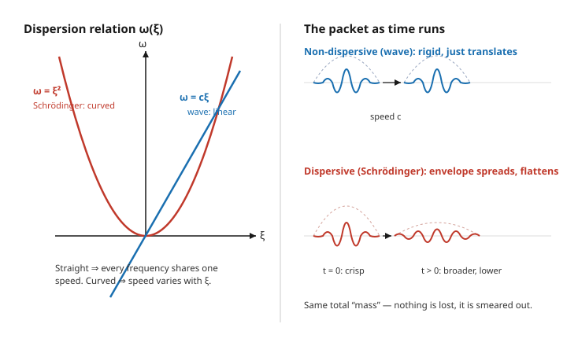

# Partial Differential Equations · Lesson 4.3: The wave equation on the line and dispersion

> ⏱ ~15 min · Module 4: Transforms on unbounded domains · Builds on: [4.2 Solving the heat equation on the line: the heat kernel](04-02-heat-equation-line-heat-kernel.md) · Unlocks: [4.4 The Laplace transform for evolution problems](04-04-laplace-transform-evolution.md)

## Why this matters

Drop a pebble in a pond and the ripple spreads into a widening train of wiggles; shout across a canyon and the echo comes back as a crisp *copy* of your voice, not a smeared mush. Same word — "wave" — two completely different fates. The difference is **dispersion**: whether the frequencies a signal is built from all travel at the same speed or not. The plain wave equation is the rare case where they *do*, which is exactly why it preserves shapes (and why d'Alembert's formula could be so clean). Almost everything else — quantum wave packets, deep-water swell, light in glass — disperses, and the Fourier transform is the tool that lets you read a packet's fate straight off the equation.

## The idea

A Fourier transform breaks any profile into pure sine waves, one per wavenumber $\xi$. Time evolution under a linear PDE does something beautifully simple to each pure wave: it just makes it oscillate, $e^{-i\omega t}$, at a frequency $\omega$ that depends on $\xi$. That single relationship $\omega(\xi)$ — the **dispersion relation** — is the entire personality of the equation.

Here is the whole lesson in one picture. A traveling sine wave $e^{i(\xi x - \omega t)}$ moves at speed $\omega/\xi$. If $\omega = c\xi$ (a *straight line* through the origin), then $\omega/\xi = c$ for **every** frequency — short wiggles and long swells march in perfect lockstep. Stack them into a packet and the packet holds its shape and glides at $c$. That is the wave equation, and it is **non-dispersive**.

But if $\omega(\xi)$ is *curved* — say $\omega = \xi^2$ — then different frequencies travel at different speeds. The fast components pull ahead, the slow ones lag, and the packet, which needed all of them to stay bundled, **spreads out**. That is the free Schrödinger equation, and it is **dispersive**. No energy is lost; the wave is simply smeared across more space.

## The formal version

Use the transform convention $\hat u(\xi) = \int_{-\infty}^{\infty} u(x)\,e^{-i\xi x}\,dx$, with the rule from [4.1](04-01-fourier-transform.md) that differentiating in $x$ becomes multiplying in $\xi$: $\partial_x \to i\xi$, so $\partial_x^2 \to -\xi^2$.

**Dispersion relation.** Substitute the single plane wave $u = e^{i(\xi x - \omega t)}$ into a PDE and cancel the exponential; what survives is an algebraic equation linking $\omega$ and $\xi$, written $\omega = \omega(\xi)$.

*In words:* it is the frequency at which a pure wave of wavenumber $\xi$ is forced to vibrate — the PDE's "speed chart," one entry per wavelength.

**Phase velocity and group velocity.**

$$v_p(\xi) = \frac{\omega(\xi)}{\xi}, \qquad v_g(\xi) = \frac{d\omega}{d\xi}.$$

*In words:* $v_p$ is the speed of an individual crest; $v_g$ is the speed of the **envelope** — the bump that bundles the wiggles together. Energy and information ride at the group velocity, not the phase velocity.

**The dichotomy.** If $\omega(\xi)$ is linear, $\omega = c\xi$, then $v_p = v_g = c$: all speeds coincide and the medium is **non-dispersive** (packets keep their shape). If $\omega(\xi)$ is nonlinear, then $v_p$ and $v_g$ vary with $\xi$: the medium is **dispersive** (packets spread).

*In words:* straight dispersion line $\Rightarrow$ rigid packet; bent dispersion curve $\Rightarrow$ spreading packet.

## Picture

## Worked examples

**Example 1 (the wave equation — and how d'Alembert falls out).** Transform $u_{tt} = c^2 u_{xx}$ in $x$. Using $\partial_x^2 \to -\xi^2$,

$$\hat u_{tt}(\xi,t) = -c^2\xi^2\,\hat u(\xi,t).$$

For each fixed $\xi$ this is just the harmonic-oscillator ODE $\ddot y = -(c\xi)^2 y$, with solution

$$\hat u(\xi,t) = A(\xi)\,e^{ic\xi t} + B(\xi)\,e^{-ic\xi t},$$

where $A,B$ are fixed by the initial data. Now invert, pulling the $t$-factor inside the exponential:

$$u(x,t) = \frac{1}{2\pi}\int_{-\infty}^{\infty}\!\Big[A(\xi)\,e^{i\xi(x+ct)} + B(\xi)\,e^{i\xi(x-ct)}\Big]\,d\xi = F(x+ct) + G(x-ct).$$

The first integral is *some* function evaluated at $x+ct$, the second at $x-ct$ — precisely **d'Alembert's solution** from [2.2](02-02-wave-equation-dalembert.md), now derived rather than guessed. Reading off the dispersion relation: the plane wave $e^{i(\xi x - \omega t)}$ gives $-\omega^2 = -c^2\xi^2$, so $\omega = \pm c\xi$. Hence $v_p = \omega/\xi = \pm c$ and $v_g = d\omega/d\xi = \pm c$: **equal, and independent of $\xi$**. Every frequency travels at $c$, the packet is rigid — non-dispersive, exactly as the shape-preserving $F$ and $G$ told us.

**Example 2 (the free Schrödinger equation — a packet that spreads).** Take $i\psi_t = -\psi_{xx}$ (units chosen so the constants vanish). Transform in $x$: since $-\psi_{xx} \to \xi^2\hat\psi$,

$$i\,\hat\psi_t = \xi^2\,\hat\psi \quad\Longrightarrow\quad \hat\psi_t = -i\xi^2\,\hat\psi \quad\Longrightarrow\quad \hat\psi(\xi,t) = \hat\psi_0(\xi)\,e^{-i\xi^2 t}.$$

So the dispersion relation is $\omega = \xi^2$ — a **parabola**, not a line. The velocities now depend on $\xi$: $v_p = \omega/\xi = \xi$ while $v_g = d\omega/d\xi = 2\xi$. They disagree (the crests move at half the envelope's speed), and both change with frequency — the fingerprint of dispersion.

Watch it spread. Start with the Gaussian packet $\psi_0(x) = e^{-x^2/2}$, whose transform is $\hat\psi_0(\xi) = \sqrt{2\pi}\,e^{-\xi^2/2}$. Then

$$\hat\psi(\xi,t) = \sqrt{2\pi}\,e^{-\xi^2/2}\,e^{-i\xi^2 t} = \sqrt{2\pi}\,e^{-\left(\frac{1}{2}+it\right)\xi^2}.$$

Inverting with the Gaussian integral $\frac{1}{2\pi}\int e^{-\alpha\xi^2}e^{i\xi x}\,d\xi = \frac{1}{\sqrt{4\pi\alpha}}\,e^{-x^2/4\alpha}$ (here $\alpha = \tfrac{1}{2}+it$) gives, after taking the modulus squared,

$$|\psi(x,t)|^2 \;\propto\; \frac{1}{\sqrt{\tfrac14 + t^2}}\;\exp\!\left(-\frac{x^2}{1+4t^2}\right).$$

The width is $\sigma(t) = \sqrt{\tfrac{1+4t^2}{2}}$, which grows without bound as $t$ increases, while the peak height falls like $(\tfrac14+t^2)^{-1/2}$ so that the total $\int|\psi|^2\,dx$ stays constant. The packet **broadens and flattens but never dissipates** — the payoff promised by [4.2](04-02-heat-equation-line-heat-kernel.md)'s note that Schrödinger is the heat equation in imaginary time: the imaginary $it$ in $\alpha$ makes the exponent *oscillate and spread* instead of *decay and smooth*.

## Watch out

- **The wave equation is the exception, not the rule.** Its non-dispersiveness comes entirely from the dispersion line being *straight*. Add almost anything — a mass term ($u_{tt} = c^2u_{xx} - m^2u$, Klein–Gordon), stiffness ($u_{tt} = -u_{xxxx}$, a beam) — and $\omega(\xi)$ bends and the medium disperses. Do not expect shape preservation from a "wave-like" equation without checking the dispersion relation.
- **Phase velocity $\neq$ group velocity in general.** The crests you see moving are not carrying the signal; the envelope is, at $v_g = d\omega/d\xi$. Confusing the two is the classic error — for Schrödinger the crests ($v_p=\xi$) crawl at half the envelope's pace ($v_g = 2\xi$).
- **Dispersion is not dissipation.** A dispersing packet loses no energy — it is a *reversible* spreading (run $t$ backwards and it re-focuses). This is unlike the heat equation, whose real exponent $e^{-\xi^2 t}$ genuinely destroys the high-frequency content. Dispersion rearranges; diffusion erases.

## One-liner

> Read the dispersion relation $\omega(\xi)$ off the PDE: straight line $\Rightarrow$ every frequency shares one speed and the packet is rigid; any curve $\Rightarrow$ frequencies race apart and the packet spreads.

## Problems

**P1 (🟢)** For the free Schrödinger equation $i\psi_t = -\psi_{xx}$ you found $\omega(\xi) = \xi^2$. Compute the phase velocity $v_p$ and group velocity $v_g$ at wavenumber $\xi$, and state the exact relationship between them.

**P2 (🟡)** The Klein–Gordon equation $u_{tt} = c^2 u_{xx} - m^2 u$ ($m>0$ a constant) governs a relativistic massive field. Plug in $u = e^{i(\xi x - \omega t)}$ to find its dispersion relation $\omega(\xi)$. Is it dispersive? Compute $v_p$ and $v_g$ and verify the identity $v_p\,v_g = c^2$.

**P3 (🔴, optional)** The linearized Korteweg–de Vries (Airy) equation is $u_t = u_{xxx}$. Find $\omega(\xi)$, the phase velocity, and the group velocity. Is it dispersive? In which direction ($+x$ or $-x$) does a localized bump's envelope move?

Solutions

**P1** With $\omega = \xi^2$:

$$v_p = \frac{\omega}{\xi} = \frac{\xi^2}{\xi} = \xi, \qquad v_g = \frac{d\omega}{d\xi} = 2\xi.$$

So $v_g = 2v_p$: the envelope travels at exactly twice the speed of the individual crests. Because both depend on $\xi$, the equation is dispersive.

**P2** Substitute $u = e^{i(\xi x - \omega t)}$. The left side gives $u_{tt} = (-i\omega)^2 u = -\omega^2 u$. The right side gives $c^2(i\xi)^2 u - m^2 u = (-c^2\xi^2 - m^2)u$. Cancelling $u$:

$$-\omega^2 = -c^2\xi^2 - m^2 \quad\Longrightarrow\quad \omega(\xi) = \sqrt{c^2\xi^2 + m^2}.$$

This is a curved (non-linear) relation — a hyperbola-shaped branch, not a straight line — so the equation **is dispersive** (when $m>0$; setting $m=0$ recovers the straight line $\omega = c\xi$ of the pure wave equation). Now

$$v_p = \frac{\omega}{\xi} = \frac{\sqrt{c^2\xi^2+m^2}}{\xi}, \qquad v_g = \frac{d\omega}{d\xi} = \frac{c^2\xi}{\sqrt{c^2\xi^2+m^2}}.$$

Their product:

$$v_p\,v_g = \frac{\sqrt{c^2\xi^2+m^2}}{\xi}\cdot\frac{c^2\xi}{\sqrt{c^2\xi^2+m^2}} = c^2.$$

(Note $v_g < c < v_p$ here: the crests outrun $c$ but the envelope — carrying the signal — never does.)

**P3** Substitute $u = e^{i(\xi x - \omega t)}$. Then $u_t = -i\omega\,u$ and $u_{xxx} = (i\xi)^3 u = -i\xi^3 u$. The equation $u_t = u_{xxx}$ becomes $-i\omega = -i\xi^3$, so

$$\omega(\xi) = \xi^3.$$

Cubic, hence strongly dispersive. The velocities are

$$v_p = \frac{\omega}{\xi} = \xi^2, \qquad v_g = \frac{d\omega}{d\xi} = 3\xi^2.$$

Both are **positive** for every $\xi \neq 0$, so all components — and the envelope — move in the $+x$ direction, with the envelope ($3\xi^2$) three times faster than the crests ($\xi^2$). The bump propagates rightward while shedding a dispersive, oscillatory tail.

## Flashback

**From Lesson 4.2 (the heat kernel):** Solve the heat equation $u_t = u_{xx}$ on the line with initial data $u(x,0) = e^{-x^2}$ using the Fourier transform. Find the width of the solution as a function of $t$, and say — in one sentence — how its long-time behavior differs from the Schrödinger packet of Example 2.

Solution

Transform in $x$: $\hat u_t = -\xi^2\hat u$, so $\hat u(\xi,t) = \hat u_0(\xi)\,e^{-\xi^2 t}$. The data $e^{-x^2}$ has transform $\hat u_0(\xi) = \sqrt{\pi}\,e^{-\xi^2/4}$, giving

$$\hat u(\xi,t) = \sqrt{\pi}\,e^{-\xi^2\left(\frac14 + t\right)}.$$

Invert with the Gaussian integral $\frac{1}{2\pi}\int e^{-\alpha\xi^2}e^{i\xi x}\,d\xi = \frac{1}{\sqrt{4\pi\alpha}}e^{-x^2/4\alpha}$, now with the **real** $\alpha = \tfrac14 + t$:

$$u(x,t) = \frac{1}{2\sqrt{\tfrac14 + t}}\;\exp\!\left(-\frac{x^2}{1+4t}\right).$$

The width is $\sigma(t) = \sqrt{\tfrac{1+4t}{2}}$, growing like $\sqrt{t}$, and the peak decays like $(\tfrac14+t)^{-1/2}$ so that $\int u\,dx = \sqrt{\pi}$ stays fixed. **Difference:** because $\alpha$ is *real*, the exponent decays and the solution genuinely smooths (a diffusive $\sqrt{t}$ spread with irreversible loss of sharp features); the Schrödinger packet's *imaginary* $it$ makes it spread faster (width $\sim t$) and reversibly, with no smoothing — same Gaussian machinery, opposite physics.

## Connections

- **Backward:** Example 1 re-derives d'Alembert's traveling-wave solution from [2.2](02-02-wave-equation-dalembert.md), now *explained* — shapes are preserved precisely because the dispersion line $\omega = c\xi$ is straight. The transform mechanics are [4.1](04-01-fourier-transform.md); the imaginary-time link to [4.2](04-02-heat-equation-line-heat-kernel.md)'s heat kernel is made literal in Example 2.
- **Forward:** [4.4](04-04-laplace-transform-evolution.md) treats evolution with the Laplace transform; dispersion returns whenever a nonlinear $\omega(\xi)$ appears, including the shock-forming nonlinear waves of [6.1](06-01-nonlinear-shocks-burgers.md).
- **Sideways (quantum mechanics):** Example 2 *is* the reason a free particle's wave packet spreads over time — the position of an unwatched electron grows more uncertain because $\omega = \xi^2$ is curved. See [quantum-mechanics](../../quantum-mechanics/syllabus.md).
- **Sideways (fluids):** deep-water gravity waves obey $\omega = \sqrt{g\xi}$, another curved relation — which is why a ship's wake fans out into long swells ahead and short ripples behind, sorted by speed. See [fluid-dynamics](../../fluid-dynamics/syllabus.md).
- **Sideways (optics):** light of different colors travels at different speeds in glass (a curved $\omega(\xi)$), so a prism splits white light and a fiber-optic pulse broadens — the same dispersion, in a medium. See [em-refresher](../../em-refresher/syllabus.md).
