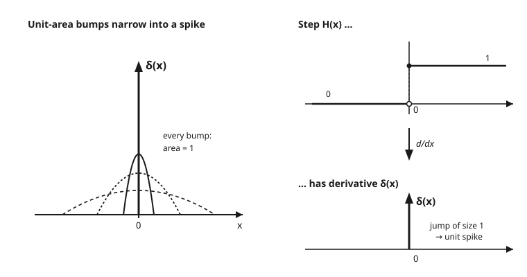

# Partial Differential Equations · Lesson 5.1: The Dirac delta and distributions, lightly

> ⏱ ~15 min · Module 5: Green's functions and distributions · Builds on: [4.4 The Laplace transform for evolution problems](04-04-laplace-transform-evolution.md) · Unlocks: [5.2 Green's functions for Poisson's equation](05-02-greens-functions-poisson.md)

## Why this matters

Nature loves point sources: a charge sitting at one spot, a hammer tap on a string, a unit of heat dumped at an instant. Each is "all of something, concentrated at nothing" — infinite density on a zero-width region. No ordinary function can hold that shape, yet the physics is perfectly sensible. The **Dirac delta** $\delta(x)$ is the object built to carry it, and it comes bundled with a bonus: it lets you *differentiate things that have corners and jumps* — which is exactly what you need to solve a PDE forced by a point source. The whole apparatus of Green's functions (the next three lessons) is "solve the equation with a $\delta$ on the right, then build every other answer from that one." So this is the doorway.

## The idea

Picture a bump of unit area — total area exactly $1$ — sitting over the origin. Now squeeze it: make it narrower, and to keep the area at $1$ it has to grow taller. Squeeze again. Taller, thinner, still area $1$. Push this to the limit and you get an object infinitely tall, infinitely thin, still enclosing area $1$. That's $\delta(x)$.

The trap is to ask "what is its *value* at $0$?" There is no honest answer — the heights ran off to infinity. The right question is: **what does $\delta$ do when you integrate it against something?** Multiply $\delta(x)$ by a smooth function $\varphi(x)$ and integrate. Because $\delta$ is zero everywhere except a razor-thin spike at $0$, the product only "sees" $\varphi$ right at the origin, and the unit area picks off exactly that value:

$$\int_{-\infty}^{\infty} \delta(x)\,\varphi(x)\,dx = \varphi(0).$$

The delta **samples** $\varphi$ at a single point. That's it — that's the whole definition, and it's an *action*, not a value. This is the mental shift of the lesson: some objects are defined not by what they *are* at each point, but by what they *do* under an integral. Such objects are called **distributions** (or generalized functions), and $\delta$ is the most important one.

## The formal version

**The sifting property (the definition).** For every smooth, rapidly-decaying test function $\varphi$,

$$\int_{-\infty}^{\infty} \delta(x-a)\,\varphi(x)\,dx = \varphi(a).$$

In words: $\delta(x-a)$ reaches into the integral and pulls out the value of $\varphi$ at the single point $x=a$ — it *sifts* $\varphi$ like sand through a sieve with one hole. Setting $\varphi \equiv 1$ (on a window around $a$) gives the total strength, $\int \delta = 1$: the spike carries exactly one unit.

**What a distribution is.** A **test function** is a smooth $\varphi$ that dies off at infinity. A **distribution** $T$ is a rule that eats a test function and returns a number, written $\langle T,\varphi\rangle$, and does so *linearly* and *continuously*. In words: a distribution is not a graph you can plot — it's a well-behaved measuring device for probing smooth functions. Ordinary functions $f$ are distributions too, via $\langle f,\varphi\rangle = \int f\varphi\,dx$; the delta is the one that *isn't* an ordinary function, defined directly by $\langle \delta,\varphi\rangle = \varphi(0)$.

**The weak (distributional) derivative.** Define the derivative of a distribution $T$ by handing the derivative to the test function instead:

$$\langle T',\varphi\rangle = -\,\langle T,\varphi'\rangle.$$

In words: you can't differentiate $T$ directly, so you *move the derivative onto the smooth $\varphi$*, paying one minus sign. This is just integration by parts with the boundary terms gone (test functions vanish at infinity): $\int T'\varphi = -\int T\varphi'$. The payoff — the reason we bother — is that **every distribution is now infinitely differentiable**, even ones with jumps and corners.

**The headline identity.** Let $H(x)$ be the Heaviside step: $H(x)=0$ for $x<0$, $H(x)=1$ for $x>0$. Then

$$H'(x) = \delta(x).$$

In words: the derivative of a unit jump is a unit spike. Classically $H'$ is $0$ where it's defined and undefined at the jump — useless. Distributionally it's exactly $\delta$, and this *extends* the classical derivative: wherever a function is genuinely differentiable, the weak derivative agrees with the ordinary one; at a jump of height $c$ it adds a $c\,\delta$.

*(Aside on units: since $\int \delta(x)\,dx = 1$ is dimensionless and $dx$ carries a length, $\delta(x)$ must have dimensions of $1/\text{length}$ — it is a density, not a number.)*

## Picture

## Worked examples

**Example 1 (mechanical — sifting, and the derivative of a delta).**

*(a)* Straight sifting picks off the value at the spike:

$$\int_{-\infty}^{\infty} \delta(x-2)\,(x^2+1)\,dx = (2^2+1) = 5.$$

The integrand's messy — you never actually integrate it. You read off $\varphi(2)$.

*(b)* Now $\delta'$, using the weak-derivative rule (move the derivative to $\varphi$, pay a minus sign). Take $\varphi(x)=x^3$:

$$\int_{-\infty}^{\infty} \delta'(x)\,\varphi(x)\,dx = -\int_{-\infty}^{\infty}\delta(x)\,\varphi'(x)\,dx = -\varphi'(0).$$

With $\varphi(x)=x^3$, $\varphi'(x)=3x^2$, so the answer is $-3(0)^2 = 0$. In general $\int \delta'\varphi = -\varphi'(0)$: $\delta'$ samples *minus the slope* at the origin. That single minus sign is the whole content of "differentiating a distribution."

**Example 2 (why you'd care — a PDE with a point source, previewing Green's functions).** Solve, on the whole line, with $u\to 0$ decay-controlled at $\pm\infty$,

$$-u''(x) = \delta(x).$$

Read it physically: a taut string pinned nowhere, poked by a unit point force at the origin — what shape does it take? Away from $0$ the right side is zero, so $u''=0$ and $u$ is linear on each side: a straight line for $x<0$, another for $x>0$, meeting at the origin. By symmetry take $u(x)=-\tfrac{1}{2}|x|+\text{const}$; drop the constant. Check the spike. The first derivative is

$$u'(x) = -\tfrac{1}{2}\,\text{sgn}(x) \quad\Longrightarrow\quad u'(0^+)-u'(0^-) = -\tfrac{1}{2}-\big(+\tfrac{1}{2}\big) = -1.$$

So $u'$ has a downward jump of size $1$ at the origin — and the derivative of a jump of size $-1$ is $-\delta$, giving $u'' = -\delta$, i.e. $-u''=\delta$. ✓

$$\boxed{u(x) = -\tfrac{1}{2}|x|}$$

A tent — a straight kink with a corner at the source. That corner *is* the point force: no corner, no delta. This is the Green's function of $-\frac{d^2}{dx^2}$ on the line, and Lesson 5.2 does exactly this in higher dimensions.

## Watch out

- **You might think** $\delta$ is "$\infty$ at $0$ and $0$ elsewhere." **Actually** that's a heuristic that no honest integral respects — $\delta$ is *defined* by the sifting property $\int\delta\varphi=\varphi(0)$, full stop. Its pointwise "value" is not a thing; its action is.
- **You might think** a jump discontinuity has no derivative. **Actually** the distributional derivative *extends* the classical one and hands you $\delta$ at the jump. But count derivatives carefully: a *jump in the value* gives a $\delta$ in the *first* derivative; a *corner* (kink in the graph, like $|x|$) is one order smoother, so its $\delta$ shows up in the *second* derivative.
- **You might think** $\delta'$ is meaningless. **Actually** it's perfectly defined — integrate by parts to move the derivative onto $\varphi$: $\int\delta'\varphi=-\varphi'(0)$. That's the only way $\delta'$ ever appears, and it's how *all* distributional derivatives are defined.
- **You might think** the total under $\delta$ could be anything. **Actually** it's exactly $1$ ($\int\delta=1$) — that's the "unit" in unit point source. A source of strength $Q$ is $Q\,\delta$.

## One-liner

> $\delta$ isn't a function you evaluate — it's the instruction "sample here," and once you let derivatives land on the test function instead, even jumps and corners become differentiable.

## Problems

**P1 (🟢)** Evaluate each:
(a) $\displaystyle\int_{-\infty}^{\infty} \delta(x-\pi)\cos x\,dx$,  (b) $\displaystyle\int_{0}^{\infty} \delta(x-3)\,e^{-x}\,dx$,  (c) $\displaystyle\int_{-\infty}^{\infty} \delta(x+1)\,(x^2+2x)\,dx$.

**P2 (🟡)** Let $f(x)=|x|$. Find $f'(x)$ and $f''(x)$ as distributions, and identify each. (Hint: $|x|$ has a *corner*, not a jump.)

**P3 (🔴, optional)** Solve $-u''(x) = 3\,\delta(x-1)$ on the line with $u\to 0$-type decay, by the Example-2 method. What is the size and direction of the jump in $u'$ at $x=1$?

Solutions

**P1** Pure sifting — read off the test function at the spike, and check the spike lies inside the integration window.
(a) spike at $x=\pi$: $\cos\pi = -1$.
(b) spike at $x=3$, which is inside $(0,\infty)$: $e^{-3}$.
(c) spike at $x=-1$: $\varphi(-1)=(-1)^2+2(-1)=1-2=-1$.

**P2** For $x\neq 0$, $|x|$ is differentiable with slope $\pm 1$, so
$$f'(x)=\text{sgn}(x)=\begin{cases}-1 & x<0\\ +1 & x>0\end{cases},$$
the **sign function**. Now $\text{sgn}(x)$ has a *jump* of size $2$ at the origin (from $-1$ up to $+1$), and the derivative of a jump of size $c$ is $c\,\delta$, so
$$f''(x)=2\,\delta(x).$$
Check by the weak definition: $\langle f'',\varphi\rangle=\langle f,\varphi''\rangle=\int_{-\infty}^{\infty}|x|\varphi''\,dx$. Split at $0$ and integrate by parts twice on each side (boundary terms at $\pm\infty$ vanish); the surviving terms combine to $2\varphi(0)=\langle 2\delta,\varphi\rangle$. ✓ So $|x|$: value continuous, first derivative jumps, second derivative is a delta — the corner shows up two derivatives down.

**P3** Away from $x=1$, $u''=0$, so $u$ is linear on each side, continuous at $1$, decaying — the tent shape centered at the source: $u(x)=-\tfrac{3}{2}|x-1|$ (plus an ignorable constant). Then
$$u'(x)=-\tfrac{3}{2}\,\text{sgn}(x-1),\qquad u'(1^+)-u'(1^-)=-\tfrac{3}{2}-\big(+\tfrac{3}{2}\big)=-3.$$
So $u'$ jumps **down by $3$** across the source. That downward jump of $-3$ differentiates to $-3\delta(x-1)$, giving $u''=-3\delta(x-1)$, i.e. $-u''=3\delta(x-1)$. ✓ The jump in $u'$ equals (minus) the source strength — the exact interface condition Green's functions are built on.

## Flashback

**From Lesson 4.1 (The Fourier transform):** Using the transform convention $\hat f(k)=\int_{-\infty}^{\infty} f(x)\,e^{-ikx}\,dx$, compute the Fourier transform of $f(x)=e^{-a|x|}$ for a constant $a>0$. (This is the "smoothed spike" whose $a\to\infty$ limit hints at the delta's transform.)

Solution

Split at $0$ so $|x|$ becomes $\mp x$ and each piece is a clean exponential:
$$\hat f(k)=\int_{-\infty}^{0} e^{ax}e^{-ikx}\,dx + \int_{0}^{\infty} e^{-ax}e^{-ikx}\,dx = \int_{-\infty}^{0} e^{(a-ik)x}\,dx + \int_{0}^{\infty} e^{-(a+ik)x}\,dx.$$
Each is a convergent exponential (since $a>0$):
$$= \frac{1}{a-ik} + \frac{1}{a+ik} = \frac{(a+ik)+(a-ik)}{(a-ik)(a+ik)} = \frac{2a}{a^2+k^2}.$$
So $\widehat{e^{-a|x|}}(k)=\dfrac{2a}{a^2+k^2}$ — a Lorentzian. As $a\to\infty$ the spatial bump $e^{-a|x|}$ narrows toward a spike while its transform flattens toward a constant, foreshadowing the fact quoted below that $\hat\delta \equiv 1$: an infinitely sharp source contains all frequencies equally.

## Connections

- **Backward (4.1 — Fourier transform):** the delta's transform is $\hat\delta(k)=\int\delta(x)e^{-ikx}dx = e^{0}=1$ by sifting — a point source is an *equal blend of all frequencies*, which is why it's the universal building block. The flashback's $a\to\infty$ limit is this fact in slow motion.
- **Forward (5.2 — Green's functions for Poisson):** the Green's function $G$ solves $-\nabla^2 G=\delta$ — literally "the field of a unit point source." Example 2 already built the 1-D case ($-\tfrac12|x|$); 5.2 does 2-D and 3-D, and 5.3 (method of images) and 5.4 (Duhamel) both run on deltas as elementary sources.
- **Sideways (quantum-mechanics):** position eigenstates satisfy $\langle x|x'\rangle=\delta(x-x')$ — the delta *is* the continuous-basis orthonormality relation — and the **delta potential** $V(x)=-\alpha\,\delta(x)$ is the simplest bound-state model, its wavefunction kink mirroring Example 2's corner exactly. See the [quantum-mechanics syllabus](../../quantum-mechanics/syllabus.md).
- **Sideways (electromagnetism):** a point charge $q$ at the origin is the charge density $\rho(\mathbf x)=q\,\delta^3(\mathbf x)$, and Poisson's equation $-\nabla^2\phi=\rho/\varepsilon_0$ with that source *is* 5.2's Green's function computation. See the [em-refresher syllabus](../../em-refresher/syllabus.md).
- **Sideways (functional analysis):** distributions and weak derivatives are the rigorous foundation here — the "space of test functions and its dual," Sobolev spaces, and weak solutions of PDEs all start from the sifting-and-integrate-by-parts moves of this lesson. See the [functional-analysis syllabus](../../functional-analysis/syllabus.md).
