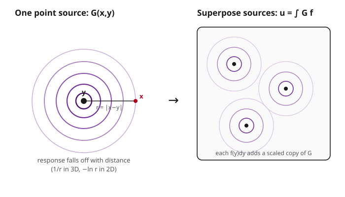

# Partial Differential Equations · Lesson 5.2: Green's functions for Poisson's equation

> ⏱ ~15 min · Module 5: Green's functions and distributions · Builds on: [5.1 The Dirac delta and distributions, lightly](05-01-dirac-delta-distributions.md) · Unlocks: [5.3 The method of images](05-03-method-of-images.md)

## Why this matters

Poisson's equation $-\nabla^2 u = f$ is the master equation of static fields: $f$ is a charge density and $u$ its electric potential, or $f$ a mass density and $u$ its gravitational potential, or $f$ a heat source and $u$ the steady temperature. Solving it fresh for every new source $f$ would be brutal. The Green's function is the shortcut that ends that labor forever: **solve the equation just once, for a single unit point source, and every other source is a sum of points.** Do the hard work one time; assemble all future answers by superposition. The very same object you build here — the potential of a point charge, $1/(4\pi r)$ — is the Coulomb potential of electrostatics and the Newtonian potential of gravity, arrived at from the PDE side.

## The idea

Imagine you want the temperature field produced by some messy distribution of tiny heaters spread through a room. Instead of attacking the whole distribution at once, ask a much smaller question first: *what field does one single point heater produce?* Call that answer $G$ — the response, everywhere, to a unit spike of source at one location.

Now the trick. A general source $f$ is just a crowd of point sources: the little chunk of source sitting near location $y$, of strength $f(y)\,dy$, throws off its own copy of the point-source field, scaled by that strength. Because the equation is **linear**, these responses don't interfere — they simply add. Total the contributions from every location and you have the full field:

$$u(x) = \int G(x,y)\, f(y)\, dy.$$

That integral is the whole idea. $G(x,y)$ is "the field felt at $x$ due to a unit source parked at $y$," and $u$ is the accumulation of all those point responses, each weighted by how much source actually sits at $y$. You solved one canonical problem and got a formula for every problem.

## The formal version

Let $L$ be a linear differential operator (for us, $L = -\nabla^2$). The **Green's function** $G(x,y)$ is defined by

$$L\,G(x,y) = \delta(x - y),$$

with $L$ acting on the $x$ variable, and $\delta$ the Dirac delta from [5.1](05-01-dirac-delta-distributions.md).

In words: $G$ is the response of the system to a unit point source placed at $y$ — the delta on the right is exactly "a spike of source, of total strength 1, concentrated at the single point $y$."

**The superposition theorem.** If $G$ solves $L\,G(x,y)=\delta(x-y)$, then

$$u(x) = \int G(x,y)\,f(y)\,dy \quad\text{solves}\quad L\,u = f.$$

In words: convolve the point-source response against the actual source and you get the actual field. The one-line proof is just moving $L$ inside the integral (it acts on $x$, the integral is over $y$) and using the delta's sifting property:

$$L\,u(x) = \int L\,G(x,y)\,f(y)\,dy = \int \delta(x-y)\,f(y)\,dy = f(x).\ \checkmark$$

**The free-space Green's function for $-\nabla^2$** (also called the *fundamental solution*) is the one on all of space with no boundaries, decaying at infinity where possible. With $r = |x-y|$:

$$G_{3D}(x,y) = \frac{1}{4\pi\,|x-y|}, \qquad G_{2D}(x,y) = -\frac{1}{2\pi}\,\ln|x-y|.$$

In words: in 3D the point-source potential falls off like $1/r$; in 2D it grows like $-\ln r$ (which actually *increases* with distance). These are the Newtonian/Coulomb potential of a unit point mass/charge — the PDE hands you the inverse-square law's potential for free.

## Picture

## Worked examples

**Example 1 (mechanical — verify $-\nabla^2 G = \delta$ in 3D).** Take $G = \dfrac{1}{4\pi r}$ with $r = |x - y|$; place the source at the origin so $r = |x|$. Two pieces must hold: $-\nabla^2 G = 0$ everywhere away from the source, and the source has unit strength.

*Away from the origin.* For a radial function, $\nabla^2 G = \dfrac{1}{r^2}\dfrac{d}{dr}\!\left(r^2 \dfrac{dG}{dr}\right)$. With $G = \frac{1}{4\pi} r^{-1}$, we get $\frac{dG}{dr} = -\frac{1}{4\pi} r^{-2}$, so $r^2\frac{dG}{dr} = -\frac{1}{4\pi}$, a constant, whose $r$-derivative is $0$. Hence $\nabla^2 G = 0$ for all $r > 0$. So $G$ is harmonic everywhere except at the source — no source is hiding out in the bulk.

*Unit strength via a flux argument.* We can't differentiate at $r=0$ directly (it blows up), so integrate instead. Take any small sphere $S_\varepsilon$ of radius $\varepsilon$ around the source and apply the divergence theorem to $-\nabla G$:

$$\int_{B_\varepsilon} (-\nabla^2 G)\, dV = \oint_{S_\varepsilon} (-\nabla G)\cdot \mathbf{n}\, dA.$$

The outward normal is radial, so $(-\nabla G)\cdot\mathbf n = -\frac{dG}{dr} = \frac{1}{4\pi r^2}$. On the sphere $r=\varepsilon$, this is constant, and the sphere's area is $4\pi\varepsilon^2$:

$$\oint_{S_\varepsilon} \frac{1}{4\pi r^2}\, dA = \frac{1}{4\pi \varepsilon^2}\cdot 4\pi\varepsilon^2 = 1.$$

The $\varepsilon$'s cancel — the flux is exactly $1$ for *every* sphere, no matter how small. So $-\nabla^2 G$ integrates to $1$ against any neighborhood of the source while vanishing away from it: that is precisely $\delta(x-y)$. Both pieces check out, and the constant $4\pi$ is exactly what makes the strength come out to $1$.

**Example 2 (why you'd care — potential of a source by superposition).** A total charge $Q$ is spread uniformly through a ball of radius $a$ (constant density $\rho = Q/(\frac{4}{3}\pi a^3)$). What is the potential $u$ *outside* the ball? The superposition formula says add up each chunk's point-source potential:

$$u(x) = \int G(x,y)\,\rho\, dV_y = \frac{\rho}{4\pi}\int_{\text{ball}} \frac{dV_y}{|x-y|}.$$

For a field point outside a *uniform* ball, a classical fact (the same one that lets you treat planets as point masses) is that the integral behaves as if all the source sat at the center. So with $R = |x|$ the distance from the center,

$$u(x) = \frac{1}{4\pi R}\int_{\text{ball}} \rho\, dV_y = \frac{Q}{4\pi R}.$$

In words: from outside, the uniformly filled ball produces exactly the point-source potential of its total charge $Q$. We never solved a new PDE — we superposed the one point-source solution $G$ over the source region. (This is the potential-side statement of Newton's shell theorem, and the reason "$-\nabla^2$" bookkeeping reproduces the inverse-square field: $-\nabla u = \frac{Q}{4\pi R^2}\hat{\mathbf R}$.)

## Watch out

- **The right-hand side is a *unit* source.** $G$ is the response to a $\delta$ of total strength $1$. A real source of strength $q$ at $y$ gives potential $q\,G(x,y)$, and a spread-out source gives the integral $\int G f$. Forgetting the "unit" makes every prefactor wrong.
- **Free-space vs. bounded-domain Green's function.** The $1/(4\pi r)$ and $-\frac{1}{2\pi}\ln r$ here live on *all* of space. The moment you have a boundary with its own condition (a grounded plate, an insulated wall), you need a *different* $G$ that vanishes (or has zero normal derivative) on that boundary. Building it is the [method of images](05-03-method-of-images.md) — next lesson.
- **2D and 3D are genuinely different animals.** The 3D solution $1/r$ *decays* to zero far away; the 2D solution $-\frac{1}{2\pi}\ln r$ *grows without bound*. A point charge in the plane has no finite "potential at infinity" — dimension changes the qualitative physics, not just a constant.
- **Superposition is a linearity privilege.** $u = \int G f$ works *only* because $-\nabla^2$ is linear. For a nonlinear equation, point responses do not add and this entire machine collapses. (Compare the shocks of [6.1](06-01-nonlinear-shocks-burgers.md), where linearity is gone.)

## One-liner

> Solve the equation once for a unit point source — that response is the Green's function $G$ — and every other source's field is just $\int G(x,y)\,f(y)\,dy$, the superposition of point responses, valid because the equation is linear.

## Problems

**P1 (🟢)** In 2D, verify that $G = -\frac{1}{2\pi}\ln r$ (with $r=|x|$) satisfies $\nabla^2 G = 0$ for $r>0$. Use the polar Laplacian for a radial function, $\nabla^2 G = \frac{1}{r}\frac{d}{dr}\!\left(r\,\frac{dG}{dr}\right)$.

**P2 (🟡)** Two point charges sit in 3D: charge $+2$ at the origin and charge $-1$ at the point $(3,0,0)$. Write the potential $u(x)$ at a general point $x$, and evaluate it at the observation point $(0,0,4)$. (Use $G_{3D} = \frac{1}{4\pi|x-y|}$ and superpose.)

**P3 (🔴, optional)** Repeat Example 1's flux argument in **2D** to fix the constant in $G = c\,\ln r$: compute the outward flux of $-\nabla G$ through a circle of radius $\varepsilon$ (circumference $2\pi\varepsilon$), set it equal to $1$, and solve for $c$. Confirm you recover $c = -\frac{1}{2\pi}$.

Solutions

**P1** With $G = -\frac{1}{2\pi}\ln r$, we have $\frac{dG}{dr} = -\frac{1}{2\pi}\cdot\frac{1}{r}$, so $r\frac{dG}{dr} = -\frac{1}{2\pi}$, a constant. Its $r$-derivative is $0$, hence

$$\nabla^2 G = \frac{1}{r}\frac{d}{dr}\!\left(-\frac{1}{2\pi}\right) = 0 \quad (r>0).\ \checkmark$$

So $G$ is harmonic everywhere except at the source, as required. (The source strength lives entirely at $r=0$, invisible to this pointwise computation — that is what P3 pins down.)

**P2** Superpose one scaled point-source potential per charge. The potential of charge $q$ at location $y$ is $q\,G_{3D}(x,y) = \dfrac{q}{4\pi|x-y|}$, so

$$u(x) = \frac{1}{4\pi}\left(\frac{2}{|x - (0,0,0)|} + \frac{-1}{|x-(3,0,0)|}\right).$$

At $x = (0,0,4)$: distance to the origin is $4$; distance to $(3,0,0)$ is $\sqrt{3^2 + 0 + 4^2} = \sqrt{9+16} = 5$. Thus

$$u = \frac{1}{4\pi}\left(\frac{2}{4} - \frac{1}{5}\right) = \frac{1}{4\pi}\left(\frac{1}{2} - \frac{1}{5}\right) = \frac{1}{4\pi}\cdot\frac{3}{10} = \frac{3}{40\pi} \approx 0.0239.$$

**P3** Let $G = c\ln r$. Then $\frac{dG}{dr} = c/r$, so the inward-to-outward radial component of $-\nabla G$ is $-\frac{dG}{dr} = -c/r$. On a circle of radius $\varepsilon$ (this is 2D, so "flux" is a line integral over the circumference $2\pi\varepsilon$, with the field constant on the circle):

$$\oint_{r=\varepsilon} (-\nabla G)\cdot\mathbf n\, ds = \left(-\frac{c}{\varepsilon}\right)\cdot 2\pi\varepsilon = -2\pi c.$$

The $\varepsilon$'s cancel (unit strength for every circle), and setting the total source to $1$ gives $-2\pi c = 1$, so $c = -\frac{1}{2\pi}$. That recovers $G_{2D} = -\frac{1}{2\pi}\ln r$, and confirms $-\nabla^2 G = \delta$. $\checkmark$

## Flashback

**From Lesson 5.1 (The Dirac delta and distributions):** Evaluate $\displaystyle\int_{-\infty}^{\infty} (x^2 + 1)\,\delta(x - 3)\, dx$, and separately $\displaystyle\int_{-\infty}^{\infty} g(x)\,\delta'(x)\, dx$ for a smooth test function $g$ (state the rule for the distributional derivative of $\delta$).

Solution

**Sifting.** The delta $\delta(x-3)$ picks out the integrand's value at $x=3$: $\int (x^2+1)\,\delta(x-3)\,dx = 3^2 + 1 = 10$.

**Derivative of the delta.** By definition, $\delta'$ acts on a test function by "throwing the derivative onto $g$ with a sign flip" (integration by parts, boundary terms vanishing):

$$\int_{-\infty}^{\infty} g(x)\,\delta'(x)\,dx = -\int_{-\infty}^{\infty} g'(x)\,\delta(x)\,dx = -g'(0).$$

So $\delta'$ samples *minus the slope* of the test function at the source point — the distributional derivative is defined by handing derivatives to the smooth partner, exactly the move that makes $-\nabla^2 G = \delta$ meaningful in this lesson.

## Connections

- **Backward:** the delta on the right-hand side is the point source of [5.1](05-01-dirac-delta-distributions.md); the equation being solved is Poisson's from [2.3](02-03-laplace-poisson-equations.md), and $G$ being harmonic away from the source is the mean-value/max-principle world of [2.4](02-04-maximum-principles.md).
- **Forward:** [5.3 method of images](05-03-method-of-images.md) bends this free-space $G$ into one that satisfies boundary conditions; [5.4 Duhamel's principle](05-04-duhamels-principle.md) is the same "respond to a point impulse, then superpose" idea in *time* rather than space.
- **Sideways (electromagnetism):** $G_{3D} = 1/(4\pi r)$ *is* the Coulomb potential of a point charge — this lesson solves electrostatics; see the potential formulation in `em-refresher` ([syllabus](../../em-refresher/syllabus.md)).
- **Sideways (mechanics):** the identical $1/r$ is the Newtonian gravitational potential of a point mass; the shell-theorem computation in Example 2 is standard `analytical-mechanics` ([syllabus](../../analytical-mechanics/syllabus.md)) fare.
- **Sideways (quantum):** the same "invert a linear operator with a point-source response" idea returns as the Green's function / propagator in `quantum-mechanics` ([syllabus](../../quantum-mechanics/syllabus.md)), where $G$ propagates a wavefunction instead of a potential.
- **Syllabus:** [course spine](../syllabus.md).
