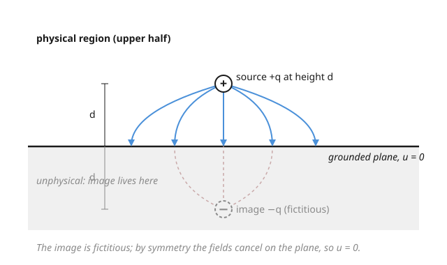

# Partial Differential Equations · Lesson 5.3: The method of images

> ⏱ ~15 min · Module 5: Green's functions and distributions · Builds on: [5.2 Green's functions for Poisson's equation](05-02-greens-functions-poisson.md) · Unlocks: [5.4 Duhamel's principle for inhomogeneous evolution](05-04-duhamels-principle.md)

## Why this matters

The free-space Green's function from [5.2](05-02-greens-functions-poisson.md) solves Poisson's equation in *all* of space — but real problems have walls. Heat leaks into a room bounded by a cold floor; an electric charge sits above a grounded metal sheet; a fluid source pushes against a rigid tank. Each imposes a **boundary condition** that the free-space kernel ignores. The method of images is a beautifully cheap trick for a few highly symmetric geometries: instead of solving a hard boundary-value problem, you place a **fictitious source outside the domain**, chosen so the boundary condition falls out by symmetry — and then just add two free-space kernels you already know.

## The idea

Stand a lamp a foot above a perfectly flat mirror. The light you see is exactly what you'd get with *no mirror* but a second, identical lamp reflected a foot below the glass. The mirror is gone; the geometry it enforced survives in the phantom twin.

That is the whole method. You want a Green's function that vanishes on a flat wall (a grounded, $u=0$ boundary). Put your real source a distance $d$ on one side. Now imagine an **image source of the opposite sign**, a distance $d$ on the *other* side, in the region you don't care about. Any point *on* the wall is exactly equidistant from the two, so their contributions are equal and opposite — they cancel, and $u=0$ on the wall automatically, everywhere, for free. Inside your actual domain the phantom is far away and adds no new source, so the equation you wanted is still obeyed. You've traded a boundary condition for a mirror image.

## The formal version

Work in the half-space $\Omega = \{\mathbf{x} : z > 0\}$ with a grounded plane $z = 0$, and recall the 3D free-space kernel for $-\nabla^2$,

$$\Phi(\mathbf{x}, \mathbf{x}') = \frac{1}{4\pi\,|\mathbf{x} - \mathbf{x}'|}, \qquad -\nabla^2 \Phi = \delta(\mathbf{x} - \mathbf{x}').$$

In words: $\Phi$ is the field of a unit point source at $\mathbf{x}'$ in empty space. Now put the source at $\mathbf{x}' = (x', y', d)$ with $d>0$, and define its **mirror point** $\mathbf{x}'^{*} = (x', y', -d)$ — the reflection of $\mathbf{x}'$ across the plane. The **Dirichlet Green's function** for the half-space is

$$G(\mathbf{x}, \mathbf{x}') = \Phi(\mathbf{x}, \mathbf{x}') - \Phi(\mathbf{x}, \mathbf{x}'^{*}) = \frac{1}{4\pi}\left[\frac{1}{|\mathbf{x} - \mathbf{x}'|} - \frac{1}{|\mathbf{x} - \mathbf{x}'^{*}|}\right].$$

In words: real source minus mirrored source. Two facts make this *the* Green's function of the domain:

1. **It solves the equation inside $\Omega$.** For $\mathbf{x}$ in the half-space, the image at $\mathbf{x}'^{*}$ (with $z=-d<0$) lies *outside* $\Omega$, so $-\nabla^2 \Phi(\mathbf{x},\mathbf{x}'^{*}) = 0$ there. Hence $-\nabla^2 G = \delta(\mathbf{x}-\mathbf{x}')$ — exactly one source, the real one.
2. **It satisfies the boundary condition.** On the plane, any point is equidistant from $\mathbf{x}'$ and its mirror, so the bracket vanishes and $G = 0$.

The **sign of the image is dictated by the boundary condition**: opposite sign for Dirichlet ($u=0$, cancel on the boundary); *same* sign for Neumann ($\partial u/\partial n = 0$, an insulated wall — the two equal contributions make the normal derivative cancel instead). Beyond the plane, the only other geometries this works for are the **sphere** (Example 2) and wedges of angle $\pi/n$.

## Picture

## Worked examples

**Example 1 (the grounded plane — Boss Problem 5).** A point source of strength $q$ sits at height $d$ above a grounded plane $z=0$; find the potential in the half-space and the induced surface density, verifying the boundary condition.

Place the source at $(0,0,d)$, image $-q$ at $(0,0,-d)$. Writing $u = qG$,

$$u(x,y,z) = \frac{q}{4\pi}\left[\frac{1}{\sqrt{x^2+y^2+(z-d)^2}} - \frac{1}{\sqrt{x^2+y^2+(z+d)^2}}\right].$$

*Check the boundary condition.* Set $z=0$: both radicals become $\sqrt{x^2+y^2+d^2}$, so the bracket is $0$ and $u=0$ on the entire plane. ✓ (The image lives at $z=-d$, outside the domain, so inside we still have $-\nabla^2 u = q\,\delta$.)

*Induced surface density.* The physically real "image" is the charge the wall actually rearranges. Its density is set by the normal field at the plane. Let $r = \sqrt{x^2+y^2}$; differentiate and evaluate at $z=0$:

$$\left.\frac{\partial u}{\partial z}\right|_{z=0} = \frac{q}{4\pi}\left[-\frac{(z-d)}{[\,\cdots\,]^{3/2}} + \frac{(z+d)}{[\,\cdots\,]^{3/2}}\right]_{z=0} = \frac{q}{4\pi}\cdot\frac{2d}{(r^2+d^2)^{3/2}},$$

so the induced density is $\sigma(r) = -\dfrac{q\,d}{2\pi\,(r^2+d^2)^{3/2}}$ (a compact ring of opposite sign, peaked directly under the source). Its total is

$$\int_0^\infty \sigma(r)\,2\pi r\,dr = -q\,d\int_0^\infty \frac{r\,dr}{(r^2+d^2)^{3/2}} = -q\,d\left[-\frac{1}{\sqrt{r^2+d^2}}\right]_0^\infty = -q\,d\cdot\frac{1}{d} = -q.$$

The wall's induced charge sums to exactly $-q$ — precisely the image. The phantom is fictitious as a *location*, but its total effect is real and measurable.

**Example 2 (the image in a sphere — Kelvin inversion).** Now the domain is outside a grounded sphere of radius $R$ centered at the origin, with a unit source at $\mathbf{a}$, $|\mathbf{a}| = a > R$. A mirror plane won't do — but an image *scaled and placed by inversion* will. Claim: the image is a source of strength $q' = -R/a$ at $\mathbf{b} = \dfrac{R^2}{a^2}\,\mathbf{a}$, i.e. on the same ray at distance $b = R^2/a$ (inside the sphere, outside the domain).

*Verify $u=0$ on the sphere.* Take $\mathbf{x}$ with $|\mathbf{x}| = R$, and let $\gamma$ be the angle between $\mathbf{x}$ and $\mathbf{a}$. By the law of cosines,

$$|\mathbf{x}-\mathbf{a}|^2 = R^2 + a^2 - 2Ra\cos\gamma, \qquad |\mathbf{x}-\mathbf{b}|^2 = R^2 + \frac{R^4}{a^2} - 2R\cdot\frac{R^2}{a}\cos\gamma = \frac{R^2}{a^2}\big(a^2 + R^2 - 2Ra\cos\gamma\big).$$

So $|\mathbf{x}-\mathbf{b}| = \dfrac{R}{a}\,|\mathbf{x}-\mathbf{a}|$ — the two distances stay in fixed ratio $R/a$ over the whole sphere. Then

$$u \propto \frac{1}{|\mathbf{x}-\mathbf{a}|} + \frac{q'}{|\mathbf{x}-\mathbf{b}|} = \frac{1}{|\mathbf{x}-\mathbf{a}|}\left(1 + \frac{q'\,a}{R}\right),$$

which is zero on the sphere exactly when $q' = -R/a$. ✓ That single ratio is why the sphere — like the plane — admits an image at all: inversion in the sphere maps distances proportionally.

## Watch out

- **You might think the image can sit anywhere convenient, but it must lie strictly *outside* the physical domain.** If it strayed inside, $-\nabla^2 G$ would pick up a second delta and you'd be solving a different problem — one with a spurious source your boundary never had.
- **You might think the sign is yours to choose, but the boundary condition fixes it.** Dirichlet ($u=0$) demands an *opposite*-sign image so the field cancels on the wall; Neumann ($\partial u/\partial n = 0$, insulated) demands the *same* sign so the normal derivative cancels. Flip the sign and you satisfy the wrong condition.
- **You might think the image is a mere bookkeeping fiction, but its effect is physically real.** The induced surface charge of Example 1 integrates to the image charge and exerts a genuine, measurable attractive force on the source — the phantom's field is the actual field in the domain.
- **You might expect this to generalize, but it only works for special symmetric boundaries** — the plane, the sphere, and wedges of angle $\pi/n$ (which need a finite fan of images). A generic curved boundary has no image; you fall back to eigenfunction expansions or numerics.

## One-liner

> To satisfy a boundary condition, reflect your source across the boundary with the sign the condition demands — opposite for grounded, same for insulated — and the wall enforces itself.

## Problems

**P1 (🟢)** In the 2D half-plane $y>0$ the free-space kernel is $\Phi(\mathbf{x},\mathbf{x}') = -\frac{1}{2\pi}\ln|\mathbf{x}-\mathbf{x}'|$. Write the Dirichlet Green's function $G$ for a source at $(0,d)$ using one image, and verify $G=0$ on the boundary $y=0$.

**P2 (🟡)** A source sits at $(d_1, d_2)$ inside the grounded right-angle corner $\{x>0,\ y>0\}$ (both half-axes held at $u=0$). A single image won't cancel on both walls. Find the set of images (positions and signs) that does, and verify $u=0$ on each wall.

**P3 (🔴, optional)** Using the sphere image of Example 2, find the force on a point charge $q$ held at distance $a$ from the center of a grounded sphere of radius $R$ (take the Coulomb force between two charges $q_1,q_2$ a distance $s$ apart to be $\frac{1}{4\pi\varepsilon_0}\frac{q_1 q_2}{s^2}$). Is it attractive or repulsive?

Solutions

**P1** Reflect the source across $y=0$: image of *opposite* sign at $(0,-d)$. Subtracting the two free-space kernels,

$$G(\mathbf{x},\mathbf{x}') = -\frac{1}{2\pi}\ln|\mathbf{x}-\mathbf{x}'| + \frac{1}{2\pi}\ln|\mathbf{x}-\mathbf{x}'^{*}| = \frac{1}{2\pi}\ln\frac{|\mathbf{x}-(0,-d)|}{|\mathbf{x}-(0,d)|}.$$

On $y=0$ a point $(x,0)$ has $|\mathbf{x}-(0,d)| = \sqrt{x^2+d^2} = |\mathbf{x}-(0,-d)|$, so the ratio is $1$, $\ln 1 = 0$, and $G=0$. ✓

**P2** Three images are needed. Reflect across the $y$-axis, across the $x$-axis, and across both:
- $-q$ at $(-d_1, d_2)$ — cancels on the $y$-axis wall $x=0$;
- $-q$ at $(d_1, -d_2)$ — cancels on the $x$-axis wall $y=0$;
- $+q$ at $(-d_1,-d_2)$ — restores cancellation that the two negatives would otherwise spoil.

*Check the wall $x=0$*, point $(0,y)$: the real $+q$ at $(d_1,d_2)$ pairs with $-q$ at $(-d_1,d_2)$ — equidistant, cancel; the $-q$ at $(d_1,-d_2)$ pairs with $+q$ at $(-d_1,-d_2)$ — equidistant, cancel. Net $u=0$. ✓ The wall $y=0$ works identically by swapping the roles of the axes. (All three images sit in the three quadrants *outside* the domain, as required. A corner of angle $\pi/n$ needs $2n-1$ images this way.)

**P3** The image is $q' = -qR/a$ at distance $b = R^2/a$ from the center, on the ray through $q$. The separation between the real charge and its image is

$$s = a - b = a - \frac{R^2}{a} = \frac{a^2 - R^2}{a}.$$

The force on $q$ is the Coulomb force from the image (the image reproduces the field of the induced surface charge inside the domain):

$$F = \frac{1}{4\pi\varepsilon_0}\frac{q\,q'}{s^2} = \frac{1}{4\pi\varepsilon_0}\frac{q\left(-qR/a\right)}{\left[(a^2-R^2)/a\right]^2} = -\frac{1}{4\pi\varepsilon_0}\frac{q^2 R\,a}{(a^2 - R^2)^2}.$$

The sign is negative → **attractive**: a charge is always pulled toward a grounded conductor, drawn in by the opposite charge it induces. (As $a\to R^+$ the force diverges — the charge is sucked onto the surface.)

## Flashback

**From Lesson 5.2 (Green's functions for Poisson's equation):** Verify from scratch that the 3D fundamental solution $\Phi(\mathbf{x}) = \dfrac{1}{4\pi\,|\mathbf{x}|}$ satisfies $-\nabla^2 \Phi = \delta(\mathbf{x})$ — i.e. show it is harmonic away from the origin, and that the outward flux of $-\nabla\Phi$ through *any* sphere about the origin equals $1$.

Solution

Write $r = |\mathbf{x}|$. Away from the origin $\Phi = \frac{1}{4\pi r}$ is a function of $r$ alone, and the radial Laplacian gives $\nabla^2\Phi = \frac{1}{r^2}\frac{d}{dr}\!\left(r^2 \frac{d}{dr}\frac{1}{4\pi r}\right) = \frac{1}{r^2}\frac{d}{dr}\!\left(r^2\cdot\left(-\frac{1}{4\pi r^2}\right)\right) = \frac{1}{r^2}\frac{d}{dr}\!\left(-\frac{1}{4\pi}\right) = 0$ — harmonic for $r\neq 0$. ✓

For the source strength, use the flux. The gradient is radial, $\nabla\Phi = \frac{d}{dr}\!\left(\frac{1}{4\pi r}\right)\hat{\mathbf{r}} = -\frac{1}{4\pi r^2}\hat{\mathbf{r}}$, so $-\nabla\Phi = \frac{1}{4\pi r^2}\hat{\mathbf{r}}$. Over a sphere of radius $\rho$ (area $4\pi\rho^2$, outward normal $\hat{\mathbf{r}}$),

$$\oint (-\nabla\Phi)\cdot d\mathbf{S} = \frac{1}{4\pi\rho^2}\cdot 4\pi\rho^2 = 1,$$

independent of $\rho$. By the divergence theorem this flux equals $\int -\nabla^2\Phi\,dV$, which is $1$ for every ball around the origin and $0$ for any region excluding it — the defining property of $\delta(\mathbf{x})$. Hence $-\nabla^2\Phi = \delta(\mathbf{x})$. ✓

## Connections

- **Backward:** the two pieces of $G$ are each the free-space fundamental solution of [5.2](05-02-greens-functions-poisson.md); images just superpose two of them. The boundary-value setting is the Laplace/Poisson problem of [2.3](02-03-laplace-poisson-equations.md), now solved by construction rather than separation of variables.
- **Forward:** [5.4](05-04-duhamels-principle.md) builds inhomogeneous *time* evolution from the same superposition instinct — sum elementary responses to reconstruct the whole.
- **Sideways (electromagnetism):** this *is* the method of image charges — a point charge above a **grounded conductor** induces a surface charge whose field equals that of a single opposite image (Example 1), and the sphere case is the classic Kelvin inversion. See [em-refresher](../../em-refresher/syllabus.md).
- **Sideways (fluid dynamics):** to enforce a solid wall (no flow through it, a Neumann condition), you place an **image vortex or image source** of the *same* sign across the wall — the mirror of Example 1 that keeps the normal velocity zero. See [fluid-dynamics](../../fluid-dynamics/syllabus.md).
- See the [syllabus](../syllabus.md) for where Module 5 heads next.
