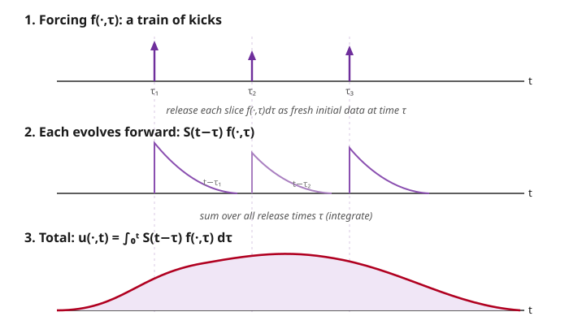

# Partial Differential Equations · Lesson 5.4: Duhamel's principle for inhomogeneous evolution

> ⏱ ~15 min · Module 5: Green's functions and distributions · Builds on: [5.3 The method of images](05-03-method-of-images.md) · Unlocks: [6.1 Nonlinear first-order equations, shocks, and Burgers](06-01-nonlinear-shocks-burgers.md)

## Why this matters

You know how to evolve initial data forward: drop a temperature profile onto a bar, or pluck a string, and the heat kernel or the wave propagator tells you what happens next. But real systems are *driven* — a soldering iron keeps pumping heat in, a speaker keeps pushing the air, an economy keeps absorbing shocks. The equation grows a source term $f(x,t)$ on the right, and it never switches off. Duhamel's principle is the one idea that turns "I can solve the *un*-driven problem" into "I can solve the driven one" — for free, no new machinery. It's the continuous-in-time twin of the Green's-function trick from [5.2](05-02-greens-functions-poisson.md), and once you see it you'll recognize it everywhere: variation of parameters in ODEs, convolution with an impulse response in signals, the interaction-picture expansion in quantum mechanics. All the same move.

## The idea

Think of the forcing $f(x,t)$ as a rapid-fire sequence of little *kicks*. During the tiny window $[\tau, \tau + d\tau]$, the system receives a jolt of size $f(\cdot,\tau)\,d\tau$. Here's the trick: treat that jolt as if it were a **fresh piece of initial data, released at time $\tau$**. From that instant on, the system doesn't know or care that the jolt came from a source — it just evolves forward the way any initial condition does, using the ordinary homogeneous solution operator. A kick delivered at $\tau$ has been evolving for a duration $t - \tau$ by the time you look at it at time $t$.

Because the equation is *linear*, the total response is just the sum of all these separately-evolved kicks. Add them up — integrate over every release time $\tau$ from $0$ to $t$ — and you have the full driven solution. Decompose the source, respond to each piece with the solver you already own, superpose. That's the whole lesson.

## The formal version

Write the driven evolution equation as

$$u_t - L\,u = f(x,t), \qquad u(x,0) = 0,$$

where $L$ is a linear spatial operator (for the heat equation, $L = k\,\partial_x^2$), $u(x,t)$ is the unknown, and $f(x,t)$ is the given forcing. We start from **zero** initial data on purpose; initial data is handled separately (see Watch out).

Let $S(t)$ be the **homogeneous solution operator**: given any profile $g(x)$, the function $v(x,t) = [S(t)g](x)$ solves the *un-driven* problem $v_t = L\,v$ with $v(\cdot,0) = g$. *In words:* $S(t)$ is your "evolve initial data forward by time $t$" black box — for heat, it's convolution with the heat kernel.

**Duhamel's principle.**

$$\boxed{\,u(x,t) = \int_0^t \big[\,S(t-\tau)\,f(\cdot,\tau)\,\big](x)\;d\tau\,}$$

*In words:* to get the response at time $t$, take the forcing received at each earlier instant $\tau$, evolve it forward for the remaining time $t-\tau$ with your homogeneous solver, and add up the contributions from all $\tau$.

For the **heat equation** on the line, $S(t)$ is convolution with the heat kernel $\Phi(x,t) = \dfrac{1}{\sqrt{4\pi k t}}\,e^{-x^2/(4kt)}$ (from [4.2](04-02-heat-equation-line-heat-kernel.md)), so Duhamel reads

$$u(x,t) = \int_0^t \int_{-\infty}^{\infty} \Phi(x-y,\;t-\tau)\,f(y,\tau)\;dy\,d\tau.$$

*In words:* a double superposition — over source *locations* $y$ (the spatial Green's function of 5.2) **and** over source *times* $\tau$ (the new, temporal, ingredient).

## Picture

## Worked examples

**Example 1 (the ODE analog — build the intuition here first).** Take the scalar driven equation

$$u' + a\,u = f(t), \qquad u(0) = 0,$$

with $a > 0$ a constant. This is the "PDE" with no space and $L = -a$. The homogeneous solver is easy: $v' = -a\,v$ gives $v(t) = e^{-at}v(0)$, so $S(t)$ is just multiplication by $e^{-at}$. Duhamel then says

$$u(t) = \int_0^t e^{-a(t-\tau)}\,f(\tau)\,d\tau.$$

This is **exactly variation of parameters** from `ode-refresher` — the same formula the integrating factor $e^{at}$ produces. Duhamel is just the coordinate-free name for it. Concretely, with $f(t) = 1$ (a constant drive switched on at $t=0$):

$$u(t) = \int_0^t e^{-a(t-\tau)}\,d\tau = \left[\frac{1}{a}e^{-a(t-\tau)}\right]_{\tau=0}^{\tau=t} = \frac{1 - e^{-at}}{a}\;\xrightarrow{t\to\infty}\;\frac{1}{a}.$$

The system relaxes to the steady state $1/a$ where drive and decay balance — the classic charging-capacitor / heating-room curve.

**Example 2 (the heat equation — a point source switched on).** Heat a bar with a unit source concentrated at the origin, held on at constant rate from $t=0$: $f(x,t) = \delta(x)$, with $u(x,0)=0$. Duhamel with the heat kernel gives

$$u(x,t) = \int_0^t \int_{-\infty}^{\infty} \Phi(x-y,\,t-\tau)\,\delta(y)\,dy\,d\tau = \int_0^t \Phi(x,\,t-\tau)\,d\tau.$$

Substitute $s = t-\tau$ ($ds = -d\tau$; limits flip):

$$u(x,t) = \int_0^t \Phi(x,s)\,ds = \int_0^t \frac{1}{\sqrt{4\pi k s}}\,e^{-x^2/(4ks)}\,ds.$$

Two clean readouts. **At the source** ($x=0$): $u(0,t) = \displaystyle\int_0^t \frac{ds}{\sqrt{4\pi k s}} = \frac{1}{2\sqrt{\pi k}}\int_0^t s^{-1/2}\,ds = \frac{1}{2\sqrt{\pi k}}\cdot 2\sqrt{t} = \sqrt{\dfrac{t}{\pi k}}.$ The temperature at the iron's tip grows like $\sqrt{t}$ — not linearly, because heat keeps leaking outward as fast as you pour it in. **Total heat** in the bar: since $\int_{-\infty}^{\infty}\Phi(x,s)\,dx = 1$ for every $s$,

$$\int_{-\infty}^{\infty} u(x,t)\,dx = \int_0^t\!\!\left(\int_{-\infty}^{\infty}\Phi(x,t-\tau)\,dx\right)d\tau = \int_0^t 1\,d\tau = t.$$

A unit source running for time $t$ has deposited exactly $t$ units of heat — the perfect sanity check.

**The forced wave equation** works identically. For $u_{tt} - c^2 u_{xx} = f(x,t)$ with $u = u_t = 0$ at $t=0$, the right homogeneous operator is the one that evolves *zero displacement with initial velocity* $g$; in 1D that's $[S(t)g](x) = \frac{1}{2c}\int_{x-ct}^{x+ct} g(y)\,dy$ (from d'Alembert). Duhamel then gives

$$u(x,t) = \frac{1}{2c}\int_0^t \int_{x-c(t-\tau)}^{\,x+c(t-\tau)} f(y,\tau)\,dy\,d\tau,$$

the integral of the forcing over the backward light-cone — every source event influences you only after its signal has had time to arrive.

## Watch out

- **You might think Duhamel is a special trick for one equation, but actually it needs only *linearity*.** Superposing impulse responses is legal precisely because $L$ is linear; the instant a nonlinearity appears (Module 6's Burgers equation), impulse responses stop adding and Duhamel dies. Keep it far from nonlinear problems.
- **You might think you can write down the answer knowing nothing else, but actually you must already own $S(t)$.** Duhamel *reduces* the driven problem to the un-driven one — it does not solve the un-driven one for you. No heat kernel, no wave propagator, no formula. Learn the homogeneous solver first.
- **You might think each kick evolves for the full time $t$, but actually it evolves for $t-\tau$.** The propagator carries the argument $t-\tau$, not $t$: a kick released late has had less time to spread. Dropping the shift is the single most common error here.
- **You might think Duhamel also handles the initial data, but actually it assumes $u(x,0)=0$.** For nonzero initial data $u(x,0)=u_0$, solve the homogeneous problem with that data, $[S(t)u_0](x)$, and **add** it to the Duhamel integral. By linearity the two pieces superpose: total $=$ (data evolved) $+$ (forcing integrated).

## One-liner

> To solve a driven evolution equation, treat the forcing at each instant $\tau$ as fresh initial data, evolve it forward by $t-\tau$ with the homogeneous solver you already have, and integrate over $\tau$.

## Problems

**P1 (🟢)** Solve $u' + 3u = e^{-t}$ with $u(0)=0$ using Duhamel's formula (Example 1's setup with $a=3$). Give $u(t)$ in closed form and check that it satisfies the equation.

**P2 (🟡)** A unit point source at the origin is switched **on** at $t=0$ and **off** at $t=T$: $f(x,t) = \delta(x)$ for $0 \le t \le T$ and $f = 0$ for $t > T$, with $u(x,0)=0$. Using the total-heat result from Example 2, find the total heat $\int_{-\infty}^{\infty} u(x,t)\,dx$ in the bar for a time $t > T$, and explain in one sentence why it is constant afterward.

**P3 (🔴, optional)** Prove Duhamel's formula in general. Assume $S(t)$ solves the homogeneous problem, meaning $\partial_t\big[S(t)g\big] = L\,S(t)g$ and $S(0)g = g$ for any $g$. Show that $u(t) = \int_0^t S(t-\tau)\,f(\tau)\,d\tau$ satisfies $u_t = L\,u + f$ and $u(0)=0$. (Hint: differentiate the integral by the Leibniz rule — the upper limit $t$ appears in *two* places.)

Solutions

**P1** With $a=3$ and $f(\tau)=e^{-\tau}$,

$$u(t) = \int_0^t e^{-3(t-\tau)}\,e^{-\tau}\,d\tau = e^{-3t}\int_0^t e^{3\tau}e^{-\tau}\,d\tau = e^{-3t}\int_0^t e^{2\tau}\,d\tau = e^{-3t}\cdot\frac{e^{2t}-1}{2} = \frac{e^{-t}-e^{-3t}}{2}.$$

Check: $u(0) = \frac{1-1}{2} = 0$ ✓. And $u'(t) = \frac{-e^{-t}+3e^{-3t}}{2}$, so

$$u' + 3u = \frac{-e^{-t}+3e^{-3t}}{2} + \frac{3e^{-t}-3e^{-3t}}{2} = \frac{2e^{-t}}{2} = e^{-t}. \checkmark$$

**P2** Total heat is the time-integral of the source rate (Example 2 showed $\int u\,dx = \int_0^t (\text{rate at }\tau)\,d\tau$, and the rate is $1$ while the source is on). For $t > T$ the source contributes only on $[0,T]$:

$$\int_{-\infty}^{\infty} u(x,t)\,dx = \int_0^T 1\,d\tau + \int_T^t 0\,d\tau = T.$$

It is constant because after $t=T$ nothing more is added, and diffusion only *rearranges* heat on the infinite line — it conserves the total (the heat kernel always integrates to $1$). The bump keeps spreading and flattening, but its area stays $T$.

**P3** Write $u(t) = \int_0^t S(t-\tau)f(\tau)\,d\tau$. The upper limit $t$ appears both as the endpoint of integration and inside the integrand $S(t-\tau)$, so Leibniz's rule gives two terms:

$$u'(t) = \underbrace{S(t-\tau)f(\tau)\Big|_{\tau=t}}_{\text{endpoint term}} + \int_0^t \frac{\partial}{\partial t}\big[S(t-\tau)f(\tau)\big]\,d\tau.$$

The endpoint term is $S(0)f(t) = f(t)$ (since $S(0)$ is the identity). Inside the integral, $\partial_t\big[S(t-\tau)g\big] = L\,S(t-\tau)g$ by the homogeneous-operator assumption, so

$$u'(t) = f(t) + \int_0^t L\,S(t-\tau)f(\tau)\,d\tau = f(t) + L\int_0^t S(t-\tau)f(\tau)\,d\tau = f(t) + L\,u(t),$$

pulling the linear operator $L$ (which acts in space, not in $\tau$) outside the integral. That is $u_t = L\,u + f$. Finally $u(0) = \int_0^0(\cdots)\,d\tau = 0$. Both requirements hold. $\blacksquare$

## Flashback

**From Lesson 5.3 (The method of images):** Heat flows on the half-line $x > 0$ with the end held at zero temperature, $u(0,t)=0$, starting from a point source of unit strength at $x = 3$: $u(x,0) = \delta(x-3)$. Write down $u(x,t)$ for $x>0$ using an image source, and verify the boundary condition.

Solution

Reflect the real source across the wall and give the image the **opposite** sign, so the two cancel exactly at $x=0$ (Dirichlet). Real source $+\delta(x-3)$ at $x=3$; image source $-\delta(x+3)$ at $x=-3$. Each evolves by the free-line heat kernel, so for $x>0$

$$u(x,t) = \Phi(x-3,\,t) - \Phi(x+3,\,t),$$

with $\Phi(x,t) = \frac{1}{\sqrt{4\pi k t}}e^{-x^2/(4kt)}$. Check the boundary: at $x=0$,

$$u(0,t) = \Phi(-3,t) - \Phi(3,t) = 0,$$

since $\Phi$ is even in its first argument. The odd extension enforces $u(0,t)=0$ for all $t$. ✓

## Connections

- **Backward:** this is the temporal cousin of [5.2](05-02-greens-functions-poisson.md)'s superposition of point-source responses — there you integrated the Green's function over source *locations*; here you also integrate the propagator over source *times*. The evolving operator $S(t)$ is precisely the heat kernel of [4.2](04-02-heat-equation-line-heat-kernel.md) (or the wave propagator of [4.3](04-03-wave-equation-line-dispersion.md)), which is why you had to build those first.
- **Forward / discrete analog:** [3.5](03-05-eigenfunction-expansions-inhomogeneous.md) solved forced problems mode by mode — each Fourier/Sturm–Liouville coefficient obeys a driven ODE solved by *exactly* Example 1's integral. Duhamel is that same forcing-response formula done all-at-once in physical space instead of one eigenmode at a time.
- **Sideways (ODEs):** Duhamel *is* variation of parameters — name the bridge explicitly. The `ode-refresher` [syllabus](../../ode-refresher/syllabus.md) derives $u(t)=\int_0^t e^{-a(t-\tau)}f(\tau)\,d\tau$ from an integrating factor; here it falls out of "kick, evolve, sum."
- **Sideways (signals & quantum):** in signal processing this is convolution of the input with the system's *impulse response* — Duhamel's kernel $S(t-\tau)$ is that response. In quantum mechanics the same expansion drives the interaction picture: the [quantum-mechanics](../../quantum-mechanics/syllabus.md) Dyson/Duhamel series writes the forced Schrödinger evolution as an integral of the free propagator against the perturbation, term by term.
