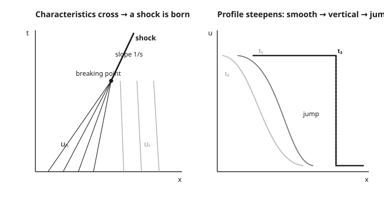

# Partial Differential Equations · Lesson 6.1: Nonlinear first-order equations, shocks, and Burgers

> ⏱ ~15 min · Module 6: Nonlinear and special topics — a taste · Builds on: [5.4 Duhamel's principle for inhomogeneous evolution](05-04-duhamels-principle.md) · Unlocks: [6.2 A taste of finite differences and well-posedness](06-02-finite-differences-well-posedness.md)

## Why this matters

In [1.3](01-03-quasilinear-first-order.md) we watched a smooth solution destroy itself: when the wave speed is the wave's own height, tall values overtake short ones, characteristics cross, and at the breaking time the profile tries to go vertical. Then we stopped — the classical solution was simply dead, and we had nothing to put in its place. This lesson supplies the replacement. A **shock** — a clean, propagating jump discontinuity — is the honest continuation past the crossing, and there is an exact rule for how fast it moves. This is the mathematics behind a sonic boom, the sharp front of a traffic jam, and the leading edge of a flood wave; it is also the first time in this course that "the solution" has to mean something weaker than "a differentiable function that satisfies the equation."

## The idea

Once characteristics cross, the formula $u=f(x-ut)$ wants to hand you two or three different heights at the same point — the graph becomes a physically impossible "overhang." Nature's fix is blunt: **cut the overhang with a vertical jump.** The tall state on the left and the short state on the right meet along a single moving front, the shock, and everywhere else the solution stays smooth.

The one thing you must know is *how fast that front travels*, and the answer is beautifully simple: not the speed of the left state, not the speed of the right state, but **the average of the two**. Why an average? Think of the shock as a bookkeeper for a conserved quantity — mass, cars, momentum. Whatever the fast state pumps in from behind must equal what the front carries away in front. Balancing that ledger fixes the speed, and for Burgers the balance works out to the midpoint of the two heights. Get the speed wrong and you'd be creating or destroying the conserved stuff out of thin air.

## The formal version

Write the equation in **conservation form** — the form that says "a density $u$ moves with a flux $F(u)$":

$$u_t + F(u)_x = 0, \qquad \text{inviscid Burgers:}\quad F(u)=\tfrac{1}{2}u^2 \;\Rightarrow\; u_t + u\,u_x = 0.$$

In words: the amount of $u$ in any interval changes only through the flux $F$ crossing its two ends — nothing is created inside. For Burgers the flux is $\tfrac12 u^2$, and differentiating recovers the familiar $u_t + u\,u_x = 0$.

**Weak solution.** Past the breaking time we drop the demand that $u$ be differentiable and ask only that it satisfy the conservation law in integral (averaged) form. Such a $u$ may contain jumps.

**Rankine–Hugoniot jump condition.** A shock separating a left state $u_L$ from a right state $u_R$ must travel at speed

$$s = \frac{F(u_L)-F(u_R)}{u_L - u_R} = \frac{[\,F\,]}{[\,u\,]}.$$

In words: the shock speed is the *jump in flux divided by the jump in the quantity* — exactly the flux balance that keeps the conserved stuff accounted for. For Burgers, $F=\tfrac12 u^2$ gives

$$s = \frac{\tfrac12 u_L^2 - \tfrac12 u_R^2}{u_L - u_R} = \frac{u_L + u_R}{2},$$

the **average of the two states**.

**Entropy (admissibility) condition.** R–H alone does not pick a unique weak solution, so we impose that characteristics must *run into* the shock from both sides:

$$u_L > s > u_R \iff u_L > u_R \quad(\text{for Burgers}).$$

In words: an admissible shock only forms where the state behind is *taller* than the state ahead — a compression. Where the data *increases* ($u_L < u_R$) no shock is allowed; instead the characteristics fan out and the gap fills with a smooth **rarefaction wave**, the self-similar $u = x/t$. The entropy condition is the fingerprint of the **vanishing-viscosity limit**: add a tiny diffusion $\varepsilon\,u_{xx}$, which smears the jump into a thin smooth ramp, and let $\varepsilon \to 0^+$; the shock that survives is exactly the admissible one.

## Picture

## Worked examples

**Example 1 (a step down — the shock computed).** Solve Burgers $u_t + u\,u_x = 0$ with the step
$$u(x,0) = \begin{cases} 1 & x < 0 \\ 0 & x > 0. \end{cases}$$
The left state ($u_L=1$) travels right at speed $1$; the right state ($u_R=0$) sits still. The fast state is *behind* the slow one, so characteristics cross immediately — the shock exists for all $t>0$. Its speed comes straight from Rankine–Hugoniot:
$$s = \frac{u_L+u_R}{2} = \frac{1+0}{2} = \frac12.$$
Admissibility check: $u_L = 1 > 0 = u_R$, so the shock is entropy-satisfying. The solution is the original step, rigidly carried along the shock path $x = \tfrac12 t$:
$$u(x,t) = \begin{cases} 1 & x < \tfrac12 t \\ 0 & x > \tfrac12 t. \end{cases}$$
Note the speed $\tfrac12$ is *neither* characteristic speed ($1$ or $0$) — it splits the difference, because the jump must conserve the total $\int u\,dx$. Sanity check on the ledger: in time $t$ the region $x<\tfrac12 t$ holds "area" $1\cdot\tfrac12 t$; the front advances at $\tfrac12$, and the left state feeds in at relative speed $1-\tfrac12=\tfrac12$, matching. ✓

**Example 2 (a step up — the rarefaction).** Same equation, opposite step:
$$u(x,0) = \begin{cases} 0 & x < 0 \\ 1 & x > 0. \end{cases}$$
Now the slow state ($0$) is behind and the fast state ($1$) ahead; characteristics *spread apart* and leave a wedge $0 < x < t$ with no characteristic through it. The entropy condition forbids a shock here ($u_L=0 \not> 1=u_R$), so we fill the wedge with the self-similar **rarefaction fan**:
$$u(x,t) = \begin{cases} 0 & x \le 0 \\[2pt] \dfrac{x}{t} & 0 \le x \le t \\[4pt] 1 & x \ge t. \end{cases}$$
Check the middle piece: with $u=x/t$, $u_t = -x/t^2$ and $u_x = 1/t$, so $u_t + u\,u_x = -\dfrac{x}{t^2} + \dfrac{x}{t}\cdot\dfrac1t = 0.$ ✓ It is continuous ($0$ at $x=0$, $1$ at $x=t$) and smooth in between — the benign fate of increasing data, and the exact counterpart to the shock of Example 1.

## Watch out

- **You might think the multivalued profile is "the solution past breaking," but it is physically meaningless.** A conserved density cannot take three values at one point. The fix is to *allow a jump* — a weak solution — not to keep the overhang.
- **You might think the shock moves at one of the characteristic speeds, but it moves at their average.** Rankine–Hugoniot gives $s=(u_L+u_R)/2$ for Burgers, strictly between $u_L$ and $u_R$. Using either endpoint speed violates conservation.
- **You might think Rankine–Hugoniot picks the answer, but it doesn't — it permits too many.** A jump from a *lower* state to a *higher* one can satisfy R–H yet be unphysical (an "expansion shock"). The **entropy condition** $u_L>u_R$, equivalently the vanishing-viscosity limit, throws those out and selects the rarefaction instead.
- **You might think adding viscosity changes the answer, but in the limit it doesn't.** A term $\varepsilon u_{xx}$ replaces the sharp jump with a thin smooth transition of width $\sim\varepsilon$; as $\varepsilon\to0$ you recover precisely the admissible shock at the R–H speed.

## One-liner

> Past the crossing, replace the impossible overhang with a jump that moves at the average speed $s=(u_L+u_R)/2$, and keep only the compression ($u_L>u_R$) the vanishing-viscosity limit would have left you.

## Problems

**P1 (🟢)** Solve Burgers with $u(x,0)=3$ for $x<0$ and $u(x,0)=1$ for $x>0$. Is the resulting jump an admissible shock? Give its speed and the shock's position at time $t$.

**P2 (🟡)** Solve Burgers with $u(x,0)=1$ for $x<0$ and $u(x,0)=3$ for $x>0$. Explain why this is *not* a shock, and write the full self-similar solution, verifying the middle piece satisfies the equation.

**P3 (🔴, optional)** For $u(x,0)=0$ ($x<0$), $u(x,0)=2$ ($x>0$), someone proposes a jump moving at speed $s$ chosen by Rankine–Hugoniot. (a) Compute that $s$ and confirm the jump satisfies R–H. (b) Using the entropy requirement $u_L>s>u_R$, show the proposed jump is *inadmissible*, and say in one sentence what goes wrong with its characteristics. (c) Write the admissible (rarefaction) solution instead.

Solutions

**P1** Left state $u_L=3$ (fast, behind), right state $u_R=1$ (slow, ahead): the fast state overtakes the slow one, so characteristics cross and a shock forms. Admissibility: $u_L=3>1=u_R$ ✓ — it is an entropy shock. Rankine–Hugoniot speed:
$$s=\frac{u_L+u_R}{2}=\frac{3+1}{2}=2.$$
The shock sits at $x=2t$, with $u=3$ for $x<2t$ and $u=1$ for $x>2t$. (The speed $2$ lies strictly between the characteristic speeds $3$ and $1$, as it must.)

**P2** Here $u_L=1$ (slow, behind) and $u_R=3$ (fast, ahead): the states pull *apart*, leaving the wedge $t < x < 3t$ with no characteristics. The entropy condition fails for a shock ($u_L=1 \not> 3=u_R$), so a jump is inadmissible; the physical solution is a rarefaction fan. The characteristic speeds range from $1$ to $3$, so:
$$u(x,t)=\begin{cases} 1 & x \le t\\[2pt] \dfrac{x}{t} & t \le x \le 3t\\[4pt] 3 & x \ge 3t.\end{cases}$$
Middle piece: $u=x/t$ gives $u_t=-x/t^2$, $u_x=1/t$, so $u_t+u\,u_x=-\dfrac{x}{t^2}+\dfrac{x}{t}\cdot\dfrac1t=0$ ✓. It matches $1$ at $x=t$ and $3$ at $x=3t$, so the solution is continuous and single-valued for all $t>0$.

**P3** (a) $u_L=0$, $u_R=2$, $F=\tfrac12u^2$:
$$s=\frac{F(u_L)-F(u_R)}{u_L-u_R}=\frac{0-2}{0-2}=1,\qquad\text{equivalently } s=\frac{0+2}{2}=1.$$
The proposed jump moves at $s=1$ and does satisfy R–H by construction. (b) The entropy test needs $u_L>s>u_R$, i.e. $0>1>2$, which is false — the shock is **inadmissible**. Geometrically, the characteristics on both sides ($speed\ 0$ on the left, $2$ on the right) *emerge from* the proposed shock line rather than running into it, so the jump would manufacture information out of nothing (an expansion shock the vanishing-viscosity limit never produces). (c) The admissible solution is the rarefaction filling $0<x<2t$:
$$u(x,t)=\begin{cases} 0 & x\le 0\\[2pt] \dfrac{x}{t} & 0\le x\le 2t\\[4pt] 2 & x\ge 2t.\end{cases}$$

## Flashback

**From Lesson 1.3 (Quasilinear first-order equations):** Solve $u_t + u\,u_x = 0$ with the decreasing ramp
$$u(x,0)=\begin{cases} 4 & x\le 0\\ 4-2x & 0\le x\le 2\\ 0 & x\ge 2.\end{cases}$$
(a) Find the breaking time $t^*$, both from the slope formula and by crossing two characteristics. (b) After the ramp collapses, use Rankine–Hugoniot to give the speed of the resulting shock between the states $4$ and $0$.

Solution

(a) On the ramp $f(x)=4-2x$, so $f'(x_0)=-2$ and
$$t^*=\frac{-1}{\min f'}=\frac{-1}{-2}=\frac12.$$
Directly: the characteristic from $x_0\in[0,2]$ carries $4-2x_0$, so it is $x=x_0+(4-2x_0)t$. Setting the paths from $x_0\ne x_1$ equal,
$$x_0+(4-2x_0)t=x_1+(4-2x_1)t \;\Longrightarrow\; x_0-x_1=2(x_0-x_1)t \;\Longrightarrow\; t=\tfrac12.$$
They all cross at $t^*=\tfrac12$, and at $x=x_0+(4-2x_0)(\tfrac12)=x_0+2-x_0=2$ — the whole ramp collapses into the single point $(x,t)=(2,\tfrac12)$. ✓

(b) Thereafter the shock separates $u_L=4$ (left) from $u_R=0$ (right), with $u_L>u_R$ (admissible). Rankine–Hugoniot:
$$s=\frac{u_L+u_R}{2}=\frac{4+0}{2}=2,$$
so the shock leaves $(2,\tfrac12)$ and moves as $x = 2 + 2\left(t-\tfrac12\right)$ for $t>\tfrac12$.

## Connections

- **Backward:** this completes the story [1.3](01-03-quasilinear-first-order.md) left hanging — the crossing characteristics and breaking time $t^*=-1/\min f'$ were the disease; the weak solution, Rankine–Hugoniot speed, and entropy condition are the cure. The conservation form $u_t+F(u)_x=0$ generalizes the specific $u\,u_x$ you met there.
- **Forward:** shocks are exactly where naive numerical schemes fail, oscillating near the jump; [6.2](06-02-finite-differences-well-posedness.md) confronts that with finite differences and the notion of a well-posed discretization. The vanishing-viscosity idea also foreshadows why a little numerical diffusion can *stabilize* a scheme.
- **Sideways (contrast with linearity):** everything in Modules 3–5 leaned on **superposition** — Fourier modes, Green's functions, Duhamel's principle in [5.4](05-04-duhamels-principle.md) all add solutions to build solutions. Nonlinearity kills that: add two Burgers solutions and you do not get a solution, which is *why* shocks can form at all. Superposition and shock formation are mutually exclusive worlds.
- **Sideways (fluid dynamics):** Burgers is the skeleton of compressible gas dynamics — the Euler equations produce genuine shock waves, and a **sonic boom** is a Rankine–Hugoniot jump in the air. The same equation is the Lighthill–Whitham–Richards model of **traffic flow**, where the shock is the sharp upstream edge of a jam. See [fluid-dynamics](../../fluid-dynamics/syllabus.md).
- See also the [syllabus](../syllabus.md) for where Module 6 sits in the course.
