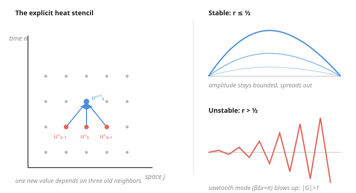

# Partial Differential Equations · Lesson 6.2: A taste of finite differences and well-posedness

> ⏱ ~15 min · Module 6: Nonlinear and special topics — a taste · Builds on: [6.1 Nonlinear first-order equations, shocks, and Burgers](06-01-nonlinear-shocks-burgers.md) · Unlocks: [6.3 Separation in polar and spherical coordinates](06-03-separation-polar-spherical.md)

## Why this matters

Almost every PDE that matters in practice — weather, blood flow, option prices, the airflow over a wing — has no closed-form solution. So we hand it to a computer, and the only thing a computer knows how to do with a derivative is **subtract two nearby numbers and divide**. That move, done on a grid, is the finite-difference method: the workhorse behind essentially all of computational science. But there's a trap that catches every beginner. You refine the grid to get a better answer, and instead the whole thing detonates into garbage. Understanding *why* — and the one inequality that prevents it — is the difference between simulation and noise.

## The idea

Forget the calculus limit for a second. A derivative is just a slope: rise over run. On a grid of points spaced $\Delta x$ apart, the honest slope between neighbors is $\frac{u_{j+1}-u_j}{\Delta x}$. That's a **forward difference** — an approximation to $u_x$ that gets exact as $\Delta x \to 0$. Second derivatives are the same trick applied twice: take the difference of the differences, and you get the three-point combination $\frac{u_{j+1}-2u_j+u_{j-1}}{\Delta x^2}$, which approximates $u_{xx}$.

Now feed those into the heat equation $u_t = k u_{xx}$. Replace the time derivative by a forward difference in time, the space derivative by the three-point stencil, and solve for the value at the next time level. You get an explicit recipe: **the new temperature at a point is its old value nudged toward the average of its two neighbors.** Warm neighbors pull it up, cold neighbors pull it down — heat spreading, made arithmetic. You could run it by hand.

Here's the catch. That "nudge" has a size, set by the number $r = k\Delta t/\Delta x^2$. If $r$ is small, each step is a gentle averaging and the solution smooths out like real heat. If $r$ is too big, you *overshoot* — a point overcorrects past its neighbors, the overshoot feeds the next overshoot, and successive steps flip sign and grow into an exploding sawtooth. The scheme is **unstable**. The astonishing part: making $\Delta x$ smaller (finer grid, seemingly *better*) makes $r$ *bigger* and pushes you toward the explosion, unless you shrink $\Delta t$ even harder to compensate.

## The formal version

**Difference stencils.** For a grid function $u_j \approx u(x_j)$ with spacing $\Delta x$:

$$u_x \approx \frac{u_{j+1}-u_j}{\Delta x}\ (\text{forward}),\quad \frac{u_j-u_{j-1}}{\Delta x}\ (\text{backward}),\quad \frac{u_{j+1}-u_{j-1}}{2\Delta x}\ (\text{central}),\qquad u_{xx}\approx \frac{u_{j+1}-2u_j+u_{j-1}}{\Delta x^2}.$$

*In words:* a first derivative is a slope between two grid points; the second derivative is how much the middle point sags below the average of its neighbors. All are exact in the limit $\Delta x\to 0$.

**FTCS scheme for the heat equation** (Forward in Time, Central in Space). With time levels $u_j^n \approx u(x_j, t_n)$ and $r = k\,\Delta t/\Delta x^2$:

$$u_j^{n+1} = u_j^n + r\big(u_{j+1}^n - 2u_j^n + u_{j-1}^n\big).$$

*In words:* march forward in time by reading three old neighbors and computing one new value — no equations to solve, just plug and step. $r$ is the dimensionless step size.

**Von Neumann stability analysis.** Test the scheme on a single Fourier mode $u_j^n = G^n e^{i\beta j\Delta x}$, where $\beta$ is a wavenumber and $G$ is the **amplification factor** — how much one time step multiplies that mode's amplitude. The scheme is **stable** iff

$$|G(\beta)| \le 1 \quad\text{for every } \beta.$$

*In words:* run every possible wiggle through one step; if none of them grows, nothing blows up. If even one mode has $|G|>1$, rounding noise in that mode is amplified without bound and the run explodes. (This is nothing but Fourier analysis — [4.1](04-01-fourier-transform.md) — applied to the scheme instead of the PDE.)

**Lax equivalence theorem** (stated). For a **consistent** scheme (one whose stencils approximate the PDE, so the local error $\to 0$ as $\Delta x,\Delta t\to 0$):

$$\textbf{stability} \iff \textbf{convergence}.$$

*In words:* if your scheme is a faithful approximation *and* it doesn't blow up, then refining the grid actually converges to the true solution — and stability is the *only* extra thing you need to check. Consistency alone is not enough; you need both.

## Picture

## Worked examples

**Example 1 (mechanical — the $r\le \tfrac12$ stability condition).** Find when FTCS for the heat equation is stable. Substitute $u_j^n = G^n e^{i\beta j\Delta x}$ into $u_j^{n+1} = u_j^n + r(u_{j+1}^n - 2u_j^n + u_{j-1}^n)$ and divide through by $G^n e^{i\beta j\Delta x}$. The neighbors contribute $e^{\pm i\beta\Delta x}$:

$$G = 1 + r\big(e^{i\beta\Delta x} - 2 + e^{-i\beta\Delta x}\big) = 1 + r\big(2\cos\beta\Delta x - 2\big) = 1 - 2r\big(1 - \cos\beta\Delta x\big).$$

Since $1-\cos\beta\Delta x$ sweeps the interval $[0, 2]$ as $\beta$ varies, $G$ is real and sweeps from $1$ (at $\beta=0$) down to its minimum $1-4r$ (at $\beta\Delta x = \pi$, the sawtooth mode). We already have $G \le 1$; stability needs the other side, $G \ge -1$:

$$1 - 4r \ge -1 \quad\Longrightarrow\quad r = \frac{k\,\Delta t}{\Delta x^2} \le \frac12.$$

Push past it — say $r = 0.6$ — and the sawtooth mode gets $G = 1 - 4(0.6) = -1.4$, so $|G| = 1.4 > 1$: that mode flips sign *and* grows $40\%$ every step. After 30 steps it's scaled by $1.4^{30}\approx 2.4\times10^4$. That's the exploding sawtooth in the picture. The restriction $\Delta t \le \Delta x^2/(2k)$ is brutal: halve $\Delta x$ for accuracy, and you must **quarter** $\Delta t$ — four times as many steps — just to stay alive.

**Example 2 (why you'd care — the CFL condition and the domain of dependence).** The explicit central scheme for the wave equation $u_{tt}=c^2u_{xx}$ is stable iff the **Courant–Friedrichs–Lewy** condition holds:

$$s = \frac{c\,\Delta t}{\Delta x} \le 1.$$

The reason is pure geometry, and it's [2.2](02-02-wave-equation-dalembert.md) in disguise. The new value $u_j^{n+1}$ is built from neighbors at the previous levels, so after $n$ steps it can only feel initial data within $n$ grid points — a **numerical domain of dependence** that is a cone spreading at speed $\Delta x/\Delta t$. But the true solution at $(x_j, t_n)$ depends on the physical interval $[x_j - ct_n,\ x_j + ct_n]$ — the characteristics, spreading at speed $c$. If $c\Delta t/\Delta x > 1$ the physical cone is *wider* than the numerical one: the scheme is trying to compute an answer while blind to initial data that genuinely affects it. **No consistent scheme can converge when it can't even see the data it needs**, and von Neumann confirms $|G|>1$. Concretely, with $c=1$ and $\Delta x = 0.1$, you need $\Delta t \le 0.1$; choosing $\Delta t = 0.2$ gives $s=2$, and the run diverges. The stability inequality is literally the demand that the numerical light cone contain the physical one.

## Watch out

- **You might think a finer grid is automatically more accurate.** For explicit schemes it can be *fatal*: shrinking $\Delta x$ raises $r = k\Delta t/\Delta x^2$, so unless $\Delta t$ shrinks like $\Delta x^2$ you cross $r=\tfrac12$ and the run explodes. Accuracy is worthless without stability.
- **You might think consistency (a good-looking stencil) guarantees the right answer.** Lax says no: consistency $+$ stability $\Rightarrow$ convergence, and you need *both*. A perfectly consistent scheme with $|G|>1$ converges to noise.
- **You might read CFL as an arbitrary technical rule.** It's the [2.2](02-02-wave-equation-dalembert.md) domain of dependence made numerical — the scheme's dependence cone must contain the true characteristic cone, or information is simply missed. Same physics, new clothes.
- **You might think you're stuck with these tiny time steps.** The escape hatch is an **implicit** scheme (evaluate the space stencil at the *new* time level): it's unconditionally stable — any $\Delta t$ works — but each step now requires solving a linear system instead of a plug-in. You trade a step-size limit for a matrix solve.

## One-liner

> Discretizing a PDE is easy; the hard part is stability — the amplification factor $|G|$ must never exceed 1, which for explicit schemes means the time step is chained to the space step (CFL: the numerical domain of dependence must swallow the physical one).

## Problems

**P1 (🟢)** Write the FTCS update for $u_t = k u_{xx}$ with $k = 1$, $\Delta x = 0.5$, and $\Delta t = 0.1$. Compute $r$ and decide whether the scheme is stable. If unstable, find the largest $\Delta t$ (with the same $\Delta x$) that restores stability.

**P2 (🟡)** Run von Neumann analysis on the **backward-Euler (implicit)** heat scheme $u_j^{n+1} = u_j^n + r\big(u_{j+1}^{n+1} - 2u_j^{n+1} + u_{j-1}^{n+1}\big)$. Find $G(\beta)$ and show $|G|\le 1$ for *every* $r>0$ — i.e. it is unconditionally stable.

**P3 (🔴, optional)** Consider the pure advection (transport) equation $u_t + a u_x = 0$ with $a>0$, discretized by forward-time and **central**-space: $u_j^{n+1} = u_j^n - \tfrac{a\Delta t}{2\Delta x}\big(u_{j+1}^n - u_{j-1}^n\big)$. Compute $|G(\beta)|^2$ and show the scheme is unstable for *every* choice of $\Delta t>0$. (This is the classic warning that a "reasonable-looking" stencil can be useless — the fix is to bias the difference upwind.)

Solutions

**P1** $r = k\Delta t/\Delta x^2 = (1)(0.1)/(0.5)^2 = 0.1/0.25 = 0.4$. The update is

$$u_j^{n+1} = u_j^n + 0.4\big(u_{j+1}^n - 2u_j^n + u_{j-1}^n\big).$$

Since $r = 0.4 \le \tfrac12$, it is **stable**. Stability holds up to $r=\tfrac12$, i.e. $\Delta t \le \tfrac12 \Delta x^2/k = \tfrac12(0.25)/1 = 0.125$. So the largest stable step is $\Delta t = 0.125$.

**P2** Substitute $u_j^n = G^n e^{i\beta j\Delta x}$. The right-hand neighbors are now at level $n+1$, contributing $G^{n+1}e^{\pm i\beta\Delta x}$. Dividing by $G^n e^{i\beta j\Delta x}$:

$$G = 1 + rG\big(e^{i\beta\Delta x} - 2 + e^{-i\beta\Delta x}\big) = 1 + rG\big(2\cos\beta\Delta x - 2\big) = 1 - 2rG\big(1-\cos\beta\Delta x\big).$$

Solve for $G$ (using $1-\cos\theta = 2\sin^2(\theta/2)$, so let $m = 1-\cos\beta\Delta x \in [0,2]$):

$$G + 2rmG = 1 \quad\Longrightarrow\quad G = \frac{1}{1 + 2rm}.$$

For any $r>0$ and any $\beta$, $m\ge 0$, so $1+2rm \ge 1$ and thus $0 < G \le 1$. Hence $|G|\le 1$ for **every** $r$ — unconditionally stable. (The price: each step's neighbors are unknown, so you solve a tridiagonal linear system.)

**P3** Substitute $u_j^n = G^n e^{i\beta j\Delta x}$ and let $\nu = a\Delta t/\Delta x$. The central difference gives

$$G = 1 - \frac{\nu}{2}\big(e^{i\beta\Delta x} - e^{-i\beta\Delta x}\big) = 1 - \frac{\nu}{2}\,(2i\sin\beta\Delta x) = 1 - i\nu\sin\beta\Delta x.$$

This is $1$ minus a purely imaginary number, so

$$|G|^2 = 1^2 + \big(\nu\sin\beta\Delta x\big)^2 = 1 + \nu^2\sin^2\beta\Delta x \ge 1,$$

with strict inequality for any mode with $\sin\beta\Delta x \ne 0$. So $|G| > 1$ for essentially all modes, for **every** $\Delta t>0$: unconditionally *unstable*. The remedy is the upwind scheme (a backward difference in space, since $a>0$), which biases the stencil toward where the information comes from and satisfies CFL $\nu\le 1$ — again a domain-of-dependence statement.

## Flashback

**From Lesson 4.1 (The Fourier transform):** Solve the heat equation $u_t = k u_{xx}$ on the line by taking the Fourier transform in $x$. Using the convention $\hat u(\xi,t) = \int_{-\infty}^{\infty} u(x,t)\,e^{-i\xi x}\,dx$, with initial data $u(x,0)=f(x)$, find $\hat u(\xi,t)$ explicitly.

Solution

Transforming in $x$ turns $\partial_x$ into multiplication by $i\xi$, so $\partial_{xx}\to (i\xi)^2 = -\xi^2$, and the $t$-derivative passes through the integral. The PDE becomes an **ODE in $t$** for each fixed wavenumber $\xi$:

$$\frac{\partial \hat u}{\partial t} = -k\xi^2\,\hat u, \qquad \hat u(\xi,0) = \hat f(\xi).$$

This is first-order linear with constant (in $t$) coefficient, so

$$\hat u(\xi,t) = \hat f(\xi)\,e^{-k\xi^2 t}.$$

*In words:* each Fourier mode decays independently, and high wavenumbers (large $|\xi|$) die fastest — the mathematical face of heat smoothing away sharp features. Notice the tie to this lesson: $e^{-k\xi^2\Delta t}$ is the *exact* per-step amplification factor, and a good numerical $G(\beta)$ is just an approximation to it that must still satisfy $|G|\le 1$.

## Connections

- **Backward:** the CFL condition is the [2.2](02-02-wave-equation-dalembert.md) **domain of dependence** turned numerical — the scheme's dependence cone must contain the physical characteristic cone. Von Neumann stability is [4.1](04-01-fourier-transform.md)'s Fourier analysis pointed at the *scheme* rather than the PDE, and the whole lesson is the [1.5](01-05-characteristics-well-posedness.md) notion of well-posedness reappearing at the discrete level: small perturbations must not be amplified without bound.
- **Forward:** these stencils are the entry point to computational PDEs — finite elements, spectral methods, and the multidimensional grids used to actually solve everything in Modules 2–5 on real geometry.
- **Sideways (computational fluid dynamics):** the CFL condition is *the* governing constraint on every explicit CFD time step — turbulence, shock capturing, weather models all live and die by $c\Delta t/\Delta x \le 1$. The instabilities here are exactly the ones that wreck naive Navier–Stokes solvers; see [fluid-dynamics](../../fluid-dynamics/syllabus.md).
- **Sideways (ODEs):** the stability question is the PDE cousin of the [ode-refresher](../../ode-refresher/syllabus.md) analysis of the explicit Euler method — a too-large step on a stiff ODE amplifies error the same way, and the heat equation's $r\le\tfrac12$ limit is precisely the stiffness of its discretized spatial operator.
- See the full course map in the [syllabus](../syllabus.md).
