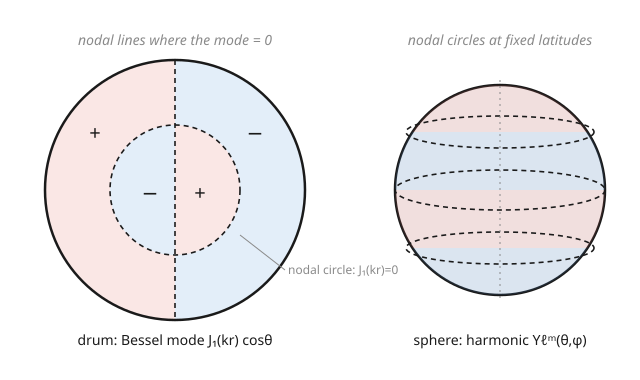

# Partial Differential Equations · Lesson 6.3: Separation in polar and spherical coordinates

> ⏱ ~15 min · Module 6: Nonlinear and special topics — a taste · Builds on: [6.2 A taste of finite differences and well-posedness](06-02-finite-differences-well-posedness.md) · Unlocks: (capstone — the end of the course)

## Why this matters

Separation of variables (Module 3) built us a machine: on a rectangle, split $u$ into a product, get sines and cosines, superpose. But nature is round. A drumhead is a disk, an atom is a sphere, a planet's gravity spreads over spherical shells. The instant you write the same equations — Laplace, Helmholtz, wave — in polar or spherical coordinates, the Laplacian sprouts extra terms, and the tidy sines are replaced by new eigenfunctions: **Bessel functions** on the disk, **Legendre polynomials** and **spherical harmonics** on the sphere. These are not exotic curiosities. The vibrating drum's overtones, the multipole expansion of a charge distribution, and — the punchline of your entire physics-adjacent education — the shape of the hydrogen atom's orbitals are all the *same separation calculation* you already know, run in curved coordinates.

## The idea

In Cartesian coordinates the Laplacian is democratic: $\nabla^2 u = u_{xx} + u_{yy}$, each direction contributes one clean second derivative. Curved coordinates break the symmetry. On a disk, radius $r$ and angle $\theta$ are not interchangeable — moving one radian of $\theta$ covers more ground far from the center than near it. That geometric fact shows up as **extra first-derivative and $1/r^2$ terms** in the Laplacian. When you separate $u(r,\theta) = R(r)\Theta(\theta)$, the angle equation is still the friendly $\Theta'' = -n^2\Theta$ — so $\Theta$ is $\cos n\theta$, $\sin n\theta$ — but there's a new twist: going once around the disk must return you to the same value, so $\Theta(\theta+2\pi)=\Theta(\theta)$, which **forces $n$ to be a whole number**. A boundary condition has quantized the angular index. (Remember that phrase; it is the entire spirit of quantum mechanics.)

The radial equation is where the new functions are born. For *Laplace's* equation it's an Euler equation with power-law solutions $r^{\pm n}$. For the *Helmholtz/wave* equation — a drumhead vibrating — it becomes **Bessel's equation**, whose solutions $J_n(r)$ are damped, spread-out cousins of sine and cosine. On a sphere, the polar-angle equation becomes **Legendre's equation**, solved by the Legendre polynomials $P_\ell(\cos\theta)$; glue the azimuthal $e^{im\phi}$ back on and you get the **spherical harmonics** $Y_\ell^m(\theta,\phi)$. Every one of these families is a set of **Sturm–Liouville eigenfunctions** (Lesson 3.4): orthogonal and complete. So the *machine* is unchanged — expand your data in these eigenfunctions, match coefficients — only the alphabet of functions is new.

## The formal version

**Polar Laplacian.** In coordinates $(r,\theta)$,
$$\nabla^2 u = u_{rr} + \frac{1}{r}u_r + \frac{1}{r^2}u_{\theta\theta}.$$
In words: it's not just "two second derivatives" — the geometry adds a $\tfrac1r u_r$ term and weights the angular part by $\tfrac{1}{r^2}$. Drop those and every answer is wrong.

**Angular separation and quantization.** Writing $u=R(r)\Theta(\theta)$ in Laplace's equation $\nabla^2 u=0$ and separating gives
$$\Theta'' = -n^2\,\Theta, \qquad r^2 R'' + rR' - n^2 R = 0.$$
Single-valuedness $\Theta(\theta+2\pi)=\Theta(\theta)$ requires $n \in \{0,1,2,\dots\}$, so $\Theta = \cos n\theta,\ \sin n\theta$. In words: the angle equation is the same oscillator as always, but wrapping around the circle admits only whole-number frequencies — a boundary condition quantizes $n$.

**Radial solutions.** The radial Euler equation has solutions $R = r^{n}$ and $r^{-n}$ (and $1,\ \ln r$ when $n=0$). In words: pick $r^{n}$ inside a disk (finite at the center), $r^{-n}$ outside (decays at infinity).

**Helmholtz $\to$ Bessel (the drum).** For the vibrating membrane, separating time out of the wave equation leaves the Helmholtz equation $\nabla^2 u + k^2 u = 0$; its radial part, after $\rho = kr$, is **Bessel's equation**
$$\rho^2 R'' + \rho R' + (\rho^2 - n^2)R = 0,$$
solved by the Bessel function $J_n(\rho)$ (the solution finite at $\rho=0$). In words: on a disk, "$\sin$" is replaced by $J_n$, an oscillation whose amplitude fades as it spreads outward.

**Sphere $\to$ Legendre / spherical harmonics.** Separating $\nabla^2 u = 0$ in spherical coordinates $(r,\theta,\phi)$ produces, for the polar angle, **Legendre's equation**
$$\frac{d}{dx}\!\left[(1-x^2)\frac{dP}{dx}\right] + \ell(\ell+1)P = 0, \qquad x=\cos\theta,$$
whose bounded solutions are the Legendre polynomials $P_\ell(x)$ for $\ell = 0,1,2,\dots$; combined with the azimuthal factor $e^{im\phi}$ they form the **spherical harmonics** $Y_\ell^m(\theta,\phi)$. In words: on a sphere the natural "notes" are the $Y_\ell^m$ — and $\ell,m$ are quantized for exactly the periodicity/boundedness reasons $n$ was on the disk.

All four families — $\{\cos n\theta,\sin n\theta\}$, $\{J_n\}$, $\{P_\ell\}$, $\{Y_\ell^m\}$ — are **Sturm–Liouville eigenfunctions**: mutually orthogonal (under the appropriate weight) and complete, so Module 3's expand-and-match-coefficients method transfers unchanged.

## Picture

## Worked examples

**Example 1 (Dirichlet problem on a disk — Boss Problem 6, second half).** Solve $\nabla^2 u = 0$ inside the disk $r < a$ with boundary data $u(a,\theta) = f(\theta)$.

Separate $u = R\Theta$. As above, $\Theta_n = \{1,\cos n\theta,\sin n\theta\}$ with $n=0,1,2,\dots$, and the interior-regular radial solution is $R_n = r^{n}$ (we discard $r^{-n}$ and $\ln r$ — they blow up at $r=0$). Superpose:
$$u(r,\theta) = \frac{a_0}{2} + \sum_{n=1}^{\infty} r^{n}\big(a_n\cos n\theta + b_n\sin n\theta\big).$$
Impose the boundary condition at $r=a$:
$$f(\theta) = \frac{a_0}{2} + \sum_{n=1}^{\infty} a^{n}\big(a_n\cos n\theta + b_n\sin n\theta\big).$$
This is just a Fourier series for $f$, with the coefficient of $\cos n\theta$ being $a^n a_n$. So $a^n a_n = \frac{1}{\pi}\int_0^{2\pi} f(\theta)\cos n\theta\,d\theta$, giving
$$a_n = \frac{1}{\pi a^{n}}\int_0^{2\pi} f(\theta)\cos n\theta\,d\theta, \qquad b_n = \frac{1}{\pi a^{n}}\int_0^{2\pi} f(\theta)\sin n\theta\,d\theta,$$
and $a_0 = \frac{1}{\pi}\int_0^{2\pi} f(\theta)\,d\theta$. Concretely, if $f(\theta) = 1 + 3\cos\theta - 2\sin 2\theta$, matching term by term is instant: $\tfrac{a_0}{2}=1$; the $\cos\theta$ term needs $a\,a_1 = 3$ so $a_1 = 3/a$; the $\sin 2\theta$ term needs $a^2 b_2 = -2$ so $b_2 = -2/a^2$. Hence
$$u(r,\theta) = 1 + \frac{3r}{a}\cos\theta - \frac{2r^2}{a^2}\sin 2\theta.$$
Check: each term is a solution of Laplace's equation (they're the real parts of $z^n$), and at $r=a$ it reproduces $f$. ✓ The whole method is Module 3 verbatim — the only new ingredient is the $r^n$ radial weight.

**Example 2 (the drum's frequencies — Helmholtz $\to$ Bessel).** A circular membrane of radius $a$, fixed at the rim, vibrates as $u(r,\theta,t) = R(r)\Theta(\theta)\cos(\omega t)$. Plugging into the wave equation $u_{tt} = c^2\nabla^2 u$ gives $\nabla^2(R\Theta) + k^2 R\Theta = 0$ with $k=\omega/c$. Separating off $\Theta = \cos n\theta$ (so $\Theta''=-n^2\Theta$) leaves, after substituting the polar Laplacian and clearing $\Theta$,
$$R'' + \frac{1}{r}R' + \Big(k^2 - \frac{n^2}{r^2}\Big)R = 0.$$
Let $\rho = kr$; this is exactly Bessel's equation, so the solution finite at the center is $R(r) = J_n(kr)$. The fixed-rim condition $R(a)=0$ forces $J_n(ka) = 0$: $k$ can only take values $k_{n,m} = \alpha_{n,m}/a$, where $\alpha_{n,m}$ is the $m$-th positive zero of $J_n$. Since $J_0$'s first zeros are $\alpha_{0,1}\approx 2.405,\ \alpha_{0,2}\approx 5.520,\dots$, the drum's fundamental frequency is $\omega_{0,1} = c\,\alpha_{0,1}/a \approx 2.405\,c/a$, and the overtones sit at ratios $5.520/2.405 \approx 2.30$, $8.654/2.405 \approx 3.60$, …. In words: the ratios are **not** integers — which is precisely why a drum sounds like a thud, not a pitched note like a string (whose overtones *are* integer multiples). The nodal circles you see on the drumhead are the radii where $J_n(kr) = 0$.

## Watch out

- **You might think** the Laplacian in polar/spherical coordinates is just "second derivatives in the new variables," **but actually** curvature adds first-derivative and $1/r^2$ terms: $\nabla^2 = \partial_{rr} + \tfrac1r\partial_r + \tfrac1{r^2}\partial_{\theta\theta}$ in 2D. Dropping the $\tfrac1r u_r$ term is the single most common wreck — it turns Bessel's equation into something with the wrong solutions.
- **You might think** $n$ could be any real number, **but actually** single-valuedness around the circle ($\Theta(\theta+2\pi)=\Theta(\theta)$) forces $n$ to be an integer, and boundedness on the sphere forces $\ell$ to be a non-negative integer. This "quantization from a boundary condition" is not a physics gimmick bolted on later — it is the mathematics of periodicity, and it is *the same reason* atomic energy levels are discrete.
- **You might think** Bessel functions, Legendre polynomials, and spherical harmonics are a new toolbox needing new tricks, **but actually** they are all Sturm–Liouville eigenfunctions (Lesson 3.4): orthogonal and complete. Every expand-in-eigenfunctions, match-coefficients, superpose move from Module 3 applies without change — only the weight function in the orthogonality integral differs.

## One-liner

> Round geometry keeps the separation machine but swaps the alphabet: circles give $\cos n\theta$ and Bessel $J_n$, spheres give Legendre $P_\ell$ and spherical harmonics $Y_\ell^m$ — all Sturm–Liouville eigenfunctions, all quantized by "come back where you started."

## Problems

**P1 (🟢)** Solve Laplace's equation inside the unit disk ($a=1$) with boundary data $u(1,\theta) = 4 + \cos 3\theta$. Write $u(r,\theta)$ explicitly.

**P2 (🟡)** A drumhead of radius $a=1$ (wave speed $c=1$) vibrates in a purely radial mode ($n=0$, no angular dependence). Given that the first two positive zeros of $J_0$ are $\alpha_{0,1}\approx 2.405$ and $\alpha_{0,2}\approx 5.520$, find the fundamental frequency and the frequency ratio of the first overtone to the fundamental. How many nodal circles (not counting the rim) does the $\alpha_{0,2}$ mode have inside the drum?

**P3 (🔴, optional)** Separate Laplace's equation $\nabla^2 u = 0$ in spherical coordinates for the *axially symmetric* case (no $\phi$-dependence): write $u(r,\theta) = R(r)\,\Theta(\theta)$ and show the angular equation is Legendre's equation with $x=\cos\theta$, while the radial equation is an Euler equation with solutions $r^{\ell}$ and $r^{-\ell-1}$. (Use the spherical Laplacian $\nabla^2 u = \frac{1}{r^2}(r^2 u_r)_r + \frac{1}{r^2\sin\theta}(\sin\theta\, u_\theta)_\theta$, dropping the $\phi$ term.)

Solutions

**P1** The general interior-regular solution on the unit disk is $u = \tfrac{a_0}{2} + \sum_{n\ge1} r^n(a_n\cos n\theta + b_n\sin n\theta)$. Match at $r=1$: the constant $\tfrac{a_0}{2} = 4$, and the only other term present is $\cos 3\theta$ with coefficient $1$, so $a_3 = 1$ and every other coefficient is zero. Since $a=1$, the radial weight is $r^3$:
$$u(r,\theta) = 4 + r^{3}\cos 3\theta.$$
Check: $r^3\cos 3\theta = \operatorname{Re}(z^3)$ is harmonic, the constant is harmonic, and at $r=1$ it gives $4+\cos 3\theta$. ✓

**P2** The radial modes are $J_0(k r)$ with $J_0(k) = 0$ (since $a=1$), so $k_{0,m} = \alpha_{0,m}$. With $c=1$, $\omega = ck = \alpha_{0,m}$.
- Fundamental: $\omega_{0,1} = \alpha_{0,1} \approx 2.405$.
- First overtone: $\omega_{0,2} = \alpha_{0,2} \approx 5.520$.
- Ratio: $5.520/2.405 \approx 2.296$ — not an integer, so the drum is inharmonic.
- Nodal circles of the $\alpha_{0,2}$ mode: $J_0(\alpha_{0,2}\,r) = 0$ for $r<1$ happens when $\alpha_{0,2}\,r$ equals an earlier zero of $J_0$, i.e. $r = \alpha_{0,1}/\alpha_{0,2} \approx 0.436$. That's **one** interior nodal circle (the rim at $r=1$ is the boundary, not counted). In general the $m$-th radial mode has $m-1$ interior nodal circles.

**P3** With no $\phi$-dependence, substitute $u=R(r)\Theta(\theta)$ into $\frac{1}{r^2}(r^2 R')'\Theta + \frac{1}{r^2\sin\theta}(\sin\theta\,\Theta')' R = 0$. Multiply by $r^2/(R\Theta)$:
$$\frac{(r^2 R')'}{R} + \frac{(\sin\theta\,\Theta')'}{\sin\theta\,\Theta} = 0.$$
The first term depends only on $r$, the second only on $\theta$, so each is a constant, $\pm\lambda$. Write the separation constant as $\lambda = \ell(\ell+1)$:
$$\text{(radial)}\quad (r^2 R')' = \ell(\ell+1)R \ \Longrightarrow\ r^2 R'' + 2rR' - \ell(\ell+1)R = 0,$$
an Euler equation; trying $R=r^s$ gives $s(s-1)+2s-\ell(\ell+1) = s^2+s-\ell(\ell+1) = (s-\ell)(s+\ell+1)=0$, so $s=\ell$ or $s=-\ell-1$, i.e. $R = r^{\ell},\ r^{-\ell-1}$.
$$\text{(angular)}\quad \frac{1}{\sin\theta}(\sin\theta\,\Theta')' + \ell(\ell+1)\Theta = 0.$$
Substitute $x=\cos\theta$, so $\frac{d}{d\theta} = -\sin\theta\frac{d}{dx}$ and $\sin^2\theta = 1-x^2$. Then $\sin\theta\,\Theta' = -\sin^2\theta\,\frac{d\Theta}{dx} = -(1-x^2)\Theta_x$, and $\frac{1}{\sin\theta}\frac{d}{d\theta}[\cdots] = \frac{d}{dx}[(1-x^2)\Theta_x]$. The angular equation becomes
$$\frac{d}{dx}\!\left[(1-x^2)\frac{d\Theta}{dx}\right] + \ell(\ell+1)\Theta = 0,$$
which is Legendre's equation. Bounded solutions on $[-1,1]$ exist only for $\ell = 0,1,2,\dots$, namely the Legendre polynomials $P_\ell(x) = P_\ell(\cos\theta)$. ✓ (The choice $\lambda=\ell(\ell+1)$ isn't magic — it's the value that makes the Legendre solutions finite at the poles $\theta = 0,\pi$.)

## Flashback

**From Lesson 3.4 (Sturm–Liouville theory):** The functions $\{\sin n\theta\}_{n\ge1}$ on $[0,\pi]$ are the eigenfunctions of $-\Theta'' = \lambda\Theta$ with $\Theta(0)=\Theta(\pi)=0$. Using only orthogonality, expand $f(\theta) = \theta(\pi-\theta)$ far enough to find the coefficient $b_1$ of $\sin\theta$, and state why the expansion is guaranteed to converge to $f$ in the mean.

Solution

Sturm–Liouville orthogonality gives $\int_0^\pi \sin m\theta\,\sin n\theta\,d\theta = \tfrac{\pi}{2}\delta_{mn}$, so the coefficients are $b_n = \frac{2}{\pi}\int_0^\pi \theta(\pi-\theta)\sin n\theta\,d\theta$. For $b_1$:
$$b_1 = \frac{2}{\pi}\int_0^\pi (\pi\theta - \theta^2)\sin\theta\,d\theta.$$
Integrate by parts (or use the standard antiderivatives $\int\theta\sin\theta\,d\theta = \sin\theta - \theta\cos\theta$ and $\int\theta^2\sin\theta\,d\theta = 2\theta\sin\theta - (\theta^2-2)\cos\theta$):
$$\int_0^\pi \theta\sin\theta\,d\theta = [\sin\theta - \theta\cos\theta]_0^\pi = 0 - \pi(-1) = \pi,$$
$$\int_0^\pi \theta^2\sin\theta\,d\theta = [2\theta\sin\theta - (\theta^2-2)\cos\theta]_0^\pi = -(\pi^2-2)(-1) - (2) = \pi^2 - 2 - 2 = \pi^2 - 4.$$
So $\int_0^\pi(\pi\theta-\theta^2)\sin\theta\,d\theta = \pi\cdot\pi - (\pi^2-4) = 4$, and $b_1 = \frac{2}{\pi}\cdot 4 = \frac{8}{\pi} \approx 2.546$. Convergence in the mean (i.e. in $L^2$) is *guaranteed* because the Sturm–Liouville eigenfunctions form a **complete** orthogonal set, and $f(\theta)=\theta(\pi-\theta)$ is square-integrable on $[0,\pi]$ — completeness is exactly the statement that every such $f$ is the $L^2$-limit of its eigenfunction expansion. (In fact this $f$ vanishes at both endpoints, so the series converges uniformly too.)

## Connections

- **Backward:** this is [3.1](03-01-separation-of-variables.md) separation of variables and [3.4](03-04-sturm-liouville-theory.md) Sturm–Liouville theory, run in curved coordinates — the method is identical, only the Laplacian (and hence the ODEs and their eigenfunctions) changes. The disk Dirichlet problem is [2.3](02-03-laplace-poisson-equations.md)'s Laplace equation with round boundary data.
- **Forward (quantum mechanics):** the hydrogen atom is *this exact separation* with a Coulomb potential added — Schrödinger's equation in spherical coordinates separates into a radial equation and the very same angular equation, so the spherical harmonics $Y_\ell^m$ **are** the atomic orbitals' angular shapes, and $\ell,m$ are the angular-momentum quantum numbers. When you meet [quantum-mechanics](../../quantum-mechanics/syllabus.md), you'll find you already did the hard part here.
- **Sideways (electromagnetism):** the **multipole expansion** of a charge or mass distribution is a Legendre-polynomial series in $\cos\theta$ — monopole ($P_0$), dipole ($P_1$), quadrupole ($P_2$), … — the same $P_\ell$ that fell out of the sphere's polar equation. See [em-refresher](../../em-refresher/syllabus.md).
- **Sideways (mechanics):** central-force problems in [analytical-mechanics](../../analytical-mechanics/syllabus.md) separate into radial and angular motion by the identical logic; conserved angular momentum is the mechanical shadow of the angular eigenvalue $\ell(\ell+1)$.

---

**Capstone — the whole course in one breath.** You started by learning to *classify* a second-order PDE (hyperbolic, parabolic, elliptic) and to read its characteristics — because the type dictates what "well-posed" even means. That gave you the three canonical equations: the **heat** equation (parabolic, diffusion, smoothing), the **wave** equation (hyperbolic, finite-speed signals, d'Alembert), and **Laplace/Poisson** (elliptic, equilibrium, maximum principles). Module 3 handed you the master technique for bounded domains — **separation of variables**, which manufactures eigenvalue problems whose solutions (Fourier series, and more generally Sturm–Liouville eigenfunctions) you superpose to match any data. Module 4 traded the sum for an integral: **Fourier and Laplace transforms** solve the same equations on unbounded domains, revealing solution **kernels** like the heat kernel and the dispersion relations of waves. Module 5 built **Green's functions** — the response to a point source, from which every other source follows by superposition, sharpened by the delta function, the method of images, and Duhamel's principle for time. Module 6 then showed the frontier: **nonlinearity** (shocks in Burgers' equation, where smooth data breaks), **numerics** (finite differences, and the stability that decides whether they work), and — today — **special functions** in curved coordinates, where the separation machine reappears wearing Bessel, Legendre, and spherical-harmonic clothing.

Where PDEs go from here: the finite element method and modern numerical analysis for real geometries; Sobolev spaces and functional analysis for the "weak solutions" that make sense of nonsmooth data; the nonlinear PDEs at the heart of fluid dynamics (Navier–Stokes), general relativity (Einstein's equations), and geometry (Ricci flow); and stochastic PDEs where randomness drives the evolution. But the spine you've built — *classify, then choose your tool: separate, transform, or Green's-function it* — is the one every PDE course, pure or applied, is secretly organized around. You now have it. That's the course.
