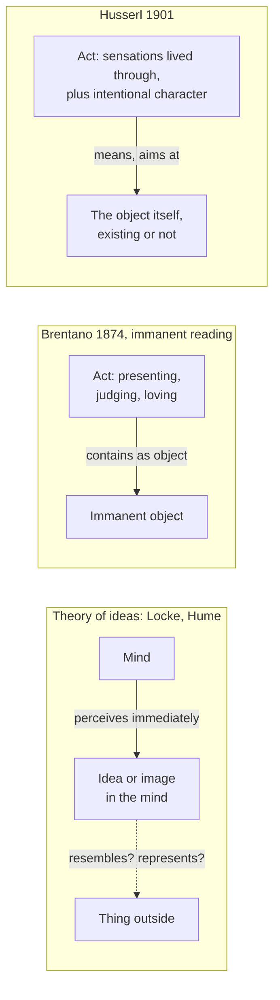

# Phenomenology & Personalism · Lesson 1.1: Intentionality: from Brentano to Husserl

> ⏱ ~15 min · Module 1: Husserl and the phenomenological method · Builds on: [modern-philosophy 3.1](../../modern-philosophy/lessons/03-01-locke-against-innate-ideas.md), [4.1](../../modern-philosophy/lessons/04-01-impressions-ideas-and-the-fork.md), [6.4](../../modern-philosophy/lessons/06-04-hegel-dialectic-and-spirit.md) · Unlocks: [1.2 The anatomy of an experience](01-02-the-anatomy-of-an-experience.md)

## Why this matters

Every thinker in this course starts from one claim: consciousness is always consciousness *of* something. Heidegger rebuilds it as being-in-the-world, Sartre makes it the emptiness of the for-itself, Scheler extends it to feelings of value, Stein to empathy, Wojtyła to action. The claim entered modern philosophy with Franz Brentano in 1874, and Edmund Husserl reshaped it in the *Logical Investigations* (1900–01) into a weapon against two pictures of the mind: the theory of ideas, on which the mind meets only its own ideas, and psychologism, on which logic is a chapter of psychology.

## The idea

Fear, belief, wish, memory: each points past itself. You fear *the dog*, believe *that it is friendly*, wish *it gone*. A stone points at nothing. That contrast is the whole thesis, and the work lies in saying what "pointing" is.

**Brentano.** Franz Brentano (1838–1917) wanted to fix the subject matter of an empirical psychology, so in Book II of *Psychology from an Empirical Standpoint* he looked for a mark separating mental from physical phenomena. (For him a "physical phenomenon" is a sensory content, a colour or a tone as sensed, not a physical object.) His answer is the Source below: [intentional inexistence](../reference.md#intentional-inexistence). Every mental phenomenon contains an object, in one of three basic ways: *Vorstellung* (presentation: merely having something before the mind), judgment (accepting or rejecting what is presented), and love and hate (feeling, desire, will). Judging and loving are always built on a presentation. Even feelings, which William Hamilton had called objectless, count: Brentano replies that pleasure at a harmonious sound is at least pleasure in the hearing.

The scholastic word misleads modern ears. *In*-existence is existence-*in*, not non-existence. Brentano's footnote runs the lineage from Aristotle through Augustine and Anselm to Aquinas, who taught that the thing understood is "intentionally" in the one who understands. So the 1874 wording can be read two ways. On the **immanent reading**, every act has an object lodged inside it, existing whether or not anything outside answers to it. On the **directedness reading**, Brentano only meant that the act is aimed, and his parenthesis ("not a reality") warns against reifying the target. Brentano himself later called intentionality a quasi-relation, one that holds whether or not its object exists.

**The backdrop.** German philosophy around 1900 was largely neo-Kantian: the Marburg school (Hermann Cohen, Paul Natorp) on logic and the exact sciences, the Southwest or Baden school (Wilhelm Windelband, Heinrich Rickert) on validity, value and the historical sciences ([neo-Kantianism](../reference.md#neo-kantianism)). Both already held that validity is not a psychological fact. Husserl reached the same conclusion by a different road: description, not transcendental deduction.

**Husserl's first break: psychologism.** Husserl (1859–1938) came to philosophy through Brentano's lectures in Vienna (1884–86). His *Philosophy of Arithmetic* (1891) sought a psychological foundation for number, and Gottlob Frege's 1894 review charged it with [psychologism](../reference.md#psychologism): the view that the theoretical foundations of logic lie in psychology. Many commentators read Husserl's change of mind as a response to Frege. J. N. Mohanty (1982) argued that its seeds were already in Husserl's own development. The *Prolegomena* (1900) confesses the conversion by quoting Goethe: "One is strict against nothing so much as against errors only just laid aside" (translation ours, from the 1900 German).

The case against psychologism comes in the argument below. Its heart is that a logical law is not a law of how minds run. Husserl's example (§22): a calculating machine sets out its digits, by natural law, just as arithmetic requires, yet no one explains its workings by arithmetic instead of mechanics. And the relativist version fails on the sense of the word "true" (§36):

> What is true is absolutely, "in itself" true; truth is identically one, whether humans or non-humans, angels or gods grasp it in judgment. (translation ours, from the 1900 German)

**Husserl's second break: the object is not in the mind.** The Fifth Investigation (1901) keeps Brentano's directedness and drops the "in". When I imagine the god Jupiter, analyse the experience as you like and you will find no Jupiter among its parts. The "immanent" object is not immanent at all. It is not *extra mentem* either; it does not exist. What exists is the Jupiter-presenting, and it would be described exactly the same if Jupiter were real. What *is* in the act (its *reell* parts) are sensations and the act's intentional character, and these are lived through, not intended (§11):

> I do not see colour-sensations but coloured things, I do not hear tone-sensations but the singer's song. (translation ours, from the 1901 German)

So Husserl, unlike Brentano, admits experiences that are not acts. A burn's pain is a sensation; it becomes "the pain in my finger" only when an act apprehends and localizes it, and joy *about* an event is an act built on such sensations. For a dim longing with no conscious goal, he offers two descriptions (§15): bare sensations, or an intention aimed at an indeterminate "something", like hearing that "something" rustles, where the indeterminacy is a feature of the aim, not a lack of one. That is [intentionality](../reference.md#intentionality) in Husserl's sense: an [act, content, object](../reference.md#act-content-object) structure, analysed further in [1.2](01-02-the-anatomy-of-an-experience.md).

**Against the theory of ideas.** Locke's idea is the mind's immediate object ([modern-philosophy 3.2](../../modern-philosophy/lessons/03-02-locke-qualities-substance-and-essence.md)), and Hume's perceptions are all the mind ever has before it ([4.1](../../modern-philosophy/lessons/04-01-impressions-ideas-and-the-fork.md)). Husserl's appendix to §§11 and 20 attacks this [image theory](../reference.md#image-theory): a resemblance between an inner picture and an outer thing is nothing *for* a consciousness that has only the picture. Something becomes an image only when an act uses it to mean something else. Hence:

> the intentional object of the presentation is the same as its actual and, where applicable, its external object, and it is absurd to distinguish between the two. (translation ours, from the 1901 German)

## Source

Brentano, *Psychologie vom empirischen Standpunkte* (1874), Book II ch. 1 §5, pp. 115–16 (translation ours, from the 1874 German).

> Every mental phenomenon is characterized by what the Scholastics of the Middle Ages called the intentional (or mental) inexistence [*Inexistenz*] of an object, and what we, though with expressions not wholly free of ambiguity, would call relation to a content, direction toward an object (by which a reality is not to be understood here), or immanent objectivity [*immanente Gegenständlichkeit*]. Each contains something as object within itself, though not each in the same way. In presentation something is presented, in judgment something is acknowledged or rejected, in love loved, in hate hated, in desire desired, and so on. This intentional inexistence is peculiar exclusively to mental phenomena. No physical phenomenon shows anything similar.

Notice the hedge: Brentano flags his own terms as ambiguous, then offers three of them that pull different ways.

## The argument

**A. Against psychologism** (*Prolegomena* §§21–23, 36).

1. **Psychologism: the foundations of logic lie in psychology, a science of mental fact.** *In words:* logic describes how we think.
2. **Psychology's laws are vague generalizations, justified by induction, so at best probable.**
3. **Logical laws are exact and known a priori.** *In words:* non-contradiction does not say contradictions are *probably* not both true.
4. **No logical law implies a matter of fact, not even that judgments exist.** *In words:* modus ponens would hold in a world with no thinkers.
5. **∴ Logical laws are not psychological laws.** Relativizing truth to a species's constitution makes one proposition true for us and false for others, against the sense of "true".

**B. Directedness without immanent objects** (Fifth Investigation §11 and appendix).

6. **An act's real parts are its sensations and its intentional character; its object is not among them.** *In words:* no Jupiter is found in the Jupiter-presenting.
7. **The act is described identically whether its object exists, is fictional or is impossible.**
8. **An inner image represents nothing by resemblance alone; only an act that means the thing through it makes it an image.**
9. **∴ Directedness is a descriptive character of the act, and its intentional object is the object itself.** "Merely intentional" means the intention exists and the object does not.

**Where the argument is weakest.** Premise 9 makes "of" look like a relation with one end missing. Kazimierz Twardowski, another of Brentano's students, argued in *On the Content and Object of Presentations* (1894) that there are no objectless presentations, only presentations whose object does not exist. His content is the immanent object, a mental part of the act; the object proper is what the presentation is about, round squares included. If the Jupiter-presenting is *about* something, what is that something, if it "is nothing"? Husserl's reply: aboutness needs no second term, because what an act is of is fixed by its own content, its "matter" ([1.2](01-02-the-anatomy-of-an-experience.md)). The rejoinder is that this relocates the problem. When two acts are "of the same Jupiter", the sameness must lie in their contents, and what kind of thing a shared content is becomes the noema debate of 1.2.

## Picture

The dashed edge is the image theory's problem: nothing in the mind makes the idea *of* the thing. Brentano's arrow stays inside the act; Husserl's leaves it.

## Worked examples

**Example 1 (clean: the tram).** Ana sees a tram coming, judges that it is the number 12, and hopes it is not full. Brentano: a presentation, a judgment (acceptance) founded on it, and a phenomenon of love and hate founded on both. Husserl: three acts with one object, the tram, intended in three modes. The yellow sensations are lived through, not seen; she sees the tram. Now she infers: "If it's the 12, it goes to the station; it is the 12; so it goes." Her inferring is a dated event in her head. The validity of the form she used is no event at all. A psychologist could explain why she drew the inference, as the mechanic explains the calculator; that would not show that the inference is valid.

**Example 2 (hard: the phantom foot).** Tomas lost his left leg, and on cold nights feels a cramp in the left foot. Brentano: the pain feeling rests on a presentation of a localized pain-quality, a physical phenomenon in his sense, so it is intentional whether or not any foot answers to it. Husserl: the cramp-sensation itself is not an act; an act apprehends it as "in my foot", and that act's object, the foot, does not exist, exactly like Jupiter. The account strains here. Husserl concedes that "feeling" is equivocal between sensation and act (§15), and the phenomenology gives no sharp line between the felt cramp and its felt place. Is the location part of the sensation or of the apprehension? Description alone does not decide.

## Watch out

- **You might think "intentional" means "on purpose", but it is a [term of art](../reference.md#terms-of-art) for directedness.** A hallucination, a doubt and a sudden memory are all intentional; nothing is chosen.
- **You might think "inexistence" means non-existence, but the *in* is locative.** Existence-*in* is the scholastic sense; the puzzle about non-existent objects arises because Brentano adds that the object need not be real.
- **You might think "phenomenon" means the same here as in Kant or Hegel, but it does not.** Kant's phenomena are appearances contrasted with things in themselves ([modern-philosophy 6.1](../../modern-philosophy/lessons/06-01-transcendental-idealism-and-the-thing-in-itself.md)). Hegel's phenomenology is the road of consciousness to absolute knowing ([6.4](../../modern-philosophy/lessons/06-04-hegel-dialectic-and-spirit.md)). Husserl's phenomenon is whatever is given, exactly as given; the appearing thing is the thing, not a stand-in for it. In 1901 he even allowed that phenomenology is "descriptive psychology" (Introduction §6), then drew the line: description of acts is a preliminary stage, not the theory that grounds logic, and so is better named phenomenology.

## One-liner

> Brentano made "directed at an object" the mark of the mental; Husserl kept the direction, threw out the object in the mind, and so freed both logic and perception from psychology's inner pictures.

## Problems

**P1 (🟢) *(Exegetical (a) · Evaluative (b).)*** Apply to a hard case (invented). On a feverish day Mara (i) is angry at her landlord for the broken boiler, (ii) wakes with a bright elation about nothing she can name, (iii) sees a cat on the stair where there is none, and (iv) wonders whether there is a largest prime. (a) For each, say whether it is intentional on Brentano's thesis and on Husserl's 1901 account, and what its object is. One line each. (b) Does (ii) refute the thesis that consciousness is always of something? Any verdict; 100 words or fewer.

**P2 (🟡) *(Exegetical.)*** Close reading. Use the Source. (a) Quote two phrases that support the immanent reading and two that support the directedness reading. (b) Find the crux between Brentano on the immanent reading and Husserl: name the one premise Husserl denies, and give the argument from this lesson he offers against it. 80 words or fewer for (b).

**P3 (🔴) *(Exegetical (a) · Evaluative (b).)*** Diagnose. An invented seminar handout:

> "Husserl never escaped psychologism. His 1891 book grounded arithmetic in mental acts, Frege's review exposed this, and the *Logical Investigations* merely relabelled the project: the 1901 volume calls phenomenology 'descriptive psychology' and spends hundreds of pages on acts of meaning and judging. If logic is clarified by describing how we think, its laws are laws of how we think."

(a) Name three errors and correct each from this lesson. One or two sentences each. (b) A sharper critic: "Husserl says logical laws are known with apodictic evidence. But evidence is an experience someone has, so psychology returns by the back door." Give Husserl's best reply and say whether it works. Any verdict; 100 words or fewer.

Solutions

**P1** *(Exegetical (a) · Evaluative (b).)*

**Accept:** for (ii), either of Husserl's two descriptions, if it is presented as his disjunction.

**Must hit, strict (a):**

- (i) Intentional on both: a phenomenon of love and hate (displeasure) founded on a presentation; object: the landlord, as the one who left the boiler broken.
- (ii) Brentano: intentional, since every feeling rests on a presentation, though its object need not be external (his own example: pleasure in the hearing, not in the tone). Husserl: either bare feeling-sensations, which are experiences but not acts, or an intention aimed at an indeterminate "something".
- (iii) Intentional on both. Brentano: the cat has intentional inexistence though no cat exists. Husserl: the act is real and is of a cat; the cat is "merely intentional", meaning the intention exists and the cat does not.
- (iv) Intentional on both; the object, a largest prime, cannot exist, and the act is described the same as any other (Husserl's round square and thousand-sided figure). No number is a part of her mind.

**Must hit, any verdict (b):**

- Say which thesis is in play. Brentano's covers every mental phenomenon; Husserl's covers acts and openly admits non-intentional experiences (sensations).
- Test (ii) against each: a real challenge to Brentano (it is Hamilton's objection), not a counterexample to Husserl unless the elation is shown to be neither sensation nor indeterminate intention.

**Wrong turns:** calling (iii) non-intentional because there is no cat; that confuses existence of the object with directedness. Reading "intentional" as "deliberate". Saying Husserl holds that all experiences are acts.

**Model answer (b), one of several:** It depends whose thesis. Against Brentano's claim that every mental phenomenon contains an object, objectless elation is a serious case, the one Hamilton pressed and Brentano answered by finding an object (the experience itself). Against Husserl it misses, because he never claimed every experience is an act. He would describe the elation as pleasure-sensations no longer referred to any event, or as an intention aimed at an indeterminate something. The open question is which description fits, and description alone may not settle it, which is where Heidegger's treatment of mood (2.3) begins.

---

**P2** *(Exegetical.)*

**Must hit, strict (a):**

- Immanent: "intentional (or mental) inexistence"; "immanent objectivity"; "contains something as object within itself" (any two).
- Directedness: "direction toward an object"; "(by which a reality is not to be understood here)" (both, or "relation to a content" with a reason).

**Must hit, strict (b):**

- The premise: an act's object is a constituent of the act (or an inner correlate that exists in it), so an act about nothing real still has an existing object "in" it.
- Husserl's argument: description finds no Jupiter among the act's real parts; the act is described the same whether its object exists; and the intentional object is the actual object, so distinguishing an inner one is absurd (the image theory cannot say what makes an inner object *of* the outer one).

**Wrong turns:** saying Husserl rejects directedness; he keeps it. Reading "inexistence" as non-existence. Claiming the Source decides for one reading; Brentano himself calls his terms ambiguous, and later called intentionality a quasi-relation.

**Model answer (b):** Husserl denies that the object is in the act. When I present Jupiter, no Jupiter is among the act's real parts, which are sensations and an intentional character. The act would be described identically if Jupiter existed, so the object meant is the object itself, existing or not. An inner stand-in would only raise the image theory's problem: what makes it *of* anything.

---

**P3** *(Exegetical (a) · Evaluative (b).)*

**Must hit, strict (a):** any three of:

- Describing acts is not grounding logic. Husserl's 1901 Introduction (§6) answers this objection: description is a preliminary stage, not the theory, and he prefers "phenomenology" to keep it apart from explanatory psychology.
- Logical laws are not laws of how we think: they are exact and a priori, and imply no matter of fact, not even that judgments exist (§§21–23). The calculator runs as arithmetic requires, but arithmetic does not explain its run.
- The Frege story is disputed. Many read the change as a response to the 1894 review; Mohanty argued its seeds were Husserl's own. Either way it records a break, which contradicts "never escaped".
- The *Prolegomena* itself is the self-critique: it quotes Goethe on severity toward errors only just laid aside.

**Must hit, any verdict (b):**

- State the reply: the act of evidence is a psychological event; what it grasps is not. The distinction is intentionality's own: act versus object.
- Test it: the critic can grant the distinction and insist that our *access* to ideal laws still runs through acts, so the epistemology of logic stays psychological. Say whether Husserl has an answer here, or what further work (the reductions of 1.3) must do.

**Wrong turns:** answering (b) with (a)'s points; the critic grants that the laws are not about minds. Asserting that Frege's review caused the turn as settled fact.

**Model answer (b), one of several:** Husserl would say the critic conflates act and object. Having evidence is an event in someone; what is evident, that contradictories are not both true, is not about that event, and the law would hold if no one ever grasped it. That answers the claim that logic's *content* is psychological. It does not yet answer the claim that our *knowledge* of logic is psychological, since every grasp of an ideal law is someone's act. Husserl owes an account of how acts give ideal objects, and that is the task his later method takes on. The reply works against psychologism about content and only promises an answer about access.

## Connections

- **Backward:** the theory of ideas Husserl rejects is Locke's ([modern-philosophy 3.1](../../modern-philosophy/lessons/03-01-locke-against-innate-ideas.md), [3.2](../../modern-philosophy/lessons/03-02-locke-qualities-substance-and-essence.md)) and Hume's ([4.1](../../modern-philosophy/lessons/04-01-impressions-ideas-and-the-fork.md)). Reid attacked the same "way of ideas" from common sense ([4.5](../../modern-philosophy/lessons/04-05-reid-common-sense-against-the-way-of-ideas.md)); Husserl attacks it by description. The older senses of "phenomenon" are Kant's ([6.1](../../modern-philosophy/lessons/06-01-transcendental-idealism-and-the-thing-in-itself.md)) and Hegel's ([6.4](../../modern-philosophy/lessons/06-04-hegel-dialectic-and-spirit.md)).
- **Forward:** [1.2](01-02-the-anatomy-of-an-experience.md) dissects the act into quality and matter and asks what fulfils it; [1.3](01-03-the-epoche-and-the-reductions.md) turns description into method. Scheler ([4.1](04-01-scheler-values-given-in-feeling.md)) will argue that feelings of value are intentional acts, not sensations, and Stein ([4.3](04-03-stein-empathy.md)) treats empathy as an act of its own kind.
- **Sideways:** Brentano's thesis as a live claim about minds, and whether pains and moods are intentional, belongs to [`philosophy-of-mind`](../../philosophy-of-mind/syllabus.md) 4.1. Frege's side of the quarrel over sense and meaning is in [`philosophy-of-language-and-logic`](../../philosophy-of-language-and-logic/syllabus.md).
