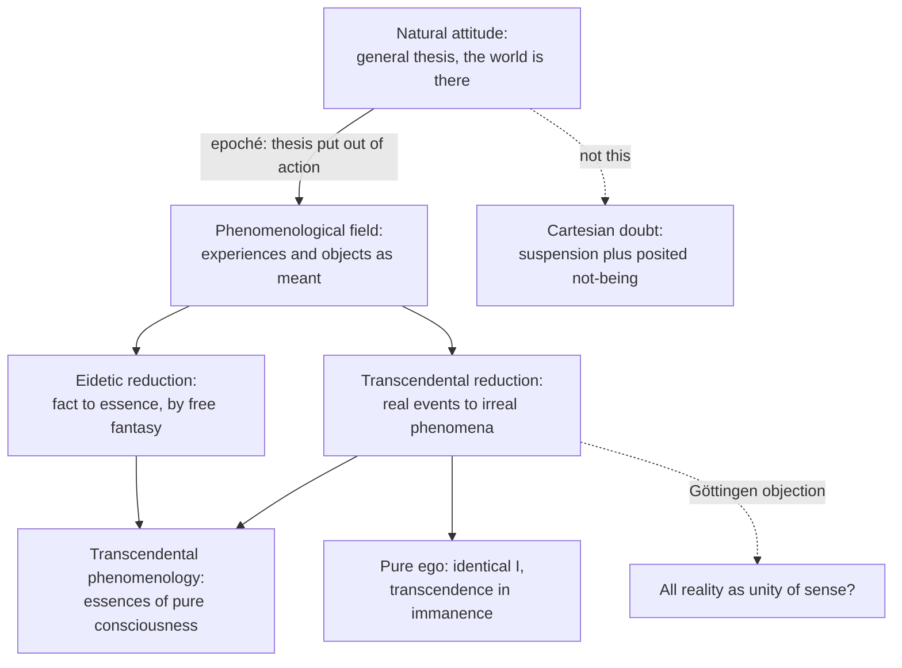

# Phenomenology & Personalism · Lesson 1.3: The natural attitude, the epoché and the reductions

> ⏱ ~15 min · Module 1: Husserl and the phenomenological method · Builds on: [1.2 The anatomy of an experience](01-02-the-anatomy-of-an-experience.md), [modern-philosophy 1.1](../../modern-philosophy/lessons/01-01-the-method-of-doubt.md), [1.2](../../modern-philosophy/lessons/01-02-the-cogito-and-the-wax.md), [5.4](../../modern-philosophy/lessons/05-04-the-transcendental-deduction.md) · Unlocks: [1.4 The lifeworld and the crisis of the sciences](01-04-the-lifeworld-and-the-crisis-of-the-sciences.md), [2.2 Heidegger: Dasein and being-in-the-world](02-02-heidegger-dasein-and-being-in-the-world.md)

## Why this matters

[1.2](01-02-the-anatomy-of-an-experience.md) described experiences. What makes the description philosophy rather than careful introspection? Husserl's answer in *Ideas* I (*Ideen* I, 1913) is a change of attitude, the epoché, and the "reductions" it opens. It is the tradition's most misread move, taken for doubt, solipsism or a refusal of science, and it split the movement. Husserl's first students read the book as a turn to idealism, and much of this course (Heidegger, Stein, Wojtyła) descends from that quarrel.

## The idea

**The natural attitude** (*natürliche Einstellung*, §§27–30). I am aware of a world endlessly spread out in space and time. Things and people are simply *there*, attended to or not, inside a co-meant surround (the room behind my back, the garden) and a dim horizon that never runs out. It comes already as a world of values and goods, and others find the same world from their own places (§29).

What matters is one feature Husserl calls the [general thesis](../reference.md#natural-attitude) (*Generalthesis*, §30): the world is taken as existing, as actuality, always already there. It is not a judgment I make. It is a standing character, "there", "on hand" (*vorhanden*), that every experience carries before any thinking (§31). Doubting one thing never touches it: a hallucination is struck *out of* a world that stays there. The sciences live inside the same thesis.

**The epoché** (§§31–32). Husserl starts from Descartes's attempt at universal doubt ([modern-philosophy 1.1](../../modern-philosophy/lessons/01-01-the-method-of-doubt.md)), but only as an aid, to isolate one component in it. Trying to doubt something requires putting its being out of play. Doubt adds more: it posits not-being as a live alternative. Descartes adds so much, Husserl says, that his attempt is really an attempt at universal *negation*. The [epoché](../reference.md#epoche) (Greek *epochē*, "holding back") keeps only the suspension. It is not negation, not conjecture, not doubt, and §31 adds that it is not *supposing* either. The conviction stays exactly as it was; we make "no use" of it. Husserl even says the suspension is compatible with conviction that is unshaken because evident. The Source gives his images: brackets, and a switch thrown in a circuit.

The suspension is targeted (§32). It takes the general thesis, and with it every science of the natural world, which Husserl admires and does not contest. He simply takes none of their propositions as a premise while the brackets hold.

**What remains.** Nothing is deleted. The perceived tree is still there *as perceived*, profiles, horizons, even its character "existing", now described instead of relied on: experiences with their objects *as meant* (the noema of [1.2](01-02-the-anatomy-of-an-experience.md)). Husserl calls it pure or transcendental consciousness, the "phenomenological residuum" (§33).

**The principle of all principles** (§24) says what may be done in that field:

> every originarily giving intuition is a legitimate source [*Rechtsquelle*] of cognition; whatever presents itself to us originarily in intuition [...] is simply to be taken as what it gives itself as, but also only within the limits in which it gives itself.

*(Translation ours, from the 1913 German.)* In words: what shows up in person counts as evidence, as far as it shows up and no further. That is the [principle of all principles](../reference.md#principle-of-all-principles), and its last clause is a restriction, not a licence.

**Two reductions.** The Introduction to *Ideas* I says empirical psychology is a science of *facts* and of *realities* (things in the one spatio-temporal world). Phenomenology departs from it twice:

- The **eidetic reduction** leads from fact to essence (*eidos*). An essence can be exemplified in perception, but equally in "mere fantasy", and §4 lists melodies and social events among the examples. The geometer works far more in imagination than on the drawing, because imagination lets him reshape figures freely (§70). Hence Husserl's paradox that fiction is the vital element [*Lebenselement*] of phenomenology. Vary an example; what cannot change without losing the kind is its essence. Husserl's later manuscripts work this into a method of [eidetic variation](../reference.md#eidetic-variation).
- The **[transcendental reduction](../reference.md#transcendental-reduction)** leads from real psychological events to "irreal" phenomena: the epoché strips experiences of their place in the real world, leaving consciousness as that in which the world has its sense.

**The ego that remains.** In 1901 Husserl had written that he simply could not find a pure ego as a necessary centre of relation (*Logical Investigations* V, §8, against Paul Natorp). By 1913 he finds one (§57). The empirical human being is bracketed; what survives is an identical "I" whose regard passes through every act without being part of any. Husserl cites Kant's line that the "I think" must be able to accompany all my representations, then calls this ego a "transcendence in immanence". The difference from Kant ([5.4](../../modern-philosophy/lessons/05-04-the-transcendental-deduction.md)) is method. Kant's "I think" is a thought, not an intuition, a condition reached by argument. Husserl's pure ego counts as a datum exactly as far as it is evidently co-given with each act; every further doctrine about it is bracketed. This is the [transcendental ego](../reference.md#transcendental-ego).

**The restaging.** In February 1929 Husserl lectured at the Sorbonne. The expanded text appeared as *Méditations cartésiennes* (1931), in French, translated by Gabrielle Peiffer and Emmanuel Levinas; no German edition appeared in his lifetime. It restages Meditation II ([modern-philosophy 1.2](../../modern-philosophy/lessons/01-02-the-cogito-and-the-wax.md)). Husserl says one might almost call his phenomenology a neo-Cartesianism, while rejecting nearly all of Descartes's doctrines. He faults Descartes for taking the ego as a thinking substance, a small piece of the world from which the rest must be inferred. The transcendental ego is not in the world. It is where the world's sense is given.

## Source

Husserl, *Ideen* I, §31 then §32 *(translation ours, from the 1913 German)*.

> The thesis we have performed we do not give up; we change nothing in our conviction, which remains in itself as it is so long as we introduce no new motives of judgment, which is just what we do not do. And yet it undergoes a modification: while it remains in itself what it is, we put it, as it were, "out of action" [*außer Aktion*], we "switch it off" [*schalten sie aus*], we "bracket it" [*klammern sie ein*]. It is still there, like the bracketed within the bracket, like what is switched off outside the circuit. [...]
>
> If I do this, as is fully within my freedom, then I do not negate this "world" as though I were a sophist, I do not doubt its existence [*Dasein*] as though I were a sceptic; but I practise the "phenomenological" epoché [ἐποχή], which completely closes off to me every judgment about spatio-temporal existence.

A bracketed term is still on the page; a switched-off circuit is still wired. And what is closed off is *judgment about* existence, not existence.

## The argument

Husserl's route to "transcendental idealism" (§§49, 55), which his students fought over.

1. **A real thing is given only through profiles, in experiences that must keep agreeing; its existence is the correlate of ordered manifolds of experience** (§§41–49). *In words:* a thing is what a run of harmonious appearances keeps confirming.
2. **Nothing in the essence of experience guarantees the agreement. It is conceivable that experience dissolves into conflict that cannot be reconciled, so that there is no world any longer** (§49). *In words:* a world is a contingent achievement of experience.
3. **Then the stream of experience would be modified, but not touched in its own existence** (§49).
4. **∴ Consciousness is absolute being: in Husserl's scholastic formula, it *nulla re indiget ad existendum*, needs no thing in order to exist, while the world of things depends on actual consciousness** (§49).
5. **∴ Every real unity is a "unity of sense", which presupposes sense-giving consciousness. "An absolute reality is worth exactly as much as a round square"** (§55, translation ours). *In words:* "real" names a meaning that experience establishes, not something beyond all possible experience.

Husserl adds at once that this is no Berkeleyan idealism. Nothing is subtracted from the world's full being; what is removed is an absurd philosophical "absolutizing" of it (§55).

**Where the argument is weakest.** The step from 3 to 4–5. The Göttingen circle (Adolf Reinach, Hedwig Conrad-Martius, Edith Stein, later Roman Ingarden) had read the *Logical Investigations* as realist: phenomenology went to the things and described them. Their objection to *Ideas* I runs like this. The epoché promised to withhold every judgment about existence. Yet steps 4–5 issue one: the world's being depends on consciousness. And step 3 at most shows that experience could go on without a world, not that the world's being *consists in* being experienced. Husserl's reply in outline: constituting is sense-giving, not creating; step 5 is a claim about what "real" means, read off the evidence, not a metaphysical postulate; and the natural attitude's realism is left whole, only the philosopher's absolute reality removed.

## The picture

The epoché opens the field; *Ideas* I's phenomenology needs both reductions. Dashed edges mark what the epoché is not, and where critics say it overreached.

## Worked examples

**Example 1 (clean: a heron).** On a walk you see a grey heron standing in the shallows. *Natural attitude:* a bird is there; zoology says it hunts fish. *Epoché:* put out of action the thesis that the heron and river exist in the spatio-temporal world, and use none of zoology's claims. *What remains:* the perceiving (act quality: perception), the heron *as* perceived: grey, from this side, its far side co-meant, given *as* existing. That character becomes something to describe: how would it change if the heron proved a decoy? *Eidetic step:* drop this heron and ask what holds of any perception of a thing: it is one-sided, open to correction, and claims more than it shows. No fact about herons could refute that.

**Example 2 (hard: another person).** Your friend waves from across the river. Under the epoché she too becomes a phenomenon, and the method strains. By §24, her experiences are never given to me originarily; only her waving body is. So the principle seems to license only "a body that appears animated". Yet the world is one we share (§29), and the transcendental field threatens to be mine alone. The *Cartesian Meditations* gives its last meditation to this charge of solipsism. There, roughly, the other is constituted when her body is "paired" with my own lived body and her experience co-presented, never presented. Stein had already argued in 1917 that this kind of givenness, [empathy](../reference.md#empathy), is an act of its own ([4.3](04-03-stein-empathy.md)). Whether co-presentation is enough for a shared world is the question the method leaves open.

## Watch out

- **You might think the epoché means assuming the world might not exist, but §31 excludes exactly that.** It is not negation, not doubt, not conjecture, and not supposing (*Annahme*). The belief is retained, unaltered and unused. "Bracketing" is a term of art: in everyday speech it means setting something aside to forget it; here the bracketed thesis stays on the page.
- **You might think "reduction" means reducing experience to something smaller, like sense data or brain states, but it means leading back** (Latin *re-ducere*): from the world taken for granted to the consciousness in which it is given. Nothing is explained away; it is the opposite of reductionism.
- **You might think the epoché rejects science or demands "theory-free" research, but §32 refuses both.** Husserl admires the sciences and objects to nothing in them. Nor is it the positivist purge of prejudice: even the world taken free of all theory is bracketed. It changes the theme, not the science.

## One-liner

> The epoché leaves every belief about the world intact and simply stops using it, so that the world reappears as phenomenon; the eidetic reduction then looks for essences, and the transcendental reduction finds consciousness as the place where the world means what it means.

## Problems

**P1 (🟢) *(Exegetical.)*** Apply to a hard case. A juror watches CCTV footage: at 22:14 a grey hatchback turns into a car park. She thinks, "That's the defendant's car." She has studied this lesson and performs the epoché. (a) Name three things the epoché puts out of action here and three things that remain in the phenomenological field. (b) What happens to her conviction that the car entered the car park at 22:14? 150 words or fewer in all.

**P2 (🟡) *(Exegetical (a) · Evaluative (b).)*** Eidetic variation. Take a tune you know well and vary it in imagination: (i) transposed up a fourth; (ii) played twice as slowly; (iii) played on a kazoo instead of a piano; (iv) its notes played in reverse order; (v) the same up-and-down contour, but every interval doubled; (vi) all its notes sounded at once. (a) For each, say whether it is still *this melody*, and whether it is still *a melody at all*. Then state in one sentence each what the variation shows to be essential to this melody and to melody as such. (b) A critic says: "Your boundaries only report how people in your musical culture use the word 'melody'. That is a fact about a concept, not an essence." State the critic's point at full strength and give Husserl's best answer. Any verdict; 120 words or fewer.

**P3 (🔴) *(Exegetical (a) · Evaluative (b).)*** Diagnose. An invented forum post:

> Husserl's epoché is Cartesian doubt in Greek dress: you assume the world might not exist, then see what's left. What's left is your own mind, which is why phenomenology is just introspective psychology done very carefully. And since the epoché clears away all theory, Husserl must regard physics as a prejudice to be got rid of.

(a) Name three misreadings and correct each from the text of *Ideas* I. One or two sentences each. (b) A neuroscientist replies to your corrections: "If the epoché stops you using any claim about the brain, phenomenology can never say what consciousness depends on, so its descriptions float free of the facts." Is that a fair statement of the method's cost? Any verdict; 120 words or fewer.

Solutions

**P1** *(Exegetical, strict.)*

**Accept:** any three items per list that fit the categories below.

**Must hit, strict (a):**

- Put out of action: the existence of the car, the car park, the screen and the camera as realities in the world; the defendant as a real person; every science of the natural world used as a premise (the physics of the camera, forensic timing, psychology of recognition); the general thesis behind all of these.
- Remain: the act of viewing the footage and the act of judging, each with its quality; the car *as* appearing (grey, seen from above, one-sided, co-meant far side); the timestamp as read; the judgment's content "that's the defendant's car" *as meant*; the character "actual, there" as a described feature of what appears.

**Must hit, strict (b):**

- It is unchanged. She does not give it up, weaken it or doubt it. She makes no use of it while the brackets hold, and it is fully available when she lifts them (§31).

**Wrong turns:** saying the car "might not have been there" (that is doubt, which §31 excludes). Listing the footage *as appearing* among the bracketed items: the appearance is exactly what remains.

**Model answer:** (a) Bracketed: the real existence of the car, car park and camera; the defendant as a real man; all science used as premises, such as the camera's physics. Remaining: her viewing and her judging as acts; the car as it appears, grey, from above, with an unseen far side co-meant; "that's the defendant's car" as a meant content, with its character of being actual. (b) Nothing happens to it. It stays as firm as before, and she can rely on it again in the jury room, but while the epoché holds she uses it as no premise.

---

**P2** *(Exegetical (a) · Evaluative (b).)*

**Accept:** in (a), a different verdict on (ii) if the reader notes a limit (slowed far enough, say one note a minute, the tones no longer hang together as a tune) and gives that reason.

**Must hit, strict (a):**

- (i), (ii), (iii): still this melody, still a melody. Absolute pitch, tempo and timbre are variable.
- (iv) and (v): not this melody (a different interval pattern, even with the same contour), but still a melody.
- (vi): neither. A chord is not a melody, because the notes no longer follow one another.
- Essential to this melody: its ordered pattern of intervals and relative durations. Essential to melody as such: a succession of tones unfolding in time, each held in retention as the next arrives ([1.2](01-02-the-anatomy-of-an-experience.md)).

**Must hit, any verdict (b):**

- State the critic precisely: the limits we find are facts about a word, a culture or the reach of my imagination, and facts cannot ground essences. That is the psychologism charge of [1.1](01-01-intentionality-from-brentano-to-husserl.md) turned on Husserl.
- Give Husserl's answer: essences are given in intuition, from fantasy as well as perception (§4), and essence-claims assert no fact. That a culture lacks a word changes nothing about whether a chord can be a melody.
- Test where the critic is strongest (borderline cases such as (ii) taken to extremes, or (v)) and where Husserl is (vi).

**Wrong turns:** answering (b) with a claim about which cultures have which scales; the dispute is about what variation can show, not about ethnomusicology. Treating "this melody" and "melody as such" as one eidos.

**Model answer (b), one of several:** The critic's best version: what I find unimaginable is a fact about me, so variation discovers the limits of my concepts, not of things. Husserl replies that the result of (vi) is not a report of usage. I see that a melody needs succession, and seeing it requires no survey of anyone's usage, so no counter-example from usage could touch it. The critic gains ground at the edges. Whether a heavily slowed tune is "the same melody" may well be settled by convention. So the defensible Husserlian claim is narrower: variation yields some essences with certainty, and where its verdicts wobble, the wobble is itself a datum about a vague concept.

---

**P3** *(Exegetical (a) · Evaluative (b).)*

**Must hit, strict (a):** any three of:

- The epoché is not doubt and not an assumption of non-existence. §31 separates it from negation, conjecture, doubt and supposing (*Annahme*); §32: "I do not negate ... I do not doubt". Descartes is used only as an aid to isolate the suspension.
- What remains is not "my own mind" as a thing in the world. The empirical human subject is itself bracketed (§57); the residuum is pure consciousness with its objects as meant, the world included as phenomenon.
- Phenomenology is not introspective psychology. Psychology is a science of facts and realities; phenomenology is eidetic (about essences) and transcendentally reduced (about irreal phenomena) (Introduction).
- Physics is not a prejudice. Husserl admires the sciences and objects to nothing in them; he makes no use of their validities. He also distinguishes his epoché from the positivist demand for theory-free science (§32).

**Must hit, any verdict (b):**

- State what the epoché does to brain claims: it neither denies nor doubts them; it stops using them as premises, and they reappear as phenomena; natural science resumes when the brackets lift.
- Say what the method aims at: the essence and sense of experiences (what a perception is), not their causes. Causal dependence is a question of the natural attitude, legitimate there.
- Find the critic's real point. Either descriptions made under the epoché cannot be checked against neuroscience, or Husserl's own dependence claim (§49: the world depends on consciousness) goes beyond what a method that brackets causes is entitled to.

**Wrong turns:** answering (b) by saying the epoché shows the brain may not exist. Granting the critic's premise that the epoché is a permanent ban; it is a change of attitude that can be undone at will.

**Model answer (b), one of several:** Half fair. The neuroscientist misstates the method. Brain science is not refuted or doubted; it is unused while Husserl asks a different question, what it is to perceive or remember at all. Questions of causal dependence go to science in the natural attitude, and the descriptions are not "free of facts" so much as prior to them, since any neuroscience of perception presupposes knowing what a perception is. But the cost is real at one point. If phenomenology has no causal claims, it cannot rank consciousness over the world, and §49 seems to do just that. The fair charge is not against the epoché but against what Husserl drew from it.

## Flashback

**From Lesson [1.1](01-01-intentionality-from-brentano-to-husserl.md) (Intentionality: from Brentano to Husserl):** *(Exegetical (a) · Evaluative (b).)* Find the crux. Nineteenth-century astronomers posited a planet, Vulcan, orbiting inside Mercury's orbit to explain irregularities in Mercury's motion. No such planet exists. In an invented case, two astronomers at different observatories each spend a night thinking about Vulcan and where to point the telescope. (a) Describe one astronomer's thought on Twardowski's 1894 account and on Husserl's 1901 account: what is in the act, and what it is about. Two sentences each. (b) Name the single premise Twardowski affirms and Husserl denies. Then say which side is pressed by the fact that the two astronomers are thinking of *the same* planet, and why. Any verdict; 80 words or fewer for (b).

Solution

**Must hit, strict (a):**

- Twardowski: the act has a content, a mental part of the act (Brentano's "immanent object"), which exists while she thinks; and an object proper, Vulcan, which the thought is about and which is presented but does not exist. There are no objectless presentations, only presentations whose object does not exist.
- Husserl: the act's real (*reell*) parts are its intentional character and any sensations it lives through; no planet and no inner image of one is among them. The act is about Vulcan itself, and Vulcan is "merely intentional": the intention exists and the planet does not, and the act would be described exactly the same if Vulcan existed.

**Must hit, any verdict (b):**

- The premise: being about something is a relation that needs a second term, so every act has an object it stands in relation to, existing or not. Husserl denies it: directedness is a descriptive character of the act, fixed by the act's own content (its matter).
- The sameness fact presses Husserl. Twardowski has one object for two acts; Husserl must put the sameness in the two acts' contents, and then owes an account of what a content two minds can share is (the noema debate of [1.2](01-02-the-anatomy-of-an-experience.md)). Either verdict, if the cost on the other side is stated: Husserl can reply that a non-existent "object" adds nothing to the shared content except a name.

**Wrong turns:** treating the dispute as about whether Vulcan exists; both agree it does not. Saying Twardowski puts Vulcan in the mind: the content is mental, the object is not. Saying Husserl's astronomer thinks of nothing, or of an image of Vulcan: Husserl keeps directedness and drops only the object inside the act, and an inner image would raise the image theory's problem of what makes it *of* the planet.

**Model answer, one of several for (b):** (a) Twardowski: the thought contains a content, an existing mental part of the act, and has an object, Vulcan, which it presents though Vulcan does not exist. Every presentation has an object; this one's object merely lacks existence. Husserl: the act's real parts are its intentional character and its lived sensations, with no planet or planet-image among them. It aims at Vulcan itself, which is merely intentional: the act exists, the planet does not. (b) Twardowski affirms, Husserl denies, that aboutness is a relation requiring a second term. The sameness presses Husserl: Twardowski points to one object, while Husserl must locate the sameness in two acts' contents and say what a shareable content is. Husserl's rejoinder is that Twardowski's non-existent object is only that shared content under another name.

## Connections

- **Backward:** the general thesis is what Descartes's doubt tried to cancel ([modern-philosophy 1.1](../../modern-philosophy/lessons/01-01-the-method-of-doubt.md)); the epoché borrows the sceptics' word (*epoché*, [ancient-medieval-philosophy 4.3](../../ancient-medieval-philosophy/lessons/04-03-the-skeptics.md)) while refusing the sceptic's doubt. The *Cartesian Meditations* restage the cogito ([modern-philosophy 1.2](../../modern-philosophy/lessons/01-02-the-cogito-and-the-wax.md)), and the pure ego answers Kant's "I think" ([5.4](../../modern-philosophy/lessons/05-04-the-transcendental-deduction.md)). What remains after the epoché is the noema and its [profiles and horizons](../reference.md#profiles-and-horizons) from [1.2](01-02-the-anatomy-of-an-experience.md).
- **Forward:** [1.4](01-04-the-lifeworld-and-the-crisis-of-the-sciences.md) finds a different road into the reduction, through the lifeworld the sciences forgot. Heidegger's break with Husserl ([2.2](02-02-heidegger-dasein-and-being-in-the-world.md)) starts from refusing a pure consciousness outside the world. Sartre rejects the transcendental ego in [3.1](03-01-sartre-existence-precedes-essence-and-bad-faith.md). Stein, a Göttingen realist, answers the problem of the other in [4.3](04-03-stein-empathy.md) and the idealism question in [4.4](04-04-stein-the-person-and-aquinas.md).
- **Sideways:** the principle of all principles is a foundationalism of intuition; compare the modest foundationalist's prima facie justified basic beliefs in [epistemology 2.2](../../epistemology/lessons/02-02-foundationalism.md). Whether consciousness can be described apart from its physical basis is the analytic question of [`philosophy-of-mind`](../../philosophy-of-mind/syllabus.md).
