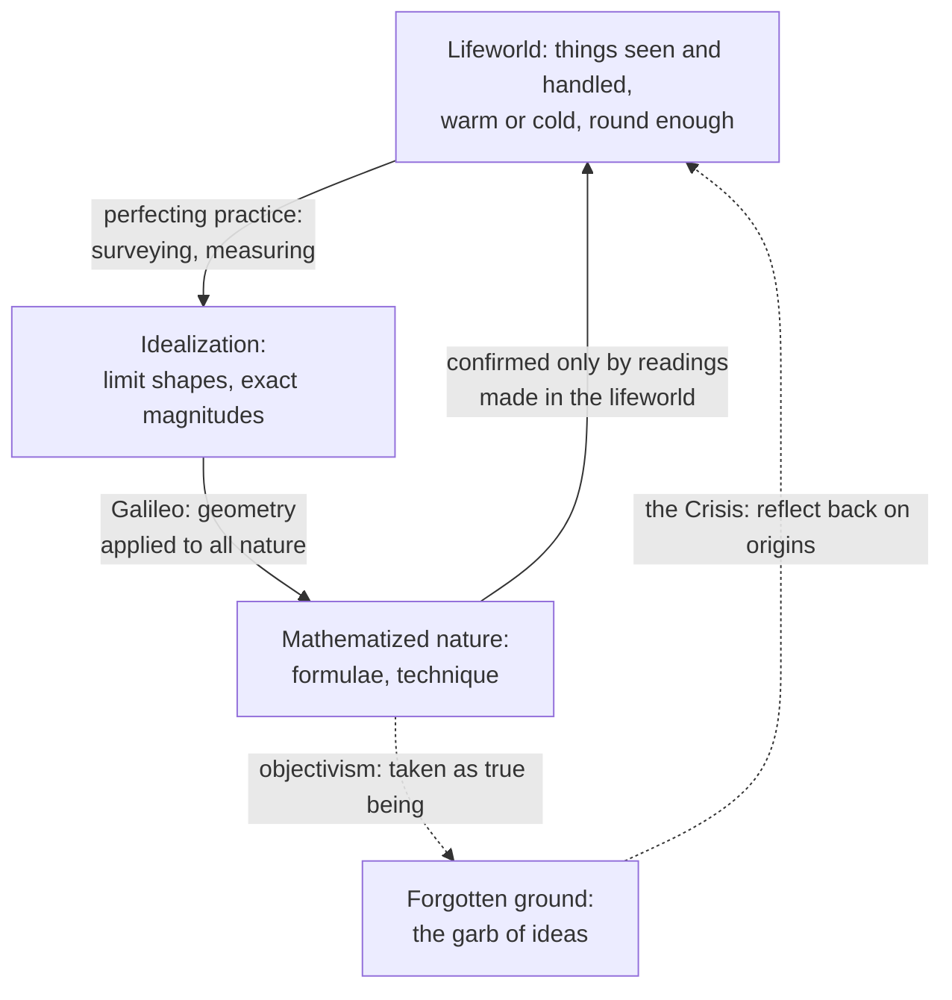

# Phenomenology & Personalism · Lesson 1.4: The lifeworld and the crisis of the sciences

> ⏱ ~15 min · Module 1: Husserl and the phenomenological method · Builds on: [1.2 The anatomy of an experience](01-02-the-anatomy-of-an-experience.md), [1.3 The natural attitude, the epoché and the reductions](01-03-the-epoche-and-the-reductions.md) · Unlocks: [2.2 Heidegger: Dasein and being-in-the-world](02-02-heidegger-dasein-and-being-in-the-world.md)

## Why this matters

You have spent years treating the kinetic energy of molecules as what warmth *really* is, and the ideal circle as what a wheel *really* approximates. Husserl's last book asks what licenses that "really". In 1935 he lectured in Vienna (May) and Prague on a crisis of European science. Barred from official academic activity in Germany because of his Jewish ancestry, he published Parts I and II of *The Crisis of European Sciences and Transcendental Phenomenology* in the Belgrade journal *Philosophia* in 1936; the whole text appeared only in 1954 (Husserliana VI, ed. Walter Biemel), after his death in 1938. Its charge is aimed at physics' self-understanding, not its results, and it is the source of the most influential idea of late phenomenology: the [lifeworld](../reference.md#lifeworld).

## The idea

**The crisis.** Not that science fails: it has never succeeded more. Part I (§§1–7, paraphrased) says the sciences have lost their meaning for life. A science of bare facts has nothing to say about reason, freedom or what a human life is for, and a culture that takes it as the whole of knowledge cannot ask those questions rationally either. Part II (§9) traces how this happened.

**The lifeworld** (*Lebenswelt*) is the world as already given in experience before any theory: tables seen from one side ([1.2](01-02-the-anatomy-of-an-experience.md)), baths that feel warm, plates that are round "enough", days measured by the sun. It is *pre-given*: always already there as the ground any project, science included, starts from. It is the world of the [natural attitude](../reference.md#natural-attitude) of [1.3](01-03-the-epoche-and-the-reductions.md), now studied as the soil of meaning rather than bracketed as a thesis.

**Idealization** (§9, paraphrased). In the lifeworld, straightness, flatness and roundness come in degrees and within tolerances. The arts of measuring and surveying keep perfecting them: a truer straightedge, a finer lathe. Each improvement points beyond itself toward a limit that no improvement reaches, the ideal line, plane or circle. Husserl calls these *limit shapes* (*Limesgestalten*), and pure geometry is the science of them ([idealization and limit shapes](../reference.md#idealization-and-limit-shapes)). Exactness is not found in things. It is achieved by a method.

**Galileo's step.** Galileo inherited geometry as a finished tradition and applied it to nature as a whole: nature itself is a mathematical manifold ([mathematization of nature](../reference.md#mathematization-of-nature)). Shapes and motions are mathematized directly. The sensory qualities (colours, sounds, warmth: Husserl's *plena*) can be mathematized only indirectly, by correlating them with shapes and motions. That is the root of the doctrine that they are "merely subjective" (Locke's version is [modern-philosophy 3.2](../../modern-philosophy/lessons/03-02-locke-qualities-substance-and-essence.md)). Algebra and formulae follow, and then technique: the method can be run without anyone reawakening the sense of its operations.

**The substitution.** The fateful move, on Husserl's account, is that the mathematically constructed world of idealities was slipped in for the only world actually given in perception, the lifeworld. He calls it a "garb of ideas" (*Ideenkleid*; see [garb of ideas](../reference.md#garb-of-ideas)). Thrown over the lifeworld, it leads us to take for true being what is in fact a *method*. Galileo is, in his phrase, a genius who both discovers and conceals. The position this produces Husserl calls [objectivism](../reference.md#objectivism): the method's product is reality, and the given world is subjective appearance.

**What the charge does not claim.** It does not say physics is false, that measurement is illegitimate, or that felt warmth is more accurate than a thermometer. Idealization is a great achievement and its results stand. The error lies in the self-interpretation, which inverts the order of founding. The cure is reflection on origins, not less physics. A 1936 manuscript, published by Eugen Fink in 1939 and known as "The Origin of Geometry", pursues the same theme: geometry's ideal objects arise in human acts, are handed down through writing, and can either be reactivated in their sense or sink into sediment.

## Source

The idea is older than the *Crisis*. Husserl, *Ideen* I §52 (translation ours, from the 1913 German). He has just rejected the view that the physical thing is an unknown cause hidden behind appearances.

> In the physical method the perceived thing itself is always, and in principle, exactly the thing the physicist investigates and determines scientifically. [...] The thing he observes, experiments with, constantly sees, takes in hand, lays on the scale, puts into the furnace: this and no other becomes the subject of the physical predicates, such as weight, mass, temperature, electrical resistance. [...] On the underlying ground [*Untergrund*] of natural experience, physical thinking establishes itself [...]. If reason, under the title "physics", thus works out an intentional correlate of a higher level, physical nature out of simply appearing nature, then it is mythology [*Mythologie treiben*] to set up this datum of reason, which is nothing but the determination of intuitively given nature by the logic of experience, as an unknown world of things in themselves.

Notice the order: the furnace and the scale come first, and the physical predicates are predicates *of that thing*. In 1913 the error is called mythology. In 1936 the *Crisis* tells the history of how the mythology became common sense.

## The argument

1. **Every exact concept of physics (length, duration, mass, temperature) gets its sense from measuring practices performed on things in the lifeworld.** *In words:* "3.2 metres" means something because there are rulers and people who lay them along tables.
2. **Exactness is reached by idealization: the open-ended perfecting of practice is replaced by limit shapes that no practice reaches.** *In words:* the circle is the destination of better lathes, not a thing any lathe makes.
3. **Idealization is a method, an achievement of human subjects for a purpose. Its results are confirmed only by returning to lifeworld experience: readings, coincidences, observed outcomes.** *In words:* every prediction cashes out in something somebody sees ([fulfilment](../reference.md#empty-and-fulfilled-intention), 1.2).
4. **Galileo's mathematization, then formalization and technique, let the method run without reactivating 1–3.** *In words:* you can compute without knowing what your symbols were built from.
5. **Once 1–3 are forgotten, the method's product is taken for true being, and the lifeworld becomes mere subjective appearance.** *In words:* the map is promoted to territory, and the territory demoted to a picture.
6. **∴ Modern science's self-interpretation inverts the order of founding, treating what is founded as the foundation; the remedy is a reflection on the lifeworld and the acts that build science on it, not a revision of physics' results.**

**Where the argument is weakest.** Premises 4–5, read as history. Ernan McMullin ("Galilean Idealization", 1985) argued that Galileo idealized deliberately and in a controlled way: the distorting assumptions are known and can be removed one by one, and in the *Two New Sciences* (1638) Galileo himself concedes that the resistance of the medium and the curvature of the earth spoil his parabolas. On this reading the working physicist never forgot that the ideal is a method. The defender replies that Husserl's "Galileo" is the type of a tradition, named for the man who completed what his predecessors began, and that the forgetting sits in philosophy's interpretation of science (Descartes, the primary–secondary split), not in laboratory practice. That reply saves the argument by narrowing it. Whether the narrower charge still amounts to a *crisis* is the open question.

## Picture

Solid arrows are the order of founding, which Husserl accepts and praises. Dashed arrows are the self-interpretation he attacks and the reflection he proposes.

## Worked examples

**Example 1 (clean: a round tabletop).** A carpenter's tabletop is round for every purpose of a kitchen: its roundness is a lifeworld *type*, with a tolerance nobody states. Better templates and lathes shrink the tolerance, and the series points toward a limit: the set of points at exactly distance $r$ (the radius) from a centre. Geometry proves $C = 2\pi r$ (circumference) of the limit, exactly. Applied to the table, the theorem holds within a tolerance, and checking that tolerance is a lifeworld act: a tape measure read by an eye. Nothing here is false. Objectivism adds one sentence: "the table is *really* a circle, imperfectly realized". That sentence reverses the founding, since the circle was defined as the limit of perfecting tables like this one.

**Example 2 (hard: warmth and temperature).** The *plenum* is felt warmth. It is a poor guide: a steel bench and a wooden bench at the same temperature feel different, because the hand registers heat flowing out of it, not temperature. So physics correlates warmth with a shape, the height of a liquid column against marks (indirect mathematization), and then idealizes. For an ideal monatomic gas in equilibrium, $\langle \tfrac12 m v^2 \rangle = \tfrac32 k_B T$: the mean kinetic energy per molecule ($m$ the molecular mass, $v$ its speed, $k_B$ Boltzmann's constant) fixes the absolute temperature $T$. Point particles, no interactions, equilibrium: each is a limit shape. Statistical mechanics then defines $1/T = \partial S/\partial E$ ($S$ entropy, $E$ energy).

Run Husserl's account. The sense of "temperature" was fixed by readings, a column coinciding with a mark, and every test of the theory still ends in a reading. Correcting felt warmth with a thermometer is no betrayal of the lifeworld, since it is one lifeworld experience correcting another. Objectivism is Locke's sentence that what is warm in idea is only motion in the body: felt warmth demoted to a mere subjective sign.

Here the account strains. On the entropy definition, a system with a bounded energy spectrum (a population-inverted spin system) can have $T < 0$, and it is *hotter* than any positive temperature ([stat-mech 1.4](../../stat-mech/lessons/01-04-temperature-pressure-chemical-potential.md)). No hand could feel that, and no liquid column corresponds to it. Husserl's side says the concept is still founded, through a longer chain of instruments and readings. The critic says that if any chain counts, "founded in the lifeworld" means only "done by embodied physicists", and it no longer constrains which concepts are legitimate. The account says what the extension must answer to. It does not decide whether this one is a deepening of the concept or a change of subject.

## Watch out

- **You might think the lifeworld is everyday opinion, folk physics or a culture's worldview, but it is a term of art.** It is the world as *pre-given* in experience, the ground of evidence on which any opinion, folk or scientific, is formed and checked. Husserl also lets science's results flow back into it, and Dermot Moran has noted that the *Crisis* characterizes it in ways that do not fully cohere. Neither use makes it a theory awaiting replacement.
- **You might think idealization is abstraction, leaving features out, but limit shapes are not found in any thing by subtraction.** Abstraction from tabletops gives vague roundness; the circle is constructed as the limit of a series of perfectings. That is why the *Crisis* calls it an achievement with a history.
- **You might think Husserl calls physics "one perspective among others", but his complaint is the reverse of relativism.** He wants science's sense secured by tracing it to evidence anyone can check, and he rejects only objectivism, the reading of the method's product as the only reality.

## One-liner

> Physics is true of the world we live in, because it is built from that world's measurements; the crisis is forgetting the building and calling the scaffold the house.

## Problems

**P1 (🟢) *(Exegetical (a) · Evaluative (b).)*** Apply to a hard case. A student times 20 swings of a pendulum with a 1.00 m string: 40.1 s. Using $T = 2\pi\sqrt{L/g}$ (period $T$, length $L$), she gets $g \approx 9.82$ m/s². (a) Name three idealizations built into the formula and two points where her result rests on lifeworld acts. (b) In her report she writes: "The real period is $2\pi\sqrt{L/g}$; my 2.005 s is that plus error." Is this the substitution Husserl criticizes? Any verdict; 100 words or fewer.

**P2 (🟡) *(Exegetical (a) · Evaluative (b).)*** Diagnose. An invented op-ed:

> Husserl proved that science is a "garb of ideas" thrown over the lifeworld. Physics is therefore just one perspective among many. Astrology also grows out of lived experience of the sky, so it is equally valid. Husserl himself admitted that Galileo's physics was false.

(a) Name three misreadings of Husserl and correct each. One or two sentences each. (b) Does Husserl's account give any resource for ranking physics above astrology, and where does it stop deciding? Any verdict; 120 words or fewer.

**P3 (🔴) *(Evaluative.)*** Steelman and reply. A physicist objects: "The lifeworld is folk physics: the sun rises, tables are solid, metal is colder than wood. Science replaced it, as chemistry replaced alchemy. Calling it the ground of meaning confuses the order in which we learn concepts with the order of what exists." (a) State the objection at full strength, 80 words or fewer. (b) Give Husserl's best reply and say what it concedes, 100 words or fewer.

Solutions

**P1** *(Exegetical (a) · Evaluative (b))*

**Accept:** any three genuine idealizations and any two genuine lifeworld acts.

(a) Idealizations: a point mass; a massless, inextensible string; the small-angle limit ($\sin\theta \approx \theta$); no air drag; a rigid, frictionless pivot; a uniform field $g$. Lifeworld acts: laying a ruler along the string and reading it; starting and stopping a stopwatch by eye and thumb; counting swings; judging that the bob has returned to the same place.

**Must hit, strict (a):**

- Each idealization is a limit shape: something no real pendulum has, reached by perfecting (lighter strings, smaller swings).
- Each lifeworld act is a perception or bodily handling on which the number's meaning and confirmation rest (1.2's fulfilment).

**Must hit, any verdict (b):**

- Say what the sentence does: it makes the ideal period "real" and the measured one a deviation from it.
- Separate two readings: a working convention (the model plus a controlled error budget, McMullin's point) versus a claim about true being (objectivism).
- Say which reading the words "the real period" support, and what would change your verdict.

**Wrong turns:** saying Husserl objects to the formula or to error analysis. He objects only to its interpretation. Listing the stopwatch's imprecision as an "idealization": it is a lifeworld instrument, not a limit shape.

**Model answer (b), one of several:** Yes, as worded. "The real period" makes the limit shape the reality and her measurement its imperfect copy, which reverses the founding: $2\pi\sqrt{L/g}$ is the limit of better pendulums and is confirmed only by timings like hers. A charitable reading takes "real" as shorthand for "the model's value, with known corrections", and that is McMullin's controlled idealization, which Husserl need not reject. The sentence is objectivism if she would deny that her 2.005 s describes the pendulum at all.

---

**P2** *(Exegetical (a) · Evaluative (b))*

**Must hit, strict (a):** any three of:

- "Garb of ideas" names the *misinterpretation* of mathematized nature as true being, not science itself.
- Husserl does not say physics is false; he says its results stand and its self-interpretation is confused.
- The lifeworld is not "lived experience" in the sense of private feeling or folk lore. It is the pre-given ground where claims are checked by evidence anyone can share.
- "One perspective among many" is relativism, which Husserl opposed from the *Prolegomena* on ([1.1](01-01-intentionality-from-brentano-to-husserl.md)). He wants science grounded, not levelled.

**Must hit, any verdict (b):**

- Name the resource: confirmation by return to lifeworld evidence (premise 3). Physics' predictions are fulfilled by readings; astrology's fail when checked the same way.
- Say where the account stops: it gives the ground of validity, not a demarcation criterion, so it does not by itself rule out a practice that never makes checkable claims.
- Give a verdict on whether that gap matters.

**Wrong turns:** answering (b) by quoting Husserl's admiration for Galileo; admiration is not a criterion. Saying the lifeworld account makes physics infallible.

**Model answer (b), one of several:** It gives one resource. On Husserl's account, every scientific claim earns its validity by returning to lifeworld evidence: a reading anyone can repeat. Physics' predictions are fulfilled that way; astrological forecasts, checked the same way, fail. So the account ranks them by the same test that grounds physics, not by deferring to physics' authority. But it does not tell you how much failure discredits a practice, or what to say about a practice that hedges until it predicts nothing. That is the demarcation problem, and it belongs to [`philosophy-of-science`](../../philosophy-of-science/syllabus.md). Husserl explains why evidence binds. He does not supply a criterion of science.

---

**P3** *(Evaluative)*

**Must hit, any verdict (a):**

- Treat the lifeworld as a body of beliefs (the sun moves, tables are solid) that science has shown false or crude.
- Use the distinction between priority in learning and priority in being: we learn "temperature" from warmth, but what exists is what the best theory says. Wilfrid Sellars's "scientia mensura" (1956) is the classic form.

**Must hit, any verdict (b):**

- Distinguish the lifeworld as *ground of evidence* from beliefs held in it. Science corrects the second by appeal to the first (Example 2).
- Press the cost: the physicist must explain how theoretical terms get empirical content, and how a theory is confirmed, without readings made in the lifeworld.
- Concede something real: many lifeworld typicalities are false, and Husserl's claim is about sense and confirmation, not about which entities exist.

**Wrong turns:** saying Husserl denies that science corrects perception. Treating "the sun rises" as a lifeworld *thesis* that Husserl defends against astronomy.

**Model answer, one of several:** (a) What we live among is a theory, and a bad one: it says the sun moves and that steel is colder than wood. Physics has replaced it. That we first learned "temperature" through warmth is a fact about learning, not about reality. In the order of being, the scientific picture is the measure of what exists. (b) The objection treats the lifeworld as beliefs, but Husserl means the ground where every belief is checked. The thermometer beats the hand only by being read by an eye, so correction runs on lifeworld evidence. Concession: this shows science's dependence for sense and confirmation, not that lifeworld beliefs are true or that unobservables do not exist.

## Flashback

**From Lesson [1.2](01-02-the-anatomy-of-an-experience.md) (The anatomy of an experience):** *(Exegetical.)* Counterexample. A study partner sums up Husserl's anatomy of an act in two rules. Rule 1: "Two acts that reach the same object have the same matter." Rule 2: "An intention is empty only when it means its object through words or other signs; a perception has nothing empty in it." (a) Build an everyday counterexample to Rule 1, not one from the lesson, and name the term it turns on. (b) Do the same for Rule 2. Two sentences per part.

Solution

**Accept:** in (a), any two acts that reach one object under different determinations; in (b), any part or phase of a perceived thing that is meant but not given.

**Must hit, strict:**

- (a) Two acts, one object, different "as what": for instance, one passenger means the arriving bus as "the 7:40 to the station", another means the same bus as "the bus my neighbour drives". The term is *matter* (*Materie*), which fixes as what an act takes its object. Same matter guarantees same object, not conversely.
- (b) A perception with an empty component and no words: seeing the bus head-on, you perceive a *bus*, with sides, a rear and seats, though only its front is given. The term is the inner horizon: the unseen sides are co-intended emptily, so every perception of a thing mixes fulfilled and empty intention. (Also accept protention, the next note of a melody already anticipated.)
- What is meant emptily in (b) is fully determinate (a bus with a rear, not "something or other"). It lacks fullness (*Fülle*), not content.

**Wrong turns:** in (a), giving two acts that differ in *quality* (believing the bus is coming, wishing it would) with the same matter. That varies the wrong component, and the object stays the same for a different reason. In (b), calling the unseen rear a guess inferred from the front. For Husserl it belongs to the perception's own matter: what is seen is the bus itself, one-sidedly, not a front from which a bus is inferred.

**Model answer:** (a) At the stop I mean the arriving bus as "the 7:40 to the station", while my friend means the very same bus as "the bus my neighbour drives". One object, two matters: matter fixes *as what* an act takes its object, so Rule 1 confuses the object with the matter. (b) Seeing the bus head-on, I perceive a bus with sides, a rear and seats, though only its front is given, and no words are involved. Those sides are its inner horizon, meant emptily, so every perception of a thing contains empty intentions and Rule 2 fails.

## Connections

- **Backward:** confirmation by return to the lifeworld is the fulfilment of empty intentions in [1.2](01-02-the-anatomy-of-an-experience.md); the lifeworld is the world of [1.3](01-03-the-epoche-and-the-reductions.md)'s natural attitude studied as ground rather than bracketed. The demotion of the *plena* is Locke's primary and secondary qualities ([modern-philosophy 3.2](../../modern-philosophy/lessons/03-02-locke-qualities-substance-and-essence.md)); *Ideen* I §40 already invokes Berkeley's objection that extension is unthinkable without sensory qualities ([modern-philosophy 3.4](../../modern-philosophy/lessons/03-04-berkeley-immaterialism.md)).
- **Forward:** [2.2](02-02-heidegger-dasein-and-being-in-the-world.md) gives a rival description of the pre-theoretical world. Heidegger's ready-to-hand (1927) makes it a world of use, not perception, and readers often set it beside the *Crisis*. Wojtyła's insistence on starting from the experience of the human being ([5.4](05-04-action-reveals-the-person.md)) inherits the same rule: theory answers to what is given.
- **Sideways:** whether the scientific image or the lived one tells us what exists is the realism debate of [`philosophy-of-science`](../../philosophy-of-science/syllabus.md) Module 5 and [`philosophy-of-physics`](../../philosophy-of-physics/syllabus.md). Negative absolute temperature is [stat-mech 1.4](../../stat-mech/lessons/01-04-temperature-pressure-chemical-potential.md).
