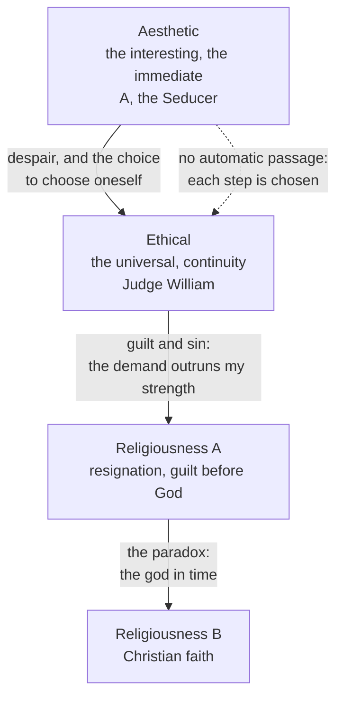

# Phenomenology & Personalism · Lesson 2.1: Kierkegaard: the single individual

> ⏱ ~15 min · Module 2: Existence: Kierkegaard and Heidegger · Builds on: [modern-philosophy 6.4 (Hegel)](../../modern-philosophy/lessons/06-04-hegel-dialectic-and-spirit.md), [ethics 2.2 (the Formula of Universal Law)](../../ethics/lessons/02-02-the-formula-of-universal-law.md) · Unlocks: [2.2 Heidegger: Dasein and being-in-the-world](02-02-heidegger-dasein-and-being-in-the-world.md), [2.3 The they, mood and care](02-03-the-they-mood-and-care.md)

## Why this matters

Module 1 turned philosophy toward experience as it is given. Module 2 turns it toward the one who has the experience and must decide how to live. That turn starts with Søren Kierkegaard (Copenhagen, 1813–1855), writing against Hegel's system before Husserl was born. Heidegger names the debt in a footnote to *Being and Time* §40:

> S. Kierkegaard has penetrated furthest in the analysis of the phenomenon of anxiety [*Angst*], and again in the theological context of a "psychological" exposition of the problem of original sin. *(translation ours, from the German)*

Sartre's anguish, Marcel's fidelity and the existentialists' "single individual" all draw on him. You need his categories exactly, because his heirs keep some and drop others.

## The idea

**[Pseudonymity](../reference.md#pseudonymity) first.** Most of the books that matter here are signed by invented authors. *Either/Or* (1843) is "edited" by Victor Eremita and holds the papers of an aesthete, "A", and the letters of Judge William. *Fear and Trembling* (1843) is by Johannes de silentio, *The Concept of Anxiety* (1844) by Vigilius Haufniensis, *Concluding Unscientific Postscript* (1846) by Johannes Climacus, *The Sickness unto Death* (1849) by Anti-Climacus. Kierkegaard asked readers to attribute what the pseudonyms say to the pseudonyms, not to him (a signed note at the end of the *Postscript*). The point is *indirect communication*: a way of living cannot be handed over as a result. It can only be shown from inside, so that the reader has to choose. De silentio says repeatedly that he cannot make the movement of faith he describes. Read him as a witness, not a spokesman.

**The [stages of existence](../reference.md#stages-of-existence)** (the phrase *Stages on Life's Way* is the title of an 1845 book).

- *Aesthetic.* Life organized around the interesting and the immediate: pleasure, mood, possibility kept open. A's essays and the "Seducer's Diary" are its documents. Its secret is boredom, and beneath that, despair.
- *Ethical.* Judge William tells A to *choose*, and to choose himself: to take up his history as his own and live under universal duties, such as marriage, work and promises, that make a life continuous.
- *Religious.* A relation to God that the ethical cannot contain. Climacus splits it into Religiousness A (immanent: resignation and the consciousness of guilt) and Religiousness B (Christianity, resting on the paradox of the god in time).

No stage leads to the next by logic. Each passage is a choice, and the aesthete can stay an aesthete.

**[Anxiety](../reference.md#anxiety-kierkegaard)** (*Angest*). Haufniensis separates it from fear. Fear has a definite object; anxiety's object is nothing, or rather possibility: the bare *I can*. His image is the "dizziness of freedom", the vertigo of looking into one's own open future. Anxiety attracts and repels at once, and it is the psychological state out of which, on his account, sin comes, though anxiety does not explain the fall. The fall happens as a leap.

**[Despair](../reference.md#despair)** (*Fortvivlelse*). Anti-Climacus defines the self as a relation that relates itself to itself: a synthesis of finite and infinite, necessity and possibility, which exists only in taking up that synthesis, and which is grounded in the power that established it. Despair is a misrelation in that self-relation. It is not a mood, and you can be in despair without knowing it. Its forms run from not knowing one has a self, through not willing to be oneself (weakness), to willing defiantly to be oneself on one's own terms. Its cure is a self that wills to be itself while resting transparently in the power that established it.

**The two knights** (*Fear and Trembling*, "Preliminary Expectoration"). A youth loves a princess he can never have. The *knight of infinite resignation* gives her up wholly, keeps the love as something eternal, and finds peace in the pain; de silentio calls this a purely philosophical movement he can make himself. The [knight of faith](../reference.md#knight-of-faith) makes the same movement, then one more: he believes he will have her in this life, "by virtue of the absurd", since for God all things are possible. Outwardly he may look entirely ordinary. Faith is not a young girl's confident hope that her wish will come true, either: that hope never looks the impossibility in the eye.

**[Truth as subjectivity](../reference.md#truth-as-subjectivity).** Climacus contrasts *what* is believed with *how*. Where an existing person's life is at stake, truth is the passionate inwardness of the relation, held fast under objective uncertainty. Whether that makes faith a leap beyond reason's reach is assessed as fideism in [philosophy-of-religion 5.4](../../philosophy-of-religion/lessons/05-04-fideism.md), not here.

## Source

*Fear and Trembling*, opening of Problema I, "Is there a teleological suspension of the ethical?" (translation ours, from the Danish, 3rd ed. 1895, of the 1843 text; OCR corrected). De silentio states the view he will test.

> The ethical as such is the universal [*det Almene*], and as the universal it is what holds for everyone, which from another side can be put thus: it holds at every moment. It rests immanently in itself, has nothing outside itself that is its *telos*, but is itself the *telos* for everything outside it [...]. Determined immediately, as sensuous and psychical, the single individual [*den Enkelte*] is the individual who has his *telos* in the universal, and this is his ethical task: always to express himself in it, to annul [*ophæve*] his singularity in order to become the universal. As soon as the single individual wants to assert himself in his singularity over against the universal, he sins, and only by acknowledging this can he be reconciled with the universal again.

Notice *ophæve*, the Danish for Hegel's *aufheben* ([modern-philosophy 6.4](../../modern-philosophy/lessons/06-04-hegel-dialectic-and-spirit.md)). The paragraph is Hegel's ethical life in miniature ([history-of-political-thought 6.1](../../history-of-political-thought/lessons/06-01-hegel-freedom-realized-in-the-state.md)), set up to be tested by Abraham.

## The argument

**The dilemma of Problema I** (the [teleological suspension of the ethical](../reference.md#teleological-suspension-of-the-ethical)), in paraphrase:

1. **Suppose the ethical is the universal and the highest.** *In words:* my whole task is to express myself in duties that hold for anyone, and singularity asserted against them is sin or temptation (*Anfægtelse*).
2. **The tragic hero stays inside the ethical.** Agamemnon, Jephthah and Brutus give up a child for the state or the law: one ethical duty yields to a higher ethical duty. *In words:* everyone can understand him, and weep with him.
3. **Abraham has no higher ethical *telos*.** He binds Isaac for no city or law, but, de silentio says, for God's sake and, identically, for his own: to prove his faith. *In words:* nothing universal explains the act.
4. **So if (1) holds, Abraham is a murderer, not the father of faith,** and Hegel should say so aloud instead of honouring him.
5. **Unless faith is this:**

   > Faith is precisely this paradox, that the single individual as the single individual is higher than the universal, is justified over against it, not subordinate but superior [...]. *(translation ours)*

   *In words:* the individual stands in an absolute relation to the absolute, which no universal can mediate.
6. **∴ Either there is a teleological suspension of the ethical, or Abraham is lost and there has never been faith.** De silentio does not claim to understand the first horn; he claims only that the second is what (1) implies.

**Where the argument is weakest.** Premise 1, as applied to a voice. Kant (*The Conflict of the Faculties*, 1798, Ak. VII 63n) had already answered Abraham's case: Abraham should have replied that he is quite certain he must not kill his good son, and never can be certain that the voice commanding it is God's. Moral knowledge outranks any claimed revelation, so the "suspension" is always self-deception. The defender's reply starts from the text. De silentio concedes that the paradox can easily be confused with *Anfægtelse* and demands marks to tell them apart. His book is a warning against cheap faith, not a licence. And on a reading such as C. Stephen Evans's, the "ethical" suspended is the social ethic of 1 ([Sittlichkeit](../../history-of-political-thought/lessons/06-01-hegel-freedom-realized-in-the-state.md)), not God-given morality. Whether that reply survives Kant's point about certainty is the open question.

## Picture

Alt text: four boxes in a column. The aesthetic leads to the ethical through despair and the choice of oneself; the ethical leads to Religiousness A through guilt and sin; Religiousness A leads to Religiousness B through the paradox. A dashed edge notes that no passage is automatic.

Read the middle arrow with Problema III: "An ethics that ignores sin is an entirely idle science; but if it asserts sin, it is eo ipso beyond itself" *(translation ours)*. The four boxes are Climacus's scheme laid over the earlier books; the books themselves never line up so neatly.

## Worked examples

**Example 1 (clean: an aesthetic life).** An invented case. Lena, 34, a gifted designer, changes city, partner and project every eighteen months. Each start is thrilling; each settles into boredom, and she leaves before it hardens into a commitment. She calls this freedom. Kierkegaard's terms: this is the aesthetic, possibility kept open by never choosing, the strategy A calls "rotation". On Anti-Climacus's map she lives in possibility without necessity: a self that will not take up its own history. She is in despair, though she would deny it; that she does not know is itself the first form. What would move her is not an argument but Judge William's demand: to choose, and choose herself, history included. Nothing compels it. She can rotate forever.

**Example 2 (hard: tragic hero or knight of faith?).** An invented doctor breaks a hospital rule, at risk to her licence, to give a dying patient an unapproved drug she believes may work. She says, "I had to; it was between him and me." Is this a suspension of the ethical? By premise 2, no. She can state her reason in universal terms: a life outweighs a rule. That makes her a tragic hero who sets one ethical expression below a higher one. Now change the case: she says only that God told her, and that she cannot explain it to anyone. Here de silentio's categories strain. From outside, the paradox and *Anfægtelse* look the same. Problema III adds that Abraham *cannot speak*, since any explanation would return him to the universal. The text gives no observable mark that settles which she is, and de silentio says he cannot supply one.

## Watch out

- **You might think "the ethical" in Problema I means morality as such, but it is a term of art.** It is *det Almene*, the universal: duty that holds for anyone and can be stated, close to Hegel's ethical life. "Suspending the ethical" does not mean the religious person is exempt from morality. It means the individual's highest relation is not to the universal.
- **You might think anxiety is fear or a clinical condition, but *Angest* has no object.** It is the relation to one's own possibility, which is why Haufniensis calls it "dizziness". Despair, likewise, is a structure of the self, not a feeling, and can be present unnoticed.
- **You might think the stages are Kierkegaard's ladder of lives, but they are voices.** A and Judge William are both pseudonymous, and Climacus says he is not a Christian. Quoting de silentio as "Kierkegaard's view" erases the distance the authorship was built to keep.

## One-liner

> Kierkegaard asks not what is true but how an existing individual can live it: the aesthete in rotation, the ethicist in the universal, Abraham alone before God, each displayed by an author who will not tell you which to choose.

## Problems

**P1 (🟢) *(Exegetical (a) · Evaluative (b))*** Apply to a hard case. Three invented lives:

- **Rasmus** keeps a promise to run his late father's failing bakery. He dislikes the work but says, "This is who I am now; I took it on."
- **Petra** collects experiences: one week a silent retreat, the next a festival, each chosen because it is "something I haven't felt yet". She enjoys the retreat's spirituality as much as the festival.
- **Johan** has kept every duty for twenty years, yet says that the closer he holds himself to the standard, the more clearly he sees he has failed it, and that no further effort will close the gap.

(a) Place each on the stages, naming the term that decides it. One sentence each. (b) A classmate concludes: "So Kierkegaard ranks Johan above Rasmus above Petra." Using pseudonymity, say what is wrong with attributing that ranking, and what can be said instead. 80 words or fewer.

**P2 (🟡) *(Exegetical)*** Find the crux. *Fear and Trembling*, "Preliminary Expectoration" (translation ours, from the Danish, 3rd ed. 1895):

> By resignation I renounce everything; this movement I make by myself [...]. By faith I renounce nothing; on the contrary, by faith I receive everything [...]. By my own strength I can give up the princess [...], but by my own strength I cannot get her back again, for I use my strength precisely to resign.

An invented case: two violinists lose the use of a hand. Both give up their careers wholly and keep their love of music as something eternal. Mette lives at peace in her pain, a stranger to ordinary pleasures. Karin, having given it all up just as completely, takes delight in every finite thing and believes, while seeing that it is humanly impossible, that she will play again in this life. (a) Which is the knight of infinite resignation and which the knight of faith? (b) Name the single claim Karin affirms and Mette denies, using the passage's words. (c) Why is Karin not simply the hopeful girl de silentio contrasts with faith? Two sentences per part.

**P3 (🔴) *(Exegetical (a) · Evaluative (b))*** Diagnose. An invented sermon:

> "Abraham teaches us that faith means obedience to whatever you feel God telling you. Don't let ethics, family or reason stand in the way; that is the teleological suspension of the ethical. Kierkegaard proved that true believers go beyond morality, and anyone with enough faith can do the same."

(a) Name three misreadings and correct each from this lesson's text of *Fear and Trembling*. One or two sentences each. (b) A listener replies with Kant's objection (certainty that one must not kill an innocent son outranks any certainty that the voice is God's). Does *Fear and Trembling*, read carefully, have the resources to answer it? Any verdict; 120 words or fewer.

Solutions

**P1** *(Exegetical (a) · Evaluative (b))*

**Must hit, strict (a):**

- **Rasmus: ethical.** He chooses himself and his history ("I took it on"); a promise kept for its own sake gives his life continuity under a universal duty.
- **Petra: aesthetic.** She chooses by the interesting ("something I haven't felt yet"), in rotation; the retreat is consumed as an experience, not a relation to God, so its content does not make her religious.
- **Johan: on the border of the ethical and the religious (Religiousness A).** The ethical demand outruns his strength, and he is conscious of guilt that effort cannot remove: the ethics that "asserts sin" and so goes beyond itself.

**Must hit, any verdict (b):**

- The stages are presented by pseudonyms (A, Judge William, de silentio, Climacus), and Kierkegaard asked that their words be attributed to them; the authorship shows ways of life without signing a verdict.
- Say what can be claimed: that *within* Climacus's scheme each stage contains what the earlier one lacks, or that the authorship's direction points toward the religious. Either claim must be attributed to the text, not to Kierkegaard in his own voice.

**Wrong turns:** calling Petra religious because of the retreat; placing Johan as a knight of faith (nothing in the case involves the paradox or receiving the finite back). Reading (b) as "Kierkegaard has no views at all": he wrote signed works too; the point is not to collapse the pseudonyms into him.

**Model answer (b), one of several:** The ranking comes from Climacus's scheme, voiced by pseudonyms Kierkegaard asked us not to read as himself. The books stage each life from inside so the reader must choose; they do not hand down a verdict. One can say that, on Climacus's account, each stage contains a demand the earlier one cannot meet, and attribute that to Climacus.

---

**P2** *(Exegetical, strict)*

**Must hit, strict:**

- (a) Mette is the knight of infinite resignation; Karin is the knight of faith. Both make the same first movement: complete renunciation, with the love kept as eternal.
- (b) Karin affirms that she will receive the finite back, "by faith I receive everything", by virtue of the absurd (for God all things are possible). Mette holds that her own strength is used up in renouncing, so getting it back is impossible for her.
- (c) The girl's confidence never faces the impossibility; it skips resignation. Karin has resigned fully and sees that her recovery is humanly impossible, and believes anyway; de silentio says faith has resignation as its presupposition and is not the heart's immediate impulse.

**Wrong turns:** making Mette the lesser person, or calling her faithless in the ordinary sense. De silentio admires resignation and says it is a purely philosophical movement he can make himself. Locating the difference in how much each gives up: both give up everything.

---

**P3** *(Exegetical (a) · Evaluative (b))*

**Must hit, strict (a):** any three of:

- **Faith is not a feeling.** De silentio says faith is no aesthetic emotion and not the heart's immediate impulse; it presupposes infinite resignation.
- **The suspension is not a rule anyone can apply.** "Whatever you feel God telling you" turns it into a universal policy, which returns it to the universal. Faith is the single individual's relation, which cannot be mediated or taught.
- **The text warns about exactly this case.** The paradox can be confused with temptation (*Anfægtelse*), and those who have faith ought to supply marks to tell them apart.
- **Abraham is not a model anyone can copy at will.** De silentio cannot make the movement and cannot understand Abraham; the book is written in fear and trembling, not as encouragement.
- **"Kierkegaard proved" misattributes.** The author is Johannes de silentio, a pseudonym, and Problema I is a dilemma (either faith is this paradox, or Abraham is lost), not a proof that believers transcend morality.

**Must hit, any verdict (b):**

- State Kant's objection at strength: moral certainty about the act is higher than any certainty about the source of the command, so following the voice is always self-deception.
- Identify what the text offers: the concession that paradox and temptation look alike; that no mark is supplied; and, on readings like Evans's, that the ethical suspended is the social universal, not divine command.
- Judge whether these answer the objection or concede it.

**Wrong turns:** answering (b) by arguing that faith is or is not rational, which is the fideism question owned by [philosophy-of-religion 5.4](../../philosophy-of-religion/lessons/05-04-fideism.md). Treating de silentio's admission of uncertainty as a refutation of Kant without saying why uncertainty helps him.

**Model answer (b), one of several:** Partly. The text never denies Kant's premise: de silentio grants that Abraham's ordeal is indistinguishable from temptation and offers no marks to tell them apart. That is why he cannot understand Abraham and calls faith terrifying. So the book does not answer the epistemic question of how anyone could know the voice is God's. It changes the question: it argues that if the ethical as universal is the highest, then Abraham must be condemned, and asks whether we will say so. Kant would say yes. The text's resource is the dilemma, not a rebuttal of Kant's certainty claim.

## Flashback

**From Lesson [1.3](01-03-the-epoche-and-the-reductions.md) (The natural attitude, the epoché and the reductions):** *(Exegetical.)* Apply to a hard case. An invented architect, Ines, spends a morning with a spiral staircase she designed and built herself. For each step, name what she is doing in the terms of *Ideas* I (natural attitude, epoché, eidetic reduction, Cartesian doubt, pure ego) and the feature of the case that decides it. One or two sentences each.

- (i) She is entirely certain the staircase exists. She keeps that certainty exactly as it is but makes no use of it, and describes the stairs as they appear: the lower steps in full view, the upper turns hidden yet co-meant.
- (ii) She imagines it in glass, then in rope, then with ten thousand steps, asking each time what could not change without its ceasing to be a staircase.
- (iii) She wonders whether it might be a stage set, and decides to treat it as not existing until she can prove that it does.
- (iv) Through all of this she finds an identical "I" doing the looking, and asks whether it is the 41-year-old architect named Ines.

Solution

**Must hit, strict:**

- **(i) Epoché.** The conviction is retained unchanged and put "out of action", not doubted or denied (§31); the stairs remain *as* appearing, profiles and co-meant horizon included. Her certainty is no obstacle: Husserl says the suspension is compatible even with conviction that is unshaken because evident.
- **(ii) Eidetic reduction.** She leads back from this fact to its essence by varying it freely in fantasy, which Husserl calls the vital element of phenomenology (§§4, 70); what survives every variation belongs to the essence of staircase.
- **(iii) Cartesian doubt, inside the natural attitude.** Treating the stairs as non-existent posits not-being, which is negation or doubt, both of which §31 excludes from the epoché. Doubting one thing also leaves the general thesis untouched: the stage set would be struck out of a world that stays there.
- **(iv) Pure ego, and the answer is no.** The empirical human being, Ines aged 41, is bracketed with the rest of the world; what remains is an identical "I" whose regard passes through every act without being part of any, a "transcendence in immanence" (§57), a datum only as far as it is co-given with each act.

**Wrong turns:** thinking (i) fails because she is certain; the epoché suspends use, not belief. Calling (iii) a weak form of the epoché; it adds exactly what the epoché subtracts, a stance on existence. Calling (ii) the transcendental reduction, or mere daydreaming. Answering (iv) with Kant's "I think": Kant's is a thought reached by argument, Husserl's a datum given with each act.

**Model answer:** (i) Epoché: her conviction stays as it was but is switched off, and the stairs become a phenomenon to describe; certainty does not block the suspension, which §31 says is compatible with evident conviction. (ii) Eidetic reduction: free variation in fantasy, from this staircase to what any staircase must be. (iii) Cartesian doubt, not epoché: treating the stairs as non-existent posits not-being, and doubting one object leaves the general thesis in force, so she is still in the natural attitude. (iv) The pure ego, which is not Ines: the woman of 41 is a worldly reality and bracketed, while the identical "I" passing through every act is what remains, given only as far as it is co-given with each act.

## Connections

- **Backward:** the universal of Problema I is Hegel's ethical life ([history-of-political-thought 6.1](../../history-of-political-thought/lessons/06-01-hegel-freedom-realized-in-the-state.md)) and *ophæve* is his *Aufhebung* ([modern-philosophy 6.4](../../modern-philosophy/lessons/06-04-hegel-dialectic-and-spirit.md)); the duty "that holds for everyone" also echoes Kant's universal law ([ethics 2.2](../../ethics/lessons/02-02-the-formula-of-universal-law.md)).
- **Forward:** Heidegger takes over anxiety, the individual and the evasion of choice in [2.3](02-03-the-they-mood-and-care.md) and [2.4](02-04-being-toward-death-authenticity-and-1933.md); what he keeps of Kierkegaard's self and what he leaves behind is the question to bring there. Sartre's anguish and his reading of Abraham's voice come in [3.1](03-01-sartre-existence-precedes-essence-and-bad-faith.md); Marcel's fidelity in [3.3](03-03-marcel-mystery-presence-and-fidelity.md).
- **Sideways:** the leap and truth as subjectivity, assessed as fideism, are [philosophy-of-religion 5.4](../../philosophy-of-religion/lessons/05-04-fideism.md); Anti-Climacus's suspicion of defending Christianity at all is in [apologetics-foundations 1.1](../../apologetics-foundations/lessons/01-01-what-apologetics-is-and-what-it-isnt.md).
