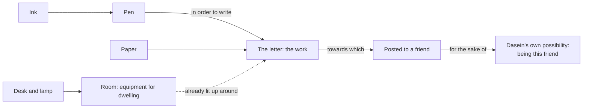

# Phenomenology & Personalism · Lesson 2.2: Heidegger: Dasein and being-in-the-world

> ⏱ ~15 min · Module 2: Existence: Kierkegaard and Heidegger · Builds on: [1.3 The natural attitude, the epoché and the reductions](01-03-the-epoche-and-the-reductions.md), [2.1 Kierkegaard: the single individual](02-01-kierkegaard-the-single-individual.md) · Unlocks: [2.3 The they, mood and care](02-03-the-they-mood-and-care.md)

## Why this matters

Descartes began with a mind and then asked how it reaches a world ([modern-philosophy 1.2](../../modern-philosophy/lessons/01-02-the-cogito-and-the-wax.md)). Husserl bracketed the world and described what was left for consciousness ([1.3](01-03-the-epoche-and-the-reductions.md)). Martin Heidegger (1889–1976) argued that both started one step too late. Before any mind looks at any object, you are already somewhere, busy with something, using things you do not notice. *Being and Time* (*Sein und Zeit*), published in spring 1927 in Husserl's own *Jahrbuch*, set out to describe that "already". Only two of its planned divisions appeared, yet its vocabulary runs through Sartre, Levinas and every later argument that thinking rests on skilled practice.

## The idea

**The [question of Being](../reference.md#question-of-being).** Heidegger's question is not "which things exist?" but what it means *to be* at all. His first rule is that Being is not itself a being. You cannot explain it by tracing beings back to some other, bigger being (§2). Readers call this the [ontological difference](../reference.md#ontological-difference). The phrase is not in *Being and Time*; the distinction is.

**Dasein.** Where to look for an answer? At the one entity that already understands Being, vaguely and without theory: us. Heidegger calls it *Dasein* (in ordinary German, "existence"; literally "being-there"). It is the entity for which, in its being, its own being is at issue (§4, restated in §9). Two features follow (§9):

> The entity whose analysis is our task is in each case we ourselves. The being of this entity is in each case mine [*je meines*]. (translation ours, from the 1927 German)

First, **existence** (*Existenz*) is a term of art reserved for Dasein. A table's features are properties it has. Dasein's features are "possible ways to be", so its "essence" lies in its having-to-be. Second, **mineness** (*Jemeinigkeit*): Dasein is never a specimen of a kind; one addresses it as "I am", "you are". See [Dasein](../reference.md#dasein).

**Method.** Phenomenology, §7 says, names no subject matter, only a way of access:

> to let that which shows itself be seen from itself, just as it shows itself from itself. (translation ours, from the 1927 German)

This is the old maxim "to the things themselves!" Heidegger adds that describing Dasein is *interpretation* (hermeneutics). It makes explicit an understanding of Being that Dasein already lives in.

**Being-in-the-world.** Where does Dasein's everyday understanding show itself? Not in contemplation, but in dealings (*Umgang*). Heidegger's name for Dasein's basic state is [being-in-the-world](../reference.md#being-in-the-world), hyphenated because it is one phenomenon, not a subject plus a world plus a relation. The "in" is not that of water in a glass or a dress in a cupboard. Heidegger traces it to an old root meaning to dwell, to be familiar with (§12).

**Equipment.** The things we deal with first are not "mere things", nor things with a value attached. They are *Zeug*, equipment. Strictly, a piece of equipment never "is" alone. It is something *in order to* (*um zu*), and it belongs to a whole of other equipment: pen, ink, paper, desk, lamp, room. Their way of being is **readiness-to-hand** (*Zuhandenheit*). Equipment in use withdraws:

> The peculiarity of what is proximally ready-to-hand is that it withdraws [*sich zurückzuziehen*], as it were, in its readiness-to-hand, precisely in order to be properly ready-to-hand. (translation ours, from the 1927 German)

What concern attends to is the work, the thing being made. Using is not blind. It has its own kind of sight, *circumspection* (*Umsicht*). The way of being that a thing has when we merely look at it is **presence-at-hand** (*Vorhandenheit*): it simply occurs there, with properties. See [ready-to-hand and present-at-hand](../reference.md#ready-to-hand-and-present-at-hand).

**When equipment fails** (§16), presence-at-hand shows itself, and so does the world. Something unusable becomes *conspicuous*. Something missing makes what remains *obtrusive*: it just stands there, going nowhere without the missing piece. Something in the way makes the business it blocks *obstinate*. In each case the reference that was simply lived in, from *this* to *that*, is broken and becomes explicit. Through the gap, the whole workshop lights up as what we were "always already" in ([broken equipment](../reference.md#broken-equipment)). The chain of references ends somewhere (§18). Hammering is for fastening, fastening for protection against bad weather, and that is for the sake of Dasein's sheltering: a possibility of Dasein's own being, not another tool.

**The break with Husserl.** Heidegger was Husserl's assistant from 1919 to 1923 and succeeded to his Freiburg chair in 1928. *Being and Time* is dedicated to Husserl "in veneration and friendship" (Todtnauberg, 8 April 1926). Yet the book makes no use of the transcendental reduction. Husserl brackets the world to reach the [transcendental ego](../reference.md#transcendental-ego) for which the world is meaningful. Heidegger asks what kind of being that ego has, and answers that the one who brackets is already in a world. Privately, a 1923 letter to Karl Löwith had already dismissed Husserl as never a philosopher. At Davos in 1929 Heidegger disputed with Ernst Cassirer over Kant; the debate is named here only.

## Source

Heidegger, *Sein und Zeit* §15 (translation ours, from the 1927 German; local text the unchanged 11th Niemeyer printing, 1967).

> The dealings suited to each piece of equipment, in which alone it can genuinely show itself in its being (hammering with the hammer, for instance), neither grasp this entity thematically as a thing that occurs, nor does the using so much as know the structure of equipment as such. [...] The less we just stare at the hammer-thing [*begafft*], and the more we seize hold of it and use it, the more original our relation to it becomes, and the more unveiled is the way it is encountered as what it is: as equipment. The hammering itself discovers the specific "handiness" [*Handlichkeit*] of the hammer. The kind of being of equipment, in which it reveals itself from itself, we call readiness-to-hand [*Zuhandenheit*].

Notice the comparatives. Using does not merely *add* to staring; the more it *replaces* staring, the more "unveiled" the hammer is. The claim is about where things show themselves as they are, not efficiency.

## The argument

1. **The meaning of Being must be asked of a being that already understands Being, and that being is Dasein** (§§2–4). *In words:* begin with the questioner, who already uses "is" competently.
2. **Dasein's being is existence: it is its possibilities, each time mine; its characteristics are ways to be, not properties** (§9). *In words:* you are not a thing with features; you are how you go about being.
3. **Phenomenology must let Dasein show itself as it is "proximally and for the most part", in its average everydayness** (§§7, 9).
4. **In everyday dealings, entities show themselves first as equipment: ready-to-hand, withdrawn, within a referential whole, seen by circumspection** (§15).
5. **Presence-at-hand shows itself when dealings are disturbed, or when we hold back and merely look** (§§13, 16). *In words:* bare objects with properties are what is left when use stops or steps back.
6. **The referential whole ends in a for-the-sake-of-which that is a possibility of Dasein, and this whole is the world** (§18).
7. **∴ Dasein is being-in-the-world.** The picture of a worldless subject facing present-at-hand objects takes a derivative mode for the basic one. That is Heidegger's charge against Descartes (§§19–21; §43 reverses the cogito: first "I am", in the sense "I am in a world").

**Where the argument is weakest.** Premise 5, read with 4: the claim that the ready-to-hand comes "first" and that mindful, conceptual regard is derivative. Hubert Dreyfus's influential commentary *Being-in-the-World* reads premise 4 as absorbed, non-conceptual "skilful coping". Dreyfus turned that reading against John McDowell in his 2005 APA presidential address, "Overcoming the Myth of the Mental". McDowell's reply ("What Myth?", *Inquiry*, 2007) attacks exactly this priority. Rational, conceptual capacities are at work even in absorbed activity, he argues, so there is no mindless layer beneath the mind for theory to be derived from. Dreyfus answered that the phenomenology of expert coping shows no detached "I" at all. A defender of Heidegger, rather than of Dreyfus, has a third move. §15 already says that using "is not blind" and has its own sight. So one can grant McDowell that coping is intelligent and still deny that its intelligence is the staring at properties that premise 5 calls derivative. Whether that sight is conceptual is the live dispute.

## Picture

Each arrow is a reference. No item is what it is alone; the room is met before the single pen. The chain stops at a for-the-sake-of-which that is not equipment but a way Dasein can be (§18). When the pen runs dry, the whole diagram becomes visible at once.

## Worked examples

**Example 1 (clean: a sticky key).** You are typing a reply to a colleague, thinking about the argument. The keys are ready-to-hand: withdrawn, encountered through the work (the email), which refers on to the colleague and to being someone who answers on time. Then the "e" sticks. The key turns *conspicuous* (§16). Now you see a grey square with crumbs under it: its presence-at-hand "announces itself". But you see a *broken key*, already bound up with repair, not a plastic object. Conspicuous equipment is not yet a mere thing (§16). What else lights up is the referential whole: this key *for* this word *for* this email *for* this colleague. You did not infer that whole; you were in it.

**Example 2 (hard: "this bike is heavy").** A cyclist hauling her bike up the station stairs says "this bike is heavy". An engineer at a test bench writes down "mass: 14.2 kg". §69 discusses exactly this pair, with a hammer. Said circumspectively, "heavy" means *too* heavy, calling for effort. Said of a body under gravity, it names a property, and "too heavy" stops making sense. Heidegger says the change is not that we stop handling the thing, nor that we abstract from its use. Rather, the understanding of Being that guides us "has changed over": we see the ready-to-hand anew, as present-at-hand.

The case strains in two places. First, the engineer's bench and scale are themselves equipment and her measuring is skilled practice, so where does circumspection end and the theoretical gaze begin? Heidegger grants that the ready-to-hand can itself be a theme of science. Second, a realist objects that the 14.2 kg was true of the bike before anyone climbed stairs, so why call that way of being "derivative"? Heidegger's answer is that "derivative" concerns the order in which entities are disclosed to Dasein, not the order of causes in nature. Whether that order has the priority he gives it is premise 5 again. Descartes's wax ([modern-philosophy 1.2](../../modern-philosophy/lessons/01-02-the-cogito-and-the-wax.md)) is the same dispute. Descartes strips away everything but extension and calls that the wax. On Heidegger's reading, by then the candle has already been taken out of the world it lit.

## Watch out

- **You might think "Dasein" means "consciousness" or "the human organism", but it is neither.** It names the entity *in terms of its way of being*: existing, each time mine, already in a world. Swapping in "the subject" smuggles back what the analysis denies.
- **You might think "existence" means "being actual", but in *Being and Time* it is a term of art.** The traditional *existentia*, actual occurrence, Heidegger renames presence-at-hand. *Existenz* is reserved for Dasein's way of being, which is to be its possibilities. "Tables exist" in his sense is a category mistake.
- **You might think the ready-to-hand is a present-at-hand object with a use-value added, but Heidegger rejects that layering.** §15 questions what "value-laden things" even means. §16 says presence-at-hand *announces itself* in a disturbance of use; it is not the base that use is painted onto. Nor is use sightless: circumspection is a kind of sight.

## One-liner

> Before you are a mind looking at objects, you are Dasein already at work in a world: things show up first as equipment that withdraws into use, and the bare object with properties appears when the work breaks or you step back to stare.

## Problems

**P1 (🟢) *(Exegetical (a) · Evaluative (b).)*** Apply to a hard case. A commuter cycles to work, late for a meeting. (i) On a climb she shifts down without a thought, rehearsing what she will say. (ii) A shift fails, the chain skips, and she looks down at the derailleur. (iii) The rear tyre goes soft; she reaches for the pump that always rides in its clip, and the clip is empty. (iv) Back on the road, a parked delivery van blocks the bike lane. (a) Describe (i) in Heidegger's terms, name the §16 mode at work in each of (ii)–(iv), and say what all three disturbances disclose. 120 words or fewer. (b) Her friend, a mechanic, says: "When I true a wheel on the stand I stare at spoke tension all day. So the wheel is present-at-hand for me." Say what Heidegger's text says about his case and where the distinction stops deciding it. 100 words or fewer.

**P2 (🟡) *(Exegetical.)*** Close reading. Heidegger, *Sein und Zeit* §16 (translation ours, from the 1927 German).

> Likewise, the absence of something ready-to-hand, whose everyday presence was so much a matter of course that we never so much as took notice of it, is a break in the referential contexts [*Verweisungszusammenhänge*] discovered in circumspection. Circumspection runs into emptiness, and only now sees what the missing thing was ready-to-hand for, and with what. Once again the environment [*Umwelt*] announces itself. What lights up in this way is itself not one ready-to-hand thing among others, and still less something present-at-hand that might, say, ground the ready-to-hand equipment. It is in the "there" [*Da*] before any ascertaining or observing.

(a) What lights up when something is missing, and how is it seen? Two sentences. (b) A reader concludes: "So the world is the sum of all the equipment, which we finally notice when a piece goes missing; underneath it all lies physical stuff." Name the two phrases in the passage that each half of this contradicts, and say what each rules out. Two sentences per half.

**P3 (🔴) *(Exegetical (a) · Evaluative (b).)*** Find the crux. An invented seminar exchange about the cyclist of P1:

> **Husserlian:** Perform the epoché. Bracket the existence of the bike and the road. What remains is the experience of riding with its meant object, constituted by a transcendental ego that is not itself a thing in the world. That ego is where the description must start.
>
> **Heideggerian:** There is no such ego to retreat to. Whoever does the bracketing is already late, already riding, already in a world. Start there.

(a) Name the single premise about the describer on which they part ways: which side asserts it, and which denies it? 60 words or fewer. (b) Say what argument would move each side off its position. Any verdict; 120 words or fewer.

Solutions

**P1** *(Exegetical (a) · Evaluative (b).)*

**Accept:** in (a), any order of naming. In (b), any placement of the boundary, provided the text is reported correctly first.

**Must hit, strict (a):**

- (i) The gears are ready-to-hand: they withdraw in use, she deals with them circumspectively, and her concern is with the "work" (getting to the meeting, what she will say), not the derailleur.
- (ii) Unusability: the gear becomes *conspicuous*. (iii) Something missing: the pump's absence makes what remains *obtrusive*; the bike shows itself as merely present, unable to go on without what is missing. (iv) Something in the way: the van, neither missing nor broken, "lies in the way", which is *obstinacy*.
- In each, presence-at-hand announces itself, yet stays bound up with readiness-to-hand. The broken reference becomes explicit, and the referential whole, the world, lights up: what the gear, the pump and the lane were *for*.

**Must hit, any verdict (b):**

- Report §16 correctly: equipment under repair is not yet a mere present-at-hand thing. Presence-at-hand "announces itself" and withdraws again into the readiness of what is being put right. The mechanic's attention is circumspection, which "is not blind" and has its own sight.
- Name where the text stops deciding: careful, numerical attention (a tension meter, logged readings) shades toward the theoretical regard of §69. Heidegger gives no sharp test for when the understanding of Being "changes over".

**Wrong turns:** calling (ii)–(iv) "present-at-hand" without qualification; §16 insists the disturbed tool is not yet a bare thing. Treating "looking at it closely" as the mark of presence-at-hand; circumspection looks too. Calling (iv) obtrusiveness because the van is large; the mode is fixed by the van's role (in the way), not by how much it impresses.

**Model answer (b), one of several:** Heidegger would deny it. A wheel on the stand is equipment under repair. Its presence-at-hand shows itself in the bent rim, but it stays bound to readiness-to-hand, since what the mechanic sees is a wheel to be made true. Staring is not the test. Circumspection has its own sight, and his staring is guided by what the wheel is for. The text stops deciding when he logs tension readings into a spreadsheet to study spoke fatigue. §69 says the shift comes when we see the thing "anew" as a body with properties. Heidegger does not say how much measurement it takes to cross that line.

---

**P2** *(Exegetical, strict.)*

**Must hit, strict (a):**

- The *environment*, the referential context: what the missing thing was "for" and what it went "with". It was there all along but unnoticed.
- It is seen by circumspection, running "into emptiness", not by observation; it is "in the 'there' before any ascertaining or observing".

**Must hit, strict (b):**

- "Not one ready-to-hand thing among others" rules out the first half. The world is not one more item, nor a collection of items. It is the whole of references within which items are encountered.
- "Still less something present-at-hand that might ... ground the ready-to-hand" rules out the second half. Physical stuff is not the foundation that use is built on. (The same section adds that the world does not "consist of" the ready-to-hand.)

**Wrong turns:** reading "only now sees" as *the world comes into being when noticed*. The passage says it "announces itself"; it was already disclosed, though not noticed. Taking "before any ascertaining or observing" as a claim about time on a clock rather than about the order of disclosure.

**Model answer:** (a) The environment lights up: the context of references, what the missing item was for and what it went with, which we lived in without noticing. It shows itself to circumspection, which "runs into emptiness", and it is in the "there" before any observing. (b) "Not one ready-to-hand thing among others" denies that the world is the sum of equipment. It is the whole within which equipment is met, not a further item or a total of items. "Still less something present-at-hand that might ... ground the ready-to-hand" denies that physical stuff underlies use as its foundation. Presence-at-hand is a way of being that shows up in breakdown, not the base of the world.

---

**P3** *(Exegetical (a) · Evaluative (b).)*

**Accept:** any formulation that locates the disagreement in the *being of the describer*, not in whether the world exists.

**Must hit, strict (a):**

- The premise: the one who describes can be reached and described apart from any involvement in a world, as a field of consciousness for which the world is a constituted correlate.
- The Husserlian asserts it; the Heideggerian denies it. On his side, the describer's way of being is being-in-the-world, so any bracketing is itself an act of a being already in a world.

**Must hit, any verdict (b):**

- What moves the Husserlian: an argument that the reduction leaves the being of the transcendental ego undetermined, as Heidegger says Descartes left the "sum" undetermined (§6). Or one that bracketing presupposes the very understanding of Being it claims to suspend.
- What moves the Heideggerian: an argument that the analytic of Dasein itself relies on descriptions whose validity needs the reduction. Without it, the analytic is a description of one kind of entity in the natural attitude, an anthropology, and cannot claim to ground ontology.
- Neither side may misstate the other: the epoché does not deny the world exists, and Dasein is not a psychological or biological subject.

**Wrong turns:** locating the crux in whether the bike exists. The epoché brackets the world's existence; it does not deny it. Saying Heidegger rejects phenomenology. §7 defines his method *as* phenomenology, made hermeneutic.

**Model answer (b), one of several:** The Husserlian should give way if it can be shown that the transcendental ego has no determinate way of being. On that showing, "pure consciousness" is a mind with the world subtracted, not a new field: Descartes's worldless ego under another name. The Heideggerian should give way if the analytic of Dasein turns out to rest on claims about meaning (that equipment refers, that the world "announces itself") whose necessity and generality can only be secured by bracketing. Short of that, they are reports about how one kind of entity behaves, and that is anthropology, not ontology. The test is whether either description can be given without borrowing the other's starting point.

## Flashback

**From Lesson [1.4](01-04-the-lifeworld-and-the-crisis-of-the-sciences.md) (The lifeworld and the crisis of the sciences):** *(Exegetical.)* Apply to a new case. A piano tuner's app lists an equal-tempered frequency for every key: each semitone up multiplies the frequency by exactly $2^{1/12}$, so every fifth has the ratio $2^{7/12} \approx 1.4983$. The app also assumes an ideal string, whose overtones are exact whole-number multiples of its lowest frequency. Real piano strings are stiff, so their overtones run sharp. Tuned by ear, listening for the slow wavering called beats, a good piano's octaves come out slightly wider than $2:1$ ("stretched"). The apprentice says: "The real pitches are the app's numbers; the stretched octaves my ear accepts are subjective bias." The senior tuner says: "The ear beat the app, so lived experience beats physics, just as Husserl said." (a) In Husserl's terms, name the *plenum* here, say how it is mathematized, and name one limit shape in the app. Two sentences. (b) Say how each tuner misreads Husserl. Two sentences each.

Solution

**Accept:** in (a), either limit shape (the exact ratios or the ideal string).

**Must hit, strict (a):**

- The *plenum* is pitch as heard (with the heard beats). It is mathematized *indirectly*: correlated with a motion, the frequency of the string's vibration, which is then idealized.
- A limit shape: the exact ratio $2^{1/12}$ (or $2^{7/12}$), an irrational number no string holds exactly, the limit of ever-finer tuning; or the ideal string with exactly harmonic overtones, which no stiff steel string is.

**Must hit, strict (b):**

- Apprentice: this is objectivism, the garb of ideas taken for true being. The method's product is promoted to "the real pitch" and the heard world demoted to subjective appearance, which inverts the order of founding, since the numbers get their sense and their confirmation from hearing and from readings (the app's needle is itself read by an eye).
- Senior: Husserl does not set the lifeworld against physics. Physics' results stand, and his charge is against its self-interpretation. Here one lifeworld experience (heard beats) corrects a model whose idealization was too crude for this piano, and better physics (the stiffness of strings) predicts the stretch. Physics is revised, not beaten.

**Wrong turns:** calling the app's numbers an *abstraction* from heard pitch; idealization constructs a limit, it does not subtract features. Naming frequency as the *plenum*; frequency is what the plenum is correlated with. Reading Husserl as saying the ear is infallible; felt warmth, in the lesson, is a poor guide.

**Model answer:** (a) The plenum is heard pitch, which physics mathematizes indirectly by tying it to a motion, the string's vibration frequency, and then idealizing. The exact ratio $2^{7/12}$, which no real string holds exactly, is a limit shape. (b) The apprentice commits objectivism: he takes the idealized frequencies for the true pitches and demotes what he hears to appearance, though those numbers mean something only through hearing and reading instruments. The senior errs the other way: Husserl never says experience outranks physics, and here heard beats correct a crude model, while a better physics of stiff strings agrees with the ear.

## Connections

- **Backward:** the epoché and the transcendental ego ([1.3](01-03-the-epoche-and-the-reductions.md)) are the Husserlian starting point Heidegger declines. Compare Husserl's later lifeworld ([1.4](01-04-the-lifeworld-and-the-crisis-of-the-sciences.md)), another ground beneath theory. Descartes's cogito and wax ([modern-philosophy 1.2](../../modern-philosophy/lessons/01-02-the-cogito-and-the-wax.md)) are the worldless subject and the present-at-hand object of §§19–21. Kierkegaard's single individual ([2.1](02-01-kierkegaard-the-single-individual.md)) is the precursor to compare with "mineness".
- **Forward:** [2.3](02-03-the-they-mood-and-care.md) asks *who* is in the world everyday (the they), how the world matters (mood), and what unifies it all (care). [2.4](02-04-being-toward-death-authenticity-and-1933.md) asks how Dasein can be a whole. Sartre's for-itself ([3.1](03-01-sartre-existence-precedes-essence-and-bad-faith.md)) takes over "existence" with a different meaning.
- **Sideways:** Dreyfus turned this analysis of equipment and background into a critique of symbolic AI. The computational theory of mind it targeted is [`philosophy-of-mind`](../../philosophy-of-mind/syllabus.md) 6.1, and the extended-mind thesis (4.3 there) is a cousin of the claim that the mind is not sealed inside the head.
