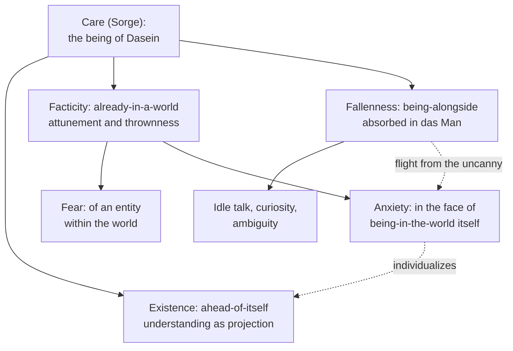

# Phenomenology & Personalism · Lesson 2.3: The they, mood and care

> ⏱ ~15 min · Module 2: Existence: Kierkegaard and Heidegger · Builds on: [2.1 Kierkegaard: the single individual](02-01-kierkegaard-the-single-individual.md), [2.2 Heidegger: Dasein and being-in-the-world](02-02-heidegger-dasein-and-being-in-the-world.md) · Unlocks: [2.4 Being-toward-death, authenticity, and 1933](02-04-being-toward-death-authenticity-and-1933.md)

## Why this matters

[2.2](02-02-heidegger-dasein-and-being-in-the-world.md) answered *where* Dasein is: in a world of equipment, not inside a mind. This lesson answers *who* is there day to day, and Heidegger's answer is unsettling: usually nobody in particular. It then asks what mood discloses that cognition cannot, and why anxiety, a mood about nothing, is the key that opens the whole structure. The result, care (*Sorge*), is the frame Heidegger's account of death works on in [2.4](02-04-being-toward-death-authenticity-and-1933.md), and the vocabulary Sartre inherits and bends in Module 3.

## The idea

**Being-with.** Others are not inferred from bodies I see. They show up "at work", in the world I share with them. Dasein is essentially being-with (*Mitsein*, §26). Even being alone is a mode of being-with: someone can be *missing* only for a being that is already with others.

**The they.** So who acts in everyday life? Heidegger's answer is *das Man* (§27), built from the German pronoun *man*, "one" as in "one doesn't do that." It is not a group of others set over against me.

> We read, see and judge literature and art as one [*man*] sees and judges; but we also withdraw from the "great mass" as one withdraws; we find "shocking" what one finds shocking. (translation ours, from the 1927 German)

[Das Man](../reference.md#das-man) is everyone and no one, me included. Its ways of being are *distantiality* (a quiet concern with how I stand relative to others), *averageness* (what passes, what is allowed), *levelling down* (everything original is smoothed overnight into the long familiar) and *publicness*. It also relieves me of decisions: when something is chosen, "one" chose it, and nobody is answerable. Heidegger's summary:

> Everyone is the other, and no one is himself. (translation ours, from the 1927 German)

**Fallenness.** The they's disclosure of the world has three marks (§§35–37): **idle talk** (*Gerede*), understanding everything without having made the matter one's own; **curiosity** (*Neugier*), seeing only in order to have seen, leaping from the new to the newer; and **ambiguity** (*Zweideutigkeit*), where it can no longer be told what was really understood and what only looks it ([idle talk, curiosity and ambiguity](../reference.md#idle-talk-curiosity-and-ambiguity)). Together they make up [fallenness](../reference.md#fallenness) (*Verfallen*, §38): Dasein absorbed in its concerns and lost in the public way of seeing things. Heidegger insists, of both *Gerede* and *Verfallen*, that the word carries no disparaging or negative evaluation.

**Attunement.** Dasein always finds itself in a mood. Heidegger's term for this is *Befindlichkeit* (§29), from *sich befinden*, "how one finds oneself" ([attunement](../reference.md#attunement)). A mood is not an inner state coloring neutral data. It comes neither from outside nor from inside but rises out of being-in-the-world itself, and it discloses that I *am* and have to be, while my whence and whither stay dark. That bare "that it is" is **thrownness** (*Geworfenheit*). Its partner is **understanding as projection** (*Entwurf*, §31): Dasein always already understands itself from possibilities, not by drawing up plans but by pressing ahead into ways it can be ([thrownness and projection](../reference.md#thrownness-and-projection)).

**Fear and anxiety.** Fear (§30) has a definite object: a harmful entity within the world, approaching from some region, which might yet pass by. Anxiety (*Angst*, §40) does not:

> That in the face of which anxiety is anxious [*das Wovor der Angst*] is being-in-the-world as such. (translation ours, from the 1927 German)

In anxiety nothing within the world is relevant. Tools, plans and other people sink into insignificance, the threat is nowhere and yet close, and afterwards everyday speech says, truly in its own terms, that "it was really nothing." Anxiety is *unheimlich*, uncanny, which Heidegger hears as *not-at-home*. Fallen everydayness is a flight into the they's at-homeness away from this uncanniness. Fear, he concludes, is anxiety that has fallen into the world and is hidden from itself ([anxiety and fear](../reference.md#anxiety-and-fear)).

**Kierkegaard.** In a footnote to §40 Heidegger names [Kierkegaard](../reference.md#anxiety-kierkegaard) as the one who went furthest in analysing anxiety, but within a theological setting: a "psychological" exposition of original sin ([2.1](02-01-kierkegaard-the-single-individual.md)). Heidegger keeps the formal shape (anxiety has no entity as its object, and it discloses freedom and possibility) and sets the theological frame aside.

## The argument

From §§40–41. The goal is the unity of Dasein's being.

1. **Fallen absorption in the they is a flight, and a flight is always in the face of something threatening.** *In words:* turning away from something already shows it.
2. **What falling flees is not an entity within the world, since falling turns *toward* entities and loses itself in them.** *In words:* this is not fear.
3. **Anxiety is the attunement whose in-the-face-of-which and about-which are both being-in-the-world itself.** *In words:* it dreads one's own existing, not some thing.
4. **Anxiety strips away the they's interpretation and individualizes Dasein before its ownmost potentiality-for-being.** *In words:* the world can offer nothing, and the others can offer nothing either.
5. **What anxiety discloses at once is Dasein as thrown (facticity), as projecting (existence) and as having fled into the world (fallenness).**
6. **These are not pieces of a composite, one of which could be missing; they belong together originally.**
7. **∴ The being of Dasein is [care](../reference.md#care):** *Sich-vorweg-schon-sein-in-(der-Welt-) als Sein-bei (innerweltlich begegnendem Seienden)*, "being-ahead-of-itself-already-in-(the-world) as being-alongside (entities encountered within the world)" (translation ours, from the 1927 German). *In words:* to exist is to be thrown into a world, projected ahead into possibilities, and busy among things, all at once.

**Where the argument is weakest.** The status of the they, which steps 1 and 4 need. Heidegger calls *das Man* an existential belonging to Dasein's positive constitution (§27), and also a "dictatorship" over everyday Dasein. In a 1994 exchange in *Inquiry*, Frederick Olafson read *das Man* as a distorted mode of being-with. Taylor Carman read it as the shared social norms that make everyday intelligibility possible at all. Each, by Dreyfus's account of the debate (1995), granted that Heidegger's characterizations are inconsistent. If Olafson is right, das Man is no existential. If Carman is right, it is unclear what anxiety strips away. The defender points to §27's own distinction. *Das Man* is the public norms, and they never go away. The *Man-self* is the self that has let those norms choose for it. Authentic selfhood, §27 says, is not an exceptional state detached from the they but an existentiell modification of it: the same norms, taken over as one's own.

## The picture

Care is one structure with three moments, not three faculties. The dashed arrows are the argument: fallenness flees what anxiety discloses, and anxiety returns Dasein to its own possibilities.

## Worked examples

**Example 1 (clean: the morning commute).** Heidegger's own examples in §27 are public transport and the newspaper. Mira takes the 8:10 train. The train is ready-to-hand ([2.2](02-02-heidegger-dasein-and-being-in-the-world.md)), and in using it every passenger is like every other. She skims reviews and settles on a verdict about a film she has not seen, which is idle talk: the matter understood without being appropriated. She leaps from headline to headline without staying with any of them, which is curiosity. She cannot say which of her views she worked out and which she absorbed, which is ambiguity. When a man shouting at the end of the carriage starts down the aisle, she feels fear. Its in-the-face-of-which is a definite harmful entity approaching from a region. Its about-which is Mira herself, threatened in her being-alongside her bag, her seat and her morning. None of this is a vice. It is the everyday who, functioning normally.

**Example 2 (hard: anxiety at the award dinner).** Ines, an architect, is applauded at a dinner held in her honour. Nothing is wrong. Midway through her speech, the room, the prize and her plans all go flat. Nothing in particular threatens, yet she can hardly breathe. Afterwards she tells her partner, "It was nothing, really." This is §40 almost point for point. No entity is the threat. The whole of significance sinks into irrelevance, and the world shows itself only as world. Heidegger notes that anxiety can rise in the most harmless situations, and that the everyday "it was nothing" is right about entities and wrong about the world. It is not fear of failure, since her success is complete.

Where it strains: the description cannot settle from inside whether this is anxiety or a diffuse fear she has not yet named, such as a dread of the next commission. Heidegger grants that anxiety is often "physiologically" triggered, but replies that triggering is possible only because Dasein is anxious at the ground of its being. That is an ontological claim, and no single episode can confirm or refute it. Nor does the episode say what Ines does next. Whether she flees back into the they or takes up her possibility is the question of [2.4](02-04-being-toward-death-authenticity-and-1933.md).

## Watch out

- **You might think "the they" means other people, the crowd as against me, but actually *das Man* includes me and is nobody in particular.** The English "they" misleads, which is why this lesson keeps the German. Even withdrawing from "the great mass" is done as one withdraws. Contrarianism defined by what the public thinks is still the they.
- **You might think fallenness is the Fall, a moral or religious defect, but actually Heidegger rules that reading out.** In §38 the term carries no negative evaluation, it is not a fall from a purer original state, and it is not a defect that a more advanced culture might cure. It makes no ontic claim about the corruption of human nature. It does not decide whether we are in a state of sin, of integrity or of grace, though Heidegger adds that faith, when it speaks of Dasein conceptually, must come back to these structures.
- **You might think care means worry or caring about someone, but actually *Sorge* is purely ontological.** §41 explicitly excludes worry and carefreeness from its meaning, and denies that care puts practice above theory. Detached contemplation of a present-at-hand object is just as much a mode of care. Concern for things (*Besorgen*) and solicitude for others (*Fürsorge*) are its forms.

## One-liner

> Day to day, nobody in particular lives my life: the they does, and anxiety, dread of nothing within the world, breaks that spell and shows Dasein as care: thrown, projecting, and fallen, all at once.

## Problems

**P1 (🟢) *(Exegetical (a) · Evaluative (b).)*** Apply to a hard case. Three invented episodes:

1. On a quiet Sunday afternoon, with nothing due and nothing wrong, Lena finds that her plans, her flat and her friends' messages suddenly have no bearing on her. She cannot say what she dreads. That evening she tells a friend it was nothing, really.
2. Walking home, Tomasz sees an unleashed dog at the end of the lane lower its head and stiffen. He slows and looks for a way round.
3. On Dev's team, everyone "just knows" the new scheduling software is a disaster, though no one on the team has used it.

(a) Name the Heidegger term for each episode. For 1 and 2, say what the mood is *in the face of* and what it is *about*. For 3, name two features of the they at work. One or two sentences each. (b) Lena's doctor says her Sunday dread was low blood sugar. Does that refute Heidegger's description of episode 1? Any verdict; 80 words or fewer.

**P2 (🟡) *(Exegetical (a) · Evaluative (b).)*** Diagnose. An invented professional-network post:

> Everyone's talking about the four-day week, and honestly? It's the future. I haven't tried one myself, but the data is clear and all the smartest founders are saying it. Last quarter it was async-first, before that radical transparency; I've read every thread on all three. Don't be a dinosaur. The people who matter already know this. Agree? #FutureOfWork

(a) Find idle talk, curiosity, ambiguity and averageness or distantiality in the post, quoting the words that show each. One sentence each. (b) Stung by replies, the writer resolves to "stop following the crowd" and to post only contrarian takes from now on. Does that take him out of *das Man*? Answer from §27, in three sentences or fewer.

**P3 (🔴) *(Exegetical (a) · Evaluative (b).)*** Steelman and reply. An invented reading-group comment:

> Heidegger claims merely to describe, but §27 is a sneer at ordinary people: their newspapers, their trams, their tastes. "Dictatorship", "levelling", "fallenness". Saying it's "not a negative evaluation" is a fig leaf.

(a) Name two claims Heidegger makes in §27 or §38 that the commenter must answer. One sentence each. (b) Give the strongest version of the commenter's objection, then the best reply on Heidegger's behalf. Any verdict; 150 words or fewer.

Solutions

**P1** *(Exegetical (a) · Evaluative (b))*

(a) Episode 1 is anxiety, episode 2 is fear, and episode 3 is the they in idle talk.

**Must hit, strict (a):**

- **1, anxiety (*Angst*).** In the face of being-in-the-world as such, not any entity. About her own potentiality-for-being-in-the-world. Marks: world sinks into insignificance, no nameable threat, and the everyday verdict "it was nothing", which Heidegger cites (§40).
- **2, fear.** In the face of a definite harmful entity (the dog) approaching from a region, which might still pass by. About Tomasz himself, threatened in his being.
- **3, the they and idle talk.** Any two of: averageness (what "one" thinks of the software), idle talk (understanding without appropriating the matter, since nobody has used it), levelling, publicness, and the relief from judging ("everyone knows", nobody is answerable).

**Must hit, any verdict (b):**

- Heidegger anticipates the point: anxiety is often "physiologically" conditioned, but such triggering is possible only because Dasein is anxious at the ground of its being (§40).
- Separate the ontic cause (blood sugar) from the ontological description (what the mood discloses).
- Say what the doctor's report would have to show to bite: that the disclosure itself (world sinking into insignificance) is misdescribed, or that a ground no episode can test is idle.

**Wrong turns:** calling episode 3 "fear of the software". Calling episode 1 fear of something unconscious, which gives anxiety an entity as its object.

**Model answer (b), one of several:** No. Heidegger grants that anxiety is often physiologically triggered and says such triggering is possible only because Dasein is anxious at bottom. Blood sugar is a cause. The description concerns what was disclosed: a world without significance. Still, the doctor's point exposes a cost. If no causal story could ever count against the claim, its evidence is the description alone.

---

**P2** *(Exegetical (a) · Evaluative (b))*

**Must hit, strict (a):**

- **Idle talk:** "I haven't tried one myself, but the data is clear", "everyone's talking". Understanding the matter without having appropriated it.
- **Curiosity:** "last quarter it was async-first, before that radical transparency; I've read every thread". Leaping from new to newer, seeing in order to have seen.
- **Ambiguity:** the post cannot tell, and does not care, whether its confidence is real understanding or only looks like it ("honestly?", "the data is clear").
- **Averageness or distantiality:** "the people who matter already know this", "don't be a dinosaur". The measure is what one accepts and where one stands relative to others.

**Must hit, strict (b):**

- No. §27: we also withdraw from "the great mass" *as one withdraws*. A contrarianism set by what the crowd thinks still takes its measure from the they.
- Authentic selfhood is not a state detached from the they but an existentiell modification of it (§27). So the change, if any, would be in who owns the choice, not in avoiding public opinions.

**Wrong turns:** treating the post as a moral failing or as dishonesty. Heidegger's terms are structural, and the writer may be entirely sincere. Saying the remedy is to stop posting, which mistakes a mode of being for a behaviour.

**Model answer (b):** No. Withdrawing from the crowd is itself something "one" does, and a contrarian whose takes are fixed by what the crowd says still lets the they set the measure. Authenticity, for §27, is not escape from the they but a modification of it, the same public world taken over as one's own.

---

**P3** *(Exegetical (a) · Evaluative (b))*

**Must hit, strict (a):** any two of:

- *Das Man* is an existential and belongs to Dasein's positive constitution (§27).
- "Fallenness", like "idle talk", expresses no negative evaluation. It is not a fall from a purer original state, and not a defect a more advanced culture could remove (§38).
- Authentic selfhood is an existentiell modification of the they, not a state detached from it (§27).

**Must hit, any verdict (b):**

- Steelman: the vocabulary is evaluative (dictatorship, levelling, fallen), and the analysis ranks one way of living above another. Or, following Olafson's reading, if *das Man* is a distorted mode of being-with, then calling it an existential is inconsistent.
- Reply: separate *das Man* (public norms, a permanent condition of intelligibility, Carman's reading) from the *Man-self* (letting those norms choose for one). Only the latter is "inauthentic", and Heidegger says it is how Dasein is "first and mostly", not a vice.
- Judge whether the distinction removes the evaluative charge or only relocates it.

**Wrong turns:** answering with Heidegger's politics. That belongs to 2.4 and does not settle what §27 says. Treating "not a negative evaluation" as decisive, which is exactly what the commenter disputes.

**Model answer (b), one of several:** At full strength: a description that calls ordinary life "dictatorship" and "levelling", and offers an escape called "authenticity", is a value ranking whatever its author says. If the they is a distortion, it cannot also be part of Dasein's positive constitution. The reply: §27 separates the they, the public norms without which nothing is intelligible, from the Man-self that lets those norms decide for it. Authenticity does not abolish the norms. It modifies one's relation to them. Commuters and newspapers are not condemned, since the authentic self rides the same tram. This saves the consistency of the account. Whether it fully removes the evaluative tone is less clear, since "ownmost" and "authentic" still mark one way of being as the one the analysis is after.

## Flashback

**From Lesson [2.1](02-01-kierkegaard-the-single-individual.md) (Kierkegaard: the single individual):** *(Exegetical.)* Apply to a hard case. Three invented people, read with Anti-Climacus's account of despair (*Fortvivlelse*) in *The Sickness unto Death*:

- **Anders**, a well-liked tax official, is content with his house, his pension and his good name. He has never asked who he is apart from these, and says he has not despaired a day in his life.
- **Birgit**, after her firm collapses in a public scandal, moves to another town under her mother's maiden name and says she would give anything to wake up as someone else.
- **Carl**, a self-made engineer, refuses every kind of help and says he is exactly what he has made himself, owing his existence to no one and answerable to no one.

(a) Name the form of despair each shows, with the feature of the case that decides it. One sentence each. (b) A reader says Carl, alone of the three, has escaped despair, since unlike Birgit he wills to be himself. Using Anti-Climacus's definition of the self and of the cure, say what is wrong. Two sentences.

Solution

**Must hit, strict:**

- (a) **Anders: despair that does not know it is despair, ignorant of having a self.** Despair is a misrelation in the self's relation to itself, not a mood, so his contentment and his denial are no evidence against it; not knowing is itself the first form.
- (a) **Birgit: weakness, not willing to be oneself.** She wants to be rid of the self she is, her history included, and to be someone else.
- (a) **Carl: defiance, willing to be oneself on one's own terms.** He wills to be himself as his own sole author.
- (b) The self is a relation that relates itself to itself and is grounded in the power that established it; the cure is a self that wills to be itself *while resting transparently in that power*. Carl wills to be himself while denying any ground but his own will, so his willing is the last form on the scale, not the cure.

**Wrong turns:** clearing Anders because he feels fine, which reads despair as a mood. Clearing Carl because he is confident and decisive: willing to be oneself is shared by defiance and the cure, and only the resting in the ground separates them. Answering with the stages (aesthetic, ethical) instead of the forms of despair; the stages are a different map.

**Model answer:** (a) Anders is in despair without knowing it, ignorant of having a self, and his denial is part of the form. Birgit despairs in weakness: she does not will to be herself. Carl despairs in defiance: he wills to be himself on his own terms. (b) For Anti-Climacus the self is a self-relation grounded in the power that established it, and the cure is willing to be oneself while resting transparently in that power. Carl wills himself as self-made, so he has moved further into despair, not out of it.

## Connections

- **Backward:** Being-in-the-world and the ready-to-hand are [2.2](02-02-heidegger-dasein-and-being-in-the-world.md); this lesson answers the "who" of that world. Kierkegaard's anxiety and his single individual ([2.1](02-01-kierkegaard-the-single-individual.md)) are the named source, with the theology removed. The worldless Cartesian subject of [modern-philosophy 1.2](../../modern-philosophy/lessons/01-02-the-cogito-and-the-wax.md) is what Mitsein and attunement both deny.
- **Forward:** [2.4](02-04-being-toward-death-authenticity-and-1933.md) shows the they's evasion of death ("one dies") and how anxiety's individualization becomes anticipation and resoluteness. Sartre's anguish and bad faith ([3.1](03-01-sartre-existence-precedes-essence-and-bad-faith.md)) rework anxiety and flight into a theory of freedom. His look ([3.2](03-02-sartre-the-look.md)) replaces Mitsein with conflict.
- **Sideways:** Durkheim's social facts ([social-theory 1.1](../../social-theory/lessons/01-01-individuals-and-social-facts.md)) are external to me and felt when resisted. *Das Man* is not external, since I am one of the "one". Tocqueville's tyranny of the majority over opinion ([history-of-political-thought 6.3](../../history-of-political-thought/lessons/06-03-tocqueville-tyranny-of-the-majority-and-soft-despotism.md)) is the political theorist's cousin of levelling.
