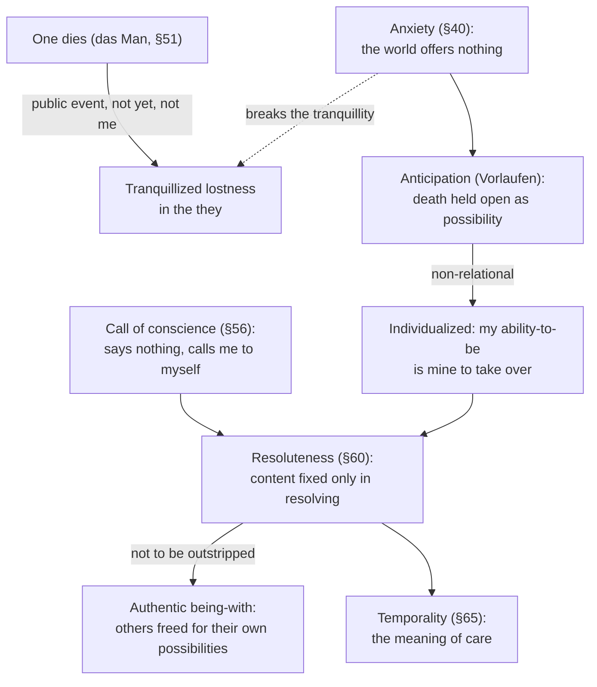

# Phenomenology & Personalism · Lesson 2.4: Being-toward-death, authenticity, and 1933

> ⏱ ~15 min · Module 2: Existence: Kierkegaard and Heidegger · Builds on: [2.2 Heidegger: Dasein and being-in-the-world](02-02-heidegger-dasein-and-being-in-the-world.md), [2.3 The they, mood and care](02-03-the-they-mood-and-care.md) · Unlocks: [3.1 Sartre: existence precedes essence, and bad faith](03-01-sartre-existence-precedes-essence-and-bad-faith.md)

## Why this matters

Division I of *Being and Time* (1927) described everyday Dasein, mostly lost in *das Man*. Division II asks whether Dasein can be anything else, and answers through death: facing my own death is what can pull me out of the they and make my existence my own. That analysis gave existentialism its vocabulary of authenticity and resolve. Six years later its author joined the Nazi party and became rector of Freiburg. A serious reader of the book has to know both the argument and the record, and to keep them apart until an argument joins them.

## The idea

**The problem of the whole (§§46–47).** [Care](../reference.md#care) makes Dasein always ahead of itself: while it exists, something is still outstanding. So it seems Dasein can never be grasped whole, since when nothing is outstanding it no longer exists. Can we study the whole through others' deaths? No. We experience losing them, not their dying, and (translation ours, from the 1927 German, §47):

> No one can take another's dying away from him [*abnehmen*].

You can die *for* someone, Heidegger grants, but only by sacrificing yourself "in a definite matter". Their death remains theirs.

**Death as possibility, not event (§§50–52).** Heidegger's move is to stop treating death as the moment of demise (*Ableben*) and treat it as a way Dasein *is* the whole time: [being-toward-death](../reference.md#being-toward-death) (*Sein zum Tode*). §52 gathers its characters:

> Death, as the end of Dasein, is Dasein's ownmost, non-relational, certain and as such indefinite, not-to-be-outstripped possibility.

*Ownmost*: in it my being-in-the-world as such is at stake. *Non-relational* (*unbezüglich*): no relation to others or to things can carry it for me. *Certain* but *indefinite*: it is sure, and possible at any moment. *Not to be outstripped*: no possibility lies beyond it.

**The they's evasion (§51).** Everyday talk says "one dies", *man stirbt*. Death becomes a public event that happens to "one", which is nobody in particular, and "not yet". The phrase turns a possibility into an actual occurrence somewhere else, and so conceals exactly the non-relational, indefinite character. The they even "consoles" the dying by assuring them they will recover.

**Anticipation (§53).** The authentic alternative is *Vorlaufen*, running ahead into the possibility. It is not brooding on death, and not expecting it as one awaits an arrival; both treat it as an event to be actualized. Anticipation holds death open *as possibility*. Because the possibility is non-relational, it **individualizes**: it hands my ability-to-be back to me alone. Anxiety ([2.3](02-03-the-they-mood-and-care.md), [anxiety and fear](../reference.md#anxiety-and-fear)) is the mood that keeps that threat open.

**Authenticity, conscience, resoluteness.** [Authenticity](../reference.md#authenticity) translates *Eigentlichkeit*, from *eigen*, "own". In §9 Dasein can be authentic because it can be "its own [*sich zueigen*]". It is not sincerity, and inauthenticity is not "less" being: §9 says it can mark Dasein at its busiest and most engaged. The call of conscience (§56) says nothing about the world. It calls the self out of [das Man](../reference.md#das-man) back to its ownmost ability-to-be. Hearing it is [resoluteness](../reference.md#resoluteness) (*Entschlossenheit*, §60), a word built on *erschlossen*, "disclosed". What does resolute Dasein resolve upon? Heidegger answers that only the resolution itself can say; no content is fixed in advance. Anticipation and resoluteness unite as "anticipatory resoluteness" (§62), and their meaning is temporality (§65), the ground for the rest of the book. Heidegger's later rethinking of the project, the "turn" (*Kehre*), is outside this course.

## Source

Heidegger, *Sein und Zeit* §53 (translation ours, from the 1927 German).

> The ownmost possibility is non-relational [*unbezüglich*]. Anticipation [*Vorlaufen*] lets Dasein understand that the ability-to-be in which its ownmost being is at issue, without qualification, is one it has to take over from itself alone. Death does not just "belong", indifferently, to one's own Dasein; it lays claim to Dasein as an individual [*als einzelnes*]. The non-relationality of death, understood in anticipation, individualizes [*vereinzelt*] Dasein down to itself. [...] It makes plain that all being alongside what we are busy with, and all being-with others, fails us when our ownmost ability-to-be is at issue. [...] Yet this failure of concern and solicitude by no means cuts these ways of Dasein off from authentic being-a-self.

Two things to notice. "Fails" (*versagt*) is not "is worthless": the last sentence keeps concern and being-with inside the authentic self. And individualizing is a *disclosure*: anticipation shows what was always true of death, rather than making it true.

## The argument

**Death individualizes** (§§46–53).

1. **Dasein is care, always ahead of itself, so its whole being includes its relation to its end.** *In words:* to see the whole, see how Dasein stands toward its end.
2. **Others' deaths cannot supply this relation, since no one can take another's dying from him (§47).** *In words:* death is in each case mine.
3. **So death must be understood not as an event but as a possibility Dasein is toward: ownmost, non-relational, certain, indefinite, not to be outstripped (§52).**
4. **"One dies" covers this possibility by making death a public event that befalls no one in particular (§51).** *In words:* everyday talk hides exactly what makes death mine.
5. **Anticipation holds the possibility open as it is; because it is non-relational, it hands Dasein's ability-to-be back to Dasein alone (§53).**
6. **∴ Anticipating death individualizes Dasein, freeing it from lostness in the they and making authentic existence possible.**

**Where the argument is weakest.** The step from premise 2 to premise 5: does non-substitutability single death out? Sartre (*Being and Nothingness*, 1943, Part Four ch. 1) says no. No one can love for me either, and plenty else is mine in the same way. Death, he holds, is not my possibility at all but the end of all my possibilities, an absurd fact that hands my life's meaning to others. The defender replies that §47 concedes substitution within tasks, and Heidegger's claim is not that death is the only thing that is mine. It is the one possibility that concerns being-in-the-world as such and cannot be outstripped, so only it can disclose Dasein as a whole.

## Picture

The left path is everyday evasion; the right path is the authentic modification of the same Dasein, not an escape from the world.

## Heidegger and 1933

**The record** (facts, checked against the SEP and IEP entries on Heidegger):

- Elected rector of the University of Freiburg in April 1933 (21 April); joined the NSDAP on 1 May 1933 (IEP gives 3 May) and remained a member until 1945.
- Delivered the rectoral address, "The Self-Assertion of the German University", on 27 May 1933. As rector he oversaw the alignment (*Gleichschaltung*) of the university with the regime.
- Resigned the rectorate in April 1934.
- After the war, denazification hearings; the French military government barred him from teaching. The ban was lifted between 1949 and 1951 (sources date it differently), and he retired as emeritus.
- The *Black Notebooks*, private notebooks from 1931 on, began appearing in 2014 in his collected works (ed. Peter Trawny). They contain antisemitic passages, including talk of "world Judaism" (*Weltjudentum*).

**The interpretation** (disputed). Karl Löwith, his former student, driven into exile in 1934 by his Jewish ancestry, recorded in 1940 that at their 1936 Rome meeting he had told Heidegger his partisanship agreed with the essence of his philosophy. His 1946 essay in *Les Temps modernes* argued that the engagement was not accidental to the philosophy of existence: resoluteness, a resolve with no content of its own, was empty at its core and could attach to whatever the hour offered. Víctor Farías (*Heidegger et le nazisme*, 1987) set off the modern controversy. Emmanuel Faye (2005) goes furthest: the work is not philosophy but the introduction of Nazism into it. On the other side, Hannah Arendt and François Fédier treated the engagement as an error rather than the work's consequence. Julian Young (1997) calls Heidegger a convinced Nazi yet argues the philosophy can be read free of it. Thomas Sheehan, no apologist for the man, has attacked Faye's scholarship. Critics also point to §74, where authentic historizing becomes the "destiny" (*Geschick*) of a community, "of a people" (*des Volkes*); defenders reply that §60 makes authentic being-with spring from resoluteness, not from the crowd.

The facts above are not in dispute, beyond the small dating differences noted. Whether they bear on *Being and Time* needs a further premise linking the man's choice to the book's structures, and that premise is what the debate is about.

## Worked examples

**Example 1 (clean: the funeral).** At a colleague's funeral Mara, a translator, hears: "Such a shock. Still, it comes for everyone, and he was 58; we've got years." That is the they's "one dies". Death is an occurrence that befell *him*, general ("everyone"), and dated safely "not yet", which conceals its certainty-with-indefiniteness and its non-relationality. Weeks later Mara notices that the career she is building is one "one" builds: her firm's ladder, chosen because it was there. She does not dwell on dying. She sees her possibilities as finite and as hers to take over, and decides to stay in translation but take the literary work she had deferred. In Heidegger's terms: anticipation individualized her, the call came from her own uncanniness, and resoluteness took over a possibility she was already thrown into. Note what did *not* happen. She did not escape the world or her colleagues; she took up her work differently.

**Example 2 (hard: two resolutions).** In an invented country a new movement takes power. Two professors, each having faced their mortality in Heidegger's sense, resolve. One resigns rather than sign a loyalty oath; the other joins the movement's university committee, convinced it is his generation's destiny. Each has heard the call, refused the they's drifting, and taken over a possibility his situation offers. Does the formal analysis tell them apart? This is Löwith's worry in miniature: if the call "says nothing" and only the resolution fixes its content, authenticity looks like a *how* compatible with any *what*. The defender's reply works from the text: resoluteness frees Dasein for authentic being-with, in which others are freed for their own possibilities, not absorbed into a collective; a decision taken over from the loudest public voice is the they again. The critic answers that §74's "destiny of a people" lets the collective back in. The text strains here, and the case marks where.

## Watch out

- **You might think *authentic* means sincere or "true to yourself", but *Eigentlichkeit* is owning one's existence.** There is no inner true self to express; Dasein is its possibilities. Inauthenticity is not lesser being or moral failure (§9), and an authentic choice can be the very same choice, made as one's own.
- **You might think being-toward-death means thinking about death, or wishing for it.** Heidegger rejects brooding, expecting and actualizing. Anticipation holds death as a *possibility* that shapes every other one.
- **You might think the 1933 question is settled by dates alone, either way.** "The book is from 1927, so it is innocent" and "he joined the party, so the book is Nazi" both skip the premise that connects the man's choice to the book's concepts. Facts are graded strictly; the connection is argued.

## One-liner

> Death, taken as my ownmost, non-relational possibility, hands my existence back to me and makes authenticity possible; whether that formal resolve has content enough to resist a 1933 is the question the record forces on the book.

## Problems

**P1 (🟢) *(Exegetical (a) · Evaluative (b).)*** Apply to a hard case. At Ilse's retirement party a colleague toasts: "Everyone dies someday, so enjoy it, but not for a good while yet!" Later Ilse tells a friend: "Since my sister died I've kept the thought that I could die any day. It hasn't made me gloomy. It's made me turn down the consulting work every retiree is expected to take, and start the restoration apprenticeship I kept putting off." (a) Which two characters of death does the toast conceal, and how? Two sentences. (b) Is Ilse's change anticipation in Heidegger's sense? Say what fits and what Heidegger would still need to know. Any verdict; 100 words or fewer.

**P2 (🟡) *(Exegetical (a) · Evaluative (b).)*** Diagnose. An invented encyclopedia blurb:

> Heidegger, already a party member when *Being and Time* appeared in 1927, was elected rector of Freiburg in April 1933 and held the post until the regime fell in 1945. His rectoral address, "The Self-Assertion of the German University", was delivered in May 1933. After the war he never taught again. The *Black Notebooks*, published from 2014, prove that *Being and Time* is a work of National Socialist philosophy.

(a) Find the three factual errors and correct each. One sentence each. (b) Is the last sentence a fact or an interpretation? Say what the notebooks establish and what further premise the inference needs. Any verdict; 100 words or fewer.

**P3 (🔴) *(Exegetical (a) · Evaluative (b).)*** Find the crux. An invented coaching post: "Authenticity means being true to yourself. Dig down to who you really are and express it, whatever others think. Heidegger said it first: escape the herd." (a) Name two ways the post departs from Heidegger's *Eigentlichkeit*. One sentence each. (b) Name the premise about the self on which the sincerity ideal and Heidegger's authenticity part ways, and say whether the sincerity ideal can absorb Heidegger's point. Any verdict; 120 words or fewer.

Solutions

**P1** *(Exegetical (a) · Evaluative (b).)*

**Accept:** in (a), any two of the concealed characters with the mechanism; in (b), either verdict that makes the moves below.

**Must hit, strict (a):**

- Certainty-with-indefiniteness: "not for a good while yet" grants that death will come but dates it away, hiding that it is possible at any moment.
- Non-relationality (or ownmostness): "everyone dies" makes death a general event that befalls "one", so no one in particular, hiding that it is in each case mine and that no one can carry it for me.

**Must hit, any verdict (b):**

- What fits: "could die any day" holds death as certain and indefinite; it is held as a possibility, not brooded on ("hasn't made me gloomy"); it turns her from what "every retiree is expected" to do, the they's option.
- What Heidegger still needs: whether she takes the apprenticeship over as her own ability-to-be, or has swapped one public script for another (the bucket list is also something "one" does).
- Her sister's death is no problem in itself: it can occasion anticipation, though by §47 it cannot be the access to death.

**Wrong turns:** treating the content of the choice (dropping the consulting) as what makes it authentic; keeping the consulting work could be just as authentic. Treating the sister's death as the experience of death that §47 rules out.

**Model answer (b), one of several:** Probably, but the description underdetermines it. "Could die any day" has death's certainty and indefiniteness, and she holds it as a possibility without brooding. Turning down what every retiree "is expected" to take is a break with *das Man*. But authenticity is a way of holding a choice, not a particular choice. Heidegger would need to know whether she now takes the apprenticeship over as her own possibility, in the light of her finitude, or has only moved to another public script, "do what you always wanted before it's too late." Her sister's death may have prompted this; it cannot be her access to her own death, but it need not be.

---

**P2** *(Exegetical (a) · Evaluative (b).)*

**Must hit, strict (a):**

- Not a party member in 1927: he joined the NSDAP on 1 May 1933 (IEP: 3 May), after his election as rector.
- Not rector until 1945: he resigned the rectorate in April 1934. His party *membership* lasted until 1945.
- He did teach again: the post-war teaching ban was lifted between 1949 and 1951, and he lectured again as emeritus.

**Must hit, any verdict (b):**

- Interpretation, not fact. The notebooks establish that Heidegger, in private writings from the 1930s on, wrote antisemitic passages ("world Judaism"). How deeply those passages run into his thought is itself disputed.
- The inference to *Being and Time* (1927) needs a bridge premise: that concepts in the book (resoluteness, destiny and people in §74, the critique of the they) carry or entail those views, or that the later notebooks reveal what the book's terms always meant.
- Name what would test it: reading the book's concepts for that content, or showing they can be read without it (the Young line) or cannot (the Faye line).

**Wrong turns:** counting the 27 May address date as an error; it is correct. Treating "proves" as a factual slip to correct in (a) rather than an interpretive leap for (b). Answering (b) by condemning or excusing the man rather than examining the inference.

**Model answer (b), one of several:** It is an interpretation dressed as a fact. What the notebooks establish is that Heidegger, from the 1930s on, wrote antisemitic passages about "world Judaism". That is a fact about the author and his later private thinking. To get from there to *Being and Time* the blurb needs another premise: that the 1927 concepts, resoluteness without fixed content, or §74's destiny of a people, already carry those commitments. Faye argues something like that; Young denies it. The notebooks raise the stakes of reading the book politically, but they do not settle the reading.

---

**P3** *(Exegetical (a) · Evaluative (b).)*

**Must hit, strict (a):** any two of:

- There is no hidden true self to dig down to and express. Dasein *is* its possibilities; authenticity is owning them (*eigen*, "own"), not uncovering an inner essence.
- "Whatever others think" and "escape the herd" misread it. Authenticity is a modification of the they-self, not an escape from others; authentic being-with springs from it (§60), and the Source says concern and being-with are not cut off.
- The post omits what makes authenticity possible: anticipation of death and the call of conscience, not introspection.
- Inauthenticity is not a moral failing or lesser being (§9); "herd" is Nietzsche's word, and its contempt is not Heidegger's: he says even "falling" expresses no negative evaluation (§38).

**Must hit, any verdict (b):**

- State the premise: the sincerity ideal assumes a self with a determinate content prior to choice (feelings, values, a "real me") that conduct should match. Heidegger denies that the self has such a present-at-hand content; it is thrown projection, possibilities to be taken over.
- Test absorption: can the sincerity ideal be restated as owning one's choices without a fixed inner self? Say what it would keep and what it would lose.

**Wrong turns:** treating authenticity as an ethical virtue Heidegger recommends. He presents it as a mode of being, though readers dispute how far that holds. Equating Heidegger's view with Sartre's self-creation from nothing ([3.1](03-01-sartre-existence-precedes-essence-and-bad-faith.md)); Heidegger's possibilities are inherited and thrown.

**Model answer (b), one of several:** They part over whether there is a self with content prior to choosing. Sincerity says yes: there is a real me with feelings and values, and authenticity is matching conduct to it. Heidegger says Dasein has no such present-at-hand core; it is its possibilities, received from a world and owned or disowned. The sincerity ideal could absorb part of his point: "be true to yourself" could mean "own your choices instead of drifting". But then it loses its guide. Without a prior self to consult, sincerity no longer tells you what to do, which is exactly the gap Heidegger's critics find in resoluteness. So either sincerity keeps its inner self and rejects Heidegger, or adopts his view and inherits his problem.

## Flashback

**From Lesson [2.2](02-02-heidegger-dasein-and-being-in-the-world.md) (Heidegger: Dasein and being-in-the-world):** *(Exegetical.)* Diagnose. An invented study note:

> "Dasein is Heidegger's word for consciousness. Dasein exists, and so do tables and kettles; the difference is that Dasein also thinks. It is in the world the way coffee is in a cup. What it meets first are physical objects, to which it then assigns uses. That is why using things is mindless habit, and only staring at them is real seeing."

Find four misreadings and correct each from Lesson 2.2. One sentence each.

Solution

**Accept:** any four of the five below, each named and corrected.

**Must hit, strict:**

- *Dasein is not consciousness* (nor the human organism). It names the entity by its way of being: existing, each time mine (*Jemeinigkeit*), already in a world.
- *"Tables exist" misuses a term of art.* *Existenz* is reserved for Dasein's way of being, to be its possibilities. A table's way of being is readiness-to-hand or presence-at-hand; the traditional *existentia*, actual occurrence, is what Heidegger renames presence-at-hand.
- *The "in" is not containment.* The "in" of being-in-the-world is not water in a glass but dwelling, being familiar with (§12). Being-in-the-world is one phenomenon, not a subject plus a world plus a relation.
- *Use is not a layer painted on objects.* §15 rejects the picture of things with a value attached: the ready-to-hand is met first, and presence-at-hand "announces itself" when dealings are disturbed or we hold back and merely look (§16).
- *Use is not blind.* Circumspection (*Umsicht*) is a sight of its own, and §15 says the less we stare and the more we use, the more original our relation to the thing and the more it is unveiled as what it is.

**Wrong turns:** correcting the fourth error by saying that equipment comes first *and* physical stuff lies underneath it as its base. That restores the layering Heidegger rejects. Correcting the fifth by declaring that use is non-conceptual: Heidegger says circumspection is not blind, but whether its sight is conceptual is the live Dreyfus–McDowell dispute. Correcting the second by saying tables do not *exist* in any sense for Heidegger: he does not deny that tables are, only that *Existenz* is their way of being.

**Model answer:** "Dasein" is not consciousness but the entity named by its way of being: existing, in each case mine, already in a world. *Existenz* is a term of art for Dasein alone, so tables do not "exist" in that sense; they are ready-to-hand or present-at-hand. The "in" of being-in-the-world means dwelling and familiarity, not coffee in a cup. Using is not blind habit, since circumspection is its own kind of sight, and §15 says that the less we stare, the more the thing is unveiled as what it is.

## Connections

- **Backward:** care, *das Man* and anxiety from [2.3](02-03-the-they-mood-and-care.md) are the materials; mineness (§9) from [2.2](02-02-heidegger-dasein-and-being-in-the-world.md) is the root of "ownmost". Heidegger credits Kierkegaard in his footnotes, and the individual before a choice no crowd can make is [2.1](02-01-kierkegaard-the-single-individual.md) without God.
- **Forward:** Sartre denies that death is my ownmost possibility and makes authenticity a matter of freedom against bad faith ([3.1](03-01-sartre-existence-precedes-essence-and-bad-faith.md)); Heidegger's rejection of Sartre's reading comes in [3.2](03-02-sartre-the-look.md). Levinas, who attended Heidegger's seminar, answers the self-concerned Dasein with the face of the other ([3.4](03-04-levinas-the-face-of-the-other.md)).
- **Sideways:** Epicurus argued death is nothing to us because we never meet it ([ancient-medieval-philosophy 4.1](../../ancient-medieval-philosophy/lessons/04-01-epicurus-atoms-the-swerve-and-death.md)). Heidegger agrees it is never an experience and denies it is nothing, since it is a way we are now. §53 quotes Nietzsche's warning against growing "too old for one's victories" ([modern-philosophy 6.5](../../modern-philosophy/lessons/06-05-nietzsche-perspectivism-and-genealogy.md)).
