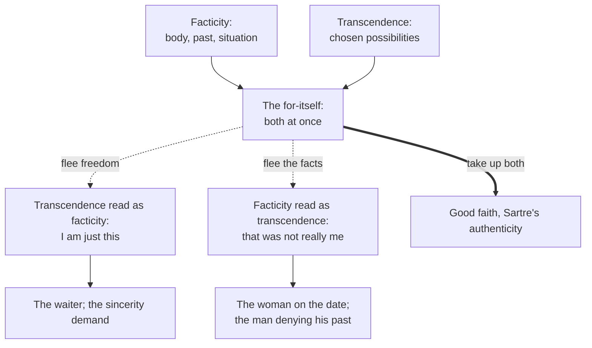

# Phenomenology & Personalism · Lesson 3.1: Sartre: existence precedes essence, and bad faith

> ⏱ ~15 min · Module 3: Freedom and the other: Sartre, Marcel, Levinas · Builds on: [1.3 The natural attitude, the epoché and the reductions](01-03-the-epoche-and-the-reductions.md), [2.3 The they, mood and care](02-03-the-they-mood-and-care.md), [2.4 Being-toward-death, authenticity, and 1933](02-04-being-toward-death-authenticity-and-1933.md) · Unlocks: [3.2 Sartre: the look](03-02-sartre-the-look.md)

## Why this matters

"That's just who I am" is the most common excuse there is, and its mirror image, "that wasn't the real me", is a close second. Jean-Paul Sartre (1905–1980) argued that both are the same move: a lie a person tells himself about his own freedom. *Being and Nothingness* (1943) built that diagnosis, bad faith, out of Husserl's and Heidegger's phenomenology, and a famous public lecture turned it into the slogan of a movement. The slogan is easy to repeat and hard to state correctly.

## The idea

**The slogan.** On 29 October 1945 Sartre lectured in Paris to an overflowing hall; the text appeared in 1946 as *Existentialism Is a Humanism*. His contrast, paraphrased: an artisan makes a paper-knife from a concept, what it is *for*, so for the paper-knife essence comes first and existence second. If God made us, we would be paper-knives too, made to a design. Sartre is an atheist, so on his view there is no designer and no human nature. A human being first turns up in the world and only afterwards defines himself by what he does. So [existence precedes essence](../reference.md#existence-precedes-essence). The thesis covers only human beings; the paper-knife's essence still comes first.

Three moods follow, and they are terms of art ([anguish and abandonment](../reference.md#anguish-and-abandonment)):

- **Anguish** (*angoisse*): in choosing for myself I set up an image of what a person should be, for everyone, and I know nothing outside me guarantees the choice.
- **Abandonment** (*délaissement*): no God and no a priori values, so no excuse behind me and no justification ahead. We are, in his phrase, "condemned to be free".
- **Despair**: I may count only on what depends on my will, and must act without hope that the world will cooperate.

His case: a former student came to him during the Occupation. The young man's brother had been killed in 1940, and he lived alone with his mother, for whom he was the one consolation. He could go to England and join the Free French, or stay and care for her. Christian charity, Kantian respect for persons and "follow your feelings" each pull both ways. Even choosing an adviser was a choice, since he knew roughly what Sartre would say. Sartre's answer, paraphrased: you are free, so choose; that is, invent.

**The ontology.** *Being and Nothingness* gives the theory under the slogan ([in-itself and for-itself](../reference.md#in-itself-and-for-itself)). **Being-in-itself** (*être-en-soi*) is the being of things: full, opaque, simply what it is. An inkwell is an inkwell. **Being-for-itself** (*être-pour-soi*) is consciousness. Following Husserl (1.1), it is always consciousness *of* something, and so never coincides with itself: it is a gap, a "nothingness", always beyond what it is toward what it is not yet. Sartre had already removed the one thing that might fill the gap. *The Transcendence of the Ego* (1936) argued, against Husserl's [transcendental ego](../reference.md#transcendental-ego) (1.3), that no "I" lives inside consciousness. The ego is an object in the world, built up by reflection, like anyone else's.

So every human being is two things at once ([facticity and transcendence](../reference.md#facticity-and-transcendence)). **Facticity** is the given: my body, my past, my place, the facts about me. **Transcendence** is my going beyond the given toward possibilities I choose. Facticity is real, but it never settles what I do next. My past is mine, but I am not it the way the inkwell is its ink.

**Bad faith** ([*mauvaise foi*](../reference.md#bad-faith), Part One ch. 2) is a lie to oneself about this double structure. A lie to someone else needs two minds: one who knows and one deceived. How can one consciousness be both? Sartre rejects Freud's answer, a censor between conscious and unconscious, because the censor must know what it represses, so the problem just moves inside it. His own answer: bad faith is a kind of *faith*. It decides in advance to be satisfied with evidence that would never persuade it, and so believes without quite believing. Its technique is to play facticity and transcendence against each other. Sartre's cases, paraphrased:

- **The woman on a date.** Her companion takes her hand. To leave it would consent; to withdraw it would break the evening's charm. She leaves it there, but as if it were not hers, a thing resting on the table, while she talks about her life as pure mind. She treats her body as mere facticity and herself as pure transcendence, and so avoids deciding.
- **The waiter.** His movements are a little too quick, too precise, too eager. He is *playing at being* a waiter, trying to be a waiter the way the inkwell is an inkwell. He cannot be, since he could walk out tomorrow. He is a waiter only as someone who keeps choosing the role.
- **The champion of sincerity.** A man refuses to admit the plain pattern of his past love affairs with other men: it was never really *him*. His friend demands that he confess and declare himself that kind of man, once and for all. Sartre finds bad faith on both sides. The first denies his facticity. The friend asks him to *be* his past as a thing is what it is. Sincerity, taken as being what one is, is itself bad faith.

## Source

Sartre's slogan descends from a sentence of *Being and Time* §9, where Heidegger introduces Dasein's way of being (2.2):

> The "essence" [*Wesen*] of Dasein lies in its existence [*Existenz*]. The characters that can be exhibited in this entity are therefore not present-at-hand "properties" of an entity present-at-hand that "looks" so and so, but ways for it to be that are possible for it, and only that.

(translation ours, from the 1927 German)

Notice the scare quotes. Heidegger does not say existence comes *before* essence. He says "essence" means something else for Dasein: not a set of properties but possible ways to be. Sartre keeps the denial of a fixed nature and adds an order in time and a chooser, a self that defines itself afterwards. Whether that is a deepening or a reversion to the old essence/existence pair is the dispute of [3.2](03-02-sartre-the-look.md).

## The argument

1. **The for-itself is consciousness of something, and is not identical with any object it is conscious of, including its own past and body.** *In words:* I am never just a thing among things.
2. **So no fact about me (facticity) fixes what I will do; I am always beyond it toward chosen possibilities (transcendence).** *In words:* my past informs my choices but does not make them.
3. **The for-itself is aware of this, pre-reflectively, and that awareness is anguish.** *In words:* I feel that nothing but me decides.
4. **Anguish is unbearable, so consciousness can try to flee it by disguising one side of itself as the other: transcendence as facticity ("I'm just like this") or facticity as transcendence ("that wasn't really me").**
5. **Because one consciousness both lies and is lied to, the flight works only as faith: a resolve to accept unpersuasive evidence.**
6. **Sincerity, as the demand to be what one is, treats the for-itself as an in-itself, and so commits the same error.**
7. **∴ Bad faith is a standing possibility of every consciousness, and the only escape is to take up facticity and transcendence together, as one's own.** Sartre promises such an "authenticity" in a footnote and does not develop it in the book.

**Where the argument is weakest.** Premise 2, the totality of freedom. Maurice Merleau-Ponty, in the closing chapter of *Phenomenology of Perception* (1945), argued that freedom is always situated. Thirty years of habit, a class position or a bodily style are not facts I take up afresh at every instant. They are sedimented into the self, and they make some choices likely and others nearly impossible. A freedom present everywhere would make no difference anywhere. Sartre's reply comes from *Being and Nothingness* Part Four ch. 1. A crag is an obstacle only to someone who has chosen to climb it, and a pleasant view to someone out for a walk. Facticity resists, but what it *means*, whether limit, aid or irrelevance, comes from the project. Sartre's later turn toward "freedom-in-situation" can be read either as a concession or as a refinement the original allowed.

## The picture

Solid arrows build the for-itself from its two sides. Dashed arrows are the two collapses that make bad faith; each lands in a case from the text. The thick arrow is the exit Sartre names but leaves undeveloped.

## Worked examples

**Example 1 (clean: the self-described procrastinator).** Lena, an invented graduate student, misses a third deadline and says, "I'm a procrastinator; it's a personality type, there's nothing to be done." *Facticity*: three missed deadlines, a pattern she cannot undo. *Transcendence*: tonight she can start the chapter or not. Her sentence turns a series of choices into an in-itself property, as the waiter does with his role, so that tomorrow's delay is something that happens to her rather than something she does. That is collapse 1. The honest description keeps both sides: "I have put this off three times; that is my past and I must reckon with it; whether I start tonight is up to me." Lena may be sincere, and the label accurate. The fault is in the use: a fact recruited to excuse a choice.

**Example 2 (hard: "I am an alcoholic").** Sam, invented, is in a recovery program that asks members to say, every meeting, "I am an alcoholic." Applied mechanically, Sartre's account looks damning. This is the champion of sincerity's demand: declare yourself a fixed kind, once and for all. Yet its members do not think they are freezing themselves into things. The defender of Sartre has a reply. The sentence can be held as a *project*: I choose to treat my past as binding on my future, because I know what the other choice leads to. Said that way, it takes up facticity without surrendering transcendence. The trouble is that the same words fit both readings, and Sartre's account gives no outward test for telling them apart. The difference lies wholly in how the for-itself holds its own facts, which only the person can see, and bad faith is the very state in which one sees them least clearly. Here the account describes well and stops deciding.

## Watch out

- **You might think bad faith means lying or hypocrisy, but *mauvaise foi* is a term of art.** It is a lie to oneself about the structure of one's own being, freedom and facts, and it can coexist with complete sincerity. Sartre's sharpest claim is that sincerity, taken as an ideal of being what one is, is itself a form of it. Graded as a misreading: "bad faith = saying what you don't believe."
- **You might think "existence precedes essence" means anything is possible, but facticity is real.** The student cannot be in London and at his mother's side. Sartre denies that facts *decide*, not that they exist. The thesis is also about human beings only, not about paper-knives. And it is not a claim about causal indeterminism in the brain. The libertarian debate of [metaphysics 6.4](../../metaphysics/lessons/06-04-libertarianism-and-its-critics.md) asks a different question.
- **You might think anguish is fear of what will happen, but Sartre separates them (Part One ch. 1).** On a narrow path above a precipice, fear is of falling. Anguish is vertigo before *myself*: nothing stops me from throwing myself over except a choice I must keep making. Compare Heidegger's anxiety and fear ([2.3](02-03-the-they-mood-and-care.md)), where anxiety is in the face of being-in-the-world itself.

## One-liner

> For Sartre a person is a freedom with a past, never a thing with a nature, and bad faith is the art of forgetting one side of that: "I'm just like this" or "that wasn't really me".

## Problems

**P1 (🟢) *(Exegetical.)*** Diagnose. An invented exchange between two students:

> **Maya:** I failed the stats midterm again. I'm just not a math person; my brain is wired that way, so there's no point retaking it.
> **Theo:** Stop hiding. Be honest: you're a quitter. Say it, "I am a quitter," and own it.
> **Maya:** Fine. But I dropped out of choir last month too, and that wasn't me quitting. The real me isn't the person who walked out.

(a) For each of the three speeches, say whether it shows bad faith and, if so, which collapse: transcendence read as facticity, or facticity read as transcendence. One sentence each. (b) Write the description of Maya's situation Sartre would accept as honest, in two sentences, using "facticity" and "transcendence".

**P2 (🟡) *(Exegetical (a) · Evaluative (b).)*** Apply to a hard case. Rosa, invented, is a 52-year-old concert violinist. A neurological hand disorder has ended her performing career. On some days she says, "I was a violinist; now I'm nothing." On others: "Nothing has changed. I'm a performer at heart, and the hand is a detail." (a) Name Rosa's facticity and her transcendence, and classify each of her two statements. Three sentences. (b) A critic in Merleau-Ponty's spirit says: "Thirty years of daily practice are not a fact Rosa takes up from outside. They are what she is, and Sartre's account has no room for that." Does Sartre's reply from the crag answer this, in Rosa's case? Any verdict; 120 words or fewer.

**P3 (🔴) *(Exegetical (a) · Evaluative (b).)*** Find the crux. Heidegger and Sartre agree that a human being has no present-at-hand essence (*Being and Time* §9; *Existentialism Is a Humanism*). (a) Name the premise about where my possibilities come from on which Heidegger's authenticity ([2.4](02-04-being-toward-death-authenticity-and-1933.md)) and Sartre's freedom part ways, and say how the difference shows in their treatment of everyday conformity: *das Man* for Heidegger, bad faith for Sartre. 100 words or fewer. (b) Jonah, invented, is a third-generation farmer. After a cancer scare he turns down a city job and keeps the family farm. Say what each thinker would need to know before calling the choice authentic, and whether the case favours either account. Any verdict; 100 words or fewer.

Solutions

**P1** *(Exegetical, strict.)*

**Must hit, strict (a):**

- Maya's first speech: bad faith, transcendence read as facticity. A record of choices becomes a fixed in-itself trait ("wired") that excuses the next choice, retaking the exam.
- Theo's speech: the champion of sincerity. It demands that Maya *be* a quitter as a thing is what it is, which treats the for-itself as an in-itself. On Sartre's account the sincerity demand is itself bad faith (collapse 1 again, now urged by another person).
- Maya's third speech: bad faith, facticity read as transcendence. She disowns a fact of her past (walking out) by claiming her "real" self floats free of what she did.

**Must hit, strict (b):**

- Facticity named and owned: two failed exams and a walkout are facts she cannot undo and must take up as hers.
- Transcendence named and kept open: whether she retakes the exam or rejoins anything is her choice now, and "not a math person" would be choosing not to while pretending not to choose.

**Wrong turns:** calling Theo's speech the honest one because it is blunt; Sartre's point is that sincerity as being-what-you-are is a form of bad faith. Calling Maya's first speech a *lie*: she may believe it, and that is the problem.

**Model answer (b):** Maya has failed the midterm twice and walked out of choir; that is her facticity, and it is hers whether she likes it or not. Her transcendence is that none of it settles what she does next, so retaking the exam or not is a choice, not a fact about her wiring.

---

**P2** *(Exegetical (a) · Evaluative (b).)*

**Must hit, strict (a):**

- Facticity: the disorder, the ended career, thirty years of training, her age. Transcendence: her going beyond these toward possibilities she can still choose (teaching, composing, another life altogether).
- "Now I'm nothing": transcendence read as facticity. She treats her being as used up by a past identity, as if she were a finished thing.
- "The hand is a detail": facticity read as transcendence. She denies a fact that really does close one path.

**Must hit, any verdict (b):**

- State Sartre's reply: facticity resists, but its *meaning* (limit, aid, irrelevance) is given by the project; the disorder is an obstacle only relative to the project of performing.
- Test it on the critic's real claim, which is about *habit*: the trained hand and ear are not an obstacle or tool to be valued but part of the one who values. Say whether the crag reply reaches that.
- Say what is at stake: whether a self can be partly made of its past without that past fixing its choices.

**Wrong turns:** treating the objection as "Sartre ignores facts". He does not; the crag reply grants facticity. Treating (b) as a question about whether Rosa should keep playing.

**Model answer (b), one of several:** Only in part. The crag reply explains why the disorder *matters*: it blocks performing only because performing was her project, and it would be irrelevant to a project of teaching. But the critic's point is about the thirty years, not the disorder. Her trained musicality is not a rock she meets in the world and gives a meaning to. It is part of the one who gives meanings: it shapes which projects even occur to her and how they feel. Sartre can say she must still choose what to do with it. The critic replies that choice itself is made by that sedimented self. The crag answers the question of obstacles. It does not answer the question of habit, which is the one Merleau-Ponty pressed.

---

**P3** *(Exegetical (a) · Evaluative (b).)*

**Accept:** any premise that locates the split in whether possibilities and their meaning are given to the self before it chooses, or constituted by its choosing.

**Must hit, strict (a):**

- Heidegger: Dasein is thrown projection. It projects itself only upon possibilities it is already thrown into, handed to it by its world and by *das Man*. Authenticity is a modification of the they-self, owning inherited possibilities, not creating new ones from nothing.
- Sartre: the for-itself is a nothingness. No values or possibilities precede the choice that institutes them ("choose; that is, invent").
- How it shows: *das Man* is everyday Dasein's default way of being, and Heidegger says inauthenticity is not a lesser being and not a moral verdict. Bad faith is a project consciousness chooses in order to flee its own freedom, so it is always its own doing.

**Must hit, any verdict (b):**

- Heidegger: did Jonah take over a possibility his heritage hands him, in the light of his own death, or simply keep the farm because one does?
- Sartre: does Jonah hold "the family farm" as a free project, or as a fate ("our family farms") that excuses him from choosing?
- Say whether the case favours either account. The outward act is the same on both, so the difference lies in how he holds it.

**Wrong turns:** saying Sartre must call keeping the farm bad faith because it is inherited. Inheritance is facticity, and taking it up is allowed. Crediting Sartre with Heidegger's claim that death individualizes. In *Being and Nothingness* Part Four ch. 1 he denies that death is my ownmost possibility. For him it is the external end of all my possibilities.

**Model answer (b), one of several:** Both accounts turn on how Jonah holds the choice, not on the choice. Heidegger asks whether the cancer scare tore him out of the they's "one keeps the land", so that he now takes over an inherited possibility as his own. Sartre asks whether he chose the farm, or hid behind "our family has always farmed here". The case favours Heidegger slightly. The possibility was given before Jonah chose, as thrownness predicts, and Sartre's "invent" fits a farm that already existed awkwardly. A Sartrean replies that the farm's *meaning* for Jonah is still his invention.

## Flashback

**From Lesson [2.3](02-03-the-they-mood-and-care.md) (The they, mood and care):** *(Exegetical.)* Diagnose. An invented study-group note on *Being and Time*:

> (1) For Heidegger a mood is an inner feeling that tints a neutral world, so a careful scientist should switch moods off. (2) Thrownness means our lives were planned for us by parents and society, which is why we are not to blame for them. (3) Care is Heidegger's ethics: we are basically beings who worry and look after others, which is why he ranks practical life above theory. (4) Care has three parts, so a calm theorist with no practical concerns would be a Dasein missing one of them.

Name the error in each numbered claim and correct it from §29, §31 or §41. One sentence each.

Solution

**Must hit, strict:**

- **(1) Attunement (*Befindlichkeit*, §29) is not an inner state colouring neutral data.** A mood comes neither from outside nor from inside but rises out of being-in-the-world, and it discloses; Dasein always finds itself in some mood, so the scientist's calm is one way of finding oneself, not its absence.
- **(2) Thrownness is not a plan made by others.** It is the bare "that it is": that I am and have to be, while my whence and whither stay dark. It is no excuse either, since it is always paired with projection (§31): Dasein understands itself from possibilities it presses into.
- **(3) Care (*Sorge*, §41) is ontological, not worry or kindness.** §41 excludes worry and carefreeness from its meaning and denies that care ranks practice above theory; solicitude for others (*Fürsorge*) is one form of care, concern for things (*Besorgen*) another.
- **(4) Existence, facticity and fallenness are not pieces of a composite, one of which could be missing.** They belong together originally, and detached contemplation of the present-at-hand is itself a mode of care.

**Wrong turns:** correcting (3) by making care "caring about one's own existence", which keeps the everyday sense and moves it to the self. Correcting (1) by saying moods are reliable reports about objects: what a mood discloses is being-in-the-world, not facts about entities.

**Model answer:** (1) A mood is not an inner tint on a neutral world: it rises out of being-in-the-world and discloses it, and since Dasein is always in some mood, scientific calm is a mood too. (2) Thrownness is the bare fact that I am and have to be, origin and destination dark, and it never comes without projection into possibilities, so it is neither someone's plan nor an alibi. (3) Care is the being of Dasein; §41 strips it of worry and denies it puts practice above theory, with solicitude and concern as its forms. (4) Its three moments belong together originally, and the theorist's detachment is a mode of care, not a gap in it.

## Connections

- **Backward:** the for-itself is intentional consciousness from [1.1](01-01-intentionality-from-brentano-to-husserl.md), stripped of Husserl's transcendental ego ([1.3](01-03-the-epoche-and-the-reductions.md)). Anguish takes up Kierkegaard's anxiety as the dizziness of freedom ([2.1](02-01-kierkegaard-the-single-individual.md)) and Heidegger's anxiety before being-in-the-world ([2.3](02-03-the-they-mood-and-care.md)). The slogan rewrites *Being and Time* §9 ([2.2](02-02-heidegger-dasein-and-being-in-the-world.md)). Bad faith is Sartre's answer to *das Man* and to the [authenticity](../reference.md#authenticity) of [2.4](02-04-being-toward-death-authenticity-and-1933.md).
- **Forward:** [3.2](03-02-sartre-the-look.md) adds the third dimension of my being: being-for-others, the self I am under another's gaze. Heidegger's rejection of the slogan comes there too. Marcel ([3.3](03-03-marcel-mystery-presence-and-fidelity.md)) answers Sartre's lone chooser with fidelity and presence. Wojtyła's claim that a person is revealed in action ([5.4](05-04-action-reveals-the-person.md)) is a non-Sartrean account of self-determination: the self determines itself in acting, but within a nature.
- **Sideways:** Sartre's atheist premise against the artisan model of human nature is the opposite of the natural-law view in [ethics 4.4](../../ethics/lessons/04-04-natural-law-aquinas.md). "Existential Thomism" is a different thing, which is why [thomistic-synthesis 6.3](../../thomistic-synthesis/lessons/06-03-strict-observance-and-existential-thomism.md) warns against confusing the two. The causal question of free will is [metaphysics 6.4](../../metaphysics/lessons/06-04-libertarianism-and-its-critics.md); Sartre's freedom is a description of consciousness, not a claim about indeterminism.
