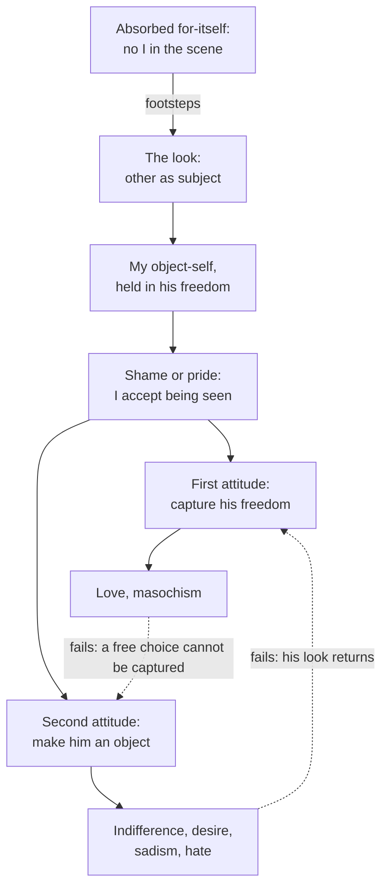

# Phenomenology & Personalism · Lesson 3.2: Sartre: the look

> ⏱ ~15 min · Module 3: Freedom and the other: Sartre, Marcel, Levinas · Builds on: [3.1 Sartre: existence precedes essence, and bad faith](03-01-sartre-existence-precedes-essence-and-bad-faith.md), [2.3 The they, mood and care](02-03-the-they-mood-and-care.md) · Unlocks: [3.3 Marcel: mystery, presence and fidelity](03-03-marcel-mystery-presence-and-fidelity.md), [3.4 Levinas: the face of the other](03-04-levinas-the-face-of-the-other.md)

## Why this matters

Descartes looked down from his window and asked what he really saw of the people in the street: hats and cloaks that might hide machines. He *judged* there were people under them ([modern-philosophy 1.2](../../modern-philosophy/lessons/01-02-the-cogito-and-the-wax.md)). That made other minds an inference, and inferences can fail. Sartre's *Being and Nothingness* (1943), Part Three ("Being-for-Others"), turns the scene around. The other person is not first someone I see and infer. He is someone who sees *me*, and I find this out not by reasoning but by blushing. The same analysis yields Sartre's darkest thesis, that relations between people are at bottom conflict and that love fails by its own structure. His play *No Exit* (*Huis clos*, 1944) compresses it into a famous line, "Hell is other people."

## The idea

**The keyhole** (Part Three, ch. 1, section "The Look"; paraphrased throughout, since Sartre is copyrighted). Moved by jealousy, a man crouches at a door and peers through the keyhole. While he looks, he is wholly absorbed: there is the scene inside, the door, the risk, and no "I" anywhere in the picture. His consciousness is pre-reflective. It is aware of the room, not of itself as an object, and that is the ego-less consciousness of *The Transcendence of the Ego* ([3.1](03-01-sartre-existence-precedes-essence-and-bad-faith.md)). Then footsteps sound in the hall. Someone is looking at him. All at once he *is* something: a man bent at a keyhole, a voyeur. He did not reflect his way to this self. It arrived in **shame**.

Sartre reads three things off the shame.

1. **I am this object.** Shame is not a judgment about some third party. It concerns me. The voyeur the other sees is really me.
2. **I cannot see this object.** My being-a-voyeur exists out there, in the other's freedom, and I cannot inspect it as he does. Sartre calls this dimension of my being [being-for-others](../reference.md#being-for-others) (*être-pour-autrui*). It is a third region beside the [in-itself and the for-itself](../reference.md#in-itself-and-for-itself), and it gives me an outside.
3. **The other is a subject.** Only a subject can make me an object. So in shame the other is given as subject, and he is given *without* being perceived. Sartre's term is [the look](../reference.md#the-look) (*le regard*). It need not involve eyes: a rustle of branches, a step followed by silence or a moving curtain can carry it. When I am really looked at, the other's eyes fade as things to be seen. Being seen, I cannot at the same time look at the eyes that see me.

**The park** (same section) shows the other person as *object*. I am alone in a public park, and the lawn, the benches and the path are arranged around me. A man walks past. I see him as a man, not a statue, and the scene shifts. The grass now also lies at a distance *from him*, and an orientation that escapes me cuts across my world. Sartre's images are of the world flowing away from me toward him. Yet as long as I am only looking at him, he remains an object, and it is only *probable* that he even sees the lawn. The certainty comes only when the look turns on me.

So Sartre gives no proof that other minds exist. He thinks every proof, whether by analogy or by Husserl's constitution, wrecks on solipsism. What shame shows is a fact: my being is also a being-for-others. It is a factual necessity, as certain as the cogito and as contingent. What if the footsteps were a false alarm and the hall is empty? Then, Sartre says, I was wrong that someone is *there*. The other-as-object was only ever probable. I was not wrong that I am a being who can be seen. Critics, notably Dan Zahavi, reply that this saves certainty only by making the looker an anonymous "someone". That edges toward the *a priori* being-with Sartre had faulted in Heidegger.

**Against Heidegger.** In [2.3](02-03-the-they-mood-and-care.md), *Mitsein* (being-with) was a structure of Dasein. In *Being and Time* §26, even being alone is a deficient mode of being-with. Sartre credits Heidegger with treating the other as a matter of being, not knowledge. He objects that Heidegger's picture fits a rowing crew: members side by side, held together by the stroke and a shared goal, never face to face (Part Three, ch. 1, "Husserl, Hegel, Heidegger"). For Sartre, being-for-others comes first and grounds being-with. A felt "we" is a derived experience, and it often arises when a third person looks at us together (ch. 3).

## Source

Heidegger is not as irenic as Sartre's crew suggests. *Sein und Zeit* §27, opening (translation ours, from the 1927 German; local text a later Niemeyer printing):

> In taking care of what one has taken up with, for and against the others, there constantly lies a care about a difference from the others [*Unterschied gegen die Anderen*]: be it only to even the difference out, be it that one's own Dasein, lagging behind the others, wants to catch up with them, be it that Dasein, holding priority over the others, is out to keep them down. Being-with-one-another is disquieted, hidden from itself, by care about this distance [*Abstand*]. Existentially expressed, it has the character of distantiality [*Abständigkeit*]. The less conspicuous this way of being is to everyday Dasein, the more stubbornly and originally it works. But in this distantiality, which belongs to being-with [*zum Mitsein gehörige*], lies this: Dasein, as everyday being-with-one-another, stands in subjection [*Botmäßigkeit*] to the others.

Notice three things. Rivalry is here: catching up, keeping down. The rivalry is *about* standing in shared business, not about being made an object. And it "belongs to being-with", so it presupposes the very structure Sartre says is derived. The passage then leads straight into [das Man](../reference.md#das-man).

## The argument

Conflict as the original meaning of being-for-others (Part Three, ch. 3, "Concrete Relations with Others").

1. **I am a for-itself: a freedom that never coincides with itself and is not, pre-reflectively, an object to itself** ([3.1](03-01-sartre-existence-precedes-essence-and-bad-faith.md)). *In words:* from the inside I have no fixed nature to inspect.
2. **Under the look I acquire an object-self that is really mine, whose meaning another freedom fixes.** *In words:* the other holds the secret of what I am, the voyeur, the coward, the charming one.
3. **I can neither know nor control that object-self, because it lives in his freedom.** *In words:* I depend on him for a being I cannot reach.
4. **I can grasp the other as subject (by being looked at) or as object (by looking at him), never both at once.** *In words:* looks do not meet; one of us is always the seen.
5. **So my projects toward the other take two forms. I can try to recover my being by assimilating his freedom while it stays free (love; masochism, which makes myself his object). Or I can turn him into an object (indifference, desire, sadism, hate).** *In words:* capture his freedom, or kill it off.
6. **The first is self-contradictory: I want his freedom to choose me as no free choice could, once and for all. The second destroys the very freedom that holds my being.** *In words:* each attitude fails, and failure throws me into the other.

**∴ Conflict is the original meaning of being-for-others, and love fails by its structure, not by bad luck.**

**Where the argument is weakest.** Premise 4. Simone de Beauvoir's *The Ethics of Ambiguity* (1947) argues that to will oneself free is to will others free, since my projects need a world of free others to take them up. On that view freedoms can recognize each other, and she later called authentic love the mutual recognition of two freedoms (*The Second Sex*, 1949). If two subjects can meet *as* subjects, step 5's dilemma is false. The defender replies that Part Three describes how relations go before any change of fundamental project. Sartre's own footnote to the chapter allows an ethics of deliverance and salvation, but only after a "radical conversion" he does not describe there. The ontology fixes where we start, not where we must stay. The critic answers that a premise stated as ontology cannot be relaxed by an ethics, and so the dispute runs on.

## Picture

Dashed edges: each attitude's failure throws me into the other (Part Three, ch. 3).

## Worked examples

**Example 1 (clean).** Priya rehearses a wedding toast aloud in an empty lecture hall, waving her arms. A cleaner opens the back door and pauses. *Before:* pre-reflective absorption in the speech, with no Priya-as-object anywhere. *The look:* the creak of the door is enough, before she has even seen his face. *Being-for-others:* she now *is* "the woman gesturing at empty seats", a self she cannot view as he does and cannot correct. *Shame* is her recognition that this object is really her. She might also stand taller and own it, which is *pride*: the same acceptance of being an object, with the opposite valuation. *Other-as-object:* once she turns and sizes him up ("just a cleaner"), she has looked back and made him an object. In Sartre's terms that defends against the look; it does not answer it.

**Example 2 (hard: love).** Tom insists he wants Mara to love him, but not out of a vow, which would be duty, and not because she cannot help it, which would be compulsion. He wants her to choose him freely. He also wants a guarantee that she never stops. Sartre's account of love's project describes him exactly. The lover wants to be the limit and whole world of the beloved's freedom, chosen by a freedom that is somehow not free to unchoose. So the demand contradicts itself, and every reassurance Mara gives confirms that she could withhold it. The account strains on the question of scope. Does it describe love, or possessive and jealous love? Beauvoir's authentic love, and Marcel's fidelity in [3.3](03-03-marcel-mystery-presence-and-fidelity.md), describe a love that does not ask to own the other's freedom. Sartre can reply that Tom's demand is the original project and those are conversions of it. The case cannot settle which is basic.

## Watch out

- **You might think "the look" is seeing someone's eyes, but *le regard* is my being-seen, which I live through and do not perceive.** Eyes are one occasion of the look among others, and when the look is real they recede. Reading "look" in its everyday sense, as an object I observe, turns the other back into an object, which is the move Sartre's analysis rules out.
- **You might think the keyhole shame is moral guilt, but it is pre-moral.** It is shame at being an object at all, and it would arise even if peeping were innocent. Pride has the same structure. The moral shame of the voyeur is a later layer.
- **You might think Heidegger welcomed Sartre as his French heir, but the "Letter on 'Humanism'" (written December 1946 to Jean Beaufret, published 1947) rejects the reading.** Heidegger argues that Sartre's "existence precedes essence" ([3.1](03-01-sartre-existence-precedes-essence-and-bad-faith.md); [existence precedes essence](../reference.md#existence-precedes-essence)) only reverses metaphysics' order of essence and existence. A reversed metaphysical statement is still a metaphysical one, so Sartre stays inside metaphysics and its forgetting of the truth of Being.

## One-liner

> The other is not inferred behind hats and cloaks but felt in my blush: his look gives me an outside I am but cannot see, and since looks never meet, love and hate are rival strategies for recovering it.

## Problems

**P1 (🟢) *(Exegetical (a) · Evaluative (b).)*** Apply to a hard case. A cellist is playing a recital, lost in the slow movement. Glancing up, she notices a well-known critic in the third row, an invented figure, slumped and apparently asleep. A minute later she sees he is watching her intently, and her playing tightens. That night, practising a passage badly at home alone, she hears a floorboard creak behind her and freezes. It is the house settling. (a) Describe the three moments (the critic asleep, the critic watching, the floorboard) in Sartre's terms. (b) Her teacher says: "Stop playing *for* him; play for the music." In Sartre's terms, can she? 80 words or fewer.

**P2 (🟡) *(Exegetical (a) · Exegetical (b).)*** Close reading, then find the crux. Re-read the Source (*Sein und Zeit* §27, our translation). (a) A reader says: "This passage proves Sartre wrong about Heidegger: Heidegger already has conflict." Say what the passage does show and what it does not, naming the words that decide. Three sentences. (b) Name the single premise about being-with and being-for-others on which Sartre and Heidegger part ways. Say which one denies it, and what kind of experience would count for each side. 100 words or fewer.

**P3 (🔴) *(Evaluative.)*** Steelman and reply. An objector: "Shame shows that I *believe* someone is watching, nothing more. The false alarm proves it: the shame was identical when the hall was empty." Give the objection at its strongest, Sartre's reply, and your assessment of whether the reply defeats it. 150 words or fewer.

Solutions

**P1** *(Exegetical (a) · Evaluative (b))*

**Must hit, strict (a):**

- **Asleep critic:** other-as-object. He is a thing in her perceptual field. His presence may already pull her world toward him, as in the park, but he is not given as a subject, and it is only probable that he hears anything.
- **Watching critic:** the look. She is given an object-self ("the player being judged") that is really hers, held in his freedom, and invisible to her as he sees it. This is being-for-others. The tightening is her pre-reflective absorption broken; the music is no longer the whole scene.
- **Floorboard:** a look carried without eyes or a seen person. When it proves a false alarm, what was mistaken is that someone was *there*, the other-as-object. On Sartre's reading, her being-for-others, the permanent possibility of being seen, is not refuted.

**Must hit, any verdict (b):**

- Say what "playing for him" is in Sartre's terms: a project aimed at her object-self, trying to shape what she is for the critic.
- Take a position on whether recovering absorption is possible. Absorption can return, since the look is not permanent. But being-for-others cannot be abolished, and deciding *not* to care is itself a stance toward the look (indifference, the second attitude).

**Wrong turns:** treating the asleep critic as already "the look" because he is a person. The look requires being seen. Calling the floorboard episode proof that no other exists. Sartre denies only the other's being there.

**Model answer (b), one of several:** In part. Absorption can come back, because the look lapses when attention returns to the music. But she cannot become someone with no outside. Resolving to ignore the critic is still a project toward him, Sartre's indifference, a chosen blindness that is never complete. "Play for the music" works only as a redirection of attention. As a cure for being-for-others it fails.

---

**P2** *(Exegetical (a) · Exegetical (b))*

**Must hit, strict (a):**

- It shows rivalry inside everyday being-with: "against the others", "catch up", "keep them down", "disquieted", *Abständigkeit*.
- It does not show Sartre's conflict. The concern is about relative standing in shared business ("what one has taken up"), not about being made an object by another's look. The others are anonymous, leading to *das Man*, not this other who sees me.
- Decisively, the distantiality "belongs to being-with": rivalry is a mode *founded on* Mitsein. That is the order Sartre reverses.

**Must hit, strict (b):**

- **The premise:** being-with is an *a priori*, prior structure of my being, with rivalry and even solitude as its modes. Heidegger affirms this (§26: being alone is a deficient mode of being-with). Sartre denies it: being-for-others, the concrete encounter with an objectifying subject, comes first and founds being-with, and the "we" is derived.
- **What would count:** for Heidegger, a "we" experience that no third party's look explains, such as absorbed joint work. For Sartre, evidence that such "we" experiences are psychological and derived, often produced by a third who looks at us together.

**Wrong turns:** answering (a) "yes, so Sartre misread Heidegger" or "no, Heidegger has no conflict". Both ignore "belongs to being-with". Making the crux "Sartre is pessimistic, Heidegger optimistic". That is a mood, not a premise, and the Source refutes the optimism half.

**Model answer (b):** They part over priority. Heidegger holds that being-with is an existential structure Dasein has even alone, so rivalry and distance are modes of it, and the Source says distantiality "belongs to being-with". Sartre denies this: the original relation is being-for-others, my objectification under a concrete other's look, and the "we" is founded on it. A Heideggerian would point to absorbed joint activity, like the crew, as an irreducible "we". A Sartrean would show that such experiences arise only under a third's look and are psychological, not ontological.

---

**P3** *(Evaluative)*

**Accept:** any verdict that states the objection at full strength and engages the object/subject distinction.

**Must hit, any verdict:**

- **Steelman:** the shame is phenomenally the same with or without a watcher, so it cannot by itself establish that any other subject exists. It establishes a belief, and beliefs can be false. That is the solipsist's opening.
- **Sartre's reply:** distinguish the other-as-object (someone *there*, always only probable) from the other-as-subject (my being-for-others). The false alarm refutes only the first. Shame is not offered as evidence for an inference. It reveals, like the cogito, a fact about my being: I am a being with an outside.
- **Assessment:** does the reply secure *others*, or only a structure of *me*? Name the cost. If the certain other is a pre-numerical "someone", the reply may concede that no particular other is certain (Zahavi's worry), and the solipsist may accept that. Or argue that a self structurally exposed to being seen cannot be made intelligible without real others, so the structure already testifies to them.

**Wrong turns:** treating Sartre as offering an argument from analogy or a proof. He rejects both. Claiming the false alarm refutes Sartre outright. He anticipated it.

**Model answer, one of several:** At strength, the objection says shame is a state of me, identical whether or not anyone watches, so it can testify only to my belief in a watcher. Sartre replies that the false alarm cancels the other-as-object: I was wrong that someone stood in the hall. It does not cancel my being-for-others, a dimension of my being disclosed as indubitably as the cogito discloses my existence. But the reply buys certainty by lowering its object. What is certain is that I am *seeable*, not that this or any other subject exists. That is close to what the objector granted. The reply works only if being seeable makes no sense without real others, and Sartre asserts this as a factual necessity rather than argues it. I judge the reply a reframing, not a defeat of the objection.

## Flashback

**From Lesson [2.4](02-04-being-toward-death-authenticity-and-1933.md) (Being-toward-death, authenticity, and 1933):** *(Exegetical (a) · Evaluative (b).)* Apply to a new case. On a glacier a snow bridge gives way under a client. Her guide, an invented figure called Teo, shoves her onto firm ice and falls into the crevasse himself; he dies, she lives. At the memorial she says: "He took my death from me. I should have died that day, and he died it instead." (a) What does *Being and Time* §47 say Teo did, and what does it say he did not do? Two sentences. (b) Does the case tell against Heidegger's claim that death is *non-relational*? Any verdict; 80 words or fewer.

Solution

**Must hit, strict (a):**

- Teo died *for* her: §47 grants that one can go to one's death for another, sacrificing oneself "in a definite matter", here this fall on this day.
- He did not take her dying away from her (*abnehmen*). Her death, as her ownmost, certain, indefinite possibility, is still hers and still ahead of her; what he removed was one occasion of her demise (*Ableben*).

**Must hit, any verdict (b):**

- State "non-relational" (*unbezüglich*) exactly: no relation to others or to things can carry this possibility for me. It does not mean that a death has nothing to do with others; 2.4's Source keeps being-with inside authentic being-a-self.
- Say what the rescue does relate: the date and occasion of her demise, and the meaning of his death, which was lived toward her.
- Decide whether that touches the claim. The defender: substitution works only within a definite matter, and her death as possibility was never transferred. The critic: if a death can be given, and given its meaning, for another, then its sense is relational after all. Sartre's version is that death hands a life's meaning to others.

**Wrong turns:** reading "non-relational" as "solitary" or "indifferent to others". Treating death as the event of demise, so that postponing her demise looks like taking her death. Treating her grief over his dying as access to death itself, which §47 rules out.

**Model answer:** (a) Teo died for her, sacrificing himself in a definite matter, this fall on this glacier. He did not and could not take her dying from her: her death is still her own possibility, only one occasion of her demise is gone. (b), one of several: Not as stated. Non-relationality says that no one can carry my death for me, and the case confirms it, since she will still die her own death. But the case does show that the *meaning* of a death can be relational: Teo's death was for her, and its sense now lives in her. Heidegger can grant that without conceding the claim; Sartre would say it shows what death really is.

## Connections

- **Backward:** the for-itself, facticity and [bad faith](../reference.md#bad-faith) are [3.1](03-01-sartre-existence-precedes-essence-and-bad-faith.md). Indifference to the look is a bad-faith flight from it. *Mitsein* and *das Man* are [2.3](02-03-the-they-mood-and-care.md), and Sartre's quarrel with them runs through the Source. The window scene and inferred minds are Descartes's ([modern-philosophy 1.2](../../modern-philosophy/lessons/01-02-the-cogito-and-the-wax.md)), and the master–bondsman struggle for recognition that Sartre reworks is Hegel's ([modern-philosophy 6.4](../../modern-philosophy/lessons/06-04-hegel-dialectic-and-spirit.md)).
- **Forward:** [3.3](03-03-marcel-mystery-presence-and-fidelity.md) answers the look with presence and availability, and [3.4](03-04-levinas-the-face-of-the-other.md) with a face that commands instead of objectifying. Stein's empathy ([4.3](04-03-stein-empathy.md)) is a third route past the [argument from analogy](../reference.md#argument-from-analogy) Sartre rejects. Wojtyła's ban on treating a person as an object of use ([5.2](05-02-the-personalistic-norm.md)) is a normative answer to the objectification Sartre describes.
- **Sideways:** "being used" here is ontological, not moral. Kant's ban on treating humanity merely as a means is [ethics 2.3](../../ethics/lessons/02-03-humanity-autonomy-and-the-lie.md). Other minds as an analytic problem belongs to [`philosophy-of-mind`](../../philosophy-of-mind/syllabus.md).
