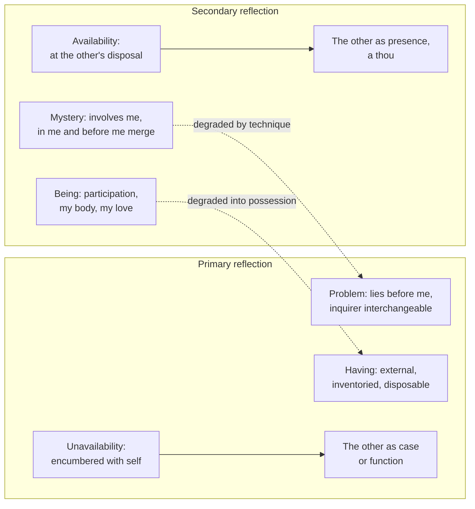

# Phenomenology & Personalism · Lesson 3.3: Marcel: mystery, presence and fidelity

> ⏱ ~15 min · Module 3: Freedom and the other: Sartre, Marcel, Levinas · Builds on: [3.1 Sartre: existence precedes essence, and bad faith](03-01-sartre-existence-precedes-essence-and-bad-faith.md), [3.2 Sartre: the look](03-02-sartre-the-look.md) · Unlocks: [3.4 Levinas: the face of the other](03-04-levinas-the-face-of-the-other.md)

## Why this matters

Sartre's look ([3.2](03-02-sartre-the-look.md)) makes the other person a threat: her gaze turns me into an object, and relations between us are a contest over who objectifies whom. Gabriel Marcel had been describing the same encounter since the First World War and reached the opposite result. The first relation to another person is not the look but **presence**, and what blocks it is not her freedom but my own unavailability. His vocabulary (problem and mystery, being and having, availability, fidelity) became the working language of much later personalism, and it names something every patient who has been "treated as a case" already knows.

## The idea

**Who.** Gabriel Marcel (1889–1973) was a French playwright and philosopher who never wrote a system. His *Metaphysical Journal* (1927) is a dated notebook of inquiries. He entered the Catholic Church in 1929, after the novelist François Mauriac wrote to ask whether he should. Sartre's lecture "Existentialism Is a Humanism" ([3.1](03-01-sartre-existence-precedes-essence-and-bad-faith.md)) filed him as a Christian existentialist. Marcel accepted the label for a while, then rejected it, and later preferred to call his work "neo-Socratic".

**The broken world.** In "On the Ontological Mystery" (published in 1933 with his play *Le Monde cassé*, "The Broken World"), Marcel starts from a diagnosis: modern life confuses a person with her functions. His example, paraphrased: a clerk in a metro booth whom commuters treat as a token dispenser, whose life is organized as a timetable of functions, and who may come to see herself the same way. What withers is the *exigence ontologique*, the need to *be* and not merely to work. This is the [broken world](../reference.md#broken-world).

**Problem and mystery.** A *problème* is something I run into that lies wholly before me. I stand back, lay out the data, apply a technique, and anyone competent could take my place: the inquirer is interchangeable. A *mystère* is a question in which I myself am involved, so that the line between what is *in me* and what is *before me* stops holding. Marcel's examples include the union of body and soul, evil, love and freedom. He calls a mystery a problem that "encroaches upon its own data". This is the [problem and mystery](../reference.md#problem-and-mystery) distinction.

A mystery is not a gap in knowledge. The unknown is a problem not yet solved; a mystery is a region where the problem posture is the wrong posture. And a mystery can be **degraded**: handled by technique, it turns into a problem, and you get an answer to a different question.

Two kinds of reflection go with this ([primary and secondary reflection](../reference.md#primary-and-secondary-reflection)). *Primary reflection* analyses: it breaks experience into objects and functions. *Secondary reflection* reflects on that analysis and recovers the unity it broke. Its work is recuperative, not a rejection of analysis.

**Being and having.** *Être et avoir* (*Being and Having*, 1935) runs a parallel distinction ([being and having](../reference.md#being-and-having)). What I *have* is external to me: it can be inventoried, disposed of, lost. But having works back on the haver. Possessions possess, and an opinion held as a possession gets defended like property. My body is the borderline case. Primary reflection treats it as an instrument I have, yet a body I merely had would be *a* body, not *my* body. Incarnation is neither ownership nor identity with an object.

**Availability and presence.** *Disponibilité*, [availability](../reference.md#availability), is being at the other's disposal: open, able to make room for her and be affected by her. Its opposite, *indisponibilité*, is being encumbered with myself: pride, anxiety over what I have, my own agenda. Someone can listen attentively and still be unavailable. She takes my words as data for her purposes, and I feel myself handled as an object. Someone else can say almost nothing and be wholly *present*. *Présence* is not physical nearness. It is the other given as a *thou*, not as a case or as my idea of her. It cannot be extracted or demanded, only given and received.

**Creative fidelity and hope.** A vow raises a puzzle: how can I commit feelings I do not yet have? If the vow binds only my behaviour, keeping it against the grain is mere *constancy*, which Marcel thinks can become a lie to myself and the other. Fidelity is to the person, not to my state on the day I vowed, and it is *créatrice*: kept by renewed availability, it makes something that did not exist at the vow ([creative fidelity](../reference.md#creative-fidelity)). *Du refus à l'invocation* (1940; in English *Creative Fidelity*) works this out. Hope, in *Homo Viator* (1945), is likewise not optimism that some outcome will come. It is a refusal of despair that Marcel thinks is always constituted through and for a "we".

Marcel held that unconditional fidelity and hope point toward an absolute Thou, God. But he offers the descriptions as phenomenology anyone can check, and he distrusted formal proofs of God as the work of primary reflection. Martin Buber's *I and Thou* (1923) drew a similar line between an I–It and an I–Thou relation; Marcel stands nearer Buber than Sartre.

## The argument

Reconstructed from "On the Ontological Mystery" and *Being and Having* (paraphrase):

1. **A problem is a question whose data lie wholly before the inquirer, so any competent inquirer could take it up with the same technique.** *In words:* in a problem, who asks does not matter.
2. **Some questions involve the questioner, so that what is in me and what is before me cannot be separated: my body, my love, evil that strikes me.** *In words:* in these, who asks is part of what is asked.
3. **To treat such a question by technique is to change it into another question.** *In words:* degrade a mystery and you answer something else.
4. **Another person, as I actually meet her, is such a reality: what she is to me depends partly on how I stand toward her, available or not.**
5. **An object is what can stand wholly before me; what cannot is given, if at all, as a presence, a thou.**
6. **∴ The other is fully given only as presence, to a self that is available. Handling her as a case or a function is not a neutral description but a degradation.**
7. **A commitment to a presence cannot be a commitment to my own present feelings, which I cannot guarantee, or to bare behaviour, which is constancy.**
8. **∴ Fidelity is creative: kept by renewing availability to the person, not by repeating a past state.**

**Where the argument is weakest.** Premises 4–5. The Sartrean critic ([3.2](03-02-sartre-the-look.md); *Being and Nothingness* Part Three) denies there is any third mode between objectifying and being objectified. When I take the other as subject, I do so by feeling myself her object. Marcel's "communion" is the project of love, and that project fails, because each wants to be the other's whole world. On this view presence is a hope, not a datum. The defender replies that Sartre's descriptions are taken from shame and suspicion, and that these are cases of unavailability. Shame at being seen presupposes that I was already exposed to the other, before any contest. A second charge, from critics who read Marcel as mysticism rather than philosophy, is that "mystery" shields claims from argument. The defender answers that premise 1 gives a test, the interchangeability of the inquirer, and that secondary reflection argues; it just does not compute.

## The picture

Two parallel distinctions, with availability and presence as the personal case. Each dashed edge is a degradation: the left column is the right column flattened by primary reflection. Secondary reflection reads the arrows backward.

## Worked examples

**Example 1 (clean: two visitors).** After an operation you get two visitors. The first asks good questions about the surgery, checks her phone between answers, and leaves a list of recovery tips. The second says little, stays an hour, and notices you are frightened. In Marcel's terms, your recovery has a problem side (wound care, timetables), and the first visitor handles it well; anyone competent could have. But she is *indisponible*. She is encumbered with her day, and you are before her as a case. The second is *présent*: you are not before her but with her, and what she is to you is partly made by how she stands toward you. Nothing here is a matter of hours or information. A five-minute visit can be presence and an hour unavailability.

**Example 2 (hard: fidelity to someone who no longer knows you).** A woman visits her husband daily. He has advanced dementia and no longer recognizes her. Is this creative fidelity or constancy? Marcel's account says fidelity is to the person, not to his present capacity to reciprocate, so the visits can be faithful. But two strains show. First, presence seemed to involve a *thou* who can be present in return, and his side of the "we" is now uncertain. Marcel's answer would be that presence can be given where it cannot be returned, and that hope is "for us" even here. Second, from outside, creative fidelity and grim constancy look identical: the same visits, the same hours. The account says what the difference *is* (renewed availability against keeping a rule). It gives her no test for which she is living, and no rule for when the visits may change. That is where it stops deciding.

## Watch out

- **You might think a "mystery" is an unsolved puzzle or something unknowable, but in Marcel it is a term of art.** A *mystère* is defined by the inquirer's involvement, not by difficulty. The cause of a rare disease may be baffling and still a problem; a plain "what do I owe my brother?", asked by his brother, is a mystery. Reading the word in its everyday sense is the standard misreading.
- **You might think *disponibilité* means free time or being on call, but it names an inner stance.** A doctor with an open diary can be unavailable; a nurse with two minutes can be present. Marcel's opposite of availability is self-encumbrance, not a full schedule.
- **You might think the problem/mystery split rejects science and technique, but it does not.** Problems are real and should be solved by technique. The charge is against *degradation*: replacing presence with technique where a person is in question. A marriage contains problems (money, logistics) inside a mystery.

## One-liner

> A problem lies before me and anyone could solve it; a mystery includes me, and the other person is met only as a presence, by a self available enough to receive her and faithful enough to keep receiving her.

## Problems

**P1 (🟢) *(Exegetical (a) · Evaluative (b).)*** Apply to a hard case. (a) For the person named, is each question a problem or a mystery in Marcel's sense? Give the criterion that decides it, one or two sentences each.

1. A structural engineer is hired to find why a footbridge she has never seen cracked under load.
2. Years later, a bridge she designed collapses and kills two people. She asks what she owes their families.
3. A marriage counsellor writes up a couple's case file: conflict pattern, triggers, recommended exercises.
4. A father whose daughter has died asks why she died.

(b) Is the counsellor in case 3 wrong, on Marcel's account, to keep a case file? Any verdict; 80 words or fewer.

**P2 (🟡) *(Exegetical (a) · Evaluative (b).)*** Diagnose. An invented memo at a hospice:

> "Families of end-of-life patients are our main source of complaints and delay. Each family should be scored at intake for escalation risk and assigned a liaison who manages it to closure. Liaisons should keep conversations under ten minutes, steer toward the decisions the care plan needs, and avoid open-ended questions about how the family is coping, which create expectations we cannot meet. A family counts as successfully managed when it signs the plan without complaint."

(a) Name three of Marcel's concepts at work and quote the words that show each. One or two sentences each. (b) The memo's author replies: "Marcel is a luxury. Hospices run on protocols; without them nobody gets cared for." Does Marcel's account require dropping protocols? Any verdict; 120 words or fewer.

**P3 (🔴) *(Exegetical (a) · Evaluative (b).)*** Find the crux. A man sits at his brother's hospital bed holding his hand. The brother, who has been unconscious, opens his eyes and looks at him. (a) Describe the moment in Sartre's terms ([3.2](03-02-sartre-the-look.md)) and in Marcel's, one or two sentences each. (b) Name the single premise about how the other is first given to me that one of them must deny, and say what kind of evidence or argument would move it. 100 words or fewer.

Solutions

**P1** *(Exegetical (a) · Evaluative (b))*

**Accept:** in (a), any answer that classifies by the inquirer's involvement and interchangeability; split answers (the technical side a problem, the personal side a mystery) are correct where the stem's question is the personal one.

**Must hit, strict (a):**

- **1. Problem.** The data lie wholly before her, and any competent engineer could take her place.
- **2. Mystery.** What she owes depends on who she is to them; she is inside the question and cannot hand it to a colleague. Why the bridge fell remains a problem, even for her.
- **3. Problem, as the counsellor poses it:** a file is a technique, and another counsellor could take it over. The couple's love, for them, is a mystery; the file records its problem side.
- **4. Mystery.** Asked by the father, "why did she die?" is evil that strikes him, not a request for the cause of death. A pathologist asking the same words would be posing a problem.

**Must hit, any verdict (b):**

- Separate keeping a file from degradation. Marcel objects to technique *replacing* presence, not to technique.
- Say what would make the file a degradation, for example if the couple come to be met only as the file.
- Note that Marcel gives no rule for how much technique a mystery can bear.

**Wrong turns:** classifying by difficulty or by subject matter ("death is always a mystery"). Case 4 turns on who asks. Treating case 3 as a mystery because marriage is involved.

**Model answer (b), one of several:** No. The file handles the marriage's problem side, patterns and exercises, which any counsellor could manage, and Marcel holds that problems should be solved. Degradation begins if the file becomes the counsellor's whole access to the couple, so that in sessions she meets a "conflict pattern" and not two people. The account names that line but gives no measure for when a file crosses it; that judgment is left to the counsellor's availability.

---

**P2** *(Exegetical (a) · Evaluative (b))*

**Must hit, strict (a):** any three of:

- **Mystery degraded into a problem:** "manages it to closure", "successfully managed when it signs". A family facing a death is treated as a question with a technical solution.
- **The broken world, persons as functions:** families as a "source of complaints and delay", "scored at intake for escalation risk". People reduced to their effect on throughput.
- **Unavailability as policy:** "avoid open-ended questions about how the family is coping". The liaison is told not to be affected or make room for them.
- **Having:** the family as a risk the institution holds and disposes of, rather than people it is with.

**Must hit, any verdict (b):**

- Say what Marcel objects to: not protocols, but technique *replacing* presence.
- Test the memo's specific rules: a time limit is compatible with presence; a ban on being affected is not.
- Name what the reply gets right: problems (bed allocation, medication, forms) need protocols.

**Wrong turns:** blaming the ten-minute cap as such. On Marcel's account presence is not a quantity of time. Reading "availability" as more staff hours.

**Model answer (b), one of several:** No. Marcel distinguishes problems from mysteries; he does not abolish problems. Medication schedules and paperwork are problems, and protocols are the right tool for them. What his account forbids is the memo's last two moves: forbidding the liaison to ask how the family is coping, and defining success as a signature. Those turn a family facing a death into a case to be closed. A protocol could even require availability, for example by protecting time for an open question. Whether an institution can write presence into a rule is the hard question; Marcel says presence cannot be demanded, so a protocol can make room for it but not produce it.

---

**P3** *(Exegetical (a) · Evaluative (b))*

**Must hit, strict (a):**

- **Sartre:** the brother's look makes the man aware of himself as an object for another subject. His being-for-others escapes him, and any tenderness is a project to be loved that cannot succeed.
- **Marcel:** if the man is available, the look is presence. Each is given to the other as a thou, a "we" in which neither is an object, and the moment is a mystery, not a problem.

**Must hit, any verdict (b):**

- The crux: whether being given to another consciousness is originally being its object. Sartre affirms it; Marcel denies it and holds that there is a prior mode, presence, neither objectifying nor objectified.
- What would move it: whether experiences like this one can be described without remainder as objectification (Sartre's burden), or whether shame and the look presuppose an earlier openness to the other (Marcel's burden), tested by description of cases, not by a deduction.

**Wrong turns:** making the crux whether God exists or whether the brothers love each other. Sartre can grant the love and call it a failed project. Saying Sartre denies other minds; the look is his proof that they exist.

**Model answer (b), one of several:** They part on one premise: to be given to another subject is, originally, to be her object. Sartre affirms it, so love, even here, is my attempt to capture a freedom that objectifies me. Marcel denies it: presence is a third mode, in which neither is before the other. Argument will not settle it. Description might: whether this moment, honestly described, contains an object-for-another at all, and whether Sartre's shame cases are basic or are unavailability.

## Flashback

**From Lesson [3.1](03-01-sartre-existence-precedes-essence-and-bad-faith.md) (Sartre: existence precedes essence, and bad faith):** *(Exegetical (a) · Evaluative (b).)* Reconstruct. Before giving his own account of bad faith (*Being and Nothingness* Part One ch. 2), Sartre rejects the Freudian explanation of how a person can lie to himself. (a) Reconstruct that objection in four or five numbered premises and a conclusion, starting from what an ordinary lie requires. (b) Name the premise a defender of Freud must deny, say how she would deny it, and say what Sartre needs in order to keep it. Any verdict; 70 words or fewer.

Solution

**Must hit, strict (a):**

- A lie needs two: a deceiver who knows the truth and a deceived who does not.
- In lying to oneself, deceiver and deceived are one consciousness.
- Freud restores the two by splitting the psyche: a censor between the unconscious and consciousness represses what must not be known.
- To repress exactly the right things, the censor must know what it represses.
- ∴ The censor is itself one consciousness that knows and hides from itself, so the puzzle is moved inside it, not solved; self-deception has to be explained within a single consciousness (which is what Sartre's account of bad faith as a kind of faith sets out to do).

**Must hit, any verdict (b):**

- Target the premise that the censor must *know* what it represses.
- State the Freudian denial: the censor's sorting can be a non-conscious process that discriminates without anyone knowing, so no single knower both knows and is deceived.
- State Sartre's need: that any discrimination of meanings is consciousness, and consciousness is aware of itself (the for-itself's pre-reflective self-awareness), so the dispute becomes whether there can be unconscious intentional activity.

**Wrong turns:** reconstructing the argument of the lesson's main reconstruction (facticity, transcendence, anguish) instead of the objection to Freud. Making the conclusion "there is no unconscious" in general: Sartre's target is the censor as an explanation of self-deception.

**Model answer:** (a) P1. A lie requires one who knows the truth and one who is deceived. P2. In self-deception these are one consciousness. P3. Freud splits them with a censor that represses. P4. The censor can repress selectively only if it knows what it represses. ∴ The censor both knows and hides, so it is itself in bad faith and the duality explains nothing; the answer must lie within one consciousness. (b) One of several: the Freudian denies P4, holding that repression is a mechanism that sorts without knowing. Sartre must show that sorting by meaning already is awareness, and awareness of itself. If non-conscious processes can be about things, P4 fails; if not, the objection stands.

## Connections

- **Backward:** Sartre's look and being-for-others ([3.2](03-02-sartre-the-look.md)) are the rival account Marcel's presence answers; Sartre's lecture ([3.1](03-01-sartre-existence-precedes-essence-and-bad-faith.md)) gave Marcel the label he later shed. The functionalized clerk is close kin to Heidegger's *das Man* ([2.3](02-03-the-they-mood-and-care.md)), though Marcel diagnoses an age where Heidegger describes a structure of Dasein.
- **Forward:** Levinas ([3.4](03-04-levinas-the-face-of-the-other.md)) agrees the other is not an object but rejects the reciprocity of Marcel's "we": for him the other is absolutely other and commands from above. Stein's empathy ([4.3](04-03-stein-empathy.md)) asks how another's experience is given at all. Wojtyła's two senses of "use" ([5.2](05-02-the-personalistic-norm.md)) make Marcel's protest against functionalizing a person into a norm.
- **Sideways:** "Never merely as a means" ([`ethics` 2.3](../../ethics/lessons/02-03-humanity-autonomy-and-the-lie.md)) forbids a related wrong in the language of consent rather than presence. The fideism lesson's defender appeals to marriage and vocation as unconditional commitments made under uncertainty ([`philosophy-of-religion` 5.4](../../philosophy-of-religion/lessons/05-04-fideism.md)), the structure Marcel calls creative fidelity. What a person is, as a metaphysical question, is [`metaphysics` 6.5](../../metaphysics/lessons/06-05-what-a-person-is.md).
