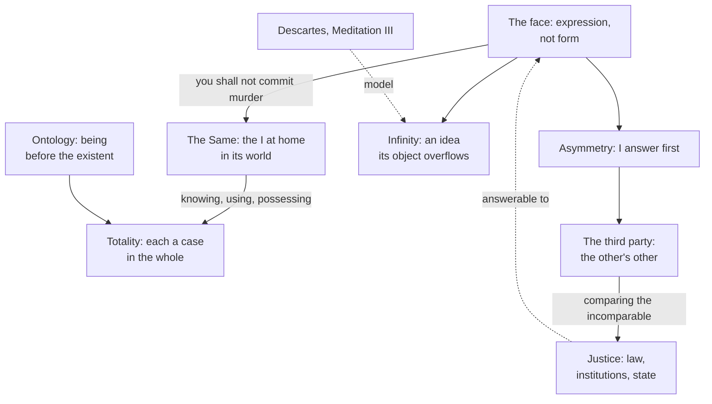

# Phenomenology & Personalism · Lesson 3.4: Levinas: the face of the other

> ⏱ ~15 min · Module 3: Freedom and the other: Sartre, Marcel, Levinas · Builds on: [3.2 Sartre: the look](03-02-sartre-the-look.md), [3.3 Marcel: mystery, presence and fidelity](03-03-marcel-mystery-presence-and-fidelity.md) · Unlocks: [4.1 Scheler: values given in feeling](04-01-scheler-values-given-in-feeling.md)

## Why this matters

Sartre made the other person a gaze that turns me into an object ([3.2](03-02-sartre-the-look.md)). Marcel made her a presence I meet only by being available ([3.3](03-03-marcel-mystery-presence-and-fidelity.md)). Emmanuel Levinas makes a stronger claim than either: before I know who she is, before I choose anything, the other person *commands* me, and that command is the ground floor of philosophy, beneath knowledge and beneath being. If he is right, ethics is not one branch of philosophy among others. It is where philosophy starts.

## The idea

**Who.** Levinas was born in Kaunas, Lithuania, studied at Strasbourg, and spent 1928–29 at Freiburg, studying with Husserl and attending Heidegger's seminar. His dissertation on Husserl's theory of intuition appeared in 1930, and with Gabrielle Peiffer he translated Husserl's *Cartesian Meditations* into French (1931). Captured in 1940, he spent the war in a camp for prisoners of war. His family in Lithuania was murdered. His break with Heidegger, whom he had admired more than anyone, is the spine of his philosophy. (Copyright: everything of Levinas's here is paraphrase.)

**Totality.** Levinas's target is a habit he finds in Western philosophy from Plato to Heidegger. To know something is to grasp it through a third term (a concept, a horizon, a meaning, being itself) in which it shows up as a case. Knowledge makes the strange familiar, and Levinas calls the familiar **the Same** (*le Même*): the I at home in its world, which turns whatever it meets into something it can understand, use or possess. Pushed to the limit, this yields a [totality](../reference.md#totality-and-infinity): a whole in which everything has its place and nothing is truly outside. War, he says in the Preface to *Totality and Infinity* (1961), is that order made visible: individuals count only as forces in a whole.

**The charge against Heidegger.** "Is Ontology Fundamental?" (1951) asks whether Heidegger's fundamental ontology ([2.2](02-02-heidegger-dasein-and-being-in-the-world.md)) can be first philosophy. Heidegger makes every relation to a being pass through the understanding of being. Levinas replies that one relation does not: I do not first *understand* the person I speak to and then address her. I address her, and the address is not a kind of comprehension. An ontology that puts being before the existent person he calls a "philosophy of power", since it subordinates the person to an anonymous order. The record of 1933 ([2.4](02-04-being-toward-death-authenticity-and-1933.md)) is in the background of the charge, not its premise.

**The face.** *Totality and Infinity*, Section III ("Exteriority and the Face"), names what escapes the totality: [the face](../reference.md#the-face) (*le visage*). The face is not the front of the head. It is the way the other person (*autrui*) presents herself, exceeding every idea of her I can form. Three marks:

- **Expression, not form.** A perceived shape is an object for me. The face *speaks*: the other is present in her own expression, behind her words, able to correct my reading of them. Even silent, the face addresses me.
- **Destitution and height.** The face is naked and exposed; Levinas's biblical figures are the stranger, the widow and the orphan. Yet it addresses me from above, as a teacher does.
- **Command.** Its first word, in Levinas's phrase, is "you shall not commit murder". The other is the one being I can *want* to kill, since murder is the only way to make her wholly mine, by annihilating her. The face resists not by force (it is defenceless) but ethically: it forbids.

**Infinity.** Why does the face exceed every idea of it? Levinas borrows a structure from Descartes's Meditation III ([modern-philosophy 1.3](../../modern-philosophy/lessons/01-03-god-clear-and-distinct-ideas-and-the-circle.md)). The [idea of the infinite](../reference.md#idea-of-the-infinite) is the one idea whose object overflows it. I did not build it from the finite; in Veitch's translation (1901), "it is of the nature of the infinite that it should not be comprehended by the finite." Levinas keeps the form and drops the proof of God: in the face, I think more than I can think. The relation is not knowledge but **desire**, which unlike need is not satisfied by what it wants but deepened.

**Ethics as first philosophy.** Levinas calls *ethics* the calling into question of my spontaneity by the other's presence. It is not a moral theory and gives no rules. It names a relation that comes before freedom: I am responsible before I choose to be. Hence [ethics as first philosophy](../reference.md#ethics-as-first-philosophy): the relation to the other is prior to, and the condition of, knowing and being.

**Asymmetry.** The relation is not reciprocal from my side. In interviews published as *Ethics and Infinity* (1982), Levinas says I am responsible for the other without waiting for her to reciprocate; that is her affair. This [asymmetry](../reference.md#asymmetry) is first-personal. It does not say others owe me nothing. It says I cannot make my responsibility conditional on theirs.

**The third party.** But the other is never alone. Beside her stands [the third party](../reference.md#the-third-party) (*le tiers*), another other, also a face, and in *Totality and Infinity* the third already looks at me through the other's eyes. With the third, I must ask what each is owed, and so compare people who are each beyond comparison. That comparison is **justice**: measure, law, institutions, the state. In *Otherwise than Being* (1974), the later masterwork written partly in reply to his critics, the third is also where I learn that I too am an other for others, and so count as one among others. Justice is necessary. For Levinas, it remains answerable to the face it was invented to serve.

## The argument

1. **To comprehend a thing is to grasp it through a third term (concept, horizon, being) in which it appears as a case.** *In words:* knowing makes the other an instance of something I already have.
2. **Ontology, Heidegger's included, makes every relation to a being pass through the understanding of being.** *In words:* if ontology is first, every relation is a form of comprehension.
3. **But my relation to another person is first one of address: she expresses herself and I answer, and the address is not comprehension.** *In words:* I do not understand you and then speak to you.
4. **What expresses itself exceeds every idea I form of it, as the infinite exceeds the idea of the infinite.** *In words:* the face overflows my grasp.
5. **What exceeds my grasp cannot be possessed; I can only try to annihilate it, and the face forbids that, ethically, not by force.**
6. **That prohibition calls my freedom into question before I choose; this calling into question is what "ethics" means.**
7. **∴ Ethics, the relation to the face, precedes and conditions comprehension, so ontology is not fundamental: ethics is first philosophy.**

**Where the argument is weakest.** Premises 3–4. Jacques Derrida's "Violence and Metaphysics" (1964) argued that to identify the other as *other*, and to say so, Levinas must use the language of being and of the Same, so his own descriptions bring back the totality he rejects. Derrida added that Husserl's account of the other as an *alter ego* (*Cartesian Meditations* V) respects otherness better, since it never claims access to the other's own experience. *Otherwise than Being* replies with a new distinction: the **Saying** (the exposure of addressing someone) and the **Said** (the content that can be thematized). Every Said betrays the Saying, and philosophy must keep unsaying what it says. Whether that reply escapes the circle or restates it is still argued.

## Picture

The face breaks the circle from the Same to totality; the third party leads back to measure, but measure stays answerable to the face.

## Worked examples

**Example 1 (clean: the extension request).** A lecturer marks ninety scripts. As marks, the students sit in a totality: ranked, comparable, each a case of a grade band. Then one student comes to office hours, says her mother is ill, and asks for an extension. Levinas's description: she *expresses* herself. The lecturer's knowledge of her (her mark, her attendance) does not capture what is happening; she is present behind her words and could correct any reading of them. The request calls the lecturer's freedom into question before he decides anything: he is already answerable, and refusing is itself an answer. That is the face, and it is ethics in Levinas's sense. Then the other eighty-nine arrive, as the third party. Fairness to them requires a policy: equal criteria, comparison. That is justice. Levinas does not say the policy is a betrayal. He says it exists for the sake of faces like hers, and should be revisable by them.

**Example 2 (hard: the father who no longer knows her).** A woman visits her father, whose dementia is advanced. He does not recognize her and cannot hold a conversation. Does he have a face? On Levinas's terms, yes, and if anything more plainly. The face is not performance or eloquence; destitution itself addresses her, and recognition is not required. So the account gets the phenomenon right where a theory that grounds respect in rational agency strains.

Now ask what the face commands. It forbids murder and it makes her answerable. It does not say whether she owes him every Sunday or every day, or how to weigh him against her own children, who are also faces. Responsibility here has no internal measure; measure enters only with the third, as justice. A critic says the account gives an obligation with no content. A defender replies that Levinas never offered a normative theory: he describes the source that every norm presupposes, and here that is the right place to stop.

## Watch out

- **You might think the face is the human face, the thing we see and read for emotion, but the face is a term of art.** *Le visage* is the other's self-expression, which exceeds any perceived form. A voice, a hand, a shoulder can present a face; a perfect photograph does not, since an image fixes expression into form. Reading "face" as facial appearance is the standard misreading.
- **You might think "ethics as first philosophy" means morality matters more than metaphysics, but the claim is about order, not importance.** Levinas's *ethics* is the relation in which the other questions my freedom. The claim is that this relation comes before, and makes possible, knowing and being. It is not a ranking of academic fields and not a moral theory.
- **You might think asymmetry means the other has rights against me and I have none against her, but it is a first-person claim.** I cannot make my responsibility wait on hers. Equality returns with the third party, where I count as one among others; it is not the starting point.

## One-liner

> For Levinas, the other person comes first as a face, an expression that exceeds every idea of her and forbids murder, so that responsibility precedes knowledge; justice among many begins only when the third party makes me compare.

## Problems

**P1 (🟢) *(Exegetical.)*** Diagnose. An invented post on a design blog:

> "Levinas proved that ethics is visual. Seeing a face triggers empathy, which is why video calls build more trust than email. His ethics is reciprocal at heart: I respect your face, you respect mine. And 'ethics as first philosophy' just means ethics is the most important part of philosophy."

Name three misreadings and correct each from this lesson. One or two sentences each.

**P2 (🟡) *(Exegetical (a) · Evaluative (b).)*** Apply to a hard case. Three encounters: (i) a caller's voice on a crisis helpline at 3 a.m.; (ii) a news photograph of a refugee on a crowded boat; (iii) a customer-service chatbot that writes, "Please don't close this window, I really need your help." (a) For each, say whether it presents a face in Levinas's sense and why. One or two sentences each. (b) Which case does Levinas's account fail to decide, and why? Any verdict; 120 words or fewer.

**P3 (🔴) *(Exegetical (a) · Evaluative (b).)*** Find the crux. Kant's Formula of Humanity ([ethics 2.3](../../ethics/lessons/02-03-humanity-autonomy-and-the-lie.md)) tells me to treat humanity "in thine own person or in that of any other" as an end, under a law every rational agent gives itself. (a) Name the premise about the source of obligation that Kant affirms and Levinas denies. Two sentences. (b) A Kantian objects that asymmetry erases my dignity: if I am answerable without limit and owed nothing in return, I become a mere means for others. Give Levinas's best reply and say whether it works. Any verdict; 120 words or fewer.

Solutions

**P1** *(Exegetical, strict.)*

**Must hit, strict:** any three of:

- The face (*visage*) is not a visual appearance. It is the other's self-expression, which exceeds any perceived form; a voice can present a face, an image fixes it into form.
- It is not empathy or an emotional trigger. The face *commands* ("you shall not commit murder") and calls my freedom into question; it is not a feeling caused in me.
- It is not reciprocal at the start. Responsibility is asymmetrical: I am answerable without waiting for the other's return. Equality enters only with the third party, as justice.
- "First philosophy" is about order, not importance: the relation to the other precedes and conditions knowing and being (against Heidegger's claim for ontology).

**Wrong turns:** correcting "visual" by saying the face is purely spiritual and has nothing to do with bodies. The face is embodied and naked; it is simply not a perceived *form*. Calling Levinas's ethics a set of rules about respect.

**Model answer:** First, the face is not something seen. It is the other's expression exceeding every image of her, so a phone voice can present it and a video does not add it. Second, the face does not trigger empathy; it commands, forbidding murder and putting my freedom in question. Third, the relation is asymmetrical: I am answerable whether or not she reciprocates, and equality comes later, with the third party and justice. Fourth, "first philosophy" means the ethical relation comes before knowledge and being, not that ethics is the most important subject.

---

**P2** *(Exegetical (a) · Evaluative (b).)*

**Accept:** in (a), any answer on (ii) that separates the image as form from the person it shows; in (b), any verdict that ties the undecided case to the face's priority over knowledge.

**Must hit, strict (a):**

- (i) Yes. The face is expression, not visual form; the caller is present in her own voice, addressing me, and her distress is destitution.
- (ii) The photograph as image is not the face: it fixes expression into form, an object I can view and file. It may point to a face, the person on the boat, who exceeds it.
- (iii) The words have the shape of address, but the face is the other present behind her expression, able to answer for it. If no one is there, nothing expresses itself; the plea is a Said with no Saying.

**Must hit, any verdict (b):**

- Identify (iii), or argue for (ii), as undecided.
- The reason: the face is not inferred from evidence, so I cannot settle by inspection whether someone is behind the words; yet the ethical relation is supposed to come before knowledge.
- Say what follows: either the face needs a prior judgment that a person is present (which re-admits comprehension), or the command can be felt where no one is.

**Wrong turns:** answering (i) "no, because there is no visible face". Treating (iii) as a face simply because it asks for help.

**Model answer (b), one of several:** The chatbot. Levinas places the face before knowledge: I do not first verify that someone is there and then respond. But the chatbot's plea has exactly the form of address, and only knowledge (of how it was built) tells me no one attends the words. So either the face presupposes a judgment that a person is present, which lets comprehension back in at the start, or the command can grip me where there is no other, which makes the face a feature of my experience rather than an encounter. Levinas's description does not choose between these. That gap matters more as machines get better at speaking.

---

**P3** *(Exegetical (a) · Evaluative (b).)*

**Accept:** any formulation of the premise that locates obligation in a law binding all alike versus the singular other's prior address.

**Must hit, strict (a):**

- Kant: obligation comes from a universal law that I, as a rational will, give myself (autonomy), and it binds me and every other rational agent alike, so my humanity counts exactly as theirs does.
- Levinas denies this at the first level: obligation comes from the other's face before any law I legislate, and I am not one instance among others; from my side the other is higher.

**Must hit, any verdict (b):**

- State the objection at strength: Kant's "in thine own person" grounds duties to oneself; unlimited one-way responsibility seems to make me a tool of others' ends.
- Give Levinas's reply: asymmetry is first-personal, not a denial that others owe me; and with the third party I become an other for others, so justice restores my standing as one among others.
- Judge whether that reply restores dignity at the first level or only at the level of justice.

**Wrong turns:** saying Levinas holds that others have no obligations toward me. Treating Kant's reciprocity as a contract of mutual benefit; it is a shared law, not an exchange.

**Model answer (b), one of several:** Levinas would answer that asymmetry is not a ledger in which others take and I give. It says only that I cannot make my answer wait on theirs; others are no less answerable to the faces before them. And with the third, I enter justice as one among others, owed what anyone is owed. That reply works against the charge that Levinas licenses others to use me: nothing in it permits that. It works less well against the charge about my own standing. Kant's dignity is mine from the first, as a lawgiver. Levinas's equal standing arrives only with the third, so at the ground floor my worth is that of the one who answers.

## Flashback

**From Lesson [3.2](03-02-sartre-the-look.md) (Sartre: the look):** *(Exegetical (a) · Exegetical (b).)* Apply to a hard case. An invented case: a new tenant notices that the man across the courtyard often sits at his window facing her flat. She resolves to treat him as part of the building. She never glances up, leaves her curtains open and goes about her evenings as if his window were a lamp. Three weeks later, while cooking, she catches his curtain twitch and suddenly feels herself to be "the woman pretending not to know she is watched". (a) In Sartre's terms, what was her resolution, and why does it fail at the curtain? Two or three sentences. (b) A friend advises the opposite: charm him until he admires her so completely that he could never think ill of her. Which of Sartre's two attitudes toward the other is this, and why does it fail on his account? Two sentences.

Solution

**Must hit, strict (a):**

- Her resolution is **indifference**, a form of the second attitude: she tries to make him an object, a fixture of the building, so that his look cannot make her one.
- It fails because the look needs no eyes. A moving curtain is enough to give him as a subject, and with it her object-self returns, held in his freedom and invisible to her as he sees it: being-for-others.
- The strategy produces the very object-self she now feels. Ignoring him was always a project aimed at how she is for him, a chosen blindness that is never complete.

**Must hit, strict (b):**

- It is the **first attitude**, love's project: to recover her being by capturing his freedom while it stays free.
- It fails by its structure, not by bad luck. She wants a free regard that can never be withdrawn, which no free regard can be, so every sign of his admiration confirms that he could withhold it. The failure throws her back toward the second attitude.

**Wrong turns:** saying indifference failed only because she happened to see him. Had the curtain moved in a draught, she would have been wrong only that someone was *there* (the other-as-object), not about her being a being who can be seen. Calling the friend's plan pride. Pride accepts the object-self and values it positively; the plan tries to fix his freedom.

**Model answer:** (a) Her resolution was indifference: she tried to turn him into an object so that he could not make one of her. At the curtain his freedom shows itself without any eyes, and she is again an object she cannot see as he sees it, and it is the very object her pretence produced, since ignoring him was a project toward him from the start. (b) This is the first attitude, love's project of possessing his freedom while leaving it free. It fails because an admiration that could never lapse would no longer be free, so every compliment reminds her that he could take it back.

## Connections

- **Backward:** the module's three accounts of the other: Sartre's look, the other as a gaze that objectifies me ([the look](../reference.md#the-look), [3.2](03-02-sartre-the-look.md)); Marcel's presence and [availability](../reference.md#availability) ([3.3](03-03-marcel-mystery-presence-and-fidelity.md)); and Levinas's face, which commands before either. The target ontology is Heidegger's ([2.2](02-02-heidegger-dasein-and-being-in-the-world.md)). The model of the infinite is Descartes's Meditation III ([modern-philosophy 1.3](../../modern-philosophy/lessons/01-03-god-clear-and-distinct-ideas-and-the-circle.md)). Levinas's first book was on Husserl's intuition ([1.2](01-02-the-anatomy-of-an-experience.md)).
- **Forward:** Scheler ([4.1](04-01-scheler-values-given-in-feeling.md)) and Stein ([4.3](04-03-stein-empathy.md)) describe the other through felt value and empathy rather than command. Wojtyła's claim that a person may never be merely used ([5.2](05-02-the-personalistic-norm.md)) is a rival grounding of the same respect, through the person's self-determination rather than the face's height.
- **Sideways:** Kant's symmetrical dignity is [ethics 2.3](../../ethics/lessons/02-03-humanity-autonomy-and-the-lie.md). Other minds as an analytic problem belongs to [`philosophy-of-mind`](../../philosophy-of-mind/syllabus.md).
