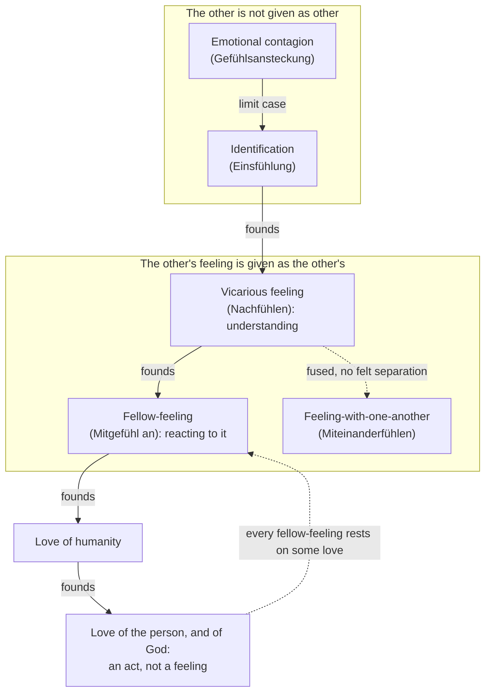

# Phenomenology & Personalism · Lesson 4.2: Scheler: sympathy, love and the person

> ⏱ ~15 min · Module 4: Values, empathy and the person: Scheler and Stein · Builds on: [4.1 Scheler: values given in feeling](04-01-scheler-values-given-in-feeling.md) · Unlocks: [4.3 Stein: empathy](04-03-stein-empathy.md), [5.1 Wojtyła and Scheler](05-01-wojtyla-and-scheler.md)

## Why this matters

"I feel your pain" can mean at least four different things, and the history of ethics has repeatedly confused them. Hume, Adam Smith and Schopenhauer built morality on sympathy; Nietzsche condemned pity as a contagion that multiplies misery. Max Scheler (1874–1928) argued that both sides misdescribed the phenomenon, because they never separated catching a feeling, merging with someone, understanding a feeling and sharing in it. His book on sympathy (1913) ends in two claims Wojtyła inherited and fought with: love is a movement toward higher value, and the person is never an object.

## The idea

**Understanding comes first, and it is not sharing.** Scheler calls grasping another's feeling *Nachfühlen*, here "vicarious feeling": feeling *after* the other, at a distance. Whoever understands a drowning man's terror of death, he says, need not feel even a weakened terror himself. The proof that understanding is not participation is the cruel man. He grasps his victim's pain exactly, and his pleasure grows as he feels it rise. Cruelty is not insensibility; it is vicarious feeling joined to the wrong response.

On that base Scheler separates four phenomena, in *Wesen und Formen der Sympathie* (1923, the 1913 book "more than doubled"; quoted here from the unchanged 1926 printing). Together they are the [forms of fellow-feeling](../reference.md#forms-of-fellow-feeling).

1. **Feeling-with-one-another** (*Miteinanderfühlen*): two people feel one and the same sorrow, neither's feeling an object for the other. The Source gives Scheler's case.
2. **Fellow-feeling** (*Mitgefühl an etwas*): I rejoice *in* your joy, pity you *in* your sorrow. Your sorrow is first given to me in vicarious feeling, and my pity is a second, reactive feeling *directed at* it: two facts, not one. It needs what he calls "phenomenal ego-distance" (*phänomenale Ichdistanz*).
3. **Emotional contagion** (*Gefühlsansteckung*): the merriment of a bar sweeps in someone who arrived sad; laughter spreads; a gathering's gloom lingers in you for hours, and only later do you infer where it came from. Contagion runs between feeling-states, needs no knowledge of the other's feeling, is involuntary, and snowballs back on its source. That is why a crowd does things no member wills.
4. **Identification** (*Einsfühlung*): the limit case of contagion, where not a single feeling but the other's whole self is taken as mine. It comes in two poles. In the *idiopathic* pole I absorb the other, and in the *heteropathic* pole I am absorbed and live "in him". Scheler's examples include the mystery-cult initiate who becomes the god and the lasting hypnotic bond. The 1923 preface admits this form had not occurred to him in 1913.

The first two are genuine fellow-feeling, the last two are not: in contagion and identification the other is not given *as other*.

**Love is not a feeling at all.** Feeling is a receptive function; love is a spontaneous act and a movement. Fellow-feeling is reactive and only for beings who feel, while we love beauty, knowledge and God. Scheler's definition:

> Love is the intentional movement in which, starting from a given value A of an object, the appearance of its higher value [*höheren Wertes*] is realized. (translation ours, from the 1926 printing, p. 176)

Love does not *create* the higher value, which would be illusion, and illusion comes from being stuck in one's own interests, the opposite of love. Nor does it demand that the beloved improve. It is the act in which the beloved's own higher value, on the [hierarchy of values](../reference.md#hierarchy-of-values) from [4.1](04-01-scheler-values-given-in-feeling.md), first lights up ([love as movement toward higher value](../reference.md#love-as-movement-toward-higher-value)). Hence his reversal of the sympathy ethicists: every fellow-feeling is founded in some love and ceases without it, never the converse. A person's loves, rightly or wrongly ranked, form an [ordo amoris](../reference.md#ordo-amoris), the subject of an unfinished essay published posthumously in 1933.

**The person.** In *Formalismus* (Jahrbuch II, 1916) Scheler defines the [person as act-center](../reference.md#person-as-act-center):

> Person is the concrete, itself essential unity of being [*Seinseinheit*] of acts of different essence, which in itself precedes all essential act-differences. (translation ours, from the 1916 German, pp. 255–56)

The person is what *does* perceiving, willing, feeling and loving, not what any of them is about.

Raised in a Jewish family in Munich, Scheler was received into the Catholic Church at Beuron at Easter 1916 and wrote as a Catholic thinker through *Vom Ewigen im Menschen* (1921). From about 1922 he moved publicly away from the Church toward a pantheistic metaphysics. Dietrich von Hildebrand, received into the Church in 1914 under Scheler's influence, developed the act of love into a theory of *value-response* (*Wertantwort*).

## Source

Scheler, *Wesen und Formen der Sympathie*, A.II (translation ours, from the 1926 printing, pp. 9–10).

> Here four quite different facts must be distinguished. I call them: 1. immediate feeling-with [*Mitfühlen*], for example of one and the same sorrow, "with someone". 2. "Fellow-feeling about something" [*Mitgefühl an Etwas*]: rejoicing "in" his joy and pity "with" his sorrow. 3. Mere emotional contagion [*Gefühlsansteckung*]. 4. Genuine identification [*Einsfühlung*].
>
> 1. Father and mother stand beside the body of a beloved child. They feel with one another the same sorrow, "the same" pain. That is: it is not that A feels this sorrow and B feels it too, and in addition they know that they feel it. No, it is a feeling-with-one-another. B's sorrow does not become in any way "objective" [*gegenständlich*] for A here, as it does for their friend C, who joins the parents and has pity "with them" or "on their pain".

The test is not intensity or accuracy but **whether the other's feeling stands before me as an object**. C may grieve deeply; his pity is still a second fact aimed at theirs. Scheler adds that bodily pain cannot be co-felt this way: there is no "co-pain", only pity *at* another's pain.

## The argument

Why the person is never an object (*Formalismus*, 1916, pp. 246–60).

1. **An act exists only in being performed.** Reflection can accompany it, but does not make it an object the way inner perception does. *In words:* you can know you are judging while judging, but the judging is never something you look at.
2. **The ego (*Ich*) is still an object**: the individual ego is given in inner perception, along with its states. *In words:* introspection finds moods and a "me", which are things one observes.
3. **The person is the concrete unity of acts of every kind, prior to all their differences**, including the difference between inner and outer perception (the definition above).
4. **A unity of acts is given only as acts are given: in performing them.** For another person, that means co-performing, re-performing or pre-performing (*Mit-, Nach-, Vorvollzug*) their acts.
5. **∴ The person, one's own or another's, is never an object.** Another person is given cognitively in understanding, morally in following, and as this irreplaceable individual only in love.

Or in *Formalismus* itself: "if even an act is never an object, still less is the person living in the performance of her acts [*Aktvollzug*]" (translation ours, from the 1916 German, p. 260). This is Scheler's answer to Hume ([modern-philosophy 4.4](../../modern-philosophy/lessons/04-04-the-self-belief-and-the-passions.md)). Looking inward for the self finds only perceptions, because inner perception finds only the ego and its states. The person was the one looking.

**Where the argument is weakest.** Premise 4, and with it the step from "not an object" to "nothing but acts". Wojtyła's habilitation thesis on Scheler ([5.1](05-01-wojtyla-and-scheler.md)) presses the point. A person given only in the performance of experienced acts is a centre of *experience*, with no grasp of the self as the efficient cause of its acts, and no subject that persists when it is not acting, as in sleep. The defender's reply: Scheler's own phrase in the sympathy book is "unity-substance" (*Einheitssubstanz*) of all acts. The denial of objecthood blocks reifying the person as a thing among things, not the claim that the person is real and enduring. Whether "substance" here is more than a word is the question Module 5 inherits.

## Picture

Solid arrows are Scheler's founding laws (ch. A.VI), holding in the order of essence and of development. The dashed return arrow is his reversal of sympathy ethics: love is not built from fellow-feeling.

## Worked examples

**Example 1 (clean: the delayed train).** A train stalls in a tunnel. Within minutes a carriage full of strangers is irritable, though most have no appointment to miss: **contagion**, state passing to state through sighs and gestures, growing as it circulates. A student notices the woman opposite is crying, and gathers from her phone call that she will miss her mother's surgery: **vicarious feeling**, her distress given to him as *hers*. He is sorry for her and offers his phone charger: **fellow-feeling**, a second feeling directed at hers, with ego-distance intact. A man across the aisle also understands exactly what she feels and smirks: vicarious feeling without fellow-feeling, a small version of Scheler's cruel man. If her brother were beside her, the two of them dreading the same outcome, that would be **feeling-with-one-another**.

**Example 2 (hard: the pile-on).** A video of a waiter insulting a customer goes viral, and thousands post furious replies. Each poster experiences it as indignation on the customer's behalf, which would be fellow-feeling. Scheler's tools say much of it is contagion: anger passing from post to post and amplifying in the circulation he describes, ending in harms (the waiter's address published) that no one intended. The analysis strains at the point of verification. Contagion, by his own account, is *not given as contagion*: the infected take the feeling for their own and learn its source only by inference afterwards. So the first-person phenomenology that is supposed to tell the forms apart cannot certify, from inside, which one I am in. Scheler's reply is that the forms differ in *intention* (does my anger mean the customer's hurt, or merely the crowd's heat?) and that mixed cases are normal. His ch. A.VII is about how the functions cooperate. The dispute has moved from description to self-scrutiny.

## Watch out

- **You might think *Einfühlung* is Scheler's word for empathy, but he rejects it.** Lipps's [projection theory](../reference.md#projection-theory) explained understanding by inner imitation of the other's expression. Scheler answers that we understand a dog's wagging joy that we cannot imitate, and that imitation explains contagion, the *opposite* of understanding. His word for understanding is *Nachfühlen*. Stein, whom he cites against Lipps on the circus acrobat (I am not "one with" him, only "with him"), uses *Einfühlung* in her own sense, which she glosses as roughly his *Nachfühlen* ([4.3](04-03-stein-empathy.md)). The same English word "empathy" covers three different technical terms.
- **You might think love is fellow-feeling at its most intense, but it is a different kind of thing.** Fellow-feeling is a reactive function and only for feeling beings; love is a spontaneous act, aimed at value, and possible toward a painting or God. Love founds fellow-feeling, not the reverse. Scheler adds that love cannot be commanded, which is why he faults Kant for excluding it from moral worth ([ethics 2.3](../../ethics/lessons/02-03-humanity-autonomy-and-the-lie.md)).
- **"The person is never an object" is not a moral rule.** It is a claim about *givenness*: persons are known by co-performing their acts, never by observing them. "Never treat a person merely as a thing" is a norm, Kant's and later Wojtyła's ([5.2](05-02-the-personalistic-norm.md)). Reading Scheler's thesis as that norm is a misreading of the term "object" (*Gegenstand*).

## One-liner

> Catching a feeling, merging with a self, understanding a feeling and sharing in it are four different things; love is none of them, but the act in which a person's higher value appears, and the person is given only by performing acts with her, never as an object.

## Problems

**P1 (🟢) *(Exegetical (a) · Evaluative (b).)*** Apply to a hard case. (a) Name the form of fellow-feeling (or its absence) in each, in Scheler's terms, with the feature that decides it. One sentence each. (i) A visiting supporter, indifferent to football, finds himself roaring and elated as the home crowd celebrates a goal. (ii) A night nurse sits with a frightened patient before surgery; she grasps his fear precisely and is moved for him, without being afraid herself. (iii) A teenage fan, over two years, dresses, speaks and "feels" as her favourite pop star, and says, without irony, that when the star is snubbed it is *she* who is humiliated. (b) Which of the three does Scheler's typology have most trouble placing, and why? 80 words or fewer.

**P2 (🟡) *(Exegetical.)*** Close reading. Scheler answers Nietzsche's charge (*Antichrist* §7, which Scheler quotes) that pity makes suffering contagious and is "a multiplier of misery". *Wesen und Formen der Sympathie*, A.II (translation ours, from the 1926 printing, p. 16):

> It is evident that here, as in all similar passages, suffering-with [*Mit-leiden*] is confused with emotional contagion [*Gefühlsansteckung*]. Suffering does not become contagious through pity. Rather, precisely where a suffering becomes contagious, pity is entirely excluded; for to that same degree it is no longer given to me as the other's suffering, but as my suffering, which I try to get rid of by avoiding the sight of the suffering. Indeed, even where contagion by a suffering is present, it is precisely pity with the other's suffering "as the other's" that is able to cancel that contagion [...]. Pity would be a "multiplier of misery" only if it were identical with emotional contagion. For only contagion, as we saw, produces in the other a real suffering, a feeling-state of the same kind as the infecting feeling.

(a) Does Scheler deny that suffering spreads from person to person? Name the words that decide it. (b) On what does the difference between pity and contagion turn here, intensity or something else? Quote the deciding phrase. Two sentences per part.

**P3 (🔴) *(Exegetical (a) · Evaluative (b).)*** Diagnose. An invented wellness column:

> Empathy is simply emotional contagion: when you are with someone in pain, you catch their pain, and the more of it you absorb, the more empathic you are. That is why carers burn out. The healthiest carers practise detachment: they understand what patients feel without letting it in. Detachment, not empathy, is the real virtue.

(a) Using Scheler's distinctions, name two conflations in the column. One or two sentences each. (b) A neuroscientist replies to Scheler: "Contagion and fellow-feeling run on overlapping brain mechanisms, so your 'essential' distinctions are differences of degree." Must Scheler deny the overlap? Any verdict; 120 words or fewer.

Solutions

**P1** *(Exegetical (a) · Evaluative (b).)*

**Accept:** for (b), any of the three if the reason names a defining feature the case blurs.

**Must hit, strict (a):**

- (i) **Contagion**: the elation passes state to state without his grasping anyone's joy as theirs; he has no stake in the goal, and he takes the feeling as his own.
- (ii) **Vicarious feeling plus fellow-feeling** (*Mitgefühl*): the fear is given to her as *his*, and her being moved is a second feeling directed at it, with ego-distance kept; she is not herself afraid.
- (iii) **Identification** (*Einsfühlung*), heteropathic: not one feeling but the star's self has taken the place of hers; she lives "in" the star, and the humiliation is felt as her own.

**Must hit, any verdict (b):**

- Pick a case and say which criterion it blurs: (iii) may be partial identification or a long-cultivated imitation, and Scheler says identification is involuntary, yet two years of deliberate styling look willed. Or (i): the visitor may know perfectly well whose joy this is and join in, so contagion and a willed seeking-of-contagion (Scheler's "going out to be cheered up") blur.
- Say what would decide it on Scheler's terms (is the other given as other? is the process willed or not?).

**Wrong turns:** calling (ii) feeling-with-one-another. The nurse's feeling is a second fact aimed at his, as C's pity is in the Source. Calling (iii) fellow-feeling because she "cares" about the star; ego-distance is exactly what she lacks.

**Model answer (b), one of several:** (iii). Scheler's identification is involuntary and unconscious, but the fan has worked at becoming the star for two years. If the merging was cultivated, it looks like willed imitation that ended in identification, and his typology has no slot for a voluntary road into an involuntary state. It decides only once we know whether, at the moment of the snub, the star is still given to her as someone else.

---

**P2** *(Exegetical.)*

**Must hit, strict (a):**

- No. He grants contagion of suffering is real: "precisely where a suffering becomes contagious" and "only contagion ... produces in the other a real suffering".
- What he denies is that *pity* is the vehicle. Nietzsche's charge is true of contagion and false of pity.

**Must hit, strict (b):**

- Not intensity but **mode of givenness**: in contagion the suffering is "no longer given to me as the other's suffering, but as my suffering".
- Pity keeps the suffering given "as the other's", which is why it can even cancel contagion.

**Wrong turns:** reading Scheler as saying pity is a milder, safer dose of the same suffering. He denies that pity produces any real suffering of the same kind. Reading "avoiding the sight" as pity's response; it is the response of someone infected, trying to escape what is now his own pain.

**Model answer:** (a) No: he grants that suffering can become contagious and that "only contagion" produces a real suffering of the same kind in another; his claim is that this is not pity. (b) The difference is how the suffering is given, not how strongly: in contagion it is "no longer given to me as the other's suffering, but as my suffering", while pity holds it "as the other's".

---

**P3** *(Exegetical (a) · Evaluative (b).)*

**Must hit, strict (a):** any two of:

- **Contagion is not fellow-feeling.** Catching pain gives me a feeling-state of my own; fellow-feeling is a second feeling directed at the other's, which needs ego-distance. "The more you absorb, the more empathic" inverts Scheler: the more the pain becomes mine, the less it is given as theirs.
- **Understanding is not detachment from fellow-feeling.** "Understanding what patients feel without letting it in" is just vicarious feeling (*Nachfühlen*), which Scheler says never requires feeling the state oneself. So understanding without being infected is not a rival to fellow-feeling; it is fellow-feeling's base.
- **Burnout is a contagion phenomenon.** On Scheler's account, genuine fellow-feeling ("as the other's") is what *cancels* contagion, so the cure the column wants is fellow-feeling, not detachment.

**Must hit, any verdict (b):**

- Say what Scheler's claim is: a difference in the *structure of givenness* (whose feeling, given as whose), established by description.
- Say whether a shared mechanism threatens it: does an overlap in causal basis show the phenomena differ only in degree? Address the founding laws: Scheler himself says identification founds vicarious feeling, so he expects continuity in genesis.
- Say what evidence would actually hurt him (e.g. that people cannot, even in principle, tell "her fear" from "my fear").

**Wrong turns:** answering that phenomenology simply ignores science. Scheler engages the psychology of his day (Lipps, Freud, Spencer). Treating the essential distinction as a claim about brains.

**Model answer (b), one of several:** No. Scheler's distinction is between how a feeling is given (as mine, or as yours), not between causal mechanisms, and two phenomena can share machinery and still differ in kind, as perceiving and hallucinating may. He even predicts genetic continuity: identification founds vicarious feeling in development. What the neuroscientist must show is that the difference *in givenness* is itself only a matter of degree, that there is no point where your fear stops being given as yours. Overlap in mechanism does not show that. If anything it explains why contagion and fellow-feeling are so easily confused, which is Scheler's complaint against Spencer and Nietzsche.

## Flashback

**From Lesson [3.4](03-04-levinas-the-face-of-the-other.md) (Levinas: the face of the other):** *(Exegetical (a) · Evaluative (b).)* Reconstruct. (a) In four or five numbered premises and a conclusion, reconstruct how Levinas uses Descartes's idea of the infinite (Meditation III) to conclude that my relation to the other person is desire, not knowledge. Mark the premise where he parts company with Descartes. (b) A reader objects: "Every perceived thing exceeds my idea of it too. A house always has unseen sides and an open horizon. So the face's 'infinity' is just ordinary incompleteness." Give Levinas's best reply from the lesson and say whether it holds. Any verdict; 80 words or fewer.

Solution

**Accept:** in (a), any order of premises that keeps the moves below.

**Must hit, strict (a):**

- Knowing grasps a thing through a third term (concept, horizon, being) in which it appears as a case; the known is drawn into the Same.
- Descartes's idea of the infinite is the one idea whose object overflows it, not built from the finite.
- The other presents herself as a face: she expresses herself, is present behind her words, and can correct any reading of them, so she exceeds every idea I form of her.
- The departure, marked: Levinas keeps the *form* (an idea overflowed by its object) and applies it to the human other, dropping Descartes's proof that God exists as the cause of the idea.
- ∴ The relation cannot be comprehension. It is desire, which unlike need is deepened, not satisfied, by what it wants.

**Must hit, any verdict (b):**

- The reply: a thing's excess lies within a horizon, more of the same kind that further looking would fill, so it is still grasped as a case. The face's excess is expression: she addresses me and can contest my view, and a house never does.
- A verdict, with the pressure point named: the critic can say "she can correct me" only means "there is more to learn about her", which is ordinary incompleteness again; the defender says correcting is the other's act, not a profile I take in.

**Wrong turns:** having Levinas prove God's existence, or keep the proof. Reading "infinite" as a quantity: endless information about her. Treating desire as need or as erotic longing; need is satisfied by what it wants, desire is not.

**Model answer (a):** P1. To know is to grasp something through a third term in which it appears as a case of what I already have. P2. Descartes's idea of the infinite is an idea its object overflows. P3. In the face, the other expresses herself and exceeds every idea I form of her. P4 (the departure). So my relation to the other has the form of the idea of the infinite, without Descartes's inference to God. P5. A relation to what overflows every idea cannot be comprehension, and is not satisfied by possessing its object. ∴ It is desire, not knowledge.

**Model answer (b), one of several:** Levinas would say the house's hidden sides are more of the same: a horizon further looking fills, so the house stays a case of what I grasp. The face exceeds me differently, by speaking: she can contest any reading I make. The reply holds only if being contested differs in kind from learning more. Plausibly it does, since a correction comes from her, not from my next perception, but this is exactly where the Descartes analogy carries the weight.

## Connections

- **Backward:** love moves along the hierarchy of values of [4.1](04-01-scheler-values-given-in-feeling.md), and Scheler's case against pity's critics continues his answer to Nietzsche's genealogy ([modern-philosophy 6.5](../../modern-philosophy/lessons/06-05-nietzsche-perspectivism-and-genealogy.md)). The person who is never an object answers Hume's bundle ([modern-philosophy 4.4](../../modern-philosophy/lessons/04-04-the-self-belief-and-the-passions.md)). Levinas's other, who is not a theme of knowledge ([3.4](03-04-levinas-the-face-of-the-other.md)), makes a parallel claim on different grounds.
- **Forward:** Stein's [empathy](../reference.md#empathy) ([4.3](04-03-stein-empathy.md)) answers Lipps alongside Scheler but disputes his account of how the other is given. Wojtyła's habilitation tests whether Scheler's act-centre can ground ethics ([5.1](05-01-wojtyla-and-scheler.md), [Wojtyla on Scheler](../reference.md#wojtyla-on-scheler)), and his analysis of sympathy and friendship ([5.3](05-03-the-anatomy-of-love.md)) reworks this lesson's distinctions.
- **Sideways:** what a person is as a metaphysical question, Boethius's definition included, is [metaphysics 6.5](../../metaphysics/lessons/06-05-what-a-person-is.md). Other minds in analytic form belong to [`philosophy-of-mind`](../../philosophy-of-mind/syllabus.md).
