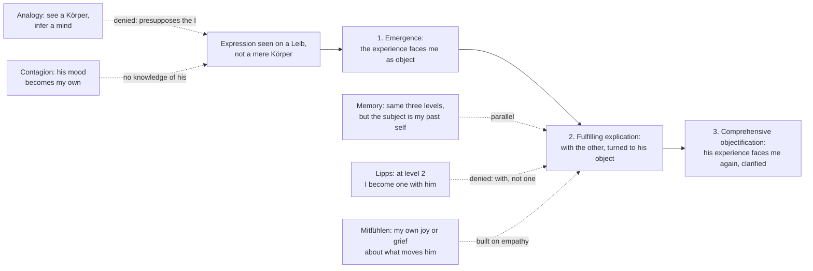

# Phenomenology & Personalism · Lesson 4.3: Stein: empathy

> ⏱ ~15 min · Module 4: Values, empathy and the person: Scheler and Stein · Builds on: [1.2 The anatomy of an experience](01-02-the-anatomy-of-an-experience.md), [1.3 The natural attitude, the epoché and the reductions](01-03-the-epoche-and-the-reductions.md), [4.2 Scheler: sympathy, love and the person](04-02-scheler-sympathy-love-and-the-person.md) · Unlocks: [4.4 Stein: the person, and the meeting with Aquinas](04-04-stein-the-person-and-aquinas.md)

## Why this matters

From his window Descartes sees hats and cloaks that might cover machines, and says he *judges* there are men under them ([modern-philosophy 1.2](../../modern-philosophy/lessons/01-02-the-cogito-and-the-wax.md)). Other minds, on that picture, are inferred. Edith Stein's doctoral thesis, *Zum Problem der Einfühlung* (*On the Problem of Empathy*), examined at Freiburg under Husserl on 3 August 1916 and printed in 1917, denies the picture at its root. We do not infer another's grief. We *experience* it, though never as we experience our own. Saying exactly how both can be true is the whole lesson.

## The idea

A friend tells you his brother has died, and you grasp his pain (Stein's own opening case). This is not **outer perception**: you can walk round a die until its hidden face is given in person ([1.2](01-02-the-anatomy-of-an-experience.md)), but you can study a pained face from every side and never reach an angle from which the pain itself is given. Yet empathy shares one thing with perception: its object is there, now, itself. The pain is not remembered or imagined.

Stein's key distinction is **[primordial and non-primordial](../reference.md#primordial-and-non-primordial)** (*originär*, *nicht-originär*). Every act I am now living through is primordial *as an act*. But some acts give their content primordially (seeing the face of the die turned to me) and some do not. Memory, expectation and fantasy are present acts with non-primordial content: I remember now a joy given as *once* alive. **[Empathy](../reference.md#empathy)** (*Einfühlung*) belongs with these. It is a present act whose content, another's experience, I live through non-primordially. The difference from memory is the subject: remembered joy is mine, joined to me by one continuous stream. Empathized joy belongs to someone else, and no continuity of experience joins us. It is primordial for him and given to me as such.

Because empathy is a presentification (*Vergegenwärtigung*), like memory, it runs through the same **[three levels](../reference.md#three-levels-of-empathy)**, which she lists as

> 1. the emergence [*Auftauchen*] of the experience, 2. the fulfilling explication [*erfüllende Explikation*], 3. the comprehensive objectification [*zusammenfassende Vergegenständlichung*] of the explicated experience

(translation ours, from the 1917 German). The Source below describes the movement between them. The levels are modes, not compulsory steps: in a concrete case

> one does not always pass through all the levels, but is often content with one of the lower ones

(translation ours, from the 1917 German). At level 2 you follow out what the first grasp implicitly contained, as an empty intention is filled ([empty and fulfilled intention](../reference.md#empty-and-fulfilled-intention)). The filling is never primordial, though: it is more empathy, never his pain lived as yours.

Where does the other's experience show itself? In the **[lived body](../reference.md#lived-body)** (*Leib*), as opposed to the physical body (*Körper*). In Part III my *Leib* bears fields of sensation, sits at the "zero point of orientation" from which everything is near or far, moves freely, expresses my experiences and carries out my will. Another's hand resting on a table does not lie there like the book beside it. It presses, slack or tensed, and I "see" the pressure as co-given with the hand, as the hidden sides come with the seen side of a thing. Following that, my hand, "as it were", moves into the place of his and senses what it senses, non-primordially. A striking reversal follows: from the other's zero point, empathized, my own body appears as one body among others, so empathy is a condition of grasping *myself* fully as a psychophysical individual.

Three rivals fail this description. **Lipps's [projection theory](../reference.md#projection-theory).** Theodor Lipps (1851–1914) held that a seen gesture rouses me to imitate it inwardly, the imitation calls up the matching feeling, and I feel it "in" the other. In full empathy, he said, I am one with the acrobat I watch. Stein replies that imitation gives me *my own* experience, roused by his gesture, never his. And I am "with" the acrobat, not one with him: Lipps confused self-forgetful absorption in an object with dissolving into it. **Emotional contagion** (*Gefühlsübertragung*), a mood caught from others, has no cognitive function and blocks my turning toward their experience. **The [argument from analogy](../reference.md#argument-from-analogy)**, which Stein attributes to J. S. Mill, holds that I see bodies, know from my own case what links bodily changes to experiences, and infer a similar link in others. Stein's charge: it ignores the phenomenon, as if we saw around us only soulless, lifeless bodies. She grants that inferences by analogy happen. But they presuppose that I already grasp the other *as* an I and his expression *as* expression, and they yield only probable knowledge, not experience.

Stein separates what empathy *is* from whether it is valid, and defers validity. Empathy can deceive: taking my own makeup instead of the human type, I credit a bored listener with my delight in a Beethoven symphony. One look at his face, itself empathy, corrects me. As in perception, its errors are unmasked only by further acts of the same kind, or by inferences that rest on them.

Husserl's Fifth *Cartesian Meditation* (French 1931; paraphrased) later gives a related account: the body over there is "paired" with mine by passive association, and the other's experience is *appresented*, co-intended but never given in person. This "analogizing" grasp, he insists, is no inference by analogy. Stein, his assistant from October 1916 to February 1918, worked on the manuscripts of *Ideas* II; her preface says they treat some of the same questions, and that she left her results unrevised.

## Source

Stein, *Zum Problem der Einfühlung* (1917), Part II §2 (translation ours, from the 1917 German). She has just compared empathy with memory and fantasy.

> Here too we have an act that is primordial [*originär*] as a present experience, but non-primordial in its content. [...] When it arises before me all at once, it stands over against me as an object (for instance the sadness I "read off" the other's face). But when I follow out the tendencies implied in it (try to bring the mood the other is in to clear givenness for myself), it is no longer an object in the proper sense. It has drawn me into itself: I am no longer turned toward it, but, in it, turned toward its object; I am with its subject, in its place. Only after the clarification achieved in carrying it out does it face me again as an object.

Notice: the sadness is "read off" the face, not inferred; at level 2 I am turned toward *his* object, not toward his feeling; and level 3 is a return, the clarified experience facing me again as his.

## The argument

1. **Empathy is not outer perception.** *In words:* no change of angle brings another's pain itself into view, as turning the die brings its hidden face.
2. **Yet its object is present, here and now, itself.** *In words:* the pain is neither remembered nor imagined.
3. **Like memory, expectation and fantasy, empathy is primordial as an act and non-primordial in its content, and runs through the same three levels.** *In words:* it is a present act that makes present an experience I am not living through as mine.
4. **Unlike them, the subject of the content is another I, joined to mine by no continuity of experience.** *In words:* remembered joy is mine; empathized joy is primordially his.
5. **Imitation and contagion yield my own primordial experience, not the other's.** *In words:* catching a mood is not grasping one.
6. **Inference by analogy yields at best probable knowledge, and presupposes the other already given as an I.** *In words:* the analogy needs what it claims to deliver.
7. **∴ Empathy is an experiencing act *sui generis*: a non-primordial experience in which another's primordial experience announces itself.**

**Where the argument is weakest.** Premise 5, as it bears on level 2. Simulation theorists, among them Karsten Stueber with his neo-Lippsian account (*Rediscovering Empathy*, 2006), hold that grasping someone's *reasons* requires re-enacting his thoughts in imagination. Pressed against Stein, the point is that her "in his place" sounds like just that, so Lipps returns at level 2. The defender answers from §3. Stein separates two procedures. In one, I am *with* the other while the experience stays his. In the other, Adam Smith's, I push the other aside, surround myself with his situation, and then hand him the experience that results. Stein calls the second a substitute that may step in when empathy fails, not experience. Whether the first can stay distinct from the second is the live question.

## Picture

Solid arrows: Stein's levels. Dashed: rivals and neighbours.

## Worked examples

**Example 1 (clean: the fall on the hill).** A cyclist just ahead clips a kerb, goes down, and sits clutching her wrist. *Emergence:* her pain is there all at once, "in" the clutched wrist and the set face, standing over against me as an object. Her body is given as a *Leib*: the wrist is pressed and held, not merely positioned. *Fulfilling explication:* following what that first grasp implies, I am drawn in. My hand, "as it were", takes the place of hers ([sensual empathy](../reference.md#lived-body), *Einempfindung*), and I am with her, turned toward what she is turned toward: the throbbing joint, the worry about the ride home. None of it wells up in me as mine, and all the while my own wrist is given as mine, intact. *Comprehensive objectification:* "she's hurt and frightened" faces me again, now explicated and as hers. Two further things may happen, neither of them empathy: I may wince, a bodily echo; and I may be dismayed at her injury, a primordial feeling of my own aimed at what dismays her. Stein calls that *Mitfühlen*, and it rests on the empathy (compare [Scheler's forms](../reference.md#forms-of-fellow-feeling) in [4.2](04-02-scheler-sympathy-love-and-the-person.md)).

**Example 2 (hard: the smile that means otherwise).** A teacher newly arrived abroad corrects a student, who smiles. She empathizes amusement and feels slighted; in that classroom the smile signals embarrassment. Stein's diagnosis: a deception from taking my own makeup as the type. Her remedy: further empathy (lowered eyes, a flush), or an inference resting on such acts, as when a colleague explains the convention. Here the account strains. If expressive types vary with culture, "reading off" a face is partly learned: still experience, or a habit of inference? A Steinian answers that learned is not the same as inferred: a fluent reader *sees* the meaning of a word she once had to learn. An analogist replies that this is exactly what fast, habitual inference would feel like from inside. The description does not settle which.

## Watch out

- **You might think *Einfühlung* means sympathy or compassion, but for Stein it means experiencing another's experience *as* his, whatever it is.** I can empathize a rival's glee without sharing it. Sharing is a further, primordial act. Stein's footnote says that in *Mitfühlen* I rejoice not over his joy but over what he rejoices at. Read in the everyday warm sense, the thesis becomes a claim about kindness.
- **You might think "non-primordial" means second-hand, inferred or less real, but it names a mode of givenness.** The act is primordial as mine now; the content is given as present, not past or fantasized, and as primordial *for him*.
- **You might think the three levels are a procedure everyone completes, but Stein says we often stop at a lower one.** Level 2 is not fusion either: that is precisely Lipps's error.

## One-liner

> Stein's empathy is a present act in which another's experience, primordial for him and never for me, is given to me directly: not perceived, not inferred, not caught, and lived "with" him without becoming mine.

## Problems

**P1 (🟢) *(Exegetical.)*** Apply to a hard case. In a meeting the director announces a reorganization, and you see a colleague's face fall. (a) Say what is given to you at each of Stein's three levels, and for each say what is primordial and what non-primordial. (b) A minute later you notice you are dismayed yourself about the reorganization; a third colleague, who missed the announcement, grows uneasy just from the room's mood. Classify each in Stein's terms. 100 words or fewer in all.

**P2 (🟡) *(Exegetical (a) · Evaluative (b).)*** Close reading. Stein, *Zum Problem der Einfühlung* (1917), Part II §2 (translation ours, from the 1917 German):

> But the subject of the empathized experience [...] is not the same one that performs the empathy, but another. The two are separate, not joined, as there, by a consciousness of sameness, a continuity of experience. And while I live in that joy of the other, I feel no primordial joy. It does not well up living from my I; nor does it have the character of having once been alive, like remembered joy; still less is it merely fantasized, without actual life. Rather, that other subject has primordiality, although I do not live through it; his joy, welling up from him, is primordial joy, although I do not experience it as primordial. In my non-primordial experience I feel myself led, as it were, by a primordial one, which is not lived by me and yet is there, and announces itself [*bekundet sich*] in my non-primordial one.

(a) The passage contrasts empathized joy with three other kinds of joy. Name them, and name the words that separate empathy from memory. Two sentences. (b) A sceptic: "'I feel myself led' reports how it feels, not that anything leads. The passage assumes what it should prove." Is this fair to the passage? Any verdict; 120 words or fewer.

**P3 (🔴) *(Exegetical (a) · Evaluative (b).)*** Find the crux. (a) Name the one premise about what is perceived of another person that the argument from analogy needs and Stein denies, and say what she puts in its place. Two sentences. (b) An analogist concedes everything in Stein's description and adds: "Empathy is analogical inference run so fast you don't notice it." Say what would have to be shown to decide between them, and give Stein's best reply. Any verdict; 120 words or fewer.

Solutions

**P1** *(Exegetical, strict.)*

**Accept:** any wording that keeps the levels in order, marks the act as primordial and the content as non-primordial, and classifies (b) as below.

**Must hit, strict (a):**

- *Emergence:* her dismay is there all at once in the falling face, facing me as an object.
- *Fulfilling explication:* drawn in, I am with her, turned toward what she is turned toward (the reorganization as a threat to her), explicating its sense.
- *Comprehensive objectification:* her dismay, now clarified, faces me again as hers.
- At every level my act is primordial; its content, her dismay, is non-primordial for me and given as primordial for her.

**Must hit, strict (b):**

- My own dismay about the reorganization is a primordial feeling of mine aimed at the object of hers: *Mitfühlen* if it rests on the empathy, or simply my own reaction if it arises directly from the news.
- The third colleague's unease is contagion (*Gefühlsübertragung*): a feeling of his own, caught from expressions, with no grasp of anyone's experience.

**Wrong turns:** calling level 2 "feeling her dismay as my own"; that is Lipps's fusion, or a slide into my own primordial feeling. Calling the third colleague's unease empathy because it was caused by others' faces: it grasps nothing of theirs.

**Model answer:** (a) First her dismay emerges, read off her face as an object. Then I am drawn in, with her, toward the reorganization as she takes it. Then her clarified dismay faces me as hers. My act is primordial throughout; her dismay is non-primordial for me, primordial for her. (b) Mine is *Mitfühlen*, my own dismay at what dismays her; his is contagion.

---

**P2** *(Exegetical (a) · Evaluative (b).)*

**Must hit, strict (a):**

- The three: my own primordial joy ("well up living from my I"), remembered joy ("having once been alive"), and fantasized joy ("without actual life").
- What separates empathy from memory: the subject "is not the same one that performs the empathy, but another", not joined "by a consciousness of sameness, a continuity of experience".

**Must hit, any verdict (b):**

- Say what the passage claims: a description of how the content is given, as primordial for another and present now. Stein performs it under the reduction and expressly defers whether such experience is valid.
- Say how far the sceptic's point lands: description of an act's sense does not certify its object, for perception or for empathy.
- Engage Stein's answer at its strength: empathy can deceive, and deceptions are unmasked only by further experiencing acts of the same kind (the Beethoven listener's face), as with perception.
- Test the parity: a hidden side of a thing can in principle be brought to primordial givenness, and another's experience never can. So empathy is checked only by more empathy.

**Wrong turns:** reading "and yet is there" as a proof that other minds exist. Reading "as it were" (*gleichsam*) as Stein hedging on whether the other is real; it marks that I am not literally led, as I am not literally in his hand.

**Model answer (b), one of several:** Partly fair, but it misreads the passage's aim. Stein is describing what empathy presents itself as, and she sets aside, explicitly, whether such experience is valid. On that reading nothing is assumed: the passage reports a sense, as a description of perception reports that the thing is given as there. The sceptic's real point survives elsewhere. Stein's answer is parity with perception, where error is corrected by further perception. But by her own premise, the other's experience can never be brought to primordial givenness, so empathy is corrected only by more of itself. That is a weaker kind of check than perception has, and the passage does nothing to close the gap.

---

**P3** *(Exegetical (a) · Evaluative (b).)*

**Must hit, strict (a):**

- The premise: what is given of another is a physical body (*Körper*) and its changes, so the mind must be posited as an intermediate cause on the model of my own case.
- In its place: the other's body is given as a lived body (*Leib*), with fields of sensation co-given and expression grasped *as* expression. Any analogical inference presupposes that the other is already given as an I.

**Must hit, any verdict (b):**

- Separate the descriptive claim (what the act is) from the genetic or sub-personal one (what process produces it). Stein's book brackets genesis and insists that one must know what a thing is before explaining how it arises.
- Say what would decide it: for the analogist, evidence that grasping others depends on matching their expressions to one's own case; against him, cases where no matched own case exists (expressions we cannot imitate, experiences we have never had; Scheler's objections to imitation, which Stein endorses).
- Note the asymmetry Stein draws in error: a bad analogy is a false inference from a false premise, while empathy errs as an illusory givenness, as perception errs.
- A one-line verdict on whether the reply meets "fast inference".

**Wrong turns:** answering (a) with "analogy is fallible"; Stein grants empathy is fallible too. Treating "you don't notice it" as refuted by introspection alone: an unconscious inference would not show up in reflection, which is the analogist's point.

**Model answer (b), one of several:** If "fast inference" is a claim about mechanism, Stein need not deny it. Her thesis is about what the act presents, and the analogist has conceded that. If it is a claim about what we know, it must show that our knowledge rests on matching others to our own case. Here Stein has a reply. We grasp expressions we cannot match, and we grasp the other as an I before any matching starts. So the analogy, fast or slow, presupposes the empathy it was meant to replace. The concession costs her something, though. If mechanism and act come apart, her description cannot rule out that a fast inference is what empathy *is*, underneath.

## Flashback

**From Lesson [4.1](04-01-scheler-values-given-in-feeling.md) (Scheler: values given in feeling):** *(Exegetical.)* Diagnose. An invented post on a reading-group forum, after a fire destroyed a village church's 18th-century organ:

> "Scheler explains why this hurts. (1) The fire destroyed the beauty of that organ's music: on his view a value lives in its bearer, so when the bearer goes, the value goes. (2) The anger I feel at whoever left the heater on is my perception of the evil. For Scheler, emotion just *is* how we see values. (3) And when the parish council votes to rebuild the organ rather than buy a minibus, that vote is Scheler's 'preferring': choosing the higher value."

Each numbered claim misreads Scheler. For each, name the distinction it misses and say what he actually holds. Two sentences per claim.

Solution

**Must hit, strict:**

- **(1) Values versus goods.** The organ is a good (*Wertding*), a thing bearing value, and goods come and go. Beauty is a value-quality given independently of its bearer, so the fire destroyed the good, not the value or its rank (as a painting whose colours fade survives as a thing while ceasing to be the good it was).
- **(2) Intentional feeling (*Fühlen*) versus feeling-states (*Gefühle*).** Anger is a state that wells up and runs its course; it grasps nothing. The disvalue of the carelessness is given in an intentional act of feeling, and that felt evil must already be there for the anger to arise, so the anger reacts to the value-perception rather than being it.
- **(3) Preferring (*Vorziehen*) versus choosing.** We choose between actions, and a vote is a choice. Preferring is the act in which one value is given as higher than another; it ranks values, not options, and the rank it gives is grasped intuitively, not decided by any vote.

**Wrong turns:** answering (1) with "the beauty survives in recordings" or "in memory". That is another good bearing the value; Scheler's point is that the value-quality never depended on any bearer. Answering (2) by saying the anger is value-blindness or ressentiment: nothing in the case is deluded, and the error is about which act grasps the value, not about getting it wrong. Answering (3) by saying the council should rank the organ higher or lower: the claim is wrong about what preferring *is*, whatever the vote's merits.

**Model answer:** (1) It confuses a good with a value. The organ was a value-thing and is gone, but beauty is a quality given independently of its bearers, and goods come and go while values and their order do not. (2) It confuses a feeling-state with intentional feeling. Anger grasps nothing; the evil is given in an act of feeling that must already have occurred for the anger to arise. (3) It confuses preferring with choosing. A vote chooses between actions, while preferring is the act in which one value is given as higher than another, and no vote decides that rank.

## Connections

- **Backward:** Stein works inside the reduction of [1.3](01-03-the-epoche-and-the-reductions.md), and her levels apply the empty and fulfilled intentions and the profiles of a thing from [1.2](01-02-the-anatomy-of-an-experience.md) to another's experience. Scheler's forms of fellow-feeling ([4.2](04-02-scheler-sympathy-love-and-the-person.md)) are the neighbour she argues with in §6: she rejects his "undifferentiated stream" of experience prior to self and other, since every experience belongs essentially to an I. Descartes's hats and cloaks ([modern-philosophy 1.2](../../modern-philosophy/lessons/01-02-the-cogito-and-the-wax.md)) are the picture of others she rejects.
- **Forward:** [4.4](04-04-stein-the-person-and-aquinas.md) follows Stein from the psychophysical individual to the person as body, soul and spirit, and on to Aquinas. Wojtyła's account of how persons are given to one another ([5.1](05-01-wojtyla-and-scheler.md)) inherits this line.
- **Sideways:** the problem of other minds in analytic form, and the simulation and theory-theory debate, belong to [`philosophy-of-mind`](../../philosophy-of-mind/syllabus.md). Plantinga's parity between the analogical argument for other minds and belief in God is [philosophy-of-religion 5.2](../../philosophy-of-religion/lessons/05-02-reformed-epistemology.md). What a person is, metaphysically, is [metaphysics 6.5](../../metaphysics/lessons/06-05-what-a-person-is.md).
