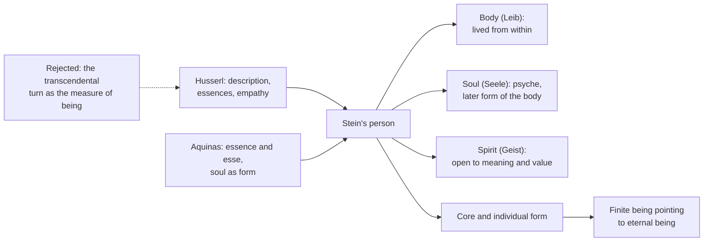

# Phenomenology & Personalism · Lesson 4.4: Stein: the person, and the meeting with Aquinas

> ⏱ ~15 min · Module 4: Values, empathy and the person: Scheler and Stein · Builds on: [4.3 Stein: empathy](04-03-stein-empathy.md), [4.2 Scheler: sympathy, love and the person](04-02-scheler-sympathy-love-and-the-person.md) · Unlocks: [5.1 Wojtyła and Scheler](05-01-wojtyla-and-scheler.md)

## Why this matters

Wojtyła is usually credited with joining phenomenology to Thomism, but Edith Stein had tried it a generation earlier, with Husserl's method in one hand and Aquinas's metaphysics in the other. She also asked the question her teachers had left open: phenomenology can describe how a person shows up, but what *is* the person who shows up? Her answer has three parts: body, soul and spirit, an unchangeable core, and a form that is individual all the way down. It is the bridge this course walks across into [Module 5](05-01-wojtyla-and-scheler.md), and the place where the Thomist and the phenomenologist first had to share one account.

## The idea

**A life in brief (facts only).** Stein was born into a Jewish family in Breslau on 12 October 1891. She studied with Husserl at Göttingen from 1913. She took her doctorate under him at Freiburg in 1916, on empathy, and published it in 1917 ([4.3](04-03-stein-empathy.md)). From 1916 to 1918 she was his assistant, transcribing and editing manuscripts, *Ideas* II among them. Göttingen rejected her habilitation in 1919. In the summer of 1921 she read Teresa of Ávila's autobiography, and she was baptized a Catholic on 1 January 1922. She taught at a Dominican sisters' school in Speyer until 1931 and translated Aquinas's *Disputed Questions on Truth* into German. In 1932 she took a lectureship at Münster, which she lost in 1933 under the regime's anti-Jewish measures. That October she entered the Carmel at Cologne as Teresa Benedicta of the Cross. At the end of 1938 she was moved to the Carmel at Echt in the Netherlands. On 2 August 1942 the Gestapo arrested her there, in the reprisal against Catholics of Jewish descent that followed the Dutch bishops' protest letter ([`church-history` 9.1](../../church-history/lessons/09-01-the-church-and-the-totalitarian-states.md)). She was murdered at Auschwitz, on the usual dating on 9 August 1942. She was beatified in 1987 and canonized on 11 October 1998.

**The early person: two orders in one human being.** The 1917 book already distinguishes layers. The [lived body](../reference.md#lived-body) (*Leib*) is the body as felt from within, the zero-point of orientation ([4.3](04-03-stein-empathy.md)). The **soul** (*Seele*) is not yet the theologian's soul. It is the psyche: the lasting substrate under the stream of experience, with capacities, temperament and vigour that grow and tire. The **spirit** (*Geist*) is the subject as open to meaning and value: it grasps sense, takes positions, and is moved by reasons. Stein marks the difference by the laws each obeys. The empirical person,

> as "nature", is subject to causal laws, as "spirit" [*Geist*], to laws of meaning [*Sinngesetze*]. (translation ours, from the 1917 German)

A fever *causes* irritability. An insult *motivates* anger, and the anger can be understood, judged fitting or not. Behind both sits the [personal core](../reference.md#personal-core) (*Kern*), the Source's subject.

**The 1929 essay.** For Husserl's seventieth-birthday *Festschrift* (1929) Stein wrote "Husserl's Phenomenology and the Philosophy of St Thomas Aquinas", first drafted as a dialogue between the two men and reworked into prose. Paraphrased, it compares rather than opposes. Both hold that philosophy is rigorous work of reason and that truth is objective. They part on four points. Husserl starts from consciousness and, after the reduction ([1.3](01-03-the-epoche-and-the-reductions.md)), builds objectivity from within it. Aquinas starts from being. Stein calls the first philosophy [egocentric and the second theocentric](../reference.md#egocentric-and-theocentric-philosophy), meaning their starting point, not a moral fault. Aquinas also admits faith as a source of truth that natural reason may not ignore, and Husserl does not. Last, Husserl's intuition of essences is not Aquinas's abstraction, though both say the intellect reaches real structures.

**What each tradition lacked, on her reading.** Phenomenology had the finest tools anyone had built for describing experience, but it could not get from how things are given to what they are, and Husserl's transcendental turn made the ego the measure. Stein, like the Göttingen realists, never accepted that turn. Thomism had a metaphysics of being, of essence and *esse* ([`ancient-medieval-philosophy` 7.2](../../ancient-medieval-philosophy/lessons/07-02-aquinas-essence-and-existence.md)), but it worked with concepts handed down rather than tested against experience, and it said little about consciousness from within. Her late project was to put the descriptions inside the metaphysics.

**The late person.** *Finite and Eternal Being* was written in the Cologne Carmel (1935–37 on the usual dating), reworking her habilitation attempt *Potency and Act* (1931). It could not be printed under the regime and appeared only in 1950. Its subtitle calls it an attempt at an ascent to the meaning of being. In it the triad becomes metaphysical (paraphrased): [body, soul, spirit](../reference.md#body-soul-spirit). The soul is now the form of the body in Aquinas's sense ([`ancient-medieval-philosophy` 3.5](../../ancient-medieval-philosophy/lessons/03-05-soul-and-intellect.md)), and it is also an inner centre with depth. Spirit names its openness to the world, to itself and to God. Most distinctive is the [individual form](../reference.md#individual-form). Aquinas held that members of one species share one specific form and are made *this* one by signate matter ([`ancient-medieval-philosophy` 8.3](../../ancient-medieval-philosophy/lessons/08-03-scotus-common-nature-and-haecceity.md)). Stein, drawing on Jean Hering, holds that each human being has an individual essence beyond the common nature. Being Socrates is more than being human plus this matter, and the individuality lies on the side of form. The 1917 core has become a metaphysical principle.

## Source

Stein, *Zum Problem der Einfühlung* (Halle, 1917), Part IV, the section "Seele und Person", pp. 122–125. Stein has said a person's character is shaped by circumstance and could be imagined otherwise. (Translation ours, from the 1917 German; OCR corrected.)

> But this variability is not unlimited; we run up against limits. Not only must the categorial structure of the soul as soul be kept; within its individual shape, too, we come upon an unchangeable core [*Kern*]: the personal structure. I can imagine Caesar in a village instead of Rome, and can think him moved into the twentieth century; his historically fixed individuality would surely undergo many changes, but just as surely he would remain Caesar. [...] So the psychophysical empirical person can be a more or less complete realization of the spiritual one. [...] We may not equate the non-unfolding [*Nicht-Entfaltung*] of the person with non-existence; the spiritual person exists, rather, even when it is not unfolded.

Notice the method: imaginative variation ([1.3](01-03-the-epoche-and-the-reductions.md)) run on a person, and it hits an invariant that is individual, not general. Caesar-in-a-village is still Caesar. That invariant is what the 1930s will call individual form.

## The argument

The spine of *Finite and Eternal Being*, reconstructed and paraphrased: [finite being](../reference.md#finite-and-eternal-being) points to eternal being.

1. **In reflection I am given to myself as being.** *In words:* the starting certainty is "I am", as with Augustine, Descartes and Husserl.
2. **But my being is given as momentary.** Only the present phase of experience is actual; the past phase is no longer, the next is not yet. *In words:* I never hold my being all at once.
3. **I do not give myself being.** I find myself already existing, carried from moment to moment. *In words:* existing is something that happens to me before it is anything I do.
4. **Yet I find myself held in being, not dropped into nothing at each instant.** *In words:* the fragility comes with a felt security.
5. **What is received and held moment by moment depends on what has being wholly and from itself.** *In words:* borrowed being points to a lender.
6. **∴ Finite being points to eternal being: being without becoming, pure act.** *In words:* the ascent ends where Aquinas's metaphysics begins, at subsisting being itself.

**Where the argument is weakest.** Premise 4. Heidegger's analysis finds the same facts of premises 2–3, thrownness, and finds anxiety, not security ([2.3](02-03-the-they-mood-and-care.md)). Stein's book carries an appendix on Heidegger's philosophy of existence, and the question she presses is where the thrownness comes from. A Heideggerian replies that the security is a mood read as evidence, and that the passage from "held" to "held by someone" smuggles in the conclusion. Stein's defender replies that the mood is as much a datum as anxiety is, and that premise 5 does not rest on the feeling alone. Aquinas's argument from essence and *esse* reaches the same lender without it, which is exactly why she wanted both traditions.

## The picture

Two sources feed one person; the dashed edge marks what Stein declined from Husserl. The core is where the 1917 description becomes the later metaphysics.

## Worked examples

**Example 1 (clean): the exhausted translator.** An invented case: after a sleepless night, a translator works on a hard passage. Her *Leib*: heavy limbs, a dull ache behind the eyes, felt as hers and from within. Her *Seele*: low vigour, a short temper, slower uptake; these are *caused* by the sleepless night and will lift with rest. Her *Geist*: she grasps what the author meant, sees that her draft betrays it, and decides to redo it rather than ship it. That decision is *motivated* by the value of getting it right, and it is a position she takes toward her own irritability rather than an effect of it. The core shows in what she finds worth the effort; another tired translator might rightly not care. Every layer is in play, and each obeys its own kind of law.

**Example 2 (hard): advanced dementia.** An invented case: a retired judge no longer recognizes his family and shows no grasp of meaning. On the 1917 account the spiritual person can exist without being unfolded, so the core is undisclosed, not gone. But the same section names one case with no spiritual person at all: someone who feels nothing for himself and takes every feeling from others by contagion. A phenomenology that finds the person by where it is disclosed, in value-feeling, has trouble telling "undisclosed" from "absent". The late Thomist frame answers at once: a rational soul is the form of this body, so a person is there whatever is exercised (compare Boethius in [`metaphysics` 6.5](../../metaphysics/lessons/06-05-what-a-person-is.md)). That answer comes from metaphysics, not from description, and whether Stein's late work is entitled to it is the question the module's boss problem leaves open.

## Watch out

- **You might think *Seele* in the 1917 book is the immortal soul, but there it is the psyche,** a natural substrate subject to causality: fatigue, temperament, vigour. Spirit is the layer of meaning. Only in the 1930s does "soul" also carry Aquinas's sense of the form of the body. Read the early "soul" religiously and the layers collapse.
- **You might think the individual form is Scotus's haecceity, but it is not a bare thisness.** Scotus's individual difference adds no content and cannot be grasped in this life. Stein's individual essence has content: it is *how* this person is human, which empathy and love can catch. Neither is Aquinas's view, which puts individuation in matter.
- **You might think Stein dropped phenomenology when she entered Carmel, but the late work keeps the method,** starting from the given "I am" and from description of the person. What she dropped was the transcendental idealism, and she had never accepted it.

## One-liner

> Stein found by description an unchangeable personal core under body, psyche and spirit, then gave it a home in Aquinas's metaphysics as an individual form: finite, received, and pointing past itself to eternal being.

## Problems

**P1 (🟢) *(Exegetical.)*** Diagnose. An invented memorial-card blurb:

> Edith Stein (1891–1942), born Jewish in Breslau, studied under Martin Heidegger and wrote on empathy. After reading Augustine's *Confessions* she was baptized in 1933 and entered the Carmel at Echt, where she completed *Finite and Eternal Being*, published in 1937. Arrested in 1942, she died at Dachau, and was canonized by John Paul II in 1987.

Find and correct five factual errors. One line each.

**P2 (🟡) *(Exegetical (a) · Evaluative (b).)*** Apply to a hard case. An invented case: Lena, a concert pianist, has a stroke. Her right hand feels heavy and alien, as if not quite hers. For months she is flat and tires quickly. She can still hear in a score exactly what a phrase asks for, and she judges her own playing as falling short of it. She decides to teach and to relearn slowly. (a) Sort these facts into *Leib*, *Seele* (in the 1917 sense) and *Geist*, and say which changes fall under causal laws and which under laws of meaning. 100 words or fewer. (b) Suppose the stroke had also left her unable to feel anything in music. Stein's 1917 text says a layer of the person cannot regress, only be disclosed or not. What does the account say about Lena's musical layer, and where does it stop deciding? Any verdict; 120 words or fewer.

**P3 (🔴) *(Exegetical.)*** Find the crux. Aquinas and the late Stein agree that Lena and her sister are two human beings with one human nature. Name the single premise about what makes each *this* human being that Stein affirms and Aquinas denies, and say what consideration each side would offer. 120 words or fewer.

Solutions

**P1** *(Exegetical, strict.)*

**Must hit, strict:** any five of:

- She studied under **Husserl**, not Heidegger: doctorate at Freiburg (1916, published 1917), then his assistant 1916–18.
- The book behind her conversion was **Teresa of Ávila's autobiography** (summer 1921), not Augustine.
- She was baptized on **1 January 1922**, not in 1933. In 1933 she entered Carmel.
- She entered the Carmel at **Cologne** (October 1933); she was moved to **Echt** only at the end of 1938.
- *Finite and Eternal Being* was written in the Cologne Carmel (1935–37 on the usual dating) and **published posthumously in 1950**.
- She was murdered at **Auschwitz** (on the usual dating 9 August 1942), not Dachau.
- John Paul II **beatified** her in 1987; she was **canonized** on 11 October 1998.

**Wrong turns:** "correcting" Breslau or the dates 1891–1942, both of which are right. Treating the arrest as random; it was the reprisal of 2 August 1942 after the Dutch bishops' letter.

**Model answer:** Husserl, not Heidegger. Teresa of Ávila's *Life*, not the *Confessions*. Baptized 1 January 1922, not 1933. Entered the Cologne Carmel, moving to Echt only in 1938. *Finite and Eternal Being* was published in 1950, after her death. Auschwitz, not Dachau. Beatified 1987, canonized 1998.

---

**P2** *(Exegetical (a) · Evaluative (b).)*

**Must hit, strict (a):**

- *Leib*: the hand felt from within as heavy and alien. That is a change in the lived body, not just in the physical body seen from outside.
- *Seele*: the flatness and quick fatigue, a drop in psychic vigour. These are caused by the stroke, so they fall under causal laws.
- *Geist*: hearing what the phrase asks for, judging her playing against it, deciding to teach and relearn. These are acts of grasping meaning and value and taking positions, motivated rather than caused, so they fall under laws of meaning.

**Must hit, any verdict (b):**

- State what the text says: the layer is undisclosed, not destroyed. The spiritual person exists unfolded or not, and the stroke blocks disclosure.
- Say where it stops deciding: on the 1917 method a person's layers are found where they are disclosed in value-feeling, so nothing in the description can tell an undisclosed layer from an absent one.
- Say what would settle it, and whether the answer is still phenomenology: a metaphysical claim (the late individual form) or a later recovery of the feeling.

**Wrong turns:** filing the flatness under *Geist* because it is "emotional". For Stein mood and vigour belong to the psyche; spirit is the layer of meaning and value. Saying the stroke "damaged her spirit". On the text the spirit is not subject to causal laws at all, so the stroke can only hinder its expression.

**Model answer (b), one of several:** Stein's text says the musical layer cannot regress, only fail to be disclosed, so it is still there, unfolded no longer. That is a striking claim, and the 1917 method strains to earn it. Her evidence for any personal layer is its disclosure in value-feeling. Once the feeling is gone, the description has nothing to tell "undisclosed" from "absent", and the case for the layer rests on a structural thesis about persons, not on anything given. Recovery would vindicate her; permanent loss could not refute her. The late Stein can say the individual form persists whatever is exercised, but that is a metaphysical answer to a question description raised and could not settle.

---

**P3** *(Exegetical, strict.)*

**Accept:** any formulation that locates the disagreement in whether individuality belongs to the form itself.

**Must hit, strict:**

- The premise: **each human being has an individual form or essence, more than the common nature, so that what makes Lena this one lies on the side of form.** Stein affirms it; Aquinas denies it, holding that members of one species share one specific form and are individuated by signate matter.
- Aquinas's consideration: a form received in matter is many by being in many portions of matter; that is why each angel, having no matter, is its own species (ST I q.50 a.4).
- Stein's consideration: the person's unique character is given in experience (the 1917 core that survives every imagined variation, what empathy and love catch). Matter, the same potency everywhere, cannot account for a difference in *how* someone is human.

**Wrong turns:** naming the soul's immortality or the body–soul union as the crux; both sides affirm them. Equating Stein's view with Scotus's contentless haecceity.

**Model answer:** The crux is whether each human being has an individual form, an essence of *this* person beyond the shared human nature. Stein affirms it. Aquinas denies it: one species, one form, and individuals are made this one by signate matter, which is why an immaterial angel must be its own species. Aquinas can offer the economy of explaining many individuals by one form received in many matters. Stein can offer the phenomenological datum: a person's unique character survives every imagined variation of circumstance, as Caesar stays Caesar in a village, and a common potency like matter cannot explain a difference in how someone is human.

## Flashback

**From Lesson [4.2](04-02-scheler-sympathy-love-and-the-person.md) (Scheler: sympathy, love and the person):** *(Exegetical.)* Counterexample. An invented study note states three principles. Refute each with a fresh case of your own, and name in Scheler's terms what the case shows. Two sentences each.

(i) "When two people feel the same sorrow and each knows the other feels it, they are feeling with one another."

(ii) "Whoever grasps exactly what another person feels has fellow-feeling for her."

(iii) "Love is fellow-feeling at its most intense."

Solution

**Accept:** any case that meets the principle's condition and fails its conclusion for the reason given below.

**Must hit, strict:**

- (i) A case of two parallel feelings plus mutual knowledge, e.g. two bandmates in different cities each learn by email that their album is cancelled, are each dejected, and text each other to say so. That is "A feels it, B feels it, and they know", which is exactly what Scheler says feeling-with-one-another (*Miteinanderfühlen*) is *not*: each one's sorrow is given to the other as an object, whereas in feeling-with-one-another one sorrow is co-felt and neither's feeling is objective for the other.
- (ii) A case of vicarious feeling (*Nachfühlen*) without fellow-feeling, e.g. a poker player reads his opponent's dread exactly and raises, pleased by it. Understanding a feeling is not participating in it; fellow-feeling (*Mitgefühl*) is a second, reactive feeling directed at the other's, and here it is absent or reversed, as in Scheler's cruel man.
- (iii) A case of love toward something that feels nothing, e.g. a mathematician's love of a proof, or a love of music. Love is not a feeling but a spontaneous act, a movement in which a higher value appears, possible toward beauty, knowledge or God; it differs from fellow-feeling in kind, not degree, and founds fellow-feeling rather than growing out of it.

**Wrong turns:** for (i), using two people grieving one loss side by side; that may be genuine feeling-with-one-another and refutes nothing. For (ii), using a case of contagion; catching a feeling is not grasping it as hers, so the principle's condition is not met. For (iii), arguing only that love can be *weaker* than some pity; intensity is not Scheler's criterion.

**Model answer:** (i) Two bandmates in different cities learn their album is cancelled, are each dejected and text each other about it. Each knows the other's sorrow, but each sorrow is an object for the other, which is the structure Scheler contrasts with feeling-with-one-another, where one sorrow is felt together. (ii) A poker player reads his opponent's dread precisely and enjoys pressing on it. He has vicarious feeling without fellow-feeling: understanding a feeling is not reacting to it with a feeling of one's own. (iii) A mathematician loves a proof. There is no feeling in the proof to share, so love is not fellow-feeling at any intensity: it is an act aimed at value, and it founds fellow-feeling rather than being its highest grade.

## Connections

- **Backward:** the *Leib* and empathy of [4.3](04-03-stein-empathy.md); Scheler's person as concrete unity of acts and his ranking of values ([4.2](04-02-scheler-sympathy-love-and-the-person.md)), which Stein's value-disclosed core inherits. The reduction she declined is [1.3](01-03-the-epoche-and-the-reductions.md). Aquinas on essence and *esse* is [`ancient-medieval-philosophy` 7.2](../../ancient-medieval-philosophy/lessons/07-02-aquinas-essence-and-existence.md); individuation by signate matter and Scotus's alternative are [8.3 there](../../ancient-medieval-philosophy/lessons/08-03-scotus-common-nature-and-haecceity.md).
- **Forward:** [5.1](05-01-wojtyla-and-scheler.md) takes the same road from Scheler to Aquinas, with Wojtyła's own objection. The question whether phenomenology and Thomism make a synthesis or a juxtaposition returns in [5.5](05-05-integration-participation-and-the-bridge.md). [`thomistic-synthesis` 6.4](../../thomistic-synthesis/lessons/06-04-transcendental-thomism-and-the-ressourcement-quarrel.md) places Stein and the Lublin school among Thomism's twentieth-century continuations.
- **Sideways:** whether a person is present when no personal capacity is exercised is the metaphysical question of [`metaphysics` 6.5](../../metaphysics/lessons/06-05-what-a-person-is.md). The events of 1942 as church history are [`church-history` 9.1](../../church-history/lessons/09-01-the-church-and-the-totalitarian-states.md).
