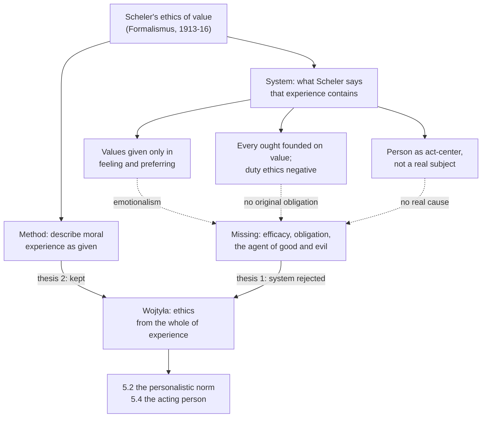

# Phenomenology & Personalism · Lesson 5.1: Wojtyła and Scheler

> ⏱ ~15 min · Module 5: Wojtyła: the acting person · Builds on: [4.1 Scheler: values given in feeling](04-01-scheler-values-given-in-feeling.md), [4.2 Scheler: sympathy, love and the person](04-02-scheler-sympathy-love-and-the-person.md) · Unlocks: [5.2 The personalistic norm](05-02-the-personalistic-norm.md), [5.4 Action reveals the person](05-04-action-reveals-the-person.md)

## Why this matters

In 1953 a young Kraków priest qualified to hold a chair with a thesis whose title was a question: could a Christian ethics be built on the assumptions of Max Scheler's system? Karol Wojtyła's answer was no, with a rider. The no became the critique that runs through everything he later wrote as a philosopher. The rider became his method. *Love and Responsibility* talks about "use", and *The Acting Person* starts from the experience "I act". Both begin here, in Wojtyła's judgment that Scheler saw values better than anyone and still lost the person who acts.

## The idea

**The formation.** Wojtyła was ordained on 1 November 1946 and sent to Rome, to the Angelicum, where he worked under the Dominican Réginald Garrigou-Lagrange, the strict-observance Thomist of [thomistic-synthesis 6.3](../../thomistic-synthesis/lessons/06-03-strict-observance-and-existential-thomism.md). His 1948 doctorate in theology was on faith in St John of the Cross. Back in Kraków he wrote the habilitation (the second, chair-qualifying thesis) on Scheler. It was accepted in 1953 and published in Lublin in 1959 as *An Evaluation of the Possibility of Constructing a Christian Ethics on the Assumptions of Max Scheler's System*. From 1954 he lectured at the Catholic University of Lublin (KUL), and in 1956 he became associate head of its Chair of Ethics. So he came to Scheler as a Thomist.

**What he found.** Recall [4.1](04-01-scheler-values-given-in-feeling.md) and [4.2](04-02-scheler-sympathy-love-and-the-person.md). For Scheler, values (*Werte*) are objective qualities given in intentional feeling (*Wertfühlen*) and ranked in preferring. The [hierarchy of values](../reference.md#hierarchy-of-values) runs from the pleasant through the vital and the spiritual to the holy. Moral value is never the direct target of an act: "good" and "evil" appear when we realize some *other* value, higher or lower. The person is no substance and no object, but the concrete unity of the acts it performs ([person as act-center](../reference.md#person-as-act-center)). And every ought rests on a value (the Source).

**Method versus system.** Wojtyła's verdict depends on a distinction he drew between two things in Scheler.

- **The method** is phenomenology as a discipline ([1.3](01-03-the-epoche-and-the-reductions.md)). You describe what is given in experience exactly as it is given, here moral experience from the inside: being bound, choosing, being ashamed.
- **The system** is the set of theses Scheler drew from that description: emotional intuition of values, an a priori ranking, the ought derived from value, the person as act-center.

The thesis ends with two conclusions (1959 edition, pp. 118 and 122, as Piotr Mazur reports them). First, Scheler's system is, in Tadeusz Biesaga's rendering, "fundamentally unsuitable" for a scientific interpretation of Christian ethics. Second, it can still help such work, because its method lets one study ethical facts from the side of experience. Wojtyła rejected the system and kept the method ([Wojtyla on Scheler](../reference.md#wojtyla-on-scheler)).

**The charge.** Why unsuitable? Biesaga's reading of the thesis finds one root with three shoots. The root: Christian ethics holds that the person is the agent of the moral good and evil of his own acts, and Scheler's system cannot express that.

- **Emotionalism.** For Scheler, feeling is cognitive: it grasps real values, so the charge is not that he made ethics subjective. The charge is that in his ethics the moral life happens *in* feeling, as reception. Feeling a value, even preferring it, is not yet choosing it, being bound by it, or doing it.
- **No efficacy.** When I act I experience myself as the one who brings the act about. Its moral goodness or badness then becomes mine: I become good or bad by it. Wojtyła held that an act-center which exists only in performing its acts cannot be that real cause ([efficacy](../reference.md#efficacy)).
- **No obligation.** Scheler derives every ought from value and calls ethics built on duty negative. Wojtyła takes the norm, the "I must" of conscience, as a datum in its own right. It takes up the value, but adds a claim on my freedom that no felt height of value contains.

The anti-Pharisee thesis shows the conflict sharpest. Scheler writes (Part II, section V; translation ours, from the 1916 German):

> Whoever strives for the joy that clings to good willing, and for that reason wills "the good", no longer wills well.

Wojtyła's reply: Scheler confuses aiming at the good with aiming at the satisfaction of being good. Wanting to be good is not vanity, and it is exactly what conscience asks of me.

This is not Kant reinstated. On Biesaga's reading, Wojtyła answers both apriorisms at once. Kant gave obligation without material values ([ethics 2.1](../../ethics/lessons/02-01-the-good-will-and-acting-from-duty.md)); Scheler gave values without obligation ([Scheler against formalism](../reference.md#scheler-against-formalism)). The circle of Thomists at KUL among whom he worked is now called the [Lublin school](../reference.md#lublin-school). Wojtyła was the member who insisted on starting from the description of experience.

## Source

Scheler, *Der Formalismus in der Ethik und die materiale Wertethik*, Part II, section IV ("Value ethics and imperative ethics"), *Jahrbuch für Philosophie und phänomenologische Forschung* II (1916). Translation ours, from the 1916 German.

> The ought [*das Sollen*] is always founded on a value, considered with respect to its possible real being. Insofar as this and only this is the case, we shall speak of an "ideal ought" [*ideales Sollen*]. Opposed to it is the "ought" that is considered, besides, in relation to a possible willing that would realize its content (the "ought of duty" [*Pflichtsollen*]). The first is meant, for example, in the sentence "Injustice ought not to be"; the second in the sentence "You ought not to do injustice." In no way, then, does value consist in something's being what ought to be. [...] From this we see that every imperative ethics, that is, every ethics that starts from the thought of duty as the most original moral phenomenon and only from there seeks to win the ideas of good and bad, of virtue and vice, has from the outset a merely negative, critical and repressive character.

Notice the direction of founding: value first, ideal ought on value, duty-ought on ideal ought plus a will. Just before the last sentence, Scheler adds that an imperative arises only where striving is not already directed at the value. Duty marks resistance. That is the ordering Wojtyła reverses ([ideal ought and duty ought](../reference.md#ideal-ought-and-duty-ought)).

## The argument

Wojtyła's verdict, reconstructed from Biesaga's and Mazur's readings of the 1959 text.

1. **A Christian ethics must express that the person is the agent of the moral good and evil of his acts.** *In words:* the moral quality of an act belongs to the one who does it.
2. **Phenomenological description of moral experience, done fully, finds efficacy ("I am bringing this about") and obligation ("I must") among its data.** *In words:* the method, applied to the whole experience, shows agency and being bound.
3. **Scheler's system confines moral experience to the intentional feeling and preferring of values, founds every ought on value, and makes the person a unity of acts rather than a real subject.** *In words:* he described one slice and built the system on it.
4. **A system so confined cannot express real efficacy or original obligation.**
5. **∴ Scheler's system is unsuitable for a Christian ethics (thesis 1).**
6. **By 2, the method is not the source of the failure, and it gives access to moral experience that a purely deductive ethics lacks.** **∴ The method is usable (thesis 2).**

**Where the argument is weakest.** Premise 2. A Schelerian denies that description *finds* obligation as original. The Source analyses the experienced "I must" as derivative: it is the ideal ought of a value plus the resistance of a will, and its prominence signals moral weakness, not depth. A phenomenologist of any school adds that "I am the real cause" goes past the given: description yields the *experience* of agency, and whether a real subject causes the act is a metaphysical question the epoché brackets. The defender's reply concedes the second point and turns it. Wojtyła held the method necessary but not sufficient, which is why he joined it to Thomist metaphysics ([5.5](05-05-integration-participation-and-the-bridge.md)). On the first point he answers that the norm absorbs the value but is something new. A shortfall of inclination does not create a claim that binds my freedom. Whether that claim is given or constructed is the issue *The Acting Person* takes up ([5.4](05-04-action-reveals-the-person.md)).

## The picture

Solid arrows show what Wojtyła takes over. Dashed arrows show his charge against each thesis of the system.

## Worked examples

**Example 1 (clean: the cyclist).** An invented case. Marek is cycling home late when a child on a scooter falls hard on the path ahead. He stops, kneels, and stays until the child's mother arrives, missing his train.

*Scheler's description.* Marek feels the child's pain and danger as a negative vital value, and feels the child as a person. He prefers helping (vital and personal values) to his own comfort (the pleasant). His act realizes the higher value, and on that act the moral value "good" appears. Marek does not aim at it, and if he stopped *in order to be good*, the footnote above says his willing would lose its goodness. He feels no "I must", because his striving went straight to the value. For Scheler that is no lack: duty enters only where striving resists.

*Wojtyła's description.* Same data, plus three more. Marek experiences the claim before he moves: "I can't ride past." He experiences himself as the one stopping: he is not swept off the bike by a feeling. And afterwards the act is *his*: he is the one who helped, and that goodness qualifies him, not just the event. Both accounts fit this case. They differ on what is doing the moral work.

**Example 2 (hard: the resolution).** Also invented. Irena notices she has grown self-absorbed. She resolves to visit her lonely neighbour every Sunday, explicitly "to become a less selfish person". For months the visits are dutiful, not warm.

Scheler's frame flags two things. Willing "to become good" looks like the Pharisaic structure the footnote condemns. And the dutifulness shows a striving not yet directed at the value, which is the negative, repressive moment of the Source. Wojtyła's frame reads the same facts the other way. Irena is the agent of her own moral formation. Self-determination by a norm she recognizes is the centre of ethics, not a fault in it ([5.4](05-04-action-reveals-the-person.md) names this self-determination).

Here the description strains. Nothing in the visits themselves settles whether Irena aims at the neighbour's good or at the satisfaction of being good. Both theories need a fact about the *direction* of her intention that the visits do not display.

## Watch out

- **You might think "emotionalism" means Scheler made values subjective feelings, but actually Scheler is a value realist.** *Wertfühlen* is an intentional act that grasps objective values, as perception grasps colours. Wojtyła grants this. His charge is narrower: moral life reduced to receiving values, without choosing, being bound, or causing.
- **You might think Wojtyła rejected phenomenology, but actually he rejected Scheler's system and kept the method (thesis 2).** His later work is phenomenological description joined to Thomist metaphysics. That join is the question of [5.5](05-05-integration-participation-and-the-bridge.md).
- **You might read "efficacy" as effectiveness, but actually it means the experienced fact that I cause my act.** A failed rescue has full efficacy in this sense. The term contrasts "I act" with "something happens in me", not success with failure ([man acts and something happens](../reference.md#man-acts-and-something-happens)).

## One-liner

> Wojtyła kept Scheler's way of looking and rejected what Scheler saw: an ethics of felt values with no one who causes the act and no one who is bound by it.

## Problems

**P1 (🟢) *(Exegetical (a) · Exegetical (b).)*** Apply to a hard case. Three weeks ago Lena promised to help her brother move flat on Saturday. On Friday a client offers her a well-paid half-day job for Saturday. She feels the pull of the money and no warmth toward the move, which will be tedious. She goes anyway, thinking "I said I would."

(a) Describe the case in Scheler's terms. Say which values are in play and how they rank, which kind of ought Lena experiences according to the Source, and where the moral value of her act lies. 100 words or fewer.
(b) Say what Wojtyła holds this description leaves out, in his terms. 80 words or fewer.

**P2 (🟡) *(Exegetical (a) · Evaluative (b).)*** Find the crux. Two invented seminar positions:

> **Rina:** Wojtyła cannot take Scheler's method and leave his system. The emotionalism is not a theory laid over the description; it is what you find when you describe moral experience honestly. And "I am the real cause of this act" is a metaphysical claim the method brackets.
>
> **Tomasz:** The method is a way of looking, not a set of results. Scheler turned it on one slice of moral experience, the feeling of values, and stopped. Turned on the whole experience of acting, it finds obligation and agency too.

(a) Name the single premise on which they part. Two sentences or fewer. (b) Say what kind of description would move that premise either way, then give your verdict. Any verdict; 120 words or fewer.

**P3 (🔴) *(Exegetical.)*** Diagnose. An invented study-guide paragraph:

> As a young priest, Wojtyła wrote his Rome doctorate under Garrigou-Lagrange on Max Scheler. He concluded that phenomenology is useless for Christian ethics, because Scheler denies that values are objective and reduces them to feelings. Having rejected phenomenology, Wojtyła went back to Kant: ethics starts from duty, and value comes second.

Name four errors and correct each. One sentence each.

Solutions

**P1** *(Exegetical (a) · Exegetical (b))*

**Accept:** any ranking that places the value realized by keeping the promise (fidelity, the right, the brother as person) above the fee's value (the pleasant), with the reason given in Scheler's terms. Naming the fee's value as the pleasant or as the useful is fine.

**Must hit, strict (a):**

- The fee bears a value of the lowest rank, the pleasant (the comforts money buys). Keeping faith realizes a higher value, spiritual (the right) and personal. Lena prefers the higher.
- The ideal ought ("the promise's being kept ought to be") is founded on that value. What Lena experiences, "I said I would" against her inclination, is the ought of duty: the ideal ought in relation to a will whose striving is not already directed at the value.
- The moral value "good" appears with her act of realizing the higher value over the lower. It is not what she aims at.

**Must hit, strict (b):**

- Obligation as an original datum: the "I must" of conscience binds her freedom. It is not a derivative sign of resistance.
- Efficacy: she experiences herself as the one who brings the act about.
- The moral good of the act becomes hers: she is its agent, and it qualifies her as a person.

**Wrong turns:** saying Wojtyła thinks Scheler misses the value of fidelity. Scheler sees the value; what Wojtyła says is missing is the agent and the obligation. Saying Wojtyła wants her to act from duty *instead* of value. On his view the norm takes up the value.

**Model answer:** (a) The fee offers the pleasant, the lowest rank. The kept promise realizes the right and honours her brother as a person, both higher, and she prefers them. "The promise ought to be kept" is an ideal ought founded on that value. Her "I said I would" is the ought of duty, which arises because her striving is not already directed at the value. The moral value "good" appears with her act of preferring the higher value, and she does not aim at it. (b) Wojtyła says this leaves out the agent. Lena experiences a binding "I must" that is more than a sign of resistance. She experiences herself as causing the act, and by it she becomes good. Its moral value is hers.

---

**P2** *(Exegetical (a) · Evaluative (b))*

**Must hit, strict (a):**

- The crux is whether efficacy and original obligation are *given* in moral experience, so that faithful description can find them, or are interpretations added to it.
- Both sides agree that the method describes what is given and that values are given in feeling. Neither disputes Scheler's value realism.

**Must hit, any verdict (b):**

- Name a contrast that would test it: for example, deciding versus being swept along, or being bound versus being pressed by inclination. Say whether the difference shows up in the experience without a causal theory.
- Rina wins if every "I did it" can be redescribed as felt ownership compatible with no real causing. Tomasz wins if the contrast is a datum that resists that redescription.
- Notice that Rina's last sentence is partly Wojtyła's own view: he held the method necessary but not sufficient, and went to metaphysics for the real subject.

**Wrong turns:** making the crux whether Thomism is true, or whether values are objective. Those are not where Rina and Tomasz disagree. Treating the verdict as settled by Wojtyła's later work; that work is the attempt, not the proof.

**Model answer (b), one of several:** Compare deciding to stop for an injured child with being startled into stopping. If careful description shows a difference that belongs to the experience itself, an "I" who brings the act about versus a reaction that happens in me, then efficacy is a datum and Tomasz is right that Scheler stopped short. If the difference reduces to a feeling of ownership, and a felt "I did it" is equally present when no real causing occurs, Rina is right that description cannot reach real efficacy. My verdict: Tomasz wins on *experienced* agency, Rina on *real* causation. Wojtyła effectively grants both, since he needs metaphysics for the second step.

---

**P3** *(Exegetical)*

**Must hit, strict:** any four of:

- The 1948 Rome doctorate under Garrigou-Lagrange was on faith in St John of the Cross. The Scheler thesis was the habilitation, accepted in Kraków in 1953 and published in 1959.
- He did not find phenomenology useless. Thesis 2 says Scheler's system, though unsuitable, can help because its method studies ethical facts from experience.
- Scheler does not make values subjective. They are objective and given in intentional feeling. The charge is that his ethics lacks efficacy and obligation.
- He did not reject phenomenology. He kept the method and rejected the system, and his later work joins that method to Thomist metaphysics.
- He did not go back to Kant. He answered both Kant's duty without values and Scheler's values without duty. For him the norm takes up the value rather than replacing it.

**Wrong turns:** calling "rejected Scheler's system" an error. That part is accurate; the error is extending it to the method. Correcting the date to the publication year only, as if the defence and the publication were the same event.

**Model answer:** (1) The Rome doctorate (1948) was on faith in St John of the Cross; the Scheler study was the 1953 Kraków habilitation. (2) His conclusion was that Scheler's *system* is unsuitable but its method can help in studying ethical facts from experience. (3) Scheler is a value realist; Wojtyła's charge is that his ethics has no real agent and no original obligation, not that values are subjective. (4) He went to neither pole: Kant has duty without value and Scheler value without duty, and Wojtyła holds that the norm takes up the value.

## Flashback

**From Lesson [4.3](04-03-stein-empathy.md) (Stein: empathy):** *(Exegetical.)* Apply to a hard case. In a cup final a striker misses the deciding penalty. Four people in the stadium:

- **Ana**, a fan of the other club, sees his shoulders sag and grasps his devastation, his and not hers. She is delighted.
- **Ben**, a small child who was looking at his snack, starts to whimper as the stand around him groans.
- **Carla** cannot see the striker's face, because he has turned away. She pictures herself at the spot before a full stadium, feels the dread and shame that come, and concludes that this is what he feels.
- **The striker's mother**, who cares nothing for football, sees his devastation and is herself dismayed at the miss, for his sake.

Classify each in Stein's terms, and for each that is not empathy, say what it fails to give. One sentence each.

Solution

**Must hit, strict:**

- *Ana:* empathy (*Einfühlung*). Her act is primordial; its content, his devastation, is non-primordial for her and given as primordial for him. Her delight is a separate primordial feeling of her own, since empathy requires no sharing or sympathy.
- *Ben:* emotional contagion (*Gefühlsübertragung*). The feeling is his own, caught from the groans; he grasps no one's experience, so it has no cognitive function.
- *Carla:* Adam Smith's procedure, which Stein calls a substitute that may step in when empathy fails. She puts the striker aside, surrounds herself with his situation, and credits him with what it produces in her, so what she grasps is her own imagined dread, not his experience given as his.
- *The mother:* *Mitfühlen*. It is her own primordial dismay at what dismays him (the miss), resting on her empathy of his devastation; the empathy is there, but the dismay is a further act built on it.

**Wrong turns:** denying Ana empathy because she feels no sympathy; that reads *Einfühlung* in its everyday warm sense. Calling Carla's act empathy because she "puts herself in his place": in empathy I am *with* him while the experience stays his, whereas Carla replaces him with herself, and that holds even if her guess happens to be right. Calling the mother's dismay the empathy itself; it is her own primordial feeling. Calling Ben's whimper empathy because others' expressions caused it.

**Model answer:** Ana empathizes: his devastation is given to her, non-primordially, as primordially his, and her delight is a feeling of her own. Ben is caught by contagion, which gives him a mood of his own and nothing of anyone else's. Carla uses Smith's substitute, imagining herself in the striker's situation and handing him the result, so she reaches her own imagined feeling, not his. The mother's dismay is *Mitfühlen*, her own grief at what grieves him, built on empathy but not identical with it.

## Connections

- **Backward:** Scheler's values, hierarchy and case against formalism are [4.1](04-01-scheler-values-given-in-feeling.md); the person as act-center is [4.2](04-02-scheler-sympathy-love-and-the-person.md). The method Wojtyła keeps is the descriptive discipline of [1.3](01-03-the-epoche-and-the-reductions.md). Stein's earlier route from Husserl to Aquinas is [4.4](04-04-stein-the-person-and-aquinas.md). Wojtyła's Roman teacher is in [thomistic-synthesis 6.3](../../thomistic-synthesis/lessons/06-03-strict-observance-and-existential-thomism.md), and the Lublin school is placed among the post-manual Thomisms in [thomistic-synthesis 6.4](../../thomistic-synthesis/lessons/06-04-transcendental-thomism-and-the-ressourcement-quarrel.md).
- **Forward:** the personalistic norm ([5.2](05-02-the-personalistic-norm.md)) is the obligation Scheler lacked, stated as a norm about persons. Efficacy and self-determination are developed in [5.4](05-04-action-reveals-the-person.md), and whether phenomenology and Thomism really join is [5.5](05-05-integration-participation-and-the-bridge.md). The anthropology of [moral-theology 4.4](../../moral-theology/lessons/04-04-veritatis-splendor.md) starts here.
- **Sideways:** Wojtyła's efficacy is a first-person cousin of agent-causal libertarianism ([metaphysics 6.4](../../metaphysics/lessons/06-04-libertarianism-and-its-critics.md)). He claims it is experienced, where agent-causalists posit it. The Kant he refuses to return to is [ethics 2.1](../../ethics/lessons/02-01-the-good-will-and-acting-from-duty.md).
