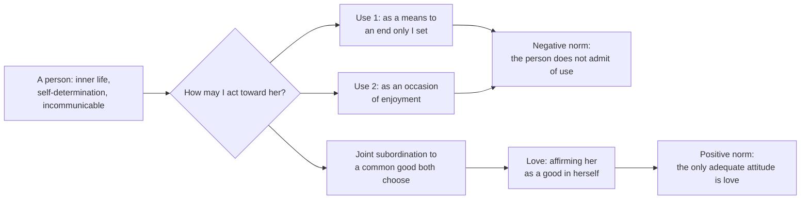

# Phenomenology & Personalism · Lesson 5.2: The personalistic norm

> ⏱ ~15 min · Module 5: Wojtyła: the acting person · Builds on: [5.1 Wojtyła and Scheler](05-01-wojtyla-and-scheler.md), [`ethics` 2.3 Humanity, autonomy, and the lie](../../ethics/lessons/02-03-humanity-autonomy-and-the-lie.md) · Unlocks: [5.3 The anatomy of love](05-03-the-anatomy-of-love.md)

## Why this matters

"Don't use people" is the most common moral sentence there is. Kant gave it a formula. In *Love and Responsibility* (1960; Polish *Miłość i odpowiedzialność*), Karol Wojtyła takes that formula and asks two further questions. What exactly is "use"? And what is the *right* way to stand toward a person, since merely not using her can't be the whole of it? His answer, the [personalistic norm](../reference.md#personalistic-norm), is the philosophy behind John Paul II's later moral teaching. [`moral-theology` 6.1](../../moral-theology/lessons/06-01-the-theology-of-the-body-and-chastity.md) assumes it from this lesson. It also states its own claim against both Kant and the utilitarians.

## The idea

Chapter I of the book, "The Person and the Sexual Urge," opens with a section called "Analysis of the Verb 'to Use'." The order is deliberate. Before talking about love, Wojtyła wants to be exact about its opposite. (Cited by section title from Willetts's 1981 translation; Ignatik's 2013 translation sometimes renders terms differently. Everything here is paraphrase.)

**Someone, not something.** A person (*osoba*) differs from every other being in having an inner life. She knows and wills, and she decides her own ends. Wojtyła calls this [self-determination](../reference.md#self-determination), which 5.4 develops at length. It makes her [incommunicable](../reference.md#incommunicability) (*incommunicabilis*): nobody else can will in her place. You can carry her bag, but you can't do her choosing. Wojtyła also insists that a person is the *object* of others' actions, not only their subject: employers act on workers, officers on soldiers, parents on children. Scheler had said the person is never an object ([4.2](04-02-scheler-sympathy-love-and-the-person.md)). Wojtyła rejects that, and it is where his ethical problem begins.

**[Two senses of "use"](../reference.md#two-senses-of-use).** The Polish *używać* carries both.

1. **Use as means.** To use something is to employ it as a means to an end, with the end set by the user. That is fine for a hammer. It becomes a problem when the thing is someone who has ends of her own. Restating Kant's Formula of Humanity in his own words, Wojtyła says that whenever a person is the object of your action, you may not treat her as merely a means or instrument, and you must allow that she has, or should have, ends of her own. He adds a pointed remark: not even God uses a person this way. In making her free, the Creator lets her know the ends he intends, so that she can take them up as her own.
2. **Use as enjoyment.** To use is also to *enjoy*, to treat something as an occasion of pleasure. Pleasure normally comes with action. Making it the *end* of how I act toward a person reduces her to its source. This is the sense that matters most in the sexual sphere the book goes on to treat. The sense is broader than that, though: anyone kept around only for how he makes me feel is used in it.

**The way out of use: a common good.** Wojtyła's section title is "'Love' as the Opposite of 'Using'". The employer, the officer and the parent each direct others toward ends. They escape using them when both sides know an end, choose it, and *subordinate themselves to it together*. A shared good turns one person's instrument into a fellow worker. On his account, the bond it creates is closer to love than to use.

**Against utilitarianism.** If the good is pleasure (as in [`ethics` 1.1](../../ethics/lessons/01-01-classical-utilitarianism.md)), then on Wojtyła's reading persons become means to pleasure, their own or someone else's. Two people who agree to please each other have reached only a harmony of two egoisms. It lasts as long as their interests coincide and dissolves when they diverge. Pleasure is subjective and passing, so it can't be the objective common good that holds persons together.

**The norm.** In Willetts's rendering, the negative form says the person is a good that "does not admit of use." The positive form says the person is a good toward which "the only proper and adequate attitude" is love. Wojtyła presents the norm as the philosophical justification for the Gospel's commandment of love. The commandment says *love persons*, and the norm says *why*.

## The argument

Reconstructed from chapter I, in his terms:

1. **A person has an inner life: she knows, wills and sets her own ends (self-determination), and no one can will for her (incommunicability).** *In words:* she is a someone, not a something.
2. **To use (sense 1) is to subordinate a being to an end that the user alone sets.** *In words:* instruments don't get a vote.
3. **A being that sets its own ends cannot be subordinated to ends that are not hers without a violation of what she is.** *In words:* making a chooser into a tool contradicts her nature.
4. **To use (sense 2) is to make a being's capacity to give pleasure the end of my action toward it.** *In words:* she becomes the source of my good feeling.
5. **∴ (Negative norm) The person is a good that does not admit of use in either sense.**
6. **Persons can rightly act on and with each other when they are jointly subordinated to a common good both know and choose.** *In words:* shared ends, not my ends, make cooperation legitimate.
7. **The fitting response to a being is fixed by what it is, and the fitting response to a self-determining someone is to affirm her as a good in herself.** *In words:* respond to her as what she is.
8. **∴ (Positive norm) The only proper and adequate attitude toward a person is love.**

Steps 1–5 track Kant closely, and Wojtyła means them to. Steps 6–8 are his own. Step 6 gives a positive account of how persons can cooperate without use. Steps 7–8 say that the response a person calls for is love, not only respect.

**Where the argument is weakest.** Step 8, and the word "only." Kant objected in advance (*Groundwork* I, Ak 4:399, paraphrased). Love as an inclination cannot be commanded. The scriptural command to love even an enemy must therefore mean *practical* love, beneficence done from duty, not *pathological* love, which is love as a feeling. On that view a norm whose positive content is love either asks for a feeling no one can produce on demand, or it collapses into Kantian beneficence, and the "only" adds nothing. A liberal critic adds that strangers owe each other respect and fairness, not love, so making love the *only* adequate attitude erases the difference between justice and friendship. The defender's reply is that Wojtyła's love is not a feeling at all. As [5.3](05-03-the-anatomy-of-love.md) shows, it is an act of will: goodwill toward the person and affirmation of her value. That can be commanded, as any act of will can. And it differs from beneficence because what it affirms is the *person*, not the good done to her. Whether that reply keeps "love" doing work that "respect" doesn't is exactly what is in dispute.

The utilitarian has a reply too. Mill's standard is the general happiness, not the agent's own (*Utilitarianism* ch. 2). "A harmony of egoisms" describes hedonistic egoism, not impartial utilitarianism. The defender answers that impartiality makes things worse: each person becomes a *site* of pleasure to be summed, which is the use relation spread across everyone (compare [`ethics` 1.3](../../ethics/lessons/01-03-justice-and-the-separateness-of-persons.md) on the separateness of persons).

## Picture

*Read the figure left to right. A person can be the object of three kinds of action: two forms of use, which the negative norm rules out, and joint pursuit of a common good, which leads toward love, the content of the positive norm.*

## Worked examples

**Example 1 (clean case: the choir).** A director prepares an amateur choir for a charity concert. She chooses the music, sets rehearsals and corrects singers in front of everyone. In sense 1, she plainly directs them toward an end. But the singers know the end, the concert, and chose to join for it. She subordinates herself to it as much as they do. That is Wojtyła's common good, and step 6 clears it. Now change one fact. Suppose the "concert" is really a recording she will release under her own name, and the singers are told nothing. Now the end is hers alone, they can't choose it because they don't know it, and they have become her instruments: use in sense 1. Kant's formula gives the same verdict through deception ([`ethics` 2.3](../../ethics/lessons/02-03-humanity-autonomy-and-the-lie.md)). Wojtyła's diagnosis is that the *common good* has gone. Finally, take a tenor who stays in the choir only because singing beside the soprano flatters his voice, and who would leave the week she does. He doesn't direct her toward any end, but she has become the occasion of his satisfaction: use in sense 2.

**Example 2 (hard case: the co-founders).** Two engineers start a company. At the outset they agree, openly and in writing: *we are in this for the sale; when it is sold, we part, and neither expects friendship.* Each uses the other's skills, and each knows it. Run the norm. Sense 1? No. The end, the sale, is known to both, chosen by both and served by both, and that is the structure step 6 calls a common good. Sense 2? No, since neither is there for the other's company. The negative norm is satisfied.

The positive norm is harder. Must each *love* the other? If love means feeling, nothing in the case requires it, and the demand looks absurd. If love means goodwill, willing the other's good as a person, then the norm asks something the contract doesn't. Suppose the company fails and one founder is ruined. Does the other owe more than the contract's terms? The norm says the adequate attitude is love. It does not say what love requires *between business partners*, and the common-good test (step 6) has already been passed. Here the norm stops deciding. It tells you the attitude but not the duties. Wojtyła's own examples (employer, officer, parent) point the same way: he shows these relationships *can* avoid use, not what love demands inside each one.

## Watch out

- **You might think "use" means any benefit from another person.** For Wojtyła it means subordinating her to ends she doesn't share (sense 1) or making her the source of my pleasure (sense 2). The paid tutor, the employee and the soldier can all avoid it when there is a common good. Reading *używać* in the everyday sense, "rely on," is a misreading.
- **You might think "love" in the positive norm is a feeling.** It is an attitude of the will, affirming the person's value and willing her good, whose elements [5.3](05-03-the-anatomy-of-love.md) analyses. Read as an emotion, the norm becomes Kant's objection to it.
- **You might think "incommunicable" means unable to communicate.** It means *non-transferable*: no one can will in my place, and I can't hand my self-determination to someone else. It is the scholastic sense of the word, and it belongs to the metaphysics of the person ([`metaphysics` 6.5](../../metaphysics/lessons/06-05-what-a-person-is.md)), not to speech.

## One-liner

> Not using a person is Kant's floor. Wojtyła's norm says the floor is set by what a person is, and that the only response that fits her is love.

## Problems

**P1 (🟢) *(Exegetical.)*** For each case, say whether it is use in sense 1, use in sense 2, or neither, and name the feature that decides it. One sentence each.

(a) Mara keeps up a friendship with a former classmate only to get introductions to the partners at his firm, and plans to let it lapse once she is hired. He thinks the friendship is mutual.
(b) Theo visits his elderly neighbour because her stories amuse him. He stops the week they turn repetitive, and nothing else ever drew him.
(c) A tutor and a student agree that the goal is passing a May exam. The tutor is paid and wants a good pass record for her business, and both work toward the exam.

**P2 (🟡) *(Exegetical (a) · Evaluative (b).)*** A lifeguard sees two swimmers in trouble at opposite ends of a beach. She can reach only one in time, and she knows neither of them.

(a) What do the negative and positive forms of the norm require of her toward *each* swimmer? Does swimming toward one use the other in either sense? (b) Is this a counterexample to the norm, or a limit on its scope? Say exactly where it stops determining a verdict, and what work incommunicability does in the case. Any verdict; 150 words or fewer for (b).

**P3 (🔴, optional) *(Exegetical (a) · Evaluative (b).)*** An invented opinion column: *"Wojtyła's 'personalistic norm' is just Kant with Catholic vocabulary. Kant said never treat humanity merely as a means; Wojtyła says never use a person. Swap the nouns, add 'love' for decoration, and there you have it."*

(a) Say what the column gets right, and name two things in chapter I that it leaves out. 100 words or fewer. (b) Take the charge of "Catholic vocabulary" seriously. Does any step of Wojtyła's case depend on a theological claim? Name the likeliest candidate and say whether the argument for the negative norm survives without it. Any verdict; 150 words or fewer.

Solutions

**P1** *(Exegetical — strict.)*

**Must hit, strict:**

- (a) **Sense 1.** The friend is subordinated to an end only Mara sets and he doesn't know. With no common good, the friendship is an instrument.
- (b) **Sense 2.** The neighbour has become an occasion of Theo's enjoyment, and the visits end when the pleasure does.
- (c) **Neither.** The exam is a common good that both know and choose and both serve. The tutor's pay and reputation don't turn it into use, any more than wages do for Wojtyła's employer.

**Wrong turns:** calling (c) use because the tutor benefits. Benefit isn't the test; subordination to an unshared end is. Calling (b) sense 1: Theo directs the neighbour toward no end, and the wrong lies in pleasure as the point.

**Model answer:** (a) Sense 1: an end only she sets and he can't choose. (b) Sense 2: she is valued only as a source of amusement. (c) Neither: a common good jointly chosen and jointly served.

---

**P2** *(Exegetical (a) · Evaluative (b).)*

**Must hit, strict (a):**

- Negative norm: she uses neither swimmer. Failing to reach someone is not subordinating her to my ends or enjoying her.
- Positive norm: goodwill, affirming the good of *both*. She can satisfy it toward the swimmer she cannot reach, by willing his rescue and trying for the closer chance, without reaching him.

**Must hit, any verdict (b):**

- Name the gap: the norm governs the *attitude* toward each person, and the choice *between* persons needs a further criterion (distance, odds of success) that the norm doesn't supply.
- Use incommunicability: each swimmer is non-substitutable, so the norm can't present the choice as trading one for an equivalent. That sharpens the gap rather than closing it.
- Either verdict: a counterexample (a moral principle should guide the choice it bears on), or a scope limit (the norm grounds the commandment of love and was never offered as a decision procedure). Defend it.

**Wrong turns:** saying the norm forbids choosing at all, which confuses not saving someone with using him. Importing a utilitarian count and calling it the norm's verdict.

**Model answer (b), one of several:** It is a scope limit, though a revealing one. The norm says how to stand toward each swimmer: will his good and use neither. Both requirements are met whichever way she swims. What it can't say is which one to swim toward. Incommunicability makes the gap principled: since persons are not interchangeable, the norm offers no exchange rate, and the decision has to come from outside it, from the odds of success. That isn't a refutation, because Wojtyła offered a norm of attitude, not an algorithm. But it means anyone who presents the personalistic norm as a complete ethics owes a second principle for choices among persons.

---

**P3** *(Exegetical (a) · Evaluative (b).)*

**Accept (a):** any two of the omissions listed below.

**Must hit, strict (a):**

- Right: the negative form tracks the Formula of Humanity, and Wojtyła restates Kant's imperative himself.
- Omitted (any two): the *positive* form, love as the only adequate attitude, which is the norm's core rather than decoration; the second sense of use, *enjoyment*; the common good as the way persons cooperate without use; the critique of utilitarianism as a harmony of egoisms.

**Must hit, any verdict (b):**

- The candidate: the remark that not even the Creator uses persons, but lets them know his ends so they can make them their own. (The norm's link to the Gospel commandment is a second candidate, but it is a stated application, not a premise.)
- Test it: the argument for the negative norm runs from self-determination and incommunicability (steps 1–5), which Wojtyła treats as given in experience. The Creator remark works as an a fortiori confirmation, not a premise.
- A verdict either way, with a reason. A critic can push that "the person is a *good*" with ends of her own presupposes a Thomist metaphysics of nature and finality. A defender replies that this is the phenomenological datum 5.4 develops.

**Wrong turns:** treating the column's charge as settled because Wojtyła was a priest, or as refuted because he wrote as a philosopher. Either way the question about premises goes unasked.

**Model answer (b), one of several:** The likeliest candidate is the claim that even God doesn't use persons. But it isn't load-bearing. The negative norm follows from what Wojtyła says a person is: one who sets her own ends and for whom no one can will. A secular reader can accept that from her own experience of choosing. The Creator remark only adds that if even the being with the strongest claim to direct us declines to, no human may do it. The column's better target would be step 7, that being fixes fitting response. That is metaphysical rather than theological, and a Humean would deny it.

## Flashback

**From Lesson [4.4](04-04-stein-the-person-and-aquinas.md) (Stein: the person, and the meeting with Aquinas):** *(Exegetical (a) · Exegetical (b).)* Find the crux. An invented case: two climbers survive a night stranded on a ledge. Both say the night showed them that they had not given themselves their existence and had it only one moment at a time, any of which could have been the last. The first adds that beneath the fear she found herself held, carried from one moment to the next. The second says he found only the bare fact that he was there and had to go on, with no hint of where that came from. (a) Name the premise of Stein's ascent from finite to eternal being that the first report supplies and the second withholds, and the thinker whose analysis the second report matches. Two sentences. (b) Say what each side would offer to move the other. 100 words or fewer.

Solution

**Must hit, strict (a):**

- The premise: **I find myself held in being, not dropped into nothing at each instant**, a felt security that comes with the fragility. Both reports grant that being is given moment by moment and that I do not give it to myself (premises 2–3). Only the first gives the security.
- The second report is Heidegger's thrownness (*Geworfenheit*, [2.3](02-03-the-they-mood-and-care.md)): mood discloses the bare fact that I am and have to be, while the whence stays dark. Heidegger reads the same facts Stein starts from and finds anxiety, not security.

**Must hit, strict (b):**

- The Heideggerian: the security is a mood read as evidence. A mood discloses that I am, not where my being comes from, and passing from "held" to "held *by* something" (premise 5) smuggles in the conclusion.
- Stein's defender: the felt security is as much a datum as anxiety, so description cannot simply prefer the darker mood, and Stein asks the Heideggerian where thrownness comes from. Premise 5 also need not rest on the feeling, since Aquinas's argument from essence and *esse* reaches the same dependence without it.

**Wrong turns:** naming premise 3 (I do not give myself being) as the crux; both climbers, and Heidegger, grant it. Reading the second report as a denial that there is any source. It leaves the whence dark; it does not deny one.

**Model answer:** (a) The first climber supplies premise 4, that I find myself held in being and not dropped at each instant; the second grants the momentary, received being but finds no such hold. His report is Heidegger's thrownness, the bare "that I am" with its whence in the dark. (b) A Heideggerian tells the first climber that her security is a mood, that moods disclose only that she is, and that reading "held" as "held by another" assumes what the ascent sets out to show. Stein's defender replies that security is given no less than anxiety, and asks where thrownness comes from. She adds that Aquinas's argument from essence and *esse* reaches the dependence without the feeling, which is why Stein wanted both traditions.

## Connections

- **Backward:** [5.1](05-01-wojtyla-and-scheler.md) charged Scheler with giving value-experience without obligation. The personalistic norm is the obligation Wojtyła supplies, and its "person as object of action" quietly corrects Scheler's claim in [4.2](04-02-scheler-sympathy-love-and-the-person.md) that a person is never an object ([Wojtyła on Scheler](../reference.md#wojtyla-on-scheler)). [`ethics` 2.3](../../ethics/lessons/02-03-humanity-autonomy-and-the-lie.md) is the Formula of Humanity this lesson restates, and [`ethics` 1.1](../../ethics/lessons/01-01-classical-utilitarianism.md) is the hedonism its critique targets.
- **Forward:** [5.3](05-03-the-anatomy-of-love.md) analyses the love the positive norm demands, from attraction to betrothed love, and that is where the Kantian objection is answered or not. Self-determination, assumed in step 1, is the subject of [5.4](05-04-action-reveals-the-person.md). The common good returns as participation in [5.5](05-05-integration-participation-and-the-bridge.md).
- **Sideways:** [`moral-theology` 6.1](../../moral-theology/lessons/06-01-the-theology-of-the-body-and-chastity.md) takes the norm into the theology of the body. What the Church teaches with it, and with what authority, is that course's question, not this one. The common good as a social principle belongs to [`catholic-social-teaching`](../../catholic-social-teaching/syllabus.md). The metaphysical question of what a person is, starting from Boethius's definition, belongs to [`metaphysics` 6.5](../../metaphysics/lessons/06-05-what-a-person-is.md).
