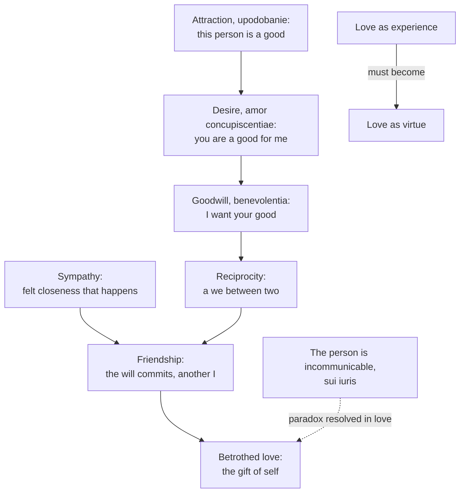

# Phenomenology & Personalism · Lesson 5.3: The anatomy of love

> ⏱ ~15 min · Module 5: Wojtyła: the acting person · Builds on: [5.2 The personalistic norm](05-02-the-personalistic-norm.md), [4.2 Scheler: sympathy, love and the person](04-02-scheler-sympathy-love-and-the-person.md) · Unlocks: [5.4 Action reveals the person](05-04-action-reveals-the-person.md)

## Why this matters

[5.2](05-02-the-personalistic-norm.md) ended with a demand: the only adequate response to a person is love. Unless "love" is given a content, the norm says nothing, since everyone who uses another calls it love. Chapter II of *Love and Responsibility* (Polish *Miłość i odpowiedzialność*, 1960; chapter title "The Person and Love") supplies the content. It takes love apart into elements, some of which happen to us and some of which we do. It argues that love is complete only when the will commits, and at its fullest when a person gives himself. That analysis is the philosophy under the theology of the body, and it answers Scheler on whether love is a movement of feeling or an act of will.

## The idea

Think of an anatomy lesson: the body is one thing, but you learn it by naming its parts and seeing how each depends on the others. Wojtyła does this to love in three passes: a general ("metaphysical") analysis of its elements, a psychological analysis of the raw material, and an ethical analysis. Throughout, paraphrase follows H. T. Willetts's translation (1981); Grzegorz Ignatik's (2013) renders several terms differently, so the Polish is given as the fixed point.

**Elements in the subject.** Three belong to the one who loves.

- **Attraction** (*upodobanie*). One person takes another as a good, through some value seen in her: intelligence, beauty, kindness. It engages knowledge and emotion, and already the will. Its danger is untruth: feeling can fasten on values the person does not have, or on one value instead of the person who has it. The scholastics' name is *amor complacentiae*.
- **Desire** (*pożądanie*; *amor concupiscentiae*). "You are a good for me." A human being is limited and needs others, so desire belongs to love. Wojtyła separates *love* as desire, which wants the person as a good, from *concupiscence*, the sensual craving that wants an experience. Let desire rule, and the other slides into the second sense of [use](../reference.md#two-senses-of-use): enjoyment.
- **Goodwill** (*życzliwość*; *benevolentia*). "I want your good," for your sake. Wojtyła treats it as love in its most unconditional sense, and says desire must be joined to it, not abolished by it.

**Elements between persons.** Love is bilateral, something *between* two people.

- **Reciprocity** (*wzajemność*). Two loves meet and a "we" forms. Following Aristotle (*Nicomachean Ethics* VIII), Wojtyła asks what the reciprocity rests on. If it rests on usefulness or pleasure, each side suspects the other's love is a calculation, and jealousy follows. If it rests on goodwill toward a true good, it breeds trust.
- **Sympathy and friendship.** Sympathy (*sympatia*, "feeling-with") is emotional closeness that *happens* to two people: warm, passive, and subjective, because it rests on feeling more than on knowing the person. Friendship (*przyjaźń*) is where the will plays the decisive part: I want your good as I want my own, and you become "another I". Wojtyła treats the move from one to the other as the task: sympathy must ripen into friendship, and he adds that friendship without sympathy's warmth turns cold. Comradeship, closeness founded on shared work or circumstance, sits beside them.
- **Betrothed love** (*miłość oblubieńcza*, from the biblical bride and bridegroom). It differs from every other form: it gives not something but *oneself*. That is a paradox, because 5.2's person is [incommunicable](../reference.md#incommunicability) (*alteri incommunicabilis*), master of himself, and cannot be owned or handed over. What the order of nature rules out, the order of love achieves: the free gift of self. Wojtyła holds that the giver is not diminished but finds a fuller existence by going out of himself (the "law of ekstasis"). Betrothed love has a human form, mutual self-gift in marriage, and a religious form, the gift of self to God, which chapter IV discusses.

**The other two passes, briefly.** The psychological analysis finds the raw material: *sensuality* (*zmysłowość*), which responds to the body as a possible object of enjoyment, and *affectivity* (*uczuciowość*), which longs for nearness and tends to idealize. Neither is love yet; both must be integrated. The ethical analysis distinguishes **love as experience** (what is felt) from **love as virtue**: a commitment of the will that affirms the value of the person and accepts responsibility for her and for the love itself. That is the book's title in miniature. Chapter III ("The Person and Chastity") then names chastity as the virtue that frees love from the attitude of use, and shame as the person's natural concealment of sexual values, protecting her from being taken as an object. Its teaching on sexuality belongs to [`moral-theology`](../../moral-theology/lessons/06-01-the-theology-of-the-body-and-chastity.md) and is not argued here.

**The contrast with Scheler.** For Scheler ([4.2](04-02-scheler-sympathy-love-and-the-person.md)), love is not an act of will at all:

> Choosing [*Wählen*] relates only ever to willing-to-do, never to objects as such. [...] Love is rather the intentional movement [*intentionale Bewegung*] in which, from a given value A of an object, the appearance of its higher value is realized.

(Translation ours, from the 1926 German, *Wesen und Formen der Sympathie*, 3rd ed., p. 177.) Wojtyła keeps Scheler's value-seeing in attraction and lets love's apex fall in the will, whose efficacy [5.1](05-01-wojtyla-and-scheler.md) found missing from Scheler's ethics.

## The argument

1. **A person is someone, not something: an interior, self-determining subject** ([5.2](05-02-the-personalistic-norm.md)).
2. **The only adequate response to a person is love** (the [personalistic norm](../reference.md#personalistic-norm)).
3. **Attraction and desire take the other as a good *for me*.** *In words:* on their own, they are compatible with use.
4. **Goodwill wills the other's good for her sake.** *In words:* this is the element that makes love adequate to a person.
5. **Reciprocity is stable only when it rests on goodwill toward a true good, not on utility or pleasure.**
6. **Sympathy happens to us; friendship is done by the will, and only what the will does can be answered for.** *In words:* love that is to meet a norm must be more than a feeling.
7. **A person is incommunicable: no one can own or transfer him.**
8. **Yet goodwill can reach the point of giving not a good but oneself, and only a free, self-possessing subject can make that gift.**
9. **∴ Love's fullest form is betrothed love: a free, mutual gift of self in which the person is fulfilled, not lost.**

**Where the argument is weakest.** Premise 8, the step from incommunicability to self-gift. Philosophers who doubt "union" accounts of love press it; Marilyn Friedman (1998) argues that merging two selves into a "we" threatens each one's autonomy, and proposes love as a federation instead of a fusion. Turned on Wojtyła (Friedman does not discuss him), the worry becomes a dilemma: if "giving oneself" is literal, it surrenders the self-governance that premise 7 says cannot be surrendered; if it is a metaphor, betrothed love is only friendship plus exclusivity, and the analysis has added a word, not a form. The defender replies that the gift is an act of self-determination, not its abdication: only one who possesses himself can give himself ([5.4](05-04-action-reveals-the-person.md)), and the receiver gains no ownership, only a gift that remains the giver's free act. Whether that reply finds a third option or names the metaphor more carefully is the open question.

## Picture

The top three nodes live in the subject; reciprocity, friendship and betrothed love live between persons. The dashed edge marks the paradox the argument's premise 8 must carry. The bottom pair is the ethical analysis, which runs alongside the whole ladder.

## Worked examples

**Example 1 (clean: a courtship traced).** Nadia hears Sam sing in a choir and is struck by his voice and his dry humour: *attraction*, fixed on real values, so far truthful. She wants his company and finds her week better for it: *desire*, wanting him as a good for her. When Sam is offered a post abroad that would end their evenings, she urges him to take it: *goodwill*, his good willed for his sake against her own interest. He turns it down for reasons of his own and tells her she matters to the choice: *reciprocity*, and because each has shown goodwill, it breeds trust rather than suspicion. Their easy closeness (*sympathy*) becomes something each now chooses and answers for (*friendship*). When they marry, each gives not time or help but himself or herself to the other: *betrothed love*. Every element is present, and the order of the ladder matches the order of the story.

**Example 2 (hard: love with nothing coming back).** Marek has visited Lev, his friend of forty years, every week since Lev's dementia advanced. Lev no longer knows him. The *sympathy* is gone on Lev's side and fading on Marek's; there is no *reciprocity* to speak of, and Marek *desires* nothing from the visits. What remains is *goodwill* and the will's commitment: by the ethical analysis, love as virtue without love as experience.

Here the anatomy strains. Wojtyła says love between persons is bilateral, yet the purest case of goodwill in this story is one-sided. His side can reply that reciprocity once formed a "we" that Marek's fidelity keeps, and that goodwill is love's purest form whether or not it is returned. A critic from the other direction, Anders Nygren in *Agape and Eros* (English edition 1953), would say Marek's love is love *because* desire has dropped out: Christian love (*agape*) is for Nygren spontaneous and unmotivated by the other's value, and desire-love (*eros*) is acquisitive and its rival. Wojtyła, with Aquinas, makes desire part of love's structure. The case does not decide between them; it shows where each locates love's essence.

## Watch out

- **You might think Wojtyła's "sympathy" is Scheler's, but the term changes hands.** Scheler's fellow-feeling (*Mitgefühl*, [4.2](04-02-scheler-sympathy-love-and-the-person.md); [forms of fellow-feeling](../reference.md#forms-of-fellow-feeling)) is a feeling directed at *another's* feeling: my sorrow at your sorrow. Wojtyła's *sympatia* is a felt mutual affinity between two people, the emotional closeness that precedes friendship. Neither is the everyday "pity".
- **You might think "love as desire" means lust, but Wojtyła separates them.** He borrows *amor concupiscentiae* from Aquinas (ST I-II q.26 a.4, where it is set against *amor amicitiae*) for wanting the person as a good for me; concupiscence wants the sensation. The first is part of love; the second, unintegrated, is the path to use.
- **You might think "betrothed love" means being engaged, or simply marriage.** *Oblubieńcza* is from the biblical bride and bridegroom, and the term names any total gift of self, including the religious gift of self to God. Its marital form is where moral theology picks the analysis up; the book's later chapters, and the personalist defence of the *Humanae Vitae* norm that draws on them, are argued there, not here.

## One-liner

> Love, for Wojtyła, is a ladder from attraction and desire through goodwill and friendship to the gift of self, and it becomes love proper only where the will commits to the other's good.

## Problems

**P1 (🟢) *(Exegetical (a) · Evaluative (b).)*** Apply to a hard case. Ines and Oskar met as rival entrants at a regional chess club. Each admired the other's play and enjoyed the evenings; for three years they have travelled to tournaments together and split costs. Last spring Oskar lost his job, and Ines quietly paid his entry fees, telling no one. Oskar found out and has since spent weekends helping her through a hard move, though he dislikes the work. Neither has said much about any of it, and they still spar sharply over the board.

(a) Which of Wojtyła's elements of love are present, and where is the relationship between sympathy, comradeship and friendship? One or two sentences per element you name. (b) A reader says the shared tournaments prove only comradeship. Where does Wojtyła's analysis stop deciding the question? 100 words or fewer.

**P2 (🟡) *(Exegetical (a) · Evaluative (b).)*** Diagnose. An invented newspaper column:

> Love is chemistry. You do not choose whom you are drawn to; it happens to you, like weather. That is why vows are a kind of dishonesty: you cannot promise to keep feeling something. When the attraction fades, the honest thing is to admit that the love has ended. Blaming people for falling out of love is like blaming them for catching a cold.

(a) Name three places where the column's account of love differs from Wojtyła's analysis, using his terms. One or two sentences each. (b) The columnist replies: "The will cannot command feelings, so a love located in the will is not love but duty." Is that a good objection to Wojtyła? Any verdict; 120 words or fewer.

**P3 (🔴) *(Exegetical (a) · Evaluative (b).)*** Find the crux. An invented philosopher, the "affinity theorist", holds that love simply *is* mutual felt affinity: commitments may accompany it, but they are contracts, not love. Wojtyła holds that sympathy must become friendship, in which the will decides.

(a) Name the single premise about love on which the two part ways, and say which side must deny it. Two sentences. (b) What consideration, argument or case would move a reasonable person from one side to the other? Name one for each direction. 120 words or fewer.

Solutions

**P1** *(Exegetical (a) · Evaluative (b).)*

**Accept:** any assignment of elements that is grounded in the case's details and uses Wojtyła's senses of the terms; the boundary between comradeship and friendship may be placed either way in (b) if the criterion is stated.

**Must hit, strict (a):**

- *Attraction*: each admired the other's play, a value really present, so the attraction is truthful.
- *Desire*: each finds the evenings good for himself or herself; the shared costs show a useful side.
- *Goodwill*: Ines pays Oskar's fees for his sake and tells no one; Oskar helps her though he dislikes the work. Each wills the other's good at a cost.
- *Reciprocity*: the goodwill runs both ways, and rests on more than utility or pleasure, so it should breed trust.
- *Sympathy* (felt affinity) is present but understated; *comradeship* describes the tournaments (shared activity); the hidden payment and the weekend help are acts of will, the mark of *friendship*.
- *Betrothed love* is absent: nothing in the case is a gift of self.

**Must hit, any verdict (b):**

- State Wojtyła's criterion: friendship is where the will commits to the other's good as to one's own, and comradeship is closeness grounded in a shared activity or circumstance.
- Say where it stops deciding: the analysis gives no threshold for how many or how costly acts of goodwill turn comradeship into friendship, and both friends are reticent, so the case cannot show what each takes the acts to mean.

**Wrong turns:** reading "sympathy" as pity for Oskar's job loss (that is the everyday sense, not Wojtyła's affinity). Treating split costs as goodwill; they are fair exchange, compatible with utility alone. Calling the hidden payment betrothed love because it is generous.

**Model answer (b), one of several:** Wojtyła's line runs through the will: comradeship rests on the shared tournaments; friendship begins where each commits to the other's good as his own. The fees and the weekends look like such commitments, so the reader is probably too quick. But the analysis gives no measure of how much goodwill is enough, and Ines and Oskar never say what they intend. One act of help could be a comrade's decency. What the analysis can say is which facts would settle it (whether the help would continue without the club), not that it is settled.

---

**P2** *(Exegetical (a) · Evaluative (b).)*

**Must hit, strict (a):**

Any three of:

- It reduces love to *attraction* (*upodobanie*), one element among several, and the only one the column admits.
- It treats love only as *experience* and never as *virtue*: for Wojtyła love becomes complete in the will's affirmation of the person.
- It stops at *sympathy*, closeness that happens to us, and denies the move to *friendship*, where the will decides.
- It drops *goodwill*: "the love has ended" when *my* attraction fades makes love a good for me (desire) without willing the other's good.
- It removes *responsibility*: for Wojtyła one answers for one's love, which is the point of the book's title.

**Must hit, any verdict (b):**

- State the objection at strength: feelings are not under direct voluntary control, so a love defined by an act of will looks like duty dressed as love.
- Give Wojtyła's reply: love as virtue does not command feeling; it is the will's commitment to the person's good, and it integrates feelings (sympathy, affectivity) rather than replacing them. Friendship without sympathy turns cold, which he grants.
- Judge whether the reply works: does integrating feeling answer the "mere duty" charge, or concede that the will-part could exist without love's warmth?

**Wrong turns:** answering that Wojtyła thinks feelings are bad or irrelevant (he calls them love's raw material). Treating (b) as settled by noting the column ignores the will; the objection is about whether the will *can* carry love.

**Model answer (b), one of several:** It is a fair objection with a target slightly off. Wojtyła agrees the will cannot summon feelings; his claim is that love is complete only when the will commits to the other's good, with the feelings integrated into that commitment rather than ordered into being. So the vow promises what is in one's power: to keep willing her good and to tend the relationship in which feeling can live. The objection keeps some bite: if the feeling goes for good and only the commitment remains, is that love or loyalty? Wojtyła would call it love as virtue; the columnist would call it duty. The disagreement is about where to put love's essence, not about psychology.

---

**P3** *(Exegetical (a) · Evaluative (b).)*

**Accept:** any formulation that makes the will's commitment (or answerability) constitutive of love, and assigns the denial correctly.

**Must hit, strict (a):**

- The crux: whether love, in its complete form, includes an act of will by which one commits to the other's good and can answer for it.
- The affinity theorist denies it (commitment is an add-on, a contract); Wojtyła affirms it (sympathy must become friendship).

**Must hit, any verdict (b):**

- Toward Wojtyła: a case like a lifelong friendship that survives the loss of felt affinity, which we still call love; or the point that we praise and blame people for how they love, which requires that love be partly up to them.
- Toward the affinity theorist: cases where commitment persists without any warmth and we hesitate to call it love; or the claim that love's distinctive phenomenology is passive, something that happens (which Scheler shares when he denies love is choosing).
- Each consideration must bear on the crux premise, not on a side issue.

**Wrong turns:** stating the crux as "whether feelings matter"; both sides agree they do. Naming Scheler as the affinity theorist; Scheler denies that love is choosing, but he does not reduce love to felt affinity either: it is a movement toward higher value.

**Model answer (b), one of several:** Toward Wojtyła: we blame people for loving badly, for neglect or betrayal, and blame needs something in their power; affinity is not, commitment is. Toward the affinity theorist: picture a marriage kept by resolve alone, every duty discharged and no warmth on either side. Many hesitate to call that love, which suggests the felt element is not optional. A reasonable person moves according to which intuition proves firmer under pressure.

## Flashback

**From Lesson [5.1](05-01-wojtyla-and-scheler.md) (Wojtyła and Scheler):** *(Exegetical (a) · Evaluative (b).)* Counterexample. Scheler holds that every ought is founded on a value, and that the ought of duty, an ought addressed to a will, arises only where that will's striving is not already directed at the value: an experienced "I must" marks resistance. (a) Build a short case in which someone experiences "I must" with no resistance at all, and name the datum Wojtyła says Scheler's system misses that your case is meant to show. 60 words or fewer. (b) Give the Schelerian's best reply, and say whether your case survives it. Any verdict; 100 words or fewer.

Solution

**Must hit, strict (a):**

- The striving is wholly directed at the value: no reluctance, contrary inclination or competing pull anywhere in the case.
- The experience is an "I must" addressed to the agent's own will ("this is mine to do"), not merely "this ought to be" or "I want to".
- The target datum: obligation as original, a claim on the agent's freedom that is not a sign of resistance.

**Must hit, any verdict (b):**

- State the reply in Scheler's terms: what the case shows is an *ideal* ought ("this ought to be"), founded on the value and felt vividly, which needs no resistance; no ought of duty is present, so nothing contradicts him. A Schelerian may add that any felt "must" carries the awareness that one *could* fail, which is resistance in germ.
- Test the case against the distinction the reply relies on: the ideal ought is impersonal ("Injustice ought not to be"), the ought of duty addressed to a will ("You ought not to do injustice"). Does the case's "must" have the second form?
- A one-line verdict, saying what would settle it: whether careful description finds a first-person "I must" that is neither the impersonal ideal ought nor a trace of resistance.

**Wrong turns:** building in any reluctance (tiredness, a tempting alternative); the "I must" is then Scheler's own ought of duty, and the case confirms him. Naming efficacy as the target datum; the case bears on obligation, though adding efficacy is no error. Saying Wojtyła's "I must" replaces the value; on his view the norm takes up the value and adds a claim on freedom. Saying Scheler denies that values bind at all; he gives them the ideal ought.

**Model answer (a):** A father, wide awake at 3 a.m., hears his baby cry with fever. He wants nothing more than to go to her, and nothing pulls him elsewhere. Yet he experiences going as his to do, "I must", not only "I want to". The case is meant to show obligation as an original datum, not a sign of resistance.

**Model answer (b), one of several:** The Schelerian says the father feels, very vividly, the ideal ought founded on the child's vital and personal value ("she ought to be cared for"), and that no ought of duty appears because nothing resists. The case survives only if his "must" singles *him* out. It seems to: he would feel bound to go even with a nurse beside him who could go instead, and "she ought to be cared for" does not say who. The Schelerian replies that "mine" comes from the value of the bond between father and child, not from an obligation. There the question stays open.

## Connections

- **Backward:** the personalistic norm, the two senses of "use" and the incommunicable person come from [5.2](05-02-the-personalistic-norm.md). The objection that Scheler's ethics lacks the will is [5.1](05-01-wojtyla-and-scheler.md); Scheler's account of love as a movement toward higher value and his forms of fellow-feeling are [4.2](04-02-scheler-sympathy-love-and-the-person.md). The scholastic names (*amor complacentiae*, *concupiscentiae*, *benevolentiae*) come from the medieval vocabulary of love, with the division of *amor concupiscentiae* and *amor amicitiae* from Aquinas (ST I-II q.26 a.4); the types of reciprocity are Aristotle's friendships of utility, pleasure and virtue.
- **Forward:** "only one who possesses himself can give himself" needs the self-possession and self-determination of [5.4](05-04-action-reveals-the-person.md); the integration of sensuality and affectivity into love previews integration in [5.5](05-05-integration-participation-and-the-bridge.md).
- **Sideways:** [`moral-theology` 6.1](../../moral-theology/lessons/06-01-the-theology-of-the-body-and-chastity.md) assumes this lesson's love as self-gift for the theology of the body and chastity. [`moral-theology` 6.2](../../moral-theology/lessons/06-02-humanae-vitae-the-argument.md) is where *Love and Responsibility* is put to work in a personalist defence of the *Humanae Vitae* norm; that argument, and the Church's teaching on sexuality, are taught there, not here. The volitional account of love in recent analytic philosophy (Harry Frankfurt) is a cousin of the will-centred side of this lesson. Cards: [elements of love](../reference.md#elements-of-love), [betrothed love](../reference.md#betrothed-love), [sympathy and friendship](../reference.md#sympathy-and-friendship), [love as experience and love as virtue](../reference.md#love-as-experience-and-love-as-virtue).
